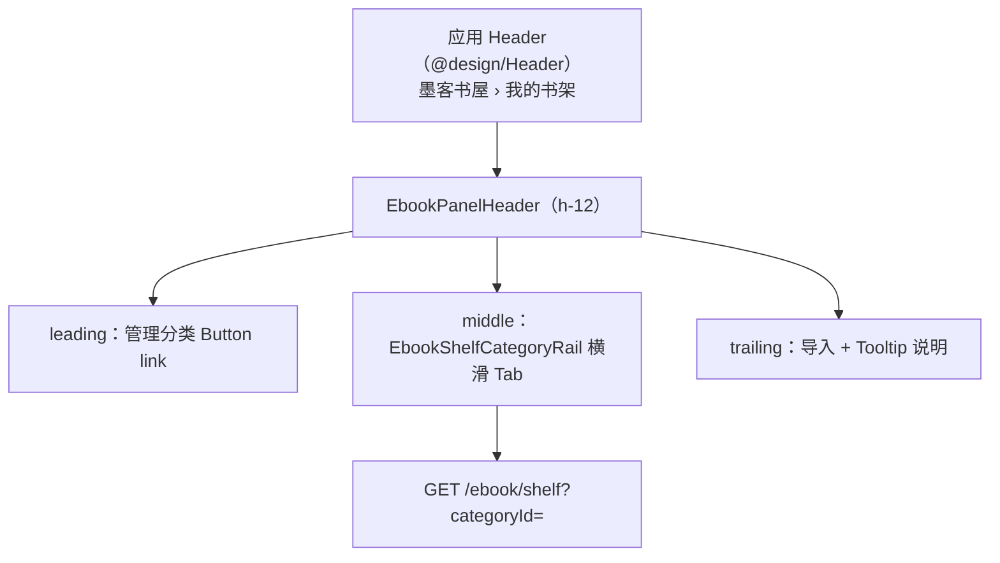

# 电子书书架分类

> **文档角色**：**我的书架**（`/ebook`）按用户自定义分类分组浏览、筛选、移动书籍；服务端 per-user 分类 CRUD + `categoryId` 字段。  
> **影响面（空 Tab / 自动回全部 / 卡片 Tooltip）**：[电子书书架空标签重置影响.md](../impact/电子书书架空标签重置影响.md)  
> **实现说明（本轮）**：[电子书书架空标签重置影响.md](./电子书书架空标签重置影响.md)  
> **延伸阅读**：[电子书阅读书架.md](./电子书阅读书架.md)（书架主文档）、[电子书会员上传.md](./电子书会员上传.md)（导入与会员策略）。  
> **产品 SPEC（验收条款）**：`apps/frontend/specs/电子书书架分类.md`（开发向，非用户文档）。

若与仓库最新源码不一致，**以源码为准**。

---

## 1. 背景与目标

### 1.1 用户问题

书架书籍增多后，单一长列表难以按「技术 / 学习 / 小说」等用途查找；需要在 **不改变阅读引擎** 的前提下增加 **分组 + 筛选**。

### 1.2 一期目标

| # | 能力 |
|---|------|
| 1 | **应用主顶栏**面包屑 **墨客书屋 › 我的书架**（与阅读页 **墨客书屋 › 阅读** 一致） |
| 2 | 书架区内栏 **分类 Tab**：全部 / 各分类 / 未分类，带册数，可横滑 |
| 3 | 分类 **新建、重命名、删除、排序**（最多 50 个） |
| 4 | 书籍 **移动到分类**；**删除分类后书籍归入未分类**（服务端显式 `category_id = NULL`） |
| 5 | 导入时默认归入 **当前选中分类** 或 **上次选用**（localStorage） |
| 6 | `GET /ebook/shelf?categoryId=` 服务端分页筛选 |
| 7 | 换号登录清空分类与筛选状态 |

---

## 2. 改动范围

### 2.1 后端

| 路径 | 说明 |
|------|------|
| `apps/backend/src/services/ebook/ebook-category.entity.ts` | **新增** 分类表 |
| `apps/backend/src/services/ebook/ebook-book.entity.ts` | `categoryId` 可空 |
| `apps/backend/src/migrations/1781766035350-ebook_category.ts` | 建表 + `category_id` 列（**初版无 FK**） |
| `apps/backend/src/services/ebook/ebook.service.ts` | CRUD、summary、assign、shelf 筛选、**删分类前清空书籍 categoryId** |
| `apps/backend/src/services/ebook/ebook.controller.ts` | REST 路由 |
| `apps/backend/src/services/ebook/dto/*-ebook-category*.ts` | DTO |

### 2.2 前端

| 路径 | 说明 |
|------|------|
| `apps/frontend/src/router/routes.ts` | index 路由 `titleKey: route.ebook.shelf` → 全局面包屑第二级 |
| `apps/frontend/src/store/ebook.ts` | 分类 state、筛选、导入默认、**删分类后本地 categoryId 置空** |
| `apps/frontend/src/views/ebook/index.tsx` | 区内栏：管理分类 \| 分类 Rail \| 导入（Tooltip 说明） |
| `apps/frontend/src/views/ebook/components/EbookPanelHeader.tsx` | `leading` / `middle` / `trailing` 三槽（无竖线分隔） |
| `apps/frontend/src/views/ebook/components/EbookShelfCategoryRail.tsx` | 分类 Tab 菜单 |
| `apps/frontend/src/views/ebook/components/EbookCategoryManageDialog.tsx` | 管理弹窗 |
| `apps/frontend/src/views/ebook/components/EbookShelfBookCard.tsx` | 书名行「移动到分类」Popover |
| `apps/frontend/src/components/design/Model/index.tsx` | 管理分类弹窗遮罩（轻 blur） |
| `apps/frontend/src/components/ui/dialog.tsx` | `DialogContent.overlayClassName` |
| `apps/frontend/src/service/index.ts` | API 封装（分类 CRUD `silent: true`） |
| `apps/frontend/src/i18n/locales/zh-CN.ts`、`en-US.ts` | 文案 |

---

## 3. 界面信息架构



**与阅读页对齐**：

- 全局顶栏由 `routes.ts` 的 `meta.titleKey` 链生成面包屑（见 `@design/Header` 的 `findBreadcrumbTrail`）。
- 书架 index 使用 `route.ebook.shelf`（我的书架），阅读子路由使用 `route.ebook.read`（阅读）。
- **不再**在 `EbookPanelHeader` 重复显示「我的书架」标题；册数显示在 **分类 Tab 徽章** 上，而非标题旁。

---

## 4. 实现思路

1. **实体**：`ebook_category(user_id, name, sort_order)`；`ebook_book.category_id` 可空。
2. **summary**：一次返回 categories + 各 `bookCount` + `uncategorizedCount` + `totalBookCount`。
3. **shelf 查询**：`categoryId` 与 `uncategorizedOnly` 互斥；非法 id 404。
4. **删分类**：**必须先** `UPDATE ebook_book SET category_id = NULL WHERE category_id = ?`（初版迁移无 FK，仅 `remove(row)` 会留下孤儿 id，未分类 Tab 查不到书）。
5. **导入**：`add-path` / `upload` 可选 `categoryId`；Store `resolveImportCategoryId()` 读 active 或 localStorage。
6. **换号**：`resetOnUserSwitch` 清空 categories 与 `activeCategoryKey`。

---

## 5. 关键代码与注释

### 5.1 路由：全局面包屑第二级

**来源**：`apps/frontend/src/router/routes.ts`（`/ebook` 子路由 index，`meta.titleKey`）

```typescript
{
	path: '/ebook',
	Component: EbookLayout,
	meta: { titleKey: 'route.ebook.title' }, // 说明：第一级「墨客书屋」
	children: [
		{
			index: true,
			Component: Ebook,
			meta: { titleKey: 'route.ebook.shelf' }, // 说明：第二级「我的书架」，与父级不同 key 才会出现面包屑
		},
		{
			path: 'read/:bookId',
			meta: { titleKey: 'route.ebook.read' }, // 说明：阅读页第二级为「阅读」
		},
	],
}
```

### 5.2 后端：删除分类时书籍归入未分类

**来源**：`apps/backend/src/services/ebook/ebook.service.ts`（`removeCategory`，约 L654–L664）

```typescript
async removeCategory(userId: number, categoryId: string): Promise<void> {
	const row = await this.categoryRepo.findOne({
		where: { id: categoryId, userId },
	});
	if (!row) throw new NotFoundException('分类不存在');

	// 说明：1781766035350 迁移仅 ADD COLUMN，未建 ON DELETE SET NULL 外键；
	//       若不显式清空，书的 category_id 仍指向已删 UUID，「未分类」Tab（IS NULL）看不到这些书。
	await this.bookRepo.update({ userId, categoryId }, { categoryId: null });

	await this.categoryRepo.remove(row);
}
```

### 5.3 后端：默认分类与 summary

**来源**：`apps/backend/src/services/ebook/ebook.service.ts`（`ensureDefaultCategories` / `getCategoriesSummary` 附近）

```typescript
const DEFAULT_CATEGORY_NAMES: Record<'zh-CN' | 'en-US', string[]> = {
	'zh-CN': ['技术', '学习', '文学', '工作', '其他'],
	'en-US': ['Tech', 'Learning', 'Literature', 'Work', 'Other'],
};

private async ensureDefaultCategories(userId, locale?) {
	const count = await this.categoryRepo.count({ where: { userId } });
	if (count > 0) return; // 说明：仅零分类新用户 seed，不覆盖老用户
	// ... save 5 行预设分类
}
```

### 5.4 后端：书架按分类筛选

**来源**：`apps/backend/src/services/ebook/ebook.service.ts`（`getShelf` 内 where 构建）

```typescript
if (query.categoryId && query.uncategorizedOnly) {
	throw new BadRequestException('categoryId 与 uncategorizedOnly 不能同时使用');
}
const where: FindOptionsWhere<EbookBook> = { userId };
if (query.categoryId) {
	// 说明：校验分类属于当前用户
	where.categoryId = query.categoryId;
} else if (query.uncategorizedOnly) {
	where.categoryId = IsNull();
}
```

### 5.5 前端 Store：删分类后同步本地列表

**来源**：`apps/frontend/src/store/ebook.ts`（`deleteCategory`，约 L313–L333）

```typescript
async deleteCategory(id: string): Promise<void> {
	await removeEbookCategory(id);
	runInAction(() => {
		if (this.activeCategoryKey.kind === 'category' &&
			this.activeCategoryKey.categoryId === id) {
			this.activeCategoryKey = { kind: 'all' };
		}
		const clearCat = (b: Book) =>
			b.categoryId === id ? { ...b, categoryId: null } : b;
		this.books = this.books.map(clearCat);
		// 说明：bookCache 同步，避免阅读页仍带旧 categoryId
		for (const bookId of Object.keys(this.bookCache)) {
			if (this.bookCache[bookId]?.categoryId === id) {
				this.bookCache[bookId] = clearCat(this.bookCache[bookId]);
			}
		}
	});
	await Promise.all([this.fetchCategories(), this.fetchPage(1, false)]);
}
```

### 5.6 前端：区内栏布局

**来源**：`apps/frontend/src/views/ebook/index.tsx`（`EbookPanelHeader` 用法，约 L217–L284）

```typescript
<EbookPanelHeader
	className="px-4.5"
	leading={
		<Button variant="link" size="sm" className="h-8 shrink-0 gap-1.5 px-0!" /* ... */>
			<Settings2 /> {t('ebook.shelf.category.manage')}
		</Button>
	}
	middle={<EbookShelfCategoryRail />}
	trailing={
		<Tooltip content={importHint} /* 会员/Web/Tauri 导入说明 */>
			<Button variant="link" size="sm" className="h-8 shrink-0 gap-1.5 px-0!">
				{/* 选择本地文件 / 导入文件 */}
			</Button>
		</Tooltip>
	}
/>
// 说明：leading / middle / trailing 之间无 border-l；导入说明从原 header 文案迁入 Tooltip
```

### 5.7 前端：分类 Rail（Tab + 横滑）

**来源**：`apps/frontend/src/views/ebook/components/EbookShelfCategoryRail.tsx`（约 L47–L94）

```typescript
// 说明：ghost Button 作 Tab，无 hover 背景块；选中项文字 text-textcolor，未选中 /60
// 册数徽章：选中 teal-600 实心白字，未选中 bg-theme/10
<Button
	role="tab"
	variant="ghost"
	className={cn(
		'h-8 shrink-0 gap-1.5 px-2.5 font-medium hover:bg-transparent',
		active ? 'text-textcolor' : 'text-textcolor/60 hover:text-textcolor',
	)}
	onClick={() => ebookStore.setActiveCategoryKey(chip.key)}
>
	<span className="max-w-28 truncate">{chip.label}</span>
	<span className={cn(/* 选中 teal 实心 / 未选中浅底 */)}>{chip.count ?? '–'}</span>
</Button>
// 外层 overflow-x-auto + 隐藏滚动条 → 分类多时可左右滑动
```

### 5.8 前端：管理分类弹窗（Model + ScrollArea）

**来源**：`apps/frontend/src/views/ebook/components/EbookCategoryManageDialog.tsx`（约 L191–L211、`onAdd`）

```typescript
// 说明：复用 @design/Model（与知识库 LibraryEditDialog 一致），footer={null} 隐藏默认确定/取消
<Model open={open} onOpenChange={onOpenChange} width="35rem" footer={null} header={/* 自定义标题 */}>
	<ScrollArea
		ref={listScrollRef}
		className="max-h-72 -mx-4.5 w-[calc(100%+2.25rem)]" // 说明：负边距让滚动条贴弹窗右缘
	>
		{/* 列表项：卡片化 + 横向 Chevron 排序 + 重名 Toast 统一 */}
	</ScrollArea>
</Model>

// 添加成功后：双 rAF 滚到底部 + addInputRef 重新聚焦，便于连续添加
await ebookStore.createCategory(name);
scrollListToBottom();
focusAddInput();
```

**来源**：`apps/frontend/src/service/index.ts`（`createEbookCategory` / `updateEbookCategory` / `removeEbookCategory`）

```typescript
// 说明：分类接口 silent: true，避免全局 http 拦截器与弹窗内 showCategoryNameError 重复 Toast
const res = await http.post<EbookCategory>(EBOOK_CATEGORIES, { name }, { silent: true });
```

**来源**：`apps/frontend/src/components/design/Model/index.tsx`（约 L14–L18、L64）

```typescript
// 说明：遮罩 bg-theme-background/35 + 极轻 backdrop-blur-[2px]，便于仍看清下层书架
const MODEL_OVERLAY_CLASS = cn('bg-theme-background/35', 'supports-[backdrop-filter:blur(0)]:backdrop-blur-[2px]');
<DialogContent overlayClassName={MODEL_OVERLAY_CLASS} /* ... */ />
```

### 5.9 前端：书名行「移动到分类」（Popover + ScrollArea）

**来源**：`apps/frontend/src/views/ebook/components/EbookShelfBookCard.tsx`（约 L254–L327、L610–L639）

```typescript
// 说明：移动入口在卡片**下方书名行右侧**（左 title、右 FolderInput），编辑书名时隐藏按钮、输入框占满宽
const showMoveCategory = Boolean(onMoveCategory && categories.length > 0);

<Popover open={categoryMenuOpen} onOpenChange={setCategoryMenuOpen}>
	<PopoverTrigger asChild>
		<button /* FolderInput 图标 */ aria-label={t('ebook.shelf.category.move')} />
	</PopoverTrigger>
	<PopoverContent side="bottom" align="end" className="w-48 overflow-hidden p-0">
		<ScrollArea
			className="max-h-56"
			onWheel={handleCategoryMenuWheel}           // 说明：阻止滚轮冒泡到书架列表
			onWheelCapture={handleCategoryMenuWheelCapture}
		>
			{categories.map((cat) => (
				<button disabled={book.categoryId === cat.id} onClick={() => assignCategory(cat.id)} />
			))}
			<button disabled={book.categoryId == null} onClick={() => assignCategory(null)}>
				{t('ebook.shelf.category.uncategorized')}
			</button>
		</ScrollArea>
	</PopoverContent>
</Popover>
// 说明：曾尝试 DropdownMenu + ScrollArea 无法滚动，故改 Popover（参考 ParamsHelpPopover / EpubReaderSettingsPopover）
```

### 5.10 前端：EbookPanelHeader 三槽布局

**来源**：`apps/frontend/src/views/ebook/components/EbookPanelHeader.tsx`（leading / middle / trailing）

```typescript
// 说明：h-12 区内顶栏三槽 flex，槽之间无竖线分隔
// leading：管理分类 link Button
// middle：EbookShelfCategoryRail（flex-1 min-w-0）
// trailing：导入 + Tooltip（会员/Web/Tauri 说明从原 header 文案迁入）
```

---

## 6. 兼容性与影响

| 维度 | 说明 |
|------|------|
| 存量数据 | 无 `category_id` 的书显示在「未分类」 |
| 历史孤儿 id | 若曾只删分类未清空字段，需 SQL 或运维脚本 `UPDATE ... SET category_id = NULL WHERE category_id NOT IN (...)` |
| 阅读/MOKE | 无改动 |
| 分页 | 切换分类重置 pageNo=1，total 随筛选变化 |
| 限制 | 每用户最多 50 分类；名称 trim 后同用户唯一（大小写不敏感） |

---

## 7. 回归建议

1. 新用户首次进书架，出现 5 个默认分类（中英文随 locale）。
2. 应用顶栏显示 **墨客书屋 › 我的书架**；阅读页为 **墨客书屋 › 阅读**。
3. 创建分类 → 移动书 → Tab 计数与列表 total 一致。
4. **删除含书的分类** → 书出现在 **未分类**，且「全部」仍可见。
5. 在「技术」Tab 下导入，新书 `categoryId` 正确。
6. 换号登录后 Tab 恢复「全部」，无上一用户分类名。
7. **管理分类**：新建后列表滚到底、输入框仍聚焦；重名仅弹一次 Toast；长分类名 truncate 不撑破弹窗。
8. **移动到分类**：书名右侧图标打开 Popover；分类列表可滚轮滚动；当前分类项 disabled；编辑书名时不显示移动按钮。

---

## 8. 相关源码路径

| 说明 | 路径 |
|------|------|
| 分类实体 | `apps/backend/src/services/ebook/ebook-category.entity.ts` |
| 业务逻辑 | `apps/backend/src/services/ebook/ebook.service.ts` |
| API | `apps/backend/src/services/ebook/ebook.controller.ts` |
| 路由 meta | `apps/frontend/src/router/routes.ts` |
| MobX | `apps/frontend/src/store/ebook.ts` |
| 区内栏 | `apps/frontend/src/views/ebook/index.tsx` |
| Rail UI | `apps/frontend/src/views/ebook/components/EbookShelfCategoryRail.tsx` |
| 管理弹窗 | `apps/frontend/src/views/ebook/components/EbookCategoryManageDialog.tsx` |
| 书名行移动 | `apps/frontend/src/views/ebook/components/EbookShelfBookCard.tsx` |
| 全局 Header | `apps/frontend/src/components/design/Header/index.tsx` |
