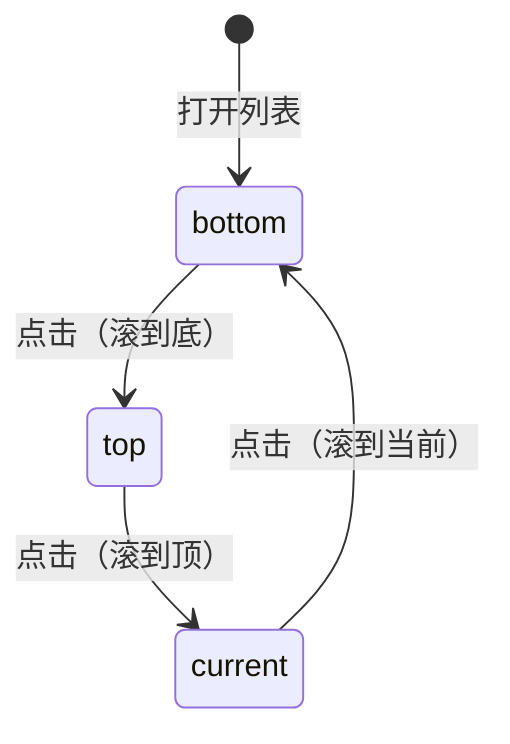

# 目录 / 分句列表三态滚动按钮

> **文档角色**：本轮增量——**书籍目录** 与听书 **分句** 列表共用「同一操作按钮」循环 **滚到底 → 滚到顶 → 滚到当前**，图标随状态切换。  
> **延伸阅读**：[电子书目录激活高亮.md](./电子书目录激活高亮.md)（目录高亮）、[EPUB听书播放器栏标尺UI.md](./EPUB听书播放器栏标尺UI.md)（分句虚拟列表与旧「仅滚到当前句」）、[EPUB Chrome列表激活主题.md](./EPUB Chrome列表激活主题.md)（列表选中色）。

## 1. 背景与目标

长目录（上千节）与长章分句（上千句）时，用户需要快速：

1. 滚到列表底部  
2. 滚到列表顶部  
3. 滚回当前阅读章 / 正在播放句  

目标：**同一圆形图标按钮**完成三种动作；每次点击执行当前态并切到下一态；**图标**（↓ / ↑ / 定位）与 **aria-label / Tooltip** 随状态变化。目录按钮在列表右下角；分句按钮在标题栏右侧（保留原 `bg-theme/5` 样式）。

## 2. 改动范围

| 路径 | 说明 |
| ---- | ---- |
| `apps/frontend/src/views/ebook/components/layout/EbookTocDrawer.tsx` | `TocScrollMode` 循环、ScrollArea viewport ref、右下角 FAB |
| `apps/frontend/src/views/ebook/components/listen/EpubListenPlayerBar.tsx` | `VirtualSentenceMenuList`：`SentenceScrollMode`、始终显示标题栏按钮 |
| `apps/frontend/src/i18n/locales/zh-CN.ts` | `ebook.read.tocScrollToBottom` / `Top` / `Current` |
| `apps/frontend/src/i18n/locales/en-US.ts` | 同上英文 |

## 3. 实现思路

1. **状态机**：`bottom → top → current → bottom`；打开抽屉 / 分句菜单时重置为 `bottom`。  
2. **目录**：`ScrollArea` 的 ref 指向 viewport，`scrollTo({ top })`；当前项用已有 `activeItemRef.scrollIntoView({ block: 'center' })`。  
3. **分句**：虚拟列表用 `scrollTop = 0 | maxScroll` 到边；当前句复用 `scrollToIndex(..., { force: true })`，并清 `userScrolledRef` 以恢复切句跟随。滚到顶/底时置 `userScrolledRef`，避免程序跟随抢滚动。  
4. **图标**：`ChevronDown` / `ChevronUp` / `LocateFixed`；分句按钮视觉与改前一致（`size-7`、`bg-theme/5`），仅行为与图标扩展。



## 4. 关键实现（改动前 / 改动后对比 + 注释）

### 4.1 `TocScrollMode` / `TOC_SCROLL_NEXT`（纯新增）

**对比范围**：类型与下一态表；基线无对应符号。

**改动前**：无（本轮新增）。

**改动后** · `apps/frontend/src/views/ebook/components/layout/EbookTocDrawer.tsx`（当前，约 L17–L24）

```typescript
// 目录列表滚动模式：底 / 顶 / 当前三项
/** 目录列表滚动：同一按钮循环 底 → 顶 → 当前 */
// 三态联合类型，供 useState 与 NEXT 表使用
type TocScrollMode = 'bottom' | 'top' | 'current';

// 点击后切到下一态的查表（避免 if 链）
const TOC_SCROLL_NEXT: Record<TocScrollMode, TocScrollMode> = {
	// 滚到底之后下一次滚到顶
	bottom: 'top',
	// 滚到顶之后下一次滚到当前章
	top: 'current',
	// 滚到当前之后回到滚到底
	current: 'bottom',
};
```

**变更摘要**：抽出与分句侧同构的三态循环表。

---

### 4.2 `EbookTocDrawer`（滚动 FAB 与 viewport）

**对比范围**：组件函数完整定义；列表项 `map` 渲染与改前相同处用对称 `// ...` 省略。

**改动前** · `apps/frontend/src/views/ebook/components/layout/EbookTocDrawer.tsx`（基线 HEAD，约 L24–L99）

```typescript
// EPUB/PDF 共用目录抽屉组件
export function EbookTocDrawer({
	// 抽屉是否打开
	open,
	// 打开状态变更回调
	onOpenChange,
	// 目录项数组
	items,
	// 当前阅读对应目录索引，默认 -1
	activeIndex = -1,
	// 选中某项后的跳转回调
	onSelect,
	// Portal 内阅读 chrome CSS 变量
	chromeStyle,
}: EbookTocDrawerProps) {
	// i18n 文案
	const { t } = useI18n();
	// 当前项按钮 DOM，用于打开时滚入视口
	const activeItemRef = useRef<HTMLButtonElement>(null);

	// 打开且有当前项时，下一帧把当前项滚到可见
	useEffect(() => {
		// 未打开或无当前项则跳过
		if (!open || activeIndex < 0) return;
		// rAF：等 Drawer/ScrollArea 布局完成再 scrollIntoView
		const id = requestAnimationFrame(() => {
			// nearest：尽量少动滚动条
			activeItemRef.current?.scrollIntoView({ block: 'nearest' });
		});
		// 清理未执行的 rAF
		return () => cancelAnimationFrame(id);
		// 依赖打开态、当前索引与列表内容
	}, [open, activeIndex, items]);

	// 渲染 Drawer
	return (
		// 标题「书籍目录」；body 紧凑上下 padding
		<Drawer
			title={t('ebook.read.toc')}
			open={open}
			onOpenChange={onOpenChange}
			bodyClassName="pt-1.5 pb-2"
			contentStyle={chromeStyle}
		>
			{/* 仅纵向 flex 容器，无相对定位、无 FAB */}
			<div className="flex h-full min-h-0 flex-col">
				{/* ScrollArea 无 viewport ref，无法程序化 scrollTo 顶/底 */}
				<ScrollArea className="box-border flex min-h-0 flex-1 flex-col pr-1.5">
					{/* ...（未改动）空态文案与 items.map 目录按钮列表至 ScrollArea 闭合 */}
				</ScrollArea>
			</div>
		</Drawer>
	);
}
```

**改动后** · `apps/frontend/src/views/ebook/components/layout/EbookTocDrawer.tsx`（当前，约 L37–L169）

```typescript
// EPUB/PDF 共用目录抽屉：增加三态滚动 FAB
export function EbookTocDrawer({
	// 抽屉是否打开
	open,
	// 打开状态变更回调
	onOpenChange,
	// 目录项数组
	items,
	// 当前阅读对应目录索引，默认 -1
	activeIndex = -1,
	// 选中某项后的跳转回调
	onSelect,
	// Portal 内阅读 chrome CSS 变量
	chromeStyle,
}: EbookTocDrawerProps) {
	// i18n 文案
	const { t } = useI18n();
	// 当前项按钮 DOM：打开时聚焦/滚入 + 「滚到当前」
	const activeItemRef = useRef<HTMLButtonElement>(null);
	// ScrollArea viewport：程序化滚到顶/底
	const scrollViewportRef = useRef<HTMLDivElement>(null);
	// 三态滚动：默认先「滚到底」
	const [scrollMode, setScrollMode] = useState<TocScrollMode>('bottom');

	// 每次打开抽屉重置为「滚到底」，避免沿用上次态
	useEffect(() => {
		// 关闭时不改，避免无意义 setState
		if (!open) return;
		// 重置循环起点
		setScrollMode('bottom');
		// 仅依赖 open
	}, [open]);

	// 打开且有当前项时，下一帧把当前项滚到可见（与改前一致）
	useEffect(() => {
		if (!open || activeIndex < 0) return;
		const id = requestAnimationFrame(() => {
			activeItemRef.current?.scrollIntoView({ block: 'nearest' });
		});
		return () => cancelAnimationFrame(id);
	}, [open, activeIndex, items]);

	// 按当前态取 aria-label / 无障碍文案
	const scrollLabel =
		scrollMode === 'bottom'
			? t('ebook.read.tocScrollToBottom')
			: scrollMode === 'top'
				? t('ebook.read.tocScrollToTop')
				: t('ebook.read.tocScrollToCurrent');

	// 点击 FAB：执行当前态滚动，再切到下一态
	const onScrollFabClick = () => {
		// 取 viewport
		const vp = scrollViewportRef.current;
		// 滚到底：smooth 到 scrollHeight
		if (scrollMode === 'bottom') {
			vp?.scrollTo({ top: vp.scrollHeight, behavior: 'smooth' });
			// 滚到顶：smooth 到 0
		} else if (scrollMode === 'top') {
			vp?.scrollTo({ top: 0, behavior: 'smooth' });
			// 滚到当前：当前项居中
		} else {
			activeItemRef.current?.scrollIntoView({
				block: 'center',
				behavior: 'smooth',
			});
		}
		// 推进状态机
		setScrollMode(TOC_SCROLL_NEXT[scrollMode]);
	};

	// 渲染 Drawer
	return (
		<Drawer
			title={t('ebook.read.toc')}
			open={open}
			onOpenChange={onOpenChange}
			bodyClassName="pt-1.5 pb-2"
			contentStyle={chromeStyle}
			// 打开时焦到当前项，避免默认焦第一项（版权页）像双选中
			onOpenAutoFocus={(e) => {
				// 无当前项则允许默认聚焦
				if (activeIndex < 0) return;
				// 阻止焦到第一项
				e.preventDefault();
				requestAnimationFrame(() => {
					// 焦当前项但不额外滚动（随后 nearest 对齐）
					activeItemRef.current?.focus({ preventScroll: true });
					activeItemRef.current?.scrollIntoView({ block: 'nearest' });
				});
			}}
		>
			{/* relative：右下角绝对定位 FAB */}
			<div className="relative flex h-full min-h-0 flex-col">
				{/* ref 接到 viewport，供 scrollTo */}
				<ScrollArea
					ref={scrollViewportRef}
					className="box-border flex min-h-0 flex-1 flex-col pr-1.5"
				>
					{/* ...（未改动）空态与 items.map 目录按钮列表至 ScrollArea 闭合 */}
				</ScrollArea>
				{/* 有目录项才显示 FAB */}
				{items.length > 0 ? (
					<Button
						type="button"
						variant="ghost"
						size="icon"
						// 半透明圆钮，略高于主题 /5 便于辨认
						className="absolute right-3.5 bottom-2 z-10 h-8.5 w-8.5 rounded-full border border-theme/10 bg-theme/20 text-textcolor/70 shadow-sm backdrop-blur-[2px] hover:bg-theme/30 hover:text-textcolor/85"
						aria-label={scrollLabel}
						onClick={onScrollFabClick}
					>
						{/* 图标随下一将执行的动作切换 */}
						{scrollMode === 'bottom' ? (
							<ChevronDown className="size-4" aria-hidden />
						) : scrollMode === 'top' ? (
							<ChevronUp className="size-4" aria-hidden />
						) : (
							<LocateFixed className="size-4" aria-hidden />
						)}
					</Button>
				) : null}
			</div>
		</Drawer>
	);
}
```

**变更摘要**：viewport ref + 三态 FAB；打开重置与 `onOpenAutoFocus` 焦当前项。

---

### 4.3 `SentenceScrollMode` / `SENTENCE_SCROLL_NEXT`（纯新增）

**改动前**：无。

**改动后** · `apps/frontend/src/views/ebook/components/listen/EpubListenPlayerBar.tsx`（当前，约 L33–L40）

```typescript
// 分句列表与目录同构的三态
/** 分句列表滚动：同一按钮循环 底 → 顶 → 当前 */
// 联合类型
type SentenceScrollMode = 'bottom' | 'top' | 'current';

// 下一态查表
const SENTENCE_SCROLL_NEXT: Record<SentenceScrollMode, SentenceScrollMode> = {
	bottom: 'top',
	top: 'current',
	current: 'bottom',
};
```

**变更摘要**：与目录侧类型命名区分，表结构相同。

---

### 4.4 `VirtualSentenceMenuList`（标题栏三态按钮）

**对比范围**：函数完整定义；虚拟行 `map` 与改前相同处对称省略。

**改动前** · `apps/frontend/src/views/ebook/components/listen/EpubListenPlayerBar.tsx`（基线 HEAD，约 L291–L471）

```typescript
// 长章分句虚拟列表；仅用户手动滚动后显示「滚到当前句」
function VirtualSentenceMenuList({
	labels,
	activeIndex,
	menuOpen,
	onSelect,
}: {
	labels: string[];
	activeIndex: number;
	menuOpen: boolean;
	onSelect: (index: number) => void;
}) {
	const viewportRef = useRef<HTMLDivElement>(null);
	const userScrolledRef = useRef(false);
	const programmaticScrollRef = useRef(false);
	const activeIndexRef = useRef(activeIndex);
	activeIndexRef.current = activeIndex;
	const [scrollTop, setScrollTop] = useState(0);
	// 驱动标题栏按钮显隐（仅手动滚后为 true）
	const [userScrolled, setUserScrolled] = useState(false);
	const { t } = useI18n();
	const total = labels.length;
	const listHeight = total * SENTENCE_ROW_STRIDE_PX;

	const scrollToIndex = useCallback(
		(index: number, opts?: { force?: boolean }) => {
			if (!opts?.force && userScrolledRef.current) return;
			const viewport = viewportRef.current;
			if (!viewport) return;
			programmaticScrollRef.current = true;
			scrollSentenceIndexIntoView(viewport, index, total);
			setScrollTop(viewport.scrollTop);
			requestAnimationFrame(() => {
				requestAnimationFrame(() => {
					programmaticScrollRef.current = false;
				});
			});
		},
		[total],
	);

	// 仅滚到当前句：清手动标志后 force 滚
	const scrollToCurrent = useCallback(() => {
		userScrolledRef.current = false;
		setUserScrolled(false);
		scrollToIndex(activeIndexRef.current, { force: true });
	}, [scrollToIndex]);

	// ...（未改动）menuOpen 打开时滚到当前句、切句跟随、handleScroll 置 userScrolled

	return (
		<div className="-mx-1 w-[calc(100%+0.5rem)]">
			<DropdownMenuLabel className="pt-0 text-textcolor/45 px-3.5 pb-1.5 text-xs font-normal">
				<div className="h-9 flex items-center justify-between gap-2">
					<div className="min-w-0 truncate text-left">
						{t('ebook.read.listenBook.sentenceMenu')} （{activeIndex + 1}/
						{total}）
					</div>
					{/* 仅手动滚动后显示定位钮，点击只滚到当前句 */}
					{userScrolled ? (
						<Tooltip
							content={t('ebook.read.listenBook.scrollToCurrentSentence')}
						>
							<Button
								type="button"
								variant="ghost"
								size="icon-sm"
								className="text-textcolor/55 size-7 shrink-0 bg-theme/5 hover:bg-theme/15 hover:text-textcolor/70 border border-theme/5 rounded-full"
								aria-label={t('ebook.read.listenBook.scrollToCurrentSentence')}
								onPointerDown={(e) => e.stopPropagation()}
								onClick={(e) => {
									e.preventDefault();
									e.stopPropagation();
									scrollToCurrent();
								}}
							>
								<LocateFixed className="size-3.5" aria-hidden />
							</Button>
						</Tooltip>
					) : null}
				</div>
			</DropdownMenuLabel>
			{/* ...（未改动）ScrollArea + 虚拟行 map 至函数闭合 */}
		</div>
	);
}
```

**改动后** · `apps/frontend/src/views/ebook/components/listen/EpubListenPlayerBar.tsx`（当前，约 L302–L514）

```typescript
// 分句虚拟列表：标题栏始终显示三态滚动钮
function VirtualSentenceMenuList({
	labels,
	activeIndex,
	menuOpen,
	onSelect,
}: {
	labels: string[];
	activeIndex: number;
	menuOpen: boolean;
	onSelect: (index: number) => void;
}) {
	const viewportRef = useRef<HTMLDivElement>(null);
	const userScrolledRef = useRef(false);
	const programmaticScrollRef = useRef(false);
	const activeIndexRef = useRef(activeIndex);
	activeIndexRef.current = activeIndex;
	const [scrollTop, setScrollTop] = useState(0);
	// 三态滚动（取代仅用于显隐的 userScrolled state）
	const [scrollMode, setScrollMode] = useState<SentenceScrollMode>('bottom');
	const { t } = useI18n();
	const total = labels.length;
	const listHeight = total * SENTENCE_ROW_STRIDE_PX;

	// 抽取：标记程序滚动，避免 onScroll 误判为用户手势
	const markProgrammaticScroll = useCallback(() => {
		programmaticScrollRef.current = true;
		requestAnimationFrame(() => {
			requestAnimationFrame(() => {
				programmaticScrollRef.current = false;
			});
		});
	}, []);

	const scrollToIndex = useCallback(
		(index: number, opts?: { force?: boolean }) => {
			if (!opts?.force && userScrolledRef.current) return;
			const viewport = viewportRef.current;
			if (!viewport) return;
			markProgrammaticScroll();
			scrollSentenceIndexIntoView(viewport, index, total);
			setScrollTop(viewport.scrollTop);
		},
		[markProgrammaticScroll, total],
	);

	// 滚到列表顶或底；并标记用户已滚，暂停切句自动跟随
	const scrollToEdge = useCallback(
		(edge: 'top' | 'bottom') => {
			const viewport = viewportRef.current;
			if (!viewport) return;
			userScrolledRef.current = true;
			markProgrammaticScroll();
			const maxScroll = Math.max(0, listHeight - viewport.clientHeight);
			viewport.scrollTop = edge === 'top' ? 0 : maxScroll;
			setScrollTop(viewport.scrollTop);
		},
		[listHeight, markProgrammaticScroll],
	);

	const scrollToCurrent = useCallback(() => {
		// 清手动标志，恢复切句跟随
		userScrolledRef.current = false;
		scrollToIndex(activeIndexRef.current, { force: true });
	}, [scrollToIndex]);

	const scrollLabel =
		scrollMode === 'bottom'
			? t('ebook.read.tocScrollToBottom')
			: scrollMode === 'top'
				? t('ebook.read.tocScrollToTop')
				: t('ebook.read.listenBook.scrollToCurrentSentence');

	const onScrollFabClick = useCallback(() => {
		if (scrollMode === 'bottom') scrollToEdge('bottom');
		else if (scrollMode === 'top') scrollToEdge('top');
		else scrollToCurrent();
		setScrollMode(SENTENCE_SCROLL_NEXT[scrollMode]);
	}, [scrollMode, scrollToCurrent, scrollToEdge]);

	// 打开菜单：重置三态为 bottom，并滚到当前句
	useEffect(() => {
		if (!menuOpen) {
			userScrolledRef.current = false;
			return;
		}
		setScrollMode('bottom');
		if (total <= 0) return;
		userScrolledRef.current = false;
		const index = activeIndexRef.current;
		let cancelled = false;
		let attempts = 0;
		const tryScroll = () => {
			if (cancelled) return;
			scrollToIndex(index, { force: true });
			const viewport = viewportRef.current;
			if (viewport && viewport.clientHeight > 0) return;
			attempts += 1;
			if (attempts < 24) requestAnimationFrame(tryScroll);
		};
		requestAnimationFrame(tryScroll);
		const t1 = window.setTimeout(() => {
			if (!cancelled) scrollToIndex(index, { force: true });
		}, 80);
		const t2 = window.setTimeout(() => {
			if (!cancelled) scrollToIndex(index, { force: true });
		}, 160);
		return () => {
			cancelled = true;
			window.clearTimeout(t1);
			window.clearTimeout(t2);
		};
	}, [menuOpen, total, scrollToIndex]);

	// ...（未改动）切句跟随 effect、handleScroll、first/last 窗口计算

	return (
		<div className="-mx-1 w-[calc(100%+0.5rem)]">
			<DropdownMenuLabel className="pt-0 text-textcolor/45 px-3.5 pb-1.5 text-xs font-normal">
				<div className="h-9 flex items-center justify-between gap-2">
					<div className="min-w-0 truncate text-left">
						{t('ebook.read.listenBook.sentenceMenu')} （{activeIndex + 1}/
						{total}）
					</div>
					{/* 有分句即显示；样式与旧定位钮一致，图标随三态切换 */}
					{total > 0 ? (
						<Tooltip content={scrollLabel}>
							<Button
								type="button"
								variant="ghost"
								size="icon-sm"
								className="text-textcolor/55 size-7 shrink-0 bg-theme/5 hover:bg-theme/15 hover:text-textcolor/70 border border-theme/5 rounded-full"
								aria-label={scrollLabel}
								onPointerDown={(e) => e.stopPropagation()}
								onClick={(e) => {
									e.preventDefault();
									e.stopPropagation();
									onScrollFabClick();
								}}
							>
								{scrollMode === 'bottom' ? (
									<ChevronDown className="size-3.5" aria-hidden />
								) : scrollMode === 'top' ? (
									<ChevronUp className="size-3.5" aria-hidden />
								) : (
									<LocateFixed className="size-3.5" aria-hidden />
								)}
							</Button>
						</Tooltip>
					) : null}
				</div>
			</DropdownMenuLabel>
			{/* ...（未改动）ScrollArea + 虚拟行 map 至函数闭合 */}
		</div>
	);
}
```

**变更摘要**：始终显示按钮；底/顶/当前循环；去掉 `userScrolled` 显隐 state。

---

### 4.5 i18n 文案（纯新增键）

**改动前**：无 `tocScroll*` 键。

**改动后** · `apps/frontend/src/i18n/locales/zh-CN.ts` / `en-US.ts`

```typescript
// 中文：目录三态滚动文案（分句顶/底复用；当前句仍用 listenBook.scrollToCurrentSentence）
'ebook.read.tocScrollToBottom': '滚动到底部',
'ebook.read.tocScrollToTop': '滚动到顶部',
'ebook.read.tocScrollToCurrent': '滚动到当前',
// 英文同义
'ebook.read.tocScrollToBottom': 'Scroll to bottom',
'ebook.read.tocScrollToTop': 'Scroll to top',
'ebook.read.tocScrollToCurrent': 'Scroll to current',
```

## 5. 行为变化与兼容性

| 场景 | 改前 | 改后 |
| ---- | ---- | ---- |
| 书籍目录长列表 | 仅打开时滚到当前项 | 右下角按钮循环底/顶/当前 |
| 分句菜单 | 手动滚后才出「滚到当前句」 | 标题栏始终有按钮；↓↑定位循环 |
| 分句切句跟随 | 手动滚后暂停跟随 | 滚顶/底仍暂停；「滚到当前」后恢复跟随 |
| 空列表 | — | 不显示滚动按钮 |

## 6. 测试与回归建议

1. 打开上千节目录：连点 FAB，确认底 → 顶 → 当前高亮章 → 底，图标与 label 同步。  
2. 听书打开分句：按钮始终可见；滚到底/顶后切句不抢滚动；点定位后切句再跟随。  
3. 换阅读背景：按钮与列表选中色仍可读。  
4. PDF 目录抽屉同样具备 FAB。

## 7. 相关文档与代码索引

| 说明 | 路径 |
| ---- | ---- |
| 本专题 | `docs/ebook/电子书列表滚动循环.md` |
| 目录高亮 | `docs/ebook/电子书目录激活高亮.md` |
| 分句虚拟列表（旧「仅当前句」） | `docs/ebook/EPUB听书播放器栏标尺UI.md` |

---

若与仓库最新源码不一致，以源码为准。
