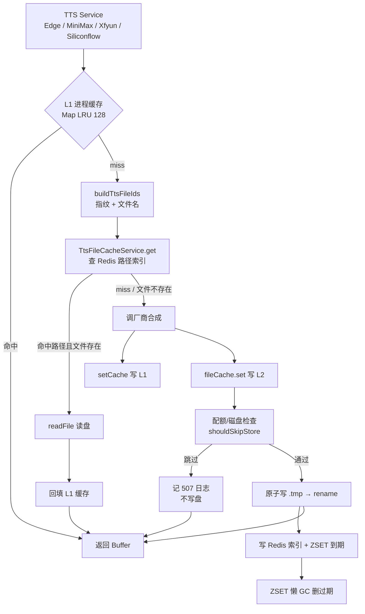
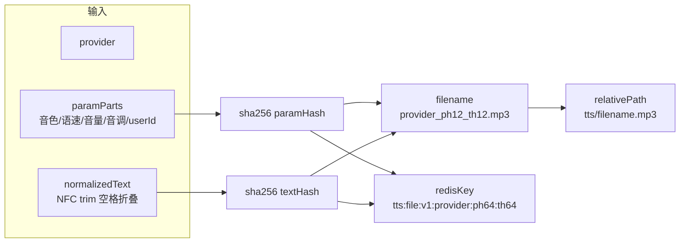

> **⚠️ 路径索引 / GC / Redis 连接以定稿文为准**：[TTS缓存复用全局Cache.md](./TTS缓存复用全局Cache.md)（去掉专用 ioredis + ZSET，改走全局 `CACHE_MANAGER` + 磁盘 mtime GC）。**下文保留首版 L2 落盘与四厂商接入的历史叙述；文中「ZSET / 专用 Redis」描述已过时，请勿按本文实现连接层。**

## 延伸阅读

- **定稿（连接与 GC）**：[TTS缓存复用全局Cache.md](./TTS缓存复用全局Cache.md)
- 前端 TTS 缓存一致性：[`英语TTS缓存一致性.md`](./英语TTS缓存一致性.md) · [`练习TTS批量预取管道.md`](./练习TTS批量预取管道.md)
- 云端 TTS 厂商接入：[`MiniMax云端TTS.md`](./MiniMax云端TTS.md) · [`讯飞云TTS.md`](./讯飞云TTS.md) · [`云端TTS边缘语音.md`](./云端TTS边缘语音.md)
- 规划态方案：[`ideas/tts/TTS本地文件缓存.md`](../ideas/tts/TTS本地文件缓存.md)
- 产品使用说明：[`项目指南.md`](../项目指南.md) §13.32
- 用户向更新条目：[`项目更新信息.md`](../项目更新信息.md)

---

## 1. 背景与目标

云端 TTS 合成（MiniMax / 讯飞 / Edge / 硅基）原有两层缓存：

- **L1 进程内存**：`Map<string, Buffer>` LRU，进程重启即丢；
- **厂商侧限制**：CosyVoice 等神经 TTS 无 seed，同句两次合成发音漂移。

进程内缓存只在单次部署生命周期内有效，**重启 / 多副本** 后同一句话必须重新花钱合成，且发音可能漂移。

本次新增 **L2 磁盘文件缓存**：合成成功的 MP3 落盘到 `uploads/tts/`。**首版**曾用「Redis 路径索引 + ZSET 到期表」；**定稿**改为全局 `CACHE_MANAGER` 路径索引 + **mtime 游标 GC**（见定稿文）。命中顺序仍为：**L1 进程缓存 → L2 磁盘文件 → 调厂商合成并写回**。

核心目标：

- **跨重启 / 跨副本复用**：同一 `provider + 参数 + 文本` 组合只合成一次，磁盘持久化；
- **配额与磁盘保护**：超预算 / 磁盘不足时**不落盘、不删旧文件**，记日志，音频仍在内存返回；
- **懒 GC**：定稿为 mtime 分批删（非 ZSET）；
- **不影响现有逻辑**：未启用或读盘失败时透明回退到「调厂商合成」。

---

## 2. 改动范围

| 路径 | 说明 |
|------|------|
| `apps/backend/src/enum/tts-file-cache.enum.ts` | **新建**：环境变量枚举（开关 / TTL / 预算） |
| `apps/backend/src/services/speech-transcription/tts-file-cache.keys.ts` | **新建**：provider 类型、Redis key、ZSET key、文本归一化、指纹与文件名生成 |
| `apps/backend/src/services/speech-transcription/tts-file-cache.keys.self-check.ts` | **新建**：指纹自检脚本（ponytail） |
| `apps/backend/src/services/speech-transcription/tts-file-cache.service.ts` | **新建**：L2 缓存服务（get / set / GC / 配额 / 磁盘检查） |
| `apps/backend/src/services/speech-transcription/speech-transcription.module.ts` | 注册 `TtsFileCacheService` 到 providers 与 exports |
| `apps/backend/src/utils/upload-paths.ts` | 新增 `getUploadTtsDir()` 返回 `uploads/tts/` |
| `apps/backend/src/services/speech-transcription/edge-tts.service.ts` | 接入 L2 缓存 + JSON sidecar（boundaries） |
| `apps/backend/src/services/speech-transcription/minimax-tts.service.ts` | 接入 L2 缓存（同步 + 流式两条路径） |
| `apps/backend/src/services/speech-transcription/xfyun-tts.service.ts` | 接入 L2 缓存（同步 + 流式两条路径） |
| `apps/backend/src/services/speech-transcription/siliconflow-transcription.service.ts` | 接入 L2 缓存 |
| `apps/backend/package.json` | 新增 `ioredis@5.10.0` 依赖（ZSET / 配额计数用） |

---

## 3. 实现思路

### 3.1 关键决策

1. **三级命中顺序 L1 → L2 → 厂商**：L1 命中直接返回（最快，零 IO）；L1 miss 才查 L2 磁盘；L2 miss 才调厂商并写回 L1 + L2。
2. **指纹设计**：
   - **Redis key 用完整 SHA-256**（参数 hash + 文本 hash），保证唯一性；
   - **文件名用 12 位短缀**（`${provider}_${paramHash12}_${textHash12}.mp3`），防止路径过长（部分 FS 限制 255 字节）；
   - **GC 靠 ZSET member=相对路径**，不依赖文件名反推 key。
3. **跨用户 vs 按用户**：
   - **Edge**：`paramParts` 不含 `userId`（Edge 音色与用户无关，跨用户共享）；
   - **MiniMax / 讯飞**：`paramParts` 含 `userIdPart(userId)`（用户可能配置了自定义音色 / 凭据，需隔离）；
   - **硅基**：固定参数 `[model, voice, '1', '0']`，跨用户共享。
4. **配额策略：只跳过、不驱逐**：超出 `maxBytes` 或磁盘不足时，**跳过当前写入、不删旧文件**（避免误删活跃文件），通过 `logsService.createSafe` 记 507。到期文件由 TTL + 懒 GC 清理。
5. **原子写盘**：先写 `${abs}.${pid}.tmp`，再 `rename` 到目标路径，避免并发读半成品。
6. **JSON sidecar**：Edge 有 `boundaries`（WordBoundary 时间戳），用同名 `.json` 文件伴随 `.mp3` 存储；读盘时 `getJson` 读取。
7. **懒 GC 节流**：`GC_MIN_INTERVAL_MS = 60_000`，每次 `get` / `set` 后 `scheduleGc`，但 60s 内只跑一次；`gcExpired` 从 ZSET 取 `score <= now` 的前 32 条批量删。

### 3.2 架构与数据流



### 3.3 指纹生成与 key 结构



---

## 4. 关键代码对比与注释

### 4.1 环境变量枚举（新增）

**改动后** · `apps/backend/src/enum/tts-file-cache.enum.ts`（当前，全文）

```typescript
/** TTS 本地文件缓存（uploads/tts + Redis 路径索引 + ZSET 懒 GC） */
export enum TtsFileCacheEnum {
	// 总开关：是否启用 L2 磁盘缓存
	TTS_FILE_CACHE_ENABLED = 'TTS_FILE_CACHE_ENABLED',
	/**
	 * tts 文件缓存过期时间（秒）。
	 * 0 = 不限制 TTL；默认 30 天（以定稿 [TTS缓存复用全局Cache.md](./TTS缓存复用全局Cache.md) 为准；下文代码摘录若仍写 7 天属历史）。
	 */
	TTS_FILE_CACHE_TTL_SEC = 'TTS_FILE_CACHE_TTL_SEC',
	/**
	 * tts 目录缓存预算（MB）。超出则跳过落盘（不删旧文件）。
	 * 0 = 不限制体积；默认 2048。
	 */
	TTS_FILE_CACHE_MAX_MB = 'TTS_FILE_CACHE_MAX_MB',
}
```

---

### 4.2 指纹与 key 生成（新增）

**改动后** · `apps/backend/src/services/speech-transcription/tts-file-cache.keys.ts`（当前，全文）

```typescript
// 用 node:crypto 的 sha256 生成参数与文本指纹
import { createHash } from 'node:crypto';

// 支持的 TTS 厂商，与各服务 fileIds() 的 provider 一一对应
export type TtsFileProvider =
	| 'minimax'
	| 'xfyun'
	| 'edge'
	| 'siliconflow';

/** ZSET：score=过期 unix 秒，member=相对路径（大文件量 GC 用） */
export const TTS_FILE_EXPIRY_ZSET = 'tts:file:v1:expiry';

/** 缓存占用字节计数（近似；删/写时增减） */
export const TTS_FILE_BYTES_KEY = 'tts:file:v1:bytes';

// 文本归一化：NFC 统一码点、trim 首尾、连续空白折叠为单空格
export function normalizeTtsText(text: string): string {
	return text
		.normalize('NFC')
		.trim()
		.replace(/\s+/g, ' ');
}

// 计算输入的 SHA-256 十六进制摘要
function sha256Hex(input: string): string {
	return createHash('sha256').update(input, 'utf8').digest('hex');
}

// userId 转字符串：无 userId 时用 '0'，避免 undefined 导致 key 不一致
export function userIdPart(userId?: number): string {
	return userId != null && userId > 0 ? String(userId) : '0';
}

/**
 * Redis key 用完整 hash；文件名用 12 位短缀（防路径过长）。
 * GC 主路径靠 ZSET member=相对路径，不依赖文件名反推 key。
 */
export function buildTtsFileIds(input: {
	provider: TtsFileProvider;
	paramParts: string[];
	normalizedText: string;
}): { redisKey: string; relativePath: string; filename: string } {
	// 参数数组用 \u0001 分隔后哈希，避免参数值互相渗透
	const paramHash = sha256Hex(input.paramParts.join('\u0001'));
	// 文本单独哈希
	const textHash = sha256Hex(input.normalizedText);
	// 文件名：provider + 参数前12位 + 文本前12位，防路径过长
	const filename = `${input.provider}_${paramHash.slice(0, 12)}_${textHash.slice(0, 12)}.mp3`;
	return {
		// Redis key 用完整 64 位 hash，保证唯一性
		redisKey: `tts:file:v1:${input.provider}:${paramHash}:${textHash}`,
		// 相对路径：uploads/tts/<filename>
		relativePath: `tts/${filename}`,
		filename,
	};
}
```

---

### 4.3 L2 缓存服务：`get` / `set` / `gcExpired`（新增）

**改动后** · `apps/backend/src/services/speech-transcription/tts-file-cache.service.ts`（当前，L72–L208，核心方法）

```typescript
@Injectable()
export class TtsFileCacheService implements OnModuleInit, OnModuleDestroy {
	// 日志上下文标记
	private static readonly CTX = TtsFileCacheService.name;
	// 是否已执行 ensureReady
	private ready = false;
	// 总开关，默认 false
	private enabled = false;
	// TTL 秒数，默认 7 天
	private ttlSec = 604_800;
	// TTL 毫秒，ttlSec * 1000
	private ttlMs = 604_800_000;
	// 缓存预算字节数，≤0 表示不限制体积，默认 2048 MB
	private maxBytes = 2048 * 1024 * 1024;
	// uploads/tts 绝对路径
	private ttsDir = '';
	// uploads 根目录绝对路径
	private uploadsRoot = '';
	// ioredis 实例（ZSET / 配额计数用）
	private redis: InstanceType<typeof Redis> | null = null;
	// 上次 GC 时间戳，用于节流
	private lastGcAt = 0;
	// 是否已打印「未启用跳过」日志，避免重复刷屏
	private loggedDisabledSkip = false;

	// 注入 ConfigService、CACHE_MANAGER、LogsService、nest-winston Logger
	constructor(
		private readonly config: ConfigService,
		@Inject(CACHE_MANAGER) private readonly cache: Cache,
		private readonly logsService: LogsService,
		@Inject(WINSTON_MODULE_NEST_PROVIDER)
		private readonly logger: LoggerService,
	) {}

	// 模块初始化时确保 ready
	onModuleInit(): void {
		this.ensureReady();
	}

	/** .env ← .env.$NODE_ENV；get/set 也会调，避免 onModuleInit 未跑导致永远 enabled=false */
	private ensureReady(): void {
		// 已初始化则直接返回，幂等
		if (this.ready) return;
		this.ready = true;

		// 读环境配置（与 upload-paths 同源）
		const env = getEnvConfig();
		const raw = env[TtsFileCacheEnum.TTS_FILE_CACHE_ENABLED];
		this.enabled = this.parseBool(raw, false);
		// 未启用则只记日志，不连接 Redis
		if (!this.enabled) {
			this.logger.log(
				`TTS 文件缓存关闭（TTS_FILE_CACHE_ENABLED=${String(raw)}）`,
				TtsFileCacheService.CTX,
			);
			return;
		}

		// 解析 TTL 与预算
		this.ttlSec = this.parseNum(env[TtsFileCacheEnum.TTS_FILE_CACHE_TTL_SEC], 604_800);
		this.ttlMs = this.ttlSec * 1000;
		const maxMb = this.parseNum(env[TtsFileCacheEnum.TTS_FILE_CACHE_MAX_MB], 2048);
		this.maxBytes = maxMb > 0 ? maxMb * 1024 * 1024 : 0;
		// 计算目录并确保存在
		this.uploadsRoot = getUploadsRoot();
		this.ttsDir = getUploadTtsDir();
		ensureUploadDir(this.ttsDir);
		this.logger.log(
			`TTS 文件缓存已启用 dir=${this.ttsDir} ttlSec=${this.ttlSec} maxMB=${maxMb}`,
			TtsFileCacheService.CTX,
		);

		// 连接 ioredis（复用 bullmq 连接配置）
		try {
			this.redis = new Redis(
				createBullRedisConnectionOptions(this.config) as Record<
					string,
					unknown
				>,
			);
			this.redis.on('error', (err) => {
				this.logger.warn(
					`TTS ZSET Redis: ${err.message}`,
					TtsFileCacheService.CTX,
				);
			});
			this.logger.log('TTS ZSET Redis 已连接', TtsFileCacheService.CTX);
		} catch (err) {
			// Redis 连接失败不阻断服务，配额/GC 降级
			this.logger.error(
				`TTS Redis 连接失败，配额/到期 GC 将受限: ${
					err instanceof Error ? err.message : String(err)
				}`,
				undefined,
				TtsFileCacheService.CTX,
			);
			this.redis = null;
		}
	}

	// 模块销毁时断开 Redis
	async onModuleDestroy(): Promise<void> {
		if (this.redis) {
			await this.redis.quit().catch(() => undefined);
			this.redis = null;
		}
	}

	// 对外暴露是否启用
	isEnabled(): boolean {
		this.ensureReady();
		return this.enabled;
	}

	// 读 L2 缓存：先查 Redis 路径索引，再读文件
	async get(redisKey: string, relativePath: string): Promise<Buffer | null> {
		this.ensureReady();
		// 未启用直接返回 null（只打印一次日志）
		if (!this.enabled) {
			if (!this.loggedDisabledSkip) {
				this.loggedDisabledSkip = true;
				this.logger.log(
					`TTS 文件缓存未启用，跳过读盘（后续同类请求不再重复打印）`,
					TtsFileCacheService.CTX,
				);
			}
			return null;
		}
		try {
			// 先从 CACHE_MANAGER 取路径索引
			let relative = (await this.cache.get<string>(redisKey))?.trim();
			// 索引缺失时回退到入参 relativePath（兼容）
			if (!relative) relative = relativePath;

			// 转绝对路径
			const abs = this.toAbsolute(relative);
			try {
				// 检查文件是否存在
				await access(abs);
			} catch {
				// 文件不存在：删索引，回退到厂商合成
				await this.cache.del(redisKey).catch(() => undefined);
				this.logger.log(
					`TTS file miss path=${relative}，将调用厂商合成`,
					TtsFileCacheService.CTX,
				);
				// 触发一次懒 GC
				this.scheduleGc();
				return null;
			}

			// 读文件内容
			const buf = await readFile(abs);
			// 刷新路径索引 TTL
			void this.indexPath(redisKey, relative);
			this.logger.log(
				`TTS file hit path=${relative} bytes=${buf.byteLength}`,
				TtsFileCacheService.CTX,
			);
			// 触发一次懒 GC
			this.scheduleGc();
			return buf;
		} catch (err) {
			// 读盘异常：记日志，回退到厂商合成
			this.logger.warn(
				`TTS file miss(error) path=${relativePath}: ${err instanceof Error ? err.message : String(err)}，将调用厂商合成`,
				TtsFileCacheService.CTX,
			);
			return null;
		}
	}

	// 读 JSON sidecar（Edge boundaries 等）
	async getJson<T>(_redisKey: string, relativePath: string): Promise<T | null> {
		this.ensureReady();
		if (!this.enabled) return null;
		try {
			// 把 .mp3 换成 .json 读 sidecar
			const abs = `${this.toAbsolute(relativePath).replace(/\.mp3$/i, '')}.json`;
			const raw = await readFile(abs, 'utf8');
			return JSON.parse(raw) as T;
		} catch {
			// sidecar 不存在或解析失败返回 null
			return null;
		}
	}

	// 写 L2 缓存：配额/磁盘检查 → 原子写盘 → 更新索引与配额
	async set(
		redisKey: string,
		relativePath: string,
		audio: Buffer,
		jsonSide?: unknown,
	): Promise<void> {
		this.ensureReady();
		// 未启用或空 buffer 直接返回
		if (!this.enabled || !audio.byteLength) return;
		const abs = this.toAbsolute(relativePath);
		// 临时文件名带 pid，避免多进程冲突
		const tmp = `${abs}.${process.pid}.tmp`;
		try {
			ensureUploadDir(this.ttsDir);
			// 统计旧文件大小（用于 net 变化计算）
			let oldBytes = 0;
			try {
				oldBytes = (await stat(abs)).size;
			} catch {
				// 新文件
			}
			// sidecar 的旧大小也算上
			const jsonAbs = abs.replace(/\.mp3$/i, '.json');
			try {
				oldBytes += (await stat(jsonAbs)).size;
			} catch {
				// 无 sidecar
			}
			// sidecar 新大小
			const sideBytes =
				jsonSide !== undefined
					? Buffer.byteLength(JSON.stringify(jsonSide), 'utf8')
					: 0;
			const newSize = audio.byteLength + sideBytes;
			const net = newSize - oldBytes;

			// 配额/磁盘检查：跳过则不写盘
			const skip = await this.shouldSkipStore(newSize, net, relativePath);
			if (skip) return;

			// 原子写：先写临时文件
			await writeFile(tmp, audio);
			// rename 到目标路径（原子）
			await rename(tmp, abs);
			// 写 sidecar
			if (jsonSide !== undefined) {
				await writeFile(jsonAbs, JSON.stringify(jsonSide), 'utf8');
			}
			// 更新配额计数
			await this.adjustBytes(net);
			// 更新路径索引 + ZSET 到期
			await this.indexPath(redisKey, relativePath);
			this.logger.log(
				`TTS file write path=${relativePath} bytes=${audio.byteLength}`,
				TtsFileCacheService.CTX,
			);
			// 触发懒 GC
			this.scheduleGc();
		} catch (err) {
			// 写盘失败：清理临时文件，记日志
			await unlink(tmp).catch(() => undefined);
			this.logger.warn(
				`TTS 文件缓存 set 失败: ${err instanceof Error ? err.message : String(err)}`,
				TtsFileCacheService.CTX,
			);
		}
	}

	/** 到期文件清理（不因磁盘紧张删文件） */
	async gcExpired(limit = GC_BATCH): Promise<number> {
		this.ensureReady();
		// 未启用或无 Redis 则不 GC
		if (!this.enabled || !this.redis) return 0;
		const now = Math.floor(Date.now() / 1000);
		let paths: string[];
		try {
			// 从 ZSET 取 score 在 [0, now] 的前 limit 条（已过期）
			paths = await this.redis.zrangebyscore(
				TTS_FILE_EXPIRY_ZSET,
				0,
				now,
				'LIMIT',
				0,
				limit,
			);
		} catch (err) {
			this.logger.warn(
				`TTS ZSET GC 查询失败: ${err instanceof Error ? err.message : String(err)}`,
				TtsFileCacheService.CTX,
			);
			return 0;
		}
		// 删除过期文件并更新配额
		const n = await this.unlinkPaths(paths);
		if (n > 0) {
			this.logger.log(
				`TTS 文件 GC 删除 ${n} 个过期文件`,
				TtsFileCacheService.CTX,
			);
		}
		return n;
	}
```

---

### 4.4 Edge TTS 接入 L2 缓存（改动前 / 改动后）

**改动前** · `apps/backend/src/services/speech-transcription/edge-tts.service.ts`（基线，`synthesizeCached` 全方法）

```typescript
	private async synthesizeCached(
		dto: EdgeTtsDto,
		userId?: number,
	): Promise<CachedSpeech> {
		// 解析参数（文本、音色、语速等）
		const resolved = this.resolveOptions(dto);
		// 构建 L1 缓存 key
		const cacheKey = this.buildCacheKey(resolved, userId);
		// 查 L1 进程缓存
		const cached = this.getFromCache(cacheKey);
		// L1 命中直接返回
		if (cached) {
			return {
				buffer: Buffer.from(cached.buffer),
				boundaries: cached.boundaries.map((b) => ({ ...b })),
			};
		}

		// L1 miss：调 Edge 合成
		const entry = await this.synthesize(resolved);
		// 写回 L1 缓存
		this.setCache(cacheKey, entry);
		// 返回结果
		return {
			buffer: Buffer.from(entry.buffer),
			boundaries: entry.boundaries.map((b) => ({ ...b })),
		};
	}
```

**改动后** · `apps/backend/src/services/speech-transcription/edge-tts.service.ts`（当前，`synthesizeCached` 全方法）

```typescript
	private async synthesizeCached(
		dto: EdgeTtsDto,
		userId?: number,
	): Promise<CachedSpeech> {
		// 解析参数（文本、音色、语速等）
		const resolved = this.resolveOptions(dto);
		// 构建 L1 缓存 key
		const cacheKey = this.buildCacheKey(resolved, userId);
		// 查 L1 进程缓存
		const cached = this.getFromCache(cacheKey);
		// L1 命中直接返回，不查 L2
		if (cached) {
			this.logger.log('TTS 命中进程缓存(L1)，未查文件缓存', EdgeTtsService.name);
			return {
				buffer: Buffer.from(cached.buffer),
				boundaries: cached.boundaries.map((b) => ({ ...b })),
			};
		}

		// 构建 L2 指纹（Edge 跨用户共享，不含 userId）
		const ids = this.fileIds(resolved);
		// 查 L2 磁盘缓存
		const fileHit = await this.fileCache.get(ids.redisKey, ids.relativePath);
		// L2 命中：回填 L1 并返回
		if (fileHit?.length) {
			// 读 JSON sidecar 取 boundaries
			const boundaries =
				(await this.fileCache.getJson<EdgeTtsBoundaryDto[]>(
					ids.redisKey,
					ids.relativePath,
				)) ?? [];
			const entry: CachedSpeech = { buffer: fileHit, boundaries };
			// 回填 L1 缓存，下次直接命中
			this.setCache(cacheKey, entry);
			return {
				buffer: Buffer.from(entry.buffer),
				boundaries: entry.boundaries.map((b) => ({ ...b })),
			};
		}

		// L1 + L2 都 miss：调 Edge 合成
		const entry = await this.synthesize(resolved);
		// 写回 L1 缓存
		this.setCache(cacheKey, entry);
		// 写回 L2 磁盘缓存（buffer + boundaries sidecar）
		await this.fileCache.set(
			ids.redisKey,
			ids.relativePath,
			entry.buffer,
			entry.boundaries,
		);
		// 返回结果
		return {
			buffer: Buffer.from(entry.buffer),
			boundaries: entry.boundaries.map((b) => ({ ...b })),
		};
	}
```

**变更摘要**：L1 miss 后新增 L2 磁盘查找；L2 miss 后合成完成时写回 L2（含 JSON sidecar）；L1 命中时记日志表明未查 L2。

---

### 4.5 MiniMax TTS 接入 L2 缓存（同步 + 流式）

**改动前** · `apps/backend/src/services/speech-transcription/minimax-tts.service.ts`（基线，`synthesizeSpeech` 全方法）

```typescript
	async synthesizeSpeech(dto: MinimaxTtsDto, userId?: number): Promise<Buffer> {
		// 解析参数
		const resolved = this.resolveOptions(dto);
		// 构建 L1 key
		const cacheKey = this.buildCacheKey(resolved, userId);
		// 查 L1
		const cached = this.getFromCache(cacheKey);
		// L1 命中返回
		if (cached) return Buffer.from(cached);

		// 调 MiniMax 合成
		const res = await this.requestMiniMax(resolved, false, userId);
		// ...（解析响应、合并 chunks，略）
		const buffer = Buffer.concat(parts);
		// 写回 L1
		this.setCache(cacheKey, buffer);
		return buffer;
	}
```

**改动后** · `apps/backend/src/services/speech-transcription/minimax-tts.service.ts`（当前，`synthesizeSpeech` 全方法）

```typescript
	async synthesizeSpeech(dto: MinimaxTtsDto, userId?: number): Promise<Buffer> {
		// 解析参数
		const resolved = this.resolveOptions(dto);
		// 构建 L1 key
		const cacheKey = this.buildCacheKey(resolved, userId);
		// 查 L1
		const cached = this.getFromCache(cacheKey);
		// L1 命中返回，不查 L2
		if (cached) {
			this.logger.log('TTS 命中进程缓存(L1)，未查文件缓存', MinimaxTtsService.name);
			return Buffer.from(cached);
		}

		// 构建 L2 指纹（MiniMax 含 userId，隔离用户自定义配置）
		const ids = this.fileIds(resolved, userId);
		// 查 L2 磁盘缓存
		const fileHit = await this.fileCache.get(ids.redisKey, ids.relativePath);
		// L2 命中：回填 L1 并返回
		if (fileHit?.length) {
			this.setCache(cacheKey, fileHit);
			return Buffer.from(fileHit);
		}

		// L1 + L2 miss：调 MiniMax 合成
		const res = await this.requestMiniMax(resolved, false, userId);
		// ...（解析响应、合并 chunks，略）
		const buffer = Buffer.concat(parts);
		// 写回 L1
		this.setCache(cacheKey, buffer);
		// 写回 L2 磁盘缓存
		await this.fileCache.set(ids.redisKey, ids.relativePath, buffer);
		return buffer;
	}
```

**变更摘要**：同步路径与 Edge 一致（L1 → L2 → 厂商 + 写回 L2）；流式 `streamSpeech` 同样在 L1 miss 后查 L2，合成后写回 L2。讯飞 `synthesizeSpeech` / `streamSpeech` 模式相同（含 userId + credTag 隔离凭据）。

---

### 4.6 配额与磁盘保护（`shouldSkipStore`）

**改动后** · `apps/backend/src/services/speech-transcription/tts-file-cache.service.ts`（当前，L313–L352）

```typescript
	/**
	 * 空间不够 → 不落盘、不删旧文件，记库。
	 * @returns true 表示应跳过存储
	 */
	private async shouldSkipStore(
		newSize: number,
		netBytes: number,
		relativePath: string,
	): Promise<boolean> {
		// 单文件超预算：跳过
		if (this.maxBytes > 0 && newSize > this.maxBytes) {
			this.recordSkip('over_budget_file', {
				relativePath,
				newSize,
				maxBytes: this.maxBytes,
			});
			return true;
		}
		// 总量超预算：跳过（只跳过，不驱逐）
		if (this.maxBytes > 0 && netBytes > 0) {
			const used = await this.usedBytes();
			if (used + netBytes > this.maxBytes) {
				this.recordSkip('over_budget_total', {
					relativePath,
					newSize,
					netBytes,
					used,
					maxBytes: this.maxBytes,
				});
				return true;
			}
		}

		// 磁盘剩余不足（留 64MB headroom）：跳过
		const free = await this.diskFreeBytes();
		if (free != null && free < newSize + DISK_HEADROOM_BYTES) {
			this.recordSkip('disk_insufficient', {
				relativePath,
				newSize,
				free,
				need: newSize + DISK_HEADROOM_BYTES,
				headroom: DISK_HEADROOM_BYTES,
			});
			return true;
		}
		return false;
	}
```

---

## 5. 兼容性与影响

- **默认关闭**：`TTS_FILE_CACHE_ENABLED` 默认 false，不配置时行为与改动前完全一致（只走 L1 进程缓存）。
- **读盘失败透明回退**：文件不存在 / 读盘异常 / Redis 连接失败均回退到「调厂商合成」，用户无感知。
- **配额只跳不删**：超预算时不落盘，不删旧文件，避免误删活跃文件；到期文件由 TTL + 懒 GC 清理。
- **跨进程**：Redis 索引 + ZSET 跨进程共享，多副本部署时 L2 缓存可复用。
- **ioredis 新增依赖**：`package.json` 新增 `ioredis@5.10.0`，通过 `createRequire` 从 `bullmq` 解析，避免版本冲突。

---

## 6. 建议回归

1. **开关关闭**：不设 `TTS_FILE_CACHE_ENABLED`，确认 TTS 行为不变（无 `uploads/tts/` 写入）。
2. **开关开启**：设 `TTS_FILE_CACHE_ENABLED=true`，首次合成后检查 `uploads/tts/` 出现 `.mp3` 文件，第二次同参数合成命中 L2（日志 `TTS file hit`）。
3. **跨重启**：合成一句后重启后端，再次合成同句应命中 L2（不调厂商）。
4. **JSON sidecar**：Edge 合成后检查同名 `.json` 文件存在且含 boundaries。
5. **配额跳过**：设 `TTS_FILE_CACHE_MAX_MB=1`，合成大文件应跳过落盘（日志 `over_budget_file`，result 507），但音频仍正常返回。
6. **懒 GC**：设 `TTS_FILE_CACHE_TTL_SEC=1`，等 2 秒后再次合成触发 GC，检查过期文件被删除。
7. **四厂商覆盖**：MiniMax / 讯飞 / Edge / 硅基各合成一句，确认均能写盘与命中。
8. **指纹唯一性**：改 voice / 语速 / 文本任一项，确认生成不同文件名（self-check 脚本已验证）。

---

## 7. 相关源码路径

| 说明 | 路径 |
|------|------|
| 环境变量枚举 | `apps/backend/src/enum/tts-file-cache.enum.ts` |
| 指纹与 key | `apps/backend/src/services/speech-transcription/tts-file-cache.keys.ts` |
| L2 缓存服务 | `apps/backend/src/services/speech-transcription/tts-file-cache.service.ts` |
| 自检脚本 | `apps/backend/src/services/speech-transcription/tts-file-cache.keys.self-check.ts` |
| Edge 接入 | `apps/backend/src/services/speech-transcription/edge-tts.service.ts` |
| MiniMax 接入 | `apps/backend/src/services/speech-transcription/minimax-tts.service.ts` |
| 讯飞接入 | `apps/backend/src/services/speech-transcription/xfyun-tts.service.ts` |
| 硅基接入 | `apps/backend/src/services/speech-transcription/siliconflow-transcription.service.ts` |
| 模块注册 | `apps/backend/src/services/speech-transcription/speech-transcription.module.ts` |
| 上传路径 | `apps/backend/src/utils/upload-paths.ts` |

---

若与仓库最新源码不一致，以源码为准。
