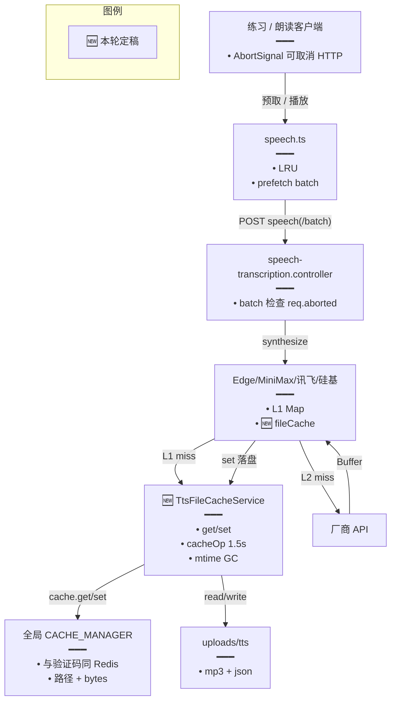
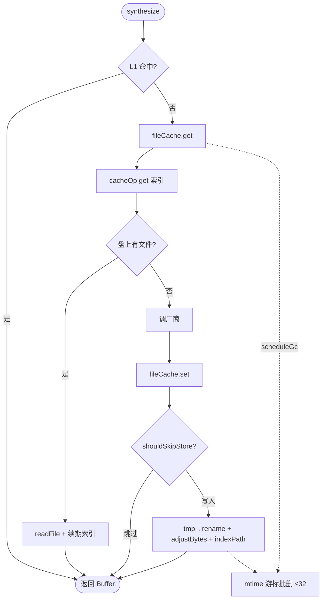

# TTS 缓存复用全局 Cache（去专用 Redis）

> **文档角色**：已落地实现归档（相对「专用 ioredis + ZSET」中间方案的演进定稿）。  
> **修订（2026-09-29）**：默认 `TTS_FILE_CACHE_TTL_SEC` **7 天 → 30 天**（`2592000`）；配额 `bytes` key TTL 同步 30 天。  
> **延伸阅读**：[TTS文件缓存L2持久化.md](./TTS文件缓存L2持久化.md)（首版 L2 落盘专题；**路径索引 / GC 以本文为准**）、[英语TTS缓存一致性.md](./英语TTS缓存一致性.md)（前端 LRU）、[练习TTS批量预取管道.md](./练习TTS批量预取管道.md)、[练习请求作用域与预热.md](./练习请求作用域与预热.md)（切题 Abort 取消预取）、[词库Cache超时旁路.md](./词库Cache超时旁路.md)（同 `CACHE_COMMAND_TIMEOUT_MS`）、规划态 [ideas/tts/TTS本地文件缓存.md](../ideas/tts/TTS本地文件缓存.md) §0.1、[ideas/english/练习听写请求防阻塞.md](../ideas/english/练习听写请求防阻塞.md) §14。

## 1. 背景与目标

### 1.1 要解决什么

首版 L2（见 [TTS文件缓存L2持久化.md](./TTS文件缓存L2持久化.md)）在**全局 Keyv Cache 之外**再 `new Redis()` 做：

- 路径索引之外的 **ZSET 到期表**；
- 配额 **INCR/DECR**。

练习听写大量 TTS 命中时，专用连接与 ZSET 命令在 Redis Cloud **maxclients≈30** 下易打满，日志刷「TTS ZSET Redis」错误，并拖累验证码 / Bull 等共用实例。

### 1.2 本轮目标

| 目标 | 做法 |
|------|------|
| 不再单开 Redis | 路径索引 + 配额字节 **只走** Nest 全局 `CACHE_MANAGER`（与验证码同连接） |
| 过期仍能删 | Keyv 无 ZSET → **磁盘 `mtime` + 游标分批 GC**；**默认 TTL 30 天** |
| 配额仍有效 | Cache key `tts:file:v1:bytes` + 进程内存镜像；超预算 / 磁盘不足 **只跳过落盘不删旧** |
| 不挡音频 | Cache 超时 / 失败 fail-open；响应仍可带内存 Buffer |
| 不伤 Bull / 验证码 | **不改**全局 Keyv / Bull 连接语义；旁路超时只在业务 `cacheOp` / `getSafe` |

相对 **git HEAD**：`tts-file-cache.*` 为**纯新增**；相对 L2 专题中的 ZSET 方案为**删专用连接、改 GC**。厂商接入（Edge 等）相对 HEAD 为「L1 后插入 L2 get/set」。

### 1.3 TTL 默认修订（2026-09-29）

| 项 | 旧默认 | 新默认 | 代码落点 |
|----|--------|--------|----------|
| `TTS_FILE_CACHE_TTL_SEC` | `604800`（7 天） | **`2592000`（30 天 / 一个月）** | `tts-file-cache.service.ts` 字段默认与 `parseNum` 回退；`tts-file-cache.enum.ts` 注释 |
| 配额 `BYTES_KEY_TTL_MS` | 7 天 | **30 天** | 同文件常量，与文件 TTL 同量级 |

未设 env 时用新默认；`.env` 若已写 `TTS_FILE_CACHE_TTL_SEC` 则以 env 为准。重启 backend 后 `ensureReady` 生效。过期判据仍是盘文件 **mtime**（命中索引不刷新 mtime）。

## 2. 改动范围

| 路径 | 说明 |
|------|------|
| `apps/backend/src/enum/tts-file-cache.enum.ts` | **新增** 环境变量枚举 |
| `apps/backend/src/services/speech-transcription/tts-file-cache.keys.ts` | **新增** 指纹 / key（**无** ZSET key） |
| `apps/backend/src/services/speech-transcription/tts-file-cache.service.ts` | **新增** get/set/配额/`cacheOp`/mtime GC |
| `apps/backend/src/services/speech-transcription/speech-transcription.module.ts` | 注册 `TtsFileCacheService` |
| `apps/backend/src/utils/upload-paths.ts` | `getUploadTtsDir()` |
| `apps/backend/src/services/speech-transcription/edge-tts.service.ts` 等四厂商 | L1→L2→厂商 |
| `apps/backend/src/services/speech-transcription/speech-transcription.controller.ts` | batch 循环 `req.aborted` break |
| `apps/frontend/src/utils/speech.ts` | `prefetchCloudTts` / `Batch` / `startCloudTts` 接 `signal` |
| `apps/backend/src/factorys/redis-config.factory.ts` | 导出 `CACHE_COMMAND_TIMEOUT_MS`（连接参数不变） |

## 3. 实现思路

### 3.1 三层存储

| 层 | 内容 | 失败 |
|----|------|------|
| 盘 `uploads/tts/*.mp3`（+ `.json`） | 音频本体 | 不落盘；内存仍返回 |
| `CACHE_MANAGER` | 路径索引 KV；`tts:file:v1:bytes` | 当 miss / 跳过 persist |
| 进程 `usedBytesApprox` | 配额镜像 | 下次启动 `seedUsedBytes` 校准 |

**禁止**：再 `new Redis()` / ZSET / 专用 INCR。

### 3.2 架构（改动后）



**读图要点**：专用 Redis 客户端已删除；GC 不读 ZSET，只看文件 mtime。

### 3.3 读 / 写 / GC 主流程



### 3.4 权衡

| 备选 | 未采用原因 |
|------|------------|
| 保留专用 ioredis + ZSET | maxclients 雪崩 |
| 改全局 Keyv `commandTimeout` | 伤验证码等长等命令 |
| 配额满时 LRU 删旧腾地方 | 易误删热点；产品定为「只跳不删」 |
| 定时全量扫盘 | 热路径卡顿；改为 60s 节流 + 游标 32 批 |

## 4. 关键实现（改动前 / 改动后对比 + 注释）

### 4.1 `buildTtsFileIds` / keys（纯新增）

**对比范围**：相对 HEAD 无旧文件；相对 L2 中间方案删除 `TTS_FILE_EXPIRY_ZSET`。

**改动前（L2 中间方案摘录，已废弃）** · 曾设计于 `tts-file-cache.keys.ts`

```typescript
// 中间方案：专用 ZSET 存「相对路径 → 过期 unix 秒」，供懒 GC 按 score 批量删
export const TTS_FILE_EXPIRY_ZSET = 'tts:file:v1:expiry';
```

**改动后** · `apps/backend/src/services/speech-transcription/tts-file-cache.keys.ts`（当前，约 L1–L44）

```typescript
// 引入 Node 哈希，用于音色参数与文本指纹，避免明文进文件名
import { createHash } from 'node:crypto';

// 四家云端 TTS 提供商标识，写入 key 前缀防止跨厂商撞文件
export type TtsFileProvider =
	| 'minimax'
	| 'xfyun'
	| 'edge'
	| 'siliconflow';

// 配额占用字节的唯一 Cache key；与验证码共用 CACHE_MANAGER，不另开连接
export const TTS_FILE_BYTES_KEY = 'tts:file:v1:bytes';

// 合成前规范化文本：NFC + 压空白，保证同句不同空白形态命中同一缓存
export function normalizeTtsText(text: string): string {
	return text
		.normalize('NFC')
		.trim()
		.replace(/\s+/g, ' ');
}

// 内部 sha256 十六进制，供 param/text 指纹使用
function sha256Hex(input: string): string {
	return createHash('sha256').update(input, 'utf8').digest('hex');
}

// 兼容旧调用：部分厂商 key 曾含 userId；Edge 跨用户共享可不传
export function userIdPart(userId?: number): string {
	return userId != null && userId > 0 ? String(userId) : '0';
}

/**
 * 由 provider + 参数串 + 规范化文本生成 Cache 索引 key 与相对路径。
 * 文件名用 12 位短缀，避免路径过长；完整 hash 留在 redisKey 防碰撞。
 */
export function buildTtsFileIds(input: {
	provider: TtsFileProvider;
	paramParts: string[];
	normalizedText: string;
}): { redisKey: string; relativePath: string; filename: string } {
	// 音色/语速等拼串再哈希，任一参数变则新文件
	const paramHash = sha256Hex(input.paramParts.join('\u0001'));
	// 文本哈希：同文同参可跨请求复用
	const textHash = sha256Hex(input.normalizedText);
	// 磁盘文件名：provider + 双短缀，人可读且短
	const filename = `${input.provider}_${paramHash.slice(0, 12)}_${textHash.slice(0, 12)}.mp3`;
	return {
		// Cache 索引用完整 hash，避免短缀理论碰撞
		redisKey: `tts:file:v1:${input.provider}:${paramHash}:${textHash}`,
		// 相对 uploads 根的路径，供 toAbsolute
		relativePath: `tts/${filename}`,
		filename,
	};
}
```

**变更摘要**：删除 ZSET key；配额只保留 `TTS_FILE_BYTES_KEY`；指纹算法与 L2 一致，便于旧盘文件仍可命中。

---

### 4.2 `TtsFileCacheService.get`（纯新增；相对 ZSET 版去掉 ZSET 续期）

**对比范围**：`get` 全方法。中间方案曾在命中后 `zadd` 续期；现仅 `indexPath` + `scheduleGc`。

**改动后** · `apps/backend/src/services/speech-transcription/tts-file-cache.service.ts`（当前，约 L174–L212）

```typescript
	// 按 redisKey/相对路径读盘；失败返回 null，调用方去调厂商
	async get(redisKey: string, relativePath: string): Promise<Buffer | null> {
		// 懒加载 env / 目录，避免构造期读配置
		this.ensureReady();
		// 开关关闭时不读盘，并只打一次日志避免刷屏
		if (!this.enabled) {
			if (!this.loggedDisabledSkip) {
				this.loggedDisabledSkip = true;
				this.logger.log(
					`TTS 文件缓存未启用，跳过读盘（后续同类请求不再重复打印）`,
					TtsFileCacheService.CTX,
				);
			}
			return null;
		}
		try {
			// 优先 Cache 索引；超时则 undefined，回退调用方传入的 relativePath
			let relative = (
				await this.cacheOp(() => this.cache.get<string>(redisKey), 'get')
			)?.trim();
			// 索引空时仍尝试约定路径，兼容索引丢失但文件在的情况
			if (!relative) relative = relativePath;

			// 拼绝对路径做存在性检查
			const abs = this.toAbsolute(relative);
			try {
				await access(abs);
			} catch {
				// 文件没了：清索引，避免反复指向空洞；顺带节流 GC
				await this.cacheOp(() => this.cache.del(redisKey), 'del');
				this.scheduleGc();
				return null;
			}

			// 读出 MP3 字节
			const buf = await readFile(abs);
			// 续期路径索引 TTL（不 bump 文件 mtime；过期仍看磁盘时间）
			void this.indexPath(redisKey, relative);
			// 读路径也触发懒 GC，保证有流量时会扫过期
			this.scheduleGc();
			return buf;
		} catch (err) {
			// 任意异常当 miss，保证合成主路径不被缓存拖死
			this.logger.warn(
				`TTS file miss(error) path=${relativePath}: ${err instanceof Error ? err.message : String(err)}，将调用厂商合成`,
				TtsFileCacheService.CTX,
			);
			return null;
		}
	}
```

**变更摘要**：命中后续期只碰 Cache KV；**不再**写 ZSET。

---

### 4.3 `TtsFileCacheService.set` + `shouldSkipStore`（纯新增）

**改动后** · 同文件（约 L226–L357，`set` + `shouldSkipStore`）

```typescript
	// 厂商合成成功后条件落盘；跳过时音频仍已在调用方内存中
	async set(
		redisKey: string,
		relativePath: string,
		audio: Buffer,
		jsonSide?: unknown,
	): Promise<void> {
		this.ensureReady();
		// 关闭或空音频直接返回，避免写 0 字节垃圾
		if (!this.enabled || !audio.byteLength) return;
		const abs = this.toAbsolute(relativePath);
		// 同 pid 临时文件，rename 近似原子替换，防半截文件被读到
		const tmp = `${abs}.${process.pid}.tmp`;
		try {
			ensureUploadDir(this.ttsDir);
			// 覆盖写时算净增量，避免配额重复累加
			let oldBytes = 0;
			try {
				oldBytes = (await stat(abs)).size;
			} catch {
				// 新文件无旧体积
			}
			const jsonAbs = abs.replace(/\.mp3$/i, '.json');
			try {
				oldBytes += (await stat(jsonAbs)).size;
			} catch {
				// 无 sidecar
			}
			const sideBytes =
				jsonSide !== undefined
					? Buffer.byteLength(JSON.stringify(jsonSide), 'utf8')
					: 0;
			const newSize = audio.byteLength + sideBytes;
			const net = newSize - oldBytes;

			// 单文件超限 / 总量超限 / 磁盘不够 → 不落盘
			const skip = await this.shouldSkipStore(newSize, net, relativePath);
			if (skip) return;

			await writeFile(tmp, audio);
			await rename(tmp, abs);
			if (jsonSide !== undefined) {
				await writeFile(jsonAbs, JSON.stringify(jsonSide), 'utf8');
			}
			// 更新内存镜像 + Cache bytes key
			await this.adjustBytes(net);
			await this.indexPath(redisKey, relativePath);
			this.scheduleGc();
		} catch (err) {
			await unlink(tmp).catch(() => undefined);
			this.logger.warn(
				`TTS 文件缓存 set 失败: ${err instanceof Error ? err.message : String(err)}`,
				TtsFileCacheService.CTX,
			);
		}
	}

	// 三条门闩：任一满足则跳过落盘（不删旧文件腾地方）
	private async shouldSkipStore(
		newSize: number,
		netBytes: number,
		relativePath: string,
	): Promise<boolean> {
		// 单文件超过整盘预算上限（配置异常保护）
		if (this.maxBytes > 0 && newSize > this.maxBytes) {
			this.recordSkip('over_budget_file', {
				relativePath,
				newSize,
				maxBytes: this.maxBytes,
			});
			return true;
		}
		// 总量：用内存镜像快速判断，避免每次扫盘
		if (this.maxBytes > 0 && netBytes > 0) {
			const used = this.usedBytesApprox;
			if (used + netBytes > this.maxBytes) {
				this.recordSkip('over_budget_total', {
					relativePath,
					newSize,
					netBytes,
					used,
					maxBytes: this.maxBytes,
				});
				return true;
			}
		}

		// 磁盘剩余不足（再留 64MB headroom）则跳过
		const free = await this.diskFreeBytes();
		if (free != null && free < newSize + DISK_HEADROOM_BYTES) {
			this.recordSkip('disk_insufficient', {
				relativePath,
				newSize,
				free,
				need: newSize + DISK_HEADROOM_BYTES,
				headroom: DISK_HEADROOM_BYTES,
			});
			return true;
		}
		return false;
	}
```

**变更摘要**：配额与磁盘策略与 L2 一致；bytes 走 Cache 而非专用 Redis INCR。

---

### 4.4 `gcExpired` / `scheduleGc`（mtime 取代 ZSET）

**改动前（L2 中间方案思路）**：`ZRANGEBYSCORE expiry 0 now LIMIT 0 32` → unlink → `ZREM`。

**改动后** · 同文件（约 L277–L420）

```typescript
	/** 按 mtime 分批清理；游标轮询，不在请求热路径同步全量扫完 */
	async gcExpired(limit = GC_BATCH): Promise<number> {
		this.ensureReady();
		if (!this.enabled) return 0;
		// cutoff：早于「现在 − TTL」的 mtime 视为过期
		const cutoff = Date.now() - this.ttlMs;
		let names: string[];
		try {
			names = (await readdir(this.ttsDir)).filter((n) => n.endsWith('.mp3'));
		} catch {
			return 0;
		}
		if (names.length === 0) return 0;

		const expired: string[] = [];
		// 从上次游标继续，避免总扫目录头部
		const start = this.gcCursor % names.length;
		let checked = 0;
		while (expired.length < limit && checked < names.length) {
			const name = names[(start + checked) % names.length]!;
			checked += 1;
			const abs = join(this.ttsDir, name);
			try {
				const st = await stat(abs);
				if (st.mtimeMs < cutoff) {
					expired.push(`tts/${name}`);
				}
			} catch {
				// 并发删除导致 missing，忽略
			}
		}
		this.gcCursor = (start + checked) % names.length;

		const n = await this.unlinkPaths(expired);
		if (n > 0) {
			this.logger.log(
				`TTS 文件 GC 删除 ${n} 个过期文件`,
				TtsFileCacheService.CTX,
			);
		}
		return n;
	}

	// 读写成功路径调用；60s 内最多触发一次异步 GC
	private scheduleGc(): void {
		const now = Date.now();
		if (now - this.lastGcAt < GC_MIN_INTERVAL_MS) return;
		this.lastGcAt = now;
		void this.gcExpired().catch((err: unknown) => {
			this.logger.warn(
				`TTS 文件 GC 失败: ${err instanceof Error ? err.message : String(err)}`,
				TtsFileCacheService.CTX,
			);
		});
	}
```

**变更摘要**：过期判据改为磁盘 mtime；验证可用「短 TTL + `touch` 拨旧 mtime + 再打 TTS」触发日志 `TTS 文件 GC 删除`。

---

### 4.5 `cacheOp`（旁路超时，不改 Keyv 连接）

**改动后** · 同文件（约 L422–L448）

```typescript
	// 对单次 Cache await 做 1.5s race；超时当跳过，避免 Redis 抖动堵死合成
	private async cacheOp<T>(
		run: () => Promise<T>,
		label: string,
	): Promise<T | undefined> {
		try {
			return await new Promise<T>((resolve, reject) => {
				const timer = setTimeout(() => {
					reject(new Error(`CACHE_TIMEOUT:${label}`));
				}, CACHE_COMMAND_TIMEOUT_MS);
				run().then(
					(v) => {
						clearTimeout(timer);
						resolve(v);
					},
					(e) => {
						clearTimeout(timer);
						reject(e);
					},
				);
			});
		} catch (err) {
			this.logger.warn(
				`TTS cache ${label} skip: ${err instanceof Error ? err.message : String(err)}`,
				TtsFileCacheService.CTX,
			);
			return undefined;
		}
	}
```

**变更摘要**：与词库 `raceTimeout` 共用常量；**不**给 Keyv 全局加 `commandTimeout`（见 [词库Cache超时旁路.md](./词库Cache超时旁路.md)）。

---

### 4.6 `EdgeTtsService.synthesizeCached`（相对 HEAD）

**对比范围**：`synthesizeCached` 全方法。

**改动前** · `apps/backend/src/services/speech-transcription/edge-tts.service.ts`（基线）

```typescript
	// 旧版：仅进程 L1；miss 直接合成，无跨重启复用
	private async synthesizeCached(
		dto: EdgeTtsDto,
		userId?: number,
	): Promise<CachedSpeech> {
		const resolved = this.resolveOptions(dto);
		const cacheKey = this.buildCacheKey(resolved, userId);
		const cached = this.getFromCache(cacheKey);
		if (cached) {
			return {
				buffer: Buffer.from(cached.buffer),
				boundaries: cached.boundaries.map((b) => ({ ...b })),
			};
		}

		const entry = await this.synthesize(resolved);
		this.setCache(cacheKey, entry);
		return {
			buffer: Buffer.from(entry.buffer),
			boundaries: entry.boundaries.map((b) => ({ ...b })),
		};
	}
```

**改动后** · 同文件（当前，约 L159–L202）

```typescript
	// 新版：L1 → L2 文件缓存 → 厂商；写回 L1+L2
	private async synthesizeCached(
		dto: EdgeTtsDto,
		userId?: number,
	): Promise<CachedSpeech> {
		const resolved = this.resolveOptions(dto);
		const cacheKey = this.buildCacheKey(resolved, userId);
		const cached = this.getFromCache(cacheKey);
		if (cached) {
			// 命中 L1 时明确打日志，便于区分未查盘
			this.logger.log('TTS 命中进程缓存(L1)，未查文件缓存', EdgeTtsService.name);
			return {
				buffer: Buffer.from(cached.buffer),
				boundaries: cached.boundaries.map((b) => ({ ...b })),
			};
		}

		// 指纹：Edge 跨用户共享，不含 userId
		const ids = this.fileIds(resolved);
		const fileHit = await this.fileCache.get(ids.redisKey, ids.relativePath);
		if (fileHit?.length) {
			// sidecar JSON 存 WordBoundary；没有则空数组
			const boundaries =
				(await this.fileCache.getJson<EdgeTtsBoundaryDto[]>(
					ids.redisKey,
					ids.relativePath,
				)) ?? [];
			const entry: CachedSpeech = { buffer: fileHit, boundaries };
			// 回填 L1，后续同进程热命中
			this.setCache(cacheKey, entry);
			return {
				buffer: Buffer.from(entry.buffer),
				boundaries: entry.boundaries.map((b) => ({ ...b })),
			};
		}

		const entry = await this.synthesize(resolved);
		this.setCache(cacheKey, entry);
		// 异步条件落盘；失败不影响本次返回
		await this.fileCache.set(
			ids.redisKey,
			ids.relativePath,
			entry.buffer,
			entry.boundaries,
		);
		return {
			buffer: Buffer.from(entry.buffer),
			boundaries: entry.boundaries.map((b) => ({ ...b })),
		};
	}
```

**变更摘要**：MiniMax / 讯飞 / 硅基同构接入，见各 `*-tts.service.ts` / `siliconflow-transcription.service.ts`。

---

### 4.7 batch `req.aborted` + 前端 `signal`（摘录）

**改动后** · `speech-transcription.controller.ts`：三个 batch 循环内 `if (req.aborted) break;`，切题取消后少合成后续句。

**改动后** · `apps/frontend/src/utils/speech.ts`：`prefetchCloudTts` / `prefetchCloudTtsBatch` / `startCloudTts` 透传 `AbortSignal`；abort 后不写 LRU。与 [练习请求作用域与预热.md](./练习请求作用域与预热.md) 的 `requestSignal` 对接。

## 5. 行为变化与兼容性

| 项 | 说明 |
|----|------|
| 开关 | `TTS_FILE_CACHE_ENABLED` 默认关；关则与仅 L1 行为一致 |
| 连接数 | 不再占专用 Redis client；只多几个 KV key |
| **默认 TTL** | **`2592000` 秒（30 天）**；路径索引与盘 mtime GC、配额 bytes key 同量级；可用 env 覆盖 |
| 过期 | 看文件 mtime，不是 ZSET score；命中索引**不**刷新 mtime |
| 配额满 | 仍只跳过新写入 |
| 多副本 | 共享盘或同 NFS 时 L2 可复用；仅 Cache 索引跨进程 |

## 6. 测试与回归建议

1. 开启缓存，首合成落盘，二次同参命中（可不打厂商）。
2. Redis 打满/慢：合成仍返回；日志可有 `TTS cache … skip`。
3. 验证默认 TTL：未设 env 时日志应见 `ttlSec=2592000`；或临时 `TTL_SEC=30` + `touch` 拨旧 mtime → 再 TTS → 日志 GC 删除且文件消失。
4. `MAX_MB` 极小 → `over_budget_*` skip，音频仍正常。
5. 练习切题：batch 后续句因 `req.aborted` 停止；前端无 abort Toast。
6. 验证码收发、Bull 队列启动：无 offlineQueue / maxclients 雪崩。

## 7. 相关源码路径

| 说明 | 路径 |
|------|------|
| keys / bytes | `apps/backend/src/services/speech-transcription/tts-file-cache.keys.ts` |
| 服务 | `apps/backend/src/services/speech-transcription/tts-file-cache.service.ts` |
| 超时常量 | `apps/backend/src/factorys/redis-config.factory.ts` |
| Edge 接入 | `apps/backend/src/services/speech-transcription/edge-tts.service.ts` |
| batch abort | `apps/backend/src/services/speech-transcription/speech-transcription.controller.ts` |
| 前端 signal | `apps/frontend/src/utils/speech.ts` |

---

（若与仓库最新源码不一致，以源码为准）
