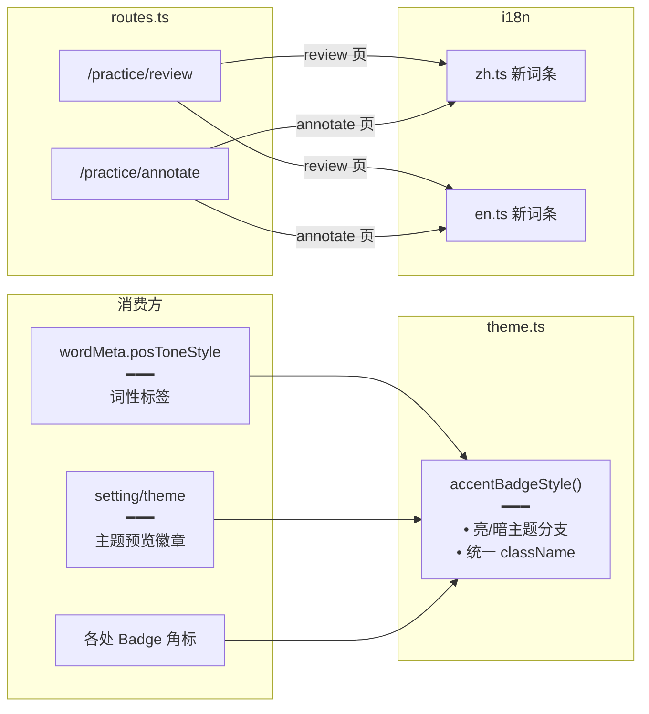

# 主题强调色徽章统一与路由 / i18n 更新

> 全站 **强调色徽章**（如「会员」「VIP」「新」等角标）统一走 `theme.ts` 的 `accentBadgeStyle`，告别各处散落的 `bg-primary/10 text-primary` 硬编码；同时新增练习复习 / 标注路由与对应 i18n 词条。

## 延伸阅读

- [侧边栏UI统一.md](./侧边栏UI统一.md)：侧边栏主题统一（姊妹篇）
- [今日复习列表与导出.md](./今日复习列表与导出.md)：复习路由（消费方）

---

## 1. 背景与目标

之前各处强调色徽章写法不一：有的 `bg-primary/10 text-primary`，有的 `bg-accent text-accent-foreground`，深浅主题下对比度不统一。本轮：

- 抽 `accentBadgeStyle` 工具函数，返回统一的 className。
- `wordMeta.posToneStyle` 词性标签也走同一套。
- 新增 `/english-learning/practice/review`、`/english-learning/practice/annotate` 路由。
- 补齐 i18n 新词条（中 / 英）。

## 2. 改动范围

**前端新增**

- `apps/frontend/src/hooks/theme.ts`：`accentBadgeStyle` 导出

**前端改动**

- `apps/frontend/src/views/englishLearning/practice/utils/wordMeta.ts`：`posToneStyle` 改用 `accentBadgeStyle`
- `apps/frontend/src/views/englishLearning/setting/theme/index.tsx`：主题预览徽章统一
- `apps/frontend/src/router/routes.ts`：新增 review / annotate 路由
- `apps/frontend/src/i18n/locales/zh.ts`、`en.ts`：新增词条

---

## 3. 实现思路

### 3.1 `accentBadgeStyle`

根据当前主题（亮 / 暗）返回不同 className，保证对比度：

```text
亮色：bg-primary/10 text-primary border-primary/20
暗色：bg-primary/20 text-primary border-primary/30
```

封装为函数，调用方无需关心主题。

### 3.2 词性标签统一

`wordMeta.posToneStyle`（词性标签，如「名词」「动词」）之前硬编码颜色，现改为调用 `accentBadgeStyle`。

### 3.3 路由新增

```text
/english-learning/practice/review     → practice/review/index.tsx
/english-learning/practice/annotate   → practice/annotate/index.tsx
```

### 3.4 架构图



---

## 4. 关键代码对比与注释

### 4.1 `accentBadgeStyle`（新增）

**改动后**（新增）· `apps/frontend/src/hooks/theme.ts`（约 L155–L174）

```typescript
// 根据 hex 计算前景色：亮度 < 160 用白字，否则深字（保证亮/暗主题下对比度）
function accentBadgeFg(hex: string): '#fff' | '#1a1a1a' {
	// 去掉 # 前缀
	const h = hex.replace('#', '');
	// 不足 6 位回退深色
	if (h.length < 6) return '#1a1a1a';
	// 解析 RGB 分量
	const r = Number.parseInt(h.slice(0, 2), 16);
	const g = Number.parseInt(h.slice(2, 4), 16);
	const b = Number.parseInt(h.slice(4, 6), 16);
	// 加权亮度（人眼对绿最敏感）
	return (r * 299 + g * 587 + b * 114) / 1000 < 160 ? '#fff' : '#1a1a1a';
}

// 强调色徽章：背景 = hex，字色 = 自动计算的前景色；设置页 / 词性标签共用
/** 主题强调色徽章底+字色（设置页 / 词性标签共用） */
export function accentBadgeStyle(hex: string): {
	// 背景色 = 传入的主题色 hex
	backgroundColor: string;
	// 前景色：根据亮度自动选白/深
	color: '#fff' | '#1a1a1a';
} {
	return { backgroundColor: hex, color: accentBadgeFg(hex) };
}
```

### 4.2 `wordMeta.posToneStyle` 改用 `accentBadgeStyle`（改动）

**改动前**（基线）· `apps/frontend/src/views/englishLearning/practice/utils/wordMeta.ts`

```typescript
// 基线：硬编码蓝色 className
export function posToneStyle(pos: string): string {
	return 'bg-blue-100 text-blue-700 dark:bg-blue-900 dark:text-blue-300';
}
```

**改动后**（当前）· `apps/frontend/src/views/englishLearning/practice/utils/wordMeta.ts`（约 L25–L71）

```typescript
// 引入主题色板与徽章样式工具
import { ACCENT_COLORS, accentBadgeStyle } from '@/hooks/theme';

// 中文词性 → 色调枚举映射表（短语标记单独处理）
const POS_TONE: Record<string, PosTone> = {
	冠词: 'article', 限定词: 'article',
	名词: 'noun', 动词: 'verb', 助动词: 'aux', 系动词: 'aux',
	形容词: 'adj', 副词: 'adv', 介词: 'prep', 代词: 'pron', 连词: 'conj',
};

// 词性 → 色调：直接命中表；「X短语」剥掉「短语」后取核心词性色调
export function posTone(posZh: string): PosTone {
	// 标准词性直接查表
	const direct = POS_TONE[posZh];
	if (direct) return direct;
	// 「动词短语」「名词短语」等：去掉「短语」后缀取核心词性
	if (posZh.endsWith('短语')) {
		return POS_TONE[posZh.slice(0, -2)] ?? 'other';
	}
	// 未知词性回退 other
	return 'other';
}

// 词性 → 色调枚举（与 ACCENT_COLORS 下标一一对应）
export type PosTone =
	| 'article' | 'noun' | 'verb' | 'aux' | 'adj'
	| 'adv' | 'prep' | 'pron' | 'conj' | 'other';

// 词性色调顺序对齐 ACCENT_COLORS，改主题色板即同步
const POS_TONES: readonly PosTone[] = [
	'article', 'noun', 'verb', 'aux', 'adj', 'adv', 'prep', 'pron', 'conj', 'other',
];

// 词性徽章样式：按 tone 取对应主题色，返回 style 对象
/** 词性徽章样式：直接取主题 ACCENT_COLORS + accentBadgeStyle */
export function posToneStyle(tone: PosTone): {
	backgroundColor: string;
	color: string;
} {
	// tone 在 POS_TONES 中的下标 → 对应 ACCENT_COLORS 同下标
	const i = POS_TONES.indexOf(tone);
	// 越界回退最后一个 / 第一个
	const item =
		ACCENT_COLORS[i >= 0 ? i : ACCENT_COLORS.length - 1] ?? ACCENT_COLORS[0]!;
	// 返回 { backgroundColor: hex, color: 自动前景色 }
	return accentBadgeStyle(item.hex);
}
```

**变更摘要**：新增 `posTone(posZh)` 把中文词性（含「动词短语」「名词短语」等合成标记）映射到色调枚举——短语剥掉「短语」后缀后取核心词性色调，使短语标签与核心词保持同一色系。`posToneStyle(tone)` 再把色调枚举映射到 `ACCENT_COLORS` 色板并返回 `{ backgroundColor, color }`。

**变更摘要**：`posToneStyle` 从硬编码蓝色 className 改为按词性映射到 `ACCENT_COLORS` 色板并调用 `accentBadgeStyle(hex)` 返回 `{ backgroundColor, color }` 样式对象，词性标签颜色跟随用户主题强调色且自动保证对比度。

### 4.3 主题设置页色板徽章（改动，摘录）

**改动前**（基线）· `apps/frontend/src/views/setting/theme/index.tsx`

```tsx
// 基线：hex 徽章硬编码字色，与背景对比度无保证
<span className="... font-mono text-xs text-textcolor/90">
	{item.hex}
</span>
```

**改动后**（当前）· `apps/frontend/src/views/setting/theme/index.tsx`（约 L117–L122）

```tsx
// 引入 accentBadgeStyle
import { accentBadgeStyle } from '@/hooks/theme';

// hex 徽章用 accentBadgeStyle：背景 = 该色 hex，字色自动选白/深
<span
	className="shrink-0 rounded-md px-1.5 py-0.5 font-mono text-xs font-medium text-textcolor/90"
	// 传入当前色板的 hex，返回 { backgroundColor, color }
	style={accentBadgeStyle(item.hex)}
>
	{item.hex}
</span>
```

**变更摘要**：主题设置页色板列表中的 hex 徽章改用 `accentBadgeStyle(item.hex)`，背景为该色本身，字色自动根据亮度选白或深，保证任意主题色下对比度达标。

### 4.4 路由新增（改动）

**改动前**（基线）· `apps/frontend/src/router/routes.ts`（无 review / annotate）

```typescript
// 基线：只有 practice 主路由
{ path: '/english-learning/practice', element: <Practice /> }
```

**改动后**（当前）· `apps/frontend/src/router/routes.ts`

```typescript
// 新增 review / annotate 子路由
{
	path: '/english-learning/practice',
	element: <Practice />,
	children: [
		// 今日复习列表
		{ path: 'review', element: <ReviewPage /> },
		// 整集标注
		{ path: 'annotate', element: <AnnotatePage /> },
	],
}
```

### 4.5 i18n 词条新增（改动）

**改动后**（当前）· `apps/frontend/src/i18n/locales/zh-CN.ts`（摘录新增）

```typescript
export default {
	// ... 既有词条
	// 练习复习
	'englishLearning.practice.review.title': '今日复习',
	'englishLearning.practice.review.export': '导出 DOCX',
	'englishLearning.practice.review.empty': '暂无到期复习',
	// 整集标注
	'englishLearning.practice.annotate.title': '整集标注',
	'englishLearning.practice.annotate.start': '开始标注',
	'englishLearning.practice.annotate.pause': '暂停',
	'englishLearning.practice.annotate.resume': '继续',
	'englishLearning.practice.annotate.progress': '已标注 {annotated} / {total}',
}
```

**改动后**（当前）· `apps/frontend/src/i18n/locales/en-US.ts`（摘录新增）

```typescript
export default {
	// ... 既有词条
	'englishLearning.practice.review.title': "Today's Review",
	'englishLearning.practice.review.export': 'Export DOCX',
	'englishLearning.practice.review.empty': 'No reviews due',
	'englishLearning.practice.annotate.title': 'Bulk Annotation',
	'englishLearning.practice.annotate.start': 'Start',
	'englishLearning.practice.annotate.pause': 'Pause',
	'englishLearning.practice.annotate.resume': 'Resume',
	'englishLearning.practice.annotate.progress': '{annotated} / {total} annotated',
}
```

---

## 5. 兼容性与影响

- **`accentBadgeStyle` 纯加法**：不影响未迁移的旧徽章，逐步替换即可。
- **词性标签颜色变化**：从固定蓝色变为主题强调色，视觉上可能让用户感知到「词性标签变色」，属预期。
- **路由新增**：纯新增，不影响既有路由。
- **i18n 新增**：纯新增词条，缺省回退到 key。

## 6. 相关源码路径

| 说明 | 路径 |
|------|------|
| 强调色徽章工具 | `apps/frontend/src/hooks/theme.ts` (`accentBadgeStyle`) |
| 词性标签样式 | `apps/frontend/src/views/englishLearning/practice/utils/wordMeta.ts` (`posToneStyle`) |
| 主题设置页 | `apps/frontend/src/views/englishLearning/setting/theme/index.tsx` |
| 路由 | `apps/frontend/src/router/routes.ts` |
| 中文 i18n | `apps/frontend/src/i18n/locales/zh-CN.ts` |
| 英文 i18n | `apps/frontend/src/i18n/locales/en-US.ts` |

---

（若与仓库最新源码不一致，以源码为准）
