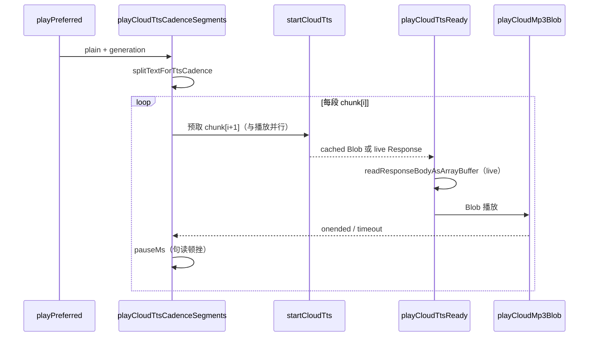

# 云端朗读长文分段流水线

> **文档角色（增量专题）**：`playPreferred` 云端路径由「整段请求 → 收齐 MP3 → 播放」改为「句读分段 + 预取下一段 + 段级 Blob 播放」；并说明为何不采用 MSE 边下边播。
>
> **延伸阅读**：[英语TTS播放.md](./英语TTS播放.md)（播放世代）、[英语TTS缓存一致性.md](./英语TTS缓存一致性.md)（段级 LRU）、[MiniMax云端TTS.md](./MiniMax云端TTS.md)（后端流式接口）、[云端TTS节奏预取.md](./云端TTS节奏预取.md)（**句读分段 + 预取深度实现**）、[../ebook/EPUB引用听书.md](../ebook/EPUB引用听书.md)（电子书「听当前」入口）。

---

## 1. 背景与目标

### 1.1 问题

- 云端路径原先对**整段文本**一次 `POST /speech-transcription/minimax/speech/stream`，前端 `readResponseBodyAsArrayBuffer` **收齐全部 body** 后才 `playCloudMp3Blob`。
- 长文（电子书书摘、长经典句）上游合成慢 + 前端等全量下载 → **首声延迟大**。
- 本机路径已用 `splitTextForTtsCadence` 分段朗读，云端未复用同一切分策略。

### 1.2 目标

1. **方案 A（已落地）**：复用 `splitTextForTtsCadence`；播当前段时 **并行预取下一段**；短句（单段且 ≤120 字）仍单次 HTTP。
2. **方案 B（评估后放弃）**：MSE（Media Source Extensions，媒体源扩展）边收边播单段 MP3。实测 MiniMax 返回的 chunk **不对齐 MPEG 帧**，易出现 `play()` 成功但**无声**且 `onended` 不触发 → UI 卡在「播放中」。故最终 **不启用 MSE**，每段仍收齐后 Blob 播放。
3. **健壮性**：`waitCloudAudioEnd` 增加超时，避免异常状态下 Promise 永不 resolve。

---

## 2. 改动范围

| 路径                                    | 说明                                                                |
| --------------------------------------- | ------------------------------------------------------------------- |
| `apps/frontend/src/utils/speech.ts` | 云端分段流水线、`startCloudTts` / `playCloudTtsReady`、播放结束超时 |

**未改**：后端 MiniMax 流式接口；各页面仍调用 `playPreferred`，无需改调用方。

---

## 3. 实现思路

### 3.1 数据流（方案 A）



### 3.2 关键决策

| 决策                                               | 理由                                                                   |
| -------------------------------------------------- | ---------------------------------------------------------------------- |
| 复用 `splitTextForTtsCadence`                      | 与本机朗读句读、120 字硬切一致；维护单一切分源                         |
| `MAX_SINGLE_CLOUD_TTS_CHARS = 120`                 | 与 `MAX_UTTERANCE_CHARS` 对齐；避免短词/短句碎片化请求                 |
| `startCloudTts` 返回 `CloudTtsReady` 而非直接 Blob | 支持缓存命中与 live Response 分流；预取时只发起 HTTP、播放时再读 body  |
| 不用 MSE                                           | MiniMax MP3 分片非帧对齐；Chrome 上曾出现无声 + 播放态卡死             |
| 段级 LRU                                           | 现有 `cloudTtsAudioCache` 按「段文本 + 偏好后缀」key，天然支持分段缓存 |
| 模块自检                                           | 加载时断言 200 字中文可切 ≥2 段，防止切分回归导致长文仍整段请求        |

### 3.3 播放世代

与 [英语TTS播放.md](./英语TTS播放.md) 一致：每步 `await` 前后检查 `isPlaybackGenerationActive(generation)`；`stopAllPlayback` 递增世代后静默结束。

---

## 4. 关键代码对比与注释

### 4.1 云端单次请求上限常量

**改动前** · `apps/frontend/src/utils/speech.ts`（基线，约 L51–L53）

```typescript
// 句末停顿毫秒数（本机分段用）
const PAUSE_AFTER_SENTENCE_MS = 320;
// 子句停顿毫秒数
const PAUSE_AFTER_CLAUSE_MS = 280;
// 本机 TTS 单段最大字符，过长易截断
const MAX_UTTERANCE_CHARS = 120;
```

**改动后** · `apps/frontend/src/utils/speech.ts`（当前，约 L51–L55）

```typescript
// 句末停顿毫秒数（本机与云端分段共用）
const PAUSE_AFTER_SENTENCE_MS = 320;
// 子句停顿毫秒数
const PAUSE_AFTER_CLAUSE_MS = 280;
// 本机 TTS 单段最大字符，过长易截断
const MAX_UTTERANCE_CHARS = 120;
// 云端短句仍单次请求的上限；与 MAX_UTTERANCE_CHARS 对齐
const MAX_SINGLE_CLOUD_TTS_CHARS = MAX_UTTERANCE_CHARS;
```

**变更摘要**：新增 `MAX_SINGLE_CLOUD_TTS_CHARS`，供 `playCloudTtsCadenceSegments` 判断是否走多段流水线。

---

### 4.2 `fetchCloudTtsBlob` → `startCloudTts`

**对比范围**：原「请求 + 读 body + 缓存 + 返回 Blob」整函数；改为「请求 + 返回 cached 或 live Response」，读 body 延后到 `playCloudTtsReady`。

**改动前** · `apps/frontend/src/utils/speech.ts`（基线，约 L579–L621）

```typescript
// 拉取整段云端 MP3 并返回 Blob（旧版一站式）
async function fetchCloudTtsBlob(plain: string): Promise<Blob> {
	// 确保 MiniMax 用户偏好已加载（音色/语速等）
	await ensureMinimaxTtsUserPrefsLoaded();
	// LRU 键 = 文本 + 偏好后缀
	const cacheKey = plain + buildMinimaxTtsCacheKeySuffix();
	// 命中内存缓存则直接返回 Blob
	const cached = getCloudTtsFromCache(plain);
	if (cached) {
		return cached;
	}

	// 读 JWT
	const token = readToken();
	if (!token) {
		throw new Error("NO_TOKEN");
	}
	// Tauri / Web 统一 fetch
	const platformFetch = await getPlatformFetch();
	const headers = {
		Authorization: `Bearer ${token}`,
		"Content-Type": "application/json",
	};

	// 优先 MiniMax 流式 TTS
	let res = await platformFetch(BASE_URL + SPEECH_MINIMAX_TTS_STREAM, {
		method: "POST",
		headers,
		body: JSON.stringify({ text: plain, ...buildMinimaxTtsRequestExtras() }),
	});

	// 503/401/502 回退硅基 /speech
	if (res.status === 503 || res.status === 401 || res.status === 502) {
		res = await platformFetch(BASE_URL + SPEECH_TTS, {
			method: "POST",
			headers,
			body: JSON.stringify({ text: plain }),
		});
	}

	if (!res.ok) {
		throw new Error(`TTS_HTTP_${res.status}`);
	}

	// 收齐整段 body 后写缓存
	const buf = await readResponseBodyAsArrayBuffer(res);
	touchCloudTtsCache(cacheKey, buf);
	return new Blob([buf], { type: "audio/mpeg" });
}
```

**改动后** · `apps/frontend/src/utils/speech.ts`（当前，约 L585–L627）

```typescript
// 云端 TTS 就绪态：缓存 Blob 或尚未读 body 的 live Response
type CloudTtsReady =
	| { kind: "cached"; blob: Blob; cacheKey: string }
	| { kind: "live"; response: Response; cacheKey: string };

// 发起请求；命中缓存则不再 HTTP
async function startCloudTts(plain: string): Promise<CloudTtsReady> {
	await ensureMinimaxTtsUserPrefsLoaded();
	const cacheKey = plain + buildMinimaxTtsCacheKeySuffix();
	const cached = getCloudTtsFromCache(plain);
	if (cached) {
		return { kind: "cached", blob: cached, cacheKey };
	}

	const token = readToken();
	if (!token) {
		throw new Error("NO_TOKEN");
	}
	const platformFetch = await getPlatformFetch();
	const headers = {
		Authorization: `Bearer ${token}`,
		"Content-Type": "application/json",
	};

	let res = await platformFetch(BASE_URL + SPEECH_MINIMAX_TTS_STREAM, {
		method: "POST",
		headers,
		body: JSON.stringify({ text: plain, ...buildMinimaxTtsRequestExtras() }),
	});

	if (res.status === 503 || res.status === 401 || res.status === 502) {
		res = await platformFetch(BASE_URL + SPEECH_TTS, {
			method: "POST",
			headers,
			body: JSON.stringify({ text: plain }),
		});
	}

	if (!res.ok) {
		throw new Error(`TTS_HTTP_${res.status}`);
	}

	// 不在此处读 body，便于与下一段预取并行
	return { kind: "live", response: res, cacheKey };
}
```

**变更摘要**：拆出 `CloudTtsReady` 与 `startCloudTts`；读 body / 写缓存移至 `playCloudTtsReady`；`fetchCloudTtsBlob` 已删除（无其它引用）。

---

### 4.3 `playCloudTtsCadenceSegments`（新增）

**对比范围**：完整 async 函数（纯新增，无改动前块）。

**改动后** · `apps/frontend/src/utils/speech.ts`（当前，约 L709–L750）

```typescript
// 云端长文：句读分段 + 播当前段时预取下一段
async function playCloudTtsCadenceSegments(
	plain: string,
	generation: number,
): Promise<void> {
	// 与本机相同的句读切分
	const chunks = splitTextForTtsCadence(plain);
	if (chunks.length === 0) return;

	// 短句：单段且不超过 120 字 → 单次请求
	if (
		chunks.length === 1 &&
		chunks[0].text.length <= MAX_SINGLE_CLOUD_TTS_CHARS
	) {
		const ready = await startCloudTts(chunks[0].text);
		if (!isPlaybackGenerationActive(generation)) return;
		await playCloudTtsReady(ready, generation);
		return;
	}

	// 长文：先发起第一段请求
	let pendingReady: Promise<CloudTtsReady> | null = startCloudTts(
		chunks[0].text,
	);

	for (let i = 0; i < chunks.length; i += 1) {
		if (!isPlaybackGenerationActive(generation)) return;

		// 段间句读停顿（首段除外）
		if (i > 0) {
			const prevPause = chunks[i - 1]?.pauseAfterMs ?? PAUSE_AFTER_CLAUSE_MS;
			await pauseMs(prevPause);
			if (!isPlaybackGenerationActive(generation)) return;
		}

		// 等待当前段请求完成（可能已在预取中）
		const ready = await pendingReady!;
		if (!isPlaybackGenerationActive(generation)) return;

		// 与播放并行：预取下一段 HTTP
		pendingReady =
			i + 1 < chunks.length ? startCloudTts(chunks[i + 1].text) : null;

		await playCloudTtsReady(ready, generation);
	}
}
```

**变更摘要**：新增分段流水线核心；`pendingReady` 实现方案 A 预取。

---

### 4.4 `playCloudTtsReady`（新增）

**改动后** · `apps/frontend/src/utils/speech.ts`（当前，约 L693–L707）

```typescript
// 将 CloudTtsReady 转为可播放 Blob 并播放
async function playCloudTtsReady(
	ready: CloudTtsReady,
	generation: number,
): Promise<void> {
	if (ready.kind === "cached") {
		await playCloudMp3Blob(ready.blob, generation);
		return;
	}

	// 不用 MSE：MiniMax MP3 分片常不对齐 MPEG 帧
	const buf = await readResponseBodyAsArrayBuffer(ready.response);
	if (!isPlaybackGenerationActive(generation)) return;
	touchCloudTtsCache(ready.cacheKey, buf);
	await playCloudMp3Blob(new Blob([buf], { type: "audio/mpeg" }), generation);
}
```

**变更摘要**：live 路径收齐 body 后 Blob 播放；明确放弃 MSE 边下边播。

---

### 4.5 `waitCloudAudioEnd` 与 `playCloudMp3Blob`

**对比范围**：`playCloudMp3Blob` 全函数；改动前内联 `onended`/`onerror`，改动后抽出 `waitCloudAudioEnd` 并加超时。

**改动前** · `apps/frontend/src/utils/speech.ts`（基线，约 L623–L669）

```typescript
function playCloudMp3Blob(blob: Blob, generation: number): Promise<void> {
	stopPlaybackMediaOnly();
	if (!isPlaybackGenerationActive(generation)) {
		return Promise.resolve();
	}

	const url = URL.createObjectURL(blob);
	cloudObjectUrl = url;
	const audio = new Audio(url);
	cloudAudio = audio;
	return new Promise((resolve, reject) => {
		audio.onended = () => {
			if (!isPlaybackGenerationActive(generation)) {
				if (cloudObjectUrl === url) {
					URL.revokeObjectURL(url);
					cloudObjectUrl = null;
					cloudAudio = null;
				}
				resolve();
				return;
			}
			if (cloudObjectUrl === url) {
				URL.revokeObjectURL(url);
				cloudObjectUrl = null;
				cloudAudio = null;
			}
			resolve();
		};
		audio.onerror = () => {
			if (cloudObjectUrl === url) {
				URL.revokeObjectURL(url);
				cloudObjectUrl = null;
				cloudAudio = null;
			}
			if (!isPlaybackGenerationActive(generation)) {
				resolve();
				return;
			}
			reject(new Error("AUDIO_PLAY"));
		};
		void audio.play().catch((err) => {
			if (!isPlaybackGenerationActive(generation)) {
				resolve();
				return;
			}
			reject(err);
		});
	});
}
```

**改动后** · `apps/frontend/src/utils/speech.ts`（当前，约 L629–L691、L752–L777）

```typescript
function waitCloudAudioEnd(
	audio: HTMLAudioElement,
	objectUrl: string,
	generation: number,
): Promise<void> {
	return new Promise((resolve, reject) => {
		let settled = false;
		let timeoutId = 0;

		const releaseUrl = () => {
			if (cloudObjectUrl === objectUrl) {
				URL.revokeObjectURL(objectUrl);
				cloudObjectUrl = null;
				cloudAudio = null;
			}
		};

		const finish = (err?: Error) => {
			if (settled) return;
			settled = true;
			window.clearTimeout(timeoutId);
			releaseUrl();
			if (err && isPlaybackGenerationActive(generation)) {
				reject(err);
				return;
			}
			resolve();
		};

		const armTimeout = () => {
			window.clearTimeout(timeoutId);
			const durationMs =
				Number.isFinite(audio.duration) && audio.duration > 0
					? audio.duration * 1000 * 1.5 + 5000
					: 90_000;
			timeoutId = window.setTimeout(
				() => {
					audio.pause();
					finish(new Error("AUDIO_TIMEOUT"));
				},
				Math.min(durationMs, 600_000),
			);
		};

		timeoutId = window.setTimeout(() => {
			audio.pause();
			finish(new Error("AUDIO_TIMEOUT"));
		}, 120_000);

		audio.onloadedmetadata = () => armTimeout();
		audio.onended = () => finish();
		audio.onerror = () => {
			if (!isPlaybackGenerationActive(generation)) {
				finish();
				return;
			}
			finish(new Error("AUDIO_PLAY"));
		};
	});
}

function playCloudMp3Blob(blob: Blob, generation: number): Promise<void> {
	stopPlaybackMediaOnly();
	if (!isPlaybackGenerationActive(generation)) {
		return Promise.resolve();
	}

	const url = URL.createObjectURL(blob);
	cloudObjectUrl = url;
	const audio = new Audio(url);
	cloudAudio = audio;
	return audio.play().then(
		() => waitCloudAudioEnd(audio, url, generation),
		(err) => {
			if (!isPlaybackGenerationActive(generation)) {
				if (cloudObjectUrl === url) {
					URL.revokeObjectURL(url);
					cloudObjectUrl = null;
					cloudAudio = null;
				}
				return Promise.resolve();
			}
			if (cloudObjectUrl === url) {
				URL.revokeObjectURL(url);
				cloudObjectUrl = null;
				cloudAudio = null;
			}
			throw err;
		},
	);
}
```

**变更摘要**：播放结束逻辑集中至 `waitCloudAudioEnd`；元数据加载后按 `duration×1.5+5s` 重设超时（上限 10 分钟），防止无声卡死。

---

### 4.6 `playPreferred` 云端分支

**对比范围**：`export async function playPreferred` 全函数。

**改动前** · `apps/frontend/src/utils/speech.ts`（基线，约 L770–L802）

```typescript
export async function playPreferred(
	rawText: string,
	options?: PlayPreferredOptions,
): Promise<void> {
	const plain = stripMarkdownForTts(rawText);
	if (!plain) return;

	const generation = beginPlaybackSession();
	const speakOpts = options?.speak;
	const useCloud = shouldUseCloudTts(options);

	if (!useCloud) {
		if (!isPlaybackGenerationActive(generation)) return;
		if (!isSpeechSupported()) {
			throw new Error("NO_TTS");
		}
		await speakTextWithGeneration(rawText, generation, speakOpts);
		return;
	}

	try {
		const blob = await fetchCloudTtsBlob(plain);
		if (!isPlaybackGenerationActive(generation)) return;
		await playCloudMp3Blob(blob, generation);
		return;
	} catch {
		if (!isPlaybackGenerationActive(generation)) return;
		if (!isSpeechSupported()) {
			throw new Error("NO_TTS");
		}
		await speakTextWithGeneration(rawText, generation, speakOpts);
	}
}
```

**改动后** · `apps/frontend/src/utils/speech.ts`（当前，约 L881–L911）

```typescript
export async function playPreferred(
	rawText: string,
	options?: PlayPreferredOptions,
): Promise<void> {
	const plain = stripMarkdownForTts(rawText);
	if (!plain) return;

	const generation = beginPlaybackSession();
	const speakOpts = options?.speak;
	const useCloud = shouldUseCloudTts(options);

	if (!useCloud) {
		if (!isPlaybackGenerationActive(generation)) return;
		if (!isSpeechSupported()) {
			throw new Error("NO_TTS");
		}
		await speakTextWithGeneration(rawText, generation, speakOpts);
		return;
	}

	try {
		await playCloudTtsCadenceSegments(plain, generation);
		return;
	} catch {
		if (!isPlaybackGenerationActive(generation)) return;
		if (!isSpeechSupported()) {
			throw new Error("NO_TTS");
		}
		await speakTextWithGeneration(rawText, generation, speakOpts);
	}
}
```

**变更摘要**：云端 try 分支由整段 `fetchCloudTtsBlob` 改为 `playCloudTtsCadenceSegments`；本机分支与 catch 回退不变。

---

## 5. 兼容性与影响

| 项     | 说明                                                                             |
| ------ | -------------------------------------------------------------------------------- |
| API    | 无后端变更                                                                       |
| 调用方 | 所有 `playPreferred` 入口自动受益（英语学习、电子书听当前、设置页试听等） |
| 短句   | 单段 ≤120 字仍为 1 次 HTTP，行为与改前等价                                       |
| 长文   | 多段顺序播放，段间有停顿；Network 面板可见多路 `/minimax/speech/stream`          |
| 缓存   | 按**段文本** key；重复播放同一段更快                                             |
| MSE    | **未启用**；若未来上游提供帧对齐 MP3 或 fMP4，可再评估方案 B                     |

---

## 6. 风险与回归建议

1. **500～2000 字中文书摘**（电子书听当前）：首段合成完成即应出声；播完按钮恢复「听当前」。
2. **短词/短句**（单词喇叭）：仍单次请求，无额外延迟。
3. **连点停止/切换**：播放世代丢弃过期段，不应叠播。
4. **设置页试听**：短句正常。
5. **云端失败**：仍回退本机 `speakTextWithGeneration` 全文。

---

## 7. 相关源码路径

| 说明         | 路径                                                                    |
| ------------ | ----------------------------------------------------------------------- |
| TTS 核心     | `apps/frontend/src/utils/speech.ts`                                 |
| 句读切分     | 同文件 `splitTextForTtsCadence`                                         |
| 电子书听当前 | `apps/frontend/src/views/ebook/hooks/useEbookQuoteListen.ts`            |
| 后端流式     | `apps/backend/src/services/speech-transcription/minimax-tts.service.ts` |

---

（若与仓库最新源码不一致，以源码为准。）
