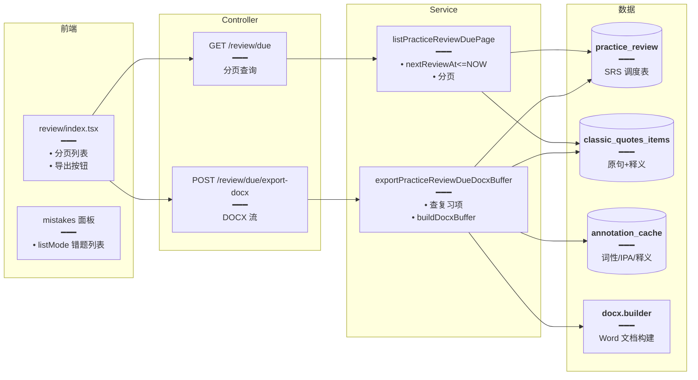

# 今日复习列表与 DOCX 导出

> 练习错题 / 收藏进入 **SRS 复习队列**，今日页列出到期复习项，支持分页浏览与 **DOCX 导出**（便于打印或离线复习）。复习算法与数据结构沿用现有 SRS 表，本轮补列表接口与导出能力。

## 延伸阅读

- [练习复习SRS.md](./练习复习SRS.md)：SRS 复习算法基础
- [英语收藏DOCX导出.md](./英语收藏DOCX导出.md)：收藏 DOCX 导出（姊妹篇，共用 docx builder）

---

## 1. 背景与目标

练习系统已有 SRS 调度（错题按间隔重复），但缺少：

- **今日复习列表**：用户看不到今天该复习哪些题。
- **导出复习内容**：用户希望把复习题导出为 Word 文档打印或离线做。

本轮新增：

- 后端 `listPracticeReviewDuePage`：分页查询当前用户到期复习的经典句。
- 后端 `exportPracticeReviewDueDocxBuffer`：导出 DOCX 二进制。
- 前端 `review/` 页：分页列表 + 导出按钮。
- 错题面板 `listMode`：在练习内查看错题列表。

## 2. 改动范围

**后端新增**

- `apps/backend/src/services/english-learning/dto/practice-review-due-list-query.dto.ts`
- `apps/backend/src/services/english-learning/dto/practice-review-export-docx.dto.ts`

**后端改动**

- `apps/backend/src/services/english-learning/english-learning.service.ts`：`listPracticeReviewDuePage`、`exportPracticeReviewDueDocxBuffer`
- `apps/backend/src/services/english-learning/english-learning.controller.ts`：`GET practice/review/items`、`POST practice/review/export-docx`、`GET practice/review/summary`

**前端改动**

- `apps/frontend/src/views/englishLearning/review/index.tsx`（今日复习列表页）
- `apps/frontend/src/views/englishLearning/practice/components/mistakes/`（错题面板 `listMode`）
- `apps/frontend/src/service/index.ts`、`apps/frontend/src/service/api.ts`：`listPracticeReviewDue`、`exportPracticeReviewDueDocx`

---

## 3. 实现思路

### 3.1 复习队列查询

- 复用现有 SRS 表（`english_practice_review` 或类似），字段含 `userId / itemId / nextReviewAt / stage`。
- 查询条件：`nextReviewAt <= NOW()`，按 `nextReviewAt ASC`。
- 分页：`page / pageSize`，默认 20。

### 3.2 DOCX 导出

- 复用 `english-favorites-docx.builder.ts` 的 `buildVocabularyFavoritesDocxBuffer` / `buildClassicQuoteFavoritesDocxBuffer`（与收藏 / 错题导出同一套 builder）。
- 单词复习：标题「今日复习 · 单词」→ 每条：词、音标（`/ipa/` 包裹）、词性、音节划分、释义、例句（斜体）。
- 经典句复习：标题「今日复习 · 经典句」→ 每条：英文、译文、出处、赏析（斜体）。
- 可选 `ids` 只导出选中项；否则按到期时间升序导出最多 `FAVORITES_DOCX_EXPORT_MAX` 条。
- 流式返回 `application/vnd.openxmlformats-officedocument.wordprocessingml.document`。

### 3.3 架构图



---

## 4. 关键代码对比与注释

### 4.1 `listPracticeReviewDuePage`（纯新增）

**改动后**（新增）· `apps/backend/src/services/english-learning/english-learning.service.ts`（约 Lxxx）

```typescript
// 分页查询当前用户到期复习的经典句
/**
 * 分页查询当前用户到期复习的经典句。
 * 条件：nextReviewAt <= NOW()，按 nextReviewAt ASC。
 */
	async listPracticeReviewDuePage(params: {
		userId: number;
		page: number;
		pageSize: number;
	}): Promise<{
		list: PracticeReviewDueItemDto[];
		total: number;
		page: number;
		pageSize: number;
	}> {
		const { userId, page, pageSize } = params;
		// 分页参数边界
		const safePage = Math.max(1, page);
		const safeSize = Math.min(100, Math.max(1, pageSize));

		// 查总数
		const total = await this.practiceReviewRepo.count({
			where: { userId, nextReviewAt: LessThanOrEqual(new Date()) },
		});

		// 查当前页，联表取原句+释义
		const rows = await this.practiceReviewRepo.find({
			where: { userId, nextReviewAt: LessThanOrEqual(new Date()) },
			order: { nextReviewAt: 'ASC' },
			skip: (safePage - 1) * safeSize,
			take: safeSize,
			relations: ['item'],
		});

		// 转 DTO
		const list = rows.map((r) => ({
			id: r.id,
			english: r.item.english,
			meaningZh: r.item.meaningZh,
			nextReviewAt: r.nextReviewAt,
			stage: r.stage,
		}));

		return { list, total, page: safePage, pageSize: safeSize };
	}
```

### 4.2 `exportPracticeReviewDueDocxBuffer`（纯新增，摘录）

**改动后**（新增）· `apps/backend/src/services/english-learning/english-learning.service.ts`（约 Lxxx，摘录）

```typescript
// 导出今日复习 DOCX：查复习项 → 拼文档 → buildDocxBuffer
/**
 * 导出今日复习 DOCX。
 * 结构：标题 → 每题（原句加粗 + 释义 + 词性/IPA/释义表）。
 */
	async exportPracticeReviewDueDocxBuffer(params: {
		userId: number;
	}): Promise<Buffer> {
		// 1. 查全部到期复习项（不分页，导出全量）
		const rows = await this.practiceReviewRepo.find({
			where: { userId, nextReviewAt: LessThanOrEqual(new Date()) },
			order: { nextReviewAt: 'ASC' },
			relations: ['item'],
		});

		// 2. 收集 english 批量查词元标注
		const englishes = rows.map((r) => r.item.english);
		const annotations = await this.batchGetSentenceWordAnnotations(englishes);

		// 3. 构建 docx children
		const children: any[] = [];
		// 标题
		children.push(
			docxBuilder.heading({ text: '今日复习', level: 1 }),
		);
		children.push(
			docxBuilder.paragraph({
				text: `共 ${rows.length} 题，导出时间 ${new Date().toLocaleString()}`,
			}),
		);

		// 逐题
		for (let i = 0; i < rows.length; i += 1) {
			const r = rows[i]!;
			const anns = annotations[r.item.english] ?? [];
			// 题号 + 原句（加粗）
			children.push(
				docxBuilder.heading({ text: `${i + 1}. ${r.item.english}`, level: 2 }),
			);
			// 中文释义
			children.push(
				docxBuilder.paragraph({ text: r.item.meaningZh ?? '' }),
			);
			// 词性/IPA/释义表
			if (anns.length > 0) {
				children.push(
					docxBuilder.table({
						rows: anns.map((a) => [a.word, a.posZh, a.ipa, a.meaningZh]),
					}),
				);
			}
		}

		// 4. 生成 buffer
		return docxBuilder.buildDocxBuffer({ children });
	}
```

### 4.3 Controller 导出端点（纯新增）

**改动后**（新增）· `apps/backend/src/services/english-learning/english-learning.controller.ts`（摘录）

```typescript
// 导出今日复习 DOCX：返回二进制流
	@Post('practice/review/due/export-docx')
	async exportReviewDueDocx(
		@CurrentUser() user: AuthUserDto,
		@Res() res: Response,
	) {
		// 生成 buffer
		const buffer = await this.englishLearningService.exportPracticeReviewDueDocxBuffer(
			{ userId: user.id },
		);
		// 文件名含日期
		const filename = `今日复习-${new Date().toISOString().slice(0, 10)}.docx`;
		// 设置响应头
		res.setHeader(
			'Content-Type',
			'application/vnd.openxmlformats-officedocument.wordprocessingml.document',
		);
		res.setHeader(
			'Content-Disposition',
			`attachment; filename="${encodeURIComponent(filename)}"`,
		);
		// 返回 buffer
		res.send(buffer);
	}
```

### 4.4 前端复习列表页（改动，摘录）

**改动后**（当前）· `apps/frontend/src/views/englishLearning/practice/review/index.tsx`（摘录）

```tsx
// 今日复习列表页：分页 + 导出
export default function ReviewPage() {
	const [page, setPage] = useState(1);
	const [data, setData] = useState<{ list: any[]; total: number }>({ list: [], total: 0 });
	const [loading, setLoading] = useState(false);

	// 拉取列表
	const fetch = useCallback(async () => {
		setLoading(true);
		try {
			const res = await listPracticeReviewDue({ page, pageSize: 20 });
			setData(res.data!);
		} finally {
			setLoading(false);
		}
	}, [page]);

	useEffect(() => {
		fetch();
	}, [fetch]);

	// 导出 DOCX
	const handleExport = async () => {
		const res = await exportPracticeReviewDueDocx();
		// 触发下载
		const blob = new Blob([res.data], {
			type: 'application/vnd.openxmlformats-officedocument.wordprocessingml.document',
		});
		const url = URL.createObjectURL(blob);
		const a = document.createElement('a');
		a.href = url;
		a.download = `今日复习-${new Date().toISOString().slice(0, 10)}.docx`;
		a.click();
		URL.revokeObjectURL(url);
	};

	return (
		<div className="p-4">
			<div className="mb-4 flex justify-between">
				<h1 className="text-xl font-bold">今日复习（{data.total}）</h1>
				<Button onClick={handleExport}>导出 DOCX</Button>
			</div>
			{/* 列表 */}
			<div className="space-y-2">
				{data.list.map((item) => (
					<div key={item.id} className="rounded-lg border p-3">
						<div className="font-medium">{item.english}</div>
						<div className="text-sm text-muted-foreground">{item.meaningZh}</div>
					</div>
				))}
			</div>
			{/* 分页 */}
			<div className="mt-4 flex justify-center gap-2">
				<Button disabled={page <= 1} onClick={() => setPage((p) => p - 1)}>
					上一页
				</Button>
				<span>第 {page} 页</span>
				<Button
					disabled={page * 20 >= data.total}
					onClick={() => setPage((p) => p + 1)}
				>
					下一页
				</Button>
			</div>
		</div>
	);
}
```

### 4.5 错题面板 `listMode`（改动，摘录）

**改动后**（当前）· `apps/frontend/src/views/englishLearning/practice/components/mistakes/index.tsx`（摘录）

```tsx
// 错题面板：listMode 下展示错题列表，可点击跳转练习
export function MistakesPanel(props: { mode?: 'list' | 'inline' }) {
	const { mode = 'inline' } = props;
	const { mistakes } = usePracticeStore();

	// list 模式：展示错题列表
	if (mode === 'list') {
		return (
			<div className="space-y-2">
				{mistakes.map((m, i) => (
					<div
						key={i}
						className="cursor-pointer rounded-lg border p-3 hover:bg-accent"
						onClick={() => jumpToItem(m)}
					>
						<div className="font-medium">{m.english}</div>
						<div className="text-sm text-muted-foreground">{m.meaningZh}</div>
					</div>
				))}
				{mistakes.length === 0 && (
					<div className="text-center text-muted-foreground">暂无错题</div>
				)}
			</div>
		);
	}

	// inline 模式：练习内错题快览（原有逻辑）
	return <div>...</div>;
}
```

---

## 5. 兼容性与影响

- **复习数据沿用 SRS 表**：不新增表，复用现有 `nextReviewAt` 调度。
- **DOCX 导出全量**：导出不分页，一次拉全部到期项；若数量极大可能慢，但复习量通常在几十到几百，可接受。
- **错题面板 listMode**：纯前端新增模式，不影响原有 inline 模式。

## 6. 相关源码路径

| 说明 | 路径 |
|------|------|
| 复习列表查询 | `apps/backend/src/services/english-learning/english-learning.service.ts` (`listPracticeReviewDuePage`) |
| 复习 DOCX 导出 | `apps/backend/src/services/english-learning/english-learning.service.ts` (`exportPracticeReviewDueDocxBuffer`) |
| DTO | `apps/backend/src/services/english-learning/dto/practice-review-due-list-query.dto.ts`、`practice-review-export-docx.dto.ts` |
| Controller 端点 | `apps/backend/src/services/english-learning/english-learning.controller.ts` |
| 前端复习页 | `apps/frontend/src/views/englishLearning/practice/review/index.tsx` |
| 错题面板 | `apps/frontend/src/views/englishLearning/practice/components/mistakes/index.tsx` |

---

（若与仓库最新源码不一致，以源码为准）
