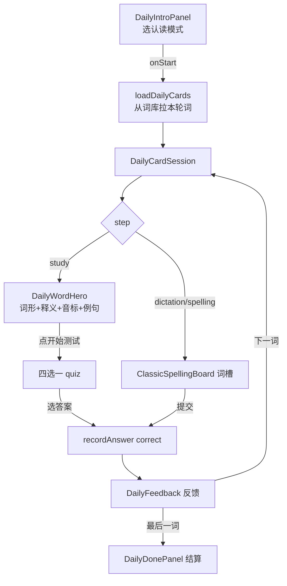
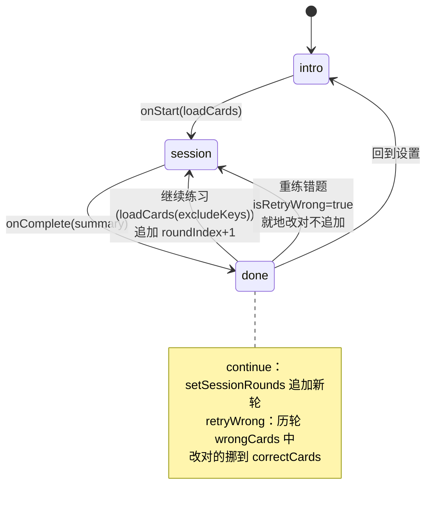

## 延伸阅读

- 练习报告多轮与续练（共用 rounds / sourceMeta）：[`练习报告多轮续练.md`](./练习报告多轮续练.md)
- 错题来源标记（今日记词错题入库带 `dailyMemorize`）：[`错题来源标记.md`](./错题来源标记.md)
- 产品使用说明：[`docs/项目指南.md`](../项目指南.md) §13.26
- 用户向更新条目：[`docs/项目更新信息.md`](../项目更新信息.md) §24

---

## 1. 背景与目标

「今日记词」原只有听写与看中写拼写两种模式，对词汇量大、重音弱的用户门槛偏高。本次新增**认读四选一**模式（看词选义），并为今日记词补齐与练习侧一致的**多轮续练 / 重练错题 / 报告保存**能力：

- **认读模式**：study 阶段展示词形 + 释义 + 音标 + 例句，quiz 阶段四选一选中文释义。
- **多轮续练**：完成一轮后可「继续练习」，从词库拉未练过的词追加新一轮；结算页按轮次展示明细与总正确率。
- **重练错题**：就地改对历轮错题（不追加轮次），提升总正确率。
- **报告保存**：今日记词保存练习报告，`source='dailyMemorize'`、`mode` 记录实际作答方式、`rounds`/`sourceMeta` 与练习侧对齐。

---

## 2. 改动范围

| 路径 | 说明 |
|------|------|
| `apps/frontend/src/views/englishLearning/daily/types.ts` | `DailyMemorizeMode` 新增 `recognition`；新增 `DailySessionRound` / `DailyQuizOption` |
| `apps/frontend/src/views/englishLearning/daily/components/DailyIntroPanel.tsx` | 模式选择新增「认读」卡片，设为默认 |
| `apps/frontend/src/views/englishLearning/daily/components/DailyCardSession.tsx` | 按 mode 切换 quiz 形态：认读走四选一，听写/拼写走词槽 |
| `apps/frontend/src/views/englishLearning/daily/utils/buildQuizOptions.ts` | 四选一干扰项生成：同词性 + 长度接近 + 汉字重叠评分 |
| `apps/frontend/src/views/englishLearning/daily/index.tsx` | 多轮状态机：continue 追加轮次，retryWrong 就地改对 |
| `apps/frontend/src/views/englishLearning/daily/components/DailyDonePanel.tsx` | 多轮展示 + 保存报告（rounds/sourceMeta）+ 错题入库带 `dailyMemorize` |

---

## 3. 实现思路

### 3.1 关键决策

1. **认读模式 = study → quiz 两阶段**：先展示词形/释义/音标/例句让用户记忆，再进入四选一；听写/拼写直接进 quiz（无 study 阶段），复用现有 `DailyCardStep`。
2. **干扰项从本轮其它词中选**：优先同词性、释义长度接近、与答案有少量汉字重叠的词，避免「城市」这类一眼假的选项；用 `usedDistractorLabelsRef` 防止同一释义在多题中反复出现。
3. **continue 追加轮次，retryWrong 就地改对**：与练习侧一致——重练不产生冗余轮次，而是把改对的词从历轮 `wrongCards` 挪到 `correctCards`，总正确率自然提升。
4. **今日记词报告 `source='dailyMemorize'`**：与练习侧 `library/pack/live` 等来源区分，便于列表筛选与错题来源标记。
5. **认读报告 `mode='recognition'`**：报告 mode 如实记录作答方式；续练时认读报告回退到 dictation（因练习侧无 recognition 会话形态，见 `resumeFromReport`）。
6. **错题入库带 `source: 'dailyMemorize'`**：今日记词产生的错题标记来源，重置记词进度时只清这部分（见 [`错题来源标记.md`](./错题来源标记.md)）。

### 3.2 认读模式交互流



### 3.3 多轮与重练错题状态机



---

## 4. 关键代码与逐行注释

> 本篇为**新增模式 + 多轮状态机**，以下贴当前源码，逐行注释。

### 4.1 类型定义（`apps/frontend/.../daily/types.ts`）

**改动后** · `apps/frontend/src/views/englishLearning/daily/types.ts`（当前，全文）

```typescript
// 词卡来源：server（服务端词库）或 starter（本地起手词）
export type DailyCardOrigin = 'server' | 'starter';

// 今日记词词源：仅词汇库随机（间隔复习走「今日复习」）
export type DailyMemorizeSource = 'library';

// 作答方式新增 recognition（认读四选一）
export type DailyMemorizeMode = 'recognition' | 'dictation' | 'spelling';

// 单个记词卡：词形/音标/词性/分词/释义/例句 + 来源 + 收藏 id
export type DailyVocabCard = {
	key: string;
	word: string;
	ipa: string;
	pos: string;
	segmentation: string;
	translationZh: string;
	example: string;
	origin: DailyCardOrigin;
	// 服务端队列带回的收藏 id，可选
	favoriteId?: string | null;
};

// 卡片流程阶段：study（认读记忆）/ quiz（作答）/ feedback（反馈）
export type DailyCardStep = 'study' | 'quiz' | 'feedback';

// 四选一选项：id / 中文释义 / 是否正确
export type DailyQuizOption = {
	id: string;
	label: string;
	correct: boolean;
};

// 单轮结算：对错数 + 累计已练 + 词池总量 + 对错卡片
export type DailySessionSummary = {
	correctCount: number;
	wrongCount: number;
	total: number;
	// 记词累计已练习总数（含本轮），用于「已练 N / 总量」展示
	practicedTotal: number;
	// 词池总量，有则展示进度
	poolTotal?: number;
	wrongCards: DailyVocabCard[];
	correctCards: DailyVocabCard[];
};

// 记词会话的一轮：仅「继续练习」追加；重练错题就地改对不追加
export type DailySessionRound = {
	roundIndex: number;
	wrongCards: DailyVocabCard[];
	correctCards: DailyVocabCard[];
	completedAt: string;
};
```

**变更摘要**：`DailyMemorizeMode` 新增 `recognition`；新增 `DailySessionRound` 与 `DailyQuizOption` 类型。

---

### 4.2 模式选择面板：认读为默认（`DailyIntroPanel.tsx`）

**改动后** · `apps/frontend/src/views/englishLearning/daily/components/DailyIntroPanel.tsx`（当前，约 L106 + L134–L163）

```typescript
	// 模式默认 recognition（认读门槛最低，适合大多数用户）
	const [mode, setMode] = useState<DailyMemorizeMode>('recognition');
	// 报告保存方式默认手动
	const [reportSaveMode, setReportSaveMode] =
		useState<PracticeReportSaveMode>('manual');

	// 三种模式卡片：认读 / 听写 / 拼写
	const modes = useMemo(
		() => [
			{
				// 认读：看词选义，默认选项
				value: 'recognition' as const,
				title: t('englishLearning.daily.modeRecognition'),
				desc: t('englishLearning.daily.introDesc', { count: wordsPerRound }),
				tip: t('englishLearning.daily.introHint'),
				Icon: Eye,
			},
			{
				// 听写：听音写词
				value: 'dictation' as const,
				title: t('englishLearning.daily.modeDictation'),
				desc: t('englishLearning.daily.introDescDictation', {
					count: wordsPerRound,
				}),
				tip: t('englishLearning.daily.introHintDictation'),
				Icon: Headphones,
			},
			{
				// 拼写：看中写词
				value: 'spelling' as const,
				title: t('englishLearning.daily.modeSpelling'),
				desc: t('englishLearning.daily.introDescSpelling', {
					count: wordsPerRound,
				}),
				tip: t('englishLearning.daily.introHintSpelling'),
				Icon: Languages,
			},
		],
		[t, wordsPerRound],
	);
```

**变更摘要**：模式新增「认读」卡片并设为默认；复用 `SetupPickCard` 组件保证与练习侧布局一致。

---

### 4.3 会话组件：按 mode 切换 quiz 形态（`DailyCardSession.tsx`）

**改动后** · `apps/frontend/src/views/englishLearning/daily/components/DailyCardSession.tsx`（当前，关键片段 L65–L155）

```typescript
export function DailyCardSession({ cards, mode, onComplete }: DailyCardSessionProps) {
	// 听写/拼写统称「拼写模式」，走词槽作答
	const isSpellMode = mode === 'dictation' || mode === 'spelling';
	// 当前词索引
	const [index, setIndex] = useState(0);
	// 阶段：拼写模式直接进 quiz；认读先进 study
	const [step, setStep] = useState<DailyCardStep>(
		isSpellMode ? 'quiz' : 'study',
	);
	// 四选一选项（认读模式用）
	const [quizOptions, setQuizOptions] = useState<DailyQuizOption[]>([]);
	// 词槽值（拼写模式用）
	const [slotValues, setSlotValues] = useState<string[]>([]);
	// ...（其它状态略）
	// 本轮已用干扰项释义集合，避免重复
	const usedDistractorLabelsRef = useRef(new Set<string>());

	// 换词时重置作答态：清空选项/词槽，拼写进 quiz，认读进 study
	useEffect(() => {
		if (!card) return;
		setQuizOptions([]);
		setSlotValues(Array.from({ length: tokens.length }, () => ''));
		setActiveSlot(0);
		setShowPos(false);
		setShowIpa(false);
		if (isSpellMode) {
			setStep('quiz');
			// 听写自动播一遍发音
			if (mode === 'dictation') void playWord({ force: true });
		} else {
			setStep('study');
			// 认读 study 阶段也播发音
			void playWord({ force: true });
		}
	}, [card?.key, mode, isSpellMode, tokens.length]);

	// 认读模式：从 study 进入 quiz，生成四选一
	const onStartQuiz = useCallback(() => {
		// 仅认读模式触发
		if (!card || isSpellMode) return;
		// 从本轮其它词中选干扰项，避免重复释义
		const options = buildQuizOptions(card, cards, {
			usedDistractorLabels: usedDistractorLabelsRef.current,
		});
		// 把用过的干扰项释义记入集合
		for (const opt of options) {
			if (!opt.correct) {
				usedDistractorLabelsRef.current.add(opt.label);
			}
		}
		setQuizOptions(options);
		setStep('quiz');
	}, [card, cards, isSpellMode]);

	// 记录作答结果并进入反馈阶段
	const recordAnswer = useCallback(
		(correct: boolean) => {
			if (!card) return;
			setLastCorrect(correct);
			// 累积 pendingRecords，最后一批提交
			setPendingRecords((prev) => [
				...prev,
				{ key: card.key, correct, origin: card.origin },
			]);
			setStep('feedback');
		},
		[card],
	);

	// 认读：选选项即判分
	const onPickOption = useCallback(
		(option: DailyQuizOption) => {
			// 仅认读 quiz 阶段响应
			if (!card || step !== 'quiz' || isSpellMode) return;
			recordAnswer(option.correct);
		},
		[card, isSpellMode, recordAnswer, step],
	);
```

**变更摘要**：`isSpellMode` 区分作答形态；认读走 study→quiz(四选一)→feedback，听写/拼写直接 quiz(词槽)→feedback；`usedDistractorLabelsRef` 防止干扰项重复。

### 4.3.1 认读 quiz 渲染（L476–L507）

```tsx
				{/* 认读模式 quiz：顶部词条 + 四选一选项 */}
				{step === 'quiz' && !isSpellMode ? (
					<div className="flex min-h-0 flex-1 flex-col justify-between">
						{/* 顶部展示词形/音标/词性，可点播放 */}
						<SessionPromptPanel className="bg-theme/5 shrink-0 border-theme/10 py-3.5">
							<DailyQuizWordBar
								word={card.word}
								ipa={card.ipa}
								pos={card.pos}
								playing={playing}
								playLabel={playLabel}
								onPlay={() => void playWord()}
							/>
						</SessionPromptPanel>
						<div className="flex shrink-0 flex-col gap-3">
							{/* 提示语：请选择正确释义 */}
							<p className="text-textcolor/55 text-left text-sm leading-snug">
								{t('englishLearning.daily.quizHint')}
							</p>
							<div className="flex flex-col gap-2">
								{/* 渲染 4 个选项 */}
								{quizOptions.map((option) => (
									<Button
										key={option.id}
										type="button"
										variant="ghost"
										className={QUIZ_OPTION_CLASS}
										onClick={() => onPickOption(option)}
									>
										{option.label}
									</Button>
								))}
							</div>
						</div>
					</div>
				) : null}
```

---

### 4.4 四选一干扰项生成（`buildQuizOptions.ts`）

**改动后** · `apps/frontend/src/views/englishLearning/daily/utils/buildQuizOptions.ts`（当前，全文 L38–L134）

```typescript
/**
 * 干扰项迷惑度评分：同词性 +5、释义长度接近 +4、与答案汉字重叠最多 +2；
 * 已用过的释义 -200（大幅降权，避免重复）；最后加随机数打散同分。
 */
function scoreDistractor(
	candidate: DailyVocabCard,
	card: DailyVocabCard,
	answerLen: number,
	used: ReadonlySet<string>,
): number {
	// 候选词的中文释义
	const label = candidate.translationZh.trim();
	let score = 0;

	// 已用作干扰项的释义大幅降权
	if (used.has(label)) score -= 200;

	// 词性相同加分（normalizePos 统一成小写、去句号、取第一段）
	const cardPos = normalizePos(card.pos);
	const candPos = normalizePos(candidate.pos);
	if (cardPos && candPos && cardPos === candPos) score += 5;

	// 释义长度比在 0.45~2.2 之间加分，超过 3.5 倍减分
	const len = label.length;
	const ratio = len / Math.max(answerLen, 1);
	if (ratio >= 0.45 && ratio <= 2.2) score += 4;
	else if (ratio > 3.5) score -= 3;

	// 与答案共享汉字数加分（最多 2），增加迷惑度
	score += Math.min(sharedHanCount(label, card.translationZh.trim()), 2);

	// 随机数打散同分，避免固定顺序
	score += Math.random();
	return score;
}

/**
 * 构建四选一：1 个正确答案 + 3 个干扰项。
 * 优先从本轮其它词中按迷惑度选；不足时用 FALLBACK_LABELS 兜底。
 */
export function buildQuizOptions(
	card: DailyVocabCard,
	pool: DailyVocabCard[],
	options?: BuildQuizOptionsParams,
): DailyQuizOption[] {
	// 已用干扰项集合
	const used = options?.usedDistractorLabels ?? new Set<string>();
	// 正确答案释义
	const answer = card.translationZh.trim();

	// 候选：排除自身、空释义、与答案相同的词
	const candidates = pool.filter(
		(w) =>
			w.key !== card.key &&
			w.translationZh.trim() &&
			w.translationZh.trim() !== answer,
	);

	// 按迷惑度降序排序
	const scored = candidates.map((w) => ({
		w,
		score: scoreDistractor(w, card, answer.length, used),
	}));
	scored.sort((a, b) => b.score - a.score);

	// 取前 3 个不重复释义作为干扰项
	const picked: string[] = [];
	const seen = new Set<string>();
	for (const { w } of scored) {
		const label = w.translationZh.trim();
		if (seen.has(label)) continue;
		seen.add(label);
		picked.push(label);
		if (picked.length >= 3) break;
	}

	// 词库不足时用兜底词表补到 3 个
	for (const label of shuffle(FALLBACK_LABELS)) {
		if (picked.length >= 3) break;
		if (label === answer || picked.includes(label) || used.has(label)) continue;
		picked.push(label);
	}
	// 再补一轮（忽略 used，确保必有 3 个）
	for (const label of shuffle(FALLBACK_LABELS)) {
		if (picked.length >= 3) break;
		if (label === answer || picked.includes(label)) continue;
		picked.push(label);
	}

	// 组装：1 正确 + 3 干扰，最后洗牌
	const quizOptions: DailyQuizOption[] = [
		{ id: 'correct', label: answer, correct: true },
		...picked.slice(0, 3).map((label, i) => ({
			id: `d${i}`,
			label,
			correct: false,
		})),
	];
	return shuffle(quizOptions);
}
```

**变更摘要**：新增 `buildQuizOptions`，从本轮词池按迷惑度评分选 3 个干扰项，不足时用兜底词表；`usedDistractorLabels` 防止多题重复。

---

### 4.5 多轮状态机：continue 追加 / retryWrong 就地改对（`daily/index.tsx`）

**改动后** · `apps/frontend/src/views/englishLearning/daily/index.tsx`（当前，L120–L185）

```typescript
	// 一轮完成回调
	const onComplete = useCallback(
		(next: DailySessionSummary) => {
			if (isRetryWrong) {
				// 重练不追加轮次：改对的词从历轮 wrong 挪到 correct
				const correctKeys = new Set(next.correctCards.map((c) => c.key));
				setSessionRounds((prev) =>
					prev.map((round) => {
						const moved: DailyVocabCard[] = [];
						const stillWrong: DailyVocabCard[] = [];
						for (const card of round.wrongCards) {
							if (correctKeys.has(card.key)) moved.push(card);
							else stillWrong.push(card);
						}
						// 该轮无改对则原样返回
						if (moved.length === 0) return round;
						return {
							...round,
							wrongCards: stillWrong,
							correctCards: [...round.correctCards, ...moved],
						};
					}),
				);
				setIsRetryWrong(false);
			} else {
				// 正常完成：追加新轮，roundIndex = 最大序号 + 1
				setSessionRounds((prev) => {
					const maxIdx = prev.reduce((m, r) => Math.max(m, r.roundIndex), 0);
					return [
						...prev,
						{
							roundIndex: maxIdx + 1,
							wrongCards: next.wrongCards,
							correctCards: next.correctCards,
							completedAt: new Date().toISOString(),
						},
					];
				});
			}
			setSummary(next);
			clearDailyRunning();
			setPhase('done');
		},
		[clearDailyRunning, isRetryWrong],
	);

	// 继续练习：拉未练过的词，开新一轮
	const onContinuePractice = useCallback(async () => {
		setContinueLoading(true);
		try {
			// 排除已练过的 key
			const loaded = await loadDailyCards(practicedKeysRef.current);
			if (loaded.length === 0) return;
			beginSession(loaded, mode, false);
		} finally {
			setContinueLoading(false);
		}
	}, [beginSession, mode]);

	// 重练错题：收集所有轮的错题去重，打乱后开 retry 会话
	const onRetryWrong = useCallback(() => {
		const wrong = new Map<string, DailyVocabCard>();
		for (const round of sessionRounds) {
			for (const card of round.wrongCards) {
				if (!wrong.has(card.key)) wrong.set(card.key, card);
			}
		}
		if (wrong.size === 0) return;
		beginSession(shufflePracticeItems([...wrong.values()]), mode, true);
	}, [beginSession, mode, sessionRounds]);
```

**变更摘要**：`onComplete` 按 `isRetryWrong` 分支——重练就地改对历轮，正常完成追加新轮；`onContinuePractice` 排除已练 key 拉新词；`onRetryWrong` 收集跨轮错题去重。

---

### 4.6 结算页：多轮展示 + 保存报告 + 错题入库（`DailyDonePanel.tsx`）

**改动后** · `apps/frontend/src/views/englishLearning/daily/components/DailyDonePanel.tsx`（当前，关键片段 L207–L300）

```typescript
	// 保存错题：跨轮错题去重后入库，来源标记 dailyMemorize
	const handleSaveMistakes = useCallback(async () => {
		// 跨轮错题合并去重
		const wrongCards = rounds.flatMap((r) => r.wrongCards);
		const unique = new Map<string, DailyVocabCard>();
		for (const card of wrongCards) {
			if (!unique.has(card.key)) unique.set(card.key, card);
		}
		if (unique.size === 0) return;
		setSaveMistakesLoading(true);
		try {
			// 调用批量加错题，source=dailyMemorize 区分来源
			const res = await batchAddEnglishVocabularyMistakes(
				[...unique.values()].map((card) => ({
					word: card.word,
					ipa: card.ipa,
					pos: card.pos,
					segmentation: card.segmentation,
					translationZh: card.translationZh,
					example: card.example,
					lastUserInput: '',
				})),
				{ source: 'dailyMemorize' },
			);
			// ...（Toast 提示略）
		} finally {
			setSaveMistakesLoading(false);
		}
	}, [rounds, t]);

	// 保存练习报告：多轮 + sourceMeta(poolTotal) + source=dailyMemorize
	const handleSaveReport = useCallback(async () => {
		if (!summary || summary.total === 0 || reportSavingRef.current) return;
		if (rounds.length === 0) return;
		reportSavingRef.current = true;
		setReportSaveState('saving');
		const savingSig = roundsSaveSig;
		try {
			// 报告 id 复用，跨轮次覆盖写入
			const reportId = reportIdRef.current ?? crypto.randomUUID();
			reportIdRef.current = reportId;
			// 按 roundIndex 升序组装报告 rounds
			const reportRounds = [...rounds]
				.sort((a, b) => a.roundIndex - b.roundIndex)
				.map((round) => ({
					roundIndex: round.roundIndex,
					completedAt: round.completedAt,
					items: cardsToReportItems(round.wrongCards, round.correctCards),
				}));
			// 扁平 items = 所有轮拍平
			const items = reportRounds.flatMap((r) => r.items);
			const sourceTitle = t('route.englishLearning.daily.title');
			await createEnglishPracticeReport({
				reportId,
				contentKind: 'vocab',
				// 如实记录作答方式：recognition/dictation/spelling
				mode,
				// 来源标记 dailyMemorize，与练习侧区分
				source: 'dailyMemorize',
				order: 'random',
				count: summary.total,
				sourceTitle,
				title: buildDailyReportTitle(mode, isRetryWrong, t),
				isRetryWrong,
				saveMode,
				items,
				rounds: reportRounds,
				// sourceMeta 仅存 poolTotal（今日记词无 libraryId/streamId）
				sourceMeta: {
					...(summary.poolTotal != null && summary.poolTotal > 0
						? { poolTotal: summary.poolTotal }
						: {}),
				},
			});
			lastSavedSigRef.current = savingSig;
			setReportSaveState('saved');
		} catch {
			setReportSaveState('idle');
			Toast({
				type: 'warning',
				title: t('englishLearning.practice.saveReportFailed'),
			});
		} finally {
			reportSavingRef.current = false;
		}
	}, [isRetryWrong, mode, rounds, roundsSaveSig, saveMode, summary, t]);
```

**变更摘要**：错题入库带 `source: 'dailyMemorize'`；报告保存带 `mode`（如实记录）、`source: 'dailyMemorize'`、`rounds`、`sourceMeta.poolTotal`。

---

## 5. 兼容性与影响

- **默认模式**：今日记词默认改为「认读」，老用户首次进入看到的是四选一，降低门槛。
- **报告兼容**：今日记词报告 `source='dailyMemorize'`、`mode` 可为 `recognition`；练习报告列表筛选 `source` 时可区分。
- **错题来源**：今日记词错题带 `source='dailyMemorize'`，重置记词进度时只清这部分（见错题来源标记篇）。
- **破坏性**：无；认读为新增模式，听写/拼写行为不变。

---

## 6. 建议回归

1. **认读模式**：今日记词选认读，study 阶段展示词形/释义/音标/例句，点「开始测试」进四选一，选答案后反馈。
2. **干扰项质量**：四选一选项应来自本轮其它词，词性相同、长度接近；同一释义不在多题中重复。
3. **多轮续练**：完成一轮点「继续练习」，新词不重复已练；结算页展示两轮明细与总正确率。
4. **重练错题**：点「重练错题」，队列为历史错题；改对后结算页不追加轮次但对应条目变为正确。
5. **保存报告**：今日记词保存报告，列表中 `source` 为「今日记词」、`mode` 对应实际作答方式；详情页展示 rounds。
6. **保存错题**：今日记词错题入库后，错题来源标记为 `dailyMemorize`。

---

## 7. 相关源码路径

| 说明 | 路径 |
|------|------|
| 类型 | `apps/frontend/src/views/englishLearning/daily/types.ts` |
| 模式选择 | `apps/frontend/src/views/englishLearning/daily/components/DailyIntroPanel.tsx` |
| 会话组件 | `apps/frontend/src/views/englishLearning/daily/components/DailyCardSession.tsx` |
| 四选一选项 | `apps/frontend/src/views/englishLearning/daily/utils/buildQuizOptions.ts` |
| 页面状态机 | `apps/frontend/src/views/englishLearning/daily/index.tsx` |
| 结算页 | `apps/frontend/src/views/englishLearning/daily/components/DailyDonePanel.tsx` |

---

若与仓库最新源码不一致，以源码为准。
