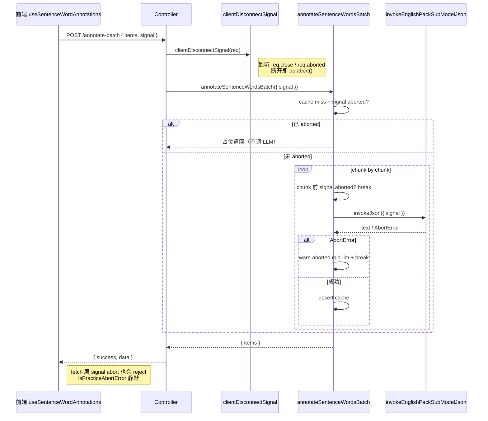

# 句内词标注断连取消

> 延伸阅读：[句内词标注缓存与批量标注.md](./句内词标注缓存与批量标注.md)（本篇在其基础上为后端批量 / 单句标注链路加 `signal` 透传与 abort 检查）、[练习请求作用域与预热.md](./练习请求作用域与预热.md)（前端侧的 `requestSignal` 由 `practiceRequestScope` 产生，本篇后端 `clientDisconnectSignal` 是另一条独立的断连取消通道，二者协同覆盖「用户切题」与「客户端断网」两类取消场景）。

## 1. 背景与目标

经典句看中写词槽练习需要为句内每个词标注 `posZh / ipa / meaningZh`（词性、音标、释义）。批量标注接口 `POST /english-learning/sentence-words/annotate-batch` 会在 miss 时按段（每段 `SENTENCE_WORD_ANNOTATION_BATCH_LLM_CHUNK=12` 句）调 LLM 子模型，单次请求可能跑数十秒。

此前的问题：

1. **客户端断开后 LLM 循环不停**：用户切题 / 关页 / 网络断开时，前端 `useSentenceWordAnnotations` 用 `cancelled` 标志位丢弃结果，但后端并不知道，仍在跑 LLM 子模型，浪费配额与连接池。
2. **批量标注 multi-llm 失败被误报**：abort 期间的 LLM reject 被当作普通失败打 warn 日志，刷屏且掩盖真问题。

本轮目标：

- 后端新增 `clientDisconnectSignal(req)`：监听 `req` 的 `close` / `aborted` 事件，断开即 abort，返回 `AbortSignal` 透传到 `annotateSentenceWords` / `annotateSentenceWordsBatch` / `annotateSentenceWordsMultiViaLlmAndCache` / `annotateSentenceWordsViaLlmAndCache` / `invokeEnglishPackSubModelJson`。
- LLM 循环每个 chunk 前检查 `signal.aborted`，aborted 即 `break` 并 warn 标识 aborted；catch 内区分 abort 与真失败，abort 不打「failed」日志。
- 前端 `useSentenceWordAnnotations` 与 `sentenceWordAnnotationCache` 接 `signal`：切题时 abort 旧请求，abort 不写缓存、不 Toast。

## 2. 改动范围

- `apps/backend/src/services/english-learning/english-learning.controller.ts`（新增 `clientDisconnectSignal`，接入单句 / 批量两个端点）
- `apps/backend/src/services/english-learning/english-learning.service.ts`（`annotateSentenceWords` / `annotateSentenceWordsBatch` / `annotateSentenceWordsMultiViaLlmAndCache` / `annotateSentenceWordsViaLlmAndCache` 接 `signal` 并加 abort 检查 / 日志区分）
- `apps/frontend/src/views/englishLearning/practice/hooks/useSentenceWordAnnotations.ts`（接 `signal`，abort 不写缓存不 Toast）
- `apps/frontend/src/views/englishLearning/practice/utils/sentenceWordAnnotationCache.ts`（`ensureSentenceWordAnnotation` / `prefetchSentenceWordAnnotationsBatch` / `fillMissesWithLlm` 接 `signal`，新增 `abortReject`）

## 3. 实现思路

### 3.1 后端 clientDisconnectSignal：req.close/aborted → AbortController

- **监听 req 事件**：Express / Nest 底层 `req` 在客户端断开时触发 `close`（流结束）或 `aborted`（中断）；`req.aborted` 同步标志位表示已断开。
- **幂等 abort**：`onDisconnect` 检查 `ac.signal.aborted`，未 abort 才 abort，避免重复触发。
- **已断开兜底**：若调用时 `req.aborted` 已为 true（极端时序），用 `queueMicrotask` 异步 abort，避免同步 throw 影响控制器流程。
- **与 SSE abort 区分**：`wireEnglishLearningSseAbort` 是 SSE 端点的 abort（基于 `res` close），本篇 `clientDisconnectSignal` 是普通 HTTP 端点的 abort（基于 `req` close/aborted），二者不混用。

### 3.2 service 层 signal 透传与 abort 检查

- **入口检查**：`annotateSentenceWords` / `annotateSentenceWordsBatch` 在 cache miss 后、调 LLM 前检查 `signal.aborted`，aborted 即 throw `AbortError` / 返回占位，不进 LLM。
- **chunk 间检查**：`annotateSentenceWordsMultiViaLlmAndCache` 在 `for` 循环每个 chunk 前检查 `signal.aborted`，aborted 即 `break`，不再调下一段 LLM。
- **catch 区分**：LLM reject 时若 `signal.aborted` 或 `e.name === 'AbortError'`，只 warn `aborted mid-llm`，不报 `failed`；其余走原失败日志 + `BadGatewayException`。
- **子模型调用透传**：`invokeEnglishPackSubModelJson` 接 `signal`，fetch 层 abort 即 reject `AbortError`（已有能力，本轮补透传）。

### 3.3 前端 hook + cache 接 signal

- **`useSentenceWordAnnotations`**：从 `args.signal`（父级 `requestSignal`）派生本地 `AbortController`，`signal.aborted` 时同步 abort 本地 ac；effect cleanup 时 `ac.abort()` + 移除父级 listener。catch 内 `isPracticeAbortError` 静默。
- **`ensureSentenceWordAnnotation`**：`signal.aborted` 时直接 `reject(AbortedError)`；inflight 共享时用 `Promise.race([pending, abortReject(signal)])` 让 abort 也能 reject；写缓存前再检查 `signal.aborted`，aborted 不写。
- **`prefetchSentenceWordAnnotationsBatch` / `fillMissesWithLlm`**：传 `signal` 到 `annotateEnglishSentenceWordsBatch`；then 内检查 `signal.aborted` 不写缓存；catch 内 `isPracticeAbortError` 静默。

### 3.4 时序图



**读图要点**：`clientDisconnectSignal` 是「客户端断开 → 后端 LLM 循环 break」的桥梁；aborted 时不调 LLM、不写缓存、不报 failed；前端 fetch 层也会因 signal abort 而 reject，由 `isPracticeAbortError` 静默。

## 4. 关键实现（改动前 / 改动后对比 + 注释）

### 4.1 `clientDisconnectSignal`（`apps/backend/src/services/english-learning/english-learning.controller.ts`）

**对比范围**：纯新增函数 `clientDisconnectSignal`，位于 `wireEnglishLearningSseAbort` 之后。

**改动后** · `apps/backend/src/services/english-learning/english-learning.controller.ts`（新增，约 L246–L259）

```typescript
// 普通 HTTP：客户端断开时 abort，供 LLM / batch 循环检查
/** 普通 HTTP：客户端断开时 abort，供 LLM / batch 循环检查 */
function clientDisconnectSignal(req: Request): AbortSignal {
	// 新建 AbortController：断开时 abort，signal 透传到 service / LLM
	const ac = new AbortController();
	// 断开回调：幂等 abort，避免重复触发
	const onDisconnect = () => {
		// 未 abort 才 abort，幂等
		if (!ac.signal.aborted) ac.abort();
	};
	if (req.aborted) {
		// 调用时已断开：异步 abort，避免同步 throw 影响控制器流程
		queueMicrotask(onDisconnect);
	} else {
		// 监听 close（流结束）与 aborted（中断），任一触发即 abort
		req.once('close', onDisconnect);
		req.once('aborted', onDisconnect);
	}
	// 返回 signal 透传给 service
	return ac.signal;
}
```

**变更摘要**：纯新增；监听 `req.close` / `req.aborted`，断开即 abort；已断开用 `queueMicrotask` 异步 abort 兜底。

### 4.2 `annotateSentence` 与 `annotateSentenceBatch` 端点接入（`apps/backend/src/services/english-learning/english-learning.controller.ts`）

**对比范围**：`EnglishLearningController` 的 `annotateSentence` 与 `annotateSentenceBatch` 两个端点方法。

**改动前** · `apps/backend/src/services/english-learning/english-learning.controller.ts`（基线，约 L1061–L1090）

```typescript
// 旧版 annotateSentence：无 signal
	async annotateSentence(@Req() req, ...) {
		const userId = ...;
		// 旧版：不接 signal
		const data = await this.englishLearningService.annotateSentenceWords({
			userId,
			english: dto.english,
			words: dto.words,
		});
		return { success: true, data };
	}

// 旧版 annotateSentenceBatch：无 signal
	async annotateSentenceBatch(@Req() req, ...) {
		const userId = ...;
		// 旧版：不接 signal
		const data = await this.englishLearningService.annotateSentenceWordsBatch({
			userId,
			items: dto.items,
			cacheOnly: dto.cacheOnly === true,
		});
		return { success: true, data };
	}
```

**改动后** · `apps/backend/src/services/english-learning/english-learning.controller.ts`（当前，约 L1076–L1107）

```typescript
// 新版 annotateSentence：接 clientDisconnectSignal
	async annotateSentence(@Req() req, ...) {
		const userId = ...;
		// 新增：从 req 派生断连 signal
		const signal = clientDisconnectSignal(req);
		const data = await this.englishLearningService.annotateSentenceWords({
			userId,
			english: dto.english,
			words: dto.words,
			// 新增：透传 signal
			signal,
		});
		return { success: true, data };
	}

// 新版 annotateSentenceBatch：接 clientDisconnectSignal
	async annotateSentenceBatch(@Req() req, ...) {
		const userId = ...;
		// 新增：从 req 派生断连 signal
		const signal = clientDisconnectSignal(req);
		const data = await this.englishLearningService.annotateSentenceWordsBatch({
			userId,
			items: dto.items,
			cacheOnly: dto.cacheOnly === true,
			// 新增：透传 signal
			signal,
		});
		return { success: true, data };
	}
```

**变更摘要**：两个端点调 `clientDisconnectSignal(req)` 取 signal 并透传到 service。

### 4.3 `annotateSentenceWords` 接 signal + 入口 abort 检查（`apps/backend/src/services/english-learning/english-learning.service.ts`）

**对比范围**：`annotateSentenceWords` 方法签名新增 `signal`；cache miss 后、调 LLM 前加 abort 检查；`annotateSentenceWordsViaLlmAndCache` 调用透传 `signal`。

**改动前** · `apps/backend/src/services/english-learning/english-learning.service.ts`（基线，约 L7429–L7475）

```typescript
// 旧版 annotateSentenceWords：无 signal 参数
	async annotateSentenceWords(params: {
		userId: number;
		english: string;
		words: string[];
	}): Promise<{ words: SentenceWordAnnotationDto[] }> {
		await this.purgeStaleSentenceWordAnnotationCache();

		const english = params.english.trim();
		const words = params.words.map((w) => w.trim()).filter(Boolean);
		if (!english || words.length === 0) {
			throw new BadRequestException('english 与 words 不能为空');
		}
		if (words.length > 80) {
			throw new BadRequestException('words 过多');
		}

		const englishNorm = english.toLowerCase();
		const cacheKey = buildSentenceWordAnnotationCacheKey(englishNorm, words);

		const hit = await this.sentenceWordAnnotationCacheRepo.findOne({
			where: { cacheKey },
		});
		if (isUsableSentenceWordAnnotations(hit?.annotations, words.length)) {
			return { words: hit!.annotations };
		}

		// 旧版：无 abort 检查，直接进 inflight / LLM

		const inflight = this.annotateSentenceInflight.get(cacheKey);
		if (inflight) return inflight;

		// 旧版：不透传 signal
		const run = this.annotateSentenceWordsViaLlmAndCache({
			userId: params.userId,
			english,
			englishNorm,
			words,
			cacheKey,
		}).finally(() => {
			this.annotateSentenceInflight.delete(cacheKey);
		});
		this.annotateSentenceInflight.set(cacheKey, run);
		return run;
	}
```

**改动后** · `apps/backend/src/services/english-learning/english-learning.service.ts`（当前，约 L7433–L7482）

```typescript
// 新版 annotateSentenceWords：新增 signal 参数 + 入口 abort 检查 + 透传 signal
	async annotateSentenceWords(params: {
		userId: number;
		english: string;
		words: string[];
		// 新增：客户端断连 signal
		signal?: AbortSignal;
	}): Promise<{ words: SentenceWordAnnotationDto[] }> {
		await this.purgeStaleSentenceWordAnnotationCache();

		const english = params.english.trim();
		const words = params.words.map((w) => w.trim()).filter(Boolean);
		if (!english || words.length === 0) {
			throw new BadRequestException('english 与 words 不能为空');
		}
		if (words.length > 80) {
			throw new BadRequestException('words 过多');
		}

		const englishNorm = english.toLowerCase();
		const cacheKey = buildSentenceWordAnnotationCacheKey(englishNorm, words);

		const hit = await this.sentenceWordAnnotationCacheRepo.findOne({
			where: { cacheKey },
		});
		if (isUsableSentenceWordAnnotations(hit?.annotations, words.length)) {
			return { words: hit!.annotations };
		}

		// 新增：cache miss 后、调 LLM 前检查 signal，aborted 即 throw AbortError，不进 LLM
		if (params.signal?.aborted) {
			this.logger.warn('[EnglishLearning] annotateSentenceWords aborted');
			// 构造 AbortError，让上层 catch 统一识别
			const err = new Error('Aborted');
			err.name = 'AbortError';
			throw err;
		}

		const inflight = this.annotateSentenceInflight.get(cacheKey);
		if (inflight) return inflight;

		// 新版：透传 signal 到 LLM 调用
		const run = this.annotateSentenceWordsViaLlmAndCache({
			userId: params.userId,
			english,
			englishNorm,
			words,
			cacheKey,
			// 新增：透传 signal
			signal: params.signal,
		}).finally(() => {
			this.annotateSentenceInflight.delete(cacheKey);
		});
		this.annotateSentenceInflight.set(cacheKey, run);
		return run;
	}
```

**变更摘要**：签名加 `signal?`；cache miss 后 abort 检查 throw `AbortError`；`annotateSentenceWordsViaLlmAndCache` 调用透传 `signal`。

### 4.4 `annotateSentenceWordsBatch` 接 signal + abort 占位（`english-learning.service.ts`）

**对比范围**：`annotateSentenceWordsBatch` 签名加 `signal`；cacheOnly 之后加 abort 检查返占位；multi-llm catch 区分 abort。

**改动前** · `apps/backend/src/services/english-learning/english-learning.service.ts`（基线，约 L7489–L7615 catch 段）

```typescript
// 旧版 annotateSentenceWordsBatch：无 signal；catch 统一报 failed
	async annotateSentenceWordsBatch(params: {
		userId: number;
		items: { english: string; words: string[] }[];
		cacheOnly?: boolean;
		// 旧版：无 signal
	}): Promise<{ items: ...[] }> {
		// ...（未改动：purgeStale / 校验 / In 查库命中 / cacheOnly 占位）

		// 旧版：cacheOnly 之后直接进 multi-llm，无 abort 检查

		// 同 cacheKey 去重后，按段一次多句调模型
		const missByKey = new Map<string, NormItem[]>();
		// ...（未改动：去重）

		if (uniqueMisses.length > 0) {
			try {
				const annotatedByKey =
					await this.annotateSentenceWordsMultiViaLlmAndCache({
						userId: params.userId,
						items: uniqueMisses.map((m) => ({
							cacheKey: m.cacheKey,
							english: m.english,
							englishNorm: m.englishNorm,
							words: m.words,
						})),
						// 旧版：不透传 signal
					});
				// ...（未改动：写 out）
			} catch (e) {
				// 旧版：统一报 multi llm failed，不区分 abort
				this.logger.warn(
					'[EnglishLearning] annotateSentenceWordsBatch multi llm failed',
					{
						message: e instanceof Error ? e.message.slice(0, 200) : String(e),
					},
				);
				// ...（未改动：miss 占位）
			}
		}
		// ...（未改动：剩余 miss 占位 / return）
	}
```

**改动后** · `apps/backend/src/services/english-learning/english-learning.service.ts`（当前，约 L7489–L7653 catch 段）

```typescript
// 新版 annotateSentenceWordsBatch：新增 signal + abort 占位 + catch 区分
	async annotateSentenceWordsBatch(params: {
		userId: number;
		items: { english: string; words: string[] }[];
		cacheOnly?: boolean;
		// 新增：客户端断连 signal
		signal?: AbortSignal;
	}): Promise<{ items: ...[] }> {
		// ...（未改动：purgeStale / 校验 / In 查库命中 / cacheOnly 占位）

		// 新增：cacheOnly 之后、调 LLM 之前检查 signal，aborted 即占位返回，不进 multi-llm
		if (params.signal?.aborted) {
			this.logger.warn('[EnglishLearning] annotateSentenceWordsBatch aborted');
			// 给所有 miss 占位，保持返回顺序与入参对齐
			for (const m of misses) {
				out[m.index] = {
					english: m.english,
					words: [],
					cacheHit: false,
				};
			}
			return { items: out };
		}

		// 同 cacheKey 去重后，按段一次多句调模型
		const missByKey = new Map<string, NormItem[]>();
		// ...（未改动：去重）

		if (uniqueMisses.length > 0) {
			try {
				const annotatedByKey =
					await this.annotateSentenceWordsMultiViaLlmAndCache({
						userId: params.userId,
						items: uniqueMisses.map((m) => ({
							cacheKey: m.cacheKey,
							english: m.english,
							englishNorm: m.englishNorm,
							words: m.words,
						})),
						// 新增：透传 signal 到 multi-llm
						signal: params.signal,
					});
				// ...（未改动：写 out）
			} catch (e) {
				// 新版：区分 abort 与真失败，abort 只报 aborted mid-llm
				if (params.signal?.aborted || (e instanceof Error && e.name === 'AbortError')) {
					this.logger.warn(
						'[EnglishLearning] annotateSentenceWordsBatch aborted mid-llm',
					);
				} else {
					// 真失败：保留原 failed 日志
					this.logger.warn(
						'[EnglishLearning] annotateSentenceWordsBatch multi llm failed',
						{
							message: e instanceof Error ? e.message.slice(0, 200) : String(e),
						},
					);
				}
				// ...（未改动：miss 占位）
			}
		}
		// ...（未改动：剩余 miss 占位 / return）
	}
```

**变更摘要**：签名加 `signal?`；cacheOnly 后 abort 检查返占位；multi-llm 调用透传 `signal`；catch 区分 `aborted mid-llm` 与 `multi llm failed`。

### 4.5 `annotateSentenceWordsMultiViaLlmAndCache` chunk 间检查 + catch 区分（`english-learning.service.ts`）

**对比范围**：`annotateSentenceWordsMultiViaLlmAndCache` 签名加 `signal`；`for` 循环 chunk 前检查 abort；LLM catch 区分 abort。

**改动前** · `apps/backend/src/services/english-learning/english-learning.service.ts`（基线，约 L7673–L7722）

```typescript
// 旧版 multi-llm：无 signal；for 循环不检查 abort
	private async annotateSentenceWordsMultiViaLlmAndCache(params: {
		userId: number;
		items: { cacheKey; english; englishNorm; words }[];
		chunkSize?: number;
		// 旧版：无 signal
	}): Promise<Map<string, SentenceWordAnnotationDto[]>> {
		const result = new Map<string, SentenceWordAnnotationDto[]>();
		const chunkSize = Math.max(
			1,
			params.chunkSize ?? SENTENCE_WORD_ANNOTATION_BATCH_LLM_CHUNK,
		);
		for (let offset = 0; offset < params.items.length; offset += chunkSize) {
			// 旧版：无 chunk 前 abort 检查
			const chunk = params.items.slice(offset, offset + chunkSize);
			const payload = {
				items: this.buildAnnotateLlmPayloadItems(chunk),
			};
			let text: string;
			try {
				// 旧版：不透传 signal
				text = await this.invokeEnglishPackSubModelJson({
					system: SENTENCE_WORDS_ANNOTATE_BATCH_SYSTEM,
					user: JSON.stringify(payload),
					maxTokens: 32768,
					userId: params.userId,
				});
			} catch (e) {
				// 旧版：统一报 multi llm failed，不区分 abort
				const raw = e instanceof Error ? e.message : String(e);
				this.logger.warn(
					`[EnglishLearning] annotateSentenceWords multi llm failed: ${raw.slice(0, 300)}`,
				);
				// ...（未改动：authFail 判定 + throw BadGatewayException）
			}
			// ...（未改动：parse / upsert）
		}
		return result;
	}
```

**改动后** · `apps/backend/src/services/english-learning/english-learning.service.ts`（当前，约 L7673–L7730）

```typescript
// 新版 multi-llm：新增 signal；chunk 前检查 abort；catch 区分 abort
	private async annotateSentenceWordsMultiViaLlmAndCache(params: {
		userId: number;
		items: { cacheKey; english; englishNorm; words }[];
		chunkSize?: number;
		// 新增：客户端断连 signal
		signal?: AbortSignal;
	}): Promise<Map<string, SentenceWordAnnotationDto[]>> {
		const result = new Map<string, SentenceWordAnnotationDto[]>();
		const chunkSize = Math.max(
			1,
			params.chunkSize ?? SENTENCE_WORD_ANNOTATION_BATCH_LLM_CHUNK,
		);
		for (let offset = 0; offset < params.items.length; offset += chunkSize) {
			// 新增：chunk 前检查 signal，aborted 即 break，不再调下一段 LLM
			if (params.signal?.aborted) {
				this.logger.warn(
					'[EnglishLearning] annotate multi aborted between chunks',
				);
				break;
			}
			const chunk = params.items.slice(offset, offset + chunkSize);
			const payload = {
				items: this.buildAnnotateLlmPayloadItems(chunk),
			};
			let text: string;
			try {
				// 新版：透传 signal 到 invokeEnglishPackSubModelJson
				text = await this.invokeEnglishPackSubModelJson({
					system: SENTENCE_WORDS_ANNOTATE_BATCH_SYSTEM,
					user: JSON.stringify(payload),
					maxTokens: 32768,
					userId: params.userId,
					// 新增：透传 signal，fetch 层 abort 即 reject AbortError
					signal: params.signal,
				});
			} catch (e) {
				// 新增：区分 abort 与真失败
				if (
					params.signal?.aborted ||
					(e instanceof Error && e.name === 'AbortError')
				) {
					// abort：只 warn aborted，不报 failed
					this.logger.warn('[EnglishLearning] annotate multi llm aborted');
					// break 退出循环，不再调下一段
					break;
				}
				// 真失败：保留原 failed 日志
				const raw = e instanceof Error ? e.message : String(e);
				this.logger.warn(
					`[EnglishLearning] annotateSentenceWords multi llm failed: ${raw.slice(0, 300)}`,
				);
				// ...（未改动：authFail 判定 + throw BadGatewayException）
			}
			// ...（未改动：parse / upsert）
		}
		return result;
	}
```

**变更摘要**：签名加 `signal?`；`for` 循环 chunk 前 abort 检查 `break`；`invokeEnglishPackSubModelJson` 透传 `signal`；catch 区分 `aborted` 与 `failed`。

### 4.6 `annotateSentenceWordsViaLlmAndCache` 接 signal + catch 区分（`english-learning.service.ts`）

**对比范围**：单句 LLM 调用方法签名加 `signal`；入口 abort 检查；LLM catch 区分 abort。

**改动前** · `apps/backend/src/services/english-learning/english-learning.service.ts`（基线，约 L7849–L7885）

```typescript
// 旧版单句 LLM：无 signal；catch 不区分 abort
	private async annotateSentenceWordsViaLlmAndCache(params: {
		userId: number;
		english: string;
		englishNorm: string;
		words: string[];
		cacheKey: string;
		// 旧版：无 signal
	}): Promise<{ words: SentenceWordAnnotationDto[] }> {
		// 旧版：不接 signal
		const { userId, english, englishNorm, words, cacheKey } = params;
		// 旧版：无入口 abort 检查
		const userPayload = JSON.stringify({ english, words });
		let text: string;
		try {
			// 旧版：不透传 signal
			text = await this.invokeEnglishPackSubModelJson({
				system: SENTENCE_WORDS_ANNOTATE_SYSTEM,
				user: userPayload,
				maxTokens: 8192,
				userId,
			});
		} catch (e) {
			// 旧版：统一报 llm failed，不区分 abort
			const raw = e instanceof Error ? e.message : String(e);
			this.logger.warn(
				`[EnglishLearning] annotateSentenceWords llm failed: ${raw.slice(0, 300)}`,
			);
			// ...（未改动：authFail 判定 + throw BadGatewayException）
		}
		// ...（未改动：parse / upsert / return）
	}
```

**改动后** · `apps/backend/src/services/english-learning/english-learning.service.ts`（当前，约 L7849–L7890）

```typescript
// 新版单句 LLM：新增 signal；入口 abort 检查；catch 区分 abort
	private async annotateSentenceWordsViaLlmAndCache(params: {
		userId: number;
		english: string;
		englishNorm: string;
		words: string[];
		cacheKey: string;
		// 新增：客户端断连 signal
		signal?: AbortSignal;
	}): Promise<{ words: SentenceWordAnnotationDto[] }> {
		// 新版：从 params 解构 signal
		const { userId, english, englishNorm, words, cacheKey, signal } = params;
		// 新增：入口 abort 检查，aborted 即 throw AbortError，不进 LLM
		if (signal?.aborted) {
			const err = new Error('Aborted');
			err.name = 'AbortError';
			throw err;
		}
		const userPayload = JSON.stringify({ english, words });
		let text: string;
		try {
			// 新版：透传 signal 到 invokeEnglishPackSubModelJson
			text = await this.invokeEnglishPackSubModelJson({
				system: SENTENCE_WORDS_ANNOTATE_SYSTEM,
				user: userPayload,
				maxTokens: 8192,
				userId,
				// 新增：透传 signal
				signal,
			});
		} catch (e) {
			// 新增：区分 abort 与真失败
			if (signal?.aborted || (e instanceof Error && e.name === 'AbortError')) {
				// abort：只 warn aborted，不报 failed
				this.logger.warn('[EnglishLearning] annotateSentenceWords llm aborted');
				// 重新 throw AbortError，让上层 batch catch 也识别
				const err = new Error('Aborted');
				err.name = 'AbortError';
				throw err;
			}
			// 真失败：保留原 failed 日志
			const raw = e instanceof Error ? e.message : String(e);
			this.logger.warn(
				`[EnglishLearning] annotateSentenceWords llm failed: ${raw.slice(0, 300)}`,
			);
			// ...（未改动：authFail 判定 + throw BadGatewayException）
		}
		// ...（未改动：parse / upsert / return）
	}
```

**变更摘要**：签名加 `signal?`；解构 `signal`；入口 abort 检查 throw `AbortError`；`invokeEnglishPackSubModelJson` 透传 `signal`；catch 区分 `aborted` 与 `failed`，abort 时重新 throw `AbortError` 让上层识别。

### 4.7 `useSentenceWordAnnotations` 接 signal（`apps/frontend/src/views/englishLearning/practice/hooks/useSentenceWordAnnotations.ts`）

**对比范围**：hook 签名加 `signal`；effect 内从父级 `signal` 派生本地 `AbortController`；catch 用 `isPracticeAbortError` 静默；cleanup 移除 listener + abort。

**改动前** · `apps/frontend/src/views/englishLearning/practice/hooks/useSentenceWordAnnotations.ts`（基线，约 L8–L80）

```typescript
// 旧版：无 signal 参数，用 cancelled 标志位丢弃结果
export function useSentenceWordAnnotations(args: {
	enabled: boolean;
	english: string;
	tokens: readonly SentenceWordToken[];
}) {
	const { enabled, english, tokens } = args;
	const wordKey = useMemo(() => tokens.map((t) => t.raw).join('\0'), [tokens]);
	const [metaByIndex, setMetaByIndex] = useState<...>(EMPTY_META);
	const [loading, setLoading] = useState(false);
	const [error, setError] = useState(false);

	useEffect(() => {
		if (!enabled || !english || tokens.length === 0) {
			setMetaByIndex(tokens.map(() => null));
			setLoading(false);
			setError(false);
			return;
		}

		// 旧版：用 cancelled 布尔丢弃结果，但请求仍在飞
		let cancelled = false;
		setLoading(true);
		setError(false);
		setMetaByIndex(tokens.map(() => null));

		// 与开局 miss 补全共享 inflight；失败由 http 层 Toast（非 silent）
		void ensureSentenceWordAnnotation({
			english,
			words: tokens.map((t) => t.raw),
			// 旧版：不传 signal
		})
			.then((aligned) => {
				// 旧版：cancelled 时丢弃
				if (cancelled) return;
				setMetaByIndex(aligned);
				setError(false);
			})
			.catch(() => {
				// 旧版：cancelled 时丢弃；否则 setError
				if (cancelled) return;
				setMetaByIndex(tokens.map(() => null));
				setError(true);
			})
			.finally(() => {
				// 旧版：cancelled 时不停 loading
				if (!cancelled) setLoading(false);
			});

		return () => {
			// 旧版：只设 cancelled，请求仍在飞
			cancelled = true;
		};
		// 旧版 deps：无 signal
	}, [enabled, english, tokens, wordKey]);
```

**改动后** · `apps/frontend/src/views/englishLearning/practice/hooks/useSentenceWordAnnotations.ts`（当前，约 L8–L85）

```typescript
// 新版：接 signal，用 AbortController 真正 abort 请求；isPracticeAbortError 静默
export function useSentenceWordAnnotations(args: {
	enabled: boolean;
	english: string;
	tokens: readonly SentenceWordToken[];
	// 新增：会话世代 signal；切题 abort
	/** 会话世代 signal；切题 abort */
	signal?: AbortSignal;
}) {
	// 解构 signal
	const { enabled, english, tokens, signal } = args;
	const wordKey = useMemo(() => tokens.map((t) => t.raw).join('\0'), [tokens]);
	const [metaByIndex, setMetaByIndex] = useState<...>(EMPTY_META);
	const [loading, setLoading] = useState(false);
	const [error, setError] = useState(false);

	useEffect(() => {
		if (!enabled || !english || tokens.length === 0) {
			setMetaByIndex(tokens.map(() => null));
			setLoading(false);
			setError(false);
			return;
		}

		// 新增：本地 AbortController，从父级 signal 派生
		const ac = new AbortController();
		// 父级 abort 时同步 abort 本地 ac
		const onParentAbort = () => ac.abort();
		if (signal?.aborted) {
			// 父级已 abort：同步 abort 本地
			ac.abort();
		} else {
			// 监听父级 abort 事件，once 避免泄漏
			signal?.addEventListener('abort', onParentAbort, { once: true });
		}

		setLoading(true);
		setError(false);
		setMetaByIndex(tokens.map(() => null));

		// 与开局 miss 补全共享 inflight；失败由 http 层 Toast（非 silent）；abort 不 Toast
		void ensureSentenceWordAnnotation({
			english,
			words: tokens.map((t) => t.raw),
			// 新增：传本地 ac.signal，切题时真正 abort 请求
			signal: ac.signal,
		})
			.then((aligned) => {
				// 新版：用 ac.signal.aborted 替代 cancelled
				if (ac.signal.aborted) return;
				setMetaByIndex(aligned);
				setError(false);
			})
			.catch((err) => {
				// 新版：abort 时静默，不 setError
				if (ac.signal.aborted || isPracticeAbortError(err)) return;
				setMetaByIndex(tokens.map(() => null));
				setError(true);
			})
			.finally(() => {
				// 新版：abort 时不停 loading（让位给新请求）
				if (!ac.signal.aborted) setLoading(false);
			});

		return () => {
			// 新版：移除父级 listener + abort 本地 ac，真正取消请求
			signal?.removeEventListener('abort', onParentAbort);
			ac.abort();
		};
		// deps 新增 signal
	}, [enabled, english, tokens, wordKey, signal]);
```

**变更摘要**：hook 签名加 `signal?`；effect 内从父级 `signal` 派生本地 `AbortController`，父级 abort 同步 abort 本地；catch 用 `isPracticeAbortError` 静默；cleanup 移除 listener + `ac.abort()`；deps 加 `signal`。

### 4.8 `abortReject` + `ensureSentenceWordAnnotation` 接 signal（`apps/frontend/src/views/englishLearning/practice/utils/sentenceWordAnnotationCache.ts`）

**对比范围**：新增 `abortReject` 辅助；`ensureSentenceWordAnnotation` 签名加 `signal`，abort 时 reject、inflight 用 `Promise.race`、写缓存前检查。

**改动前** · `apps/frontend/src/views/englishLearning/practice/utils/sentenceWordAnnotationCache.ts`（基线，约 L62–L90）

```typescript
// 旧版：单句标注无 signal；inflight 直接返回 pending
/** 单句标注：内存命中直接返回；同 key 共享 inflight */
export function ensureSentenceWordAnnotation(params: {
	english: string;
	words: string[];
	silent?: boolean;
}): Promise<SentenceWordMeta[]> {
	const english = params.english.trim();
	const words = params.words.map((w) => w.trim()).filter(Boolean);
	const key = sentenceWordAnnotationCacheKey(english, words);
	const hit = cache.get(key);
	if (hit) return Promise.resolve(hit);

	// 旧版：无 abort 检查
	const pending = inflight.get(key);
	// 旧版：直接返回 pending，无法 abort
	if (pending) return pending;

	const run = annotateEnglishSentenceWords({
		english,
		words,
		silent: params.silent,
		// 旧版：不传 signal
	})
		.then((res) => {
			// 旧版：无 abort 检查，写缓存
			const aligned =
				writeAlignedCache(english, words, res.data?.words ?? []) ??
				words.map(() => ({ posZh: '', ipa: '', meaningZh: '' }));
```

**改动后** · `apps/frontend/src/views/englishLearning/practice/utils/sentenceWordAnnotationCache.ts`（当前，约 L63–L120）

```typescript
// 新增 abortReject：返回一个 signal abort 即 reject 的 Promise，用于 Promise.race
function abortReject(signal: AbortSignal): Promise<never> {
	return new Promise((_, reject) => {
		// 已 abort：立即 reject
		if (signal.aborted) {
			const err = new Error('Aborted');
			err.name = 'AbortError';
			reject(err);
			return;
		}
		// 监听 abort 事件，触发即 reject AbortError
		signal.addEventListener(
			'abort',
			() => {
				const err = new Error('Aborted');
				err.name = 'AbortError';
				reject(err);
			},
			// once 避免泄漏
			{ once: true },
		);
	});
}

// 新版：单句标注接 signal；abort 时 reject、inflight 用 race、写缓存前检查
/** 单句标注：内存命中直接返回；同 key 共享 inflight；signal abort 不写缓存 */
export function ensureSentenceWordAnnotation(params: {
	english: string;
	words: string[];
	silent?: boolean;
	// 新增：会话世代 signal
	signal?: AbortSignal;
}): Promise<SentenceWordMeta[]> {
	const english = params.english.trim();
	const words = params.words.map((w) => w.trim()).filter(Boolean);
	const key = sentenceWordAnnotationCacheKey(english, words);
	const hit = cache.get(key);
	if (hit) return Promise.resolve(hit);

	// 新增：已 abort 时直接 reject，不进 inflight / 请求
	if (params.signal?.aborted) {
		const err = new Error('Aborted');
		err.name = 'AbortError';
		return Promise.reject(err);
	}

	const pending = inflight.get(key);
	if (pending) {
		// 新版：有 signal 时用 Promise.race，让 abort 也能 reject（pending 仍共享）
		return params.signal
			? Promise.race([pending, abortReject(params.signal)])
			: pending;
	}

	const run = annotateEnglishSentenceWords({
		english,
		words,
		silent: params.silent,
		// 新增：透传 signal，fetch 层 abort 即 reject
		signal: params.signal,
	})
		.then((res) => {
			// 新增：返回前再检查 signal，aborted 不写缓存，避免旧数据污染
			if (params.signal?.aborted) {
				const err = new Error('Aborted');
				err.name = 'AbortError';
				throw err;
			}
			// 写缓存（与旧版一致）
			const aligned =
				writeAlignedCache(english, words, res.data?.words ?? []) ??
				words.map(() => ({ posZh: '', ipa: '', meaningZh: '' }));
```

**变更摘要**：新增 `abortReject` 辅助；`ensureSentenceWordAnnotation` 签名加 `signal?`；已 abort 时直接 reject；inflight 共享时用 `Promise.race` 让 abort 也能 reject；写缓存前检查 `signal.aborted` 避免污染。

### 4.9 `prefetchSentenceWordAnnotationsBatch` + `fillMissesWithLlm` 接 signal（`sentenceWordAnnotationCache.ts`）

**对比范围**：`prefetchSentenceWordAnnotationsBatch` 签名加 `opts.signal`；`fillMissesWithLlm` 加 `signal` 参数；then 内检查 abort；catch 用 `isPracticeAbortError` 静默。

**改动前** · `apps/frontend/src/views/englishLearning/practice/utils/sentenceWordAnnotationCache.ts`（基线，约 L131–L175）

```typescript
// 旧版：prefetch 不接 signal；fillMisses 不接 signal
export function prefetchSentenceWordAnnotationsBatch(
	items: { english: string; words: string[] }[],
): void {
	const cleaned = items
		.map((it) => ({
			english: it.english.trim(),
			words: it.words.map((w) => w.trim()).filter(Boolean),
		}))
		.filter((it) => it.english && it.words.length > 0);
	// 旧版：无 abort 检查
	if (cleaned.length === 0) return;

	const first = cleaned[0];

	// 旧版：不传 signal
	void annotateEnglishSentenceWordsBatch({
		items: cleaned,
		cacheOnly: true,
		silent: true,
	})
		.then((res) => {
			// 旧版：无 abort 检查
			const rows = res.data?.items ?? [];
			const misses = [];
			cleaned.forEach((req, i) => {
				// ...（未改动：挑 miss）
			});
			// 旧版：fillMissesWithLlm 不传 signal
			fillMissesWithLlm(misses, first);
		})
		// 旧版：catch 不区分 abort
		.catch(() => {
			// 只读失败：整队走 miss 补全（仍静默）
			fillMissesWithLlm(cleaned, first);
		});
}

// 旧版 fillMissesWithLlm：无 signal
function fillMissesWithLlm(
	misses: { english: string; words: string[] }[],
	preferFirst: { english: string; words: string[] } | undefined,
): void {
	// 旧版：无 abort 检查
	if (misses.length === 0) return;
	// ...（未改动：队列首题跳过）
	const rest = ...;
	if (rest.length === 0) return;

	// 旧版：不传 signal
	void annotateEnglishSentenceWordsBatch({ items: rest, silent: true })
		.then((res) => {
			// 旧版：无 abort 检查
			const rows = res.data?.items ?? [];
			rest.forEach((req, i) => {
				// ...（未改动：写缓存）
			});
		})
		// 旧版：catch 不区分 abort
		.catch(() => {
			// silent
		});
}
```

**改动后** · `apps/frontend/src/views/englishLearning/practice/utils/sentenceWordAnnotationCache.ts`（当前，约 L131–L220）

```typescript
// 新版：prefetch 接 opts.signal；fillMisses 接 signal；then 检查 abort；catch 静默 abort
export function prefetchSentenceWordAnnotationsBatch(
	items: { english: string; words: string[] }[],
	// 新增：opts 透传 signal
	opts?: { signal?: AbortSignal },
): void {
	// 取 signal
	const signal = opts?.signal;
	const cleaned = items
		.map((it) => ({
			english: it.english.trim(),
			words: it.words.map((w) => w.trim()).filter(Boolean),
		}))
		.filter((it) => it.english && it.words.length > 0);
	// 新增：cleaned 为空或已 abort 时直接返回
	if (cleaned.length === 0 || signal?.aborted) return;

	const first = cleaned[0];

	// 新版：透传 signal
	void annotateEnglishSentenceWordsBatch({
		items: cleaned,
		cacheOnly: true,
		silent: true,
		// 新增：透传 signal
		signal,
	})
		.then((res) => {
			// 新增：返回前检查 abort，aborted 不写缓存
			if (signal?.aborted) return;
			const rows = res.data?.items ?? [];
			const misses = [];
			cleaned.forEach((req, i) => {
				// ...（未改动：挑 miss）
			});
			// 新版：fillMissesWithLlm 传 signal
			fillMissesWithLlm(misses, first, signal);
		})
		// 新版：catch 区分 abort
		.catch((err) => {
			// 新增：abort 时静默，不触发 miss 补全
			if (isPracticeAbortError(err) || signal?.aborted) return;
			// 只读失败：整队走 miss 补全（仍静默），并透传 signal
			fillMissesWithLlm(cleaned, first, signal);
		});
}

// 新版 fillMissesWithLlm：接 signal
function fillMissesWithLlm(
	misses: { english: string; words: string[] }[],
	preferFirst: { english: string; words: string[] } | undefined,
	// 新增：透传 signal
	signal?: AbortSignal,
): void {
	// 新版：misses 为空或已 abort 时直接返回
	if (misses.length === 0 || signal?.aborted) return;
	// ...（未改动：队列首题跳过）
	const rest = ...;
	if (rest.length === 0) return;

	// 新版：透传 signal
	void annotateEnglishSentenceWordsBatch({
		items: rest,
		silent: true,
		// 新增：透传 signal
		signal,
	})
		.then((res) => {
			// 新增：返回前检查 abort
			if (signal?.aborted) return;
			const rows = res.data?.items ?? [];
			rest.forEach((req, i) => {
				// ...（未改动：写缓存）
			});
		})
		// 新版：catch 区分 abort
		.catch((err) => {
			// 新增：abort 时静默
			if (isPracticeAbortError(err)) return;
			// silent
		});
}
```

**变更摘要**：`prefetchSentenceWordAnnotationsBatch` 签名加 `opts?.signal`；`fillMissesWithLlm` 加 `signal?` 参数；两个 `then` 内检查 `signal.aborted` 不写缓存；两个 `catch` 用 `isPracticeAbortError` 静默 abort。

## 5. 行为变化与兼容性

- **客户端断开**：后端 LLM 循环在当前 chunk 完成后 `break`，不再调下一段；abort 期间的 reject 只 warn `aborted`，不报 `failed`，不抛 `BadGatewayException`。
- **前端切题**：`useSentenceWordAnnotations` 的本地 `AbortController` 真正 abort fetch 请求，不再依赖 `cancelled` 标志位丢弃结果；abort 不写缓存、不 Toast、不停 loading（让位给新请求）。
- **inflight 共享**：同 key 并发时，若调用方传 `signal`，用 `Promise.race([pending, abortReject(signal)])` 让 abort 也能 reject；不传 `signal` 时仍直接返回 pending（与旧版兼容）。
- **向后兼容**：`signal` 均为可选参数，不传时行为与改动前一致；后端端点未传 `req` 时 `clientDisconnectSignal` 仍可工作（基于 `req` 事件）。

## 6. 测试与回归建议

1. **批量标注中途断开**：发 `annotate-batch` 50 句（cache 全 miss），请求发出 1 秒后中止请求，确认后端日志出现 `annotate multi aborted between chunks` 或 `aborted mid-llm`，不再继续调 LLM。
2. **单句标注中途断开**：发 `annotate` 单句 miss，中止请求，确认后端 warn `annotateSentenceWords llm aborted`，不报 failed。
3. **前端切题**：进入经典句练习，快速切下一题，确认上一题的标注请求被 cancelled（Network 面板），无 Toast 报错；切回上一题时重新发起请求。
4. **inflight 共享 abort**：同句并发两个标注请求，其中一个 abort，确认另一个仍能拿到结果（`Promise.race` 仅影响 abort 方）。
5. **abort 不写缓存**：abort 后再次请求同句，确认仍走 LLM（未被旧 abort 结果污染）。
6. **真失败仍报错**：模拟 LLM 鉴权失败，确认仍抛 `BadGatewayException` 并 warn `failed`。

## 7. 相关源码路径

| 说明 | 路径 |
| ---- | ---- |
| 控制器断连 signal | `apps/backend/src/services/english-learning/english-learning.controller.ts` |
| service abort 透传 | `apps/backend/src/services/english-learning/english-learning.service.ts` |
| 前端标注 hook | `apps/frontend/src/views/englishLearning/practice/hooks/useSentenceWordAnnotations.ts` |
| 前端标注缓存 | `apps/frontend/src/views/englishLearning/practice/utils/sentenceWordAnnotationCache.ts` |

---

若与仓库最新源码不一致，以源码为准。
