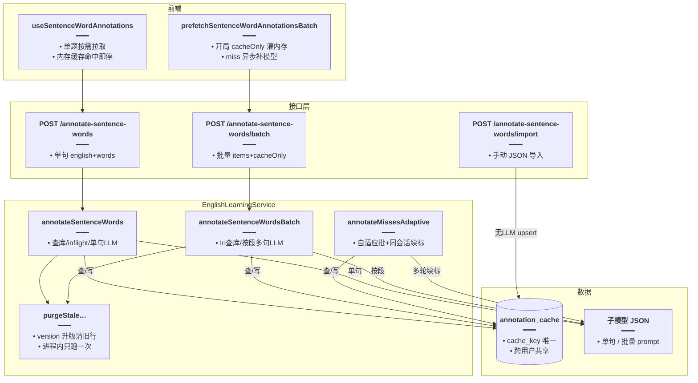

# 句内词标注缓存与批量标注

> 为「经典句看中写」提供**句内每个词**的词性（中文）、英式 IPA、中文释义。标注结果跨用户共享缓存，练习开局批量预热命中即免模型调用；整集预热走 SSE 进度（见姊妹篇 [整集标注任务持久化与续跑.md](./整集标注任务持久化与续跑.md)）。

## 延伸阅读

- [整集标注任务持久化与续跑.md](./整集标注任务持久化与续跑.md)：库 / Pack 整集预热的任务卡片、暂停续跑、SSE 进度
- [经典句看中写词槽练习.md](./经典句看中写词槽练习.md)：前端如何消费标注结果渲染词性 / IPA / 释义
- 规划态：[../ideas/english/经典句整集标注预热.md](../ideas/english/经典句整集标注预热.md)、[整集标注省Token.md](../ideas/english/整集标注省Token.md)

---

## 1. 背景与目标

经典句看中写练习需要在每个词槽上方展示**词性**、**音标**、**释义**。之前这些元数据靠前端写死词表或逐句现场调模型，体验差且不可复用。

本轮落地一套**句内词标注全局缓存**：

- 缓存键 = `sha256(version + 规范化英文句 + 分词序列)`，跨用户共享；改 prompt 输出约定时升 `version` 即整体失效。
- 单句 / 批量 API：命中直接返回，miss 调模型后写库。
- 练习开局 `cacheOnly` 批量只读库灌内存，miss 再异步补模型，首题不卡。
- 验收严格：词数必须对齐，且每词 `posZh / ipa / meaningZh` 非空，禁止缺词垫空串冒充「已标注」。

## 2. 改动范围

**后端新增**

- `apps/backend/src/services/english-learning/entity/english-sentence-word-annotation-cache.entity.ts`
- `apps/backend/src/services/english-learning/sentence-segment.util.ts`（与前端同正则分词）
- `apps/backend/src/services/english-learning/sentence-word-annotation-cache.util.ts`（cache_key 构建 + 可用性校验）
- `apps/backend/src/services/english-learning/dto/annotate-sentence-words.dto.ts`
- `apps/backend/src/services/english-learning/dto/import-sentence-word-annotations.dto.ts`
- `apps/backend/src/migrations/1789671532605-english_sentence_word_annotation_cache.ts`

**后端改动**

- `apps/backend/src/services/english-learning/constant.ts`：`SENTENCE_WORD_ANNOTATION_CACHE_VERSION` 等常量
- `apps/backend/src/services/english-learning/prompt.ts`：`SENTENCE_WORDS_ANNOTATE_SYSTEM`、`SENTENCE_WORDS_ANNOTATE_BATCH_SYSTEM`
- `apps/backend/src/services/english-learning/english-learning.service.ts`：`annotateSentenceWords` / `annotateSentenceWordsBatch` / `annotateMissesAdaptive` / `annotateClassicEnglishesWarmup` / `importSentenceWordAnnotations` / `purgeStaleSentenceWordAnnotationCache`
- `apps/backend/src/services/english-learning/english-learning.controller.ts`：`POST practice/annotate-sentence-words`、`/batch`、`/import`
- `apps/backend/src/services/english-learning/english-learning.module.ts`：注册实体

**前端新增**

- `apps/frontend/src/views/englishLearning/practice/utils/segmentSentence.ts`
- `apps/frontend/src/views/englishLearning/practice/utils/wordMeta.ts`
- `apps/frontend/src/views/englishLearning/practice/utils/sentenceWordAnnotationCache.ts`
- `apps/frontend/src/views/englishLearning/practice/hooks/useSentenceWordAnnotations.ts`

---

## 3. 实现思路

### 3.1 缓存键设计

```text
cache_key = sha256( version + "\0" + englishNorm + "\0" + words.join("\0") )
```

- `englishNorm = english.toLowerCase()`：大小写不影响语义，归一后同句同键。
- `words` 保留原大小写（与分词 `raw` 一致）：词序参与哈希，避免乱序命中。
- `version` 写死常量 `SENTENCE_WORD_ANNOTATION_CACHE_VERSION`（当前 `v3`）：改 prompt 字段语义时递增，启动后首次标注请求 `purgeStale` 删掉旧 schema_version 行。

### 3.2 命中判定（`isUsableSentenceWordAnnotations`）

- 数组长度必须等于期望词数。
- 每个词的 `posZh / ipa / meaningZh` 均为非空字符串。
- 任一不满足 → 视为 miss，重新打模型。这避免了旧版「缺词垫空串」导致进度虚高、练习读空。

### 3.3 三层调用

| 入口 | 场景 | 策略 |
|------|------|------|
| `annotateSentenceWords` | 练习单题实时标注 | 查库 → inflight 去重 → 单句模型 → upsert |
| `annotateSentenceWordsBatch` | 练习开局预热 | `In` 批量查库；`cacheOnly` 只返回命中；否则 miss 按 chunk 一次多句模型 |
| `annotateClassicEnglishesWarmup` + `annotateMissesAdaptive` | 库 / Pack 整集预热 | 去重 → 查库 → 自适应批大小多轮续标（同会话 priorThread）→ SSE 进度 |

### 3.4 架构图



---

## 4. 关键代码对比与注释

### 4.1 缓存实体（纯新增）

**改动后**（新增）· `apps/backend/src/services/english-learning/entity/english-sentence-word-annotation-cache.entity.ts`（约 L1–L51）

```typescript
// 引入 TypeORM 装饰器：列、创建时间、实体、索引、主键、更新时间
import {
	Column,
	CreateDateColumn,
	Entity,
	Index,
	PrimaryGeneratedColumn,
	UpdateDateColumn,
} from 'typeorm';

// 标注一行结构：与 LLM / API 返回字段对齐，便于直接落库
/** 句内词标注一行（与 LLM / API 字段对齐） */
export type SentenceWordAnnotationRow = {
	// 原词（落库冗余，便于排查）
	word: string;
	// 中文词性（名词/动词/…）
	posZh: string;
	// 英式 IPA，无 // []
	ipa: string;
	// 按本句搭配的中文释义
	meaningZh: string;
};

// 全局共享缓存表：cache_key 唯一；跨用户复用，命中即免模型
/**
 * 句内词标注全局缓存（跨用户共享）。
 * cache_key = sha256(version + 规范化英文句 + words 序列)；prompt/schema 变更时升 version。
 */
@Entity('english_sentence_word_annotation_cache')
// cache_key 唯一索引：同句同分词只存一行
@Index('UQ_eswac_cache_key', ['cacheKey'], { unique: true })
export class EnglishSentenceWordAnnotationCache {
	// UUID 主键
	@PrimaryGeneratedColumn('uuid')
	id!: string;

	// sha256 hex；含 schema version，改 prompt 输出约定时换 version 即失效
	@Column({ name: 'cache_key', type: 'varchar', length: 64 })
	cacheKey!: string;

	// schema 版本号：升版后旧行由 purgeStale 清理
	@Column({ name: 'schema_version', type: 'varchar', length: 16 })
	schemaVersion!: string;

	// 规范化后的英文原句（排查用，不参与命中）
	@Column({ name: 'english', type: 'text' })
	english!: string;

	// 输入分词序列（与 annotations 一一对应）
	@Column({ name: 'words', type: 'json' })
	words!: string[];

	// 标注结果数组，长度与 words 一致
	@Column({ name: 'annotations', type: 'json' })
	annotations!: SentenceWordAnnotationRow[];

	// 创建时间
	@CreateDateColumn({ name: 'created_at', type: 'timestamp' })
	createdAt!: Date;

	// 更新时间
	@UpdateDateColumn({ name: 'updated_at', type: 'timestamp' })
	updatedAt!: Date;
}
```

### 4.2 cache_key 构建与可用性校验（纯新增）

**改动后**（新增）· `apps/backend/src/services/english-learning/sentence-word-annotation-cache.util.ts`（约 L1–L40）

```typescript
// 用 Node 内置 crypto 做 sha256
import { createHash } from 'node:crypto';
// 引入 schema 版本常量
import { SENTENCE_WORD_ANNOTATION_CACHE_VERSION } from './constant';

// 拼接 version + 规范化句 + 分词序列后 sha256；升 version 后旧行由服务启动后首次标注请求清理
/** cache_key：version + 规范化句 + 分词序列；升 version 后旧行由服务启动后首次标注请求清理 */
export function buildSentenceWordAnnotationCacheKey(
	// 规范化（小写）后的英文句
	englishNorm: string,
	// 分词序列（保留原大小写）
	words: readonly string[],
): string {
	// 用 \0 分隔各段，避免歧义
	const payload = `${SENTENCE_WORD_ANNOTATION_CACHE_VERSION}\0${englishNorm}\0${words.join('\0')}`;
	// 返回 64 位 hex
	return createHash('sha256').update(payload, 'utf8').digest('hex');
}

// 标注字段可选类型
type AnnotationFields = {
	posZh?: string | null;
	ipa?: string | null;
	meaningZh?: string | null;
};

// 可入库/可计 hit 的判定：词数对齐 + 每词三字段非空；禁止缺词垫空
/**
 * 可入库 / 可计 hit：词数对齐，且每个词 posZh、ipa、meaningZh 非空。
 * 禁止把缺词垫空串当成「已标注」。
 */
export function isUsableSentenceWordAnnotations(
	// 标注数组
	annotations: readonly AnnotationFields[] | null | undefined,
	// 期望词数
	expectedWordCount: number,
): boolean {
	// 非数组或长度不符 → 不可用
	if (!Array.isArray(annotations) || annotations.length !== expectedWordCount) {
		return false;
	}
	// 0 词无意义
	if (expectedWordCount === 0) return false;
	// 逐词校验三字段非空
	return annotations.every(
		(a) =>
			typeof a?.posZh === 'string' &&
			a.posZh.trim() !== '' &&
			typeof a?.ipa === 'string' &&
			a.ipa.trim() !== '' &&
			typeof a?.meaningZh === 'string' &&
			a.meaningZh.trim() !== '',
	);
}
```

### 4.3 后端分词 util（纯新增，与前端同正则）

**改动后**（新增）· `apps/backend/src/services/english-learning/sentence-segment.util.ts`（约 L1–L31）

```typescript
// 词槽 token：raw 展示、expect 判分、after 词后标点
/**
 * 经典句分词：与前端 `practice/utils/segmentSentence.ts` 同源正则，
 * 保证整集预热 cache_key 与练习开局一致。
 */
export type SentenceWordToken = {
	// 原词形（保留大小写）
	raw: string;
	// 判分用（小写 + 统一撇号）
	expect: string;
	// 紧跟词后的标点
	after?: string;
};

// 从英文句提取词槽：Unicode 字母数字 + 撇号为词，其后非字母数字非空白非撇号为标点
/** 从英文原句提取词槽（保留原大小写；比对用小写） */
export function segmentEnglishSentence(english: string): SentenceWordToken[] {
	// 正则：词([\p{L}\p{N}'']+) + 尾随标点([^\p{L}\p{N}\s'']*)
	const re = /([\p{L}\p{N}'']+)([^\p{L}\p{N}\s'']*)/gu;
	const out: SentenceWordToken[] = [];
	let m: RegExpExecArray | null;
	while ((m = re.exec(english)) !== null) {
		// 原词形
		const raw = m[1]!;
		// 词后标点去空白
		const after = (m[2] ?? '').trim();
		out.push({
			raw,
			// expect：小写 + 把弯撇号统一为直撇
			expect: raw.toLowerCase().replace(/['']/g, "'"),
			// 有标点才挂 after
			...(after ? { after } : {}),
		});
	}
	return out;
}

// 仅取 raw 词序列，供标注 API / cache_key 使用
/** 仅取 raw 词序列，供标注 API / cache_key */
export function segmentEnglishSentenceWords(english: string): string[] {
	return segmentEnglishSentence(english).map((t) => t.raw);
}
```

### 4.4 常量（改动：新增 version 与批大小常量）

**改动前**（基线）· `apps/backend/src/services/english-learning/constant.ts`（末尾无标注相关常量）

```typescript
// 基线末尾仅到此为止，无句内词标注常量
```

**改动后**（当前）· `apps/backend/src/services/english-learning/constant.ts`（约 L113–L148）

```typescript
// schema 版本：变更输出约定时递增；v3 拒绝缺词垫空/空 IPA·释义的脏验收
/**
 * 句内词标注落库缓存 schema 版本。
 * 变更 SENTENCE_WORDS_ANNOTATE_SYSTEM 输出约定或字段语义时递增；
 * 升版后首次标注请求会删掉 schema_version ≠ 当前值的旧行。
 * v3：拒绝缺词垫空 / 空 IPA·释义的脏验收（v2 进度虚高）。
 */
export const SENTENCE_WORD_ANNOTATION_CACHE_VERSION = 'v3';

// 批量标注单次模型最多覆盖句数，超出切多段
/** 批量标注时，单次模型请求最多覆盖的句子数（超出则切多段，仍远少于逐句） */
export const SENTENCE_WORD_ANNOTATION_BATCH_LLM_CHUNK = 12;

// 整集预热内部读库每批条数
/** 整集预热：超过生成上限时内部读库每批条数 */
export const ANNOTATE_SOURCE_DB_CHUNK = 1000;

// 整集预热绝对硬顶，防恶意撑爆
/** 整集预热：绝对硬顶，超过则拒绝（防恶意撑爆） */
export const ANNOTATE_SOURCE_HARD_MAX = 20_000;

// 自适应 LLM 初始批大小：从 12 起跳，失败再减半
/**
 * 整集预热：自适应 LLM 初始批大小。
 * ponytail: 24 句×逐词 JSON 极易空 words/截断；从 CHUNK 起跳，失败再减半。
 */
export const ANNOTATE_SOURCE_LLM_INITIAL_CHUNK =
	SENTENCE_WORD_ANNOTATION_BATCH_LLM_CHUNK;

// 同一批窗口内最多续写轮数
/** 同一批窗口内最多续写轮数（含首轮） */
export const ANNOTATE_SOURCE_LLM_MAX_RESUME_ROUNDS = 4;

// 整次预热最多 LLM 轮次，防失控
/** 整次预热最多 LLM 轮次（防失控） */
export const ANNOTATE_SOURCE_LLM_MAX_TOTAL_ROUNDS = 80;

// 词数 ≥ 12 时附带 english 给模型，减轻多义词语境不足
/**
 * 批量标注入参：词数 ≥ 该值时附带 english，减轻多义词语境不足；
 * 短句仅传 id+words，省 input token（功能契约不变）。
 */
export const ANNOTATE_LLM_ATTACH_ENGLISH_MIN_WORDS = 12;
```

**变更摘要**：新增 schema 版本与批大小常量；`v3` 对应严格验收，升版后旧缓存行由 `purgeStale` 清理。

### 4.5 单句标注 `annotateSentenceWords`（纯新增）

**改动后**（新增）· `apps/backend/src/services/english-learning/english-learning.service.ts`（约 L6973–L7013）

```typescript
// 单句标注入口：查库 → inflight 去重 → 单句模型 → upsert
	async annotateSentenceWords(params: {
		// 调用用户
		userId: number;
		// 英文原句
		english: string;
		// 分词序列
		words: string[];
	}): Promise<{ words: SentenceWordAnnotationDto[] }> {
		// 升版时清理旧 schema 行；进程内只跑一次
		await this.purgeStaleSentenceWordAnnotationCache();

		// 规范化：去首尾空白
		const english = params.english.trim();
		// 词去空白并过滤空串
		const words = params.words.map((w) => w.trim()).filter(Boolean);
		// 入参非空校验
		if (!english || words.length === 0) {
			throw new BadRequestException('english 与 words 不能为空');
		}
		// 单句最多 80 词
		if (words.length > 80) {
			throw new BadRequestException('words 过多');
		}

		// 规范化句（小写）参与 cache_key
		const englishNorm = english.toLowerCase();
		// 构建唯一缓存键
		const cacheKey = buildSentenceWordAnnotationCacheKey(englishNorm, words);

		// 查库
		const hit = await this.sentenceWordAnnotationCacheRepo.findOne({
			where: { cacheKey },
		});
		// 命中且可用 → 直接返回，免模型
		if (isUsableSentenceWordAnnotations(hit?.annotations, words.length)) {
			return { words: hit!.annotations };
		}

		// 同 key 并发只打一次模型：复用 inflight Promise
		const inflight = this.annotateSentenceInflight.get(cacheKey);
		if (inflight) return inflight;

		// 调模型并写库；finally 清 inflight
		const run = this.annotateSentenceWordsViaLlmAndCache({
			userId: params.userId,
			english,
			englishNorm,
			words,
			cacheKey,
		}).finally(() => {
			this.annotateSentenceInflight.delete(cacheKey);
		});
		// 登记 inflight 供并发复用
		this.annotateSentenceInflight.set(cacheKey, run);
		return run;
	}
```

### 4.6 批量标注 `annotateSentenceWordsBatch`（纯新增，摘录）

**改动后**（新增）· `apps/backend/src/services/english-learning/english-learning.service.ts`（约 L7020–L7115，摘录 cacheOnly 分支前）

```typescript
// 练习开局批量标注：先 In 查库命中直接返回；cacheOnly 时 miss 不调模型
/**
 * 练习开局批量标注：先 In 查库命中直接返回；
 * cacheOnly 时 miss 不调模型；否则 miss 按段一次多句调模型写库。
 * 返回顺序与入参 items 对齐。
 */
	async annotateSentenceWordsBatch(params: {
		userId: number;
		items: { english: string; words: string[] }[];
		cacheOnly?: boolean;
	}): Promise<{
		items: {
			english: string;
			words: SentenceWordAnnotationDto[];
			cacheHit: boolean;
		}[];
	}> {
		// 升版清旧
		await this.purgeStaleSentenceWordAnnotationCache();

		// 非空校验
		if (params.items.length === 0) {
			throw new BadRequestException('items 不能为空');
		}
		// 一次最多 50 句（与练习题量上限对齐）
		if (params.items.length > 50) {
			throw new BadRequestException('items 过多');
		}

		// 规范化中间结构
		type NormItem = {
			index: number;
			english: string;
			englishNorm: string;
			words: string[];
			cacheKey: string;
		};

		// 逐句规范化并预计算 cache_key
		const normalized: NormItem[] = params.items.map((raw, index) => {
			const english = raw.english.trim();
			const words = raw.words.map((w) => w.trim()).filter(Boolean);
			if (!english || words.length === 0) {
				throw new BadRequestException(
					`items[${index}] english 与 words 不能为空`,
				);
			}
			if (words.length > 80) {
				throw new BadRequestException(`items[${index}] words 过多`);
			}
			const englishNorm = english.toLowerCase();
			return {
				index,
				english,
				englishNorm,
				words,
				cacheKey: buildSentenceWordAnnotationCacheKey(englishNorm, words),
			};
		});

		// 去重 cache_key 后一次 In 查库
		const uniqueKeys = [...new Set(normalized.map((n) => n.cacheKey))];
		const cachedRows =
			uniqueKeys.length === 0
				? []
				: await this.sentenceWordAnnotationCacheRepo.find({
						where: { cacheKey: In(uniqueKeys) },
					});
		// 建 cache_key → 行 映射，过滤空标注
		const cachedByKey = new Map(
			cachedRows
				.filter((r) => Array.isArray(r.annotations) && r.annotations.length > 0)
				.map((r) => [r.cacheKey, r] as const),
		);

		// 输出数组，下标与入参对齐
		const out: {
			english: string;
			words: SentenceWordAnnotationDto[];
			cacheHit: boolean;
		}[] = new Array(normalized.length);

		// 收集 miss 项
		const misses: NormItem[] = [];
		for (const item of normalized) {
			const hit = cachedByKey.get(item.cacheKey);
			// 命中且可用 → 直接填结果
			if (
				hit &&
				isUsableSentenceWordAnnotations(hit.annotations, item.words.length)
			) {
				out[item.index] = {
					english: item.english,
					words: hit.annotations,
					cacheHit: true,
				};
			} else {
				// 未命中 → 进 miss
				misses.push(item);
			}
		}

		// 开局只读：命中立刻返回，miss 占位空数组，由前端再异步补模型
		if (params.cacheOnly) {
			for (const m of misses) {
				out[m.index] = {
					english: m.english,
					words: [],
					cacheHit: false,
				};
			}
			return { items: out };
		}

		// ... 非 cacheOnly：miss 按段调 annotateSentenceWordsMultiViaLlmAndCache 写库
```

### 4.7 自适应多轮续标 `annotateMissesAdaptive`（纯新增，摘录主循环）

整集预热的 miss 处理核心：同会话 `priorThread` 多轮续标，按 id 验收，零进展缩小批大小，硬失败熔断。

**改动后**（新增）· `apps/backend/src/services/english-learning/english-learning.service.ts`（约 L6682–L6967，摘录主循环与续标逻辑）

```typescript
// miss 同会话多轮续标：priorThread 连续对话；按 id 验收写库；硬失败熔断
/**
 * miss 同会话多轮续标：priorThread 连续对话；按 id 验收写库；硬失败熔断。
 * ponytail: 不幻想单轮标完整库；截断则同线程只要 missing，不逐句重开。
 * token: 跨批清空 thread；仅窗口内 resume 保留短对话。
 */
	private async annotateMissesAdaptive(
		userId: number,
		misses: {
			cacheKey: string;
			english: string;
			englishNorm: string;
			words: string[];
		}[],
		opts?: {
			signal?: AbortSignal;
			onProgress?: (p: {
				annotated: number;
				failed: number;
				remaining: number;
				tokensPrompt: number;
				tokensCompletion: number;
				tokensTotal: number;
			}) => void;
		},
	): Promise<{
		annotated: number;
		failed: number;
		tokensPrompt: number;
		tokensCompletion: number;
		tokensTotal: number;
	}> {
		type Work = (typeof misses)[number];
		// 剩余待标
		let remaining: Work[] = [...misses];
		// 自适应批大小，从初始值起跳
		let batchSize = Math.max(1, ANNOTATE_SOURCE_LLM_INITIAL_CHUNK);
		// 已验收写库数
		let annotated = 0;
		// 硬失败数
		let failed = 0;
		// 连续零进展轮数
		let zeroStreak = 0;
		// 总 LLM 轮次
		let totalRounds = 0;
		// 累计 prompt token
		let tokensPrompt = 0;
		// 累计 completion token
		let tokensCompletion = 0;
		// 同会话对话线程，窗内 resume 复用
		const thread: BaseMessage[] = [];

		// 整次预热只建一次客户端；多轮续标复用 llm.invoke + priorThread
		const llm = await createLlm(
			this.configService,
			{
				preset: 'englishLearning',
				userId,
				streaming: false,
				temperature: 0.35,
				defaultTemperature: 0.35,
				maxTokens: 32768,
				maxTokensPolicy: 'default',
				modelKwargs: {
					response_format: { type: 'json_object' },
				},
			},
			this.llmConfigService,
		);

		// 推送进度回调
		const emit = () => {
			opts?.onProgress?.({
				annotated,
				failed,
				remaining: remaining.length,
				tokensPrompt,
				tokensCompletion,
				tokensTotal: tokensPrompt + tokensCompletion,
			});
		};

		// 熔断：剩余全部记 failed，停止再调模型
		const tripCircuit = (reason: string) => {
			this.logger.warn(
				`[EnglishLearning] annotateMissesAdaptive circuit open: ${reason} (drop remaining=${remaining.length})`,
			);
			failed += remaining.length;
			remaining = [];
			emit();
		};

		// signal 中止：抛 AbortError 由调用方转暂停
		const throwIfAborted = () => {
			if (!opts?.signal?.aborted) return;
			this.logLlmCallStopped(
				'annotateMissesAdaptive_signal',
				`annotated=${annotated} failed=${failed} remaining=${remaining.length} rounds=${totalRounds}`,
			);
			const err = new Error('Aborted');
			err.name = 'AbortError';
			throw err;
		};

		// 主循环：直至 remaining 清空或熔断
		while (remaining.length > 0) {
			throwIfAborted();
			// 超总轮次 → 熔断
			if (totalRounds >= ANNOTATE_SOURCE_LLM_MAX_TOTAL_ROUNDS) {
				tripCircuit('max total llm rounds');
				break;
			}

			// 取当前批
			let pending = remaining.slice(0, batchSize);
			let hardFail = false;
			let acceptedInWindow = 0;
			// 跨批不保留 priorThread：避免整次预热叠 Human JSON
			thread.length = 0;

			// 窗内最多 MAX_RESUME_ROUNDS 轮续标
			for (
				let resume = 0;
				resume < ANNOTATE_SOURCE_LLM_MAX_RESUME_ROUNDS && pending.length > 0;
				resume += 1
			) {
				throwIfAborted();
				if (totalRounds >= ANNOTATE_SOURCE_LLM_MAX_TOTAL_ROUNDS) {
					hardFail = true;
					break;
				}
				totalRounds += 1;

				// 构建模型入参：id+words，长句附 english
				const payloadItems = this.buildAnnotateLlmPayloadItems(pending);
				// 首轮带全量 items；续轮带 continue 标记只要 missing
				const user =
					resume === 0
						? JSON.stringify({ items: payloadItems })
						: JSON.stringify({
								continue: true,
								note: '只标注下列尚未验收的 id；勿重复已验收句。',
								items: payloadItems,
							});
				// 可观测日志
				this.logger.log(
					`[EnglishLearning] annotateMissesAdaptive invoke round=${totalRounds} resume=${resume} pending=${pending.length} threadMsgs=${thread.length} userChars=${user.length} withEnglish=${payloadItems.filter((p) => p.english).length} tokensTotal=${tokensPrompt + tokensCompletion}`,
				);

				let text: string;
				try {
					// 调子模型 JSON，带 priorThread 续标
					text = await this.invokeEnglishPackSubModelJson({
						system: SENTENCE_WORDS_ANNOTATE_BATCH_SYSTEM,
						user,
						maxTokens: 32768,
						userId,
						priorThread: thread,
						signal: opts?.signal,
						llm,
						onUsage: (u) => {
							tokensPrompt += u.promptTokens;
							tokensCompletion += u.completionTokens;
						},
					});
				} catch (e) {
					// 中止 → 抛 AbortError
					if (
						opts?.signal?.aborted ||
						(e instanceof Error && e.name === 'AbortError')
					) {
						this.logLlmCallStopped(
							'annotateMissesAdaptive_invoke_aborted',
							`annotated=${annotated} failed=${failed} remaining=${remaining.length} rounds=${totalRounds}`,
						);
						const err = new Error('Aborted');
						err.name = 'AbortError';
						throw err;
					}
					// 其它错误 → 硬失败熔断
					this.logger.warn(
						`[EnglishLearning] annotateMissesAdaptive invoke failed: ${
							e instanceof Error ? e.message.slice(0, 300) : String(e)
						} (resume=${resume}, pending=${pending.length})`,
					);
					hardFail = true;
					break;
				}
				// 每轮 invoke 后立刻推 token
				emit();

				// 解析 JSON
				let parsed: unknown = {};
				try {
					parsed = this.extractJsonObject(text);
				} catch {
					this.logger.warn(
						`[EnglishLearning] annotateMissesAdaptive JSON parse fail (resume=${resume}, textPrefix=${text.slice(0, 160).replace(/\s+/g, ' ')})`,
					);
				}

				// 按 id 对齐，缺失句不入 map
				const byId = this.extractSentenceWordAnnotationsBatchLoose(
					parsed,
					pending.map((p) => p.words),
				);

				const acceptedEnglishes: string[] = [];
				const acceptedKeys = new Set<string>();
				// 逐句验收：长度对齐 + 三字段非空才 upsert
				for (let i = 0; i < pending.length; i += 1) {
					const item = pending[i]!;
					const ann = byId.get(i);
					if (!isUsableSentenceWordAnnotations(ann, item.words.length))
						continue;
					if (!(await this.sentenceWordAnnotationCacheRepo.upsert(/* ... */))) continue;
					acceptedKeys.add(item.cacheKey);
					acceptedEnglishes.push(item.english);
				}

				// 构建 assistant 快照：只记已验收句节选，降低 priorThread token
				const snap =
					acceptedEnglishes.length > 0
						? this.buildAnnotateThreadAssistantSnapshot(acceptedEnglishes)
						: text.trim().slice(0, 2000) || ' ';
				// 推入对话线程供下轮续标
				thread.push(new HumanMessage(user), new AIMessage(snap));
				// 裁剪线程长度
				const trimmed = this.trimPackAgentThread(
					thread,
					PACK_AGENT_THREAD_MAX_MESSAGES,
				);
				thread.splice(0, thread.length, ...trimmed);

				// 本轮无验收 → 跳出窗内循环，进入缩小批大小逻辑
				if (acceptedKeys.size === 0) {
					break;
				}

				acceptedInWindow += acceptedKeys.size;
				annotated += acceptedKeys.size;
				// 从 pending / remaining 移除已验收
				pending = pending.filter((p) => !acceptedKeys.has(p.cacheKey));
				remaining = remaining.filter((r) => !acceptedKeys.has(r.cacheKey));
				emit();
			}

			// 硬失败 → 熔断
			if (hardFail) {
				tripCircuit('llm invoke hard-fail');
				break;
			}

			// 本批全部验收 → 清零 streak，继续下一批
			if (pending.length === 0) {
				zeroStreak = 0;
				continue;
			}

			// 零进展累计
			zeroStreak += 1;
			// 有零进展且批大小 > 1 → 减半重试
			if (acceptedInWindow === 0 && batchSize > 1) {
				batchSize = Math.max(1, Math.floor(batchSize / 2));
				if (zeroStreak >= 3) {
					tripCircuit(`zero-accept streak=${zeroStreak} while shrinking`);
					break;
				}
				continue;
			}

			// 批大小已为 1 仍零进展 → 单句记失败，跳过
			if (acceptedInWindow === 0 && batchSize === 1) {
				failed += 1;
				remaining = remaining.slice(1);
				emit();
				if (zeroStreak >= 3) {
					tripCircuit(`zero-accept streak=${zeroStreak} at batchSize=1`);
					break;
				}
				continue;
			}

			// 其余情况缩小批大小继续
			if (batchSize > 1) {
				batchSize = Math.max(1, Math.floor(batchSize / 2));
			}
			if (zeroStreak >= 4) {
				tripCircuit(`stale pending after resumes streak=${zeroStreak}`);
				break;
			}
		}

		return {
			annotated,
			failed,
			tokensPrompt,
			tokensCompletion,
			tokensTotal: tokensPrompt + tokensCompletion,
		};
	}
```

**变更摘要**：`annotateMissesAdaptive` 是整集预热的核心——同会话多轮续标（`priorThread`）、按 id 验收写库、零进展减半批大小、硬失败熔断、signal 中止转 `AbortError`。跨批清空线程避免 token 累积，窗内保留短对话实现续标。

### 4.8 手动导入 `importSentenceWordAnnotations`（纯新增，摘录）

**改动后**（新增）· `apps/backend/src/services/english-learning/english-learning.service.ts`（约 L6364–L6470，摘录鉴权后核心）

```typescript
// 手动导入词标注 JSON：无 LLM；分词与文件 words[].word 全等才 upsert
/**
 * 手动导入词标注 JSON：无 LLM；分词与文件 words[].word 全等才 upsert。
 * 同 cache_key 覆盖；文件外旧行保留。
 * 允许部分导入：items 可为当前 library/pack 句集的子集。
 */
	async importSentenceWordAnnotations(params: {
		userId: number;
		source: 'library' | 'pack';
		libraryId?: string;
		streamId?: string;
		items: Array<{
			english: string;
			words: Array<{
				word: string;
				posZh: string;
				ipa: string;
				meaningZh: string;
			}>;
		}>;
	}): Promise<{ accepted: number; skipped: number; overwritten: number }> {
		// 按 source 鉴权：library 校验可读，pack 校验会话归属
		if (params.source === 'library') {
			const libraryId = params.libraryId?.trim() ?? '';
			if (!libraryId) throw new BadRequestException('libraryId 不能为空');
			await this.assertClassicQuotesLibraryReadable(params.userId, libraryId);
		} else {
			const streamId = params.streamId?.trim() ?? '';
			if (!streamId) throw new BadRequestException('streamId 不能为空');
			const session = await this.classicPackSessionRepo.findOne({
				where: { userId: params.userId, streamId },
			});
			if (!session) {
				throw new NotFoundException('拉取记录不存在或无权访问');
			}
		}

		// ... 遍历 items：对每条 english 做后端分词，比对文件 words[].word 全等后 upsert
		// accepted / skipped / overwritten 计数
```

### 4.9 前端分词 `segmentSentence.ts`（纯新增）

**改动后**（新增）· `apps/frontend/src/views/englishLearning/practice/utils/segmentSentence.ts`（约 L1–L77）

```typescript
// 经典句看中写：英文自动分词与逐词比对（保留词后标点供槽间展示）
/**
 * 经典句看中写：英文自动分词与逐词比对（保留词后标点供槽间展示）
 */

// 一句英文切成可作答词槽
/** 一句英文切成可作答词槽（保留原大小写；比对用小写） */
export type SentenceWordToken = {
	// 展示用原词形
	raw: string;
	// 判分用规范化
	expect: string;
	// 紧跟词后的标点
	after?: string;
};

// 从英文原句提取词槽，并记下每个词后的标点
/**
 * 从英文原句提取词槽，并记下每个词后的标点。
 * 例：Hello! I'm Sarah. → Hello(+!) / I'm / Sarah(+.)
 */
export function segmentEnglishSentence(english: string): SentenceWordToken[] {
	// 与后端 sentence-segment.util.ts 同源正则
	const re = /([\p{L}\p{N}'']+)([^\p{L}\p{N}\s'']*)/gu;
	const out: SentenceWordToken[] = [];
	let m: RegExpExecArray | null;
	while ((m = re.exec(english)) !== null) {
		const raw = m[1]!;
		const after = (m[2] ?? '').trim();
		out.push({
			raw,
			// 小写 + 弯撇号转直撇
			expect: raw.toLowerCase().replace(/['']/g, "'"),
			...(after ? { after } : {}),
		});
	}
	return out;
}

// 比对结果类型
export type SlotMatchKind = 'empty' | 'prefix' | 'correct' | 'wrong';

// 规范化用户输入（与 expect 同规则）
/** 规范化用户槽位输入（与 expect 同规则） */
export function normalizeSlotInput(raw: string): string {
	return raw.trim().toLowerCase().replace(/['']/g, "'");
}

// 逐词实时比对：空 / 正确前缀 / 完全正确 / 错误
/**
 * 逐词实时比对：空 / 正确前缀 / 完全正确 / 错误。
 * 前缀仅用于内部逻辑；UI 只有 correct 才标绿。
 */
export function matchSlotInput(input: string, expect: string): SlotMatchKind {
	const u = normalizeSlotInput(input);
	if (!u) return 'empty';
	const e = expect.toLowerCase().replace(/['']/g, "'");
	if (!e) return 'wrong';
	if (u === e) return 'correct';
	if (e.startsWith(u)) return 'prefix';
	return 'wrong';
}
```

### 4.10 前端内存缓存 `sentenceWordAnnotationCache.ts`（纯新增，摘录）

**改动后**（新增）· `apps/frontend/src/views/englishLearning/practice/utils/sentenceWordAnnotationCache.ts`（约 L1–L167，摘录核心函数）

```typescript
// 句内词标注前端内存缓存（单题 hook 与开局批量预热共用）
/**
 * 句内词标注前端内存缓存（单题 hook 与开局批量预热共用）
 */
import {
	annotateEnglishSentenceWords,
	annotateEnglishSentenceWordsBatch,
	type EnglishSentenceWordAnnotation,
} from '@/service';
import type { SentenceWordMeta } from '../utils/wordMeta';

// 内存缓存：cacheKey → 标注数组
const cache = new Map<string, SentenceWordMeta[]>();
// 同 key 并发只打一次单句接口
const inflight = new Map<string, Promise<SentenceWordMeta[]>>();

// 构建前端缓存键：english + words 序列
export function sentenceWordAnnotationCacheKey(
	english: string,
	wordKey: string,
): string {
	return `${english.trim().toLowerCase()}::${wordKey}`;
}

// 单句标注：内存命中直接返回；同 key 共享 inflight
/** 单句标注：内存命中直接返回；同 key 共享 inflight */
export function ensureSentenceWordAnnotation(params: {
	english: string;
	words: string[];
	silent?: boolean;
}): Promise<SentenceWordMeta[]> {
	const english = params.english.trim();
	const words = params.words.map((w) => w.trim()).filter(Boolean);
	const key = sentenceWordAnnotationCacheKey(english, words.join('\0'));
	// 内存命中
	const hit = cache.get(key);
	if (hit) return Promise.resolve(hit);

	// 复用同 key inflight
	const pending = inflight.get(key);
	if (pending) return pending;

	// 调单句接口，对齐下标写内存
	const run = annotateEnglishSentenceWords({
		english,
		words,
		silent: params.silent,
	})
		.then((res) => {
			const aligned =
				writeAlignedCache(english, words, res.data?.words ?? []) ??
				words.map(() => ({ posZh: '', ipa: '', meaningZh: '' }));
			return aligned;
		})
		.finally(() => {
			inflight.delete(key);
		});

	inflight.set(key, run);
	return run;
}

// 开局预热：cacheOnly 批量只读库 → 立刻灌内存；miss 跳过首题（交给 hook 单句），其余批量调模型
/**
 * 开局预热：
 * 1) cacheOnly 批量只读库 → 立刻灌内存
 * 2) miss：跳过队列首题（交给 hook 单句），其余批量调模型
 */
export function prefetchSentenceWordAnnotationsBatch(
	items: { english: string; words: string[] }[],
): void {
	// ... 规范化 → cacheOnly 批量查库 → 命中写内存 → miss 批量调模型
}
```

### 4.11 前端 hook `useSentenceWordAnnotations`（纯新增）

**改动后**（新增）· `apps/frontend/src/views/englishLearning/practice/hooks/useSentenceWordAnnotations.ts`（约 L1–L97）

```typescript
// 经典句看中写：拉取句内词性 / IPA / 释义（内存缓存，同句不重复打模型）
/**
 * 经典句看中写：拉取句内词性 / IPA / 释义（内存缓存，同句不重复打模型）
 */
import { useEffect, useMemo, useState } from 'react';
import {
	ensureSentenceWordAnnotation,
	getSentenceWordAnnotationCache,
	sentenceWordAnnotationCacheKey,
} from '../utils/sentenceWordAnnotationCache';
import type { SentenceWordToken } from '../utils/segmentSentence';
import type { SentenceWordMeta } from '../utils/wordMeta';

// 空标注引用，避免 setState 死循环
const EMPTY_META: readonly (SentenceWordMeta | null)[] = [];

// 按需拉取单句标注：内存命中即停；否则走 ensureSentenceWordAnnotation
export function useSentenceWordAnnotations(args: {
	// 是否启用
	enabled: boolean;
	// 英文原句
	english: string;
	// 分词 token
	tokens: readonly SentenceWordToken[];
}) {
	const { enabled, english, tokens } = args;
	// 词序列键：用 raw 拼接
	const wordKey = useMemo(
		() => tokens.map((t) => t.raw).join('\0'),
		[tokens],
	);
	// 下标对齐的标注
	const [metaByIndex, setMetaByIndex] = useState<
		readonly (SentenceWordMeta | null)[]
	>([]);
	// 加载态
	const [loading, setLoading] = useState(false);
	// 错误态
	const [error, setError] = useState(false);

	useEffect(() => {
		// 未启用 / 无内容 → 清空
		if (!enabled || !english.trim() || tokens.length === 0) {
			setMetaByIndex((prev) => (prev.length === 0 ? prev : EMPTY_META));
			setLoading((v) => (v ? false : v));
			setError((v) => (v ? false : v));
			return;
		}

		// 查内存缓存
		const key = sentenceWordAnnotationCacheKey(english, wordKey);
		const hit = getSentenceWordAnnotationCache(key);
		if (hit) {
			setMetaByIndex(hit);
			setLoading(false);
			setError(false);
			return;
		}

		// 未命中 → 调单句接口
		let cancelled = false;
		setLoading(true);
		setError(false);
		setMetaByIndex(tokens.map(() => null));

		void ensureSentenceWordAnnotation({
			english,
			words: tokens.map((t) => t.raw),
		})
			.then((aligned) => {
				if (cancelled) return;
				setMetaByIndex(aligned);
				setError(false);
			})
			.catch(() => {
				if (cancelled) return;
				setMetaByIndex(tokens.map(() => null));
				setError(true);
			})
			.finally(() => {
				if (!cancelled) setLoading(false);
			});

		return () => {
			cancelled = true;
		};
	}, [enabled, english, tokens, wordKey]);

	// 开局批量预热可能晚于本 effect：轮询内存缓存（短间隔，有结果即停）
	useEffect(() => {
		if (!enabled || !english.trim() || tokens.length === 0) return;
		const key = sentenceWordAnnotationCacheKey(english, wordKey);
		if (getSentenceWordAnnotationCache(key)) return;

		const timer = window.setInterval(() => {
			const late = getSentenceWordAnnotationCache(key);
			if (!late) return;
			setMetaByIndex(late);
			setLoading(false);
			setError(false);
			window.clearInterval(timer);
		}, 400);

		return () => window.clearInterval(timer);
	}, [enabled, english, tokens, wordKey]);

	return { metaByIndex, loading, error };
}
```

---

## 5. 兼容性与影响

- **缓存全局共享**：`cache_key` 不含 userId，任意用户标注后全员命中。副作用：A 用户导入的标注会被 B 用户命中，符合「全局词典」语义。
- **version 升版**：改 `SENTENCE_WORD_ANNOTATION_CACHE_VERSION` 后，旧行由 `purgeStaleSentenceWordAnnotationCache`（进程内只跑一次）删除，无需手工迁移。
- **验收严格化（v3）**：旧版可能存在「缺词垫空」的脏行，v3 起 `isUsableSentenceWordAnnotations` 会判为 miss 重新打模型，短期会增加模型调用。
- **练习开局性能**：`cacheOnly` 只读库 + 内存缓存，首题不卡；miss 异步补全，`useSentenceWordAnnotations` 的轮询 effect 会在结果到位时刷新。
- **整集预热**：见姊妹篇 [整集标注任务持久化与续跑.md](./整集标注任务持久化与续跑.md)。

## 6. 相关源码路径

| 说明 | 路径 |
|------|------|
| 缓存实体 | `apps/backend/src/services/english-learning/entity/english-sentence-word-annotation-cache.entity.ts` |
| cache_key / 可用性 | `apps/backend/src/services/english-learning/sentence-word-annotation-cache.util.ts` |
| 后端分词 | `apps/backend/src/services/english-learning/sentence-segment.util.ts` |
| 常量 | `apps/backend/src/services/english-learning/constant.ts` |
| 标注 prompt | `apps/backend/src/services/english-learning/prompt.ts` |
| 单句 / 批量 / 自适应 / 导入 | `apps/backend/src/services/english-learning/english-learning.service.ts` |
| Controller 端点 | `apps/backend/src/services/english-learning/english-learning.controller.ts` |
| DTO | `apps/backend/src/services/english-learning/dto/annotate-sentence-words.dto.ts`、`import-sentence-word-annotations.dto.ts` |
| 前端分词 | `apps/frontend/src/views/englishLearning/practice/utils/segmentSentence.ts` |
| 前端词元 | `apps/frontend/src/views/englishLearning/practice/utils/wordMeta.ts` |
| 前端内存缓存 | `apps/frontend/src/views/englishLearning/practice/utils/sentenceWordAnnotationCache.ts` |
| 前端 hook | `apps/frontend/src/views/englishLearning/practice/hooks/useSentenceWordAnnotations.ts` |

---

（若与仓库最新源码不一致，以源码为准）
