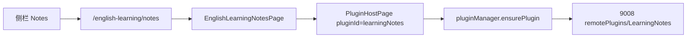

# 英语学习 · 学习笔记（MF Remote）

> **文档角色（主文档）**：将「学习笔记」作为 Module Federation Remote 嵌入英语学习业务路由，而非顶层动态注入。  
> **实现位置（已迁）**：`apps/remote-plugins`（federation `remotePlugins`，expose `./LearningNotes`，端口 **9008**）。原 `apps/remote-learning-notes`（:9007）已删除。  
> **延伸阅读**：[../plugins/模块联邦插件宿主.md](../plugins/模块联邦插件宿主.md)；[../plugins/插件入口缓存失效.md](../plugins/插件入口缓存失效.md)；[../plugins/远程插件HMR.md](../plugins/远程插件HMR.md)；[学习笔记脏保存.md](./学习笔记脏保存.md)；[../ops/远程注册静态.md](../ops/远程注册静态.md)；[../../apps/remote-plugins/README.md](../plugins/插件开发指南.md)；第三方通用接入：[../ideas/第三方联邦插件接入.md](../ideas/plugins/第三方联邦插件接入.md)。

---

## 1. 背景与目标

### 1.1 问题

学习笔记属于**英语学习专区**能力，应出现在 `/english-learning/notes` 子路由与侧栏「笔记」入口中，而不是与「智能对话」并列的顶层插件菜单。

笔记 UI 由基座插件包独立构建/部署（Remote `:9008` / `remotePlugins`），Host 运行时 `loadRemote('remotePlugins/LearningNotes')`（registry：`id: learningNotes`，`remoteName` + `expose`）。

### 1.2 目标（逐点）

| # | 目标 |
|---|------|
| 1 | 静态路由 `english-learning/notes` → `EnglishLearningNotesPage` |
| 2 | 页内挂载 `<PluginHostPage pluginId="learningNotes" />` |
| 3 | registry：`id: learningNotes`，`remoteName: remotePlugins`，`expose: ./LearningNotes`，`injectRoute: false` |
| 4 | 侧栏 `NotesSession` / accents 接入入口 |
| 5 | Remote：`apps/remote-plugins` expose `./LearningNotes` |
| 6 | 生产 entry 指向 `https://dnhyxc.cn:9008/mf-manifest.json` |
| 7 | 9008 Nginx CORS：放行 `https://dnhyxc.cn:9002` **与** `tauri://localhost` |

---

## 2. 改动范围

| 路径 | 说明 |
|------|------|
| `apps/frontend/src/views/englishLearning/notes/index.tsx` | 宿主页壳 |
| `apps/frontend/src/router/routes.ts` | 子路由 `notes` |
| `apps/frontend/src/views/englishLearning/sidebar/*` | 侧栏入口与 accent |
| `apps/backend/uploads/remotes/plugins-registry.json` | `learningNotes` 条目 |
| `apps/remote-plugins/src/views/learning-notes/` | Remote UI |

> 下文若仍出现 `:9007` / `remote-learning-notes` / `learningNotes/App`，以本节与 registry 现行配置为准（已迁至 9008 / `remotePlugins/LearningNotes`）。


---

## 3. 实现思路



- **`injectRoute: false`**：避免 `PluginManager.mountShell` 再往 Layout children 注入一条重复路由。
- **无 `menu`（或可不配顶栏 menu）**：笔记入口走英语学习侧栏，不进全局 Sidebar 的 `sidebarInjector` 动态菜单（若 registry 未写 `menu` 则不会出现 Puzzle 顶栏项）。当前清单中 `learningNotes` **无** `menu` 字段。

---

## 4. 关键实现（改动前 / 改动后 + 逐行注释）

### 4.1 `EnglishLearningNotesPage`（纯新增）

**改动后** · `apps/frontend/src/views/englishLearning/notes/index.tsx`（全文）

```typescript
/**
 * 英语学习 · 学习笔记（MF 插件宿主页）
 */
// i18n
import { useI18n } from '@/hooks';
// 通用插件宿主
import { PluginHostPage } from '@/plugins';
// 与其它英语子页一致的顶栏
import { EnglishLearningPanelHeader } from '../components/EnglishLearningPanelHeader';

// 默认导出页面组件
export default function EnglishLearningNotesPage() {
	// 取翻译函数
	const { t } = useI18n();

	return (
		// 外层纵向 flex，占满高度
		<div className="flex min-h-0 h-full w-full flex-col">
			{/* 内边距容器，与其它 english 页对齐 */}
			<div className="box-border flex h-full min-h-0 w-full min-w-0 flex-col p-5.5 pt-0">
				{/* 圆角背景面板 */}
				<div className="flex min-h-0 min-w-0 flex-1 flex-col overflow-hidden rounded-md bg-theme-background">
					{/* 标题：route.englishLearning.notes.title */}
					<EnglishLearningPanelHeader
						title={t('route.englishLearning.notes.title')}
					/>
					{/* 可滚动内容区：挂载 MF 宿主 */}
					<div className="min-h-0 flex-1 overflow-auto px-4 pb-4">
						{/* 固定插件 id，与 registry / remote name 一致 */}
						<PluginHostPage pluginId="learningNotes" />
					</div>
				</div>
			</div>
		</div>
	);
}
```

---

### 4.2 路由表增加 `notes`（改动前后）

**对比范围**：`english-learning` children 中新增一项。

**改动前** · `apps/frontend/src/router/routes.ts`（基线：favorites 后直接 mistakes）

```typescript
// favorites 子路由（未改）
{
	path: 'favorites',
	Component: EnglishLearningFavoritesPage,
	meta: {
		titleKey: 'route.englishLearning.favorites.title',
	},
},
// 旧版无 notes，下一子路由为 mistakes
{
	path: 'mistakes',
	Component: EnglishLearningMistakesPage,
	// ...（未改动）meta
},
```

**改动后** · `apps/frontend/src/router/routes.ts`（当前，约 L192–L205）

```typescript
// favorites 子路由（未改）
{
	path: 'favorites',
	Component: EnglishLearningFavoritesPage,
	meta: {
		titleKey: 'route.englishLearning.favorites.title',
	},
},
// 新增：学习笔记子路由
{
	// 相对 english-learning 的 path 段
	path: 'notes',
	// 宿主页组件
	Component: EnglishLearningNotesPage,
	meta: {
		// 文档标题 i18n
		titleKey: 'route.englishLearning.notes.title',
	},
},
// mistakes 等后续子路由（未改动逻辑）
{
	path: 'mistakes',
	Component: EnglishLearningMistakesPage,
	// ...（未改动）
},
```

**变更摘要**：静态挂上 notes；MF 仅负责渲染 Remote。

---

### 4.3 Registry 条目 `learningNotes`（数据，纯新增字段组）

**改动后** · `apps/backend/uploads/remotes/plugins-registry.json`（`learningNotes` 对象）

```json
{
	"id": "learningNotes",
	"titleKey": "route.englishLearning.notes.title",
	"routePath": "/english-learning/notes",
	"remoteName": "remotePlugins",
	"expose": "./LearningNotes",
	"entry": "http://127.0.0.1:9008/mf-manifest.json",
	"version": "1.0.0",
	"hostApiRange": "^1.0.0",
	"injectRoute": false,
	"permissions": ["ui:toast", "nav:subtree", "http:plugin-api", "modules:learningNotes"],
	"preload": "route",
	"enabled": true,
	"trust": "first-party"
}
```

逐字段说明：

| 字段 | 含义 |
|------|------|
| `id` | Host `pluginId` / ensure 键；可与 federation name 不同 |
| `remoteName` | MF federation name：`remotePlugins` |
| `expose` | `./LearningNotes` → `loadRemote('remotePlugins/LearningNotes')` |
| `routePath` | 业务路由（ensure 时对齐；不注入顶层） |
| `entry` | 本地 Dev Remote；生产改为 `https://dnhyxc.cn:9008/mf-manifest.json` |
| `injectRoute: false` | **关键**：禁止顶层重复路由 |
| 无 `menu` | 不进全局侧栏动态插件区 |

---

### 4.4 Remote Vite 要点（`apps/remote-plugins/vite.config.ts`）

**改动后** · 摘录（完整符号见源文件；以下为配置核心）

```typescript
const host = '127.0.0.1';
const port = 9008;
const devOrigin = `http://${host}:${port}`;

export default defineConfig(({ mode }) => {
	const env = loadEnv(mode, process.cwd(), '');
	/** 生产：VITE_REMOTE_PUBLIC_ORIGIN=https://dnhyxc.cn:9008 */
	const origin = env.VITE_REMOTE_PUBLIC_ORIGIN || devOrigin;
	const reactRefreshHost =
		env.VITE_REACT_REFRESH_HOST || 'http://127.0.0.1:9002';

	return {
		base: `${origin}/`,
		plugins: [
			clearMfViteDepCache(),
			react({ reactRefreshHost }),
			tailwindcss(),
			federation({
				name: 'remotePlugins',
				filename: 'remoteEntry.js',
				manifest: true,
				exposes: {
					'./IdeasList': './src/views/ebook-ideas/index.tsx',
					'./LearningNotes': './src/views/learning-notes/index.tsx',
				},
				shared: {
					react: { singleton: true, requiredVersion: '^19.1.0' },
					'react-dom': { singleton: true, requiredVersion: '^19.1.0' },
				},
				hostInitInjectLocation: 'entry',
				dts: false,
			}),
		],
		// ... server.port = 9008 等
	};
});
```

---

## 5. 行为变化与兼容性

- 用户在英语学习侧栏进入 **学习笔记** → 打开 `/english-learning/notes`。
- Remote 未启动：页内「插件不可用」+ 重新加载（不拖垮整个英语学习布局）。
- 生产必须同时：① Remote 静态资源部署到 9008；② Nginx CORS（**含桌面** `tauri://localhost`）；③ registry `entry` 为线上 HTTPS origin。
- 与第三方插件同一套模型：Host **不**为 9008 改 Tauri capabilities；MF 走 WebView 原生加载。

---

## 6. 测试与回归建议

1. Dev：`pnpm dev:remote-plugins`（或 `pnpm dev:mf`）+ Host；进笔记页应渲染 Remote UI。
2. 确认全局侧栏**没有**重复的「学习笔记」Puzzle 项（因无 `menu` / `injectRoute: false`）。
3. Prod Web：Host `https://dnhyxc.cn:9002` 加载 `https://dnhyxc.cn:9008/mf-manifest.json` 无 CORS。
4. Prod Tauri：桌面打开笔记页；`curl` 对 `Origin: tauri://localhost` 须有 ACAO（漏配则 RUNTIME-003）。
5. 改 registry `enabled: false`：笔记页 ensure 失败并提示。

---

## 7. 相关源码路径

| 说明 | 路径 |
|------|------|
| Host 页 | `apps/frontend/src/views/englishLearning/notes/index.tsx` |
| Remote UI | `apps/remote-plugins/src/views/learning-notes/` |
| Remote 包 | `apps/remote-plugins/` |
| Registry | `apps/backend/uploads/remotes/plugins-registry.json` |
| 第三方/自建 CORS 契约 | `docs/ideas/第三方联邦插件接入.md` |

---

（若与仓库最新源码不一致，以源码为准）
