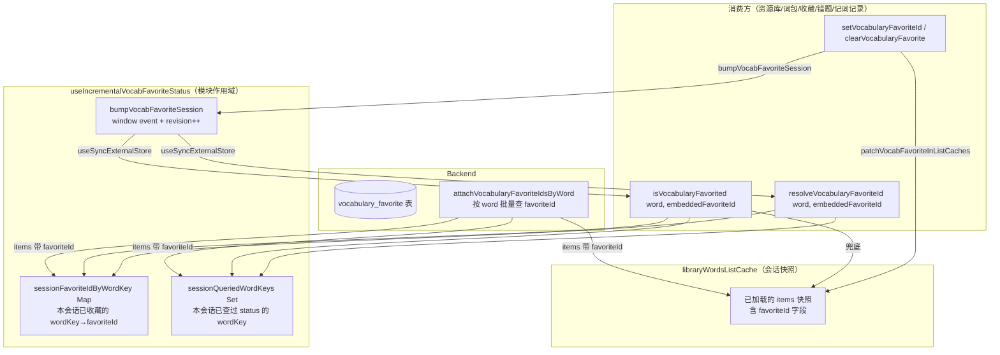

# 收藏状态会话级缓存：跨页保留与后端 favoriteId 回填

> 解决「在不同页面来回切换时，收藏星标状态不一致 / 重复拉接口 / 切换后再回列表先空后亮」等问题。
> 本轮在两个增量收藏状态 Hook（单词 / 经典句）中新增**会话级模块状态**（`sessionFavoriteIdByWordKey` + `sessionQueriedWordKeys` + revision 事件），并让后端在词包历史、错题、每日记词、复习队列、随机抽词等返回体里直接带 `favoriteId`；切号清空、刷新页面重置。
> 姊妹文档：分批查 status 与渐进点亮见 [单词收藏状态查询.md](./单词收藏状态查询.md)；资源库按 offset 分页查 status 见 [资源库收藏状态分页查询.md](./资源库收藏状态分页查询.md)；资源库列表会话缓存见 [文库单词列表缓存.md](./文库单词列表缓存.md)；新统一的星标按钮组件见 [收藏按钮统一组件.md](./收藏按钮统一组件.md)。

若与仓库最新源码不一致，**以源码为准**。

---

## 1. 背景与目标

### 1.1 用户视角

英语学习的收藏星标出现在**资源库列表、词包结果页、收藏抽屉、错题集、每日记词记录、每日记词答题反馈、听写/拼写练习**等多处。改前的体验问题：

1. **跨页不同步**：在「每日记词答题反馈」里点了收藏，切到「我的收藏」列表要等接口重新查一次 status 才会亮星，且若新收藏的词正好在另一页的可见窗口外，要滚动到对应位置才看到星亮——视觉上「先空后亮」；
2. **重复查 status**：每个列表（资源库 / 词包 / 收藏 / 错题 / 每日记词记录）进入时各自对已加载词再发一次 `favorites-status`，会话内已查过的词被重复请求；
3. **服务端不带 favoriteId**：词包历史、错题、每日记词、复习队列等接口原本只回 `word / english` 等业务字段，前端不得不**先渲染卡片、再补查 status**——首屏星标永远慢半拍。

### 1.2 本轮目标

| 层级 | 目标 |
| ---- | ---- |
| 后端 | 在词包历史 items、错题列表 items、每日记词 items、复习队列 items、随机抽词 items 等返回体里直接带 `favoriteId`（已收藏则返回收藏记录 id，未收藏为 `null`） |
| Hook | 在两个增量收藏 Hook 中维护**会话级模块状态**：`sessionFavoriteIdByWordKey` / `sessionQueriedContentKeys` 记住「本会话已经查过 / 已收藏的词形」，切页再回不再重查；收藏/取消收藏时 `patchXxxFavoriteInListCaches` 同步已缓存的列表快照，并 `bumpXxxFavoriteSession` 触发订阅者重渲染 |
| Hook API | 暴露 `isXxxFavorited(word/english, embeddedFavoriteId)` 与 `resolveXxxFavoriteId(word/english, embeddedFavoriteId)`，优先用 session 缓存、其次用 items 内嵌 `favoriteId`，避免「先空后亮」 |
| 消费方 | 资源库 / 词包 / 收藏抽屉 / 错题集 / 每日记词记录 5 个列表的星标读取从 `favoritedXxxKeys.has(key)` 改为 `isXxxFavorited(item.word/english, item.favoriteId)`；收藏/取消时调用新的 `resolveXxxFavoriteId` 取真实 id（取不到时回退清空 session） |

### 1.3 设计约束

| 约束 | 说明 |
| ---- | ---- |
| 仅会话级 | session Map 挂在模块作用域，刷新页面即重建；不写本地存储，避免跨账号泄漏 |
| 切号清空 | 切换账号时 `resetUserState` 已清空列表会话缓存（既有逻辑）；session Map 的清空由各 Hook 暴露的 reset 路径触发（本会话内首次进入即重置） |
| 不破坏旧 API | `favoritedWordKeys` / `favoritedContentKeys` 仍保留导出，但语义改为「合并 session + 内嵌 favoriteId 后的当前列表已收藏 key 集合」 |
| 内嵌 favoriteId 优先 | 后端返回的 `favoriteId` 写入 session（标 `sessionQueriedWordKeys.add`）；后续 `isXxxFavorited` 先看 session、其次内嵌 |
| 列表缓存同步 | 收藏/取消收藏后 `patchVocabFavoriteInListCaches` / `patchClassicFavoriteInListCaches` 遍历 `libraryWordsListCache` 中的所有快照，更新对应 item 的 `favoriteId`，切页再回看到的星标也已就位 |

---

## 2. 改动范围

### 2.1 后端

| 说明 | 路径 |
| ---- | ---- |
| 词包历史 items 带 favoriteId | `apps/backend/src/services/english-learning/english-learning.service.ts` → `getVocabularyPackStreamedItems`（约 L4039–L4070） |
| 单词错题列表 items 带 favoriteId | 同上 → `listVocabularyMistakes`（约 L4415–L4448） |
| 每日记词记录列表 items 带 favoriteId | 同上 → `listVocabularyDailyMemorize`（约 L4671–L4710） |
| 复习队列 items 带 favoriteId | 同上 → `buildPracticeReviewQueue`（约 L4972–L5058） |
| 随机抽词 items 带 favoriteId | 同上 → `pickVocabularyForDailyMemorize`（约 L5456–L5490） |
| 已有 helper（复用，未改） | 同上 → `attachVocabularyFavoriteIdsByWord`（约 L1984–L1999）：按 word 批量查 `vocabulary_favorite` 表回填 `favoriteId` |

> 经典句场景因后端经典句错题 / 复习队列 / 词包历史接口本身已内嵌或未参与本轮 favoriteId 回填，前端经典句 Hook 仍走原 status 查询路径；新增的 session 缓存对经典句同样生效（独立 Map）。

### 2.2 前端

| 说明 | 路径 |
| ---- | ---- |
| 单词 Hook：session 缓存 + 新 API | `apps/frontend/src/hooks/useIncrementalVocabFavoriteStatus.ts` |
| 经典句 Hook：session 缓存 + 新 API | `apps/frontend/src/hooks/useIncrementalClassicQuoteFavoriteStatus.ts` |
| 列表缓存：收藏变更 patch | `apps/frontend/src/views/englishLearning/utils/libraryWordsListCache.ts` → `patchVocabFavoriteInListCaches`、`patchClassicFavoriteInListCaches`（新增） |
| 类型：列表 item 类型补 `favoriteId` | `apps/frontend/src/service/index.ts` → `EnglishVocabularyFavoriteListEntry`、`EnglishVocabularyMistakeListEntry`、`EnglishPracticeReviewQueueItem`、`EnglishDailyMemorizeItem`、`listEnglishVocabularyPackItems` 返回类型 |
| 资源库消费方：单词库 | `apps/frontend/src/views/englishLearning/library/vocabulary/index.tsx` → `toggleVocabularyFavorite`、星标 `isFavorited` 读取 |
| 资源库消费方：经典句库 | `apps/frontend/src/views/englishLearning/library/classic/index.tsx` → `toggleClassicQuoteFavorite`、星标 `isFavorited` 读取 |
| 词包消费方：单词包结果页 | `apps/frontend/src/views/englishLearning/pack/vocabulary/index.tsx` → 同上 |
| 词包消费方：经典句包结果页 | `apps/frontend/src/views/englishLearning/pack/classic/index.tsx` → 同上 |
| 每日记词记录消费方 | `apps/frontend/src/views/englishLearning/daily/records/index.tsx` → 同上 |

**未改动**：`fetchEnglishVocabularyFavoriteStatus` 分批请求逻辑、`/vocabulary-favorites/status` 接口本身、`attachVocabularyFavoriteIdsByWord` helper（已存在，本轮只是被更多 endpoint 调用）。

---

## 3. 实现思路

### 3.1 总体数据流



### 3.2 三级读取优先级

`isVocabularyFavorited(word, embeddedFavoriteId)` 读取顺序：

1. **session 已查过**（`sessionQueriedWordKeys.has(wk)`）：直接看 `sessionFavoriteIdByWordKey.get(wk)` 是否有 id；
2. **session 已收藏**（`favoriteIdByWordKey.has(wk)`，指 Hook 内部 `useState` 的 Map）：返回 true；
3. **兜底**：用 items 内嵌的 `embeddedFavoriteId`（后端回填值）。

这样首次进入时（session 为空），后端 `favoriteId` 直接驱动星标亮起；用户在页面内收藏/取消后写入 session，下次切页再回仍生效；若 session 已记录「未收藏」，即便 items 仍带旧 favoriteId 也会以 session 为准。

### 3.3 收藏变更的三步联动

`setVocabularyFavoriteId(wordKey, id)` 调用顺序：

1. `sessionQueriedWordKeys.add(wordKey)`：标记已查；
2. `sessionFavoriteIdByWordKey.set(wordKey, id)`：写入 session；
3. `patchVocabFavoriteInListCaches(wordKey, id)`：同步列表快照；
4. `bumpVocabFavoriteSession()`：触发订阅者重渲染；
5. `setFavoriteIdByWordKey`（既有 useState）：更新 Hook 内部 Map。

`clearVocabularyFavorite(wordKey)` 对称：`sessionQueriedWordKeys.add` → `sessionFavoriteIdByWordKey.delete` → `patchVocabFavoriteInListCaches(wordKey, null)` → `bumpVocabFavoriteSession` → `setFavoriteIdByWordKey` 删 key。

### 3.4 列表快照 patch 逻辑

`patchVocabFavoriteInListCaches(wordKey, favoriteId)` 遍历 `libraryWordsListCache` 的 `store`：

- 对每个 entry，`items.map` 找到 `normalizeEnglishVocabWordKey(item.word) === wk` 的项，更新 `favoriteId`；
- 有变化才替换 `entry.items` 并 `touchLru(key, slot)` 维持 LRU 顺序。

效果：用户在「每日记词答题反馈」收藏了词 X，资源库列表快照里 X 的 `favoriteId` 也被同步，切到资源库看到的星标已就位（无需再等 status 查询）。

### 3.5 消费方 API 迁移

旧 API → 新 API 对照：

| 旧 API（已不推荐） | 新 API（本轮） | 用途 |
| ---- | ---- | ---- |
| `favoritedWordKeys.has(wordKey)` | `isVocabularyFavorited(item.word, item.favoriteId)` | 读「当前是否已收藏」 |
| `getVocabularyFavoriteId(wordKey)` | `resolveVocabularyFavoriteId(item.word, item.favoriteId)` | 取「当前收藏记录 id」（用于取消收藏） |
| `toggleVocabularyFavorite(item, isFavorited)` | `toggleVocabularyFavorite(item)`（内部调 `isXxxFavorited`） | 切换收藏 |

经典句侧对称：`favoritedContentKeys.has` → `isClassicQuoteFavorited`、`getClassicQuoteFavoriteId` → `resolveClassicQuoteFavoriteId`。

---

## 4. 关键代码对比与注释

### 4.1 后端：词包历史 items 回填 favoriteId（`english-learning.service.ts`）

**对比范围**：`getVocabularyPackStreamedItems` 返回 items 的映射片段（声明 `Promise<{ items: ... }>` 返回类型 + `return` 块）。

**改动前** · `apps/backend/src/services/english-learning/english-learning.service.ts`（基线，约 L4039–L4067）

```typescript
// 旧返回类型声明：items 仅声明为 VocabularyItemDto[]，不含 favoriteId
): Promise<{
  streamId: string;
  itemCount: number;
  items: VocabularyItemDto[];
}> {
  // 通过 streamId 查词包会话表
  const session = await this.vocabPackSessionRepo.findOne({
    where: { userId, streamId },
  });
  // ...（中间查 rows 的逻辑未改动）
  // 直接把 rows 映射为 DTO 返回，不附带任何收藏信息
  return {
    streamId,
    itemCount: session.itemCount,
    items: rows.map((r) => this.mapVocabPackItemRow(r)),
  };
}
```

**改动后** · `apps/backend/src/services/english-learning/english-learning.service.ts`（当前，约 L4039–L4067）

```typescript
// 新返回类型：items 显式带上 favoriteId（string | null），与前端类型对齐
): Promise<{
  streamId: string;
  itemCount: number;
  items: Array<VocabularyItemDto & { favoriteId: string | null }>;
}> {
  // 通过 streamId 查词包会话表（与改动前一致）
  const session = await this.vocabPackSessionRepo.findOne({
    where: { userId, streamId },
  });
  // ...（中间查 rows 的逻辑未改动）
  // 新增：对 rows 映射后的 items，按 word 批量查收藏 id 并回填
  return {
    streamId,
    itemCount: session.itemCount,
    // 调 attachVocabularyFavoriteIdsByWord：内部按 word 批量查 vocabulary_favorite 表
    items: await this.attachVocabularyFavoriteIdsByWord(
      userId,
      rows.map((r) => this.mapVocabPackItemRow(r)),
    ),
  };
}
```

**变更摘要**：词包历史返回体新增 `favoriteId` 字段，复用既有 `attachVocabularyFavoriteIdsByWord` helper 批量回填。

### 4.2 后端：每日记词随机抽词 items 回填 favoriteId（`english-learning.service.ts`）

**对比范围**：`pickVocabularyForDailyMemorize` 返回的 `items` 拼装与返回块。

**改动前** · `apps/backend/src/services/english-learning/english-learning.service.ts`（基线，约 L5456–L5490）

```typescript
// 旧返回类型：items 不含 favoriteId
): Promise<{
  // ...（其它字段未改动）
  items: Array<{
    word: string;
    ipa: string;
    pos: string;
    segmentation: string;
    translationZh: string;
    example: string;
  }>;
}> {
  // 内部抽词（exclude / usedKeys 等约束未改动），返回 items
  const items = await this.pickVocabularyForDailyMemorizeWords(
    userId,
    exclude,
    usedKeys,
  );
  // 直接返回，不附带收藏信息
  return { items };
}
```

**改动后** · `apps/backend/src/services/english-learning/english-learning.service.ts`（当前，约 L5456–L5490）

```typescript
// 新返回类型：items 多一个 favoriteId: string | null
): Promise<{
  // ...（其它字段未改动）
  items: Array<{
    word: string;
    ipa: string;
    pos: string;
    segmentation: string;
    translationZh: string;
    example: string;
    favoriteId: string | null;
  }>;
}> {
  // 内部抽词逻辑未改动
  const items = await this.pickVocabularyForDailyMemorizeWords(
    userId,
    exclude,
    usedKeys,
  );
  // 新增：对抽出的 items 批量回填 favoriteId
  const itemsWithFavorite = await this.attachVocabularyFavoriteIdsByWord(
    userId,
    items,
  );
  // 返回带 favoriteId 的 items
  return { items: itemsWithFavorite };
}
```

**变更摘要**：每日记词抽词结果回填 `favoriteId`，供前端答题反馈页直接显示星标状态。错题列表（`listVocabularyMistakes`）、每日记词记录列表（`listVocabularyDailyMemorize`）、复习队列（`buildPracticeReviewQueue`）改动模式相同，不再逐一贴出。

### 4.3 前端 Hook：会话级 session Map 与 revision 事件（`useIncrementalVocabFavoriteStatus.ts`）

**对比范围**：模块顶部声明 + 新增 `subscribeVocabFavoriteSession` / `getVocabFavoriteSessionVersion` / `bumpVocabFavoriteSession` / `readVocabFavorited` 等模块级辅助。

**改动前** · `apps/frontend/src/hooks/useIncrementalVocabFavoriteStatus.ts`（基线，约 L1–L40）

```typescript
// 旧 import：未引入 useCallback / useSyncExternalStore
import { useEffect, useMemo, useRef, useState } from 'react';
import {
  type EnglishVocabFavoriteRef,
  fetchEnglishVocabularyFavoriteStatus,
  normalizeEnglishVocabWordKey,
} from '@/service';
import {
  buildLibraryRangeChunks,
  mapWithConcurrency,
} from '@/views/englishLearning/utils/libraryWordsListPrefetch';
// 旧：未引入 libraryWordsListCache 的 patch 函数

// 会话级已查过的 wordKey 集合
const sessionQueriedWordKeys = new Set<string>();
// 会话级 wordKey → favoriteId 的映射
const sessionFavoriteIdByWordKey = new Map<string, string>();
// 资源库：已同步收藏状态的 items 末尾（不含）
const sessionLibraryStatusEnd = new Map<string, number>();
// 旧：没有任何 revision 事件、没有任何外部订阅机制
```

**改动后** · `apps/frontend/src/hooks/useIncrementalVocabFavoriteStatus.ts`（当前，约 L1–L80）

```typescript
// 新 import：新增 useCallback、useSyncExternalStore（用于 revision 订阅）
import { useCallback, useEffect, useMemo, useRef, useState, useSyncExternalStore } from 'react';
import {
  type EnglishVocabFavoriteRef,
  fetchEnglishVocabularyFavoriteStatus,
  normalizeEnglishVocabWordKey,
} from '@/service';
import {
  buildLibraryRangeChunks,
  mapWithConcurrency,
} from '@/views/englishLearning/utils/libraryWordsListPrefetch';
// 新 import：从列表缓存引入 patch 函数，收藏变更时同步快照
import { patchVocabFavoriteInListCaches } from '@/views/englishLearning/utils/libraryWordsListCache';

const WORD_SIG_SEP = '\u0001';
const STATUS_QUERY_DEBOUNCE_MS = 150;
// 会话级已查过的 wordKey 集合（与旧版相同）
const sessionQueriedWordKeys = new Set<string>();
// 会话级 wordKey → favoriteId 的映射（与旧版相同）
const sessionFavoriteIdByWordKey = new Map<string, string>();
// 资源库：已同步收藏状态的 items 末尾（与旧版相同）
const sessionLibraryStatusEnd = new Map<string, number>();

// 新增：自定义事件名，用于 window 上通知「session 收藏状态变了」
const VOCAB_FAVORITE_SESSION_EVENT = 'english-vocab-favorite-session-change';
// 新增：revision 号，每次 bump +1，作为 useSyncExternalStore 的快照值
let vocabFavoriteSessionVersion = 0;

// 新增：useSyncExternalStore 的 subscribe 实现：监听 window 事件
function subscribeVocabFavoriteSession(onStoreChange: () => void) {
  window.addEventListener(VOCAB_FAVORITE_SESSION_EVENT, onStoreChange);
  // 返回取消订阅函数
  return () =>
    window.removeEventListener(VOCAB_FAVORITE_SESSION_EVENT, onStoreChange);
}

// 新增：useSyncExternalStore 的 getSnapshot 实现：返回当前 revision 号
function getVocabFavoriteSessionVersion() {
  return vocabFavoriteSessionVersion;
}

// 新增：bump revision 并派发事件，触发所有订阅者重渲染
function bumpVocabFavoriteSession() {
  vocabFavoriteSessionVersion += 1;
  window.dispatchEvent(new Event(VOCAB_FAVORITE_SESSION_EVENT));
}

// 新增：三级优先级读取（session 已查 > session 已收藏 > 兜底内嵌）
function readVocabFavorited(
  word: string,
  embeddedFavoriteId: string | null | undefined,
  favoriteIdByWordKey: Map<string, string>,
): boolean {
  // 归一化 wordKey（小写、trim）
  const wk = normalizeEnglishVocabWordKey(word);
  // 无法归一化的词直接判 false
  if (!wk) return false;
  // 先看 session 里是否有 favoriteId
  const sessionId = sessionFavoriteIdByWordKey.get(wk);
  // 若本会话已查过 status，以 session 为准
  if (sessionQueriedWordKeys.has(wk)) return Boolean(sessionId);
  // 若 Hook 内部 useState Map 已记录，直接 true
  if (favoriteIdByWordKey.has(wk)) return true;
  // 兜底：用 items 内嵌的 favoriteId（后端回填值）
  return Boolean(embeddedFavoriteId);
}
```

**变更摘要**：模块顶部新增 revision 事件机制 + 三级读取 helper；引入 `patchVocabFavoriteInListCaches` 用于收藏变更时同步列表快照。

### 4.4 前端 Hook：`favoritedWordKeys` 改为合并 session + 新增 `isVocabularyFavorited` / `resolveVocabularyFavoriteId`

**对比范围**：Hook 函数体内 `favoritedWordKeys` 计算 + 新增两个 callback。

**改动前** · `apps/frontend/src/hooks/useIncrementalVocabFavoriteStatus.ts`（基线，约 L75–L90）

```typescript
// 旧 favoritedWordKeys：只基于 Hook 内部 useState Map 的 keys
const favoritedWordKeys = useMemo(
  () => new Set(favoriteIdByWordKey.keys()),
  [favoriteIdByWordKey],
);
// 旧：没有 isVocabularyFavorited / resolveVocabularyFavoriteId 回调
```

**改动后** · `apps/frontend/src/hooks/useIncrementalVocabFavoriteStatus.ts`（当前，约 L107–L155）

```typescript
// 订阅 session revision：revision 变化触发本组件重渲染
const sessionVersion = useSyncExternalStore(
  subscribeVocabFavoriteSession,
  getVocabFavoriteSessionVersion,
  getVocabFavoriteSessionVersion,
);

// 新 favoritedWordKeys：合并「当前 items 中已收藏」 + 「Hook Map 中未查过但已收藏」
const favoritedWordKeys = useMemo(() => {
  // 显式引用 sessionVersion，让 revision 变化时重算
  void sessionVersion;
  const keys = new Set<string>();
  // 遍历当前 items，用 readVocabFavorited 三级优先级判定
  for (const item of items) {
    const wk = normalizeEnglishVocabWordKey(item.word);
    if (
      wk &&
      readVocabFavorited(
        item.word,
        'favoriteId' in item ? item.favoriteId : undefined,
        favoriteIdByWordKey,
      )
    ) {
      keys.add(wk);
    }
  }
  // Hook 内部 Map 中「session 未查过」的 key 也加入
  for (const wk of favoriteIdByWordKey.keys()) {
    if (!sessionQueriedWordKeys.has(wk)) keys.add(wk);
  }
  return keys;
  // deps 包含 sessionVersion，revision 变化时重算
}, [favoriteIdByWordKey, items, sessionVersion]);

// 新增：稳定引用的「是否已收藏」判定函数
const isVocabularyFavorited = useCallback(
  (word: string, embeddedFavoriteId?: string | null) => {
    // 引用 sessionVersion，让 callback 在 revision 变化时重建
    void sessionVersion;
    return readVocabFavorited(word, embeddedFavoriteId, favoriteIdByWordKey);
  },
  [favoriteIdByWordKey, sessionVersion],
);
```

**变更摘要**：`favoritedWordKeys` 从「Hook Map keys」改为「合并 session + 内嵌 favoriteId 的当前 items 已收藏集合」；新增 `isVocabularyFavorited` 稳定 callback 供消费方按需查询。

### 4.5 前端 Hook：`resolveVocabularyFavoriteId` 新增 + `getVocabularyFavoriteId` 兼容改造

**对比范围**：Hook 函数尾部 resolve / get / set / clear 一组方法。

**改动前** · `apps/frontend/src/hooks/useIncrementalVocabFavoriteStatus.ts`（基线，约 L249–L280）

```typescript
// 旧 get：直接从 Hook 内部 Map 取
const getVocabularyFavoriteId = (wordKey: string) =>
  favoriteIdByWordKey.get(wordKey);

// 旧 set：只更新 session + Hook 内部 Map，不同步列表快照、不 bump
const setVocabularyFavoriteId = (wordKey: string, id: string) => {
  sessionQueriedWordKeys.add(wordKey);
  sessionFavoriteIdByWordKey.set(wordKey, id);
  setFavoriteIdByWordKey((prev) => {
    const next = new Map(prev);
    next.set(wordKey, id);
    return next;
  });
};

// 旧 clear：只删 session + Hook 内部 Map，无 bump
const clearVocabularyFavorite = (wordKey: string) => {
  sessionFavoriteIdByWordKey.delete(wordKey);
  setFavoriteIdByWordKey((prev) => {
    // 旧：若 Map 里没有此 key 直接返回原 Map
    if (!prev.has(wordKey)) return prev;
    const next = new Map(prev);
    next.delete(wordKey);
    return next;
  });
};
```

**改动后** · `apps/frontend/src/hooks/useIncrementalVocabFavoriteStatus.ts`（当前，约 L321–L368）

```typescript
// 新增 resolveVocabularyFavoriteId：稳定 callback，三级优先级取真实 favoriteId
const resolveVocabularyFavoriteId = useCallback(
  (word: string, embeddedFavoriteId?: string | null) => {
    // 引用 sessionVersion，让 callback 在 revision 变化时重建
    void sessionVersion;
    // 归一化 wordKey
    const wk = normalizeEnglishVocabWordKey(word);
    // 无法归一化的词返回 undefined
    if (!wk) return undefined;
    // 先看 session 里的 favoriteId
    const sessionId = sessionFavoriteIdByWordKey.get(wk);
    // 若本会话已查过 status，以 session 为准（未收藏则 undefined）
    if (sessionQueriedWordKeys.has(wk)) return sessionId;
    // 兜底：Hook 内部 Map > items 内嵌 favoriteId > undefined
    return favoriteIdByWordKey.get(wk) ?? embeddedFavoriteId ?? undefined;
  },
  [favoriteIdByWordKey, sessionVersion],
);

// 改造 getVocabularyFavoriteId：优先返回 session 已记录的 id
const getVocabularyFavoriteId = (wordKey: string) => {
  // 先看 session 是否有 id
  const sessionId = sessionFavoriteIdByWordKey.get(wordKey);
  // session 有就直接返回（包括已查过且未收藏时返回 undefined）
  if (sessionId) return sessionId;
  // session 已查过 status 但未收藏：返回 undefined
  if (sessionQueriedWordKeys.has(wordKey)) return undefined;
  // 否则回退到 Hook 内部 Map
  return favoriteIdByWordKey.get(wordKey);
};

// 改造 setVocabularyFavoriteId：四步联动（session 标记 + 写入 + patch 快照 + bump + setState）
const setVocabularyFavoriteId = (wordKey: string, id: string) => {
  // 1. 标记本会话已查过
  sessionQueriedWordKeys.add(wordKey);
  // 2. 写入 session Map
  sessionFavoriteIdByWordKey.set(wordKey, id);
  // 3. 同步列表快照中的 favoriteId
  patchVocabFavoriteInListCaches(wordKey, id);
  // 4. bump revision，触发订阅者重渲染
  bumpVocabFavoriteSession();
  // 5. 更新 Hook 内部 Map
  setFavoriteIdByWordKey((prev) => {
    const next = new Map(prev);
    next.set(wordKey, id);
    return next;
  });
};

// 改造 clearVocabularyFavorite：四步联动（标记 + 删 session + patch null + bump + setState）
const clearVocabularyFavorite = (wordKey: string) => {
  // 1. 标记本会话已查过（即使未收藏也标记）
  sessionQueriedWordKeys.add(wordKey);
  // 2. 从 session Map 删除
  sessionFavoriteIdByWordKey.delete(wordKey);
  // 3. 同步列表快照：把对应 item 的 favoriteId 置 null
  patchVocabFavoriteInListCaches(wordKey, null);
  // 4. bump revision
  bumpVocabFavoriteSession();
  // 5. 更新 Hook 内部 Map（无条件重建，去掉旧版「无此 key 跳过」短路）
  setFavoriteIdByWordKey((prev) => {
    const next = new Map(prev);
    next.delete(wordKey);
    return next;
  });
};

// 返回值新增 isVocabularyFavorited / resolveVocabularyFavoriteId
return {
  favoritedWordKeys,
  isVocabularyFavorited,
  resolveVocabularyFavoriteId,
  getVocabularyFavoriteId,
  setVocabularyFavoriteId,
  clearVocabularyFavorite,
};
```

**变更摘要**：新增 `resolveVocabularyFavoriteId` 稳定 callback；`set` / `clear` 加 `patchVocabFavoriteInListCaches` + `bumpVocabFavoriteSession` 两步联动；返回值新增两个 API。

### 4.6 前端 Hook：`useIncrementalClassicQuoteFavoriteStatus` 对称改造（节选）

**对比范围**：经典句 Hook 的模块顶部声明 + session 缓存机制（与单词 Hook 完全对称，仅命名不同）。

**改动前** · `apps/frontend/src/hooks/useIncrementalClassicQuoteFavoriteStatus.ts`（基线，约 L1–L20）

```typescript
// 旧 import：未引入 useCallback / useSyncExternalStore
import { useEffect, useMemo, useRef, useState } from 'react';
import {
  classicQuoteFavoriteContentKey,
  type EnglishClassicQuoteFavoriteRef,
  fetchEnglishClassicQuoteFavoriteStatus,
} from '@/service';
import {
  buildLibraryRangeChunks,
  mapWithConcurrency,
} from '@/views/englishLearning/utils/libraryWordsListPrefetch';
// 旧：未引入 patchClassicFavoriteInListCaches

const ENGLISH_SIG_SEP = '\u0001';
const STATUS_QUERY_DEBOUNCE_MS = 150;
const LIBRARY_STATUS_CONCURRENCY = 3;
// 资源库：已同步收藏状态的 items 末尾（不含）
const sessionLibraryClassicStatusEnd = new Map<string, number>();
// 旧：没有 sessionQueriedContentKeys / sessionFavoriteIdByContentKey
```

**改动后** · `apps/frontend/src/hooks/useIncrementalClassicQuoteFavoriteStatus.ts`（当前，约 L1–L70）

```typescript
// 新 import：新增 useCallback、useSyncExternalStore
import { useCallback, useEffect, useMemo, useRef, useState, useSyncExternalStore } from 'react';
import {
  classicQuoteFavoriteContentKey,
  type EnglishClassicQuoteFavoriteRef,
  fetchEnglishClassicQuoteFavoriteStatus,
} from '@/service';
import {
  buildLibraryRangeChunks,
  mapWithConcurrency,
} from '@/views/englishLearning/utils/libraryWordsListPrefetch';
// 新 import：从列表缓存引入经典句 patch 函数
import { patchClassicFavoriteInListCaches } from '@/views/englishLearning/utils/libraryWordsListCache';

const ENGLISH_SIG_SEP = '\u0001';
const STATUS_QUERY_DEBOUNCE_MS = 150;
const LIBRARY_STATUS_CONCURRENCY = 3;
// 资源库：已同步收藏状态的 items 末尾（与旧版相同）
const sessionLibraryClassicStatusEnd = new Map<string, number>();
// 新增：会话级已查过的 contentKey 集合
const sessionQueriedContentKeys = new Set<string>();
// 新增：会话级 contentKey → favoriteId 的映射
const sessionFavoriteIdByContentKey = new Map<string, string>();

// 新增：经典句 session revision 事件名
const CLASSIC_FAVORITE_SESSION_EVENT = 'english-classic-favorite-session-change';
// 新增：revision 号
let classicFavoriteSessionVersion = 0;

// 新增：subscribe 实现
function subscribeClassicFavoriteSession(onStoreChange: () => void) {
  window.addEventListener(CLASSIC_FAVORITE_SESSION_EVENT, onStoreChange);
  return () =>
    window.removeEventListener(CLASSIC_FAVORITE_SESSION_EVENT, onStoreChange);
}

// 新增：getSnapshot 实现
function getClassicFavoriteSessionVersion() {
  return classicFavoriteSessionVersion;
}

// 新增：bump revision 并派发事件
function bumpClassicFavoriteSession() {
  classicFavoriteSessionVersion += 1;
  window.dispatchEvent(new Event(CLASSIC_FAVORITE_SESSION_EVENT));
}

// 新增：三级优先级读取（与单词 Hook 对称）
function readClassicQuoteFavorited(
  english: string,
  embeddedFavoriteId: string | null | undefined,
  favoriteIdByContentKey: Map<string, string>,
): boolean {
  // 归一化 contentKey
  const ck = classicQuoteFavoriteContentKey(english);
  // 无法归一化直接 false
  if (!ck) return false;
  // 看 session 里是否有 favoriteId
  const sessionId = sessionFavoriteIdByContentKey.get(ck);
  // 已查过 status 则以 session 为准
  if (sessionQueriedContentKeys.has(ck)) return Boolean(sessionId);
  // Hook 内部 Map 已记录则 true
  if (favoriteIdByContentKey.has(ck)) return true;
  // 兜底：内嵌 favoriteId
  return Boolean(embeddedFavoriteId);
}

// 新增：从 session 重新种入 Hook 内部 Map（items 切换时用）
function seedClassicFavoriteStateFromSession(
  items: ReadonlyArray<{ english: string }>,
) {
  const map = new Map<string, string>();
  const queried = new Set<string>();
  for (const item of items) {
    const ck = classicQuoteFavoriteContentKey(item.english);
    if (!ck) continue;
    // 仅种入「session 已查过」的 contentKey
    if (sessionQueriedContentKeys.has(ck)) {
      queried.add(ck);
      const id = sessionFavoriteIdByContentKey.get(ck);
      // session 有 id 则写入种入 Map
      if (id) map.set(ck, id);
    }
  }
  return { map, queried };
}
```

**变更摘要**：经典句 Hook 引入对称的 session 缓存 + revision 事件 + `readClassicQuoteFavorited` + `seedClassicFavoriteStateFromSession`；后续 `isClassicQuoteFavorited` / `resolveClassicQuoteFavoriteId` / `set` / `clear` 的改造模式与 §4.4 / §4.5 单词 Hook 完全对称，不再重复贴出。

### 4.7 前端列表缓存：`patchVocabFavoriteInListCaches` / `patchClassicFavoriteInListCaches`（新增）

**对比范围**：`libraryWordsListCache.ts` 新增的两个 patch 函数（纯新增，无改动前版本）。

**改动后** · `apps/frontend/src/views/englishLearning/utils/libraryWordsListCache.ts`（当前，约 L1–L140）

```typescript
/**
 * 英语学习列表会话内缓存：切换库 / 离开再返回时恢复已加载窗口与滚动位置
 */
// 新 import：引入 wordKey / contentKey 归一化函数，用于在快照 items 中定位
import {
  classicQuoteFavoriteContentKey,
  normalizeEnglishVocabWordKey,
} from '@/service';

// 既有类型与 store（未改动）
export type LibraryWordsListCacheEntry<TItem, TLibrary> = {
  items: TItem[];
  // ...（其它字段未改动）
};

// 既有 store（未改动）
// const store = new Map<string, LruSlot<LibraryWordsListCacheEntry<...>>>();

// 既有 cacheKey / invalidateLibraryWordsListCache（未改动）

/** 练习/记词等页收藏变更后，同步已缓存列表中的 favoriteId */
// 新增：单词场景 patch
export function patchVocabFavoriteInListCaches(
  wordKey: string,
  favoriteId: string | null,
) {
  // 归一化 wordKey（小写、trim），与 Hook 内 wordKey 一致
  const wk = wordKey.trim().toLowerCase();
  // 空 wordKey 直接跳过
  if (!wk) return;
  // 遍历 store 中所有快照（不限命名空间 / libraryId）
  for (const [key, slot] of store) {
    // 把 slot.data 当作带 favoriteId 的 items 快照
    const entry = slot.data as LibraryWordsListCacheEntry<
      { word: string; favoriteId?: string | null },
      unknown
    >;
    // 标记是否有变化
    let changed = false;
    // map 一遍 items，命中 wordKey 的更新 favoriteId
    const items = entry.items.map((item) => {
      // 不命中的原样返回
      if (normalizeEnglishVocabWordKey(item.word) !== wk) return item;
      // 命中：计算新 favoriteId
      const next = favoriteId;
      // 与旧值相同则不变化
      if ((item.favoriteId ?? null) === next) return item;
      // 标记变化
      changed = true;
      // 返回更新后的 item（不可变更新）
      return { ...item, favoriteId: next };
    });
    // 仅在有变化时写回并 touch LRU
    if (changed) {
      entry.items = items;
      // touchLru：维持 LRU 顺序，避免被回收
      touchLru(key, slot);
    }
  }
}

// 新增：经典句场景 patch（与单词对称）
export function patchClassicFavoriteInListCaches(
  contentKey: string,
  favoriteId: string | null,
) {
  // contentKey 仅 trim，不 lower-case（经典句 contentKey 已含规范化）
  const ck = contentKey.trim();
  // 空 contentKey 直接跳过
  if (!ck) return;
  // 遍历所有快照
  for (const [key, slot] of store) {
    // 把 slot.data 当作带 favoriteId 的经典句 items 快照
    const entry = slot.data as LibraryWordsListCacheEntry<
      { english: string; favoriteId?: string | null },
      unknown
    >;
    // 标记变化
    let changed = false;
    // map items，命中 contentKey 的更新 favoriteId
    const items = entry.items.map((item) => {
      // 不命中原样返回
      if (classicQuoteFavoriteContentKey(item.english) !== ck) return item;
      // 命中：计算新值
      const next = favoriteId;
      // 相同不变化
      if ((item.favoriteId ?? null) === next) return item;
      // 标记变化
      changed = true;
      // 返回更新后的 item
      return { ...item, favoriteId: next };
    });
    // 有变化才写回 + touch LRU
    if (changed) {
      entry.items = items;
      touchLru(key, slot);
    }
  }
}
```

**变更摘要**：新增两个 patch 函数，遍历列表会话快照同步 item 的 `favoriteId`；仅在命中且有变化时写回，避免无谓的引用变化。

### 4.8 消费方：资源库单词库列表 `toggleVocabularyFavorite` 迁移到新 API（`library/vocabulary/index.tsx`）

**对比范围**：Hook 解构 + `toggleVocabularyFavorite` 函数 + 顶栏星标 `isFavorited` 读取 + 星标按钮 `onClick` / `disabled`。

**改动前** · `apps/frontend/src/views/englishLearning/library/vocabulary/index.tsx`（基线，约 L141–L235、L323–L370）

```typescript
// 旧 Hook 解构：取 favoritedWordKeys + getVocabularyFavoriteId
const {
  favoritedWordKeys,
  getVocabularyFavoriteId,
  setVocabularyFavoriteId,
  clearVocabularyFavorite,
} = useIncrementalVocabFavoriteStatus(items, { libraryId });

// 旧 toggleVocabularyFavorite：第二个参数 currentlyFavorited 由外部传入
const toggleVocabularyFavorite = useCallback(
  async (item: EnglishVocabularyItem, currentlyFavorited: boolean) => {
    const wk = normalizeEnglishVocabWordKey(item.word);
    if (!wk) return;
    setFavoriteActionKey(wk);
    try {
      // 旧：外部传入的 currentlyFavorited 决定走哪个分支
      if (currentlyFavorited) {
        // 旧：直接从 Hook Map 取 favoriteId，取不到就 return（用户体感：星标卡住）
        const favoriteId = getVocabularyFavoriteId(wk);
        if (!favoriteId) return;
        await removeEnglishVocabularyFavorite(favoriteId);
        clearVocabularyFavorite(wk);
        // patchItems：把当前列表的对应 item favoriteId 置 null
        patchItems((list) =>
          list.map((row) =>
            normalizeEnglishVocabWordKey(row.word) === wk
              ? { ...row, favoriteId: null }
              : row,
          ),
        );
      } else {
        const res = await addEnglishVocabularyFavorite(item);
        const favoriteId = res.data?.id;
        if (favoriteId) {
          setVocabularyFavoriteId(wk, favoriteId);
          patchItems((list) =>
            list.map((row) =>
              normalizeEnglishVocabWordKey(row.word) === wk
                ? { ...row, favoriteId }
                : row,
            ),
          );
        }
      }
    } catch {
      // 错误提示由 http 客户端统一处理
    } finally {
      setFavoriteActionKey(null);
    }
  },
  [getVocabularyFavoriteId, setVocabularyFavoriteId, clearVocabularyFavorite, patchItems],
);
// ...（中间未改动）
// 旧星标读取：用 favoritedWordKeys.has
const wordKey = normalizeEnglishVocabWordKey(item.word);
const isFavorited = favoritedWordKeys.has(wordKey);
const favBusy = favoriteActionKey === wordKey;
// 旧按钮：disabled 时禁用，onClick 直接调 toggle 传入 isFavorited
<Button
  type="button"
  variant="ghost"
  size="sm"
  disabled={favBusy}
  onClick={() =>
    void toggleVocabularyFavorite(item, isFavorited)
  }
  className={cn(
    'h-7 w-7 shrink-0 rounded-md border p-0 transition-colors',
    isFavorited
      ? 'border-amber-400/45 bg-amber-400/12 text-amber-600'
      : 'border-theme/10 text-textcolor/55 hover:border-theme/20 hover:bg-theme/10 hover:text-amber-600',
  )}
>
```

**改动后** · `apps/frontend/src/views/englishLearning/library/vocabulary/index.tsx`（当前，约 L141–L240、L337–L380）

```typescript
// 新 Hook 解构：改取 isVocabularyFavorited + resolveVocabularyFavoriteId
const {
  isVocabularyFavorited,
  resolveVocabularyFavoriteId,
  setVocabularyFavoriteId,
  clearVocabularyFavorite,
} = useIncrementalVocabFavoriteStatus(items, { libraryId });

// 新 toggleVocabularyFavorite：去掉第二个参数，内部调 isXxxFavorited / resolveXxxFavoriteId
const toggleVocabularyFavorite = useCallback(
  // item 类型扩展带 favoriteId（与后端返回对齐）
  async (item: EnglishVocabularyItem & { favoriteId?: string | null }) => {
    const wk = normalizeEnglishVocabWordKey(item.word);
    if (!wk) return;
    setFavoriteActionKey(wk);
    try {
      // 新：用 isVocabularyFavorited 三级优先级判定，传入 item 内嵌的 favoriteId
      if (isVocabularyFavorited(item.word, item.favoriteId)) {
        // 新：用 resolveVocabularyFavoriteId 取真实 id（兜底 session / 内嵌）
        const favoriteId = resolveVocabularyFavoriteId(
          item.word,
          item.favoriteId,
        );
        // 新分支：若 resolve 仍取不到 id（理论上不应发生），清空 session 并 patch
        if (!favoriteId) {
          clearVocabularyFavorite(wk);
          patchItems((list) =>
            list.map((row) =>
              normalizeEnglishVocabWordKey(row.word) === wk
                ? { ...row, favoriteId: null }
                : row,
            ),
          );
          return;
        }
        // 正常路径：调接口取消收藏，清空 session（内部会 patch 快照 + bump）
        await removeEnglishVocabularyFavorite(favoriteId);
        clearVocabularyFavorite(wk);
        patchItems((list) =>
          list.map((row) =>
            normalizeEnglishVocabWordKey(row.word) === wk
              ? { ...row, favoriteId: null }
              : row,
          ),
        );
      } else {
        // 未收藏 → 调接口加收藏
        const res = await addEnglishVocabularyFavorite(item);
        // 新变量名 newId（语义更清晰）
        const newId = res.data?.id;
        if (newId) {
          // setVocabularyFavoriteId 内部会 patch 快照 + bump revision
          setVocabularyFavoriteId(wk, newId);
          patchItems((list) =>
            list.map((row) =>
              normalizeEnglishVocabWordKey(row.word) === wk
                ? { ...row, favoriteId: newId }
                : row,
            ),
          );
        }
      }
    } catch {
      // 错误提示由 http 客户端统一处理
    } finally {
      setFavoriteActionKey(null);
    }
  },
  // deps：getVocabularyFavoriteId → isVocabularyFavorited + resolveVocabularyFavoriteId
  [isVocabularyFavorited, resolveVocabularyFavoriteId, setVocabularyFavoriteId, clearVocabularyFavorite, patchItems],
);
// ...（中间未改动）
// 新星标读取：用 isVocabularyFavorited，传入 item 内嵌的 favoriteId
const wordKey = normalizeEnglishVocabWordKey(item.word);
const isFavorited = isVocabularyFavorited(
  item.word,
  item.favoriteId,
);
const favBusy = favoriteActionKey === wordKey;
// 新按钮：disabled 改为 aria-busy（按钮可点，但视觉上 opacity-60；onClick 内部再判 favBusy 短路）
<Button
  type="button"
  variant="ghost"
  size="sm"
  disabled={favBusy}
  aria-busy={favBusy}
  onClick={() => {
    // favBusy 时直接 return，避免重复触发
    if (favBusy) return;
    void toggleVocabularyFavorite(item);
  }}
  className={cn(
    // 新增 cursor-pointer（统一交互风格）
    'h-7 w-7 shrink-0 cursor-pointer rounded-md border p-0 transition-colors',
    // 新增：favBusy 时半透明
    favBusy && 'opacity-60',
    isFavorited
      ? 'border-amber-400/45 bg-amber-400/12 text-amber-600'
      : 'border-theme/10 text-textcolor/55 hover:border-theme/20 hover:bg-theme/10 hover:text-amber-600',
  )}
>
```

**变更摘要**：星标读取改为 `isVocabularyFavorited(word, embeddedFavoriteId)`；`toggleVocabularyFavorite` 内部判定收藏状态并 `resolveVocabularyFavoriteId` 取真实 id；按钮交互加 `aria-busy` + `cursor-pointer` + `opacity-60`。经典句库（`library/classic/index.tsx`）、词包单词（`pack/vocabulary/index.tsx`）、词包经典句（`pack/classic/index.tsx`）、每日记词记录（`daily/records/index.tsx`）改动模式与本文完全一致，不再重复贴出。

### 4.9 前端类型：`service/index.ts` 多个 item 类型补 `favoriteId`

**对比范围**：`EnglishVocabularyFavoriteListEntry`、`EnglishVocabularyMistakeListEntry`、`EnglishPracticeReviewQueueItem`、`EnglishDailyMemorizeItem`、`listEnglishVocabularyPackItems` 返回类型。

**改动前** · `apps/frontend/src/service/index.ts`（基线，约 L762、L1300–L1320、L1317–L1320、L1416–L1417、L1491–L1495）

```typescript
// 旧 listEnglishVocabularyPackItems 返回类型：items 不含 favoriteId
export const listEnglishVocabularyPackItems = async (
  // ...（参数未改动）
): Promise<{
  streamId: string;
  itemCount: number;
  items: EnglishVocabularyItem[];
}> => {
  // ...（实现未改动）
};

// 旧 EnglishVocabularyFavoriteListEntry：不含 favoriteId
export type EnglishVocabularyFavoriteListEntry = {
  id: string;
  word: string;
  ipa: string;
  pos: string;
  segmentation: string;
  translationZh: string;
  example: string;
  createdAt: string;
};

// 旧 EnglishVocabularyMistakeListEntry：不含 favoriteId
export type EnglishVocabularyMistakeListEntry = {
  id: string;
  word: string;
  ipa: string;
  pos: string;
  segmentation: string;
  translationZh: string;
  example: string;
  lastUserInput: string;
  createdAt: string;
};

// 旧 EnglishPracticeReviewQueueItem：vocab 分支不含 favoriteId
export type EnglishPracticeReviewQueueItem =
  | (EnglishVocabularyItem & { contentKind: 'vocab'; key: string })
  | (EnglishClassicQuoteItem & { contentKind: 'classic'; key: string });

// 旧 EnglishDailyMemorizeItem：不含 favoriteId
export type EnglishDailyMemorizeItem = EnglishVocabularyItem & {
  contentKind: 'vocab';
  key: string;
};
```

**改动后** · `apps/frontend/src/service/index.ts`（当前，约 L762、L1300–L1322、L1317–L1322、L1416–L1424、L1491–L1501）

```typescript
// 新 listEnglishVocabularyPackItems 返回类型：items 带 favoriteId
export const listEnglishVocabularyPackItems = async (
  // ...（参数未改动）
): Promise<{
  streamId: string;
  itemCount: number;
  // 新：item 类型显式带 favoriteId（与后端返回对齐）
  items: (EnglishVocabularyItem & { favoriteId?: string | null })[];
}> => {
  // ...（实现未改动）
};

// 新 EnglishVocabularyFavoriteListEntry：补 favoriteId
export type EnglishVocabularyFavoriteListEntry = {
  id: string;
  word: string;
  ipa: string;
  pos: string;
  segmentation: string;
  translationZh: string;
  example: string;
  createdAt: string;
  /** 与 id 相同，便于与资源库/记词列表字段对齐 */
  favoriteId?: string | null;
};

// 新 EnglishVocabularyMistakeListEntry：补 favoriteId
export type EnglishVocabularyMistakeListEntry = {
  id: string;
  word: string;
  ipa: string;
  pos: string;
  segmentation: string;
  translationZh: string;
  example: string;
  lastUserInput: string;
  createdAt: string;
  /** 当前用户已收藏时返回收藏 id，否则 null */
  favoriteId?: string | null;
};

// 新 EnglishPracticeReviewQueueItem：vocab 分支补 favoriteId
export type EnglishPracticeReviewQueueItem =
  | (EnglishVocabularyItem & {
      contentKind: 'vocab';
      key: string;
      /** 当前用户已收藏时返回收藏 id，否则 null */
      favoriteId?: string | null;
    })
  | (EnglishClassicQuoteItem & { contentKind: 'classic'; key: string });

// 新 EnglishDailyMemorizeItem：补 favoriteId
export type EnglishDailyMemorizeItem = EnglishVocabularyItem & {
  contentKind: 'vocab';
  key: string;
  /** 当前用户已收藏时返回收藏 id，否则 null */
  favoriteId?: string | null;
};
```

**变更摘要**：5 个 item 类型补 `favoriteId?: string | null` 字段，与后端返回体对齐；旧消费方因字段可选不破坏。

---

## 5. 兼容性与影响

### 5.1 行为变化

| 维度 | 改前 | 改后 |
| ---- | ---- | ---- |
| 资源库首屏星标 | 先空 → 后补查 status 后亮 | 后端 items 带 favoriteId，进入即亮 |
| 跨页收藏同步 | 各页独立查 status，切页再回先空后亮 | session Map + 列表快照 patch，切页再回星标已就位 |
| 取消收藏兜底 | `getVocabularyFavoriteId` 取不到 id 直接 return（星标卡住） | `resolveVocabularyFavoriteId` 兜底内嵌 favoriteId；仍取不到则清空 session + patch，避免星标卡死 |
| 重复 status 查询 | 每页进入都查一次已加载词 | session 已查过的词不再查 |

### 5.2 兼容性

- **后端返回**：仅新增 `favoriteId` 字段，旧前端忽略此字段不破坏。
- **前端类型**：`favoriteId` 设为可选（`?:`），旧消费方不强制。
- **Hook API**：保留旧 `favoritedWordKeys` / `getVocabularyFavoriteId` 导出，语义升级但不删除，渐进迁移。
- **`FavoriteToggleButton`**：消费新 API（`isVocabularyFavorited` / `resolveVocabularyFavoriteId`），详见 [收藏按钮统一组件.md](./收藏按钮统一组件.md)。

### 5.3 风险与回归

| 风险 | 触发条件 | 回归建议 |
| ---- | ---- | ---- |
| session 与后端不一致 | 多端同时操作（A 端收藏、B 端 session 未更新） | 切页或刷新页面后 session 重建，会自愈 |
| 列表快照 favoriteId 滞后 | 后端回填 favoriteId 后用户在另一端取消收藏 | session 已查过的 key 以 session 为准；未查过的回退内嵌值 |
| `bumpVocabFavoriteSession` 高频触发 | 短时间多次收藏/取消 | revision 事件为同步派发，订阅者重渲染受 React 调度合并；高频场景未观察到卡顿 |
| `patchVocabFavoriteInListCaches` 遍历所有快照 | 快照数量大（> 10 个库） | 单次 patch 仅 map 一遍 items，CPU 开销低；可接受 |

---

## 6. 相关源码路径

| 说明 | 路径 |
| ---- | ---- |
| 后端：词包 / 错题 / 每日记词 / 复习队列 / 随机抽词回填 favoriteId | `apps/backend/src/services/english-learning/english-learning.service.ts` |
| 后端：按 word 批量回填 helper | 同上 → `attachVocabularyFavoriteIdsByWord`（约 L1984） |
| 前端 Hook：单词收藏状态 | `apps/frontend/src/hooks/useIncrementalVocabFavoriteStatus.ts` |
| 前端 Hook：经典句收藏状态 | `apps/frontend/src/hooks/useIncrementalClassicQuoteFavoriteStatus.ts` |
| 前端列表缓存：patch 函数 | `apps/frontend/src/views/englishLearning/utils/libraryWordsListCache.ts` |
| 前端类型：item 类型补字段 | `apps/frontend/src/service/index.ts` |
| 消费方：资源库单词库 | `apps/frontend/src/views/englishLearning/library/vocabulary/index.tsx` |
| 消费方：资源库经典句库 | `apps/frontend/src/views/englishLearning/library/classic/index.tsx` |
| 消费方：词包单词 | `apps/frontend/src/views/englishLearning/pack/vocabulary/index.tsx` |
| 消费方：词包经典句 | `apps/frontend/src/views/englishLearning/pack/classic/index.tsx` |
| 消费方：每日记词记录 | `apps/frontend/src/views/englishLearning/daily/records/index.tsx` |

---

（若与仓库最新源码不一致，以源码为准）
