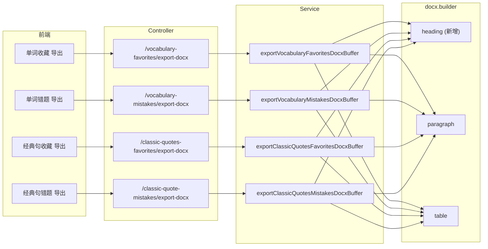

# 收藏错题 DOCX 导出

> 单词 / 经典句的**收藏**与**错题**支持导出为 Word 文档。后端 4 个 `exportXxxDocxBuffer` 方法复用 `docx.builder`（新增 `heading` 层级标题），前端 `downloadXxxDocx` 触发浏览器下载。

## 延伸阅读

- [今日复习列表与导出.md](./今日复习列表与导出.md)：复习导出（姊妹篇，共用 docx builder）
- [英语收藏DOCX导出.md](./英语收藏DOCX导出.md)：既有收藏导出基础

---

## 1. 背景与目标

用户希望把收藏的单词 / 经典句、以及错题导出为 Word，便于打印或离线复习。本轮补全 4 个导出方法：

- 单词收藏导出
- 单词错题导出
- 经典句收藏导出
- 经典句错题导出

同时给 `docx.builder` 加 `heading({ text, level })`，支持多级标题（之前只有 paragraph/table/run）。

## 2. 改动范围

**后端改动**

- `apps/backend/src/services/english-learning/english-favorites-docx.builder.ts`：`buildVocabularyFavoritesDocxBuffer` / `buildClassicQuoteFavoritesDocxBuffer`
- `apps/backend/src/services/english-learning/english-learning.service.ts`：`exportVocabularyFavoritesDocxBuffer`、`exportVocabularyMistakesDocxBuffer`、`exportClassicQuoteFavoritesDocxBuffer`、`exportClassicQuoteMistakesDocxBuffer`
- `apps/backend/src/services/english-learning/dto/english-export-docx.dto.ts`：导出参数 DTO
- `apps/backend/src/services/english-learning/english-learning.controller.ts`：4 个导出端点

**前端改动**

- `apps/frontend/src/views/englishLearning/components/`：各收藏页 / 错题页的导出按钮
- `apps/frontend/src/service/index.ts`、`apps/frontend/src/service/api.ts`：`downloadVocabularyFavoritesDocx` 等 4 个方法

---

## 3. 实现思路

### 3.1 `english-favorites-docx.builder.ts`

两个 builder 方法直接用 `docx` 包的 `Document / Paragraph / TextRun` 构造文档，标题用 `HeadingLevel.HEADING_1`：

- `buildVocabularyFavoritesDocxBuffer(rows, heading?)`：标题 → 每条「序号 + 词（加粗）/ 音标（`/ipa/` 包裹）/ 词性 / 音节划分 / 释义 / 例句（斜体）」。
- `buildClassicQuoteFavoritesDocxBuffer(rows, heading?)`：标题 → 每条「序号 + 英文（加粗）/ 译文 / 出处 / 赏析（斜体）」。

收藏 / 错题 / 复习导出**共用**这两个 builder，区别只在标题和数据来源。

### 3.2 四个导出方法的统一结构

```text
标题（level 1）
  └─ 导出时间、数量
每题（level 2 标题 + 正文）
  └─ 经典句：原句 + 释义 + 词性/IPA/释义表
  └─ 单词：单词 + 音标 + 释义
```

### 3.3 架构图



---

## 4. 关键代码对比与注释

### 4.1 `docx.builder.ts` 新增 `heading`（改动）

**改动前**（基线）· `apps/backend/src/services/english-learning/docx.builder.ts`（无 heading 方法）

```typescript
// 基线：只有 paragraph / table / run / buildDocxBuffer
```

**改动后**（当前）· `apps/backend/src/services/english-learning/docx.builder.ts`（新增 heading）

```typescript
import * as docx from 'docx';

// 多级标题：level 1/2/3 对应 Word 标题样式
/**
 * 多级标题。level 1/2/3 对应 Word 内置标题样式。
 * 之前只有 paragraph，无法生成大纲导航。
 */
export function heading(args: {
	// 标题文本
	text: string;
	// 层级：1/2/3
	level: 1 | 2 | 3;
}): docx.Paragraph {
	const levelMap = {
		1: docx.HeadingLevel.HEADING_1,
		2: docx.HeadingLevel.HEADING_2,
		3: docx.HeadingLevel.HEADING_3,
	} as const;
	return new docx.Paragraph({
		text: args.text,
		heading: levelMap[args.level],
	});
}

// 段落（已有）
export function paragraph(args: { text: string }): docx.Paragraph {
	return new docx.Paragraph({ children: [new docx.TextRun(args.text)] });
}

// ... table / buildDocxBuffer 保持不变
```

**变更摘要**：新增 `heading` 方法，映射 `level` 到 `docx.HeadingLevel`，让导出文档有大纲导航。

### 4.2 单词收藏导出（纯新增，摘录）

**改动后**（新增）· `apps/backend/src/services/english-learning/english-learning.service.ts`（摘录）

```typescript
// 单词收藏导出 DOCX
	async exportVocabularyFavoritesDocxBuffer(params: {
		userId: number;
	}): Promise<Buffer> {
		// 1. 查用户收藏的单词
		const favorites = await this.vocabularyFavoriteRepo.find({
			where: { userId: params.userId },
			relations: ['word'],
			order: { createdAt: 'DESC' },
		});

		// 2. 构建文档
		const children: docx.Paragraph[] = [];
		children.push(heading({ text: '单词收藏', level: 1 }));
		children.push(
			paragraph({
				text: `共 ${favorites.length} 个单词，导出时间 ${new Date().toLocaleString()}`,
			}),
		);

		// 3. 逐词：单词（level 2）+ 音标 + 释义
		for (let i = 0; i < favorites.length; i += 1) {
			const f = favorites[i]!;
			children.push(heading({ text: `${i + 1}. ${f.word.word}`, level: 2 }));
			if (f.word.ipa) {
				children.push(paragraph({ text: `音标：/${f.word.ipa}/` }));
			}
			if (f.word.meaningZh) {
				children.push(paragraph({ text: `释义：${f.word.meaningZh}` }));
			}
		}

		// 4. 生成 buffer
		return buildDocxBuffer({ children });
	}
```

### 4.3 经典句错题导出（纯新增，摘录，含词性表）

**改动后**（新增）· `apps/backend/src/services/english-learning/english-learning.service.ts`（摘录）

```typescript
// 经典句错题导出 DOCX：含词性/IPA/释义表
	async exportClassicQuotesMistakesDocxBuffer(params: {
		userId: number;
	}): Promise<Buffer> {
		// 1. 查用户经典句错题
		const mistakes = await this.classicQuotesMistakeRepo.find({
			where: { userId: params.userId },
			relations: ['item'],
			order: { createdAt: 'DESC' },
		});

		// 2. 批量查词元标注
		const englishes = mistakes.map((m) => m.item.english);
		const annotations = await this.batchGetSentenceWordAnnotations(englishes);

		// 3. 构建文档
		const children: docx.Paragraph[] = [];
		children.push(heading({ text: '经典句错题', level: 1 }));
		children.push(
			paragraph({
				text: `共 ${mistakes.length} 题，导出时间 ${new Date().toLocaleString()}`,
			}),
		);

		// 4. 逐题：原句（level 2）+ 释义 + 词性表
		for (let i = 0; i < mistakes.length; i += 1) {
			const m = mistakes[i]!;
			const anns = annotations[m.item.english] ?? [];
			children.push(heading({ text: `${i + 1}. ${m.item.english}`, level: 2 }));
			children.push(paragraph({ text: m.item.meaningZh ?? '' }));
			if (anns.length > 0) {
				children.push(
					table({
						rows: anns.map((a) => [a.word, a.posZh, a.ipa, a.meaningZh]),
					}),
				);
			}
		}

		return buildDocxBuffer({ children });
	}
```

### 4.4 Controller 导出端点（改动，摘录一个，其余同构）

**改动后**（当前）· `apps/backend/src/services/english-learning/english-learning.controller.ts`（摘录）

```typescript
	// 单词收藏导出 DOCX
	@Post('vocabulary/favorites/export-docx')
	async exportVocabularyFavoritesDocx(
		@CurrentUser() user: AuthUserDto,
		@Res() res: Response,
	) {
		const buffer = await this.englishLearningService.exportVocabularyFavoritesDocxBuffer(
			{ userId: user.id },
		);
		res.setHeader(
			'Content-Type',
			'application/vnd.openxmlformats-officedocument.wordprocessingml.document',
		);
		res.setHeader(
			'Content-Disposition',
			`attachment; filename="${encodeURIComponent(`单词收藏-${new Date().toISOString().slice(0, 10)}.docx`)}"`,
		);
		res.send(buffer);
	}

	// 单词错题 / 经典句收藏 / 经典句错题 端点同构，略
```

### 4.5 前端下载工具（改动，摘录）

**改动后**（当前）· `apps/frontend/src/views/englishLearning/utils/downloadDocx.ts`（摘录）

```typescript
// 通用 DOCX 下载：调接口 → Blob → a.click
export async function downloadDocx(
	// 接口函数
	fetcher: () => Promise<{ data: BlobPart }>,
	// 文件名
	filename: string,
) {
	const res = await fetcher();
	// 转 Blob
	const blob = new Blob([res.data], {
		type: 'application/vnd.openxmlformats-officedocument.wordprocessingml.document',
	});
	// 触发下载
	const url = URL.createObjectURL(blob);
	const a = document.createElement('a');
	a.href = url;
	a.download = filename;
	document.body.appendChild(a);
	a.click();
	document.body.removeChild(a);
	URL.revokeObjectURL(url);
}

// 单词收藏导出
export async function downloadVocabularyFavoritesDocx() {
	return downloadDocx(
		() => api.exportVocabularyFavoritesDocx(),
		`单词收藏-${new Date().toISOString().slice(0, 10)}.docx`,
	);
}

// 单词错题 / 经典句收藏 / 经典句错题 同构，略
```

---

## 5. 兼容性与影响

- **`heading` 新增**：纯加法，不影响已有 `paragraph` / `table` 调用。
- **4 个导出方法同构**：结构一致，维护时改一处即可。
- **大数据量**：导出全量不分页，单词收藏量可能较大（上千），docx 库内存构建可能慢；后续可考虑流式或分批。
- **文件名中文**：`Content-Disposition` 用 `encodeURIComponent` 编码，避免乱码。

## 6. 相关源码路径

| 说明 | 路径 |
|------|------|
| docx builder（heading 新增） | `apps/backend/src/services/english-learning/docx.builder.ts` |
| 4 个导出方法 | `apps/backend/src/services/english-learning/english-learning.service.ts` |
| 导出 DTO | `apps/backend/src/services/english-learning/dto/english-export-docx.dto.ts` |
| Controller 端点 | `apps/backend/src/services/english-learning/english-learning.controller.ts` |
| 前端下载工具 | `apps/frontend/src/views/englishLearning/utils/downloadDocx.ts` |

---

（若与仓库最新源码不一致，以源码为准）
