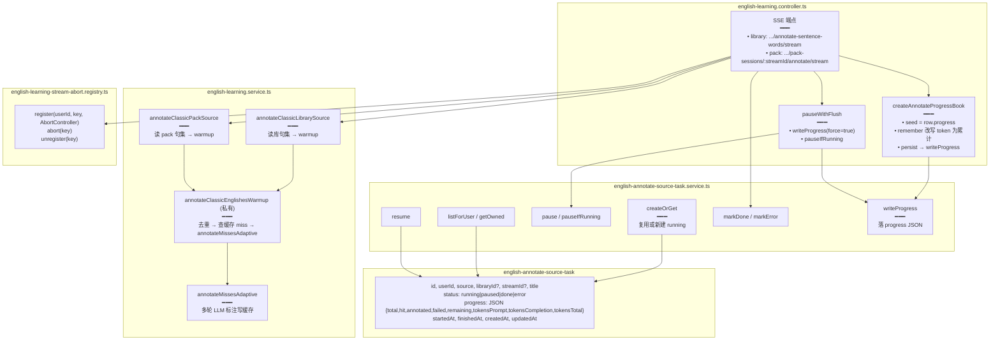

# 整集标注任务持久化与续跑

> 经典句整集词标注预热产生的长任务，用 `english_annotate_source_task` 表持久化进度（总句数 / 命中 / 已标 / 失败 / 剩余 / token 累计），SSE 推送过程中持续落库；用户暂停时 `pauseIfRunning` 写回最后快照，下次 resume 从落库进度叠加 token，天然续跑。

## 延伸阅读

- [句内词标注缓存与批量标注.md](./句内词标注缓存与批量标注.md)：缓存表与 `annotateMissesAdaptive`
- [经典句导出与标注导入.md](./经典句导出与标注导入.md)：导出 JSON 后再导入复用
- [标注进度页UI重构.md](./标注进度页UI重构.md)：进度页卡片网格 + `TONE` + `StatCell` + i18n 插值修正

---

## 1. 背景与目标

整集标注可能涉及成百上千句，单次 SSE 连接可能被用户暂停、浏览器切后台、网络中断。需要：

1. **进度持久化**：把 `total / hit / annotated / failed / remaining / tokensPrompt / tokensCompletion / tokensTotal` 落到 `english_annotate_source_task.progress`（JSON）。
2. **暂停可恢复**：暂停时写回最后快照，resume 时以落库 `tokensPrompt / tokensCompletion` 为基准继续累计，token 不丢。
3. **来源解耦**：library（语句库）与 pack（拉取会话）共用同一套任务表与 SSE 流程。

## 2. 改动范围

**后端新增**

- `apps/backend/src/services/english-learning/entity/english-annotate-source-task.entity.ts`（任务实体）
- `apps/backend/src/services/english-learning/english-annotate-source-task.service.ts`（任务生命周期服务）
- `apps/backend/src/services/english-learning/english-learning-stream-abort.registry.ts`（SSE 连接注册表）

**后端改动**

- `apps/backend/src/services/english-learning/english-learning.service.ts`（`annotateClassicLibrarySource` / `annotateClassicPackSource` / 私有 `annotateClassicEnglishesWarmup`）
- `apps/backend/src/services/english-learning/english-learning.controller.ts`（SSE 端点 + 进度 book + 暂停落库）
- `apps/backend/src/services/english-learning/english-learning.module.ts`（注册 service 与 registry）

---

## 3. 实现思路

### 3.1 任务状态机

```text
createOrGet  → running（开始跑或复用已有 running）
pause        → paused（写回 progress 快照）
resume       → running（从 progress 续）
markDone     → done（全部成功）
markError    → error（有 failed 句，可继续重试）
dismiss      → 删除（done/error 可被用户关闭）
```

- 状态枚举只有 `running | paused | done | error` 四态，无 `pending`。
- 进度（total/hit/annotated/failed/remaining/tokens）统一存在 `progress` JSON 列，不拆成多列。

### 3.2 跨暂停 token 累计

```text
首次跑：basePrompt=0，本次 LLM 累计到 sessionPrompt → progress.tokensPrompt = sessionPrompt
暂停：writeProgress(force=true) 把 last 写库
续跑：createAnnotateProgressBook({ seed: row.progress }) → basePrompt = row.progress.tokensPrompt
      本次 sessionPrompt 叠加 → progress.tokensPrompt = basePrompt + sessionPrompt
```

`createAnnotateProgressBook` 在 controller 内维护 `last` 快照，每次 SSE 事件改写 token 字段为累计值后 `persist`。

### 3.3 架构图



---

## 4. 关键代码对比与注释

### 4.1 任务实体（纯新增）

**改动后**（新增）· `apps/backend/src/services/english-learning/entity/english-annotate-source-task.entity.ts`（约 L1–L67）

```typescript
// 任务状态枚举：运行中 / 已暂停 / 已完成 / 出错
export type AnnotateSourceTaskStatus = 'running' | 'paused' | 'done' | 'error';

// 来源：语句库 or 拉取会话
export type AnnotateSourceTaskSource = 'library' | 'pack';

@Entity('english_annotate_source_task')
// 来源+状态复合索引，便于列表查询
@Index('IDX_east_source_status', ['source', 'status'])
export class EnglishAnnotateSourceTask {
	// UUID 主键
	@PrimaryGeneratedColumn('uuid')
	id!: string;

	// 所属用户
	@Column({ name: 'user_id', type: 'int' })
	userId!: number;

	// 来源类型
	@Column({ type: 'varchar', length: 16, default: 'library' })
	source!: AnnotateSourceTaskSource;

	// 语句库 ID（source=library 时非空）
	@Column({ name: 'library_id', type: 'varchar', length: 64, nullable: true })
	libraryId!: string | null;

	// 拉取会话 streamId（source=pack 时非空）
	@Column({ name: 'stream_id', type: 'varchar', length: 64, nullable: true })
	streamId!: string | null;

	// 来源标题（冗余展示）
	@Column({ type: 'varchar', length: 256, default: '' })
	title!: string;

	// 状态
	@Column({ type: 'varchar', length: 16, default: 'running' })
	status!: AnnotateSourceTaskStatus;

	// 进度快照：总句数 / 命中 / 已标 / 失败 / 剩余 / token 累计
	@Column({ type: 'json', default: () => "'{}'" })
	progress!: Partial<{
		total: number;
		hit: number;
		miss: number;
		annotated: number;
		failed: number;
		remaining: number;
		tokensPrompt: number;
		tokensCompletion: number;
		tokensTotal: number;
	}>;

	// 开始时间
	@Column({ name: 'started_at', type: 'timestamp', nullable: true })
	startedAt!: Date | null;

	// 结束时间
	@Column({ name: 'finished_at', type: 'timestamp', nullable: true })
	finishedAt!: Date | null;

	// 错误信息
	@Column({ name: 'error_message', type: 'text', nullable: true })
	errorMessage!: string | null;

	@CreateDateColumn({ name: 'created_at', type: 'timestamp' })
	createdAt!: Date;

	@UpdateDateColumn({ name: 'updated_at', type: 'timestamp' })
	updatedAt!: Date;
}
```

**说明**：进度不拆成多列，统一存 `progress` JSON，便于扩展；library 与 pack 各有独立外键列（`libraryId` / `streamId`）。

### 4.2 StreamAbortRegistry（纯新增）

**改动后**（新增）· `apps/backend/src/services/english-learning/english-learning-stream-abort.registry.ts`（约 L1–L46）

```typescript
@Injectable()
export class EnglishLearningStreamAbortRegistry {
	// 注册表达式：(userId, key) → AbortController，按用户隔离
	private controllers = new Map<string, AbortController>();

	// 注册：若已有旧 controller 先 abort 防泄漏
	register(userId: number, key: string, controller: AbortController) {
		const k = `${userId}:${key}`;
		const old = this.controllers.get(k);
		if (old) old.abort();
		this.controllers.set(k, controller);
	}

	// 取消：暂停/关页时调用
	abort(userId: number, key: string) {
		const ctrl = this.controllers.get(`${userId}:${key}`);
		if (ctrl) ctrl.abort();
	}

	// 任务结束时清理
	unregister(userId: number, key: string) {
		this.controllers.delete(`${userId}:${key}`);
	}
}
```

**说明**：key 由 `annotateTaskAbortKey(taskId)` 生成，按 `userId:key` 组合存储，不同用户互不影响。

### 4.3 任务生命周期服务（纯新增，摘录）

**改动后**（新增）· `apps/backend/src/services/english-learning/english-annotate-source-task.service.ts`（约 L1–L188，摘录核心方法）

```typescript
@Injectable()
export class AnnotateSourceTaskService {
	// 复用已有 running/paused 任务，否则新建 running
	async createOrGet(params: {
		userId: number;
		source: 'library' | 'pack';
		libraryId?: string;
		streamId?: string;
		title?: string;
	}): Promise<{ task: EnglishAnnotateSourceTask; reused: boolean }> {
		// 按 source + libraryId/streamId 查最新任务
		const existing = await this.repo.findOne({
			where: this.sourceWhere(params),
			order: { createdAt: 'DESC' },
		});
		// running/paused 复用；done/error 则新建
		if (existing && (existing.status === 'running' || existing.status === 'paused')) {
			return { task: existing, reused: true };
		}
		// 新建 running 任务
		const task = this.repo.create({
			userId: params.userId,
			source: params.source,
			libraryId: params.libraryId ?? null,
			streamId: params.streamId ?? null,
			title: params.title ?? '',
			status: 'running',
			progress: {},
			startedAt: new Date(),
		});
		return { task: await this.repo.save(task), reused: false };
	}

	// 写进度快照（节流，force=true 强制写）
	async writeProgress(userId, taskId, snap, opts?: { force?: boolean }) {
		// 合并进 progress，更新 updatedAt
		...
	}

	// 暂停：status → paused
	async pause(userId, taskId) { ... }

	// 仅当 running 时暂停（SSE 断开时调用）
	async pauseIfRunning(userId, taskId) { ... }

	// 恢复：status → running，startedAt 刷新
	async resume(userId, taskId) { ... }

	// 完成：status → done，finishedAt = now
	async markDone(userId, taskId, snap) { ... }

	// 出错：status → error，写 errorMessage
	async markError(userId, taskId, message, snap) { ... }

	// 关闭单条（done/error 可 dismiss）
	async dismiss(userId, taskId) { ... }

	// 一键关闭所有 done/error
	async dismissFinished(userId) { ... }
}
```

### 4.4 整集标注入口与私有 warmup（改动）

**改动后**（当前）· `apps/backend/src/services/english-learning/english-learning.service.ts`（约 L6300–L6655，摘录）

```typescript
/** 语句库整集词标注预热（可 SSE 进度） */
async annotateClassicLibrarySource(params: {
	userId: number;
	libraryId: string;
	signal?: AbortSignal;
	onEvent?: (ev: AnnotateSourceSseEvent) => void;
}): Promise<{ total; hit; annotated; failed; tokensPrompt; tokensCompletion; tokensTotal }> {
	// 先清过期缓存
	await this.purgeStaleSentenceWordAnnotationCache();
	// 鉴权：用户可读该库
	await this.assertClassicQuotesLibraryReadable(params.userId, params.libraryId);
	// 加载库内所有 english
	const englishes = await this.loadAllEnglishesForLibrary(params.libraryId);
	// 调私有 warmup
	return this.annotateClassicEnglishesWarmup(params.userId, englishes, {
		signal: params.signal,
		onEvent: params.onEvent,
	});
}

/** Pack 会话整集词标注预热（可 SSE 进度） */
async annotateClassicPackSource(params: {
	userId: number;
	streamId: string;
	signal?: AbortSignal;
	onEvent?: (ev: AnnotateSourceSseEvent) => void;
}): Promise<{ total; hit; annotated; failed; tokensPrompt; tokensCompletion; tokensTotal }> {
	await this.purgeStaleSentenceWordAnnotationCache();
	const streamId = params.streamId.trim();
	// 鉴权：拉取记录存在且属于该用户
	const session = await this.classicPackSessionRepo.findOne({
		where: { userId: params.userId, streamId },
	});
	if (!session) throw new NotFoundException('拉取记录不存在或无权访问');
	// 加载 pack 内所有 english
	const englishes = await this.loadAllEnglishesForPack(params.userId, streamId);
	return this.annotateClassicEnglishesWarmup(params.userId, englishes, {
		signal: params.signal,
		onEvent: params.onEvent,
	});
}

// 私有：句集 → 去重 → 查缓存 miss → 多轮标注
private async annotateClassicEnglishesWarmup(
	userId: number,
	englishes: string[],
	opts?: { signal?: AbortSignal; onEvent?: (ev: AnnotateSourceSseEvent) => void },
): Promise<{ total; hit; annotated; failed; tokensPrompt; tokensCompletion; tokensTotal }> {
	// 1. 去重：按 cacheKey 去重，过滤空句和 >80 词的长句
	const byKey = new Map<string, WorkItem>();
	for (const raw of englishes) {
		const english = raw?.trim() ?? '';
		if (!english) continue;
		const words = segmentEnglishSentenceWords(english);
		if (words.length === 0 || words.length > 80) continue;
		const englishNorm = english.toLowerCase();
		const cacheKey = buildSentenceWordAnnotationCacheKey(englishNorm, words);
		if (!byKey.has(cacheKey)) {
			byKey.set(cacheKey, { cacheKey, english, englishNorm, words });
		}
	}
	const items = [...byKey.values()];
	const total = items.length;
	// 空集直接 complete
	if (total === 0) { ... return empty; }

	// 2. 批量查缓存：只认 isUsableSentenceWordAnnotations 验收通过的行
	const cachedRows = await this.sentenceWordAnnotationCacheRepo.find({
		where: { cacheKey: In(items.map((i) => i.cacheKey)) },
	});
	const lenByKey = new Map(items.map((i) => [i.cacheKey, i.words.length]));
	const hitKeys = new Set(
		cachedRows
			.filter((r) => isUsableSentenceWordAnnotations(r.annotations, lenByKey.get(r.cacheKey) ?? -1))
			.map((r) => r.cacheKey),
	);
	const misses = items.filter((it) => !hitKeys.has(it.cacheKey));
	const hit = total - misses.length;
	const miss = misses.length;
	// 推送 start 事件
	opts?.onEvent?.({ type: 'annotate.start', total, hit, miss });
	// 全命中直接 complete
	if (misses.length === 0) { ... return done; }

	// 3. 多轮续标 miss
	const { annotated, failed, tokensPrompt, tokensCompletion, tokensTotal } =
		await this.annotateMissesAdaptive(userId, misses, {
			signal: opts?.signal,
			onProgress: (p) =>
				opts?.onEvent?.({
					type: 'annotate.progress',
					total, hit, miss,
					annotated: p.annotated,
					failed: p.failed,
					remaining: p.remaining,
					tokensPrompt: p.tokensPrompt,
					tokensCompletion: p.tokensCompletion,
					tokensTotal: p.tokensTotal,
				}),
		});
	// 推送 complete
	opts?.onEvent?.({ type: 'annotate.complete', total, hit, annotated, failed, tokensPrompt, tokensCompletion, tokensTotal });
	return { total, hit, annotated, failed, tokensPrompt, tokensCompletion, tokensTotal };
}
```

**说明**：`annotateClassicEnglishesWarmup` 是**私有**方法，对外只暴露 `annotateClassicLibrarySource` 与 `annotateClassicPackSource`；SSE 事件类型为 `AnnotateSourceSseEvent`（`annotate.start` / `annotate.progress` / `annotate.complete` / `annotate.error`）。

### 4.5 Controller SSE 端点（改动，摘录）

**改动后**（当前）· `apps/backend/src/services/english-learning/english-learning.controller.ts`（约 L1220–L1340，摘录 library 端点核心）

```typescript
/** 语句库整集词标注预热（SSE 进度） */
@Post('classic-quotes-libraries/annotate-sentence-words/stream')
@Sse()
annotateClassicLibrarySourceStream(
	@Req() req: AuthedRequest,
	@Body() dto: AnnotateClassicLibraryDto,
): Observable<{ data: Record<string, unknown> }> {
	const userId = req.user?.userId!;
	return new Observable((subscriber) => {
		// SSE 连接级 AbortController
		const streamAbort = new AbortController();
		const taskId = dto.taskId?.trim() || '';
		// 注册到 registry，供暂停时 abort
		if (taskId) {
			this.streamAbortRegistry.register(
				userId,
				annotateTaskAbortKey(taskId),
				streamAbort,
			);
		}
		// 持久化回调：写进度到任务表
		const persist = (snap: AnnotateProgressSeed, force: boolean) => {
			if (!taskId) return;
			void this.annotateSourceTaskService.writeProgress(userId, taskId, snap, { force });
		};
		// 进度 book：从落库 seed 起步，token 跨暂停累计
		let book = createAnnotateProgressBook({ persist });
		const emit = (data: Record<string, unknown>) => {
			book.remember(data); // 改写 token 为累计值 + 落库
			try { subscriber.next({ data }); } catch { streamAbort.abort(); }
		};
		// 暂停时：强制写最后快照 + 置 paused
		const pauseWithFlush = async () => {
			if (!taskId) return;
			await this.annotateSourceTaskService.writeProgress(userId, taskId, book.last, { force: true });
			await this.annotateSourceTaskService.pauseIfRunning(userId, taskId);
		};
		// 心跳：每 PACK_SSE_KEEPALIVE_INTERVAL_MS 推一次 progress(heartbeat=true)
		const keepalive = setInterval(() => {
			emit({ type: 'annotate.progress', heartbeat: true, ...book.last });
		}, PACK_SSE_KEEPALIVE_INTERVAL_MS);

		void (async () => {
			try {
				// 若有 taskId，从落库 progress 恢复 token 基准
				if (taskId) {
					try {
						const row = await this.annotateSourceTaskService.getOwned(userId, taskId);
						book = createAnnotateProgressBook({ seed: row.progress, persist });
					} catch { /* 无任务从零计 */ }
				}
				// 实际跑标注
				await this.englishLearningService.annotateClassicLibrarySource({
					userId, libraryId: dto.libraryId,
					signal: streamAbort.signal,
					onEvent: (ev) => emit({ ...ev }),
				});
				// 完成：有失败 → error，否则 done
				if (taskId && !streamAbort.signal.aborted) {
					const snap = book.last;
					if (snap.failed > 0) {
						await this.annotateSourceTaskService.markError(userId, taskId, `有 ${snap.failed} 句标注失败，可点继续重试`, snap);
					} else {
						await this.annotateSourceTaskService.markDone(userId, taskId, snap);
					}
				}
				subscriber.complete();
			} catch (e) {
				if (streamAbort.signal.aborted || (e instanceof Error && e.name === 'AbortError')) {
					// 暂停/断开：写回进度 + 置 paused
					await pauseWithFlush();
					subscriber.complete();
					return;
				}
				// 其它错误：markError
				const message = e instanceof Error ? e.message.slice(0, 200) : String(e);
				if (taskId) {
					await this.annotateSourceTaskService.markError(userId, taskId, message, book.last);
				}
				subscriber.error(e);
			} finally {
				clearInterval(keepalive);
				if (taskId) this.streamAbortRegistry.unregister(userId, annotateTaskAbortKey(taskId));
			}
		})();
	});
}
```

**说明**：`createAnnotateProgressBook` 确保 token 在暂停后续跑时从落库值累计；`pauseWithFlush` 在 SSE 断开时保证最后进度落库。

---

## 5. 兼容性与影响

- **任务表新增**：对旧数据无影响，新任务首次 `createOrGet` 时自动建。
- **续跑幂等**：续跑时重新查缓存，已标注句直接 hit，不会重复消耗 LLM。
- **token 累计准确**：`createAnnotateProgressBook` 以 `seed.tokensPrompt / tokensCompletion` 为基准叠加，暂停不丢计数。
- **library 与 pack 统一**：同一任务表、同一 SSE 流程，仅来源列不同。

## 6. 相关源码路径

| 说明 | 路径 |
|------|------|
| 任务实体 | `apps/backend/src/services/english-learning/entity/english-annotate-source-task.entity.ts` |
| 任务生命周期服务 | `apps/backend/src/services/english-learning/english-annotate-source-task.service.ts` |
| SSE 连接注册表 | `apps/backend/src/services/english-learning/english-learning-stream-abort.registry.ts` |
| 整集标注入口 | `apps/backend/src/services/english-learning/english-learning.service.ts`（`annotateClassicLibrarySource` / `annotateClassicPackSource`） |
| SSE 控制器 | `apps/backend/src/services/english-learning/english-learning.controller.ts` |
| 模块注册 | `apps/backend/src/services/english-learning/english-learning.module.ts` |

---

（若与仓库最新源码不一致，以源码为准）
