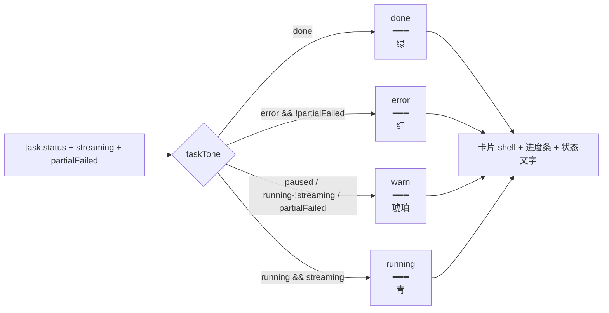

## 延伸阅读

- 整集标注任务持久化：[`整集标注任务持久化与续跑.md`](./整集标注任务持久化与续跑.md)
- 句内词标注缓存：[`句内词标注缓存与批量标注.md`](./句内词标注缓存与批量标注.md)
- 产品使用说明：[`docs/项目指南.md`](../项目指南.md) §13.31
- 用户向更新条目：[`docs/项目更新信息.md`](../项目更新信息.md) §24

---

## 1. 背景与目标

经典句整集标注进度页（`/english-learning/annotate`）原布局为单列卡片 + `<dl>` 指标列表，视觉密度低、与练习报告页风格不一致，且部分失败任务的错误提示文案（`errorMessage`）会干扰状态展示。

本次重构目标：

- **布局对齐练习报告**：卡片网格（`auto-fill, minmax(18rem, 1fr)`），统一 `PracticePageShell` 外壳。
- **指标对齐侧栏统计格**：新增 `StatCell` 组件，`total/hit/annotated/failed` 四项以彩色统计格展示，tokens 明细收为一行。
- **状态色调统一**：抽取 `TONE` 配色表（running/done/warn/error），卡片边框、进度条、状态文字统一色调；运行中但未流式（`running && !streaming`）归为 warn（琥珀色），提示「可继续」。
- **去掉冗余错误文案**：`englishAnnotateSource` 中部分失败时不再设置 `errorMessage`，状态文字已能表达「部分失败」，避免重复提示。
- **i18n 插值修正**：标注相关字符串从 `{{var}}` 改为 `{var}`，匹配 i18n 库实际插值语法。

---

## 2. 改动范围

| 路径 | 说明 |
|------|------|
| `apps/frontend/src/views/englishLearning/annotate/index.tsx` | 重构：`PracticePageShell` + 卡片网格 + `TONE` + `StatCell`；去掉 `Progress`/`ArrowLeft`/`X`/`useNavigate` 依赖 |
| `apps/frontend/src/store/englishAnnotateSource.ts` | 部分失败时 `errorMessage = undefined`（2 处） |
| `apps/frontend/src/i18n/locales/zh-CN.ts` | 标注相关字符串 `{{var}}` → `{var}` |
| `apps/frontend/src/i18n/locales/en-US.ts` | 同上 |

---

## 3. 实现思路

### 3.1 关键决策

1. **`taskTone` 四态映射**：`done→done(绿)`、`error && !partialFailed→error(红)`、`paused / running-!streaming / partialFailed→warn(琥珀)`、其余 `running→running(青)`。运行中但流式连接断开时归为 warn，让用户一眼看出「卡住可继续」。
2. **`TONE` 配色表集中管理**：`shell`（卡片边框+渐变背景）、`bar`（进度条）、`status`（文字色）三类样式统一从 `TONE[toneKey]` 取，替代原来散落的 `cn()` 条件拼接。
3. **`StatCell` 对齐侧栏统计格**：`label`（小字次要色）+ `value`（大字 tabular-nums）+ 可定制 `shell`/`valueClass`，与 `DailySession` 统计格视觉一致。
4. **进度条自绘**：去掉 `Progress` 组件依赖，改用 `div` + `width: ${percent}%` + `tone.bar`，减少组件依赖且色调可控。
5. **`errorMessage` 置 undefined**：部分失败时状态文字已显示「部分失败」，`errorMessage` 的「有 N 句标注失败，可点继续重试」属重复信息，去掉后卡片更干净。
6. **i18n 单花括号**：项目 i18n 库使用 `{var}` 插值（非 Vue 的 `{{var}}`），标注相关字符串统一从 `{{var}}` 改为 `{var}`，确保参数正确渲染。

### 3.2 状态色调映射



---

## 4. 关键代码对比与注释

### 4.1 `annotate/index.tsx`：TaskCard 重构（核心）

**改动前** · `apps/frontend/src/views/englishLearning/annotate/index.tsx`（基线，约 L1–L130）

```typescript
/**
 * 经典句整集标注进度页：列出全部任务 + 进度条与明细。
 */
import { Button, Spinner } from '@ui/index';
import { Toast } from '@ui/sonner';
// 旧版用 ArrowLeft 返回、X 关闭按钮
import { ArrowLeft, Play, Trash2, X } from 'lucide-react';
import { observer } from 'mobx-react';
import { useEffect, useState } from 'react';
// 旧版用 useNavigate 做返回
import { useNavigate } from 'react-router';
// 旧版用 Progress 组件做进度条
import { Progress } from '@/components/ui/progress';
import { useI18n } from '@/hooks';
import { cn } from '@/lib/utils';
import EnglishAnnotateSource, {
	type AnnotateTask,
	annotateTaskPercent,
} from '@/store/englishAnnotateSource';
import { getRequestErrorMessage } from '@/utils/fetch';

// 状态文字：根据 status 与是否部分失败返回对应文案
function statusLabel(
	task: AnnotateTask,
	t: (key: string, params?: Record<string, string | number>) => string,
) {
	switch (task.status) {
		case 'running':
			return t('englishLearning.annotateTasks.statusRunning');
		case 'done':
			return t('englishLearning.annotateTasks.statusDone');
		case 'paused':
			return t('englishLearning.annotateTasks.statusPaused');
		case 'error':
			// 部分失败用「部分失败」文案，否则用「错误」
			return (task.progress?.failed ?? 0) > 0
				? t('englishLearning.annotateTasks.statusPartialFailed')
				: t('englishLearning.annotateTasks.statusError');
	}
}

// 单张任务卡片
const TaskCard = observer(function TaskCard({ task }: { task: AnnotateTask }) {
	const { t } = useI18n();
	const [busy, setBusy] = useState(false);
	const p = task.progress;
	const percent = annotateTaskPercent(task);
	const streaming = EnglishAnnotateSource.hasOpenStream(task.id);
	// 部分失败：error 状态且 failed > 0
	const partialFailed =
		task.status === 'error' && (task.progress?.failed ?? 0) > 0;
	const sourceLabel =
		task.source === 'library'
			? t('englishLearning.annotateTasks.sourceLibrary')
			: t('englishLearning.annotateTasks.sourcePack');

	// 继续标注
	const onResume = async () => {
		if (busy) return;
		setBusy(true);
		try {
			await EnglishAnnotateSource.resume(task.id);
		} catch (e) {
			Toast({
				type: 'error',
				title: getRequestErrorMessage(e),
			});
		} finally {
			setBusy(false);
		}
	};

	return (
		// 旧版：单列卡片，边框色按状态条件拼接
		<article
			className={cn(
				'rounded-lg border border-theme/10 bg-theme-secondary/30 px-4 py-3.5 space-y-3',
				task.status === 'running' && streaming && 'border-teal-500/20',
				(task.status === 'paused' ||
					(task.status === 'running' && !streaming) ||
					partialFailed) &&
					'border-amber-500/20',
				task.status === 'error' && !partialFailed && 'border-rose-500/20',
			)}
		>
			{/* 旧版：左标题+状态，右操作按钮 */}
			<div className="flex items-start justify-between gap-3">
				<div className="min-w-0 space-y-1">
					<h2 className="truncate text-sm font-medium text-textcolor">
						{task.title}
					</h2>
					<p className="text-xs text-textcolor/55">
						{sourceLabel}
						{' · '}
						{/* 状态文字色按状态条件拼接，散落各处 */}
						<span
							className={cn(
								task.status === 'running' &&
									streaming &&
									'text-teal-600 dark:text-teal-400',
								task.status === 'done' &&
									'text-emerald-600 dark:text-emerald-400',
								task.status === 'error' &&
									!partialFailed &&
									'text-rose-600 dark:text-rose-400',
								(task.status === 'paused' ||
									(task.status === 'running' && !streaming) ||
									partialFailed) &&
									'text-amber-600 dark:text-amber-400',
							)}
						>
							{/* running 但未流式时显示「已暂停」 */}
							{task.status === 'running' && !streaming
								? t('englishLearning.annotateTasks.statusPaused')
								: statusLabel(task, t)}
						</span>
					</p>
				</div>
				{/* ...（操作按钮略，结构相同） */}
			</div>
			{/* ...（旧版用 Progress 组件 + dl 指标列表） */}
		</article>
	);
});
```

**改动后** · `apps/frontend/src/views/englishLearning/annotate/index.tsx`（当前，约 L1–L140）

```typescript
/**
 * 经典句整集标注进度页：列表布局对齐练习报告，指标对齐侧栏统计格。
 */
import { Button, Spinner } from '@ui/index';
import { Toast } from '@ui/sonner';
// 去掉 ArrowLeft / X，改用 Play 继续 + Trash2 关闭
import { Play, Trash2 } from 'lucide-react';
import { observer } from 'mobx-react';
import { useEffect, useState } from 'react';
import { useI18n } from '@/hooks';
import { cn } from '@/lib/utils';
import EnglishAnnotateSource, {
	type AnnotateTask,
	annotateTaskPercent,
} from '@/store/englishAnnotateSource';
import { getRequestErrorMessage } from '@/utils/fetch';
// 改用练习页统一外壳 PracticePageShell，去掉 useNavigate / Progress
import { PracticePageShell } from '../practice/components/shell';

// 顶栏链接按钮样式（继续 / 清除已完成）
const LINK_CLASS =
	'flex shrink-0 cursor-pointer items-center gap-1.5 whitespace-nowrap text-sm font-medium text-teal-500 hover:text-teal-400 disabled:cursor-not-allowed disabled:opacity-50';

// 卡片基础样式：边框 + 背景 + hover 态
const CARD_SHELL =
	'border-theme/10 bg-theme/5 hover:border-teal-500/35 hover:bg-teal-500/10 flex min-w-0 flex-col gap-2 rounded-md border px-3 py-3 transition-colors';

// 关闭按钮图标样式：破坏性色调
const ICON_BTN =
	'h-7 w-7 shrink-0 rounded-md border p-0 transition-colors border-destructive/20 bg-destructive/10 text-destructive/55 hover:border-destructive/35 hover:bg-destructive/20 hover:text-destructive';

// 状态文字：根据 status 与是否部分失败返回对应文案（逻辑不变）
function statusLabel(
	task: AnnotateTask,
	t: (key: string, params?: Record<string, string | number>) => string,
) {
	switch (task.status) {
		case 'running':
			return t('englishLearning.annotateTasks.statusRunning');
		case 'done':
			return t('englishLearning.annotateTasks.statusDone');
		case 'paused':
			return t('englishLearning.annotateTasks.statusPaused');
		case 'error':
			return (task.progress?.failed ?? 0) > 0
				? t('englishLearning.annotateTasks.statusPartialFailed')
				: t('englishLearning.annotateTasks.statusError');
	}
}

// 色调枚举：running/done/warn/error
type TaskTone = 'running' | 'done' | 'warn' | 'error';

// 根据 status + streaming + partialFailed 计算色调
function taskTone(
	task: AnnotateTask,
	streaming: boolean,
	partialFailed: boolean,
): TaskTone {
	// 完成 → 绿
	if (task.status === 'done') return 'done';
	// 错误且非部分失败 → 红
	if (task.status === 'error' && !partialFailed) return 'error';
	// 暂停 / 运行中未流式 / 部分失败 → 琥珀（提示可继续）
	if (
		task.status === 'paused' ||
		(task.status === 'running' && !streaming) ||
		partialFailed
	) {
		return 'warn';
	}
	// 运行中且流式 → 青
	return 'running';
}

// 统一配色表：shell 卡片样式 / bar 进度条 / status 文字色
const TONE = {
	running: {
		shell: 'border-teal-500/25 bg-linear-to-r from-teal-500/12 to-cyan-600/10',
		bar: 'bg-teal-500/85',
		status: 'text-teal-600 dark:text-teal-400',
	},
	done: {
		shell: '',
		bar: 'bg-emerald-500/80',
		status: 'text-emerald-600 dark:text-emerald-400',
	},
	warn: {
		shell:
			'border-amber-500/25 bg-linear-to-r from-amber-500/12 to-orange-500/10',
		bar: 'bg-amber-500/80',
		status: 'text-amber-600 dark:text-amber-400',
	},
	error: {
		shell: 'border-rose-500/25 bg-linear-to-r from-rose-500/12 to-rose-600/10',
		bar: 'bg-rose-500/80',
		status: 'text-rose-600 dark:text-rose-400',
	},
} as const;

// 对齐侧栏 DailySession 统计格：label 小字 + value 大字 tabular-nums
function StatCell({
	label,
	value,
	shell,
	valueClass,
}: {
	label: string;
	value: string | number;
	shell: string;
	valueClass: string;
}) {
	return (
		<div
			className={cn(
				'flex min-w-0 items-center justify-between gap-2 rounded-md border px-2.5 pt-1.5 pb-2',
				shell,
			)}
		>
			<span className="shrink-0 text-sm font-medium text-textcolor/55">
				{label}
			</span>
			<span
				className={cn(
					'min-w-0 truncate text-lg font-semibold tabular-nums leading-none',
					valueClass,
				)}
			>
				{value}
			</span>
		</div>
	);
}
```

**变更摘要**：去掉 `ArrowLeft`/`X`/`useNavigate`/`Progress` 依赖，改用 `PracticePageShell` + 自绘进度条；抽取 `taskTone` + `TONE` 统一色调；新增 `StatCell` 对齐侧栏统计格。

---

### 4.2 `annotate/index.tsx`：TaskCard 渲染（改动后）

**改动后** · `apps/frontend/src/views/englishLearning/annotate/index.tsx`（当前，约 L122–L306）

```typescript
// 单张任务卡片：observer 响应 store 变化
const TaskCard = observer(function TaskCard({ task }: { task: AnnotateTask }) {
	const { t } = useI18n();
	const [busy, setBusy] = useState(false);
	const p = task.progress;
	const percent = annotateTaskPercent(task);
	// 是否有活跃流式连接
	const streaming = EnglishAnnotateSource.hasOpenStream(task.id);
	// 部分失败：error 且 failed > 0
	const partialFailed =
		task.status === 'error' && (task.progress?.failed ?? 0) > 0;
	// 计算色调
	const toneKey = taskTone(task, streaming, partialFailed);
	const tone = TONE[toneKey];
	// 来源标签：词库 / 词包
	const sourceLabel =
		task.source === 'library'
			? t('englishLearning.annotateTasks.sourceLibrary')
			: t('englishLearning.annotateTasks.sourcePack');
	// 显示状态：running 但未流式时显示「已暂停」
	const displayStatus =
		task.status === 'running' && !streaming
			? t('englishLearning.annotateTasks.statusPaused')
			: statusLabel(task, t);
	// 非完成态显示进度摘要；完成态隐藏
	const showLiveSummary = !p || task.status !== 'done';

	// 继续标注
	const onResume = async () => {
		if (busy) return;
		setBusy(true);
		try {
			await EnglishAnnotateSource.resume(task.id);
		} catch (e) {
			Toast({
				type: 'error',
				title: getRequestErrorMessage(e),
			});
		} finally {
			setBusy(false);
		}
	};

	return (
		// 卡片基础 + 色调 shell
		<article className={cn(CARD_SHELL, tone.shell)}>
			{/* 顶行：标题 + 操作按钮（停止/继续/关闭） */}
			<div className="flex min-w-0 items-center gap-2">
				<h2 className="min-w-0 flex-1 truncate text-base font-semibold text-textcolor sm:text-lg">
					{task.title}
				</h2>
				<div className="flex shrink-0 items-center gap-1.5">
					{/* 运行中且流式：显示停止按钮 */}
					{task.status === 'running' && streaming ? (
						<Button
							type="button"
							size="sm"
							variant="outline"
							className="h-7 gap-1.5 border-rose-500/25 bg-rose-500/10 text-rose-600 hover:bg-rose-500/15 dark:text-rose-400"
							onClick={() => EnglishAnnotateSource.abort(task.id)}
						>
							<Spinner className="size-3.5 text-rose-500" />
							{t('englishLearning.annotateSource.cancelRunning')}
						</Button>
					) : null}
					{/* 暂停/错误/运行中未流式：显示继续按钮 */}
					{task.status === 'paused' ||
					task.status === 'error' ||
					(task.status === 'running' && !streaming) ? (
						<Button
							type="button"
							size="sm"
							variant="outline"
							disabled={busy}
							className="h-7 gap-1.5 border-teal-500/30 bg-teal-500/10 text-teal-600 hover:border-teal-500/45 hover:bg-teal-500/15 dark:text-teal-400"
							onClick={() => void onResume()}
						>
							{busy ? (
								<Spinner className="size-3.5 text-teal-500" />
							) : (
								<Play className="size-3.5" />
							)}
							{t('englishLearning.annotateTasks.resume')}
						</Button>
					) : null}
					{/* 非运行中流式：显示关闭按钮（Trash2 图标） */}
					{task.status !== 'running' || !streaming ? (
						<Button
							type="button"
							variant="ghost"
							size="sm"
							className={ICON_BTN}
							aria-label={t('englishLearning.annotateTasks.dismiss')}
							onClick={() => EnglishAnnotateSource.dismiss(task.id)}
						>
							<Trash2 className="size-3.5" />
						</Button>
					) : null}
				</div>
			</div>

			{/* 正文：来源 · 状态 · 百分比 + 进度摘要 + 进度条 + 统计格 */}
			<div className="flex flex-col gap-3">
				{/* 来源 · 状态 · 百分比 一行 */}
				<p className="flex min-w-0 flex-nowrap items-center gap-x-1.5 overflow-x-auto text-sm whitespace-nowrap tabular-nums">
					<span className="text-textcolor/50 shrink-0">{sourceLabel}</span>
					<span className="text-textcolor/35 shrink-0" aria-hidden>·</span>
					<span className={cn('shrink-0 font-medium', tone.status)}>
						{displayStatus}
					</span>
					<span className="text-textcolor/35 shrink-0" aria-hidden>·</span>
					<span className={cn('shrink-0 font-semibold', tone.status)}>
						{percent}%
					</span>
				</p>
				{/* 进度摘要：非完成态显示 */}
				{showLiveSummary ? (
					<p className="text-textcolor/60 text-sm leading-snug">
						{p
							? t('englishLearning.annotateSource.progress', {
									hit: p.hit,
									annotated: p.annotated,
									miss: p.miss || p.remaining,
									remaining: p.remaining,
								})
							: t('englishLearning.annotateSource.preparing')}
					</p>
				) : null}
				{/* 自绘进度条：tone.bar 控制颜色 */}
				<div className="h-1.5 w-full overflow-hidden rounded-md bg-theme/10">
					<div
						className={cn(
							'h-full rounded-md transition-[width] duration-300 ease-out',
							tone.bar,
						)}
						style={{ width: `${percent}%` }}
					/>
				</div>

				{/* 统计格：total / hit / annotated / failed，2 列网格 */}
				{p ? (
					<div className="flex flex-col gap-3">
						<div className="grid grid-cols-2 gap-3">
							<StatCell
								label={t('englishLearning.annotateTasks.metricTotal')}
								value={p.total}
								shell="border-sky-500/20 bg-linear-to-r from-sky-400/10 to-cyan-500/10"
								valueClass="text-sky-700 dark:text-cyan-400"
							/>
							<StatCell
								label={t('englishLearning.annotateTasks.metricHit')}
								value={p.hit}
								shell="border-emerald-500/20 bg-linear-to-r from-emerald-400/10 to-teal-500/10"
								valueClass="text-emerald-600 dark:text-emerald-400"
							/>
							<StatCell
								label={t('englishLearning.annotateTasks.metricAnnotated')}
								value={p.annotated}
								shell="border-teal-500/20 bg-linear-to-r from-teal-400/10 to-cyan-500/10"
								valueClass="text-teal-700 dark:text-teal-400"
							/>
							<StatCell
								label={t('englishLearning.annotateTasks.metricFailed')}
								value={p.failed}
								shell={
									p.failed > 0
										? 'border-rose-500/20 bg-linear-to-r from-rose-400/10 to-rose-600/10'
										: 'border-theme/10 bg-theme/5'
								}
								valueClass={
									p.failed > 0
										? 'text-rose-600 dark:text-rose-400'
										: 'text-textcolor/70'
								}
							/>
						</div>
						{/* tokens 明细：一行展示，hover 看详情 */}
						<p
							className="text-textcolor/50 truncate text-sm tabular-nums"
							title={t('englishLearning.annotateTasks.metricTokensDetail', {
								prompt: p.tokensPrompt ?? 0,
								completion: p.tokensCompletion ?? 0,
							})}
						>
							{t('englishLearning.annotateTasks.metricTokens')}
							{' · '}
							{t('englishLearning.annotateTasks.metricTokensValue', {
								total: p.tokensTotal ?? 0,
								prompt: p.tokensPrompt ?? 0,
								completion: p.tokensCompletion ?? 0,
							})}
						</p>
					</div>
				) : null}
			</div>
		</article>
	);
});
```

**变更摘要**：卡片布局从「左标题+右操作 / Progress / dl 列表」改为「顶行标题+操作 / 来源·状态·百分比 / 自绘进度条 / 2×2 StatCell 统计格 / tokens 一行」；色调统一从 `TONE` 取。

---

### 4.3 `englishAnnotateSource.ts`：去掉冗余 errorMessage

**改动前** · `apps/frontend/src/store/englishAnnotateSource.ts`（基线，约 L254–L260 + L486–L492）

```typescript
// 兼容旧数据：done 但仍有 failed → 可继续
if (t.status === 'done' && (t.progress?.failed ?? 0) > 0) {
	t.status = 'error';
	// 旧版：设置错误提示文案
	t.errorMessage =
		t.errorMessage ||
		`有 ${t.progress!.failed} 句标注失败，可点继续重试`;
	// ...
}
```

```typescript
// 任务完成但有失败
if (failed > 0) {
	t.status = 'error';
	// 旧版：设置错误提示文案
	t.errorMessage = `有 ${failed} 句标注失败，可点继续重试`;
	t.finishedAt = Date.now();
	return;
}
```

**改动后** · `apps/frontend/src/store/englishAnnotateSource.ts`（当前，约 L254 + L488）

```typescript
// 兼容旧数据：done 但仍有 failed → 可继续
if (t.status === 'done' && (t.progress?.failed ?? 0) > 0) {
	t.status = 'error';
	// 不再设置 errorMessage：状态文字「部分失败」已表达，避免重复提示
	t.errorMessage = undefined;
	// ...
}
```

```typescript
// 任务完成但有失败
if (failed > 0) {
	t.status = 'error';
	// 不再设置 errorMessage：UI 用 statusPartialFailed 文案即可
	t.errorMessage = undefined;
	t.finishedAt = Date.now();
	return;
}
```

**变更摘要**：部分失败时 `errorMessage` 置 `undefined`，UI 依赖 `statusLabel` 返回的「部分失败」文案，不再展示重复的 `errorMessage`。

---

### 4.4 i18n：插值语法 `{{var}}` → `{var}`

**改动前** · `apps/frontend/src/i18n/locales/zh-CN.ts`（基线，标注相关字符串）

```typescript
'已导入 {{accepted}} 句（可为部分标注）；跳过 {{skipped}}，覆盖 {{overwritten}}',
'没有可写入的标注（跳过 {{skipped}}）',
'约 {{count}} 条句子：尚未缓存的将调用模型生成词性 / 音标 / 释义并写入缓存，可能较久，确认继续？',
'已缓存 {{hit}} · 新标 {{annotated}}/{{miss}} · 剩余 {{remaining}}',
'标注完成：共 {{total}}，已有 {{hit}}，新写 {{annotated}}，失败 {{failed}}',
'正在进行 {{count}} 个标注任务，可随时停止',
'{{total}}（入 {{prompt}} · 出 {{completion}}）',
'本任务累计：prompt {{prompt}} + completion {{completion}}',
'englishLearning.annotateTasks.liveSummary':
	'{{count}} 个标注进行中 · {{title}}',
'englishLearning.annotateTasks.liveFinished': '最近 {{count}} 个标注任务',
```

**改动后** · `apps/frontend/src/i18n/locales/zh-CN.ts`（当前，标注相关字符串）

```typescript
'已导入 {accepted} 句（可为部分标注）；跳过 {skipped}，覆盖 {overwritten}',
'没有可写入的标注（跳过 {skipped}）',
'约 {count} 条句子：尚未缓存的将调用模型生成词性 / 音标 / 释义并写入缓存，可能较久，确认继续？',
'已缓存 {hit} · 新标 {annotated}/{miss} · 剩余 {remaining}',
'标注完成：共 {total}，已有 {hit}，新写 {annotated}，失败 {failed}',
'正在进行 {count} 个标注任务，可随时停止',
'{total}（入 {prompt} · 出 {completion}）',
'本任务累计：prompt {prompt} + completion {completion}',
'englishLearning.annotateTasks.liveSummary':
	'{count} 个标注进行中 · {title}',
'englishLearning.annotateTasks.liveFinished': '最近 {count} 个标注任务',
```

**变更摘要**：所有标注相关 i18n 字符串的插值占位符从 `{{var}}` 改为 `{var}`，匹配项目 i18n 库的实际语法（单花括号）。`en-US.ts` 同步修改。

---

## 5. 兼容性与影响

- **无破坏性**：纯 UI 重构 + i18n 修正 + 去掉冗余文案，功能行为不变。
- **i18n 修正**：`{{var}}` → `{var}` 后参数正确渲染；`en-US.ts` 同步修改，中英文一致。
- **`errorMessage` 字段仍保留**：仅不再设置值，字段未删除，兼容旧数据。
- **依赖减少**：去掉 `Progress` / `ArrowLeft` / `X` / `useNavigate` 导入，改用 `PracticePageShell` + 自绘进度条 + `Trash2`。

---

## 6. 建议回归

1. **卡片网格**：标注进度页应展示为响应式卡片网格（`auto-fill, minmax(18rem, 1fr)`），非单列。
2. **色调映射**：运行中流式→青、完成→绿、暂停/运行中未流式/部分失败→琥珀、错误非部分失败→红。
3. **统计格**：每张卡片显示 total/hit/annotated/failed 四个彩色统计格，failed > 0 时为红色。
4. **进度条**：自绘进度条颜色与色调一致（青/绿/琥珀/红）。
5. **部分失败**：部分失败的任务状态显示「部分失败」，无额外错误文案。
6. **i18n 插值**：标注相关文案参数（如 `{count}`、`{failed}`）正确渲染为数字，非字面 `{count}`。
7. **操作按钮**：运行中流式显示「停止」，暂停/错误显示「继续」，关闭按钮为 Trash2 图标。

---

## 7. 相关源码路径

| 说明 | 路径 |
|------|------|
| 标注进度页 | `apps/frontend/src/views/englishLearning/annotate/index.tsx` |
| 标注任务 store | `apps/frontend/src/store/englishAnnotateSource.ts` |
| 中文 i18n | `apps/frontend/src/i18n/locales/zh-CN.ts` |
| 英文 i18n | `apps/frontend/src/i18n/locales/en-US.ts` |
| 练习页外壳 | `apps/frontend/src/views/englishLearning/practice/components/shell/PracticePageShell.tsx` |

---

若与仓库最新源码不一致，以源码为准。
