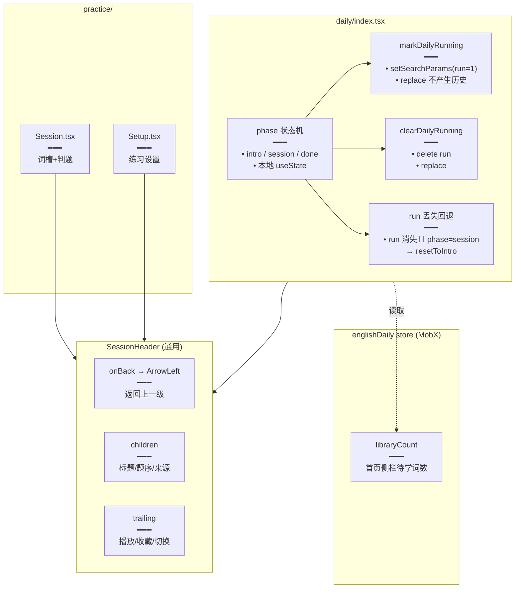

# 每日记词运行态与练习 UI 重构

> 每日记词进入练习后通过 `?run=1` 标记运行态（刷新 / 分享链接可回到练习中），完成或退出即清除；练习页顶部统一抽为 `SessionHeader`（返回按钮 + 中间内容 + 右侧操作三槽），替代散落的 `SessionStageHeader`，并对词槽间距、元数据标签、揭示态布局做视觉统一。

## 延伸阅读

- [经典句看中写词槽练习.md](./经典句看中写词槽练习.md)：词槽练习 UI 与 `SessionStageHeader` 删除
- [每日记词实现.md](./每日记词实现.md)：每日记词基础流程

---

## 1. 背景与目标

本轮对每日记词与练习做了三处结构性调整：

1. **每日记词运行态**：进入练习时 URL 写入 `?run=1`，完成或退出时清除；刷新页面若仍带 `run=1` 则保持在练习态，否则回到介绍态。
2. **会话顶栏统一**：练习内顶部抽为 `SessionHeader`（返回按钮 + 中间内容 + 右侧操作区三槽），替代散落的 `SessionStageHeader`。
3. **练习 UI 打磨**：词槽间距、元数据标签、揭示态布局等视觉统一。

## 2. 改动范围

**前端新增**

- `apps/frontend/src/store/englishDaily.ts`（MobX store：首页侧栏「今日记词」待学词数）
- `apps/frontend/src/views/englishLearning/components/SessionHeader.tsx`（会话顶栏：返回 + 中间内容 + 右侧操作）

**前端改动**

- `apps/frontend/src/views/englishLearning/daily/index.tsx`（`?run=1` 运行态标记、phase 状态机）
- `apps/frontend/src/views/englishLearning/daily/components/DailyCardSession.tsx`（接入 SessionHeader）
- `apps/frontend/src/views/englishLearning/daily/components/DailyIntroPanel.tsx`（接入 SessionHeader）
- `apps/frontend/src/views/englishLearning/daily/components/DailyDonePanel.tsx`（接入 SessionHeader）
- `apps/frontend/src/views/englishLearning/practice/Session.tsx`（接入 SessionHeader，删除 SessionStageHeader）
- `apps/frontend/src/views/englishLearning/practice/Setup.tsx`（接入 SessionHeader）
- `apps/frontend/src/components/design/Header/index.tsx`（练习 / 每日运行态面包屑动态拼接）
- `apps/frontend/src/router/routes.ts`（daily 路由）

---

## 3. 实现思路

### 3.1 每日记词运行态

```text
/english-learning/daily              → 介绍态（intro）：点「开始记词」加载卡片
/english-learning/daily?run=1        → 练习态（session）：正在答题
完成 / 退出 → 清除 run → 完成态（done）/ 介绍态
```

- `phase` 为组件本地 state：`'intro' | 'session' | 'done'`，不进 store。
- 开始练习时 `markDailyRunning` 把 `?run=1` 写入 URL（replace），同时 `setPhase('session')`。
- 完成时 `clearDailyRunning` 删掉 `run`，`setPhase('done')`。
- 副作用：若 `run` 被外部清除（如手动改 URL）且当前在 session，自动 `resetToIntro`，避免 URL 与状态脱节；`skipRunResetRef` 防止 `markDailyRunning` 自身触发该回退。
- `?run=1` 只是「正在练习」的标记，不携带会话数据；练习数据（cards、进度）在组件内，刷新会重新加载。

### 3.2 SessionHeader

```text
┌───────────────────────────────────────────────────────┐
│ ←  [中间内容：标题 / 题序 / 来源]    [右侧操作：播放/收藏/…] │
└───────────────────────────────────────────────────────┘
```

- **左槽**：`onBack` 时渲染 `ArrowLeft` 图标按钮，否则空。
- **中槽**：`children`，调用方自由放标题、题序、来源名等。
- **右槽**：`trailing`，调用方放播放、收藏、切换词性/音标等操作按钮；自动 `ml-auto` 靠右。
- 三槽分离使「返回 / 内容 / 操作」解耦，不同练习页复用同一组件而不强加面包屑结构。

### 3.3 架构图



---

## 4. 关键代码对比与注释

### 4.1 `daily/index.tsx` 运行态标记（改动）

**改动前**（基线）· 无运行态标记，直接渲染列表

```tsx
// 基线：无 phase 状态机，无 URL run 标记
export default function DailyPage() {
	return <DailyList />;
}
```

**改动后**（当前）· `apps/frontend/src/views/englishLearning/daily/index.tsx`（约 L14–L119）

```tsx
// 引入 URL 搜索参数与导航
import { useNavigate, useSearchParams } from 'react-router';
// 引入每日记词各阶段面板
import { DailyCardSession } from './components/DailyCardSession';
import { DailyDonePanel } from './components/DailyDonePanel';
import { DailyIntroPanel } from './components/DailyIntroPanel';
import { DailyPageLayout } from './components/DailyPageLayout';

// 页面阶段：介绍 / 练习 / 完成
type PagePhase = 'intro' | 'session' | 'done';

export default function EnglishLearningDailyPage() {
	// 路由导航
	const navigate = useNavigate();
	// URL 搜索参数
	const [searchParams, setSearchParams] = useSearchParams();
	// 当前阶段，默认介绍态
	const [phase, setPhase] = useState<PagePhase>('intro');
	// 开始加载中
	const [starting, setStarting] = useState(false);
	// 本轮记词卡片
	const [cards, setCards] = useState<DailyVocabCard[]>([]);
	// 防止 markDailyRunning 自身触发 run 丢失回退
	const skipRunResetRef = useRef(false);

	// 返回英语学习首页
	const backHome = useCallback(() => {
		navigate('/english-learning');
	}, [navigate]);

	// 进入练习态：把 run=1 写入 URL（replace，不产生历史记录）
	const markDailyRunning = useCallback(() => {
		skipRunResetRef.current = true;
		setSearchParams(
			(prev) => {
				const next = new URLSearchParams(prev);
				next.set('run', '1');
				return next;
			},
			{ replace: true },
		);
	}, [setSearchParams]);

	// 退出练习态：删除 run 参数
	const clearDailyRunning = useCallback(() => {
		setSearchParams(
			(prev) => {
				if (!prev.has('run')) return prev;
				const next = new URLSearchParams(prev);
				next.delete('run');
				return next;
			},
			{ replace: true },
		);
	}, [setSearchParams]);

	// 回到介绍态
	const resetToIntro = useCallback(() => {
		setPhase('intro');
		setCards([]);
	}, []);

	// 点「开始记词」：加载卡片 → 写 run → 进 session
	const onStart = useCallback(async () => {
		setStarting(true);
		try {
			const loaded = await loadDailyCards();
			if (loaded.length === 0) {
				setCards([]);
				clearDailyRunning();
				setPhase('done');
				return;
			}
			setCards(loaded);
			markDailyRunning();
			setPhase('session');
		} finally {
			setStarting(false);
		}
	}, [clearDailyRunning, markDailyRunning]);

	// 完成：清 run → done
	const onComplete = useCallback(() => {
		clearDailyRunning();
		setPhase('done');
	}, [clearDailyRunning]);

	// run 被外部清除且当前在 session → 回退到 intro（防 URL 与状态脱节）
	useEffect(() => {
		if (searchParams.get('run') === '1') {
			skipRunResetRef.current = false;
			return;
		}
		if (skipRunResetRef.current || phase !== 'session') return;
		resetToIntro();
	}, [phase, resetToIntro, searchParams]);

	// 按 phase 渲染对应面板
	return (
		<DailyPageLayout title={title} onBack={backHome} backLabel={backLabel}>
			{phase === 'intro' ? (
				<DailyIntroPanel onBack={backHome} starting={starting} onStart={() => void onStart()} />
			) : null}
			{phase === 'session' && cards.length > 0 ? (
				<DailyCardSession cards={cards} onComplete={onComplete} />
			) : null}
			{phase === 'done' ? (
				<DailyDonePanel title={title} onBackHome={backHome} />
			) : null}
		</DailyPageLayout>
	);
}
```

**变更摘要**：新增 `phase` 状态机与 `?run=1` URL 标记；开始 / 完成时双向同步 URL 与 phase；run 丢失时自动回退，避免刷新后状态错乱。

### 4.2 `englishDaily` store（新增）

**改动后**（新增）· `apps/frontend/src/store/englishDaily.ts`（约 L1–L24）

```typescript
// MobX 自动可观察
import { makeAutoObservable } from 'mobx';

// 今日记词 store：仅管理首页侧栏「今日记词」待学词数
class EnglishDailyStore {
	// 构造时启用自动可观察
	constructor() {
		makeAutoObservable(this);
	}

	// null 表示尚未加载过
	libraryCount: number | null = null;
	// 加载中标记
	libraryCountLoading = false;

	// 侧栏开始加载时置 loading
	beginLibraryCount() {
		this.libraryCountLoading = true;
	}

	// 加载完成写入词数
	setLibraryCount(n: number) {
		this.libraryCount = n;
		this.libraryCountLoading = false;
	}
}

// 单例导出
export default new EnglishDailyStore();
```

**说明**：该 store 只管侧栏词数，**不**管运行态；运行态由 `daily/index.tsx` 的 `phase` + URL `run` 管理。

### 4.3 `SessionHeader.tsx`（纯新增）

**改动后**（新增）· `apps/frontend/src/views/englishLearning/components/SessionHeader.tsx`（约 L1–L77）

```tsx
// 引入按钮与返回图标
import { Button } from '@ui/index';
import { ArrowLeft } from 'lucide-react';
// 引入 class 合并工具
import { cn } from '@/lib/utils';

// 组件 props：返回 / 中间内容 / 右侧操作三槽
export type SessionHeaderProps = {
	// 返回按钮回调
	onBack?: () => void;
	// 返回按钮 aria 标签
	backLabel?: string;
	// 中间主内容（标题、进度、来源等）
	children?: ReactNode;
	// 右侧操作区；有内容时自动靠右
	trailing?: ReactNode;
	// 外层额外 class
	className?: string;
	// 中间区额外 class
	contentClassName?: string;
	// 右侧区额外 class
	trailingClassName?: string;
} & Omit<HTMLAttributes<HTMLElement>, 'children' | 'title'>;

export function SessionHeader({
	onBack,
	backLabel,
	children,
	trailing,
	className,
	contentClassName,
	trailingClassName,
	...rest
}: SessionHeaderProps) {
	return (
		// 顶栏容器：底部分隔线，固定高度，默认左右内边距 px-2
		<header
			className={cn(
				'border-theme/10 flex h-12 shrink-0 items-center gap-2 border-b px-2',
				className,
			)}
			{...rest}
		>
			{/* 左槽：有 onBack 才渲染返回按钮 */}
			{onBack ? (
				<Button
					type="button"
					variant="ghost"
					size="icon-sm"
					tabIndex={-1}
					className="text-textcolor/80 shrink-0"
					onClick={onBack}
					aria-label={backLabel}
				>
					<ArrowLeft className="size-4" />
				</Button>
			) : null}
			{/* 中槽：调用方自由放标题 / 题序 / 来源 */}
			{children != null ? (
				<div
					className={cn(
						'text-textcolor flex min-w-0 items-center gap-2 text-base whitespace-nowrap',
						contentClassName,
					)}
				>
					{children}
				</div>
			) : null}
			{/* 右槽：操作按钮，ml-auto 靠右 */}
			{trailing != null ? (
				<div
					className={cn(
						'ml-auto flex shrink-0 items-center gap-1.5',
						trailingClassName,
					)}
				>
					{trailing}
				</div>
			) : null}
		</header>
	);
}
```

**变更摘要**：`SessionHeader` 是三槽布局（返回 / 内容 / 操作），不内置面包屑或题序，由调用方通过 `children` 与 `trailing` 自由组合，保证每日记词、经典句练习、错题练习等复用同一顶栏。

### 4.4 `Session.tsx` 接入 SessionHeader（改动，摘录）

**改动前**（基线）· 顶部使用 `SessionStageHeader` 硬编码结构

**改动后**（当前）· `apps/frontend/src/views/englishLearning/practice/Session.tsx`（约 L357–L469，摘录）

```tsx
// 引入统一顶栏
import { SessionHeader } from '../components/SessionHeader';

// 练习会话渲染顶栏
<SessionHeader
	// 自定义左右内边距
	className="pl-3.5 pr-1.5"
	// 右槽：对错状态 + 标注状态 + 播放 + 切换词性/音标 + 收藏 + 额外操作
	trailing={
		<>
			{/* 答对 / 答错状态标签 */}
			{phase === 'correct_reveal' ? (
				<span className="pr-1.5 text-sm font-medium whitespace-nowrap text-emerald-500">
					{t('englishLearning.practice.correct')}
				</span>
			) : phase === 'soft_wrong' || phase === 'revealed' ? (
				<span className="text-destructive pr-1.5 text-sm font-medium whitespace-nowrap">
					{t('englishLearning.practice.incorrect')}
				</span>
			) : null}
			{/* 标注加载 / 失败提示 */}
			{metaLoading ? (
				<span className="text-textcolor/40 pr-1.5 text-xs whitespace-nowrap">标注中…</span>
			) : metaError ? (
				<span className="text-rose-500/90 pr-1.5 text-xs whitespace-nowrap">标注失败</span>
			) : null}
			{/* 播放按钮 */}
			<Tooltip side="top" content={playLabel}>
				<Button ... onClick={onSlotBoardPlay}>
					{playing ? <Square ... /> : <Volume2 ... />}
				</Button>
			</Tooltip>
			{/* 切换词性 / 音标显示 */}
			{canToggleSlotMeta ? (
				<>
					<Tooltip ...><Button ... onClick={() => setShowPos((v) => !v)}><Tags /></Button></Tooltip>
					<Tooltip ...><Button ... onClick={() => setShowIpa((v) => !v)}><AudioLines /></Button></Tooltip>
				</>
			) : null}
			{/* 收藏按钮 */}
			<FavoriteToggleButton {...practiceFavoriteToggleProps(item)} className={STAGE_ICON_BTN} tabIndex={-1} />
			{/* 额外操作 */}
			{headerExtra}
		</>
	}
>
	{/* 中槽：来源标题 + 题序 */}
	<span className="truncate">
		{sourceTitle?.trim() || t('englishLearning.practice.sourceResolving')}
	</span>
	{progressLabel ? (
		<span className="shrink-0 tabular-nums">{progressLabel}</span>
	) : null}
</SessionHeader>
```

**变更摘要**：`Session.tsx` 顶部从 `SessionStageHeader` 替换为 `SessionHeader`，通过 `children` 放来源标题与题序，`trailing` 放播放 / 切换 / 收藏等操作，结构统一且灵活。

### 4.5 Header 面包屑动态拼接（改动，摘录）

**改动后**（当前）· `apps/frontend/src/components/design/Header/index.tsx`（约 L172–L226，摘录）

```tsx
// 练习页：根据 run / mode / contentKind 动态拼接面包屑末两级
if (
	location.pathname === '/english-learning/practice' &&
	trail.length > 0
) {
	// 取 URL 参数
	const params = new URLSearchParams(location.search);
	const kind = params.get('contentKind');
	// 设置页标题（经典句 / 单词）
	const setupLabel =
		kind === 'classic'
			? t('englishLearning.practice.classicSetupTitle')
			: t('englishLearning.practice.setupTitle');
	// 设置页路径去掉 run 参数
	const setupParams = new URLSearchParams(params);
	setupParams.delete('run');
	const setupQuery = setupParams.toString();
	const setupPath = setupQuery
		? `${location.pathname}?${setupQuery}`
		: location.pathname;

	if (params.get('run') === '1') {
		// 运行态：末级替换为设置页，追加模式（听写/拼写）
		const mode = params.get('mode') === 'spelling' ? 'spelling' : 'dictation';
		const modeLabel =
			mode === 'dictation'
				? kind === 'classic'
					? t('englishLearning.practice.modeDictationClassic')
					: t('englishLearning.practice.modeDictationVocab')
				: kind === 'classic'
					? t('englishLearning.practice.modeSpellingClassic')
					: t('englishLearning.practice.modeSpellingVocab');
		trail[trail.length - 1] = { label: setupLabel, path: setupPath };
		trail.push({ label: modeLabel, path: `${location.pathname}${location.search}` });
	} else {
		// 设置态：末级标签替换为设置页标题
		trail[trail.length - 1] = { ...trail[trail.length - 1], label: setupLabel };
	}
}

// 每日记词运行态：末级替换为列表，追加「记词中」
if (
	location.pathname === '/english-learning/daily' &&
	trail.length > 0 &&
	new URLSearchParams(location.search).get('run') === '1'
) {
	trail[trail.length - 1] = { ...trail[trail.length - 1], path: location.pathname };
	trail.push({
		label: t('englishLearning.daily.sessionTitleLibrary'),
		path: `${location.pathname}${location.search}`,
	});
}
```

**变更摘要**：`Header` 面包屑根据练习 / 每日记词的 `run` 状态动态追加末级，运行态时显示「设置 → 听写/拼写」或「今日记词 → 记词中」，设置态时仅替换标签。

---

## 5. 兼容性与影响

- **`?run=1` 仅为标记**：不携带会话数据，刷新后卡片重新加载；不破坏无 `run` 的旧入口。
- **SessionHeader 复用**：每日记词 intro/session/done、经典句练习、练习设置等统一使用，视觉一致。
- **`englishDaily` store 职责收窄**：只管侧栏词数，运行态不进 store，避免跨页面状态泄漏。
- **删除 `SessionStageHeader`**：已在 [经典句看中写词槽练习.md](./经典句看中写词槽练习.md) §4.5 说明。

## 6. 相关源码路径

| 说明 | 路径 |
|------|------|
| 每日记词页（运行态标记） | `apps/frontend/src/views/englishLearning/daily/index.tsx` |
| 今日记词 store（侧栏词数） | `apps/frontend/src/store/englishDaily.ts` |
| 会话顶栏 | `apps/frontend/src/views/englishLearning/components/SessionHeader.tsx` |
| 练习会话 | `apps/frontend/src/views/englishLearning/practice/Session.tsx` |
| 练习设置 | `apps/frontend/src/views/englishLearning/practice/Setup.tsx` |
| 顶栏面包屑 | `apps/frontend/src/components/design/Header/index.tsx` |
| 每日记词面板 | `apps/frontend/src/views/englishLearning/daily/components/` |
| 路由 | `apps/frontend/src/router/routes.ts` |

---

（若与仓库最新源码不一致，以源码为准）
