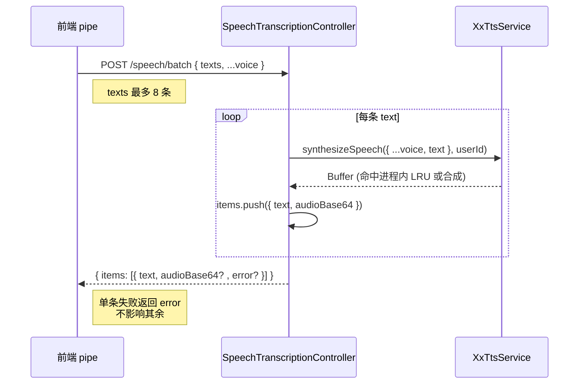

## 延伸阅读

- 练习会话与播放：[`练习会话控件.md`](./练习会话控件.md) · [`练习揭示播放连续性.md`](./练习揭示播放连续性.md)
- TTS 缓存与播放：[`英语TTS播放.md`](./英语TTS播放.md) · [`英语TTS缓存一致性.md`](./英语TTS缓存一致性.md)
- 产品使用说明：[`docs/项目指南.md`](../项目指南.md) §13.30
- 用户向更新条目：[`docs/项目更新信息.md`](../项目更新信息.md) §24

---

## 1. 背景与目标

练习页每题切换时，原逻辑只预取**当前题**的云端 TTS（`prefetchCloudTts`），后续题的音频要等到用户点播放时才现场合成。一场练习几十题，逐题等待 TTS 首包会显著拖慢节奏。

本次新增**滑动窗口批量预取管道**：

- **后端**：MiniMax / 讯飞 / Edge 各新增 `POST .../speech/batch` 端点，一次 HTTP 接收 `texts[]`，服务端逐条合成返回 `base64 MP3` 数组。
- **前端 speech.ts**：新增 `prefetchCloudTtsBatch`（多句一次 HTTP，写入 LRU）；新增练习会话级 LRU 容量抬高（默认 64 → 100），避免百题练习中预取音频被挤出。
- **前端练习页**：新增 `practiceTtsPrefetchPipe.ts`（滑动窗口：出声后 kick，预取后续 ahead=5 条）；`usePracticePlayback` 在当前句**出声后**（`onPlaybackStart`）触发 pipe.kick；练习 index 进场创建 pipe、离场 cancel + 裁回 LRU。

核心目标：**把「一题一请求」降为「一批一请求」，且错开首包带宽——当前句出声后才拉后续题，避免与当前句首包抢带宽。**

---

## 2. 改动范围

| 路径 | 说明 |
|------|------|
| `apps/backend/src/services/speech-transcription/dto/tts-batch-texts.dto.ts` | 新建：`TtsBatchTextsDto`（`texts[]` 1~8 条） |
| `apps/backend/src/services/speech-transcription/dto/edge-tts-batch.dto.ts` | 新建：`EdgeTtsBatchDto` = texts + Edge 音色参数（去 text） |
| `apps/backend/src/services/speech-transcription/dto/minimax-tts-batch.dto.ts` | 新建：`MinimaxTtsBatchDto` |
| `apps/backend/src/services/speech-transcription/dto/xfyun-tts-batch.dto.ts` | 新建：`XfyunTtsBatchDto` |
| `apps/backend/src/services/speech-transcription/speech-transcription.controller.ts` | 新增 3 个 batch 端点，共用 `TtsBatchItemResult` 类型 |
| `apps/frontend/src/service/api.ts` | 新增 3 个 batch 路径常量 |
| `apps/frontend/src/utils/speech.ts` | 新增 `prefetchCloudTtsBatch`、`beginPracticeCloudTtsCacheSession`/`endPracticeCloudTtsCacheSession`、`effectiveCloudTtsCacheMax`/`trimCloudTtsCacheToMax`；`touchCloudTtsCache` 改用动态上限 |
| `apps/frontend/src/views/englishLearning/practice/utils/practiceTtsPrefetchPipe.ts` | 新建：滑动窗口预取管道（`planPrefetchBatch` + `createPracticeTtsPrefetchPipe` + 自检） |
| `apps/frontend/src/views/englishLearning/practice/hooks/usePracticePlayback.ts` | 新增 `itemIndex` + `onPipelineKick`；进题只预取当前句；出声后 kick；拼写延迟 300ms kick |
| `apps/frontend/src/views/englishLearning/practice/index.tsx` | 进场扩容 LRU + 创建 pipe；离场 cancel + 裁回；首题预热；向 Session 传 `itemIndex`/`onTtsPipelineKick` |
| `apps/frontend/src/views/englishLearning/practice/Session.tsx` | 透传 `itemIndex` + `onTtsPipelineKick` 给 `usePracticePlayback` |
| `apps/frontend/src/views/englishLearning/practice/types.ts` | `SessionProps` 新增 `itemIndex` + `onTtsPipelineKick` |

---

## 3. 实现思路

### 3.1 关键决策

1. **出声后 kick，错开首包带宽**：`onPlaybackStart` 回调在当前句真正 `audio.play` / 本机 `speak` 成功后触发，此时再拉后续题的 TTS，避免与当前句首包 HTTP 抢带宽（听书同款机制）。
2. **滑动窗口 ahead=5，单次 batch 最多 8**：每次 kick 从 cursor+1 起取最多 5 条「未启动」题，合并为一次 batch HTTP；`TTS_PREFETCH_BATCH_MAX=8` 防止一次请求过大。已启动的题不计入名额，否则切题时窗口只剩 1 条又变回一句一请求。
3. **后端逐条合成，前端一次 HTTP**：服务端仍按句调 TTS 服务（命中进程内 LRU），但浏览器只打 1 次接口 / 批，减少 HTTP 握手与排队开销。
4. **练习会话 LRU 抬高到 100**：默认 LRU=64，百题练习会把未播的预取音频挤出。新增 `beginPracticeCloudTtsCacheSession(100)` 临时抬高，离场 `endPracticeCloudTtsCacheSession()` 裁回默认。
5. **单条失败不影响整批**：后端每条独立 try/catch，失败项返回 `error` 字段；前端 `prefetchCloudTtsBatch` 跳过 error 项，其余正常入缓存。整批失败时由播放路径单条拉兜底。
6. **inflight 合并**：batch 请求 pending 期间，每条 text 的 cacheKey 都注册到 `inflightCloudTts`，播放时若命中 inflight 则等待同一批结果，避免重复请求。
7. **拼写模式延迟 300ms kick**：拼写无自动播，进题后短暂延迟再 kick，避免与当前句首包抢带宽。

### 3.2 预取管道数据流

```mermaid
flowchart TD
  A[练习进场<br/>beginPracticeCloudTtsCacheSession 100<br/>createPracticeTtsPrefetchPipe] --> B[首题预热<br/>prefetchCloudTts first]
  B --> C[用户点播放<br/>playPreferred]
  C --> D{onPlaybackStart<br/>出声后}
  D -->|dictation 首轮 / 单播| E[kickPipeline itemIndex]
  D -->|spelling 进题 300ms| E
  E --> F[pipe.kick cursor]
  F --> G[planPrefetchBatch<br/>cursor+1 起取 ahead=5 未启动]
  G --> H[prefetchCloudTtsBatch texts]
  H --> I[POST .../speech/batch]
  I --> J[服务端逐条合成<br/>返回 base64 MP3[]]
  J --> K[写入 LRU<br/>touchCloudTtsCache]
  K --> L[下一题播放命中缓存<br/>零等待]
```

### 3.3 后端 batch 端点时序



---

## 4. 关键代码对比与注释

### 4.1 后端：批量 DTO（新增）

**改动后** · `apps/backend/src/services/speech-transcription/dto/tts-batch-texts.dto.ts`（当前，全文）

```typescript
// 引入校验装饰器：数组长度、字符串、单条最大长度
import {
	ArrayMaxSize,
	ArrayMinSize,
	IsArray,
	IsString,
	MaxLength,
} from 'class-validator';

// 练习预取单次 HTTP 最多条数，与前端滑动窗口 ahead 对齐（ahead=5，硬顶 8）
export const TTS_PREFETCH_BATCH_MAX = 8;

// 批量合成共用 texts 字段，被各厂商 BatchDto 复用
export class TtsBatchTextsDto {
	// texts 必须是数组，至少 1 条，最多 8 条
	@IsArray()
	@ArrayMinSize(1)
	@ArrayMaxSize(TTS_PREFETCH_BATCH_MAX)
	// 每个元素必须是字符串
	@IsString({ each: true })
	// 单条文本最长 10000 字符，防止超长句撑爆厂商字节上限
	@MaxLength(10_000, { each: true })
	texts!: string[];
}
```

**改动后** · `apps/backend/src/services/speech-transcription/dto/edge-tts-batch.dto.ts`（当前，全文）

```typescript
// 用 IntersectionType 合并 texts 与厂商音色参数；OmitType 去掉单条 DTO 的 text 字段（批量用 texts）
import { IntersectionType, OmitType } from '@nestjs/mapped-types';
import { EdgeTtsDto } from './edge-tts.dto';
import { TtsBatchTextsDto } from './tts-batch-texts.dto';

// Edge 批量合成 DTO = texts[] + Edge 单条音色参数（去掉 text，避免与 texts 冲突）
export class EdgeTtsBatchDto extends IntersectionType(
	TtsBatchTextsDto,
	OmitType(EdgeTtsDto, ['text'] as const),
) {}
```

> `minimax-tts-batch.dto.ts` / `xfyun-tts-batch.dto.ts` 结构完全相同，仅替换基类为 `MinimaxTtsDto` / `XfyunTtsDto`。

---

### 4.2 后端：3 个 batch 端点（新增）

**改动后** · `apps/backend/src/services/speech-transcription/speech-transcription.controller.ts`（当前，L221–L317）

```typescript
// 批量合成单条结果：text + 成功时 audioBase64 / 失败时 error
type TtsBatchItemResult = {
	text: string;
	audioBase64?: string;
	error?: string;
};

// MiniMax 批量合成端点
@Post('minimax/speech/batch')
async minimaxSpeechBatch(
	@Body() body: MinimaxTtsBatchDto,
	@Req() req: AuthedRequest,
): Promise<{ items: TtsBatchItemResult[] }> {
	// 取当前用户 id，传给 TTS 服务做用户级配置/限流
	const userId = req.user?.userId;
	// 拆分 texts 与音色参数（...voice 不含 text）
	const { texts, ...voice } = body;
	const items: TtsBatchItemResult[] = [];
	// 逐条合成：单条失败不影响其余
	for (const raw of texts) {
		// 归一化：非字符串当空串
		const text = typeof raw === 'string' ? raw.trim() : '';
		if (!text) {
			// 空文本直接返回 EMPTY 错误，不调 TTS
			items.push({ text: raw ?? '', error: 'EMPTY' });
			continue;
		}
		try {
			// 调用 MiniMax 合成服务，传入音色参数 + 当前 text
			const buf = await this.minimaxTtsService.synthesizeSpeech(
				{ ...voice, text },
				userId,
			);
			// 成功：转 base64 入结果
			items.push({ text, audioBase64: buf.toString('base64') });
		} catch (err) {
			// 失败：记录错误信息，不抛异常中断整批
			items.push({
				text,
				error: err instanceof Error ? err.message : 'TTS_FAILED',
			});
		}
	}
	return { items };
}
```

> `xfyunSpeechBatch` / `edgeSpeechBatch` 实现完全相同，仅替换 `this.xfyunTtsService` / `this.edgeTtsService` 与对应 DTO。

---

### 4.3 前端 speech.ts：LRU 容量会话化 + `prefetchCloudTtsBatch`

**改动前** · `apps/frontend/src/utils/speech.ts`（基线，约 L1198–L1215）

```typescript
// 云端 TTS 缓存最大条目数，固定 64
const CLOUD_TTS_CACHE_MAX = 64;
// 规范化文本 → MP3 ArrayBuffer（LRU：重复 get 时移到末尾）
const cloudTtsAudioCache = new Map<string, ArrayBuffer>();
// 同一 cacheKey 进行中的请求合并，避免听书首包+预取打出重复 stream
const inflightCloudTts = new Map<string, Promise<CloudTtsReady>>();

// 写入缓存并维护 LRU：有则先删再 set（移到末尾），超上限删最旧
function touchCloudTtsCache(key: string, audio: ArrayBuffer): void {
	if (cloudTtsAudioCache.has(key)) {
		cloudTtsAudioCache.delete(key);
	}
	cloudTtsAudioCache.set(key, audio);
	// 超过固定上限 64 则删最旧（Map 迭代顺序 = 插入顺序）
	while (cloudTtsAudioCache.size > CLOUD_TTS_CACHE_MAX) {
		const oldest = cloudTtsAudioCache.keys().next().value;
		if (oldest === undefined) break;
		cloudTtsAudioCache.delete(oldest);
	}
}
```

**改动后** · `apps/frontend/src/utils/speech.ts`（当前，约 L1201–L1245）

```typescript
// 云端 TTS 缓存默认上限 64
const CLOUD_TTS_CACHE_MAX = 64;
// 练习场会话可临时抬高上限（百题硬顶），避免 LRU=64 挤掉未播预取
let cloudTtsCacheMaxOverride: number | null = null;
// 规范化文本 → MP3 ArrayBuffer（LRU：重复 get 时移到末尾）
const cloudTtsAudioCache = new Map<string, ArrayBuffer>();
// 同一 cacheKey 进行中的请求合并，避免听书首包+预取打出重复 stream
const inflightCloudTts = new Map<string, Promise<CloudTtsReady>>();

// 取当前生效上限：有 override 用 override，否则用默认 64
function effectiveCloudTtsCacheMax(): number {
	return cloudTtsCacheMaxOverride ?? CLOUD_TTS_CACHE_MAX;
}

// 裁剪缓存到当前生效上限：从最旧开始删
function trimCloudTtsCacheToMax(): void {
	const max = effectiveCloudTtsCacheMax();
	// 超过上限则持续删最旧（Map keys() 首项 = 最旧插入）
	while (cloudTtsAudioCache.size > max) {
		const oldest = cloudTtsAudioCache.keys().next().value;
		if (oldest === undefined) break;
		cloudTtsAudioCache.delete(oldest);
	}
}

// 写入缓存并维护 LRU：有则先删再 set（移到末尾），再统一裁剪
function touchCloudTtsCache(key: string, audio: ArrayBuffer): void {
	if (cloudTtsAudioCache.has(key)) {
		cloudTtsAudioCache.delete(key);
	}
	cloudTtsAudioCache.set(key, audio);
	// 改用动态上限裁剪（练习会话期间上限可能是 100）
	trimCloudTtsCacheToMax();
}

// 练习会话开始：抬高 LRU 上限到 maxEntries（默认 100，至少不低于 64）
export function beginPracticeCloudTtsCacheSession(maxEntries = 100): void {
	cloudTtsCacheMaxOverride = Math.max(CLOUD_TTS_CACHE_MAX, maxEntries);
}

// 练习会话结束：清掉 override 并裁回默认上限，释放内存
export function endPracticeCloudTtsCacheSession(): void {
	cloudTtsCacheMaxOverride = null;
	trimCloudTtsCacheToMax();
}
```

**变更摘要**：`touchCloudTtsCache` 从固定上限改为动态上限（`trimCloudTtsCacheToMax`）；新增 `beginPracticeCloudTtsCacheSession`/`endPracticeCloudTtsCacheSession` 让练习页临时抬高 LRU 到 100。

---

### 4.4 前端 speech.ts：`prefetchCloudTtsBatch`（新增）

**改动后** · `apps/frontend/src/utils/speech.ts`（当前，约 L1588–L1700）

```typescript
// 单次 batch 最多 8 条，与后端 TTS_PREFETCH_BATCH_MAX 对齐
const TTS_PREFETCH_BATCH_MAX = 8;

// base64 → ArrayBuffer：用于把后端返回的 base64 MP3 转回二进制写入缓存
function base64ToArrayBuffer(b64: string): ArrayBuffer {
	const bin = atob(b64);
	const bytes = new Uint8Array(bin.length);
	for (let i = 0; i < bin.length; i += 1) {
		bytes[i] = bin.charCodeAt(i);
	}
	return bytes.buffer;
}

// 练习预取：多句一次 HTTP（texts[]），写入 LRU；单条失败不影响其余
export async function prefetchCloudTtsBatch(
	rawTexts: readonly string[],
	options?: Pick<PlayPreferredOptions, 'preferLocal'>,
): Promise<void> {
	// 不走云端（本机优先）则直接跳过
	if (!shouldUseCloudTts(options)) return;
	// 确保 MiniMax 用户偏好已加载（决定走哪个厂商、音色等）
	await ensureMinimaxTtsUserPrefsLoaded();

	// 过滤出需要预取的文本：去空、去重、超单条上限跳过、已缓存跳过
	const need: string[] = [];
	const seen = new Set<string>();
	for (const raw of rawTexts) {
		// 剥离 markdown 后取纯文本
		const plain = stripMarkdownForTts(raw);
		if (!plain || seen.has(plain)) continue;
		// 超过单条字节上限（Edge/讯飞 8000 字节）跳过，避免合成失败
		if (!cloudPlainWithinSingleLimit(plain)) continue;
		seen.add(plain);
		// 已在缓存中则不再请求
		if (getCloudTtsFromCache(plain)) continue;
		need.push(plain);
	}
	// 全部已缓存或无需预取则直接返回
	if (need.length === 0) return;

	// 无 token 则抛错，让调用方兜底到单条拉
	const token = readToken();
	if (!token) throw new Error('NO_TOKEN');

	// 取平台 fetch（桌面端 Tauri / 浏览器统一封装）
	const platformFetch = await getPlatformFetch();
	// 根据当前云端播放源选对应 batch 端点
	const source = effectiveCloudPlaybackSource();
	const endpoint =
		source === 'xfyun'
			? SPEECH_XFYUN_TTS_BATCH
			: source === 'edge'
				? SPEECH_EDGE_TTS_BATCH
				: SPEECH_MINIMAX_TTS_BATCH;
	// 各厂商的额外请求体参数（音色、语速等）
	const bodyExtras =
		source === 'xfyun'
			? buildXfyunTtsRequestExtras()
			: source === 'edge'
				? buildEdgeTtsRequestExtras()
				: buildMinimaxTtsRequestExtras();

	// 按 8 条切片，逐批请求（need 可能超过 8）
	for (let offset = 0; offset < need.length; offset += TTS_PREFETCH_BATCH_MAX) {
		const chunk = need.slice(offset, offset + TTS_PREFETCH_BATCH_MAX);
		// 预计算每条的 cacheKey，用于 inflight 注册与清理
		const keys = chunk.map((p) => buildCloudTtsCacheKey(p));

		// 单批请求：成功则逐条入缓存，finally 清理 inflight
		const pending = (async (): Promise<void> => {
			try {
				// 发 batch 请求：texts + 厂商音色参数
				const res = await platformFetch(BASE_URL + endpoint, {
					method: 'POST',
					headers: {
						Authorization: `Bearer ${token}`,
						'Content-Type': 'application/json',
					},
					body: JSON.stringify({ texts: chunk, ...bodyExtras }),
				});
				if (!res.ok) {
					throw new Error(`TTS_BATCH_HTTP_${res.status}`);
				}
				const data = (await res.json()) as {
					items?: Array<{
						text?: string;
						audioBase64?: string;
						error?: string;
					}>;
				};
				// 逐条处理：有 audioBase64 且无 error 才入缓存
				for (const item of data.items ?? []) {
					const plain = (item.text ?? '').trim();
					const b64 = item.audioBase64;
					if (!plain || !b64 || item.error) continue;
					// base64 → ArrayBuffer
					const buf = base64ToArrayBuffer(b64);
					if (!buf.byteLength) continue;
					// 写入 LRU 缓存
					touchCloudTtsCache(buildCloudTtsCacheKey(plain), buf);
				}
			} finally {
				// 无论成败都清理 inflight，避免死锁
				for (const key of keys) {
					inflightCloudTts.delete(key);
				}
			}
		})();

		// 为 chunk 中每条文本注册 inflight：播放时若命中则等同一批结果
		for (let i = 0; i < chunk.length; i += 1) {
			const plain = chunk[i]!;
			const key = keys[i]!;
			inflightCloudTts.set(
				key,
				// pending 完成后从缓存取，取不到则抛错（播放路径会回退单条拉）
				pending.then((): CloudTtsReady => {
					const hit = getCloudTtsFromCache(plain);
					if (!hit) {
						throw new Error('TTS_BATCH_ITEM_MISSING');
					}
					return { kind: 'cached', blob: hit, cacheKey: key };
				}),
			);
		}

		// 等待本批完成再继续下一批（串行，避免并发过多）
		await pending;
	}
}
```

---

### 4.5 前端：`practiceTtsPrefetchPipe.ts`（新建）

**改动后** · `apps/frontend/src/views/englishLearning/practice/utils/practiceTtsPrefetchPipe.ts`（当前，全文 L1–L131）

```typescript
// 练习听写/拼写：出声后滑动窗口批量预取云端 TTS
// 每次 kick 最多拉 ahead 条「尚未预取」的题，合并为一次 HTTP
import { prefetchCloudTtsBatch } from '@/utils/speech';

// 管道选项：每次 kick 最多新预取条数
export type PracticeTtsPipeOptions = {
	ahead?: number;
};

// 管道对外接口：kick(cursor) 触发预取，cancel 停止
export type PracticeTtsPrefetchPipe = {
	kick: (cursorIndex: number) => void;
	cancel: () => void;
};

// 从 cursor 之后挑最多 ahead 条「未启动」下标
// 已启动的不计入名额（否则切题时窗口只剩 1 条，又变一句一请求）
export function planPrefetchBatch(args: {
	cursor: number;
	length: number;
	ahead: number;
	already: ReadonlySet<number>;
	skipEmpty?: (index: number) => boolean;
}): number[] {
	// ahead 至少 1
	const ahead = Math.max(1, args.ahead);
	const want: number[] = [];
	// 从 cursor+1 开始，取够 ahead 条或到末尾
	for (let i = args.cursor + 1; i < args.length && want.length < ahead; i += 1) {
		// 跳过空文本题
		if (args.skipEmpty?.(i)) continue;
		// 跳过已启动预取的题
		if (args.already.has(i)) continue;
		want.push(i);
	}
	return want;
}

// 创建管道：每次 kick 至多一次 batch HTTP（最多 ahead 句）
export function createPracticeTtsPrefetchPipe(
	texts: readonly string[],
	options?: PracticeTtsPipeOptions,
): PracticeTtsPrefetchPipe {
	// ahead 限制在 1~8，默认 5
	const ahead = Math.max(1, Math.min(8, options?.ahead ?? 5));
	// 文本预处理：trim 去空白
	const normalized = texts.map((t) => t.trim());
	let cancelled = false;
	let cursor = 0;
	// 是否正在 pump（防止并发 batch）
	let pumping = false;
	// pump 期间是否有新的 kick（有则结束后再补一轮）
	let pendingKick = false;
	// 已启动预取的下标集合
	const started = new Set<number>();

	// 核心泵：取一批未启动题，发一次 batch HTTP
	const pump = async () => {
		// 已在 pump 或已取消则跳过
		if (pumping || cancelled) return;
		pumping = true;
		try {
			do {
				pendingKick = false;
				// 规划本次 batch：从 cursor+1 取 ahead 条未启动题
				const batch = planPrefetchBatch({
					cursor,
					length: normalized.length,
					ahead,
					already: started,
					skipEmpty: (i) => !normalized[i],
				});
				// 无题可预取则退出
				if (batch.length === 0) break;
				// 标记已启动，防止重复
				for (const i of batch) started.add(i);
				// 取出对应文本，过滤空串
				const payload = batch
					.map((i) => normalized[i])
					.filter((t): t is string => Boolean(t));
				if (payload.length === 0) break;
				try {
					// 未取消则发 batch 请求
					if (!cancelled) {
						await prefetchCloudTtsBatch(payload);
					}
				} catch {
					// 整批失败：播放路径再单条拉，不中断
				}
				// kick 在 await 期间又来：用最新 cursor 再补一轮
			} while (pendingKick && !cancelled);
		} finally {
			pumping = false;
		}
	};

	return {
		// kick：更新 cursor，pumping 中则标记 pendingKick 等补轮
		kick(cursorIndex: number) {
			if (cancelled) return;
			// cursor 夹在 [0, length-1]
			cursor = Math.max(
				0,
				Math.min(cursorIndex, Math.max(0, normalized.length - 1)),
			);
			if (pumping) {
				// 正在 pump：记下有新 kick，pump 结束后会用最新 cursor 补一轮
				pendingKick = true;
				return;
			}
			// 空闲则立即 pump
			void pump();
		},
		// cancel：标记取消，后续 kick / pump 都跳过
		cancel() {
			cancelled = true;
		},
	};
}
```

---

### 4.6 前端：`usePracticePlayback` 接入 kick（出声后触发）

**改动前** · `apps/frontend/src/views/englishLearning/practice/hooks/usePracticePlayback.ts`（基线，约 L27–L60）

```typescript
// 封装练习阶段的 TTS 播放状态与播放控制逻辑，含听写模式三连播策略
export function usePracticePlayback(args: {
	mode: PracticeMode;
	answerText: string;
	t: (key: string) => string;
}) {
	const { mode, answerText, t } = args;
	const [playing, setPlaying] = useState(false);
	// 用于保证多轮异步播放时，若 runId 变化则中止后续音频
	const dictationPlayRunRef = useRef(0);
	// 当前句云端 TTS 预取；与 playPreferred(cloudSingleUtterance) 对齐
	const prefetchedCloudRef = useRef<Promise<TtsSentencePrefetch> | null>(null);

	// 进题 / 换句：提前拉云端 MP3（失败由播放时回退现场请求）
	useEffect(() => {
		const text = answerText.trim();
		if (!text) {
			prefetchedCloudRef.current = null;
			return;
		}
		prefetchedCloudRef.current = prefetchCloudTts(text, { whole: true });
	}, [answerText]);
```

**改动后** · `apps/frontend/src/views/englishLearning/practice/hooks/usePracticePlayback.ts`（当前，约 L27–L75）

```typescript
// 当前句预取 + 出声后 kick 滑动窗口管道（后续题分批预取）
export function usePracticePlayback(args: {
	mode: PracticeMode;
	answerText: string;
	// 当前题在本场 queue 中的下标，传给 pipe.kick 作为 cursor
	itemIndex: number;
	// 出声后 / 拼写延迟：通知父级 Pipe.kick(cursor)
	onPipelineKick?: (cursorIndex: number) => void;
	t: (key: string) => string;
}) {
	const { mode, answerText, itemIndex, onPipelineKick, t } = args;
	const [playing, setPlaying] = useState(false);
	const dictationPlayRunRef = useRef(0);
	// 当前句云端 TTS 预取
	const prefetchedCloudRef = useRef<Promise<TtsSentencePrefetch> | null>(null);
	// 用 ref 保存最新 itemIndex，避免回调闭包过期
	const itemIndexRef = useRef(itemIndex);
	itemIndexRef.current = itemIndex;
	// 用 ref 保存最新 onPipelineKick，避免回调闭包过期
	const onPipelineKickRef = useRef(onPipelineKick);
	onPipelineKickRef.current = onPipelineKick;

	// kick 管道：调用父级传入的 onPipelineKick，传入当前题下标
	const kickPipeline = useCallback(() => {
		onPipelineKickRef.current?.(itemIndexRef.current);
	}, []);

	// 进题 / 换句：只预取当前句；后续由 Pipe 在出声后补窗
	useEffect(() => {
		const text = answerText.trim();
		if (!text) {
			prefetchedCloudRef.current = null;
			return;
		}
		// 预取当前句整段音频
		prefetchedCloudRef.current = prefetchCloudTts(text, { whole: true });
		// 拼写无自动播：短暂延迟后再 kick，避免与当前句首包抢带宽
		if (mode !== 'dictation') {
			const timer = window.setTimeout(() => kickPipeline(), 300);
			return () => window.clearTimeout(timer);
		}
	}, [answerText, mode, kickPipeline]);
```

**改动后** · `usePracticePlayback` 播放时传 `onPlaybackStart: kickPipeline`（当前，约 L82–L130）

```typescript
	// 听写三连播：首轮吃预取 + 出声后 kick；后续轮次走 LRU
	const playDictationSequence = useCallback(
		async (runId: number) => {
			for (let i = 0; i < DICTATION_PLAY_COUNT; i += 1) {
				if (dictationPlayRunRef.current !== runId) return;
				await playPreferred(answerText, {
					cloudSingleUtterance: true,
					// 仅首轮吃预取；后续轮次走 speech 内 LRU / inflight
					prefetchedCloud: i === 0 ? prefetchedCloudRef.current : null,
					// 首轮出声后 kick 管道预取后续题
					onPlaybackStart: i === 0 ? kickPipeline : undefined,
				});
				if (dictationPlayRunRef.current !== runId) return;
				if (i < DICTATION_PLAY_COUNT - 1) {
					await sleepMs(DICTATION_PLAY_GAP_MS);
				}
			}
		},
		[answerText, kickPipeline],
	);

	// 单次播放（非三连播）：出声后 kick
	const playWord = useCallback<PlayWordFn>(
		async (options) => {
			// ...（播放可用性检查、暂停逻辑略）
			try {
				if (useDictationSequence) {
					await playDictationSequence(runId);
				} else {
					await playPreferred(answerText, {
						cloudSingleUtterance: true,
						prefetchedCloud: prefetchedCloudRef.current,
						// 出声后 kick 管道
						onPlaybackStart: kickPipeline,
					});
				}
			} catch {
				// ...（错误 Toast 略）
			}
			// ...（finally 略）
		},
		[
			answerText,
			cancelDictationPlay,
			kickPipeline,
			mode,
			playDictationSequence,
			playing,
			t,
		],
	);
```

**变更摘要**：`usePracticePlayback` 新增 `itemIndex` + `onPipelineKick` 参数；进题只预取当前句；播放时通过 `onPlaybackStart: kickPipeline` 在出声后触发管道预取后续题；拼写模式进题 300ms 后 kick。

---

### 4.7 前端：练习 index 管道生命周期

**改动后** · `apps/frontend/src/views/englishLearning/practice/index.tsx`（当前，约 L485–L525）

```typescript
	// 本场 queue 所有题的答案文本（pipe 用）
	const queueAnswerTexts = useMemo(
		() => queue.map((it) => getPracticeAnswerText(it).trim()),
		[queue],
	);

	// 管道实例 ref
	const ttsPipeRef = useRef<PracticeTtsPrefetchPipe | null>(null);

	// 进场：会话缓存扩容 + PrefetchPipe；离场 / 换 queue 取消并裁回 LRU
	useEffect(() => {
		// 非运行态或无题：取消 pipe + 裁回 LRU
		if (phase !== 'running' || queueAnswerTexts.length === 0) {
			ttsPipeRef.current?.cancel();
			ttsPipeRef.current = null;
			endPracticeCloudTtsCacheSession();
			return;
		}
		// 抬高 LRU 上限到 100，避免百题练习挤出预取音频
		beginPracticeCloudTtsCacheSession(100);
		// 取消旧 pipe（换 queue 时）
		ttsPipeRef.current?.cancel();
		// 创建新 pipe，ahead=5
		ttsPipeRef.current = createPracticeTtsPrefetchPipe(queueAnswerTexts, {
			ahead: 5,
		});
		// 离场清理
		return () => {
			ttsPipeRef.current?.cancel();
			ttsPipeRef.current = null;
			endPracticeCloudTtsCacheSession();
		};
	}, [phase, queueAnswerTexts]);

	// 出声后 kick：转发给 pipe
	const onTtsPipelineKick = useCallback((cursorIndex: number) => {
		ttsPipeRef.current?.kick(cursorIndex);
	}, []);

	// 进场即预热 TTS 偏好 + 首题音频（后续题由出声后 Pipe 分批预取）
	useEffect(() => {
		if (phase !== 'running' || !currentItem) return;
		// 预热 MiniMax 用户偏好（决定厂商/音色）
		prefetchMinimaxTtsUserPrefs();
		// 预取首题整段音频
		const first = getPracticeAnswerText(currentItem).trim();
		if (first) prefetchCloudTts(first, { whole: true });
	}, [phase, currentItem]);
```

---

## 5. 兼容性与影响

- **数据兼容**：纯新增端点与前端逻辑，无破坏性变更。
- **LRU 内存**：练习期间 LRU 临时抬高到 100 条 MP3（每条约几十 KB～几百 KB），离场裁回 64，内存可控。
- **失败兜底**：batch 整批失败或单条失败时，播放路径 `startCloudTts` 仍可单条拉取，用户无感知。
- **本机优先**：`prefetchCloudTtsBatch` 开头 `shouldUseCloudTts` 判断，本机优先时跳过批量预取，不浪费请求。
- **重复请求防护**：`inflightCloudTts` 注册每条 text 的 cacheKey，播放时命中 inflight 则等待同一批结果。

---

## 6. 建议回归

1. **批量预取触发**：练习听写模式，播放首题后，Network 面板应出现 1 次 `.../speech/batch` 请求（而非逐题请求）。
2. **后续题命中缓存**：切到第 2~6 题时，播放应零等待（命中 LRU），无新的 TTS 请求。
3. **出声后才 kick**：首题播放期间不应出现 batch 请求（`onPlaybackStart` 之前），出声后才出现。
4. **拼写延迟 kick**：拼写模式进题 300ms 后出现 batch 请求。
5. **LRU 扩容**：练习 50 题，前 5 题的预取音频不应被挤出（LRU=100）。
6. **离场裁回**：退出练习页后，LRU 应裁回 64（可通过 `cloudTtsAudioCache.size` 间接验证）。
7. **单条失败兜底**：模拟某条 batch 项返回 error，播放该题时应能单条拉取成功。
8. **跨厂商**：切换 MiniMax / 讯飞 / Edge 云端 TTS，batch 端点应正确路由。

---

## 7. 相关源码路径

| 说明 | 路径 |
|------|------|
| 后端批量 DTO | `apps/backend/src/services/speech-transcription/dto/tts-batch-texts.dto.ts` 等 4 个 |
| 后端批量端点 | `apps/backend/src/services/speech-transcription/speech-transcription.controller.ts` |
| 前端 API 常量 | `apps/frontend/src/service/api.ts` |
| 前端 TTS 工具 | `apps/frontend/src/utils/speech.ts` |
| 预取管道 | `apps/frontend/src/views/englishLearning/practice/utils/practiceTtsPrefetchPipe.ts` |
| 播放 hook | `apps/frontend/src/views/englishLearning/practice/hooks/usePracticePlayback.ts` |
| 练习页 | `apps/frontend/src/views/englishLearning/practice/index.tsx` |
| 会话组件 | `apps/frontend/src/views/englishLearning/practice/Session.tsx` |

---

若与仓库最新源码不一致，以源码为准。
