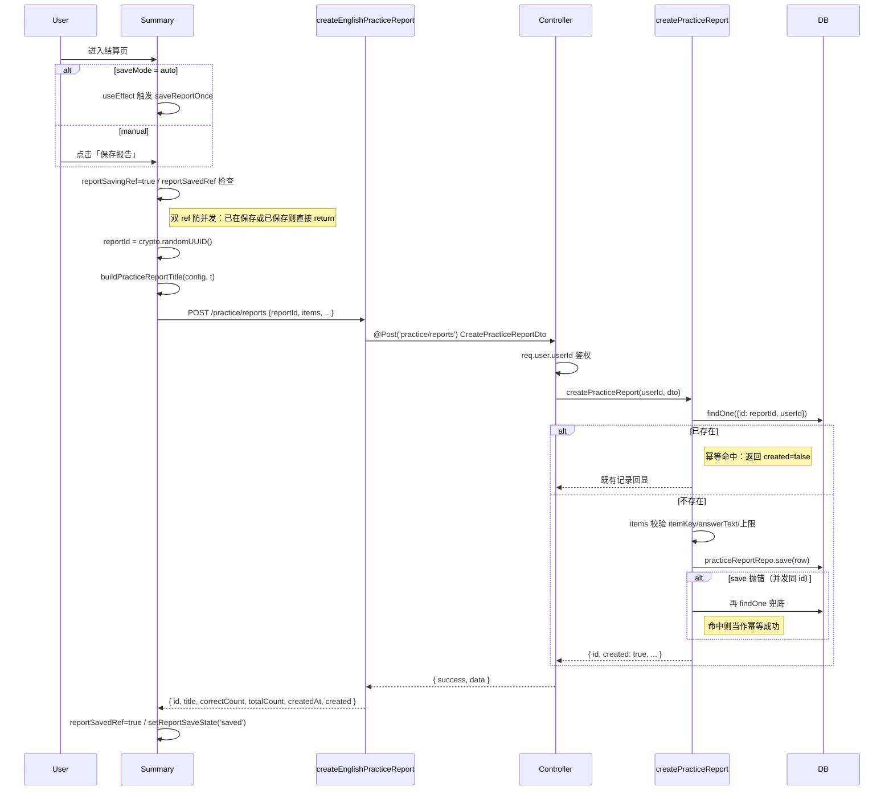

# 练习报告：创建、列表与详情（端到端实现）

## 延伸阅读

- 练习报告删除（批量 / 单条 / 详情页删除）：[`练习报告删除.md`](./练习报告删除.md)
- 练习报告多轮与续练（rounds / sourceMeta / 三态续练）：[`练习报告多轮续练.md`](./练习报告多轮续练.md)
- 结算页 UI 与作答明细：[`练习总结UI.md`](./练习总结UI.md)
- 错题集：[`单词错题与共享UI.md`](./单词错题与共享UI.md) · [`经典练习与错题.md`](./经典练习与错题.md)
- 间隔复习：[`练习复习SRS.md`](./练习复习SRS.md)
- 产品使用说明：[`docs/项目指南.md`](../项目指南.md) §13.17
- 用户向更新条目：[`docs/项目更新信息.md`](../项目更新信息.md) §24（练习报告持久化与查看）
- 域总览：[`docs/english/README.md`](./README.md)

---

## 1. 背景与目标

英语学习的听写 / 看中写练习原本只有**结算页**（`Summary.tsx`）：本轮答完即看完统计与作答明细，刷新页面就丢失。本功能在结算链路上**新增一层持久化**：

- **创建**：结算页可手动「保存报告」，或配置为「自动保存」模式；同一轮 `reportId` 幂等，多次提交不会重复写入。
- **列表**：新增 `/english-learning/practice/reports` 路由，按 `vocab` / `classic` Tab 切换分页浏览历史报告。
- **详情**：新增 `/english-learning/practice/reports/:id` 路由，复用结算页的统计与作答明细组件，回放某一场练习的对错与朗读。

实现要点：报告主键 `id` 由**客户端**生成（`crypto.randomUUID()`），后端按 `(id, userId)` 幂等插入，避免重复提交产生多条记录；报告条目以 JSON 快照存表，不依赖原始词条表，保证历史报告可长期回放。

---

## 2. 改动范围

| 路径 | 说明 |
|------|------|
| `apps/backend/src/migrations/1790011475113-english_practice_report.ts` | 新建 `english_practice_report` 表与索引 |
| `apps/backend/src/services/english-learning/entity/english-practice-report.entity.ts` | TypeORM 实体与条目快照类型 |
| `apps/backend/src/services/english-learning/dto/practice-report.dto.ts` | 创建 / 列表查询 DTO 与逐字段校验 |
| `apps/backend/src/services/english-learning/english-learning.controller.ts` | `POST /practice/reports`、`GET /practice/reports`、`GET /practice/reports/:id` |
| `apps/backend/src/services/english-learning/english-learning.service.ts` | `createPracticeReport` / `listPracticeReports` / `getPracticeReport` |
| `apps/frontend/src/service/api.ts` | `ENGLISH_LEARNING_PRACTICE_REPORTS` 常量 |
| `apps/frontend/src/service/index.ts` | `createEnglishPracticeReport` / `listEnglishPracticeReports` / `getEnglishPracticeReport` 与类型 |
| `apps/frontend/src/router/routes.ts` | 报告列表 / 详情懒加载路由 |
| `apps/frontend/src/views/englishLearning/practice/Summary.tsx` | 结算页「保存报告」入口与自动保存 |
| `apps/frontend/src/views/englishLearning/practice/components/summary/SummaryActions.tsx` | 底栏「保存报告」「查看报告」按钮 |
| `apps/frontend/src/views/englishLearning/practice/utils/reportTitle.ts` | 报告标题构造 |
| `apps/frontend/src/views/englishLearning/practice/utils/reportItem.ts` | 报告快照 → 展示用 `PracticeItem` 转换 |
| `apps/frontend/src/views/englishLearning/practice/reports/index.tsx` | 报告列表页 |
| `apps/frontend/src/views/englishLearning/practice/reports/Detail.tsx` | 报告详情页 |
| `apps/frontend/src/i18n/locales/zh-CN.ts` / `en-US.ts` | 报告相关文案键 |

---

## 3. 实现思路

### 3.1 关键决策

1. **客户端生成主键**：`reportId` 由前端 `crypto.randomUUID()` 生成，随 `POST` 一起提交。后端以 `(id, userId)` 唯一约束做幂等：同一 `reportId` 第二次提交返回 `created: false` 并回显已存记录，避免重复落库。
2. **条目 JSON 快照**：报告 items 存为 `json` 列，包含 `itemKey / contentKind / userInput / correct / answerText / translationZh / ipa? / pos?`。**不**外联词条表，确保原词条后续修改或删除不影响历史报告回放。
3. **手动 / 自动两种保存模式**：`saveMode` 取 `manual` 或 `auto`。`auto` 模式在结算页挂载时即触发一次保存；`manual` 由用户点「保存报告」按钮触发。两种模式共用 `savePracticeReportOnce`，受 `reportSavedRef` / `reportSavingRef` 双 ref 保护，避免并发重复提交。
4. **复用结算页组件**：详情页直接复用 `SummaryStatsPanel` + `WrongListItem` + `playPreferred`，与结算页视觉一致；仅数据源从「本轮 `results`」改为「报告 items 快照」。
5. **列表分页与 Tab**：列表页每页 20 条，按 `createdAt DESC` 排序；`vocab` / `classic` Tab 通过 URL `?kind=` 切换，与错题集页对齐。
6. **报告标题规则**：`{种类}{模式} · {来源名}[ · 重练错题]`，由 `buildPracticeReportTitle` 构造，便于在列表中识别报告来源。
7. **并发兜底**：`createPracticeReport` 在 `save` 抛错时再读一次当作幂等成功，防御前端在弱网下重复点按钮导致的并发同 id 写入。
8. **不留路径于产品稿**：本专题为开发实现稿；用户向文案（`项目更新信息.md` / `项目指南.md`）只描述能力，不暴露接口路径或表名。

### 3.2 端到端架构

```mermaid
flowchart LR
  subgraph FE[前端]
    Summary["Summary.tsx<br/>━━━<br/>• results → items 快照<br/>• reportId = randomUUID<br/>• saveMode: manual / auto<br/>• saveReportOnce 幂等保护"]
    List["reports/index.tsx<br/>━━━<br/>• ?kind=vocab/classic<br/>• 分页 20 / 加载更多<br/>• 跳详情 ?kind&title"]
    Detail["reports/Detail.tsx<br/>━━━<br/>• GET /:id<br/>• items → wrong/correct<br/>• 复用 SummaryStatsPanel"]
  end

  subgraph SVC[后端 Service]
    Create["createPracticeReport<br/>━━━<br/>• (id,userId) 幂等<br/>• items 校验<br/>• save 抛错再读兜底"]
    ListSvc["listPracticeReports<br/>━━━<br/>• findAndCount<br/>• select 抬头列<br/>• createdAt DESC"]
    GetSvc["getPracticeReport<br/>━━━<br/>• findOne by id+userId<br/>• 返回含 items"]
  end

  subgraph DB[(MySQL)]
    T[("english_practice_report<br/>━━━<br/>• id PK (client)<br/>• user_id<br/>• content_kind / mode / order<br/>• correct_count / total_count<br/>• items JSON 快照<br/>• save_mode<br/>• IDX_user_created<br/>• IDX_user_kind_created")]
  end

  Summary -- "POST /practice/reports<br/>reportId + items" --> Create
  List -- "GET /practice/reports?kind&limit&offset" --> ListSvc
  Detail -- "GET /practice/reports/:id" --> GetSvc
  Create --> T
  ListSvc --> T
  GetSvc --> T
  Create -- "{ id, created }" --> Summary
  ListSvc -- "{ totalCount, items[] }" --> List
  GetSvc -- "含 items[] 报告" --> Detail
```

### 3.3 创建报告时序



---

## 4. 关键代码与注释

> 本章为**纯新增功能**，无「改动前」基线；按 [`code-before-after.md`](../references/code-before-after.md) §4 例外，仅贴当前源码并逐行注释。代码块内**每一行非空、非纯花括号**的源码正上方均有中文注释，说明「做什么 + 为什么」。

### 4.1 数据库迁移：`english_practice_report` 表

**来源**：`apps/backend/src/migrations/1790011475113-english_practice_report.ts`（约 L1–L16）

```ts
// 引入 TypeORM 迁移接口，提供 up/down 生命周期钩子
import { MigrationInterface, QueryRunner } from "typeorm";

// 迁移类名包含时间戳前缀，TypeORM 按其排序决定执行顺序
export class EnglishPracticeReport1790011475113 implements MigrationInterface {
  // name 字段供 TypeORM 日志与回滚命令识别该迁移
  name = 'EnglishPracticeReport1790011475113'

  // up：建表 + 两个索引；用原生 SQL 以精确控制列定义与索引名
  public async up(queryRunner: QueryRunner): Promise<void> {
    // 创建 english_practice_report 表：id 由客户端提供（uuid 字符串），user_id 关联用户
    // content_kind 区分 vocab/classic；mode 区分 dictation/spelling；order 区分 random/sequential
    // correct_count/total_count 用于列表展示正确率；items 为 JSON 快照列
    // is_retry_wrong 标记是否为重练错题轮；save_mode 区分 manual/auto
    // 两个索引分别支持「按用户+创建时间」与「按用户+种类+创建时间」分页查询
    await queryRunner.query(`CREATE TABLE \`english_practice_report\` (\`id\` varchar(255) NOT NULL, \`user_id\` int NOT NULL, \`content_kind\` varchar(16) NOT NULL, \`mode\` varchar(16) NOT NULL, \`source\` varchar(32) NOT NULL, \`order\` varchar(16) NOT NULL, \`count\` int NOT NULL, \`source_title\` varchar(200) NOT NULL DEFAULT '', \`title\` varchar(240) NOT NULL, \`correct_count\` int NOT NULL, \`total_count\` int NOT NULL, \`items\` json NOT NULL, \`is_retry_wrong\` tinyint NOT NULL DEFAULT 0, \`save_mode\` varchar(16) NOT NULL DEFAULT 'manual', \`created_at\` timestamp(6) NOT NULL DEFAULT CURRENT_TIMESTAMP(6), INDEX \`IDX_epr_user_kind_created\` (\`user_id\`, \`content_kind\`, \`created_at\`), INDEX \`IDX_epr_user_created\` (\`user_id\`, \`created_at\`), PRIMARY KEY (\`id\`)) ENGINE=InnoDB`);
  }

  // down：先删索引再删表，回滚时保持与 up 完全对称
  public async down(queryRunner: QueryRunner): Promise<void> {
    // 先删索引：MySQL 要求删索引时指定表名，避免残留索引元数据
    await queryRunner.query(`DROP INDEX \`IDX_epr_user_created\` ON \`english_practice_report\``);
    // 再删种类筛选索引，顺序与 up 建表顺序无关但保持稳定
    await queryRunner.query(`DROP INDEX \`IDX_epr_user_kind_created\` ON \`english_practice_report\``);
    // 最后删整张表，回滚后该功能在数据库层完全消失
    await queryRunner.query(`DROP TABLE \`english_practice_report\``);
  }

}
```

**变更摘要**：新增 `english_practice_report` 表与两个查询索引，作为练习报告持久化底层。

### 4.2 后端实体：`EnglishPracticeReport`

**来源**：`apps/backend/src/services/english-learning/entity/english-practice-report.entity.ts`（约 L1–L69）

```ts
// 引入 TypeORM 列装饰器，用于声明实体字段与数据库列的映射
import {
	Column,
	CreateDateColumn,
	Entity,
	Index,
	PrimaryColumn,
} from 'typeorm';

// 报告条目快照类型：与前端 EnglishPracticeReportItem 对齐，存入 items JSON 列
// ipa/pos 可选，仅在单词报告时携带，便于详情页直接展示音标与词性
export type PracticeReportItemSnapshot = {
  // 题目唯一 key，用于详情页列表渲染 key 与去重
	itemKey: string;
  // 内容种类：vocab=单词 / classic=经典句，决定详情页渲染分支
	contentKind: 'vocab' | 'classic';
  // 用户本轮的输入文本，便于复盘错拼
	userInput: string;
  // 对错标记，驱动 wrong/correct 分组
	correct: boolean;
  // 标准答案文本：单词为词面、经典句为英文原句
	answerText: string;
  // 中文释义，详情页列表项展示
	translationZh: string;
  // 可选音标，单词报告携带
	ipa?: string;
  // 可选词性，单词报告携带
	pos?: string;
};

// 实体类对应 english_practice_report 表；主键 id 由客户端 reportId 提供，实现幂等
// 抬头列 + items JSON 快照设计：抬头列支持列表筛选与统计，items 快照保证历史可回放
@Entity('english_practice_report')
// 按 user_id + created_at 建索引：支持「我的报告」按时间倒序分页
@Index('IDX_epr_user_created', ['userId', 'createdAt'])
// 按 user_id + content_kind + created_at 建索引：支持列表页按 vocab/classic Tab 筛选
@Index('IDX_epr_user_kind_created', ['userId', 'contentKind', 'createdAt'])
export class EnglishPracticeReport {
  // 主键 uuid：客户端 crypto.randomUUID() 生成，避免后端自增导致重复提交重复入库
	@PrimaryColumn('uuid')
	id!: string;

  // 用户 id：与鉴权层 req.user.userId 对齐，所有查询必带
	@Column({ name: 'user_id', type: 'int' })
	userId!: number;

  // 内容种类：列表 Tab 切换依据
	@Column({ name: 'content_kind', type: 'varchar', length: 16 })
	contentKind!: 'vocab' | 'classic';

  // 模式：听写 / 拼写，仅展示用，不影响回放逻辑
	@Column({ type: 'varchar', length: 16 })
	mode!: 'dictation' | 'spelling';

  // 来源标识：如 favorites / library / pack / review，便于后续按来源统计
	@Column({ type: 'varchar', length: 32 })
	source!: string;

  // 顺序：random / sequential，仅展示用
	@Column({ type: 'varchar', length: 16 })
	order!: 'random' | 'sequential';

  // 本轮题量：与 totalCount 可能不同（如重练错题轮 count 为错题数）
	@Column({ type: 'int' })
	count!: number;

  // 来源标题：如词库名 / 词包名，详情页与列表卡展示
	@Column({ name: 'source_title', type: 'varchar', length: 200, default: '' })
	sourceTitle!: string;

  // 报告标题：buildPracticeReportTitle 构造，列表卡主标题
	@Column({ type: 'varchar', length: 240 })
	title!: string;

  // 正确数：列表展示正确率分子
	@Column({ name: 'correct_count', type: 'int' })
	correctCount!: number;

  // 总数：列表展示正确率分母
	@Column({ name: 'total_count', type: 'int' })
	totalCount!: number;

  // 条目快照 JSON：详情页渲染数据源，不外联词条表
	@Column({ type: 'json' })
	items!: PracticeReportItemSnapshot[];

  // 是否为重练错题轮：列表卡可标记，标题追加「重练错题」后缀
	@Column({ name: 'is_retry_wrong', type: 'boolean', default: false })
	isRetryWrong!: boolean;

  // 保存模式：manual / auto，仅记录，不影响后续查询
	@Column({ name: 'save_mode', type: 'varchar', length: 16, default: 'manual' })
	saveMode!: 'manual' | 'auto';

  // 创建时间：列表按其 DESC 排序，TypeORM 自动填充
	@CreateDateColumn({ name: 'created_at', type: 'timestamp' })
	createdAt!: Date;
}
```

**变更摘要**：声明报告实体、条目快照类型与两个查询索引，与迁移 SQL 一一对应。

### 4.3 后端 DTO：创建与列表查询

**来源**：`apps/backend/src/services/english-learning/dto/practice-report.dto.ts`（约 L1–L118）

```ts
// 引入 class-transformer 装饰器，用于把 body 中的裸字符串数组项转为强类型
import { Type } from 'class-transformer';
// 引入 class-validator 装饰器集合，对入参做范围、长度、类型校验
import {
	ArrayMaxSize,
	ArrayMinSize,
	IsArray,
	IsBoolean,
	IsIn,
	IsInt,
	IsOptional,
	IsString,
	IsUUID,
	Max,
	MaxLength,
	Min,
	ValidateNested,
} from 'class-validator';
// 引入单轮练习题量上限常量，约束 items 数组与 count 字段
import { ENGLISH_PRACTICE_SESSION_MAX } from '../constant';

// 报告条目 DTO：每个作答项的字段约束，ValidateNested each 时逐项校验
export class PracticeReportItemDto {
  // 题目 key：非空字符串，长度上限 200，用于详情页列表 key 与去重
	@IsString()
	@MaxLength(200)
	itemKey!: string;

  // 内容种类：仅允许 vocab / classic，与实体枚举对齐
	@IsIn(['vocab', 'classic'])
	contentKind!: 'vocab' | 'classic';

  // 用户输入：长度上限 12000，容纳经典句长文本
	@IsString()
	@MaxLength(12000)
	userInput!: string;

  // 对错：布尔值，驱动 correctCount 统计
	@IsBoolean()
	correct!: boolean;

  // 标准答案：长度上限 12000，经典句原句
	@IsString()
	@MaxLength(12000)
	answerText!: string;

  // 中文释义：长度上限 8000
	@IsString()
	@MaxLength(8000)
	translationZh!: string;

  // 可选音标：单词报告携带，上限 500
	@IsOptional()
	@IsString()
	@MaxLength(500)
	ipa?: string;

  // 可选词性：单词报告携带，上限 64
	@IsOptional()
	@IsString()
	@MaxLength(64)
	pos?: string;
}

// 创建报告 DTO：POST /practice/reports 的 body 约束
export class CreatePracticeReportDto {
  // 报告 id：客户端生成的 UUID v4，作为主键实现幂等
	@IsUUID('4')
	reportId!: string;

  // 内容种类：与条目 contentKind 一致，作为列表筛选维度
	@IsIn(['vocab', 'classic'])
	contentKind!: 'vocab' | 'classic';

  // 模式：听写 / 拼写
	@IsIn(['dictation', 'spelling'])
	mode!: 'dictation' | 'spelling';

  // 来源标识：上限 32，service 会再次 trim+slice 防越界
	@IsString()
	@MaxLength(32)
	source!: string;

  // 顺序：random / sequential
	@IsIn(['random', 'sequential'])
	order!: 'random' | 'sequential';

  // 题量：1 到 ENGLISH_PRACTICE_SESSION_MAX，防止恶意超大轮
	@Type(() => Number)
	@IsInt()
	@Min(1)
	@Max(ENGLISH_PRACTICE_SESSION_MAX)
	count!: number;

  // 可选来源标题：上限 200
	@IsOptional()
	@IsString()
	@MaxLength(200)
	sourceTitle?: string;

  // 报告标题：上限 240，service 兜底为「练习报告」
	@IsString()
	@MaxLength(240)
	title!: string;

  // 可选重练错题标记
	@IsOptional()
	@IsBoolean()
	isRetryWrong?: boolean;

  // 可选保存模式：仅 manual / auto，service 兜底为 manual
	@IsOptional()
	@IsIn(['manual', 'auto'])
	saveMode?: 'manual' | 'auto';

  // 条目数组：至少 1 条、至多 ENGLISH_PRACTICE_SESSION_MAX，逐项校验
	@IsArray()
	@ArrayMinSize(1)
	@ArrayMaxSize(ENGLISH_PRACTICE_SESSION_MAX)
	@ValidateNested({ each: true })
	@Type(() => PracticeReportItemDto)
	items!: PracticeReportItemDto[];
}

// 列表查询 DTO：GET /practice/reports 的 query 约束
export class PracticeReportListQueryDto {
  // 可选种类筛选：vocab / classic，不传则返回全部
	@IsOptional()
	@IsIn(['vocab', 'classic'])
	contentKind?: 'vocab' | 'classic';

  // 可选分页大小：1–100，service 再次 clamp 防越界
	@IsOptional()
	@Type(() => Number)
	@IsInt()
	@Min(1)
	@Max(100)
	limit?: number;

  // 可选偏移：>=0，用于加载更多
	@IsOptional()
	@Type(() => Number)
	@IsInt()
	@Min(0)
	offset?: number;
}
```

**变更摘要**：声明创建与列表查询的入参约束，覆盖幂等主键、题量上下限、条目逐项校验与分页范围。

### 4.4 后端控制器：三个报告接口

**来源**：`apps/backend/src/services/english-learning/english-learning.controller.ts`（约 L1560–L1611）

```ts
// 创建报告：POST /practice/reports，body 经 CreatePracticeReportDto 校验
@Post('practice/reports')
async createPracticeReport(
  // 注入鉴权后的请求对象，从中取 userId
	@Req() req: AuthedRequest,
  // 注入并校验 body，失败自动 400
	@Body() dto: CreatePracticeReportDto,
) {
  // 取用户 id：未登录直接 401，防止匿名写入
	const userId = req.user?.userId;
	if (userId == null) {
		throw new UnauthorizedException('未授权');
	}
  // 调用 service 执行幂等插入，返回抬头 + created 标记
	const data = await this.englishLearningService.createPracticeReport(
		userId,
		dto,
	);
  // 统一响应壳：success + data
	return { success: true, data };
}

// 列表查询：GET /practice/reports，query 经 PracticeReportListQueryDto 校验
@Get('practice/reports')
async listPracticeReports(
	@Req() req: AuthedRequest,
	@Query() query: PracticeReportListQueryDto,
) {
  // 同样要求登录，未授权 401
	const userId = req.user?.userId;
	if (userId == null) {
		throw new UnauthorizedException('未授权');
	}
  // 透传筛选与分页参数给 service
	const data = await this.englishLearningService.listPracticeReports(userId, {
		contentKind: query.contentKind,
		limit: query.limit,
		offset: query.offset,
	});
	return { success: true, data };
}

// 详情查询：GET /practice/reports/:id，按客户端 reportId 回放
@Get('practice/reports/:id')
async getPracticeReport(
	@Req() req: AuthedRequest,
  // 从路由参数取 id
	@Param('id') id: string,
) {
  // 鉴权：与上面两个接口一致
	const userId = req.user?.userId;
	if (userId == null) {
		throw new UnauthorizedException('未授权');
	}
  // trim 防止首尾空格导致查不到，空串则 400
	const reportId = id?.trim();
	if (!reportId) {
		throw new BadRequestException('缺少报告 id');
	}
  // 调用 service 取单条报告，不存在则 404
	const data = await this.englishLearningService.getPracticeReport(
		userId,
		reportId,
	);
	return { success: true, data };
}
```

**变更摘要**：暴露创建、列表、详情三个 REST 接口，统一鉴权与响应壳。

### 4.5 后端服务：`createPracticeReport`

**来源**：`apps/backend/src/services/english-learning/english-learning.service.ts`（约 L6045–L6133）

```ts
// 练习报告：按 reportId 幂等插入一场
async createPracticeReport(
  // 用户 id：与鉴权层对齐
	userId: number,
  // 已校验的创建 DTO
	dto: CreatePracticeReportDto,
): Promise<{
  // 返回类型：抬头字段 + created 标记，供前端区分首次或重复
	id: string;
	title: string;
	correctCount: number;
	totalCount: number;
	createdAt: string;
	created: boolean;
}> {
  // 先查同 id 是否已存在：幂等第一道，命中即直接返回旧记录
	const existing = await this.practiceReportRepo.findOne({
		where: { id: dto.reportId, userId },
	});
	if (existing) {
    // 命中旧记录：返回 created=false，前端据此显示「已保存」
		return {
			id: existing.id,
			title: existing.title,
			correctCount: existing.correctCount,
			totalCount: existing.totalCount,
			createdAt: existing.createdAt.toISOString(),
			created: false,
		};
	}

  // 把 DTO items 映射为实体快照：trim itemKey，按需携带 ipa/pos
	const items: PracticeReportItemSnapshot[] = dto.items.map((it) => ({
		itemKey: it.itemKey.trim(),
		contentKind: it.contentKind,
		userInput: it.userInput,
		correct: it.correct,
		answerText: it.answerText,
		translationZh: it.translationZh,
    // ipa 仅在非空时写入，避免存空字符串
		...(it.ipa?.trim() ? { ipa: it.ipa.trim() } : {}),
    // pos 同理
		...(it.pos?.trim() ? { pos: it.pos.trim() } : {}),
	}));
  // 二次校验：itemKey 与 answerText 必填，缺则 400，防止脏数据入库
	if (items.some((it) => !it.itemKey || !it.answerText.trim())) {
		throw new BadRequestException('报告条目缺少 itemKey 或 answerText');
	}
  // 二次校验：条目数不得超过单轮上限，防止 DTO 校验被绕过
	if (items.length > ENGLISH_PRACTICE_SESSION_MAX) {
		throw new BadRequestException('报告条目过多');
	}

  // 在服务端重新计算 correctCount/totalCount：不信任客户端传入的统计值
	const correctCount = items.filter((it) => it.correct).length;
	const totalCount = items.length;
  // 组装实体行：source/title/sourceTitle 都做 trim+slice 兜底
	const row = this.practiceReportRepo.create({
		id: dto.reportId,
		userId,
		contentKind: dto.contentKind,
		mode: dto.mode,
		source: dto.source.trim().slice(0, 32),
		order: dto.order,
		count: dto.count,
		sourceTitle: (dto.sourceTitle ?? '').trim().slice(0, 200),
		title: dto.title.trim().slice(0, 240) || '练习报告',
		correctCount,
		totalCount,
		items,
		isRetryWrong: Boolean(dto.isRetryWrong),
    // saveMode 仅接受 auto，其余一律回退 manual
		saveMode: dto.saveMode === 'auto' ? 'auto' : 'manual',
	});
	try {
    // 落库：主键冲突会抛错，进入 catch 兜底
		await this.practiceReportRepo.save(row);
	} catch (e) {
    // 并发同 id：再读一次当作幂等成功，避免弱网下重复点按钮导致报错
		const raced = await this.practiceReportRepo.findOne({
			where: { id: dto.reportId, userId },
		});
		if (raced) {
			return {
				id: raced.id,
				title: raced.title,
				correctCount: raced.correctCount,
				totalCount: raced.totalCount,
				createdAt: raced.createdAt.toISOString(),
				created: false,
			};
		}
    // 真正的其它错误：抛出，交给上层异常过滤器
		throw e;
	}
  // 首次创建成功：返回 created=true，前端显示「已保存」
	return {
		id: row.id,
		title: row.title,
		correctCount: row.correctCount,
		totalCount: row.totalCount,
		createdAt: row.createdAt.toISOString(),
		created: true,
	};
}
```

**变更摘要**：实现幂等创建——先查后插、并发兜底再读、服务端重算统计值，确保重复提交不产生多条记录。

### 4.6 后端服务：`listPracticeReports`

**来源**：`apps/backend/src/services/english-learning/english-learning.service.ts`（约 L6135–L6199）

```ts
// 列表查询：按用户 + 可选种类分页，返回抬头列（不含 items）
async listPracticeReports(
	userId: number,
	opts: {
		contentKind?: 'vocab' | 'classic';
		limit?: number;
		offset?: number;
	},
): Promise<{
	totalCount: number;
	items: Array<{
    // 列表项类型：仅抬头列，items 留给详情接口返回
		id: string;
		title: string;
		contentKind: 'vocab' | 'classic';
		mode: 'dictation' | 'spelling';
		source: string;
		sourceTitle: string;
		correctCount: number;
		totalCount: number;
		isRetryWrong: boolean;
		saveMode: 'manual' | 'auto';
		createdAt: string;
	}>;
}> {
  // limit clamp 到 1–100，offset clamp 到 >=0，防越界
	const limit = Math.min(100, Math.max(1, opts.limit ?? 20));
	const offset = Math.max(0, opts.offset ?? 0);
  // 构造 where：必带 userId，可选 contentKind 筛选
	const where = {
		userId,
		...(opts.contentKind ? { contentKind: opts.contentKind } : {}),
	};
  // findAndCount 一次返回当前页与总数，便于前端「加载更多」判断
	const [rows, totalCount] = await this.practiceReportRepo.findAndCount({
		where,
    // 按创建时间倒序：最新报告在前
		order: { createdAt: 'DESC' },
		take: limit,
		skip: offset,
    // 只 select 抬头列：items 可能很大，列表不返回以省带宽
		select: [
			'id',
			'title',
			'contentKind',
			'mode',
			'source',
			'sourceTitle',
			'correctCount',
			'totalCount',
			'isRetryWrong',
			'saveMode',
			'createdAt',
		],
	});
	return {
		totalCount,
    // 行级映射：createdAt 转 ISO 字符串，便于前端直接渲染
		items: rows.map((r) => ({
			id: r.id,
			title: r.title,
			contentKind: r.contentKind,
			mode: r.mode,
			source: r.source,
			sourceTitle: r.sourceTitle,
			correctCount: r.correctCount,
			totalCount: r.totalCount,
			isRetryWrong: r.isRetryWrong,
			saveMode: r.saveMode,
			createdAt: r.createdAt.toISOString(),
		})),
	};
}
```

**变更摘要**：分页查询报告抬头列，按时间倒序，列表接口不返回 items 以省带宽。

### 4.7 后端服务：`getPracticeReport`

**来源**：`apps/backend/src/services/english-learning/english-learning.service.ts`（约 L6201–L6241）

```ts
// 详情查询：按 id + userId 取单条完整报告（含 items 快照）
async getPracticeReport(
	userId: number,
	id: string,
): Promise<{
  // 返回类型：抬头 + order + count + items，供详情页回放
	id: string;
	title: string;
	contentKind: 'vocab' | 'classic';
	mode: 'dictation' | 'spelling';
	source: string;
	order: 'random' | 'sequential';
	count: number;
	sourceTitle: string;
	correctCount: number;
	totalCount: number;
	isRetryWrong: boolean;
	saveMode: 'manual' | 'auto';
	items: PracticeReportItemSnapshot[];
	createdAt: string;
}> {
  // 按 id + userId 唯一定位：用户只能看自己的报告，越权访问返回 404
	const row = await this.practiceReportRepo.findOne({
		where: { id, userId },
	});
	if (!row) {
    // 不存在或越权：统一 404，不泄露是否存在
		throw new NotFoundException('报告不存在');
	}
  // 返回完整字段：items 直接读 JSON 列，无需 join 词条表
	return {
		id: row.id,
		title: row.title,
		contentKind: row.contentKind,
		mode: row.mode,
		source: row.source,
		order: row.order,
		count: row.count,
		sourceTitle: row.sourceTitle,
		correctCount: row.correctCount,
		totalCount: row.totalCount,
		isRetryWrong: row.isRetryWrong,
		saveMode: row.saveMode,
    // items 兜底空数组，防止旧数据 null 导致前端崩溃
		items: row.items ?? [],
		createdAt: row.createdAt.toISOString(),
	};
}
```

**变更摘要**：按 id + userId 取单条完整报告，含 items 快照，越权访问返回 404。

### 4.8 前端 API 常量

**来源**：`apps/frontend/src/service/api.ts`（约 L215–L219）

```ts
// 间隔复习：今日待复习统计、拉题、结算上报
export const ENGLISH_LEARNING_PRACTICE_REVIEW =
	'/english-learning/practice/review';
// 练习报告：创建 / 列表 / 详情共用前缀，详情在其后拼 /:id
export const ENGLISH_LEARNING_PRACTICE_REPORTS =
	'/english-learning/practice/reports';
```

**变更摘要**：新增报告接口路径常量，供 service 层引用。

### 4.9 前端 service 封装：类型与三个 API

**来源**：`apps/frontend/src/service/index.ts`（约 L1890–L1975）

```ts
// 报告条目类型：与后端 PracticeReportItemSnapshot 对齐
export type EnglishPracticeReportItem = {
	itemKey: string;
	contentKind: 'vocab' | 'classic';
	userInput: string;
	correct: boolean;
	answerText: string;
	translationZh: string;
	ipa?: string;
	pos?: string;
};

// 列表项类型：列表接口返回的抬头列
export type EnglishPracticeReportListEntry = {
	id: string;
	title: string;
	contentKind: 'vocab' | 'classic';
	mode: 'dictation' | 'spelling';
	source: string;
	sourceTitle: string;
	correctCount: number;
	totalCount: number;
	isRetryWrong: boolean;
	saveMode: 'manual' | 'auto';
	createdAt: string;
};

// 详情类型：列表项 + order + count + items，对应详情接口返回
export type EnglishPracticeReportDetail = EnglishPracticeReportListEntry & {
	order: 'random' | 'sequential';
	count: number;
	items: EnglishPracticeReportItem[];
};

// 创建报告 payload：前端组装后发往后端
export type CreateEnglishPracticeReportPayload = {
	reportId: string;
	contentKind: 'vocab' | 'classic';
	mode: 'dictation' | 'spelling';
	source: string;
	order: 'random' | 'sequential';
	count: number;
	sourceTitle?: string;
	title: string;
	isRetryWrong?: boolean;
	saveMode?: 'manual' | 'auto';
	items: EnglishPracticeReportItem[];
};

// 创建报告：POST，返回 id + created 标记，供前端区分首次或重复
export const createEnglishPracticeReport = async (
	payload: CreateEnglishPracticeReportPayload,
) => {
	return await http.post<{
		id: string;
		title: string;
		correctCount: number;
		totalCount: number;
		createdAt: string;
    // created: true=首次写入 / false=幂等命中旧记录
		created: boolean;
	}>(ENGLISH_LEARNING_PRACTICE_REPORTS, payload);
};

// 列表查询：GET，支持种类筛选 + 分页 + silent（不弹错误 Toast）
export const listEnglishPracticeReports = async (options?: {
	contentKind?: 'vocab' | 'classic';
	limit?: number;
	offset?: number;
	silent?: boolean;
}) => {
	return await http.get<{
		totalCount: number;
		items: EnglishPracticeReportListEntry[];
	}>(ENGLISH_LEARNING_PRACTICE_REPORTS, {
		querys: {
      // 仅在传入时携带，避免发送空 query 参数
			...(options?.contentKind ? { contentKind: options.contentKind } : {}),
			...(options?.limit != null ? { limit: options.limit } : {}),
			...(options?.offset != null ? { offset: options.offset } : {}),
		},
		silent: options?.silent,
	});
};

// 详情查询：GET /:id，silent 默认不弹错，详情页自行 Toast 提示
export const getEnglishPracticeReport = async (
	id: string,
	options?: { silent?: boolean },
) => {
	return await http.get<EnglishPracticeReportDetail>(
    // encodeURIComponent 防止 id 中特殊字符破坏 URL
		`${ENGLISH_LEARNING_PRACTICE_REPORTS}/${encodeURIComponent(id)}`,
		{ silent: options?.silent },
	);
};
```

**变更摘要**：声明报告三类型与三个 API 封装，对齐后端返回结构。

### 4.10 前端路由：列表与详情懒加载

**来源**：`apps/frontend/src/router/routes.ts`（约 L67–L72、L307–L320）

```ts
// 报告列表页懒加载：访问 /english-learning/practice/reports 时加载
const EnglishLearningPracticeReportsPage = lazy(
	() => import('@/views/englishLearning/practice/reports'),
);
// 报告详情页懒加载：访问 /english-learning/practice/reports/:id 时加载
const EnglishLearningPracticeReportDetailPage = lazy(
	() => import('@/views/englishLearning/practice/reports/Detail'),
);
```

```ts
// 列表路由：挂在 english-learning 父路由下，标题 i18n key 复用报告标题
{
  path: 'practice/reports',
  Component: EnglishLearningPracticeReportsPage,
  meta: {
    titleKey: 'route.englishLearning.practice.reportsTitle',
  },
},
// 详情路由：:id 为报告主键，meta 标题与列表一致，详情页自行写 URL 面包屑
{
  path: 'practice/reports/:id',
  Component: EnglishLearningPracticeReportDetailPage,
  meta: {
    titleKey: 'route.englishLearning.practice.reportsTitle',
  },
},
```

**变更摘要**：注册报告列表与详情两条懒加载路由。

### 4.11 报告标题构造

**来源**：`apps/frontend/src/views/englishLearning/practice/utils/reportTitle.ts`（约 L1–L28）

```ts
// 练习报告标题：{种类}{模式} · {来源名}[ · 重练错题]
import type { PracticeSetupConfig } from '../types';

// t 为 i18n 翻译函数，类型约束为只接受 key 返回字符串
type TFn = (key: string) => string;

export function buildPracticeReportTitle(
  // 练习配置：含种类、模式、来源标题、是否重练错题
	config: PracticeSetupConfig,
	t: TFn,
): string {
  // 种类：词汇 / 语句，与列表 Tab 对齐
	const kind =
		config.contentKind === 'classic'
			? t('englishLearning.practice.reportKindClassic')
			: t('englishLearning.practice.reportKindVocab');
  // 模式：听写 / 拼写
	const mode =
		config.mode === 'dictation'
			? t('englishLearning.practice.reportModeDictation')
			: t('englishLearning.practice.reportModeSpelling');
  // 来源名：优先 sourceTitle，无则回退 i18n「练习」
	const source =
		config.sourceTitle?.trim() ||
		t('englishLearning.practice.reportSourceFallback');
  // 拼接基础标题：种类 + 模式 + 来源，便于在列表中识别
	const base = `${kind}${mode} · ${source}`;
  // 重练错题轮追加后缀，与普通轮区分
	if (config.isRetryWrong) {
		return `${base} · ${t('englishLearning.practice.reportRetrySuffix')}`;
	}
	return base;
}
```

**变更摘要**：构造报告标题，列表卡与详情页面包屑共用。

### 4.12 报告快照 → 展示项转换

**来源**：`apps/frontend/src/views/englishLearning/practice/utils/reportItem.ts`（约 L1–L30）

```ts
// 报告快照 → WrongListItem 可用的 PracticeItem（仅展示字段）
import type { EnglishPracticeReportItem } from '@/service';
import type { PracticeItem } from '../types';

export function reportItemToPracticeItem(
	it: EnglishPracticeReportItem,
): PracticeItem {
  // 经典句分支：拼装 PracticeItem 的 classic 字段
	if (it.contentKind === 'classic') {
		return {
			contentKind: 'classic',
      // key 用 itemKey，供列表渲染与播放去重
			key: it.itemKey,
      // english 用 answerText（原句），回放时朗读
			english: it.answerText,
			translationZh: it.translationZh ?? '',
      // source/noteZh 报告快照不保留，置空避免渲染空值
			source: '',
			noteZh: '',
		};
	}
  // 单词分支：拼装 PracticeItem 的 vocab 字段
	return {
		contentKind: 'vocab',
		key: it.itemKey,
    // word 用 answerText（词面），播放与显示共用
		word: it.answerText,
		ipa: it.ipa ?? '',
		pos: it.pos ?? '',
    // segmentation/example 快照不保留，置空
		segmentation: '',
		translationZh: it.translationZh ?? '',
		example: '',
	};
}
```

**变更摘要**：把报告快照转为详情页可复用的 `PracticeItem`，缺失字段置空。

### 4.13 结算页：保存报告入口与自动保存

**来源**：`apps/frontend/src/views/englishLearning/practice/Summary.tsx`（约 L8–L13、L64–L136、L356–L396）

```tsx
// 引入创建报告 API，供结算页调用
import {
	batchAddEnglishClassicQuoteMistakes,
	batchAddEnglishVocabularyMistakes,
	createEnglishPracticeReport,
	recordEnglishPracticeReviewAttempts,
} from '@/service';
// 引入报告标题构造工具
import { buildPracticeReportTitle } from './utils/reportTitle';

export function Summary({
	results,
	practicedTotal,
	config,
	continueLoading = false,
	onRetryWrong,
	onContinuePractice,
	onBackToSetup,
}: SummaryProps) {
	const { t } = useI18n();
	const navigate = useNavigate();
  // 本轮统计：从 results 实时计算，不依赖后端
	const correctCount = results.filter((r) => r.correct).length;
	const wrongCount = results.length - correctCount;
	const wrongItems = useMemo(
		() => results.filter((r) => !r.correct).map((r) => r.item),
		[results],
	);
	const correctItems = useMemo(
		() => results.filter((r) => r.correct).map((r) => r.item),
		[results],
	);
	const accuracyPct =
		results.length > 0 ? Math.round((correctCount / results.length) * 100) : 0;
	const hasWrongList = wrongItems.length > 0;
	const hasWordList = wrongItems.length > 0 || correctItems.length > 0;

	const [playingKey, setPlayingKey] = useState<string | null>(null);
	const [saveMistakesLoading, setSaveMistakesLoading] = useState(false);

  // 报告保存模式：auto / manual，来自练习配置
	const reportSaveMode = config.reportSaveMode === 'auto' ? 'auto' : 'manual';
  // 保存状态：idle / saving / saved；auto 模式初始即为 saving
	const [reportSaveState, setReportSaveState] = useState<
		'idle' | 'saving' | 'saved'
	>(() => (reportSaveMode === 'auto' ? 'saving' : 'idle'));
  // reportId ref：跨多次渲染保留同一 id，确保幂等
	const reportIdRef = useRef<string | null>(null);
  // 已保存 ref：防止重复提交
	const reportSavedRef = useRef(false);
  // 正在保存 ref：防止并发提交
	const reportSavingRef = useRef(false);

	const isReviewSession = config.source === 'review';
	const mistakesPath =
		config.contentKind === 'classic'
			? '/english-learning/mistakes?kind=classic'
			: '/english-learning/mistakes?kind=vocab';
	const reviewRecordedRef = useRef<string | null>(null);

  // 保存报告：幂等保护 + 自动 / 手动统一入口
	const savePracticeReportOnce = useCallback(async () => {
		if (
			results.length === 0 ||
      // 已保存则直接 return，避免重复请求
			reportSavedRef.current ||
      // 正在保存则直接 return，避免并发
			reportSavingRef.current
		) {
			return;
		}
		reportSavingRef.current = true;
		setReportSaveState('saving');
		try {
      // 首次保存时生成 reportId，后续重试沿用同一 id 实现幂等
			if (!reportIdRef.current) {
				reportIdRef.current = crypto.randomUUID();
			}
			const title = buildPracticeReportTitle(config, t);
			await createEnglishPracticeReport({
				reportId: reportIdRef.current,
				contentKind: config.contentKind,
				mode: config.mode,
				source: config.source,
				order: config.order,
				count: config.count,
				sourceTitle: config.sourceTitle,
				title,
				isRetryWrong: Boolean(config.isRetryWrong),
				saveMode: reportSaveMode,
        // results 映射为报告条目快照：含用户输入、对错、标准答案、释义
				items: results.map((r) => ({
					itemKey: r.item.key,
					contentKind: r.item.contentKind,
					userInput: r.userInput,
					correct: r.correct,
					answerText: getPracticeAnswerText(r.item),
					translationZh: r.item.translationZh ?? '',
          // 单词项按需携带 ipa
					...(isPracticeVocabItem(r.item) && r.item.ipa?.trim()
						? { ipa: r.item.ipa.trim() }
						: {}),
          // 单词项按需携带 pos
					...(isPracticeVocabItem(r.item) && r.item.pos?.trim()
						? { pos: r.item.pos.trim() }
						: {}),
				})),
			});
      // 标记已保存：后续不再触发
			reportSavedRef.current = true;
			setReportSaveState('saved');
		} catch {
      // 失败回退 idle：允许用户重试
			setReportSaveState('idle');
			Toast({
				type: 'warning',
				title: t('englishLearning.practice.saveReportFailed'),
			});
		} finally {
			reportSavingRef.current = false;
		}
	}, [config, reportSaveMode, results, t]);

  // 自动保存：auto 模式挂载时触发一次
	useEffect(() => {
		if (reportSaveMode !== 'auto' || results.length === 0) return;
		void savePracticeReportOnce();
	}, [reportSaveMode, results.length, savePracticeReportOnce]);
```

```tsx
// 结算页底栏：传入保存状态与回调，渲染「保存报告」「查看报告」按钮
<SummaryActions
	hasWrongItems={hasWrongList}
	continueLoading={continueLoading}
	saveMistakesLoading={saveMistakesLoading}
  // results 为空时隐藏保存按钮（无内容可保存）
	reportSaveState={results.length === 0 ? 'hidden' : reportSaveState}
	labels={{
		retryWrong: t('englishLearning.practice.retryWrong'),
		practiceAgain: t('englishLearning.practice.practiceAgain'),
		continuePractice: isReviewSession
			? t('englishLearning.practice.continueReview')
			: t('englishLearning.practice.continuePractice'),
		openMistakes:
			config.contentKind === 'classic'
				? t('englishLearning.mistakes.classicNav')
				: t('englishLearning.mistakes.vocabNav'),
		saveMistakes: t('englishLearning.practice.saveMistakes'),
		saveReport: t('englishLearning.practice.saveReport'),
		reportSaved: t('englishLearning.practice.reportSaved'),
		viewReports: t('englishLearning.practice.viewReports'),
	}}
	onRetryWrong={() =>
		onRetryWrong(
			config.order === 'random'
				? shufflePracticeItems(wrongItems)
				: wrongItems,
		)
	}
	onBackToSetup={onBackToSetup}
	onContinuePractice={onContinuePractice}
	mistakesPath={mistakesPath}
	onSaveMistakes={
		isReviewSession ? undefined : () => void handleSaveMistakes()
	}
  // 手动保存：点击按钮触发一次
	onSaveReport={() => void savePracticeReportOnce()}
  // 查看报告：跳列表页，带当前种类 Tab
	onViewReports={() =>
		navigate(
			`/english-learning/practice/reports?kind=${config.contentKind}`,
		)
	}
/>
```

**变更摘要**：结算页新增保存报告入口，支持手动与自动两种模式，双 ref 防并发重复提交。

### 4.14 结算页底栏：保存与查看按钮

**来源**：`apps/frontend/src/views/englishLearning/practice/components/summary/SummaryActions.tsx`（约 L53–L63、L135–L165）

```tsx
// 保存报告按钮配色：紫色系，与其它操作按钮区分
saveReport: cn(
	ACTION_BTN_BASE,
	'border-violet-500/35 bg-violet-500/[0.18] text-violet-600',
	'hover:border-violet-500/50 hover:bg-violet-500/20 dark:text-violet-400',
),
// 查看报告按钮配色：中性灰，弱化为主入口而非主操作
viewReports: cn(
	ACTION_BTN_BASE,
	'border-theme/20 bg-theme/10 text-textcolor/80',
	'hover:border-theme/30 hover:bg-theme/15',
),
```

```tsx
// 仅当 reportSaveState 非 hidden 且 onSaveReport 存在时显示保存按钮
{showSaveReport ? (
	<Button
		type="button"
		variant="ghost"
    // saving / saved 时禁用，防止重复点击
		disabled={reportSaveState === 'saving' || reportSaveState === 'saved'}
		className={ACTION_BTN_TONE.saveReport}
		onClick={() => void onSaveReport()}
	>
		{reportSaveState === 'saving' ? (
      // 保存中：spinner 反馈进度
			<Spinner className="size-4 shrink-0 text-violet-600" />
		) : (
      // 默认：保存图标
			<Save className="size-3.5 shrink-0" aria-hidden />
		)}
		<span className="truncate">
      // 已保存时显示「已保存」，否则显示「保存报告」
			{reportSaveState === 'saved'
				? labels.reportSaved
				: labels.saveReport}
		</span>
	</Button>
) : null}
// 查看报告按钮：跳列表页，始终可点
{onViewReports ? (
	<Button
		type="button"
		variant="ghost"
		className={ACTION_BTN_TONE.viewReports}
		onClick={onViewReports}
	>
		<Archive className="size-3.5 shrink-0" aria-hidden />
		<span className="truncate">{labels.viewReports}</span>
	</Button>
) : null}
```

**变更摘要**：底栏新增「保存报告」「查看报告」两个按钮，按保存状态切换文案与禁用态。

### 4.15 报告列表页

**来源**：`apps/frontend/src/views/englishLearning/practice/reports/index.tsx`（约 L1–L168）

```tsx
// 练习报告列表（单词 / 语句切换，对齐错题集）
import Loading from '@design/Loading';
import { Button, Toast } from '@ui/index';
import { useCallback, useEffect, useMemo, useState } from 'react';
import { useNavigate, useSearchParams } from 'react-router';
import { useI18n } from '@/hooks';
import {
	type EnglishPracticeReportListEntry,
	listEnglishPracticeReports,
} from '@/service';
import { formatDate } from '@/utils';
import {
	type MistakesKind,
	MistakesKindTabs,
} from '../../mistakes/components/MistakesKindTabs';
import { PracticePageShell } from '../components/shell';

// 每页固定 20 条，平衡首屏速度与加载更多频率
const PAGE_SIZE = 20;

// 把 URL ?kind= 解析为受控种类，缺省回退 vocab
function parseKind(raw: string | null): MistakesKind {
	return raw === 'classic' ? 'classic' : 'vocab';
}

// 生成种类切换后的 URL，用于 navigate replace
function reportsPagePath(kind: MistakesKind): string {
	return kind === 'classic'
		? '/english-learning/practice/reports?kind=classic'
		: '/english-learning/practice/reports?kind=vocab';
}

// 拼装列表卡副标题：正确率 + 总数 + 百分号 + 创建时间
function formatReportMeta(
	entry: EnglishPracticeReportListEntry,
	pctLabel: string,
): string {
  // 总数 0 时正确率回退 0，避免 NaN
	const pct =
		entry.totalCount > 0
			? Math.round((entry.correctCount / entry.totalCount) * 100)
			: 0;
	return `${entry.correctCount}/${entry.totalCount} · ${pct}${pctLabel} · ${formatDate(entry.createdAt)}`;
}

export default function PracticeReportsListPage() {
	const { t } = useI18n();
	const navigate = useNavigate();
	const [searchParams] = useSearchParams();
  // kind 来自 URL，Tab 切换时 replace URL 实现可分享状态
	const kind = useMemo(
		() => parseKind(searchParams.get('kind')),
		[searchParams],
	);

  // 列表数据与分页状态
	const [items, setItems] = useState<EnglishPracticeReportListEntry[]>([]);
	const [totalCount, setTotalCount] = useState(0);
	const [loading, setLoading] = useState(true);
	const [loadingMore, setLoadingMore] = useState(false);

  // 加载函数：offset=0 首屏，append=true 加载更多
	const load = useCallback(
		async (offset: number, append: boolean) => {
      // append 时只切换 loadingMore，不影响首屏 loading
			if (append) setLoadingMore(true);
			else setLoading(true);
			try {
				const res = await listEnglishPracticeReports({
					contentKind: kind,
					limit: PAGE_SIZE,
					offset,
          // silent：列表加载失败不弹全局错，下面统一 Toast
					silent: true,
				});
				const next = res.data?.items ?? [];
				const total = res.data?.totalCount ?? 0;
				setTotalCount(total);
        // append 时拼接，否则替换
				setItems((prev) => (append ? [...prev, ...next] : next));
			} catch {
				Toast({
					type: 'warning',
					title: t('englishLearning.practice.reportsLoadFailed'),
				});
			} finally {
				setLoading(false);
				setLoadingMore(false);
			}
		},
		[kind, t],
	);

  // kind 变化时重置并首屏加载
	useEffect(() => {
		setItems([]);
		setTotalCount(0);
		void load(0, false);
	}, [load]);

  // 切换 Tab：replace URL，触发上面 effect 重新加载
	const onSelectKind = useCallback(
		(next: MistakesKind) => {
			navigate(reportsPagePath(next), { replace: true });
		},
		[navigate],
	);

  // 标题随种类切换：单词 / 语句练习报告
	const title =
		kind === 'vocab'
			? t('englishLearning.practice.reportsVocabNav')
			: t('englishLearning.practice.reportsClassicNav');
  // 是否还有更多：当前已加载数 < 总数
	const hasMore = items.length < totalCount;

	return (
		<PracticePageShell
			title={<span className="min-w-0 truncate">{title}</span>}
			contentLayout="fill"
      // 顶栏右侧：种类 Tab，复用错题集 Tab 组件保持视觉一致
			headerRight={
				<MistakesKindTabs
					kind={kind}
					onSelectKind={onSelectKind}
					vocabLabel={t('englishLearning.practice.reportsVocabNav')}
					classicLabel={t('englishLearning.practice.reportsClassicNav')}
					ariaLabel={t('route.englishLearning.practice.reportsTitle')}
				/>
			}
		>
      // 首屏加载中且无数据：居中 Loading
			{loading && items.length === 0 ? (
				<div className="flex flex-1 items-center justify-center py-16">
					<Loading />
				</div>
			) : items.length === 0 ? (
        // 无数据：空态文案
				<p className="text-textcolor/55 py-16 text-center text-sm">
					{t('englishLearning.practice.reportsEmpty')}
				</p>
			) : (
				<div className="flex w-full flex-col gap-2">
          // 网格布局：自适应列宽，窄屏单列
					<div className="grid grid-cols-[repeat(auto-fill,minmax(min(100%,18rem),1fr))] gap-4">
						{items.map((entry) => (
							<button
								key={entry.id}
								type="button"
                // 卡片样式：hover 高亮 teal，引导点击
								className="border-theme/10 bg-theme/5 hover:border-teal-500/35 hover:bg-teal-500/10 flex min-w-0 flex-col gap-1 rounded-md border px-3.5 py-3 text-left transition-colors"
								onClick={() =>
                  // 跳详情：带 kind + title，供详情页面包屑读取
									navigate(
										`/english-learning/practice/reports/${entry.id}?kind=${kind}&title=${encodeURIComponent(entry.title)}`,
									)
								}
							>
								<span className="text-textcolor truncate text-sm font-semibold sm:text-base">
									{entry.title}
								</span>
								<span className="text-textcolor/50 text-xs tabular-nums sm:text-sm">
                  // 副标题：正确率 + 总数 + 时间
									{formatReportMeta(
										entry,
										t('englishLearning.practice.reportsPctSuffix'),
									)}
								</span>
							</button>
						))}
					</div>
					{hasMore ? (
						<Button
							type="button"
							variant="ghost"
							disabled={loadingMore}
							className="border-theme/10 text-textcolor/70 mt-2 h-10 border"
							onClick={() => void load(items.length, true)}
						>
							{loadingMore
								? t('englishLearning.practice.reportsLoadingMore')
								: t('englishLearning.practice.reportsLoadMore')}
						</Button>
					) : null}
				</div>
			)}
		</PracticePageShell>
	);
}
```

**变更摘要**：新增报告列表页，支持 Tab 切换、分页加载、空态与跳详情。

### 4.16 报告详情页

**来源**：`apps/frontend/src/views/englishLearning/practice/reports/Detail.tsx`（约 L1–L238）

```tsx
// 练习报告详情 — 复用 WrongListItem；系统 Header 面包屑展示标题
import Loading from '@design/Loading';
import { ScrollArea, Toast } from '@ui/index';
import { useCallback, useEffect, useMemo, useState } from 'react';
import { useNavigate, useParams, useSearchParams } from 'react-router';
import { useI18n } from '@/hooks';
import {
	type EnglishPracticeReportDetail,
	getEnglishPracticeReport,
} from '@/service';
import { formatDate } from '@/utils';
import {
	isPlaybackAvailable,
	playPreferred,
	stopAllPlayback,
} from '@/utils/speech';
import { PracticeCard, PracticePageShell } from '../components/shell';
import { SummaryStatsPanel, WrongListItem } from '../components/summary';
import { reportItemToPracticeItem } from '../utils/reportItem';

export default function PracticeReportDetailPage() {
	const { t } = useI18n();
	const navigate = useNavigate();
  // 从路由取 id，作为详情查询主键
	const { id } = useParams<{ id: string }>();
	const [searchParams] = useSearchParams();
  // 报告数据：null 表示未加载到或加载失败
	const [report, setReport] = useState<EnglishPracticeReportDetail | null>(
		null,
	);
	const [loading, setLoading] = useState(true);
  // 当前播放项 key：用于 WrongListItem 播放态高亮
	const [playingKey, setPlayingKey] = useState<string | null>(null);

  // 按 id 拉取报告：cancelled 标志防止组件卸载后 setState
	useEffect(() => {
		if (!id?.trim()) {
			setLoading(false);
			return;
		}
		let cancelled = false;
		void (async () => {
			setLoading(true);
			try {
				const res = await getEnglishPracticeReport(id.trim(), { silent: true });
				if (!cancelled) setReport(res.data ?? null);
			} catch {
				if (!cancelled) {
					setReport(null);
					Toast({
						type: 'warning',
						title: t('englishLearning.practice.reportDetailLoadFailed'),
					});
				}
			} finally {
				if (!cancelled) setLoading(false);
			}
		})();
		return () => {
			cancelled = true;
		};
	}, [id, t]);

  // 把 title/kind 写进 URL，供系统 Header 面包屑读取（对齐练习页 run/mode）
	useEffect(() => {
		if (!report) return;
		const kind = report.contentKind === 'classic' ? 'classic' : 'vocab';
		const title = report.title.trim();
		const next = new URLSearchParams(searchParams);
		let dirty = false;
    // kind 缺失或不符时补写
		if (next.get('kind') !== kind) {
			next.set('kind', kind);
			dirty = true;
		}
    // title 缺失或不符时补写
		if (title && next.get('title') !== title) {
			next.set('title', title);
			dirty = true;
		}
		if (!dirty) return;
    // replace 避免产生新历史记录
		navigate(
			`/english-learning/practice/reports/${report.id}?${next.toString()}`,
			{ replace: true },
		);
	}, [navigate, report, searchParams]);

  // 离页停止所有朗读，避免后台继续播放
	useEffect(() => () => stopAllPlayback(), []);

  // 错题列表：从 items 过滤 correct=false，转为展示项
	const wrongItems = useMemo(
		() =>
			(report?.items ?? [])
				.filter((it) => !it.correct)
				.map(reportItemToPracticeItem),
		[report],
	);
  // 正确题列表：同上，filter correct=true
	const correctItems = useMemo(
		() =>
			(report?.items ?? [])
				.filter((it) => it.correct)
				.map(reportItemToPracticeItem),
		[report],
	);

  // 播放切换：同 key 再点停止；不同 key 切换播放
	const togglePlay = useCallback(
		async (text: string, key: string) => {
			if (playingKey === key) {
				stopAllPlayback();
				setPlayingKey(null);
				return;
			}
			if (!isPlaybackAvailable()) {
				Toast({
					type: 'warning',
					title: t('englishLearning.tts.unsupported'),
				});
				return;
			}
			stopAllPlayback();
			setPlayingKey(key);
			try {
        // cloudSingleUtterance: 单句朗读，与结算页一致
				await playPreferred(text, { cloudSingleUtterance: true });
			} catch {
				Toast({
					type: 'warning',
					title: t('englishLearning.tts.unsupported'),
				});
			} finally {
        // 播放结束清空 key，恢复非播放态
				setPlayingKey((k) => (k === key ? null : k));
			}
		},
		[playingKey, t],
	);

  // 统计：从 report 计算正确率与错题数
	const accuracyPct =
		report && report.totalCount > 0
			? Math.round((report.correctCount / report.totalCount) * 100)
			: 0;
	const wrongCount = report ? report.totalCount - report.correctCount : 0;
	const hasWordList = wrongItems.length > 0 || correctItems.length > 0;
  // contentKind 缺省 vocab，决定播放按钮文案
	const contentKind = report?.contentKind ?? 'vocab';
	const createdAtLabel = report?.createdAt ? formatDate(report.createdAt) : '';

	return (
		<PracticePageShell contentLayout="fill">
			{loading ? (
        // 加载中：居中 Loading
				<div className="flex flex-1 items-center justify-center py-16">
					<Loading />
				</div>
			) : !report ? (
        // 加载失败：空态文案
				<p className="text-textcolor/55 py-16 text-center text-sm">
					{t('englishLearning.practice.reportDetailMissing')}
				</p>
			) : (
				<div className="mx-auto flex h-full min-h-0 w-full flex-1 flex-col">
					<PracticeCard className="border-theme/10 flex h-full min-h-0 flex-1 flex-col overflow-hidden p-0 shadow-sm">
						<SummaryStatsPanel
              // 有列表时紧凑模式：单行五等分
							compact={hasWordList}
							accuracyPct={accuracyPct}
							correctCount={report.correctCount}
							wrongCount={wrongCount}
							roundTotal={report.totalCount}
							practicedTotal={report.totalCount}
							labels={{
								accuracy: t('englishLearning.practice.summaryAccuracy'),
								correct: t('englishLearning.practice.summaryStatCorrect'),
								wrong: t('englishLearning.practice.summaryStatWrong'),
								roundTotal: t('englishLearning.practice.summaryStatTotal'),
								practiced: t('englishLearning.practice.summaryStatPracticed'),
							}}
						/>
						{hasWordList ? (
							<div className="flex min-h-0 flex-1 flex-col">
								<div className="border-theme/10 bg-theme/5 flex shrink-0 items-center justify-between gap-2 border-b px-3 py-1.5">
									<p className="text-textcolor text-xs font-semibold sm:text-sm">
										{t('englishLearning.practice.roundWordListTitle')}
									</p>
									{createdAtLabel ? (
										<p className="text-textcolor/50 shrink-0 text-xs tabular-nums sm:text-sm">
                      // 报告创建时间，便于复盘
											{createdAtLabel}
										</p>
									) : null}
								</div>
								<ScrollArea
									className="min-h-0 flex-1"
									viewportClassName="max-h-full"
								>
									<div className="grid grid-cols-[repeat(auto-fill,minmax(min(100%,22rem),1fr))] gap-2.5 p-2.5">
                    // 先错题、后正确，与结算页一致
										{wrongItems.map((item) => (
											<WrongListItem
												key={`w-${item.key}`}
												item={item}
												variant="wrong"
												playing={playingKey === item.key}
												onTogglePlay={() =>
													void togglePlay(
                            // 经典句播 english（原句），单词播 word
														contentKind === 'classic'
															? item.english
															: item.word,
														item.key,
													)
												}
												playLabel={
													contentKind === 'classic'
														? t('englishLearning.classic.playQuote')
														: t('englishLearning.vocab.playWord')
												}
												stopLabel={t('englishLearning.tts.stop')}
											/>
										))}
										{correctItems.map((item) => (
											<WrongListItem
												key={`c-${item.key}`}
												item={item}
												variant="correct"
												playing={playingKey === item.key}
												onTogglePlay={() =>
													void togglePlay(
														contentKind === 'classic'
															? item.english
															: item.word,
														item.key,
													)
												}
												playLabel={
													contentKind === 'classic'
														? t('englishLearning.classic.playQuote')
														: t('englishLearning.vocab.playWord')
												}
												stopLabel={t('englishLearning.tts.stop')}
											/>
										))}
									</div>
								</ScrollArea>
							</div>
						) : null}
					</PracticeCard>
				</div>
			)}
		</PracticePageShell>
	);
}
```

**变更摘要**：新增报告详情页，复用结算页统计与列表组件，把报告快照 items 拆为错题/正确两组回放。

### 4.17 i18n 文案键

**来源**：`apps/frontend/src/i18n/locales/zh-CN.ts`（约 L1165–L1186）

```ts
// 保存报告按钮文案
'englishLearning.practice.saveReport': '保存报告',
// 已保存态文案（按钮禁用）
'englishLearning.practice.reportSaved': '已保存',
// 保存失败 Toast 标题
'englishLearning.practice.saveReportFailed': '报告保存失败，请重试',
// 查看报告按钮文案
'englishLearning.practice.viewReports': '查看报告',
// 路由标题：列表与详情共用
'englishLearning.practice.reportsTitle': '练习报告',
// 报告入口描述（侧栏等）
'englishLearning.practice.reportsHomeDesc': '查看单词和语句的练习报告',
// 单词 Tab 标题
'englishLearning.practice.reportsVocabNav': '单词练习报告',
// 语句 Tab 标题
'englishLearning.practice.reportsClassicNav': '语句练习报告',
// 空态文案
'englishLearning.practice.reportsEmpty': '还没有保存过的练习报告',
// 列表加载失败 Toast
'englishLearning.practice.reportsLoadFailed': '报告列表加载失败',
// 加载更多按钮
'englishLearning.practice.reportsLoadMore': '加载更多',
// 加载中按钮
'englishLearning.practice.reportsLoadingMore': '加载中…',
// 正确率百分号后缀
'englishLearning.practice.reportsPctSuffix': '%',
// 详情加载失败 Toast
'englishLearning.practice.reportDetailLoadFailed': '报告加载失败',
// 详情不存在空态
'englishLearning.practice.reportDetailMissing': '未找到该报告',
// 标题种类：词汇
'englishLearning.practice.reportKindVocab': '词汇',
// 标题种类：语句
'englishLearning.practice.reportKindClassic': '语句',
// 标题模式：听写
'englishLearning.practice.reportModeDictation': '听写',
// 标题模式：拼写
'englishLearning.practice.reportModeSpelling': '拼写',
// 标题来源回退文案
'englishLearning.practice.reportSourceFallback': '练习',
// 标题重练错题后缀
'englishLearning.practice.reportRetrySuffix': '重练错题',
// 路由 meta 标题
'route.englishLearning.practice.reportsTitle': '练习报告',
```

**变更摘要**：新增 22 个报告相关 i18n 键，覆盖按钮、空态、Toast、标题构造。

---

## 5. 兼容性与影响

- **数据兼容**：`english_practice_report` 为新表，不影响既有练习链路；结算页未配置 `reportSaveMode` 时回退 `manual`，不会强制保存。
- **幂等保证**：客户端生成 `reportId` + 后端 `(id, userId)` 查询 + save 抛错再读兜底，三重保护避免重复落库。
- **历史回放**：items 以 JSON 快照存表，原词条后续修改或删除不影响历史报告回放。
- **越权防护**：列表与详情均按 `userId` 过滤，用户只能查看与回放自己的报告。
- **破坏性**：无；纯增量能力。
- **i18n**：报告文案键位于 `englishLearning.practice.report*` 与 `route.englishLearning.practice.reportsTitle`。

---

## 6. 建议回归

**创建报告**

1. 结算页手动点「保存报告」：按钮转 spinner → 「已保存」禁用态；刷新列表能看到该报告。
2. `saveMode = auto`：进入结算页即自动保存，无需点按钮；返回列表能看到。
3. 弱网下连点多次「保存报告」：只产生一条记录，后端 `created: false`，按钮显示「已保存」。
4. 重练错题轮保存：标题含「重练错题」后缀，`isRetryWrong` 落库为 `true`。

**列表与详情**

5. `vocab` / `classic` Tab 切换：列表数据正确切换，URL `?kind=` 同步，刷新页面保持 Tab。
6. 加载更多：滚动到底点「加载更多」，新数据拼接不闪烁；总数正确递减。
7. 空态：无报告时显示空态文案，不报错。
8. 详情回放：错题在前、正确在后；点击播放钮朗读，再点停止；离页停止朗读。
9. 越权访问：直接改 URL 访问他人报告 id，返回 404 空态而非泄露数据。
10. 面包屑：详情页 URL 自动补 `?kind=&title=`，系统 Header 显示正确标题。

---

## 7. 相关源码路径

| 说明 | 路径 |
|------|------|
| 数据库迁移 | `apps/backend/src/migrations/1790011475113-english_practice_report.ts` |
| 后端实体 | `apps/backend/src/services/english-learning/entity/english-practice-report.entity.ts` |
| 后端 DTO | `apps/backend/src/services/english-learning/dto/practice-report.dto.ts` |
| 后端控制器 | `apps/backend/src/services/english-learning/english-learning.controller.ts` |
| 后端服务 | `apps/backend/src/services/english-learning/english-learning.service.ts` |
| 前端 API 常量 | `apps/frontend/src/service/api.ts` |
| 前端 service 封装 | `apps/frontend/src/service/index.ts` |
| 前端路由 | `apps/frontend/src/router/routes.ts` |
| 报告标题构造 | `apps/frontend/src/views/englishLearning/practice/utils/reportTitle.ts` |
| 报告项转换 | `apps/frontend/src/views/englishLearning/practice/utils/reportItem.ts` |
| 结算页保存入口 | `apps/frontend/src/views/englishLearning/practice/Summary.tsx` |
| 结算页底栏按钮 | `apps/frontend/src/views/englishLearning/practice/components/summary/SummaryActions.tsx` |
| 报告列表页 | `apps/frontend/src/views/englishLearning/practice/reports/index.tsx` |
| 报告详情页 | `apps/frontend/src/views/englishLearning/practice/reports/Detail.tsx` |
| i18n 文案 | `apps/frontend/src/i18n/locales/zh-CN.ts` · `en-US.ts` |

若与仓库最新源码不一致，以源码为准。
