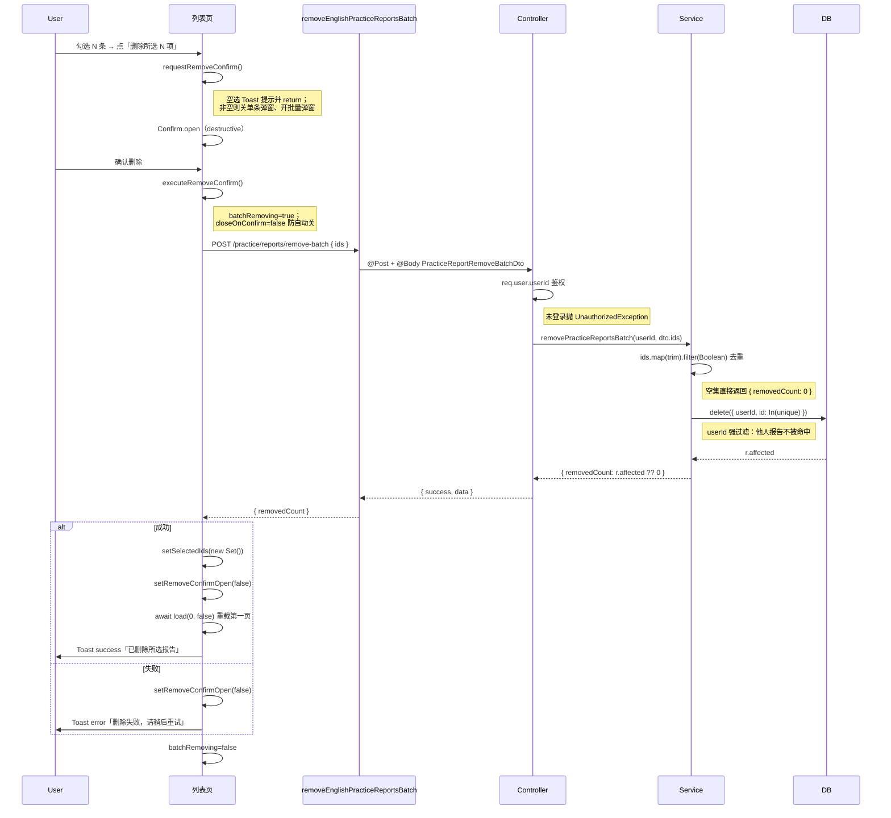
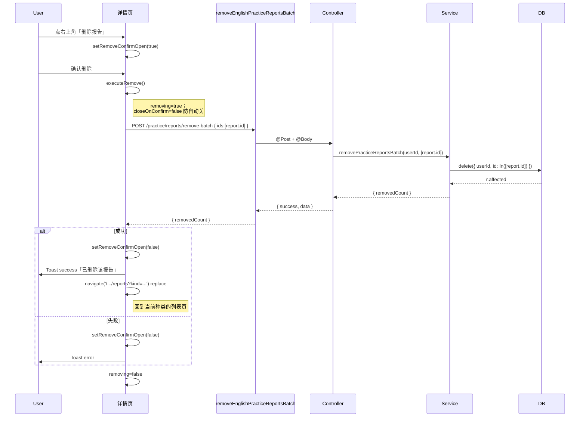

## 延伸阅读

- 练习报告创建 / 列表 / 详情回放：[`练习报告.md`](./练习报告.md)
- 结算页 UI 与作答明细：[`练习总结UI.md`](./练习总结UI.md)
- 错题集：[`单词错题与共享UI.md`](./单词错题与共享UI.md) · [`经典练习与错题.md`](./经典练习与错题.md)
- 产品使用说明：[`docs/项目指南.md`](../项目指南.md) §13.25
- 用户向更新条目：[`docs/项目更新信息.md`](../项目更新信息.md) §24（练习报告删除）
- 域总览：[`docs/english/README.md`](./README.md)

---

## 1. 背景与目标

[`练习报告.md`](./练习报告.md) 落地了报告的**创建、列表、详情回放**三层能力，但报告一旦保存就无法清理，列表会无限累积。本篇延续同一功能域，新增**删除**链路：

- **批量删除**：报告列表页支持多选 + 「删除所选 N 项」二次确认，一次调用批量接口。
- **单条删除（列表）**：每条报告右侧有删除按钮，弹出确认框，确认后删除该条。
- **单条删除（详情）**：详情页右上角「删除报告」入口，确认后删除当前报告并返回列表。

实现要点：后端用 `POST /practice/reports/remove-batch` 一个端点统一承接批量与单条两种场景（单条即 `ids.length === 1` 的特例），按 `(userId, ids)` 软删硬删由 TypeORM `delete` 决定；前端用 `removeEnglishPracticeReportsBatch` 一层封装，列表页和详情页各自维护「确认框 → 调接口 → 刷新/跳转」的本地状态机。

---

## 2. 改动范围

| 路径 | 说明 |
|------|------|
| `apps/backend/src/services/english-learning/dto/practice-report.dto.ts` | 新增 `PracticeReportRemoveBatchDto`：`ids: string[]` 数组校验 |
| `apps/backend/src/services/english-learning/english-learning.controller.ts` | 新增 `POST /practice/reports/remove-batch` 路由与鉴权 |
| `apps/backend/src/services/english-learning/english-learning.service.ts` | 新增 `removePracticeReportsBatch(userId, ids)`：去重 → `In` 批量 delete → 返回 `removedCount` |
| `apps/frontend/src/service/index.ts` | 新增 `removeEnglishPracticeReportsBatch(ids)`：`POST` 封装，返回 `{ removedCount }` |
| `apps/frontend/src/views/englishLearning/practice/reports/index.tsx` | 列表页：多选状态机 + 批量 / 单条删除确认框 + Toast + 重新加载 |
| `apps/frontend/src/views/englishLearning/practice/reports/Detail.tsx` | 详情页：右上角删除入口 + 确认框 + 删除后 `navigate` 回列表 |
| `apps/frontend/src/i18n/locales/zh-CN.ts` / `en-US.ts` | 新增 12 个 `reportsRemove*` 文案键 |

---

## 3. 实现思路

### 3.1 关键决策

1. **单端点承接批量与单条**：后端只暴露 `POST /practice/reports/remove-batch`，前端单条删除也走该接口（`ids: [targetId]`）。避免同时维护 `DELETE /:id` 与 `DELETE /batch` 两个端点，降低校验与越权防护的重复。
2. **`userId` 强过滤防越权**：`practiceReportRepo.delete({ userId, id: In(unique) })` 把当前用户 id 作为 where 条件，用户只能删自己的报告；他人报告 id 即使混入 `ids` 也不会被命中（affected 为 0）。
3. **`ids` 入参去重 + 空集短路**：service 先 `[...new Set(ids.map(trim).filter(Boolean))]`，空数组直接返回 `{ removedCount: 0 }`，避免构造 `In([])` 这类异常查询；同时把 `ArrayMaxSize(3000)` 作为硬顶，防恶意大数组打爆 SQL。
4. **`@IsUUID('4', { each: true })` 校验**：DTO 层强制每个 id 为 UUID v4，先于业务拦截格式异常（列表 id 由前端 `crypto.randomUUID()` 生成，格式保证一致），避免无效字符串进 SQL。
5. **`POST` 而非 `DELETE`**：删除走 `POST /.../remove-batch` 而非 `DELETE /.../:ids`。原因：批量 id 走 body 更直观、不受 URL 长度限制；`DELETE` 语义虽贴切但 Nest 生态里 body 校验配置更繁琐，统一用 `POST + body` 与同域其它写接口风格一致。
6. **列表页双确认框互斥**：批量删除与单条删除各自一个 `Confirm`，开其中一个时主动关另一个并清空 `singleRemoveTarget`，避免两个弹窗叠加显示造成焦点错乱。
7. **删除后视图策略不同**：
   - 列表页批量删除：`setSelectedIds(new Set())` 清空选中 → `load(0, false)` 从第一页重载，保持分页稳定。
   - 列表页单条删除：从 `selectedIds` 中删掉该 id（若之前被选中）→ 同样 `load(0, false)`。
   - 详情页删除：直接 `navigate('/english-learning/practice/reports?kind=...')` `replace` 回列表，避免详情页继续渲染已不存在的报告。
8. **`closeOnConfirm={false}` + 手动关闭**：确认框 `onConfirm` 是异步 `executeRemoveConfirm`，期间不能让 Confirm 自动关闭（否则 spinner 闪一下、失败时弹窗已没）。先在 `try` 内成功路径显式 `setRemoveConfirmOpen(false)`，`catch` 也显式关闭，`finally` 复位 `batchRemoving`。
9. **选中态与列表数据同步**：`itemIdSet` 随 `items` 变化，`useEffect` 把 `selectedIds` 中已不在当前列表的 id 剔除，避免「翻页加载更多后选中态指向已卸载条目」。
10. **纯新增、无破坏性**：本功能不改既有创建/列表/详情链路；报告表的 `id` / `userId` 字段在创建期已建立，删除仅消费这些字段。

### 3.2 删除链路架构

```mermaid
flowchart LR
  subgraph FE[前端]
    List["reports/index.tsx<br/>━━━<br/>• 多选 selectedIds Set<br/>• 批量 / 单条 Confirm<br/>• batchRemoving 状态<br/>• load(0,false) 重载"]
    Detail["reports/Detail.tsx<br/>━━━<br/>• report.id 单条<br/>• Confirm + executeRemove<br/>• navigate 回列表"]
    SvcFE["service/index.ts<br/>━━━<br/>• removeEnglishPracticeReportsBatch<br/>• POST /reports/remove-batch { ids }"]
  end

  subgraph BE[后端]
    Ctrl["Controller.removePracticeReportsBatch<br/>━━━<br/>• @Post reports/remove-batch<br/>• AuthedRequest 鉴权<br/>• PracticeReportRemoveBatchDto 校验"]
    SvcBE["Service.removePracticeReportsBatch<br/>━━━<br/>• ids 去重 trim<br/>• 空集短路<br/>• delete({ userId, id: In(unique) })"]
  end

  subgraph DB[(MySQL)]
    T[("english_practice_report<br/>━━━<br/>• id PK (uuid)<br/>• user_id<br/>• IDX_user_created<br/>• IDX_user_kind_created")]
  end

  List -- "ids[] (批量或单条)" --> SvcFE
  Detail -- "[report.id]" --> SvcFE
  SvcFE -- "POST { ids }" --> Ctrl
  Ctrl -- "userId + dto.ids" --> SvcBE
  SvcBE -- "DELETE WHERE userId AND id IN(...)" --> T
  T -- "affected" --> SvcBE
  SvcBE -- "{ removedCount }" --> Ctrl
  Ctrl -- "{ success, data }" --> SvcFE
  SvcFE -- "{ removedCount }" --> List
  SvcFE -- "{ removedCount }" --> Detail
  List -- "成功 → 清选中 + load(0,false)" --> List
  Detail -- "成功 → navigate 回列表" --> List
```

### 3.3 删除时序（批量场景）



### 3.4 删除时序（详情页单条场景）



---

## 4. 关键代码与逐行注释

> 本功能为**纯新增**（无既有删除链路可对比），按 `code-before-after.md` §4 例外处理：以下代码块均贴改动后（当前）源码，逐行注释遵循 `code-line-comments.md` 100% 覆盖规则。

### 4.1 `PracticeReportRemoveBatchDto`（`apps/backend/src/services/english-learning/dto/practice-report.dto.ts`）

**对比范围**：`class PracticeReportRemoveBatchDto` 完整定义（纯新增）。

**改动后** · `apps/backend/src/services/english-learning/dto/practice-report.dto.ts`（当前，约 L120–L125）

```typescript
// 删除批量入参 DTO：承载前端一次提交的多条报告 id
export class PracticeReportRemoveBatchDto {
	// 标注为数组类型，确保入参是数组而非单值；class-transformer 配合白名单时据此转型
	@IsArray()
	// 单次最多 3000 条，防止恶意大数组打爆 SQL 与解析层
	@ArrayMaxSize(3000)
	// 数组每个元素必须为 UUID v4，先于业务拦截格式异常，与列表 id (crypto.randomUUID()) 格式一致
	@IsUUID('4', { each: true })
	// 报告 id 数组，由前端列表 / 详情页组装后提交
	ids!: string[];
}
```

**变更摘要**：新增 DTO，定义 `ids: string[]` 的数组、上限、逐元素 UUID 校验，是删除接口的入参契约。

---

### 4.2 `removePracticeReportsBatch` 控制器方法（`apps/backend/src/services/english-learning/english-learning.controller.ts`）

**对比范围**：`async removePracticeReportsBatch` 完整方法（纯新增）。

**改动后** · `apps/backend/src/services/english-learning/english-learning.controller.ts`（当前，约 L1594–L1608）

```typescript
// 路由：POST /english-learning/practice/reports/remove-batch，统一承接批量与单条删除
@Post('practice/reports/remove-batch')
// 异步方法，返回 { success, data: { removedCount } }
async removePracticeReportsBatch(
	// 鉴权请求对象，req.user.userId 由全局守卫注入
	@Req() req: AuthedRequest,
	// 请求体，由 PracticeReportRemoveBatchDto 校验（IsArray + ArrayMaxSize + IsUUID）
	@Body() dto: PracticeReportRemoveBatchDto,
) {
	// 取当前登录用户 id；未登录直接抛 401，阻止匿名调用
	const userId = req.user?.userId;
	if (userId == null) {
		throw new UnauthorizedException('未授权');
	}
	// 委派 service 执行：service 内部会去重并按 (userId, ids) 删除
	const data = await this.englishLearningService.removePracticeReportsBatch(
		userId,
		dto.ids,
	);
	// 统一返回结构 { success, data }，前端按 removedCount 反馈 Toast
	return { success: true, data };
}
```

**变更摘要**：新增控制器端点，做鉴权 + DTO 校验 + 委派 service，返回统一 `{ success, data: { removedCount } }`。

---

### 4.3 `removePracticeReportsBatch` 服务方法（`apps/backend/src/services/english-learning/english-learning.service.ts`）

**对比范围**：`async removePracticeReportsBatch` 完整方法（纯新增）。

**改动后** · `apps/backend/src/services/english-learning/english-learning.service.ts`（当前，约 L6244–L6257）

```typescript
// 服务方法：按用户 id 与报告 id 数组批量删除，返回实际删除条数
async removePracticeReportsBatch(
	// 当前登录用户 id，作为 where 过滤防越权
	userId: number,
	// 前端提交的 id 数组，可能含重复或空白
	ids: string[],
): Promise<{ removedCount: number }> {
	// 对每个 id 先 trim 再 filter(Boolean) 去空白，再用 Set 去重，避免重复 id 重复执行
	const unique = [...new Set(ids.map((id) => id.trim()).filter(Boolean))];
	// 空集短路：避免构造 In([]) 这类异常查询，直接返回 0
	if (unique.length === 0) {
		return { removedCount: 0 };
	}
	// TypeORM delete：where 同时限定 userId 与 id In(unique)，他人报告不被命中
	const r = await this.practiceReportRepo.delete({
		// userId 强过滤，防越权删除他人报告
		userId,
		// In 操作符生成 SQL `id IN (...)`，与 unique 一一对应
		id: In(unique),
	});
	// r.affected 可能为 null（部分驱动不回填），?? 0 兜底为数字
	return { removedCount: r.affected ?? 0 };
}
```

**变更摘要**：新增 service 方法，三步走——去重 trim → 空集短路 → `(userId, id In(unique))` delete，返回 `affected` 兜底 0。

---

### 4.4 `removeEnglishPracticeReportsBatch` 前端 service 封装（`apps/frontend/src/service/index.ts`）

**对比范围**：`export const removeEnglishPracticeReportsBatch` 完整定义（纯新增）。

**改动后** · `apps/frontend/src/service/index.ts`（当前，约 L1977–L1982）

```typescript
// 前端 service 封装：列表页与详情页共用，单条删除传 [id] 即可
export const removeEnglishPracticeReportsBatch = async (ids: string[]) => {
	// 调 http.post，路径拼接 ENGLISH_LEARNING_PRACTICE_REPORTS + '/remove-batch'
	// body 为 { ids }，后端按 PracticeReportRemoveBatchDto 校验
	return await http.post<{ removedCount: number }>(
		// 基础常量：'/english-learning/practice/reports'，与列表 / 详情 GET 同前缀
		`${ENGLISH_LEARNING_PRACTICE_REPORTS}/remove-batch`,
		// 请求体：报告 id 数组
		{ ids },
	);
};
```

**变更摘要**：新增前端 service 一行封装，单条与批量统一走 `POST /remove-batch`，返回类型 `{ removedCount }`。

---

### 4.5 列表页删除链路（`apps/frontend/src/views/englishLearning/practice/reports/index.tsx`）

#### 4.5.1 顶部 import 与多选 / 删除状态

**对比范围**：`import` 区 + `PracticeReportsListPage` 顶部状态声明（纯新增）。

**改动后** · `apps/frontend/src/views/englishLearning/practice/reports/index.tsx`（当前，约 L1–L72）

```typescript
// 组件文件说明注释：列表页支持多选 + 批量删除与单条删除
/**
 * 练习报告列表（单词 / 语句切换；多选 / 单删对齐错题集）
 */
// 二次确认弹窗组件，用于删除前确认
import Confirm from '@design/Confirm';
// 加载占位组件
import Loading from '@design/Loading';
// 复选框组件，用于行级与全选
import { Checkbox } from '@ui/checkbox';
// Button / Toast 等通用 UI
import { Button, Toast } from '@ui/index';
// Label 组件，配合 Checkbox 的 htmlFor
import { Label } from '@ui/label';
// 小型 spinner，删除中显示
import { Spinner } from '@ui/spinner';
// 垃圾桶图标
import { Trash2 } from 'lucide-react';
// React hooks
import { useCallback, useEffect, useMemo, useState } from 'react';
// 路由导航与查询参数
import { useNavigate, useSearchParams } from 'react-router';
// i18n hook
import { useI18n } from '@/hooks';
// className 合并工具
import { cn } from '@/lib/utils';
// 报告列表条目类型 + 列表查询 + 批量删除 service
import {
	type EnglishPracticeReportListEntry,
	listEnglishPracticeReports,
	// 批量删除 service（单条删除也复用此接口，传 [id]）
	removeEnglishPracticeReportsBatch,
} from '@/service';
// 日期格式化
import { formatDate } from '@/utils';
// 单词 / 经典句 Tab 切换组件
import {
	type MistakesKind,
	MistakesKindTabs,
} from '../../mistakes/components/MistakesKindTabs';
// 练习页通用外壳
import { PracticePageShell } from '../components/shell';

// 每页 20 条，与列表加载更多对齐
const PAGE_SIZE = 20;

// 删除按钮 / 链接式按钮通用样式
const LINK_CLASS =
	'flex shrink-0 cursor-pointer items-center gap-1.5 whitespace-nowrap text-sm font-medium text-teal-500 hover:text-teal-400 disabled:cursor-not-allowed disabled:opacity-50';

// 把 URL ?kind= 解析为 'vocab' | 'classic'
function parseKind(raw: string | null): MistakesKind {
	return raw === 'classic' ? 'classic' : 'vocab';
}

// 反向构造列表页路径，用于 Tab 切换
function reportsPagePath(kind: MistakesKind): string {
	return kind === 'classic'
		? '/english-learning/practice/reports?kind=classic'
		: '/english-learning/practice/reports?kind=vocab';
}

// 报告卡片元数据文案：对/总数 · 百分比 · 日期
function formatReportMeta(
	entry: EnglishPracticeReportListEntry,
	pctLabel: string,
): string {
	// 总数 > 0 才算百分比，否则 0
	const pct =
		entry.totalCount > 0
			? Math.round((entry.correctCount / entry.totalCount) * 100)
			: 0;
	return `${entry.correctCount}/${entry.totalCount} · ${pct}${pctLabel} · ${formatDate(entry.createdAt)}`;
}

// 列表页主组件
export default function PracticeReportsListPage() {
	// i18n 翻译函数
	const { t } = useI18n();
	// 路由导航
	const navigate = useNavigate();
	// 查询参数（读取 ?kind=）
	const [searchParams] = useSearchParams();
	// 当前 Tab 种类（vocab / classic）
	const kind = useMemo(
		() => parseKind(searchParams.get('kind')),
		[searchParams],
	);

	// 报告列表数据
	const [items, setItems] = useState<EnglishPracticeReportListEntry[]>([]);
	// 总条数，用于判断「加载更多」是否还有
	const [totalCount, setTotalCount] = useState(0);
	// 首屏加载中
	const [loading, setLoading] = useState(true);
	// 加载更多中
	const [loadingMore, setLoadingMore] = useState(false);
	// 选中报告 id 集合，多选用 Set 便于增删
	const [selectedIds, setSelectedIds] = useState<Set<string>>(() => new Set());
	// 批量删除进行中标记，期间禁用一切操作
	const [batchRemoving, setBatchRemoving] = useState(false);
	// 批量删除确认弹窗 open 态
	const [removeConfirmOpen, setRemoveConfirmOpen] = useState(false);
	// 单条删除确认弹窗 open 态
	const [singleRemoveConfirmOpen, setSingleRemoveConfirmOpen] = useState(false);
	// 单条删除目标报告，弹窗内展示其 title
	const [singleRemoveTarget, setSingleRemoveTarget] =
		useState<EnglishPracticeReportListEntry | null>(null);
```

**变更摘要**：列表页顶部新增 `selectedIds` / `batchRemoving` / 两个确认框 open 态 / `singleRemoveTarget` 五个删除相关 state，并 import `Confirm` / `Checkbox` / `Label` / `Spinner` / `Trash2` / `removeEnglishPracticeReportsBatch`。

#### 4.5.2 选中态随列表数据自动清理

**对比范围**：`itemIdSet` 派生 + 清理 `selectedIds` 的 `useEffect`（纯新增）。

**改动后** · `apps/frontend/src/views/englishLearning/practice/reports/index.tsx`（当前，约 L108–L118）

```typescript
// 派生：当前 items 中所有 id 的 Set，用于校验选中态是否仍有效
const itemIdSet = useMemo(() => new Set(items.map((e) => e.id)), [items]);
// 选中态随 items 变化自动清理：翻页 / 加载更多后，选中态指向已卸载条目的 id 被剔除
useEffect(() => {
	setSelectedIds((prev) => {
		// 空集直接返回，避免触发不必要的 re-render
		if (prev.size === 0) return prev;
		// 重新构造一个 Set，只保留仍在当前 items 中的 id
		const next = new Set<string>();
		for (const id of prev) {
			// 当前 items 中存在才保留
			if (itemIdSet.has(id)) next.add(id);
		}
		// 大小未变则返回原对象，避免 re-render
		return next.size === prev.size ? prev : next;
	});
	// 依赖 itemIdSet，items 变化即触发
}, [itemIdSet]);
```

**变更摘要**：新增 `itemIdSet` 与清理 effect，保证翻页 / 加载更多后选中态不会指向已卸载条目。

#### 4.5.3 全选 / 单行勾选 + 批量 / 单条删除 disabled 派生

**对比范围**：`allLoadedSelected` / `someLoadedSelected` / `selectAllCheckboxState` / `selectionDisabled` / `removeDisabled` 派生 + `toggleSelectAllLoaded` / `toggleRowSelected` 回调（纯新增）。

**改动后** · `apps/frontend/src/views/englishLearning/practice/reports/index.tsx`（当前，约 L120–L150）

```typescript
// 当前页全部已选
const allLoadedSelected =
	items.length > 0 && items.every((e) => selectedIds.has(e.id));
// 当前页至少一条已选
const someLoadedSelected = items.some((e) => selectedIds.has(e.id));
// 全选复选框的三态：true / 'indeterminate' / false
const selectAllCheckboxState: boolean | 'indeterminate' = allLoadedSelected
	? true
	: someLoadedSelected
		? 'indeterminate'
		: false;
// 删除进行中或首屏加载中时禁用选择
const selectionDisabled = batchRemoving || loading;
// 批量删除按钮 disabled：删除中 / 无选中 / 列表空
const removeDisabled =
	batchRemoving || selectedIds.size === 0 || items.length === 0;

// 切换当前页全选：checked=true 时把当前页所有 id 加入 selectedIds
const toggleSelectAllLoaded = useCallback(
	(checked: boolean | 'indeterminate') => {
		// 勾选 → 用当前 items 的 id 数组构造新 Set，覆盖原选中
		if (checked === true) {
			setSelectedIds(new Set(items.map((e) => e.id)));
			return;
		}
		// 取消勾选 → 清空选中
		setSelectedIds(new Set());
	},
	// 依赖 items：items 变化时回调闭包刷新
	[items],
);

// 切换单行勾选：在 Set 上 add/delete，返回新 Set 触发 re-render
const toggleRowSelected = useCallback((id: string, checked: boolean) => {
	setSelectedIds((prev) => {
		// 复制原 Set 避免直接 mutate
		const next = new Set(prev);
		// 勾选则加入，取消则删除
		if (checked) next.add(id);
		else next.delete(id);
		return next;
	});
	// 无外部依赖，空数组
}, []);
```

**变更摘要**：新增三态全选派生、`selectionDisabled` / `removeDisabled` 派生、`toggleSelectAllLoaded` / `toggleRowSelected` 两个回调，构成列表页多选状态机。

#### 4.5.4 批量删除请求与执行

**对比范围**：`requestRemoveConfirm` + `executeRemoveConfirm` 两个回调（纯新增）。

**改动后** · `apps/frontend/src/views/englishLearning/practice/reports/index.tsx`（当前，约 L152–L204）

```typescript
// 打开批量删除确认弹窗前的前置检查
const requestRemoveConfirm = useCallback(() => {
	// 未勾选任何报告时 Toast 提示并 return，不打开弹窗
	if (selectedIds.size === 0) {
		Toast({
			type: 'info',
			title: t('englishLearning.practice.reportsRemoveNoneHint'),
		});
		return;
	}
	// 主动关闭单条删除弹窗，避免双弹窗叠加
	setSingleRemoveConfirmOpen(false);
	// 清空单条删除目标，防止状态串味
	setSingleRemoveTarget(null);
	// 打开批量删除弹窗
	setRemoveConfirmOpen(true);
	// 依赖 selectedIds 决定是否提示，t 用于文案
}, [selectedIds, t]);

// 批量删除执行：确认弹窗 onConfirm 调用
const executeRemoveConfirm = useCallback(async () => {
	// 从 items 中过滤出选中的 id，构成请求数组
	const ids = items
		.filter((e) => selectedIds.has(e.id))
		.map((e) => e.id);
	// 兜底：ids 为空则直接关弹窗，不发请求
	if (ids.length === 0) {
		setRemoveConfirmOpen(false);
		return;
	}
	// 进入删除中：禁用按钮、显示 spinner
	setBatchRemoving(true);
	try {
		// 调用批量删除接口，await 完成后再继续
		await removeEnglishPracticeReportsBatch(ids);
		// 成功后清空选中，避免残留
		setSelectedIds(new Set());
		// 关闭确认弹窗
		setRemoveConfirmOpen(false);
		// 从第一页重新加载，保持分页稳定
		await load(0, false);
		// 成功 Toast
		Toast({
			type: 'success',
			title: t('englishLearning.practice.reportsRemoveBatchSuccess'),
		});
	} catch (e) {
		// 失败 Toast：优先展示后端返回的 message，否则用通用文案
		Toast({
			type: 'error',
			title:
				e instanceof Error
					? e.message
					: t('englishLearning.practice.reportsRemoveFail'),
		});
		// 失败也要关闭弹窗，让用户能再次尝试
		setRemoveConfirmOpen(false);
	} finally {
		// 无论成败复位删除中标记
		setBatchRemoving(false);
	}
	// 依赖 items / load / selectedIds / t
}, [items, load, selectedIds, t]);
```

**变更摘要**：新增 `requestRemoveConfirm`（前置 Toast + 双弹窗互斥）与 `executeRemoveConfirm`（await 接口 → 清选中 → `load(0,false)` → Toast），是批量删除的核心状态机。

#### 4.5.5 单条删除请求与执行

**对比范围**：`requestSingleRemove` + `executeSingleRemoveConfirm` 两个回调（纯新增）。

**改动后** · `apps/frontend/src/views/englishLearning/practice/reports/index.tsx`（当前，约 L165–L239）

```typescript
// 打开单条删除弹窗：传入目标报告，并主动关闭批量弹窗
const requestSingleRemove = useCallback(
	(entry: EnglishPracticeReportListEntry) => {
		// 主动关闭批量删除弹窗，避免双弹窗叠加
		setRemoveConfirmOpen(false);
		// 记录目标报告，弹窗 description 用其 title
		setSingleRemoveTarget(entry);
		// 打开单条删除弹窗
		setSingleRemoveConfirmOpen(true);
	},
	// 无外部依赖
	[],
);

// 单条删除执行：确认弹窗 onConfirm 调用
const executeSingleRemoveConfirm = useCallback(async () => {
	// 取出目标报告，可能为 null（弹窗被异常关闭）
	const target = singleRemoveTarget;
	// 无目标则直接关弹窗，不发请求
	if (!target) {
		setSingleRemoveConfirmOpen(false);
		return;
	}
	// 进入删除中
	setBatchRemoving(true);
	try {
		// 调用批量接口，但只传 [target.id] 一项
		await removeEnglishPracticeReportsBatch([target.id]);
		// 从 selectedIds 中剔除该 id（若之前被选中），避免选中态残留
		setSelectedIds((prev) => {
			const next = new Set(prev);
			next.delete(target.id);
			return next;
		});
		// 清空目标，关闭弹窗
		setSingleRemoveTarget(null);
		setSingleRemoveConfirmOpen(false);
		// 从第一页重新加载
		await load(0, false);
		// 成功 Toast
		Toast({
			type: 'success',
			title: t('englishLearning.practice.reportsRemoveSuccess'),
		});
	} catch (e) {
		// 失败 Toast：优先展示后端 message
		Toast({
			type: 'error',
			title:
				e instanceof Error
					? e.message
					: t('englishLearning.practice.reportsRemoveFail'),
		});
		// 关闭弹窗，允许用户重试
		setSingleRemoveConfirmOpen(false);
	} finally {
		// 复位删除中标记
		setBatchRemoving(false);
	}
	// 依赖 load / singleRemoveTarget / t
}, [load, singleRemoveTarget, t]);
```

**变更摘要**：新增 `requestSingleRemove`（双弹窗互斥 + 设 target）与 `executeSingleRemoveConfirm`（单条删除走批量接口、清选中、`load(0,false)`），与批量删除对称但单条特化。

#### 4.5.6 两个 `Confirm` 弹窗 JSX

**对比范围**：列表页返回的 `<>` 内两个 `Confirm` 组件（纯新增）。

**改动后** · `apps/frontend/src/views/englishLearning/practice/reports/index.tsx`（当前，约 L256–L292）

```typescript
// Fragment 包裹：弹窗与外壳并列
return (
	<>
		{/* 批量删除确认弹窗 */}
		<Confirm
			// 受控 open 态
			open={removeConfirmOpen}
			// 受控开关
			onOpenChange={setRemoveConfirmOpen}
			// 标题：i18n 键 reportsRemoveBatchConfirmTitle
			title={t('englishLearning.practice.reportsRemoveBatchConfirmTitle')}
			// 描述：i18n 键 reportsRemoveBatchConfirmDesc，参数 count = selectedIds.size
			description={t(
				'englishLearning.practice.reportsRemoveBatchConfirmDesc',
				{ count: selectedIds.size },
			)}
			// 描述左对齐，避免长文案居中错乱
			descriptionClassName="text-left"
			// 确认按钮文案：i18n 键 reportsRemoveConfirmAction
			confirmText={t('englishLearning.practice.reportsRemoveConfirmAction')}
			// 取消按钮文案
			cancelText={t('common.cancel')}
			// 确认按钮红色 destructive 样式，强调破坏性
			confirmVariant="destructive"
			// 关键：关闭 onConfirm 自动关闭弹窗，由 executeRemoveConfirm 手动控制
			closeOnConfirm={false}
			// 确认回调：void 化异步执行
			onConfirm={() => void executeRemoveConfirm()}
		/>
		{/* 单条删除确认弹窗 */}
		<Confirm
			open={singleRemoveConfirmOpen}
			// 自定义 onOpenChange：关闭时同时清空 target
			onOpenChange={(open) => {
				setSingleRemoveConfirmOpen(open);
				if (!open) setSingleRemoveTarget(null);
			}}
			// 标题：i18n 键 reportsRemoveConfirmTitle
			title={t('englishLearning.practice.reportsRemoveConfirmTitle')}
			// 描述：有 target 则展示其 title，否则用 nbsp 占位保持高度
			description={
				singleRemoveTarget
					? t('englishLearning.practice.reportsRemoveConfirmDesc', {
							title: singleRemoveTarget.title,
						})
					: '\u00a0'
			}
			descriptionClassName="text-left"
			confirmText={t('englishLearning.practice.reportsRemoveConfirmAction')}
			cancelText={t('common.cancel')}
			confirmVariant="destructive"
			closeOnConfirm={false}
			onConfirm={() => void executeSingleRemoveConfirm()}
		/>
```

**变更摘要**：新增两个 `Confirm` 弹窗，均 `destructive` + `closeOnConfirm={false}`，单条弹窗 `onOpenChange` 关闭时清空 target。

#### 4.5.7 顶栏「删除所选 N 项」按钮与全选复选框

**对比范围**：`PracticePageShell` 的 `headerRight` 区域（纯新增）。

**改动后** · `apps/frontend/src/views/englishLearning/practice/reports/index.tsx`（当前，约 L296–L343）

```typescript
		{/* 外壳组件，统一顶栏与内容布局 */}
		<PracticePageShell
			// 标题：根据 kind 显示对应 Tab 名
			title={<span className="min-w-0 truncate">{title}</span>}
			// 内容区填满高度
			contentLayout="fill"
			headerRight={
				// 右上角操作区：全选 + 删除所选 + Tab 切换
				<div className="flex min-w-0 flex-wrap items-center justify-end gap-3">
					{/* 仅在有数据且非加载中时显示选择区 */}
					{showSelection ? (
						<div className="flex shrink-0 items-center gap-2">
							{/* 全选复选框，三态 */}
							<Checkbox
								id="practice-reports-select-all"
								checked={selectAllCheckboxState}
								disabled={selectionDisabled}
								onCheckedChange={(v) => toggleSelectAllLoaded(v)}
							/>
							{/* 全选 Label，点击联动复选框 */}
							<Label
								htmlFor="practice-reports-select-all"
								className="cursor-pointer text-sm font-medium whitespace-nowrap text-teal-500 hover:text-teal-400"
							>
								{t('englishLearning.practice.reportsSelectAll')}
							</Label>
						</div>
					) : null}
					{/* 删除所选按钮：链接样式 + 图标 + 文案 */}
					{showSelection ? (
						<button
							type="button"
							// disabled：删除中 / 无选中 / 列表空
							disabled={removeDisabled}
							className={LINK_CLASS}
							// 点击打开批量删除弹窗
							onClick={requestRemoveConfirm}
						>
							{/* 删除中显示 spinner，否则显示垃圾桶 */}
							{batchRemoving ? (
								<Spinner className="size-4 shrink-0 text-teal-500" />
							) : (
								<Trash2 className="size-4 shrink-0 opacity-90" aria-hidden />
							)}
							<span>
								{/* 文案随状态切换：删除中显示「删除中…」，否则「删除所选 N 项」 */}
								{batchRemoving
									? t('englishLearning.practice.reportsRemoving')
									: t('englishLearning.practice.reportsRemoveSelected', {
											count: selectedIds.size,
										})}
							</span>
						</button>
					) : null}
					{/* 单词 / 经典句 Tab 切换 */}
					<MistakesKindTabs
						kind={kind}
						onSelectKind={onSelectKind}
						vocabLabel={t('englishLearning.practice.reportsVocabNav')}
						classicLabel={t('englishLearning.practice.reportsClassicNav')}
						ariaLabel={t('route.englishLearning.practice.reportsTitle')}
					/>
				</div>
			}
		>
```

**变更摘要**：`headerRight` 新增「全选复选框 + Label」与「删除所选 N 项」按钮，按钮内根据 `batchRemoving` 切换 spinner / 图标与文案。

#### 4.5.8 报告卡片内的复选框与单条删除按钮

**对比范围**：`items.map` 内每条卡片的左侧复选框与右侧单条删除按钮（纯新增）。

**改动后** · `apps/frontend/src/views/englishLearning/practice/reports/index.tsx`（当前，约 L356–L413）

```typescript
					{/* 遍历报告列表，每条渲染一个卡片 */}
					{items.map((entry) => {
						// 当条是否被选中
						const checked = selectedIds.has(entry.id);
						// 复选框与 Label 的关联 id
						const controlId = `practice-report-${entry.id}`;
						return (
							<div
								key={entry.id}
								// 卡片样式：选中时高亮边框与背景
								className={cn(
									'border-theme/10 bg-theme/5 hover:border-teal-500/35 hover:bg-teal-500/10 flex min-w-0 items-start gap-2 rounded-md border px-3 py-3 transition-colors',
									checked && 'border-teal-500/40 bg-teal-500/10',
								)}
							>
								{/* 行级复选框 */}
								<Checkbox
									id={controlId}
									checked={checked}
									disabled={selectionDisabled}
									className="mt-1 shrink-0"
									// aria-label 用于读屏
									aria-label={`${t('englishLearning.practice.reportsToggleRow')}: ${entry.title}`}
									// v === true 把 'indeterminate' 归一化为 boolean
									onCheckedChange={(v) =>
										toggleRowSelected(entry.id, v === true)
									}
									// 阻止冒泡，避免点复选框误触发卡片跳详情
									onClick={(e) => e.stopPropagation()}
								/>
								{/* 卡片主区：点击跳详情 */}
								<button
									type="button"
									className="flex min-w-0 flex-1 flex-col gap-1 text-left"
									onClick={() =>
										navigate(
											// 详情页 URL 带 kind 与 title，供面包屑读取
											`/english-learning/practice/reports/${entry.id}?kind=${kind}&title=${encodeURIComponent(entry.title)}`,
										)
									}
								>
									{/* 报告标题 */}
									<span className="text-textcolor truncate text-sm font-semibold sm:text-base">
										{entry.title}
									</span>
									{/* 报告元数据：对/总数 · 百分比 · 日期 */}
									<span className="text-textcolor/50 text-xs tabular-nums sm:text-sm">
										{formatReportMeta(
											entry,
											t('englishLearning.practice.reportsPctSuffix'),
										)}
									</span>
								</button>
								{/* 单条删除按钮：ghost 小按钮 */}
								<Button
									type="button"
									variant="ghost"
									size="sm"
									// 删除中或加载中时禁用
									disabled={selectionDisabled}
									// 点击打开单条删除弹窗
									onClick={() => requestSingleRemove(entry)}
									className={cn(
										'h-7 w-7 shrink-0 rounded-md border p-2 transition-colors',
										// hover 时变红，强调破坏性
										'border-theme/10 text-textcolor/60 hover:border-destructive/35 hover:bg-destructive/10 hover:text-destructive',
									)}
									aria-label={t(
										'englishLearning.practice.reportsRemoveAction',
									)}
								>
									{/* 垃圾桶图标 */}
									<Trash2 className="size-3.5" />
								</Button>
							</div>
						);
					})}
```

**变更摘要**：每条卡片左侧新增行级复选框（`stopPropagation` 防误跳），右侧新增单条删除按钮（ghost + hover 变红），构成多选 + 单删的卡片 UI。

---

### 4.6 详情页删除链路（`apps/frontend/src/views/englishLearning/practice/reports/Detail.tsx`）

#### 4.6.1 顶部 import 与删除相关 state

**对比范围**：`import` 区 + `removeConfirmOpen` / `removing` state（纯新增）。

**改动后** · `apps/frontend/src/views/englishLearning/practice/reports/Detail.tsx`（当前，约 L1–L42）

```typescript
// 组件文件说明注释：详情页复用 WrongListItem，系统 Header 面包屑展示标题
/**
 * 练习报告详情 — 复用 WrongListItem；系统 Header 面包屑展示标题
 */
// 二次确认弹窗组件
import Confirm from '@design/Confirm';
// 加载占位组件
import Loading from '@design/Loading';
// ScrollArea / Toast 等通用 UI
import { ScrollArea, Toast } from '@ui/index';
// 小型 spinner，删除中显示
import { Spinner } from '@ui/spinner';
// 垃圾桶图标
import { Trash2 } from 'lucide-react';
// React hooks
import { useCallback, useEffect, useMemo, useState } from 'react';
// 路由导航 / 路径参数 / 查询参数
import { useNavigate, useParams, useSearchParams } from 'react-router';
// i18n hook
import { useI18n } from '@/hooks';
// 报告详情类型 + 详情查询 + 批量删除 service（单条删除复用此接口）
import {
	type EnglishPracticeReportDetail,
	getEnglishPracticeReport,
	// 批量删除 service，详情页单条删除传 [report.id]
	removeEnglishPracticeReportsBatch,
} from '@/service';
// 日期格式化
import { formatDate } from '@/utils';
// TTS 播放相关工具
import {
	isPlaybackAvailable,
	playPreferred,
	stopAllPlayback,
} from '@/utils/speech';
// 练习页外壳与卡片
import { PracticeCard, PracticePageShell } from '../components/shell';
// 统计面板与错题项组件
import { SummaryStatsPanel, WrongListItem } from '../components/summary';
// 报告项 → 展示用 PracticeItem 转换
import { reportItemToPracticeItem } from '../utils/reportItem';

// 链接式按钮通用样式（与列表页对齐）
const LINK_CLASS =
	'flex shrink-0 cursor-pointer items-center gap-1.5 whitespace-nowrap text-sm font-medium text-teal-500 hover:text-teal-400 disabled:cursor-not-allowed disabled:opacity-50';

// 详情页主组件
export default function PracticeReportDetailPage() {
	// i18n 翻译函数
	const { t } = useI18n();
	// 路由导航
	const navigate = useNavigate();
	// 路径参数 :id
	const { id } = useParams<{ id: string }>();
	// 查询参数（读取 kind / title）
	const [searchParams] = useSearchParams();
	// 报告详情数据
	const [report, setReport] = useState<EnglishPracticeReportDetail | null>(
		null,
	);
	// 首屏加载中
	const [loading, setLoading] = useState(true);
	// 当前播放项 key，用于高亮与停止
	const [playingKey, setPlayingKey] = useState<string | null>(null);
	// 删除确认弹窗 open 态
	const [removeConfirmOpen, setRemoveConfirmOpen] = useState(false);
	// 删除进行中标记，期间禁用按钮、显示 spinner
	const [removing, setRemoving] = useState(false);
```

**变更摘要**：详情页新增 `removeConfirmOpen` / `removing` 两个 state，并 import `Confirm` / `Spinner` / `Trash2` / `removeEnglishPracticeReportsBatch`。

#### 4.6.2 `executeRemove` 删除执行回调

**对比范围**：`executeRemove` 完整 `useCallback`（纯新增）。

**改动后** · `apps/frontend/src/views/englishLearning/practice/reports/Detail.tsx`（当前，约 L140–L169）

```typescript
// 删除执行：确认弹窗 onConfirm 调用
const executeRemove = useCallback(async () => {
	// 无报告数据则直接关弹窗，不发请求
	if (!report) {
		setRemoveConfirmOpen(false);
		return;
	}
	// 进入删除中：禁用按钮、显示 spinner
	setRemoving(true);
	try {
		// 调用批量删除接口，只传当前报告 id
		await removeEnglishPracticeReportsBatch([report.id]);
		// 成功后关闭弹窗
		setRemoveConfirmOpen(false);
		// 成功 Toast：i18n 键 reportsRemoveSuccess
		Toast({
			type: 'success',
			title: t('englishLearning.practice.reportsRemoveSuccess'),
		});
		// 计算回列表的 kind 参数，保持当前种类
		const kind = report.contentKind === 'classic' ? 'classic' : 'vocab';
		// navigate replace 回列表页，避免详情页继续渲染已删除报告
		navigate(`/english-learning/practice/reports?kind=${kind}`, {
			replace: true,
		});
	} catch (e) {
		// 失败 Toast：优先展示后端 message
		Toast({
			type: 'error',
			title:
				e instanceof Error
					? e.message
					: t('englishLearning.practice.reportsRemoveFail'),
		});
		// 失败也要关闭弹窗
		setRemoveConfirmOpen(false);
	} finally {
		// 复位删除中标记
		setRemoving(false);
	}
	// 依赖 navigate / report / t
}, [navigate, report, t]);
```

**变更摘要**：新增 `executeRemove`：await 批量接口 → 关弹窗 → Toast → `navigate replace` 回列表，失败 Toast 并关弹窗，`finally` 复位 `removing`。

#### 4.6.3 删除确认弹窗与右上角入口

**对比范围**：`<>` 内 `Confirm` 弹窗 + `PracticePageShell` 的 `headerRight`（纯新增）。

**改动后** · `apps/frontend/src/views/englishLearning/practice/reports/Detail.tsx`（当前，约 L184–L228）

```typescript
return (
	<>
		{/* 删除确认弹窗 */}
		<Confirm
			// 受控 open 态
			open={removeConfirmOpen}
			// 受控开关
			onOpenChange={setRemoveConfirmOpen}
			// 标题：i18n 键 reportsRemoveConfirmTitle
			title={t('englishLearning.practice.reportsRemoveConfirmTitle')}
			// 描述：有 report 则展示其 title，否则用 nbsp 占位
			description={
				report
					? t('englishLearning.practice.reportsRemoveConfirmDesc', {
							title: report.title,
						})
					: '\u00a0'
			}
			// 描述左对齐
			descriptionClassName="text-left"
			// 确认按钮文案
			confirmText={t('englishLearning.practice.reportsRemoveConfirmAction')}
			// 取消按钮文案
			cancelText={t('common.cancel')}
			// 确认按钮红色 destructive 样式
			confirmVariant="destructive"
			// 关键：关闭 onConfirm 自动关闭，由 executeRemove 手动控制
			closeOnConfirm={false}
			// 确认回调：void 化异步执行
			onConfirm={() => void executeRemove()}
		/>
		{/* 外壳组件 */}
		<PracticePageShell
			// 标题：根据 contentKind 显示对应 Tab 名
			title={<span className="min-w-0 truncate">{shellTitle}</span>}
			// 内容区填满高度
			contentLayout="fill"
			// 右上角：有 report 且非加载中时显示删除入口
			headerRight={
				report && !loading ? (
					<button
						type="button"
						// 删除中时禁用
						disabled={removing}
						className={LINK_CLASS}
						// 点击打开确认弹窗
						onClick={() => setRemoveConfirmOpen(true)}
						// aria-label：i18n 键 reportsRemoveAction
						aria-label={t('englishLearning.practice.reportsRemoveAction')}
					>
						{/* 删除中显示 spinner，否则显示垃圾桶 */}
						{removing ? (
							<Spinner className="size-4 shrink-0 text-teal-500" />
						) : (
							<Trash2 className="size-4 shrink-0 opacity-90" aria-hidden />
						)}
						<span>
							{/* 文案随状态切换 */}
							{removing
								? t('englishLearning.practice.reportsRemoving')
								: t('englishLearning.practice.reportsRemoveAction')}
						</span>
					</button>
				) : undefined
			}
		>
```

**变更摘要**：详情页新增 `Confirm` 弹窗（`destructive` + `closeOnConfirm={false}`）与右上角「删除报告」入口（spinner / 图标 + 文案随 `removing` 切换）。

---

### 4.7 i18n 文案键（`apps/frontend/src/i18n/locales/zh-CN.ts`）

**对比范围**：`reportsRemove*` 共 12 个键（纯新增）。

**改动后** · `apps/frontend/src/i18n/locales/zh-CN.ts`（当前，约 L1181–L1195）

```typescript
// 删除所选按钮文案，带 {count} 插值
'englishLearning.practice.reportsRemoveSelected': '删除所选 {count} 项',
// 删除中按钮文案
'englishLearning.practice.reportsRemoving': '删除中…',
// 未勾选任何报告时的 Toast 提示
'englishLearning.practice.reportsRemoveNoneHint': '请先勾选要删除的报告',
// 批量删除确认弹窗标题
'englishLearning.practice.reportsRemoveBatchConfirmTitle':
	'确认删除所选报告？',
// 批量删除确认弹窗描述，带 {count} 插值
'englishLearning.practice.reportsRemoveBatchConfirmDesc':
	'将删除已勾选的 {count} 份练习报告，此操作不可撤销。',
// 单条删除确认弹窗标题
'englishLearning.practice.reportsRemoveConfirmTitle': '删除练习报告',
// 单条删除确认弹窗描述，带 {title} 插值
'englishLearning.practice.reportsRemoveConfirmDesc':
	'确定删除「{title}」？此操作不可撤销。',
// 确认按钮文案（批量与单条共用）
'englishLearning.practice.reportsRemoveConfirmAction': '确认删除',
// 批量删除成功 Toast
'englishLearning.practice.reportsRemoveBatchSuccess': '已删除所选报告',
// 单条删除成功 Toast
'englishLearning.practice.reportsRemoveSuccess': '已删除该报告',
// 删除失败通用 Toast
'englishLearning.practice.reportsRemoveFail': '删除失败，请稍后重试',
// 行级复选框 aria-label / 单条删除按钮 aria-label
'englishLearning.practice.reportsRemoveAction': '删除报告',
// 行级复选框 aria-label 后半段
'englishLearning.practice.reportsToggleRow': '选择该报告',
```

**变更摘要**：新增 12 个 `reportsRemove*` / `reportsToggleRow` 文案键，覆盖按钮、Toast、确认弹窗、aria-label。

---

## 5. 兼容性与影响

- **数据兼容**：删除走 `practiceReportRepo.delete({ userId, id: In(unique) })`，**不**新建表、**不**改既有字段；与创建 / 列表 / 详情链路完全解耦。
- **越权防护**：`userId` 强过滤写进 `where`，他人报告 id 即使混入 `ids` 也不会被命中（`affected` 不计）。
- **入参硬顶**：`@ArrayMaxSize(3000)` + `@IsUUID('4', { each: true })` 在 DTO 层拦截超大数组与格式异常，先于 SQL。
- **幂等性**：同一 `id` 多次提交，第二次 `affected` 为 0，前端不区分「删了 N 条」与「实际命中 M 条」，仅以 `removedCount` 反馈 Toast。
- **破坏性**：删除不可撤销，UI 在弹窗标题与描述中均提示「此操作不可撤销」，并以 `destructive` 红色按钮强调。
- **选中态一致性**：`itemIdSet` effect 在翻页 / 加载更多后自动清理无效选中 id，避免「选中态指向已卸载条目」。
- **i18n**：12 个新键位于 `englishLearning.practice.reportsRemove*` / `reportsToggleRow`，`en-US.ts` 同步对应英文。
- **不影响创建 / 列表 / 详情**：本功能纯新增，既有三链路（`POST /practice/reports` / `GET /practice/reports` / `GET /practice/reports/:id`）零改动。

---

## 6. 建议回归

**批量删除**

1. 列表页勾选 N 条 → 点「删除所选 N 项」→ 弹窗显示正确 N → 确认 → spinner → 成功 Toast「已删除所选报告」→ 列表从第一页重新加载，选中态清空。
2. 未勾选任何报告点「删除所选 0 项」（按钮 disabled，无法点）；若通过其它路径触发 `requestRemoveConfirm`，应 Toast「请先勾选要删除的报告」。
3. 批量删除中再次点击删除按钮：`disabled` 生效，不会重复触发。
4. 批量删除失败（断网 / 后端 500）：Toast 错误信息，弹窗关闭，列表数据不变。

**单条删除（列表）**

5. 每条卡片右侧垃圾桶按钮点击 → 弹窗显示报告 title → 确认 → 成功 Toast「已删除该报告」→ 列表重新加载；若该条之前被选中，选中态同步剔除。
6. 单条删除中批量删除按钮 disabled，反之亦然（双弹窗互斥）。

**单条删除（详情）**

7. 详情页右上角「删除报告」点击 → 弹窗显示 title → 确认 → 成功 Toast → `navigate replace` 回当前 kind 的列表页。
8. 删除失败：Toast 错误信息，弹窗关闭，仍停留在详情页。

**选中态与分页**

9. 翻页加载更多后，之前页的选中态应保留；若某条被删后其 id 自动从 `selectedIds` 剔除。
10. 切换 `vocab` / `classic` Tab：`selectedIds` 随 `items` 重置（`useEffect` 清理 effect 触发），不会跨种类串味。

**越权与边界**

11. 直接向后端 `POST /practice/reports/remove-batch` 提交他人报告 id：`affected` 为 0，前端只看到「已删除所选报告」但实际未删任何数据。
12. 提交非 UUID 格式 id：DTO 校验抛 400，不会进 SQL。
13. 提交超过 3000 条 id：`ArrayMaxSize` 抛 400。
14. 提交空数组 `[]`：service 空集短路返回 `{ removedCount: 0 }`，前端不报错。

---

## 7. 相关源码路径

| 说明 | 路径 |
|------|------|
| 后端 DTO | `apps/backend/src/services/english-learning/dto/practice-report.dto.ts` |
| 后端控制器 | `apps/backend/src/services/english-learning/english-learning.controller.ts` |
| 后端服务 | `apps/backend/src/services/english-learning/english-learning.service.ts` |
| 前端 service 封装 | `apps/frontend/src/service/index.ts` |
| 前端 API 常量 | `apps/frontend/src/service/api.ts` |
| 报告列表页 | `apps/frontend/src/views/englishLearning/practice/reports/index.tsx` |
| 报告详情页 | `apps/frontend/src/views/englishLearning/practice/reports/Detail.tsx` |
| i18n 文案 | `apps/frontend/src/i18n/locales/zh-CN.ts` · `en-US.ts` |

---

若与仓库最新源码不一致，以源码为准。
