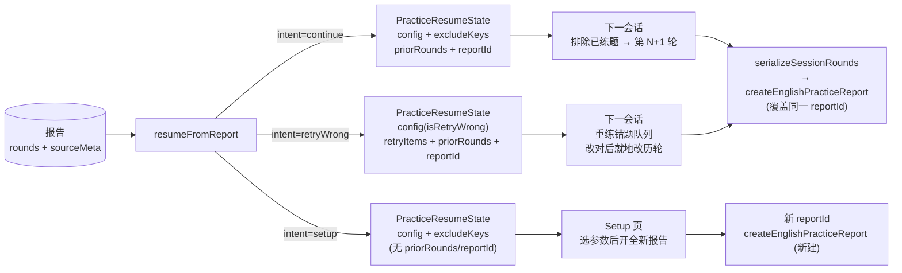
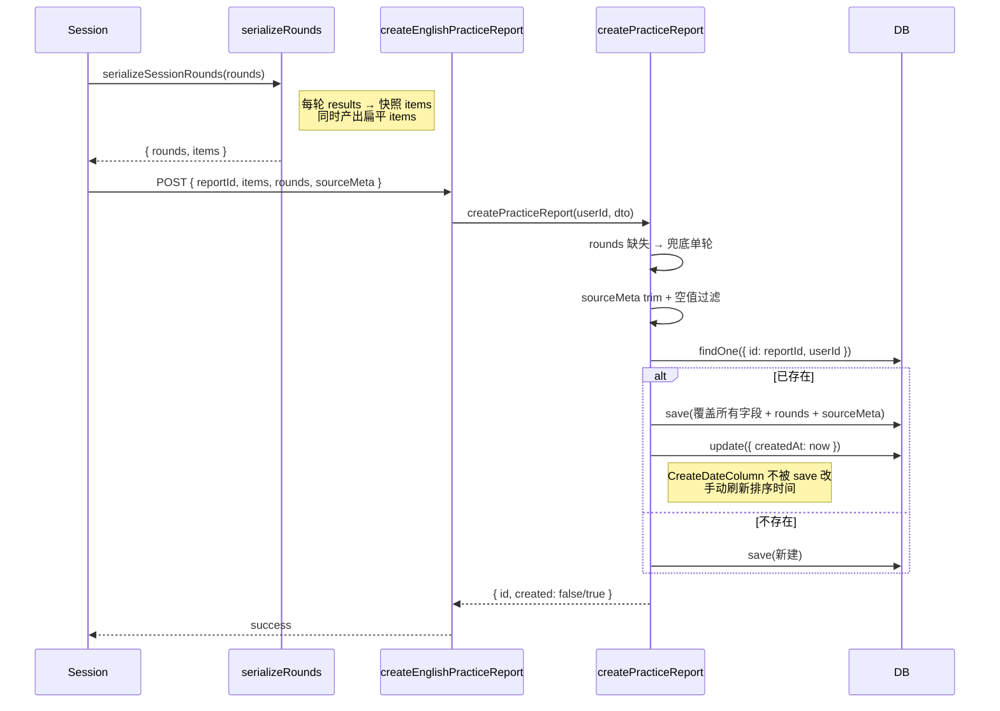

## 延伸阅读

- 练习报告创建 / 列表 / 详情：[`练习报告.md`](./练习报告.md)
- 练习报告删除：[`练习报告删除.md`](./练习报告删除.md)
- 产品使用说明：[`docs/项目指南.md`](../项目指南.md) §13.25
- 用户向更新条目：[`docs/项目更新信息.md`](../项目更新信息.md) §24

---

## 1. 背景与目标

[`练习报告.md`](./练习报告.md) 落地了报告的创建与回放，但报告只存**扁平 items**，一场练习覆盖保存就丢失历史轮次明细。本篇新增**多轮报告**与**续练**能力：

- **多轮存储**：报告新增 `rounds` 字段，记录每一轮的 `roundIndex / completedAt / items`；旧报告无 rounds 时读取侧用 items 兜底成单轮。
- **续练三态**：从报告详情页可发起 `continue`（继续练习，排除已练题追加新轮）、`retryWrong`（重练错题，就地改对历轮条目）、`setup`（回到设置页开全新报告）。
- **来源线索**：报告新增 `sourceMeta`（`libraryId / streamId / poolTotal`），续练时还原出题上下文，无需重新探测题池。
- **认读模式**：`mode` 增加 `'recognition'`，今日记词默认识别看词选义模式。

---

## 2. 改动范围

| 路径 | 说明 |
|------|------|
| `apps/backend/src/services/english-learning/entity/english-practice-report.entity.ts` | 新增 `rounds` / `sourceMeta` 字段与类型；`mode` 增加 `recognition` |
| `apps/backend/src/services/english-learning/dto/practice-report.dto.ts` | 新增 `PracticeReportRoundDto` / `PracticeReportSourceMetaDto`；`mode` 增加 `recognition`；items 上限放宽到 `SESSION_MAX × 20` |
| `apps/backend/src/services/english-learning/english-learning.service.ts` | `createPracticeReport`：rounds 兜底、sourceMeta trim 过滤、覆盖写入时刷新 createdAt |
| `apps/frontend/src/service/index.ts` | 新增 `EnglishPracticeReportRound` / `EnglishPracticeReportSourceMeta` 类型；`CreateEnglishPracticeReportPayload` 增加 `rounds?` / `sourceMeta?` |
| `apps/frontend/src/views/englishLearning/practice/utils/serializeRounds.ts` | 会话轮次 → 报告 rounds + 扁平 items 序列化 |
| `apps/frontend/src/views/englishLearning/practice/utils/resumeFromReport.ts` | 报告 → 续练状态（三 intent）；rounds 双向转换 |
| `apps/frontend/src/views/englishLearning/practice/Summary.tsx` | 保存时序列化 rounds + sourceMeta；`roundsSaveSig` 去重签名 |
| `apps/frontend/src/views/englishLearning/practice/reports/Detail.tsx` | `navigateResume(intent)`：详情页续练入口，`state.practiceResume` 传参 |

---

## 3. 实现思路

### 3.1 关键决策

1. **客户端复用 reportId 跨轮次**：同一会话的多轮保存共用同一个 `sessionReportId`，后端按主键幂等**覆盖写入**，不产生多条记录；`rounds` 字段让历史轮次在覆盖时不丢失。
2. **continue vs retryWrong 的写入策略不同**：
   - `continue`：追加新一轮到 `rounds` 末尾，`roundIndex` 递增；
   - `retryWrong`：**不追加轮次**，而是把改对的题从历轮 `wrong` 挪到 `correct`，就地提升正确率（避免重练产生冗余轮次）。
3. **`sourceMeta` 是续练的「地图」而非展示数据**：`libraryId / streamId / poolTotal` 仅用于续练时回到同一个题池分页拉词，UI 不直接展示（展示用 `sourceTitle`）。
4. **空 sourceMeta 存 null**：后端对 `sourceMeta` 做 trim + 空值过滤，空对象整列存 null，避免无意义 JSON 占空间。
5. **覆盖时手动刷新 createdAt**：TypeORM `CreateDateColumn` 不会被 `save` 改掉，续练覆盖后用 `update({ createdAt: now })` 显式刷新，让列表按最近续练时间排序。
6. **`roundsSaveSig` 防重复保存**：把每轮的 `roundIndex + correct 位串` 拼成签名，自动保存模式下仅在签名变化时触发，避免轮次未变时重复请求。
7. **`state.practiceResume` 路由传参**：续练状态通过 `navigate(url, { state: { practiceResume } })` 传递，不进 URL，避免长 state 撑爆 URL 且不污染历史。

### 3.2 续练三态数据流



### 3.3 rounds 流转时序



---

## 4. 关键代码与逐行注释

> 本篇改动为**新增字段 + 既有方法扩展**，以下代码块贴改动后（当前）源码，逐行注释遵循 100% 覆盖规则。

### 4.1 实体新增 rounds / sourceMeta 字段（`apps/backend/.../entity/english-practice-report.entity.ts`）

**改动后** · `apps/backend/src/services/english-learning/entity/english-practice-report.entity.ts`（当前，约 L19–L30 + L70–L80）

```typescript
// 多轮明细快照类型：每轮含轮次索引、完成时间、该轮条目快照
export type PracticeReportRoundSnapshot = {
	// 轮次序号，从 1 开始
	roundIndex: number;
	// 该轮完成时间，ISO 字符串，可选
	completedAt?: string;
	// 该轮所有条目的快照
	items: PracticeReportItemSnapshot[];
};

// 续练来源线索：用于回到同一题池，不直接展示
export type PracticeReportSourceMeta = {
	// 词库 id：从词库进入练习时记录，续练时继续从该词库拉词
	libraryId?: string;
	// 生成包 streamId：从联网词包进入时记录
	streamId?: string;
	// 词池总量：续练时直接用缓存值算分页 offset，免探测
	poolTotal?: number;
};
```

**改动后** · `apps/backend/src/services/english-learning/entity/english-practice-report.entity.ts`（当前，约 L44 + L70–L80）

```typescript
	// 作答方式新增 recognition（认读看词选义），原 dictation/spelling 保留
	@Column({ type: 'varchar', length: 16 })
	mode!: 'dictation' | 'spelling' | 'recognition';
	// ...（中间字段略）
	// 多轮明细；旧行可为 null，读取时用 items 包单轮兜底
	@Column({ type: 'json', nullable: true })
	rounds!: PracticeReportRoundSnapshot[] | null;
	// 续练用：libraryId / streamId / poolTotal，空对象存 null
	@Column({ name: 'source_meta', type: 'json', nullable: true })
	sourceMeta!: PracticeReportSourceMeta | null;
```

**变更摘要**：entity 新增 `rounds` / `sourceMeta` 两列（均 JSON nullable），`mode` 枚举扩展 `recognition`。

---

### 4.2 DTO：rounds / sourceMeta 校验（`apps/backend/.../dto/practice-report.dto.ts`）

**改动后** · `apps/backend/src/services/english-learning/dto/practice-report.dto.ts`（当前，约 L19–L22 + L56–L155）

```typescript
// 多轮合计软顶：单场硬顶 × 20 轮，防止报告条目爆炸
const PRACTICE_REPORT_ITEMS_MAX = ENGLISH_PRACTICE_SESSION_MAX * 20;

// 单轮 DTO：轮次索引、完成时间、该轮条目
export class PracticeReportRoundDto {
	// 轮次索引转数字，1~100
	@Type(() => Number)
	@IsInt()
	@Min(1)
	@Max(100)
	roundIndex!: number;
	// 完成时间可选，最长 40 字符（ISO 字符串）
	@IsOptional()
	@IsString()
	@MaxLength(40)
	completedAt?: string;
	// 该轮条目数组：非空，每轮最多 SESSION_MAX 条
	@IsArray()
	@ArrayMinSize(1)
	@ArrayMaxSize(ENGLISH_PRACTICE_SESSION_MAX)
	@ValidateNested({ each: true })
	@Type(() => PracticeReportItemDto)
	items!: PracticeReportItemDto[];
}

// 来源线索 DTO：libraryId / streamId / poolTotal 均可选
export class PracticeReportSourceMetaDto {
	@IsOptional()
	@IsString()
	@MaxLength(64)
	libraryId?: string;
	@IsOptional()
	@IsString()
	@MaxLength(64)
	streamId?: string;
	// poolTotal 转数字，1~1_000_000
	@IsOptional()
	@Type(() => Number)
	@IsInt()
	@Min(1)
	@Max(1_000_000)
	poolTotal?: number;
}

// 创建报告 DTO：mode 扩展 recognition，items 上限放宽，新增可选 rounds/sourceMeta
export class CreatePracticeReportDto {
	// ...（reportId/contentKind 等字段略）
	// 作答方式新增 recognition
	@IsIn(['dictation', 'spelling', 'recognition'])
	mode!: 'dictation' | 'spelling' | 'recognition';
	// ...（source/order/count/sourceTitle/title/isRetryWrong/saveMode 略）
	// 扁平 items 上限改为 SESSION_MAX × 20，支持多轮合计
	@IsArray()
	@ArrayMinSize(1)
	@ArrayMaxSize(PRACTICE_REPORT_ITEMS_MAX)
	@ValidateNested({ each: true })
	@Type(() => PracticeReportItemDto)
	items!: PracticeReportItemDto[];
	// 多轮明细可选，最多 20 轮
	@IsOptional()
	@IsArray()
	@ArrayMaxSize(20)
	@ValidateNested({ each: true })
	@Type(() => PracticeReportRoundDto)
	rounds?: PracticeReportRoundDto[];
	// 来源线索可选
	@IsOptional()
	@ValidateNested()
	@Type(() => PracticeReportSourceMetaDto)
	sourceMeta?: PracticeReportSourceMetaDto;
}
```

**变更摘要**：DTO 新增 `PracticeReportRoundDto` / `PracticeReportSourceMetaDto`，`CreatePracticeReportDto` 增加可选 `rounds` / `sourceMeta`，`mode` 扩展 `recognition`，items 上限放宽到 `SESSION_MAX × 20`。

---

### 4.3 后端 createPracticeReport：rounds 兜底 + sourceMeta 过滤 + 覆盖刷新 createdAt

**改动后** · `apps/backend/src/services/english-learning/english-learning.service.ts`（当前，约 L6217–L6368）

```typescript
// 练习报告：按 reportId 幂等插入；已存在则覆盖更新（多轮续写）
async createPracticeReport(
	userId: number,
	dto: CreatePracticeReportDto,
): Promise<{
	id: string;
	title: string;
	correctCount: number;
	totalCount: number;
	createdAt: string;
	created: boolean;
}> {
	// 单条 item 映射：trim 关键字段，ipa/pos 空值不入库
	const mapItem = (
		it: CreatePracticeReportDto['items'][number],
	): PracticeReportItemSnapshot => ({
		itemKey: it.itemKey.trim(),
		contentKind: it.contentKind,
		userInput: it.userInput,
		correct: it.correct,
		answerText: it.answerText,
		translationZh: it.translationZh,
		...(it.ipa?.trim() ? { ipa: it.ipa.trim() } : {}),
		...(it.pos?.trim() ? { pos: it.pos.trim() } : {}),
	});

	// 扁平 items 映射
	const items: PracticeReportItemSnapshot[] = dto.items.map(mapItem);
	// 校验：每条必须有 itemKey 和 answerText
	if (items.some((it) => !it.itemKey || !it.answerText.trim())) {
		throw new BadRequestException('报告条目缺少 itemKey 或 answerText');
	}
	// 软顶校验：多轮合计不超过 SESSION_MAX × 20
	const maxItems = ENGLISH_PRACTICE_SESSION_MAX * 20;
	if (items.length > maxItems) {
		throw new BadRequestException('报告条目过多');
	}

	// rounds 处理：有则映射每轮，无则用 items 兜底成单轮（roundIndex=1）
	const rounds =
		dto.rounds && dto.rounds.length > 0
			? dto.rounds.map((r) => ({
					roundIndex: r.roundIndex,
					...(r.completedAt ? { completedAt: r.completedAt } : {}),
					items: r.items.map(mapItem),
				}))
			: [
					{
						roundIndex: 1,
						items,
					},
				];

	// sourceMeta 处理：trim 各字段，空值剔除；最终对象为空则存 null
	const sourceMeta = dto.sourceMeta
		? {
				...(dto.sourceMeta.libraryId?.trim()
					? { libraryId: dto.sourceMeta.libraryId.trim() }
					: {}),
				...(dto.sourceMeta.streamId?.trim()
					? { streamId: dto.sourceMeta.streamId.trim() }
					: {}),
				...(dto.sourceMeta.poolTotal != null && dto.sourceMeta.poolTotal > 0
					? { poolTotal: dto.sourceMeta.poolTotal }
					: {}),
			}
		: null;
	// 空对象也存 null，避免无意义 JSON
	const metaOrNull =
		sourceMeta && Object.keys(sourceMeta).length > 0 ? sourceMeta : null;

	// 正确数 / 总数从扁平 items 重算（覆盖时以最新为准）
	const correctCount = items.filter((it) => it.correct).length;
	const totalCount = items.length;
	// 标题截断 240，空则默认
	const title = dto.title.trim().slice(0, 240) || '练习报告';
	// 来源标题截断 200
	const sourceTitle = (dto.sourceTitle ?? '').trim().slice(0, 200);
	// 来源截断 32
	const source = dto.source.trim().slice(0, 32);
	// 是否重练错题
	const isRetryWrong = Boolean(dto.isRetryWrong);
	// 保存模式默认 manual
	const saveMode = dto.saveMode === 'auto' ? 'auto' : 'manual';

	// 按 (reportId, userId) 查既有记录
	const existing = await this.practiceReportRepo.findOne({
		where: { id: dto.reportId, userId },
	});
	if (existing) {
		// 覆盖更新所有字段
		existing.contentKind = dto.contentKind;
		existing.mode = dto.mode;
		existing.source = source;
		existing.order = dto.order;
		existing.count = dto.count;
		existing.sourceTitle = sourceTitle;
		existing.title = title;
		existing.correctCount = correctCount;
		existing.totalCount = totalCount;
		existing.items = items;
		// 覆盖 rounds（多轮续写核心）
		existing.rounds = rounds;
		// 覆盖 sourceMeta
		existing.sourceMeta = metaOrNull;
		existing.isRetryWrong = isRetryWrong;
		existing.saveMode = saveMode;
		await this.practiceReportRepo.save(existing);
		// CreateDateColumn 不会被 save 改掉；续练覆盖时刷新为最近保存时间
		const now = new Date();
		await this.practiceReportRepo.update(
			{ id: existing.id, userId },
			{ createdAt: now },
		);
		return {
			id: existing.id,
			title: existing.title,
			correctCount: existing.correctCount,
			totalCount: existing.totalCount,
			createdAt: now.toISOString(),
			created: false,
		};
	}

	// 新建记录
	const row = this.practiceReportRepo.create({
		id: dto.reportId,
		userId,
		contentKind: dto.contentKind,
		mode: dto.mode,
		source,
		order: dto.order,
		count: dto.count,
		sourceTitle,
		title,
		correctCount,
		totalCount,
		items,
		rounds,
		sourceMeta: metaOrNull,
		isRetryWrong,
		saveMode,
	});
	try {
		await this.practiceReportRepo.save(row);
	} catch (e) {
		// 并发同 id 写入兜底：再查一次当作幂等成功
		const raced = await this.practiceReportRepo.findOne({
			where: { id: dto.reportId, userId },
		});
		if (raced) {
			return {
				id: raced.id,
				title: raced.title,
				correctCount: raced.correctCount,
				totalCount: raced.totalCount,
				createdAt: raced.createdAt.toISOString(),
				created: false,
			};
		}
		throw e;
	}
	return {
		id: row.id,
		title: row.title,
		correctCount: row.correctCount,
		totalCount: row.totalCount,
		createdAt: row.createdAt.toISOString(),
		created: true,
	};
}
```

**变更摘要**：`createPracticeReport` 增加 rounds 兜底（无则包单轮）、sourceMeta trim 过滤（空存 null）；覆盖写入时手动 `update({ createdAt: now })` 刷新排序时间。

---

### 4.4 前端 serializeRounds：会话轮次 → 报告 rounds + 扁平 items（`apps/frontend/.../utils/serializeRounds.ts`）

**改动后** · `apps/frontend/src/views/englishLearning/practice/utils/serializeRounds.ts`（当前，全文 L1–L50）

```typescript
// 练习会话轮次 ↔ 报告条目序列化
import type { EnglishPracticeReportItem } from '@/service';
import type { PracticeAttemptResult, PracticeSessionRound } from '../types';
import {
	getPracticeAnswerText,
	isPracticeVocabItem,
} from './item';

// 单次作答 → 报告 item 快照：只保留展示与回放需要的字段
export function attemptToReportItem(
	r: PracticeAttemptResult,
): EnglishPracticeReportItem {
	// 基础字段：itemKey / contentKind / userInput / correct / answerText / translationZh
	const base: EnglishPracticeReportItem = {
		itemKey: r.item.key,
		contentKind: r.item.contentKind,
		userInput: r.userInput,
		correct: r.correct,
		answerText: getPracticeAnswerText(r.item),
		translationZh: r.item.translationZh ?? '',
	};
	// 词汇题才有 ipa，空值不入库
	if (isPracticeVocabItem(r.item) && r.item.ipa?.trim()) {
		base.ipa = r.item.ipa.trim();
	}
	// 词汇题才有 pos，空值不入库
	if (isPracticeVocabItem(r.item) && r.item.pos?.trim()) {
		base.pos = r.item.pos.trim();
	}
	return base;
}

// 会话轮次 → 报告 rounds + 扁平 items：保存时一次产出两份数据
export function serializeSessionRounds(rounds: PracticeSessionRound[]): {
	rounds: {
		roundIndex: number;
		completedAt?: string;
		items: EnglishPracticeReportItem[];
	}[];
	items: EnglishPracticeReportItem[];
} {
	// 每轮映射：roundIndex + completedAt + 该轮 results 转快照
	const reportRounds = rounds.map((round) => ({
		roundIndex: round.roundIndex,
		completedAt: round.completedAt,
		items: round.results.map(attemptToReportItem),
	}));
	return {
		rounds: reportRounds,
		// 扁平 items：所有轮的 items 拍平，供 correctCount/totalCount 与列表展示用
		items: reportRounds.flatMap((r) => r.items),
	};
}
```

**变更摘要**：新增序列化工具，一次产出 `rounds`（多轮明细）与 `items`（扁平合计），供保存报告时一并提交。

---

### 4.5 前端 resumeFromReport：报告 → 续练三态（`apps/frontend/.../utils/resumeFromReport.ts`）

**改动后** · `apps/frontend/src/views/englishLearning/practice/utils/resumeFromReport.ts`（当前，全文 L1–L156）

```typescript
// 续练 intent：continue 继续 / retryWrong 重练错题 / setup 回设置页
export type PracticeResumeIntent = 'continue' | 'retryWrong' | 'setup';

// 续练状态：config + 排除题 + 重试题 + 历轮 + 报告 id
export type PracticeResumeState = {
	intent: PracticeResumeIntent;
	config: PracticeSetupConfig;
	excludeKeys: string[];
	retryItems?: PracticeItem[];
	// continue / retryWrong：报告历轮 → 会话
	priorRounds?: PracticeSessionRound[];
	// continue / retryWrong：沿用原报告 id，覆盖写入
	reportId?: string;
};

// 可选题数选项，续练 count 不在此列则回退 20
const COUNT_OPTIONS: readonly PracticeCountOption[] = [
	10, 20, 30, 40, 50, 60, 70, 80, 90, 100,
];

// 来源字符串解析：非法值回退 favorites
function parseSource(raw: string): PracticeSource {
	if (
		raw === 'library' || raw === 'pack' || raw === 'live' ||
		raw === 'mistakes' || raw === 'dailyMemorize' ||
		raw === 'review' || raw === 'favorites'
	) {
		return raw;
	}
	return 'favorites';
}

// 取报告所有 items：有 rounds 则拍平，否则用扁平 items
function allReportItems(detail: EnglishPracticeReportDetail) {
	if (detail.rounds && detail.rounds.length > 0) {
		return detail.rounds.flatMap((r) => r.items);
	}
	return detail.items ?? [];
}

// count 归一化到合法选项，否则回退 20
function toCountOption(n: number): PracticeCountOption {
	return COUNT_OPTIONS.includes(n as PracticeCountOption)
		? (n as PracticeCountOption)
		: 20;
}

// 核心：把报告还原成可续练配置与队列线索
export function resumeFromReport(
	detail: EnglishPracticeReportDetail,
	intent: PracticeResumeIntent,
): PracticeResumeState {
	// 来源线索
	const meta = detail.sourceMeta;
	// 组装 PracticeSetupConfig
	const config: PracticeSetupConfig = {
		contentKind: detail.contentKind,
		// 认读报告续练落到听写；今日记词结算页才走 recognition 会话
		mode: detail.mode === 'spelling' ? 'spelling' : 'dictation',
		source: parseSource(detail.source),
		order: detail.order,
		count: toCountOption(detail.count),
		sourceTitle: detail.sourceTitle || undefined,
		reportSaveMode: detail.saveMode,
		libraryId: meta?.libraryId,
		streamId: meta?.streamId,
		poolTotal: meta?.poolTotal,
		// retryWrong 时标记 isRetryWrong
		isRetryWrong: intent === 'retryWrong',
	};

	// 排除已练过的 itemKey（去重）
	const flat = allReportItems(detail);
	const excludeKeys = [
		...new Set(flat.map((it) => it.itemKey).filter(Boolean)),
	];

	// retryWrong：收集所有错题（去重）作为队列
	if (intent === 'retryWrong') {
		const seen = new Set<string>();
		const retryItems: PracticeItem[] = [];
		for (const it of flat) {
			// 跳过答对的和已收集的
			if (it.correct || seen.has(it.itemKey)) continue;
			seen.add(it.itemKey);
			retryItems.push(reportItemToPracticeItem(it));
		}
		return {
			intent,
			config,
			excludeKeys,
			retryItems,
			// 与继续练习一样带回历轮/报告 id，重练就地改对后覆盖保存
			priorRounds: reportRoundsToSessionRounds(detail),
			reportId: detail.id,
		};
	}

	// continue：带回历轮 + 报告 id，追加新轮
	if (intent === 'continue') {
		return {
			intent,
			config,
			excludeKeys,
			priorRounds: reportRoundsToSessionRounds(detail),
			reportId: detail.id,
		};
	}

	// setup：仅还原 config + excludeKeys，不带历轮/报告 id，开全新报告
	return { intent, config, excludeKeys };
}

// 报告 rounds → 会话 rounds（升序，便于接第 N+1 轮）
export function reportRoundsToSessionRounds(
	detail: EnglishPracticeReportDetail,
): PracticeSessionRound[] {
	// 旧报告无 rounds 时用 createdAt 兜底
	const fallbackAt = detail.createdAt || new Date().toISOString();
	// 有 rounds 则按 roundIndex 升序；否则用 items 包成单轮
	const raw =
		detail.rounds && detail.rounds.length > 0
			? [...detail.rounds].sort((a, b) => a.roundIndex - b.roundIndex)
			: [
					{
						roundIndex: 1,
						completedAt: fallbackAt,
						items: detail.items ?? [],
					},
				];
	// 每轮 items 转回 PracticeAttemptResult
	return raw.map((r) => ({
		roundIndex: r.roundIndex,
		completedAt: r.completedAt || fallbackAt,
		results: r.items.map((it) => ({
			item: reportItemToPracticeItem(it),
			userInput: it.userInput,
			correct: it.correct,
		})),
	}));
}

// 旧报告无 rounds 时包成单轮，降序（新→旧）用于详情/结算 UI 展示
export function normalizeReportRounds(detail: EnglishPracticeReportDetail): {
	roundIndex: number;
	completedAt?: string;
	items: EnglishPracticeReportDetail['items'];
}[] {
	if (detail.rounds && detail.rounds.length > 0) {
		return [...detail.rounds].sort((a, b) => b.roundIndex - a.roundIndex);
	}
	return [
		{
			roundIndex: 1,
			completedAt: detail.createdAt,
			items: detail.items ?? [],
		},
	];
}
```

**变更摘要**：新增续练核心函数，三 intent 分支输出不同 `PracticeResumeState`；`reportRoundsToSessionRounds` 升序（接新轮），`normalizeReportRounds` 降序（UI 展示）。

---

### 4.6 前端 Summary 保存：序列化 rounds + sourceMeta（`apps/frontend/.../practice/Summary.tsx`）

**改动后** · `apps/frontend/src/views/englishLearning/practice/Summary.tsx`（当前，约 L107–L118 + L132–L183）

```typescript
	// 轮次保存签名：roundIndex + 每轮 correct 位串，轮次或改对状态变化才触发保存
	const roundsSaveSig = useMemo(
		() =>
			rounds
				.map(
					(r) =>
						`${r.roundIndex}:${r.results.map((x) => (x.correct ? '1' : '0')).join('')}`,
				)
				.join('|'),
		[rounds],
	);

	// 唯一保存入口：幂等 + 序列化 rounds/sourceMeta
	const savePracticeReportOnce = useCallback(async () => {
		// 无结果或已在保存则跳过
		if (allResults.length === 0 || reportSavingRef.current) return;
		// 标记保存中
		reportSavingRef.current = true;
		setReportSaveState('saving');
		// 记录本次保存签名
		const savingSig = roundsSaveSig;
		try {
			// 无 reportId 则生成，有则沿用（跨轮次同 id）
			const reportId = sessionReportId ?? crypto.randomUUID();
			if (!sessionReportId) onSessionReportId(reportId);
			// 构造标题
			const title = buildPracticeReportTitle(config, t);
			// 序列化会话轮次 → 报告 rounds + 扁平 items
			const { rounds: reportRounds, items } = serializeSessionRounds(rounds);
			// 提交报告：rounds + sourceMeta 一并提交
			await createEnglishPracticeReport({
				reportId,
				contentKind: config.contentKind,
				mode: config.mode,
				source: config.source,
				order: config.order,
				count: config.count,
				sourceTitle: config.sourceTitle,
				title,
				isRetryWrong: Boolean(config.isRetryWrong),
				saveMode: reportSaveMode,
				items,
				rounds: reportRounds,
				// sourceMeta：从 config 取 libraryId/streamId/poolTotal，空值不提交
				sourceMeta: {
					...(config.libraryId ? { libraryId: config.libraryId } : {}),
					...(config.streamId ? { streamId: config.streamId } : {}),
					...(config.poolTotal != null && config.poolTotal > 0
						? { poolTotal: config.poolTotal }
						: {}),
				},
			});
			// 保存成功：更新签名 + 状态
			lastSavedSigRef.current = savingSig;
			setReportSaveState('saved');
		} catch {
			// 失败：状态回 idle + warning Toast
			setReportSaveState('idle');
			Toast({
				type: 'warning',
				title: t('englishLearning.practice.saveReportFailed'),
			});
		} finally {
			// 复位保存中标记
			reportSavingRef.current = false;
		}
	}, [
		allResults.length,
		config,
		onSessionReportId,
		reportSaveMode,
		rounds,
		roundsSaveSig,
		sessionReportId,
		t,
	]);
```

**变更摘要**：`savePracticeReportOnce` 调用 `serializeSessionRounds` 产出 rounds + items，提交时带 `sourceMeta`；`roundsSaveSig` 用于自动保存模式下的去重判断。

---

### 4.7 前端 Detail 续练入口：navigateResume（`apps/frontend/.../reports/Detail.tsx`）

**改动后** · `apps/frontend/src/views/englishLearning/practice/reports/Detail.tsx`（当前，约 L189–L212）

```typescript
	// 详情页统一续练入口：根据 intent 组装 resume state 并跳转
	const navigateResume = useCallback(
		(intent: 'continue' | 'retryWrong' | 'setup') => {
			// 无报告则不处理
			if (!report) return;
			// 从报告还原续练状态
			const resume = resumeFromReport(report, intent);
			// retryWrong 但无错题：直接返回，不跳转
			if (
				intent === 'retryWrong' &&
				(!resume.retryItems || resume.retryItems.length === 0)
			) {
				return;
			}
			// continue 时显示加载态
			setContinueLoading(intent === 'continue');
			// 构造练习页 URL：contentKind/source/mode/libraryId/streamId/sourceTitle/poolTotal
			const url = englishPracticeUrl({
				contentKind: resume.config.contentKind,
				source: resume.config.source,
				mode: resume.config.mode,
				libraryId: resume.config.libraryId,
				streamId: resume.config.streamId,
				sourceTitle: resume.config.sourceTitle,
				poolTotal: resume.config.poolTotal,
			});
			// 通过 router state 传递续练状态，不进 URL
			navigate(url, { state: { practiceResume: resume } });
		},
		[navigate, report],
	);
```

**变更摘要**：`navigateResume` 调 `resumeFromReport` 组装三态，retryWrong 无错题时短路；通过 `state.practiceResume` 传递，避免 URL 过长。

---

## 5. 兼容性与影响

- **数据兼容**：`rounds` / `sourceMeta` 为 nullable JSON，旧行 null；读取侧 `reportRoundsToSessionRounds` / `normalizeReportRounds` 用 items 兜底成单轮，旧报告无需迁移即可展示。
- **幂等保证**：客户端跨轮次复用 `reportId`，后端按 `(id, userId)` 覆盖写入；并发同 id 写入由 save 抛错再查兜底。
- **续练覆盖**：`continue` / `retryWrong` 沿用原 `reportId`，保存时覆盖整条记录（含 rounds/sourceMeta/createdAt），列表按最近续练时间排序。
- **mode 兼容**：`recognition` 为新增枚举值，旧报告 mode 仍为 `dictation`/`spelling`；续练时 recognition 报告回退到 dictation（注释 L64-65）。
- **破坏性**：无；纯增量字段与新交互。

---

## 6. 建议回归

1. **多轮保存**：一场练习点「继续练习」追加第二轮后保存，报告详情应展示两轮明细（按 roundIndex 降序）。
2. **continue 续练**：从详情页点「继续练习」，新轮题目应排除已练过的 itemKey，保存后报告 rounds 追加一轮。
3. **retryWrong 续练**：从详情页点「重练错题」，队列为历史错题；改对后保存，报告 rounds 不追加但对应条目的 correct 变为 true，总正确率提升。
4. **setup 续练**：从详情页点「重新设置」，进入 Setup 页选参数后开全新报告（新 reportId）。
5. **旧报告兼容**：无 rounds 字段的旧报告，详情页应兜底显示单轮，续练 continue 正常工作。
6. **sourceMeta 还原**：从词库练习保存的报告，续练时应能继续从同一词库拉词（libraryId 生效）。
7. **覆盖排序**：续练覆盖保存后，报告列表中该报告应排到最前（createdAt 刷新）。

---

## 7. 相关源码路径

| 说明 | 路径 |
|------|------|
| 后端实体 | `apps/backend/src/services/english-learning/entity/english-practice-report.entity.ts` |
| 后端 DTO | `apps/backend/src/services/english-learning/dto/practice-report.dto.ts` |
| 后端服务 | `apps/backend/src/services/english-learning/english-learning.service.ts` |
| 前端 service 类型 | `apps/frontend/src/service/index.ts` |
| 序列化工具 | `apps/frontend/src/views/englishLearning/practice/utils/serializeRounds.ts` |
| 续练工具 | `apps/frontend/src/views/englishLearning/practice/utils/resumeFromReport.ts` |
| 结算页保存 | `apps/frontend/src/views/englishLearning/practice/Summary.tsx` |
| 详情页续练入口 | `apps/frontend/src/views/englishLearning/practice/reports/Detail.tsx` |

---

若与仓库最新源码不一致，以源码为准。
