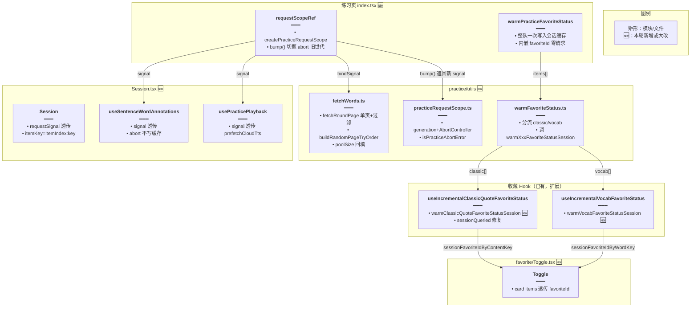
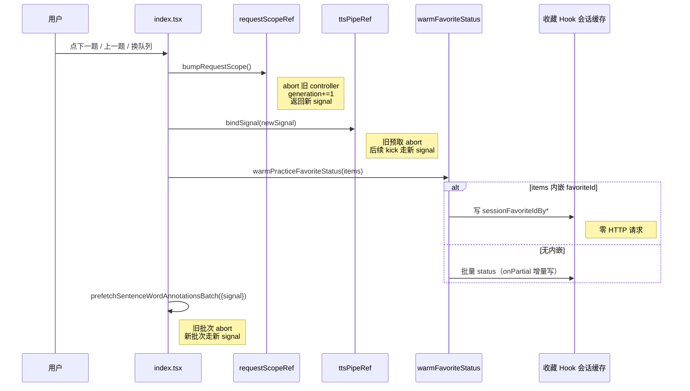

# 练习请求作用域与收藏预热

> 延伸阅读：[练习TTS批量预取管道.md](./练习TTS批量预取管道.md)（与本篇共用 `requestSignal`，切题同时取消 TTS 预取）、[TTS缓存复用全局Cache.md](./TTS缓存复用全局Cache.md)（后端 L2 与 batch abort）、[词库Cache超时旁路.md](./词库Cache超时旁路.md)、[收藏状态会话级缓存.md](./收藏状态会话级缓存.md)（本篇 `warmPracticeFavoriteStatus` 复用其会话级缓存）、[句内词标注缓存与批量标注.md](./句内词标注缓存与批量标注.md)（本篇 `signal` 传入标注 hook 与预热）、[句内词标注断连取消.md](./句内词标注断连取消.md)（后端对应侧的客户端断连 abort）、[练习报告多轮续练.md](./练习报告多轮续练.md)（续练 `excludeKeys` 现汇合 `sessionRounds`）。

## 1. 背景与目标

练习页（听写 / 拼写）此前存在两个用户可感知的性能与稳定性问题：

1. **切题 / 换队列时旧请求不取消**：上一题的句内词标注、云端 TTS 预取、收藏状态查询等仍在飞，与新题请求竞争带宽与 LLM 配额；旧请求回来后可能覆盖新题状态，造成 UI 抖动。
2. **每题挂载都打一次收藏 status**：练习队列里 N 个 item，每个 `Toggle` 挂载都会触发 `useIncrementalVocabFavoriteStatus` / `useIncrementalClassicQuoteFavoriteStatus` 调一次 status 接口；切题瞬间 N 次请求，慢且浪费配额。

此外在词表拉取侧，旧版 `fetchWords.ts` 的分页补全逻辑存在若干缺陷：库内同句多行被 `contentKey` 合并丢题、续练 `49/51` 假剩余、库内 `poolTotal` 未从 API 回填导致随机抽页失效。

本轮目标：

- 引入**练习请求作用域**（`practiceRequestScope`）：generation 计数 + `AbortController`，切题 / 换队列时 `bump()` 旧控制器、返回新 signal；所有练习期请求（标注、TTS、收藏预热）共享同一 signal。
- 引入**收藏预热**（`warmPracticeFavoriteStatus`）：开局一次性把整队 item 的 `favoriteId` / status 写入会话级缓存，`Toggle` 挂载即命中，零额外请求。
- 重构 `fetchWords.ts` 分页算法：库内按 `row.id` 作 key、随机页优先抽一未用页、末页不足仍返回、`poolSize` 从 API 回填，并补自检。

## 2. 改动范围

- `apps/frontend/src/views/englishLearning/practice/utils/practiceRequestScope.ts`（**新增**）
- `apps/frontend/src/views/englishLearning/practice/utils/warmFavoriteStatus.ts`（**新增**）
- `apps/frontend/src/hooks/useIncrementalClassicQuoteFavoriteStatus.ts`（新增 `warmClassicQuoteFavoriteStatusSession`、修 `sessionQueriedContentKeys` 一致性）
- `apps/frontend/src/hooks/useIncrementalVocabFavoriteStatus.ts`（新增 `warmVocabFavoriteStatusSession`）
- `apps/frontend/src/views/englishLearning/practice/utils/fetchWords.ts`（分页算法重构，库内按行 key、随机页优先、poolSize 回填、自检）
- `apps/frontend/src/views/englishLearning/practice/types.ts`（`PracticePaginatedPage.totalCount`、`SessionProps.requestSignal`）
- `apps/frontend/src/views/englishLearning/practice/index.tsx`（集成 `requestScopeRef` + `bumpRequestScope` + `warmPracticeFavoriteStatus` + 续练 `excludeKeys` 汇合 + URL 参数补全）
- `apps/frontend/src/views/englishLearning/components/favorite/Toggle.tsx`（透传 `favoriteId` 到 card items）
- `apps/frontend/src/views/englishLearning/practice/Session.tsx`（透传 `requestSignal` 到标注 hook / playback；`itemKey` 加 `itemIndex`）
- `apps/frontend/src/views/englishLearning/practice/hooks/usePracticePlayback.ts`（接 `signal` 透传到 `prefetchCloudTts`）

## 3. 实现思路

### 3.1 请求作用域：generation + AbortController

- **generation 计数**：每次 `bump()` 都 abort 旧控制器并新建一个，generation 自增；外部可通过 `scope.generation` 判断当前请求属于第几世代。
- **共享 signal**：练习期所有可取消请求（标注、TTS、收藏预热）共享 `scope.signal`，切题时一次 `bump()` 全部作废。
- **不 Toast abort**：`isPracticeAbortError` 识别 `AbortError` / `aborted` 文案，调用方 catch 时静默，避免「取消」误报为失败。
- **dispose**：离开 running（卸载 / 回 setup）时 `dispose()` 终结控制器，防止离开后还有飞请求写状态。
- **与 TTS 管道联动**：`bumpRequestScope` 同时调 `ttsPipeRef.current?.bindSignal(signal)`，让 TTS 预取管道也跟随切题取消（详见 [练习TTS批量预取管道.md](./练习TTS批量预取管道.md)）。

### 3.2 收藏预热：整队一次写入会话缓存

- **路径分流**：item 若内嵌 `favoriteId`（错题 / 收藏列表 / 库行带 `favoriteId`），直接写 `sessionFavoriteIdByContentKey` / `sessionFavoriteIdByWordKey`，零请求；否则调一次批量 status 接口，`onPartial` 增量写会话。
- **复用既有会话缓存**：`warmClassicQuoteFavoriteStatusSession` / `warmVocabFavoriteStatusSession` 复用 [收藏状态会话级缓存.md](./收藏状态会话级缓存.md) 的 `sessionQueriedContentKeys` / `sessionFavoriteIdByContentKey` 与 `bumpClassicFavoriteSession`，`Toggle` 挂载即命中。
- **失败回滚**：批量 status 失败时把刚加入 `sessionQueried*` 的 key 清掉，让后续 `Toggle` 仍可逐题兜底查询。
- **sessionQueried 一致性修复**：`useIncrementalClassicQuoteFavoriteStatus` 原逐题 status 在写 `queriedKeysRef` 时漏写 `sessionQueriedContentKeys`，导致切题 / 重挂载时同 key 仍会再查一次；本轮补齐。

### 3.3 fetchWords 分页算法重构

- **库内按行 key**：`vocabLibraryRowToItem` / `classicLibraryRowToItem` 用 `row.id` 覆盖 `item.key`，避免库内同 contentKey 多行被 `dedupeItems` 合并丢题（10 行变 9 行）。
- **随机页优先一未用页**：`buildRandomPageTryOrder(total, pageSize, usedPageIndices)` 从未用页里随机抽一页作首页，其余未用页作后备；命中页滤空（已练完）时依次试后续。
- **顺序续练按页递进**：`fetchContinueFromPaginated` 顺序模式从 `cursor.nextSequentialPageIndex` 起逐页试，命中即返回并推进 cursor；末页不足 `pageSize` 仍原样返回（`pageLimit` 已按 total 截断）。
- **poolSize 回填**：`PracticePaginatedPage` 新增 `totalCount?`，`fetchLibrary` 从 API 响应的 `library.wordCount` / `library.quoteCount` 取 poolSize；若 `resolvePoolTotal` 拿不到，先探一页（`fetchPage(0, 1)`）拿 `poolSize`。
- **续练 excludeKeys 汇合**：`onContinuePractice` 现把 `practicedKeys` + `sessionRounds` 所有结果 key 汇合作 `excludeKeys`，避免续练拉到已答题；items 为空且 `practiced < poolTotal` 时把 `config.poolTotal` 收齐为 `practiced`，消除 `49/51` 假剩余。

### 3.4 架构与数据流



**读图要点**：`requestScopeRef` 是练习页切题取消的总闸，`bump()` 一次同时取消标注 / TTS / 预热三类请求；`warmPracticeFavoriteStatus` 在开局 / 续练 / 重练错题 / resume 四处均调用，整队写入会话缓存后 `Toggle` 挂载零请求。

### 3.5 切题时序



**读图要点**：切题先 `bump` 再做后续请求；预热与标注预取共用新 signal；内嵌 `favoriteId` 时预热零请求。

## 4. 关键实现（改动前 / 改动后对比 + 注释）

### 4.1 `createPracticeRequestScope`（`apps/frontend/src/views/englishLearning/practice/utils/practiceRequestScope.ts`）

**对比范围**：纯新增文件，`PracticeRequestScope` 类型 + `createPracticeRequestScope` + `isPracticeAbortError` + `selfCheckPracticeRequestScope`。

**改动后** · `apps/frontend/src/views/englishLearning/practice/utils/practiceRequestScope.ts`（新增，约 L1–L62）

```typescript
// 文件头注释：练习听写取消域，切题 / 换队列 abort 旧世代请求
/**
 * 练习听写取消域：切题 / 换队列 abort 旧世代请求。
 */

// 请求作用域类型：暴露只读 generation / signal 与 bump / dispose 两个方法
export type PracticeRequestScope = {
	// 当前世代号：每次 bump 自增，外部可据此判断请求是否过期
	readonly generation: number;
	// 当前世代的 AbortSignal：所有练习期请求共享
	readonly signal: AbortSignal;
	// 切题或换队列：abort 旧控制器并换新，返回新 signal
	bump: () => AbortSignal;
	// 离开 running：abort；再次 bump 可重开
	dispose: () => void;
};

// 工厂：闭包持 generation 与 controller，返回带 bump / dispose 的作用域对象
export function createPracticeRequestScope(): PracticeRequestScope {
	// 世代号：初始 0，每次 bump +1
	let generation = 0;
	// 当前控制器：bump 时被 abort 并替换为新实例
	let controller = new AbortController();

	return {
		// 读 generation：返回当前世代号，外部判断请求是否属于当前世代
		get generation() {
			return generation;
		},
		// 读 signal：返回当前 controller 的 signal，供请求共享
		get signal() {
			return controller.signal;
		},
		// 切题 / 换队列：abort 旧 controller（若未 abort），换新 controller 并 generation+1
		bump() {
			// 旧 controller 未 abort 才 abort，避免重复 abort 产生噪音
			if (!controller.signal.aborted) {
				controller.abort();
			}
			// 新建 controller 作为当前世代控制器
			controller = new AbortController();
			// 世代号自增，标记进入新世代
			generation += 1;
			// 返回新 signal 给调用方绑定新请求
			return controller.signal;
		},
		// 离场：终结当前 controller，防止卸载后还有飞请求写状态
		dispose() {
			// 未 abort 才 abort，幂等
			if (!controller.signal.aborted) {
				controller.abort();
			}
		},
	};
}

// 判定是否为用户 / 世代取消：catch 时若命中则不 Toast，避免「取消」误报失败
export function isPracticeAbortError(err: unknown): boolean {
	// 非对象直接 false，避免原始值误判
	if (!err || typeof err !== 'object') return false;
	// 读 name：AbortError 是 fetch / axios 约定的取消错误名
	const name = (err as { name?: string }).name;
	if (name === 'AbortError') return true;
	// 兜底：message 含 aborted / AbortError 也算，兼容各厂商 SDK 文案
	const msg = String((err as { message?: unknown }).message ?? '');
	return /aborted|AbortError/i.test(msg);
}

// 自检：验证 bump 旧 signal 已 abort、新 signal 未 abort、generation 递增、dispose 终结
export function selfCheckPracticeRequestScope(): void {
	// 建一个作用域，跑一遍 bump / dispose 验证状态机
	const scope = createPracticeRequestScope();
	// 取初始 signal，bump 后应被 abort
	const s1 = scope.signal;
	// bump 返回新 signal，s1 应 abort、s2 未 abort、generation=1
	const s2 = scope.bump();
	// 三个断言任一不满足即抛错，提示状态机被破坏
	if (!s1.aborted || s2.aborted || scope.generation !== 1) {
		throw new Error('practiceRequestScope bump failed');
	}
	// dispose 后 s2 应被 abort
	scope.dispose();
	// 验证 dispose 真的 abort 了当前 controller
	if (!s2.aborted) {
		throw new Error('practiceRequestScope dispose failed');
	}
}
```

**变更摘要**：纯新增；闭包维护 generation + controller，`bump()` 旧 abort 新建、`dispose()` 终结；`isPracticeAbortError` 统一识别取消错误避免误 Toast。

### 4.2 `warmPracticeFavoriteStatus`（`apps/frontend/src/views/englishLearning/practice/utils/warmFavoriteStatus.ts`）

**对比范围**：纯新增文件，`warmPracticeFavoriteStatus` 单函数。

**改动后** · `apps/frontend/src/views/englishLearning/practice/utils/warmFavoriteStatus.ts`（新增，约 L1–L24）

```typescript
// 文件头注释：练习开局预热收藏状态，整队一次（或吃内嵌 favoriteId），避免 Session Toggle 逐题打 status
/**
 * 练习开局预热收藏状态：整队一次（或吃内嵌 favoriteId），避免 Session Toggle 逐题打 status。
 */
// 导入经典句会话预热：写 sessionFavoriteIdByContentKey
import { warmClassicQuoteFavoriteStatusSession } from '@/hooks/useIncrementalClassicQuoteFavoriteStatus';
// 导入单词会话预热：写 sessionFavoriteIdByWordKey
import { warmVocabFavoriteStatusSession } from '@/hooks/useIncrementalVocabFavoriteStatus';
// 导入练习 item 类型，用于参数签名
import type { PracticeItem } from '../types';
// 导入类型守卫：区分 classic / vocab item
import { isPracticeClassicItem, isPracticeVocabItem } from './item';

// 预热入口：按 item 类型分流，classic 走经典句会话预热、vocab 走单词会话预热
export function warmPracticeFavoriteStatus(items: PracticeItem[]): void {
	// 筛出经典句 item 并映射为 { english, favoriteId? }，供会话预热消费
	const classic = items.filter(isPracticeClassicItem).map((it) => ({
		// 英文正文作为 contentKey 来源
		english: it.english,
		// 若 item 内嵌 favoriteId 则带上，预热可零请求写入会话
		...('favoriteId' in it ? { favoriteId: it.favoriteId } : {}),
	}));
	// 筛出单词 item 并映射为 { word, favoriteId? }
	const vocab = items.filter(isPracticeVocabItem).map((it) => ({
		// 单词作为 wordKey 来源
		word: it.word,
		// 同上：内嵌 favoriteId 时透传
		...('favoriteId' in it ? { favoriteId: it.favoriteId } : {}),
	}));
	// 有经典句才预热，避免空数组触发无意义请求
	if (classic.length > 0) {
		// void 不 await：预热失败由内部回滚兜底，不阻塞练习开局
		void warmClassicQuoteFavoriteStatusSession(classic);
	}
	// 有单词才预热
	if (vocab.length > 0) {
		// 同上：异步预热，不阻塞
		void warmVocabFavoriteStatusSession(vocab);
	}
}
```

**变更摘要**：纯新增；按 item 类型分流到两个会话预热函数，内嵌 `favoriteId` 时透传以支持零请求路径。

### 4.3 `warmClassicQuoteFavoriteStatusSession`（`apps/frontend/src/hooks/useIncrementalClassicQuoteFavoriteStatus.ts`）

**对比范围**：新增的 `warmClassicQuoteFavoriteStatusSession` 全函数（含内嵌 `favoriteId` 与批量 status 两条路径）；以及上方 `useIncrementalClassicQuoteFavoriteStatus` 内 `sessionQueriedContentKeys` 一致性修复（两处小改）。

**改动前** · `apps/frontend/src/hooks/useIncrementalClassicQuoteFavoriteStatus.ts`（基线，约 L290–L310 `useIncrementalClassicQuoteFavoriteStatus` 内逐题 status 段）

```typescript
// 旧版逐题 status：写 queriedKeysRef 但漏写 sessionQueriedContentKeys，切题/重挂载会重复查
						const ck = classicQuoteFavoriteContentKey(item.english);
						if (!ck || queriedKeysRef.current.has(ck)) continue;
						// 仅写 queriedKeysRef，未写会话级 set，导致同 key 跨挂载仍会再查
						queriedKeysRef.current.add(ck);
						englishesToQuery.push(item.english);
					}
					if (englishesToQuery.length === 0) return;
```

**改动后** · `apps/frontend/src/hooks/useIncrementalClassicQuoteFavoriteStatus.ts`（当前，约 L290–L296 同段）

```typescript
// 新版：补写 sessionQueriedContentKeys，与会话级缓存对齐，切题/重挂载不再重复查
						const ck = classicQuoteFavoriteContentKey(item.english);
						if (!ck || queriedKeysRef.current.has(ck)) continue;
						// 与 vocab 一致：未收藏也记入会话，避免切题/重挂载重复打 status
						queriedKeysRef.current.add(ck);
						// 新增：同步写会话级 set，保证后续 Toggle / 预热命中会话
						sessionQueriedContentKeys.add(ck);
						englishesToQuery.push(item.english);
					}
					if (englishesToQuery.length === 0) return;
```

**变更摘要**：补一行 `sessionQueriedContentKeys.add(ck)`，与 vocab hook 对齐；下方失败回滚处也同步 `sessionQueriedContentKeys.delete(ck)`。

**改动后** · `apps/frontend/src/hooks/useIncrementalClassicQuoteFavoriteStatus.ts`（新增，约 L377–L427 `warmClassicQuoteFavoriteStatusSession` 全函数）

```typescript
// 会话预热：整队一次写入会话收藏缓存（有内嵌 favoriteId 则不打接口，否则一批 status）
/**
 * 练习开局：整队一次写入会话收藏缓存（有内嵌 favoriteId 则不打接口，否则一批 status）。
 * Toggle 逐题挂载时即可命中会话，避免每切一句打一次 status。
 */
export async function warmClassicQuoteFavoriteStatusSession(
	// 入参：只读数组，每项至少有 english，可能带 favoriteId
	items: ReadonlyArray<ClassicFavoriteListItem>,
): Promise<void> {
	// 空数组直接返回，避免无意义请求
	if (items.length === 0) return;

	// 内嵌 favoriteId 路径：错题/收藏列表/库行带 favoriteId 时走这条，零 HTTP 请求
	if (itemsEmbedFavoriteId(items)) {
		// 遍历整队，把 favoriteId 直接写会话缓存
		for (const item of items) {
			// 算 contentKey，作为会话缓存主键
			const ck = classicQuoteFavoriteContentKey(item.english);
			// 无 ck 或 item 无 favoriteId 字段则跳过（类型收窄）
			if (!ck || !('favoriteId' in item)) continue;
			// 标记已查会话，避免后续 Toggle 重复打接口
			sessionQueriedContentKeys.add(ck);
			if (item.favoriteId) {
				// 有收藏：写 favoriteId 到会话缓存，Toggle 命中即收藏态
				sessionFavoriteIdByContentKey.set(ck, item.favoriteId);
			} else {
				// 无收藏：删会话缓存里同 key 的旧 favoriteId，Toggle 命中即未收藏
				sessionFavoriteIdByContentKey.delete(ck);
			}
		}
		// bump revision：通知订阅方会话缓存已变，Toggle 立即重渲染
		bumpClassicFavoriteSession();
		return;
	}

	// 无内嵌 favoriteId 路径：批量查一次 status 接口
	const need: string[] = [];
	// 遍历整队，挑出会话缓存未命中的 english
	for (const item of items) {
		// 算 contentKey
		const ck = classicQuoteFavoriteContentKey(item.english);
		// 已查过的跳过，避免重复请求
		if (!ck || sessionQueriedContentKeys.has(ck)) continue;
		// 标记已查，请求期间不再重复加入
		sessionQueriedContentKeys.add(ck);
		// 收集待查 english
		need.push(item.english);
	}
	// 全命中会话则无需请求
	if (need.length === 0) return;

	try {
		// 批量查 status，onPartial 增量写会话缓存（流式响应可分批返回）
		await fetchEnglishClassicQuoteFavoriteStatus(need, {
			// onPartial：每批返回 refs，逐条写 favoriteId 到会话缓存
			onPartial: (refs) => {
				// 遍历本批 refs
				for (const r of refs) {
					// 写 favoriteId（含 null：未收藏），Toggle 命中即用
					sessionFavoriteIdByContentKey.set(r.contentKey, r.id);
				}
				// 分批返回时也 bump，让已挂载 Toggle 尽快反映最新态
				bumpClassicFavoriteSession();
			},
		});
		// 全部返回后再 bump 一次，确保最后一批写入也通知到订阅方
		bumpClassicFavoriteSession();
	} catch {
		// 失败回滚：把刚加入 sessionQueriedContentKeys 的 key 清掉
		for (const english of need) {
			// 算 ck
			const ck = classicQuoteFavoriteContentKey(english);
			// 删除会话标记，让后续 Toggle 仍可逐题兜底查询
			if (ck) sessionQueriedContentKeys.delete(ck);
		}
	}
}
```

**变更摘要**：新增会话预热函数；内嵌 `favoriteId` 走零请求路径直写会话缓存，否则批量查 status 并 `onPartial` 增量写入；失败回滚 `sessionQueriedContentKeys` 让 Toggle 兜底。

### 4.4 `warmVocabFavoriteStatusSession`（`apps/frontend/src/hooks/useIncrementalVocabFavoriteStatus.ts`）

**对比范围**：新增的 `warmVocabFavoriteStatusSession` 全函数（与 4.3 经典句版对称）。

**改动后** · `apps/frontend/src/hooks/useIncrementalVocabFavoriteStatus.ts`（新增，约 L383–L431 `warmVocabFavoriteStatusSession` 全函数）

```typescript
// 单词会话预热：整队一次写入会话收藏缓存，避免逐题 Toggle 打 status
/** 练习开局：整队一次写入会话收藏缓存，避免逐题 Toggle 打 status */
export async function warmVocabFavoriteStatusSession(
	// 入参：只读数组，每项至少有 word，可能带 favoriteId
	items: ReadonlyArray<VocabFavoriteListItem>,
): Promise<void> {
	// 空数组直接返回
	if (items.length === 0) return;

	// 内嵌 favoriteId 路径：零 HTTP 请求
	if (itemsEmbedFavoriteId(items)) {
		// 遍历整队写会话缓存
		for (const item of items) {
			// 算 wordKey 作为会话缓存主键
			const wk = normalizeEnglishVocabWordKey(item.word);
			// 无 wk 或无 favoriteId 字段跳过
			if (!wk || !('favoriteId' in item)) continue;
			// 标记已查会话
			sessionQueriedWordKeys.add(wk);
			if (item.favoriteId) {
				// 有收藏：写 favoriteId
				sessionFavoriteIdByWordKey.set(wk, item.favoriteId);
			} else {
				// 无收藏：删旧 favoriteId
				sessionFavoriteIdByWordKey.delete(wk);
			}
		}
		// bump revision 通知订阅方
		bumpVocabFavoriteSession();
		return;
	}

	// 无内嵌 favoriteId 路径：批量查 status
	const need: string[] = [];
	// 挑出会话缓存未命中的 word
	for (const item of items) {
		// 算 wordKey
		const wk = normalizeEnglishVocabWordKey(item.word);
		// 已查过的跳过
		if (!wk || sessionQueriedWordKeys.has(wk)) continue;
		// 标记已查
		sessionQueriedWordKeys.add(wk);
		// 收集待查 word
		need.push(item.word);
	}
	// 全命中会话则无需请求
	if (need.length === 0) return;

	try {
		// 批量查 status，onPartial 增量写会话缓存
		await fetchEnglishVocabularyFavoriteStatus(need, {
			// onPartial：每批返回 refs，逐条写 favoriteId
			onPartial: (refs) => {
				// 遍历本批 refs
				for (const r of refs) {
					// 写 favoriteId（含 null：未收藏）
					sessionFavoriteIdByWordKey.set(r.wordKey, r.id);
				}
				// 分批返回时 bump，让已挂载 Toggle 反映最新态
				bumpVocabFavoriteSession();
			},
		});
		// 全部返回后再 bump 一次
		bumpVocabFavoriteSession();
	} catch {
		// 失败回滚：清掉刚加入的 sessionQueriedWordKeys
		for (const word of need) {
			// 算 wk
			const wk = normalizeEnglishVocabWordKey(word);
			// 删除会话标记，让 Toggle 兜底
			if (wk) sessionQueriedWordKeys.delete(wk);
		}
	}
}
```

**变更摘要**：与经典句版对称；内嵌 `favoriteId` 走零请求，否则批量查 status 并 `onPartial` 增量写入；失败回滚 `sessionQueriedWordKeys`。

### 4.5 `fetchRoundPage` 与 `buildRandomPageTryOrder`（`apps/frontend/src/views/englishLearning/practice/utils/fetchWords.ts`）

**对比范围**：`buildRandomPageTryOrder`（旧版多函数合并简化）+ `fetchRoundPage`（新增单页拉取）+ 旧版 `pickRandomPageIndex` / `pickRandomPageIndexExcluding` / `cursorAfterPages` / `collectSessionFromPaginatedPages` / `buildSequentialPageTryOrder` / `buildContinueRandomPageTryOrder` 等被删除的辅助函数。因旧版被删函数较多且新版函数职责清晰，这里成对展示「旧版随机页挑选 + 旧版批量补全」与「新版随机页挑选 + 新版单页拉取」。

**改动前** · `apps/frontend/src/views/englishLearning/practice/utils/fetchWords.ts`（基线，约 L168–L285 旧版随机页挑选 + 批量补全）

```typescript
// 旧版随机抽一页：仅返回一个 pageIndex，无后备列表
function pickRandomPageIndex(total: number, pageSize: number): number {
	// 算总页数
	const pageCount = getPageCount(total, pageSize);
	// 只一页直接返 0
	if (pageCount <= 1) return 0;
	// 随机抽一页
	return Math.floor(Math.random() * pageCount);
}

// 旧版排除已用页后随机抽一：无可用页返 null
function pickRandomPageIndexExcluding(
	total: number,
	pageSize: number,
	used: number[],
): number | null {
	// 算总页数
	const pageCount = getPageCount(total, pageSize);
	// 只一页直接返 0
	if (pageCount <= 1) return 0;
	// 已用页集合
	const usedSet = new Set(used);
	// 收集未用页
	const available: number[] = [];
	for (let i = 0; i < pageCount; i += 1) {
		// 未用才加入
		if (!usedSet.has(i)) available.push(i);
	}
	// 无未用页返 null
	if (available.length === 0) return null;
	// 随机抽一个未用页
	return available[Math.floor(Math.random() * available.length)]!;
}

// 旧版批量从多页补全一队：循环 pageIndices 直到凑够 pageSize
async function collectSessionFromPaginatedPages(
	fetchPage: (offset: number, limit: number) => Promise<PracticePaginatedPage>,
	total: number,
	pageSize: number,
	pageIndices: readonly number[],
	order: PracticeOrder,
	cursor: PracticeSessionCursor,
	excludeKeys: ReadonlySet<string>,
): Promise<PracticeSessionFetchResult | null> {
	// 累加器
	const acc: PracticeItem[] = [];
	// 命中页记录
	const hitPages: number[] = [];

	for (const pageIndex of pageIndices) {
		// 凑够 pageSize 就停
		if (acc.length >= pageSize) break;
		// 拉一页
		const page = await fetchPage(
			pageOffset(pageIndex, pageSize),
			pageLimit(pageIndex, pageSize, total),
		);
		// 排除集：已练 key + 本队已收 key
		const exclude = new Set(excludeKeys);
		for (const item of acc) {
			// 本队已收也排除，避免同队重复
			if (item.key) exclude.add(item.key);
		}
		// 过滤已练并截到剩余需要的数量
		const chunk = filterUnpracticed(
			dedupeItems(page.items),
			exclude,
			pageSize - acc.length,
		);
		if (chunk.length > 0) {
			// 记命中页
			hitPages.push(pageIndex);
			// 累加
			acc.push(...chunk);
		}
	}

	// 空队或无命中页返 null
	if (acc.length === 0 || hitPages.length === 0) return null;
	return {
		// 截到 pageSize
		items: acc.slice(0, pageSize),
		// 按 order 推进 cursor
		cursor: cursorAfterPages(order, hitPages, cursor),
	};
}
```

**改动后** · `apps/frontend/src/views/englishLearning/practice/utils/fetchWords.ts`（当前，约 L170–L222 新版随机页挑选 + 单页拉取）

```typescript
// 新版随机页挑选：从未用页里抽一页作首页，其余未用页作后备
/** 随机：优先抽一页，其余未用页作后备（命中页滤空时再用） */
function buildRandomPageTryOrder(
	total: number,
	pageSize: number,
	// 已用页集合，续练时传入避免重复抽
	usedPageIndices: ReadonlySet<number> = new Set(),
): number[] {
	// 算总页数
	const pageCount = getPageCount(total, pageSize);
	// 收集未用页
	const unused: number[] = [];
	for (let i = 0; i < pageCount; i += 1) {
		// 未用才加入
		if (!usedPageIndices.has(i)) unused.push(i);
	}
	// 全用完返空数组，调用方据此知道无未用页
	if (unused.length === 0) return [];
	// 随机选一个未用页作首页
	const firstIdx = Math.floor(Math.random() * unused.length);
	// 取出首页 pageIndex
	const first = unused[firstIdx]!;
	// 其余未用页作后备，保留原序
	const rest = unused.filter((_, i) => i !== firstIdx);
	// 返回 [首页, 后备页...]
	return [first, ...rest];
}

// 新增单页拉取：拉一页并按已练 key 过滤，末页不足 pageSize 原样返回
/** 拉一页并按已练 key 过滤；不足 pageSize 的末页原样返回 */
async function fetchRoundPage(
	// 拉页回调
	fetchPage: (offset: number, limit: number) => Promise<PracticePaginatedPage>,
	total: number,
	pageSize: number,
	// 当前要拉的页号
	pageIndex: number,
	excludeKeys: ReadonlySet<string>,
): Promise<PracticeItem[]> {
	// 算本页 limit：末页按 total 截断，可能 < pageSize
	const limit = pageLimit(pageIndex, pageSize, total);
	// limit<=0 说明页号越界，直接返空
	if (limit <= 0) return [];
	// 拉一页
	const page = await fetchPage(pageOffset(pageIndex, pageSize), limit);
	// 去重 + 按已练过滤，截到 pageSize（末页可不足）
	return filterUnpracticed(dedupeItems(page.items), excludeKeys, pageSize);
}
```

**变更摘要**：删 6 个旧辅助函数（`pickRandomPageIndex` 等），合并为 `buildRandomPageTryOrder`（一次返回首页+后备）+ `fetchRoundPage`（单页拉取+过滤）；逻辑从「预生成 tryOrder 后批量补全」改为「逐页试，命中即停」。

### 4.6 `fetchInitialFromPaginated` / `fetchContinueFromPaginated`（`apps/frontend/src/views/englishLearning/practice/utils/fetchWords.ts`）

**对比范围**：首轮与续练两个入口函数，均改为逐页试 + `shufflePracticeItems`。

**改动前** · `apps/frontend/src/views/englishLearning/practice/utils/fetchWords.ts`（基线，约 L349–L405 首轮 + 续练）

```typescript
// 旧版首轮：预生成 tryOrder（顺序或随机），调 collectSessionFromPaginatedPages 批量补全
async function fetchInitialFromPaginated(
	fetchPage: (offset: number, limit: number) => Promise<PracticePaginatedPage>,
	total: number,
	count: PracticeCountOption,
	order: PracticeOrder,
): Promise<PracticeSessionFetchResult> {
	// 算每轮题量
	const pageSize = sessionPageSize(count, total);
	// 算总页数
	const pageCount = getPageCount(total, pageSize);
	// 顺序：[0,1,2,...]；随机：首页随机+其余作后备
	const pageIndices =
		order === 'random'
			? buildRandomPageTryOrder(total, pageSize)
			: buildSequentialPageTryOrder(pageCount);
	// 批量补全一队
	const result = await collectSessionFromPaginatedPages(
		fetchPage,
		total,
		pageSize,
		pageIndices,
		order,
		// 首轮空 cursor
		emptyCursor(),
		// 首轮无已练
		new Set(),
	);
	// 补全失败返空队+空 cursor
	return result ?? { items: [], cursor: emptyCursor() };
}

// 旧版续练：同上，预生成 tryOrder 后批量补全
async function fetchContinueFromPaginated(
	fetchPage: (offset: number, limit: number) => Promise<PracticePaginatedPage>,
	total: number,
	count: PracticeCountOption,
	order: PracticeOrder,
	cursor: PracticeSessionCursor,
	excludeKeys: ReadonlySet<string>,
): Promise<PracticeSessionFetchResult> {
	// 算每轮题量
	const pageSize = sessionPageSize(count, total);
	// 排除集
	const exclude = new Set(excludeKeys);

	// 顺序：从 cursor.nextSequentialPageIndex 起的所有页
	// 随机：先抽一未用页，再补其余
	const pageIndices =
		order === 'sequential'
			? Array.from(
					{ length: Math.max(0, pageCount - cursor.nextSequentialPageIndex) },
					(_, i) => cursor.nextSequentialPageIndex + i,
				)
			: buildContinueRandomPageTryOrder(total, pageSize, cursor);

	// 批量补全
	const result = await collectSessionFromPaginatedPages(
		fetchPage,
		total,
		pageSize,
		pageIndices,
		order,
		cursor,
		exclude,
	);
	// 失败返空队+原 cursor
	return result ?? { items: [], cursor };
}

// 旧版空 cursor 工厂
function emptyCursor(): PracticeSessionCursor {
	return { nextSequentialPageIndex: 0, usedRandomPageIndices: [] };
}
```

**改动后** · `apps/frontend/src/views/englishLearning/practice/utils/fetchWords.ts`（当前，约 L269–L386 首轮 + 续练 + 空 cursor）

```typescript
// 新增空 cursor 工厂（从下方上移，供首轮 / 续练共用）
function emptyCursor(): PracticeSessionCursor {
	// 顺序从第 0 页起，随机无已用页
	return { nextSequentialPageIndex: 0, usedRandomPageIndices: [] };
}

// 新版首轮：顺序拉第 0 页；随机逐页试未用页，命中即停并 shuffle
/** 首轮：顺序 = 第 0 页；随机 = 抽一未用页 */
async function fetchInitialFromPaginated(
	fetchPage: (offset: number, limit: number) => Promise<PracticePaginatedPage>,
	total: number,
	count: PracticeCountOption,
	order: PracticeOrder,
): Promise<PracticeSessionFetchResult> {
	// 算每轮题量
	const pageSize = sessionPageSize(count, total);
	// pageSize<=0 说明题量 0 或池空，直接返空
	if (pageSize <= 0) return { items: [], cursor: emptyCursor() };

	if (order === 'sequential') {
		// 顺序：只拉第 0 页，末页不足仍返回
		const items = await fetchRoundPage(
			fetchPage,
			total,
			pageSize,
			// 第 0 页
			0,
			// 首轮无已练
			new Set(),
		);
		return {
			items,
			// cursor 推进到第 1 页
			cursor: {
				nextSequentialPageIndex: 1,
				usedRandomPageIndices: [],
			},
		};
	}

	// 随机：构建未用页 tryOrder（首轮无已用页）
	const tryOrder = buildRandomPageTryOrder(total, pageSize);
	// 逐页试，命中即停
	for (const pageIndex of tryOrder) {
		// 拉一页并过滤
		const items = await fetchRoundPage(
			fetchPage,
			total,
			pageSize,
			pageIndex,
			// 首轮无已练
			new Set(),
		);
		// 当前页滤空（极少见）则试下一未用页
		if (items.length === 0) continue;
		return {
			// 随机页内再打乱，避免同页固定顺序
			items: shufflePracticeItems(items),
			cursor: {
				nextSequentialPageIndex: 0,
				// 记已用页
				usedRandomPageIndices: [pageIndex],
			},
		};
	}
	// 所有页都滤空
	return { items: [], cursor: emptyCursor() };
}

// 新版续练：顺序逐页递进；随机抽未用页，命中即停
/**
 * 续练：顺序下一页；随机抽未用页。
 * 末页不足每轮题量仍返回；当前页滤空则跳过再试。
 */
async function fetchContinueFromPaginated(
	fetchPage: (offset: number, limit: number) => Promise<PracticePaginatedPage>,
	total: number,
	count: PracticeCountOption,
	order: PracticeOrder,
	cursor: PracticeSessionCursor,
	excludeKeys: ReadonlySet<string>,
): Promise<PracticeSessionFetchResult> {
	// 算每轮题量
	const pageSize = sessionPageSize(count, total);
	// 算总页数
	const pageCount = getPageCount(total, pageSize);
	// 题量 0 或池空直接返空
	if (pageSize <= 0 || pageCount <= 0) return { items: [], cursor };

	// 排除集
	const exclude = new Set(excludeKeys);

	if (order === 'sequential') {
		// 顺序：从 cursor.nextSequentialPageIndex 起逐页试
		let pageIndex = Math.max(0, cursor.nextSequentialPageIndex);
		while (pageIndex < pageCount) {
			// 拉一页并按已练过滤
			const items = await fetchRoundPage(
				fetchPage,
				total,
				pageSize,
				pageIndex,
				exclude,
			);
			// cursor 推进到下一页
			const nextCursor: PracticeSessionCursor = {
				nextSequentialPageIndex: pageIndex + 1,
				usedRandomPageIndices: cursor.usedRandomPageIndices,
			};
			// 命中即返回
			if (items.length > 0) return { items, cursor: nextCursor };
			// 当前页滤空（已练完），试下一页
			pageIndex += 1;
		}
		// 所有后续页都滤空
		return { items: [], cursor };
	}

	// 随机：从已用页集合排除后抽未用页
	const used = new Set(cursor.usedRandomPageIndices);
	// 构建 tryOrder：首页随机，其余未用页作后备
	const tryOrder = buildRandomPageTryOrder(total, pageSize, used);
	for (const pageIndex of tryOrder) {
		// 拉一页并过滤
		const items = await fetchRoundPage(
			fetchPage,
			total,
			pageSize,
			pageIndex,
			exclude,
		);
		// 标记本页已用（无论是否命中）
		used.add(pageIndex);
		// 滤空则试下一未用页
		if (items.length === 0) continue;
		return {
			// 随机页内再打乱
			items: shufflePracticeItems(items),
			cursor: {
				nextSequentialPageIndex: cursor.nextSequentialPageIndex,
				// 返回更新后的已用页列表
				usedRandomPageIndices: [...used],
			},
		};
	}
	// 所有未用页都滤空
	return {
		items: [],
		cursor: {
			nextSequentialPageIndex: cursor.nextSequentialPageIndex,
			usedRandomPageIndices: [...used],
		},
	};
}
```

**变更摘要**：首轮 / 续练从「预生成 tryOrder + 批量补全」改为「逐页试 + 命中即停」；随机页命中后 `shufflePracticeItems` 打乱页内顺序；末页不足 `pageSize` 仍原样返回。

### 4.7 `vocabLibraryRowToItem` / `classicLibraryRowToItem` 库内按行 key（`apps/frontend/src/views/englishLearning/practice/utils/fetchWords.ts`）

**对比范围**：两个库行→item 映射函数，新增用 `row.id` 覆盖 `item.key`。

**改动前** · `apps/frontend/src/views/englishLearning/practice/utils/fetchWords.ts`（基线，约 L87–L101 + L123–L133）

```typescript
// 旧版：直接返回 toPracticeVocabItem 结果，key 走 contentKey，库内同词多行会被合并
function vocabLibraryRowToItem(
	row: EnglishVocabularyLibraryItemRow,
): PracticeItem {
	// 直接返回，key=contentKey
	return toPracticeVocabItem(row.word, {
		ipa: row.ipa,
		pos: row.pos,
		segmentation: row.segmentation,
		definition: row.definition,
		example: row.example,
		favoriteId: row.favoriteId ?? null,
	});
}

// 旧版经典句：同上，key=contentKey，同句多行合并丢题
function classicLibraryRowToItem(
	row: EnglishClassicQuotesLibraryItemRow,
): PracticeItem {
	// 直接返回
	return toPracticeClassicItem({
		english: row.english,
		translationZh: row.translationZh,
		source: row.source,
		noteZh: row.noteZh,
		favoriteId: row.favoriteId ?? null,
	});
}
```

**改动后** · `apps/frontend/src/views/englishLearning/practice/utils/fetchWords.ts`（当前，约 L89–L103 + L129–L141）

```typescript
// 新版：先 toPracticeVocabItem 再用 row.id 覆盖 key，保证库内按行练习
function vocabLibraryRowToItem(
	row: EnglishVocabularyLibraryItemRow,
): PracticeItem {
	// 先构 item，key 走 contentKey（会被下行覆盖）
	const item = toPracticeVocabItem(row.word, {
		ipa: row.ipa,
		pos: row.pos,
		segmentation: row.segmentation,
		definition: row.definition,
		example: row.example,
		favoriteId: row.favoriteId ?? null,
	});
	// 库内按行练习：与 wordCount 对齐，避免同词多行被 contentKey 合并
	return { ...item, key: row.id };
}

// 新版经典句：同上，用 row.id 覆盖 key
function classicLibraryRowToItem(
	row: EnglishClassicQuotesLibraryItemRow,
): PracticeItem {
	// 先构 item
	const item = toPracticeClassicItem({
		english: row.english,
		translationZh: row.translationZh,
		source: row.source,
		noteZh: row.noteZh,
		favoriteId: row.favoriteId ?? null,
	});
	// 库内按行练习：与 quoteCount 对齐，避免同句多行被 contentKey 合并丢题
	return { ...item, key: row.id };
}
```

**变更摘要**：库内行 item 的 `key` 从 `contentKey` 改为 `row.id`，确保库内同 contentKey 多行不被 `dedupeItems` 合并丢题。

### 4.8 `fetchLibrary` poolSize 回填（`apps/frontend/src/views/englishLearning/practice/utils/fetchWords.ts`）

**对比范围**：`fetchLibrary` 函数，新增从 API 响应回填 `poolSize`、探页兜底、`pageFetch` 适配。

**改动前** · `apps/frontend/src/views/englishLearning/practice/utils/fetchWords.ts`（基线，约 L518–L548）

```typescript
// 旧版：依赖传入 poolTotal，拿不到直接返空；fetchPage 只返回 items
async function fetchLibrary(
	ctx: PracticeFetchContext,
	poolTotal: number | undefined,
	count: PracticeCountOption,
	order: PracticeOrder,
	cursor?: PracticeSessionCursor,
	excludeKeys: ReadonlySet<string> = new Set(),
): Promise<PracticeSessionFetchResult> {
	// 库 id
	const libraryId = ctx.libraryId?.trim();
	// 无库 id 返空
	if (!libraryId) return { items: [], cursor: emptyCursor() };

	// 旧版：poolTotal 拿不到直接返空，不探页
	const total = resolvePoolTotal(ctx, poolTotal);
	if (total == null) return { items: [], cursor: emptyCursor() };

	// 拉页回调：只返回 items，不回填 poolSize
	const fetchPage = async (offset: number, limit: number) => {
		if (ctx.contentKind === 'classic') {
			// 经典句库分页
			const res = await listEnglishClassicQuotesLibraryItems(libraryId, {
				limit,
				offset,
				silent: true,
			});
			// 只返回 items
			return { items: (res.data?.items ?? []).map(classicLibraryRowToItem) };
		}
		// 单词库分页
		const res = await listEnglishVocabularyLibraryItems(libraryId, {
			limit,
			offset,
			silent: true,
		});
		// 只返回 items
		return { items: (res.data?.items ?? []).map(vocabLibraryRowToItem) };
	};

	if (cursor) {
		// 续练
		return fetchContinueFromPaginated(
			fetchPage,
			total,
			count,
			order,
			cursor,
			excludeKeys,
		);
	}
	// 首轮
	return fetchInitialFromPaginated(fetchPage, total, count, order);
}
```

**改动后** · `apps/frontend/src/views/englishLearning/practice/utils/fetchWords.ts`（当前，约 L518–L572）

```typescript
// 新版：fetchPage 回填 poolSize；poolTotal 拿不到时探一页兜底；pageFetch 适配新签名
async function fetchLibrary(
	ctx: PracticeFetchContext,
	poolTotal: number | undefined,
	count: PracticeCountOption,
	order: PracticeOrder,
	cursor?: PracticeSessionCursor,
	excludeKeys: ReadonlySet<string> = new Set(),
): Promise<PracticeSessionFetchResult> {
	// 库 id
	const libraryId = ctx.libraryId?.trim();
	// 无库 id 返空
	if (!libraryId) return { items: [], cursor: emptyCursor() };

	// 拉页回调：返回 items + poolSize（库元数据里的 wordCount/quoteCount）
	const fetchPage = async (offset: number, limit: number) => {
		if (ctx.contentKind === 'classic') {
			// 经典句库分页
			const res = await listEnglishClassicQuotesLibraryItems(libraryId, {
				limit,
				offset,
				silent: true,
			});
			// 返回 items + library.quoteCount 作为 poolSize
			return {
				items: (res.data?.items ?? []).map(classicLibraryRowToItem),
				poolSize: res.data?.library?.quoteCount,
			};
		}
		// 单词库分页
		const res = await listEnglishVocabularyLibraryItems(libraryId, {
			limit,
			offset,
			silent: true,
		});
		// 返回 items + library.wordCount 作为 poolSize
		return {
			items: (res.data?.items ?? []).map(vocabLibraryRowToItem),
			poolSize: res.data?.library?.wordCount,
		};
	};

	// poolTotal 兜底：拿不到时探一页（limit=1）取 poolSize
	let total = resolvePoolTotal(ctx, poolTotal);
	if (total == null) {
		// 探一页，只为拿 poolSize
		const probe = await fetchPage(0, 1);
		// 用 poolSize 作 total
		total =
			typeof probe.poolSize === 'number' && probe.poolSize > 0
				? probe.poolSize
				: undefined;
		// 回写 ctx，避免后续重复探页
		if (total != null) resolvePoolTotal(ctx, total);
	}
	// 仍拿不到返空
	if (total == null) return { items: [], cursor: emptyCursor() };

	// pageFetch：剥掉 poolSize，适配 fetchRoundPage 的 PracticePaginatedPage 签名
	const pageFetch = async (offset: number, limit: number) => {
		// 拉一页
		const page = await fetchPage(offset, limit);
		// 只返回 items
		return { items: page.items };
	};

	if (cursor) {
		// 续练
		return fetchContinueFromPaginated(
			pageFetch,
			total,
			count,
			order,
			cursor,
			excludeKeys,
		);
	}
	// 首轮
	return fetchInitialFromPaginated(pageFetch, total, count, order);
}
```

**变更摘要**：`fetchPage` 回填 `poolSize`；`poolTotal` 拿不到时探一页兜底；新增 `pageFetch` 剥掉 `poolSize` 适配新签名。

### 4.9 `EnglishLearningPracticePage` 集成（`apps/frontend/src/views/englishLearning/practice/index.tsx`）

**对比范围**：`EnglishLearningPracticePage` 组件内：新增 `requestScopeRef` / `requestSignal` / `bumpRequestScope`；`onStarted` / `onRetryWrong` / `onContinuePractice` / `onResume` / `onGoPrevious` / `onGoNext` 集成 `bump` + `warm`；`onContinuePractice` 的 `excludeKeys` 汇合 + `poolTotal` 收齐；`onResume` 的 URL 参数补全。因组件很大，分多组对比。

#### 4.9.1 请求作用域 ref + bumpRequestScope

**改动前** · `apps/frontend/src/views/englishLearning/practice/index.tsx`（基线，约 L145–L155 + L488）

```typescript
// 旧版：只有 continueLoading / sessionReportId 状态，无请求作用域
	const [continueLoading, setContinueLoading] = useState(false);
	const [sessionReportId, setSessionReportId] = useState<string | null>(null);

	// 旧版卸载：只 stopAllPlayback，不 dispose 请求作用域（当时无）
	useEffect(() => {
		return () => stopAllPlayback();
	}, []);
```

**改动后** · `apps/frontend/src/views/englishLearning/practice/index.tsx`（当前，约 L148–L170）

```typescript
// 新增 ttsPipeRef 上移到组件顶层（原在下方），便于 bumpRequestScope 联动 bindSignal
	const ttsPipeRef = useRef<PracticeTtsPrefetchPipe | null>(null);
	// 新增请求作用域 ref：闭包持 generation + AbortController
	const requestScopeRef = useRef<PracticeRequestScope>(
		// 初始化一个作用域，signal 即初始 signal
		createPracticeRequestScope(),
	);
	// 新增 requestSignal state：bump 时 setRequestSignal 触发依赖它的 effect / 子组件重渲染
	const [requestSignal, setRequestSignal] = useState<AbortSignal>(
		// 初始用作用域的 signal
		() => requestScopeRef.current.signal,
	);

	// bumpRequestScope：切题 / 换队列时调，abort 旧世代并返回新 signal
	const bumpRequestScope = useCallback(() => {
		// scope.bump() abort 旧 controller、generation+1、返回新 signal
		const signal = requestScopeRef.current.bump();
		// setRequestSignal 触发依赖 requestSignal 的 effect / 子组件重渲染
		setRequestSignal(signal);
		// tts 管道绑定新 signal，让旧预取 abort、后续 kick 走新 signal
		ttsPipeRef.current?.bindSignal(signal);
		// 返回新 signal 供本轮 prefetchSentenceWordAnnotationsBatch / warmPracticeFavoriteStatus 使用
		return signal;
	}, []);

	// 新增 dispose：卸载时终结作用域，防止离开后还有飞请求写状态
	useEffect(() => {
		return () => {
			// 停所有播放
			stopAllPlayback();
			// dispose 作用域，abort 当前 controller
			requestScopeRef.current.dispose();
		};
	}, []);
```

**变更摘要**：新增 `requestScopeRef` + `requestSignal` state + `bumpRequestScope` callback；卸载时 `dispose`；`ttsPipeRef` 上移到顶层以便 `bumpRequestScope` 联动 `bindSignal`。

#### 4.9.2 `resetToSetup` 清理

**改动前** · `apps/frontend/src/views/englishLearning/practice/index.tsx`（基线，约 L200）

```typescript
// 旧版：回 setup 只 stopAllPlayback
	const resetToSetup = useCallback(() => {
		// 停播放
		stopAllPlayback();
		// 切 phase
		setPhase('setup');
		setConfig(null);
		setQueue([]);
```

**改动后** · `apps/frontend/src/views/englishLearning/practice/index.tsx`（当前，约 L207–L213）

```typescript
// 新版：回 setup 时 dispose 作用域 + 取消 TTS 管道 + 清 ttsPipeRef
	const resetToSetup = useCallback(() => {
		// 停播放
		stopAllPlayback();
		// dispose 请求作用域，终结所有飞请求
		requestScopeRef.current.dispose();
		// 取消 TTS 预取管道
		ttsPipeRef.current?.cancel();
		// 清 ttsPipeRef，下次进 running 时重建
		ttsPipeRef.current = null;
		// 切 phase
		setPhase('setup');
		setConfig(null);
		setQueue([]);
```

**变更摘要**：回 setup 时 dispose 作用域 + 取消 TTS 管道 + 清 ref，防止离开 running 后还有飞请求。

#### 4.9.3 `onStarted` 集成 bump + warm

**改动前** · `apps/frontend/src/views/englishLearning/practice/index.tsx`（基线，约 L196–L225）

```typescript
// 旧版 onStarted：无 bump / warm / signal
		) => {
			// 直接 setConfig，不 bump
			setConfig(setup);
			setSessionCursor(cursor);
			setPracticedKeys(items.map((i) => i.key).filter(Boolean));
			// ...（未改动：setQueue / setIndex / setResults / setSessionRounds）
			markPracticeRunning(setup.mode);
			setPhase('running');
			// 旧版：无 warm
			const classicItems = items.filter(isPracticeClassicItem);
			if (classicItems.length > 0) {
				prefetchSentenceWordAnnotationsBatch(
					classicItems.map((it) => ({
						english: it.english,
						words: segmentEnglishSentence(it.english).map((tok) => tok.raw),
					})),
					// 旧版：无 signal
				);
			}
		},
		[markPracticeRunning],
	);
```

**改动后** · `apps/frontend/src/views/englishLearning/practice/index.tsx`（当前，约 L225–L256）

```typescript
// 新版 onStarted：bump + warm + signal 三件套
		) => {
			// 切到新队先 bump，abort 上一队所有飞请求
			const signal = bumpRequestScope();
			setConfig(setup);
			setSessionCursor(cursor);
			setPracticedKeys(items.map((i) => i.key).filter(Boolean));
			// ...（未改动：setQueue / setIndex / setResults / setSessionRounds）
			markPracticeRunning(setup.mode);
			setPhase('running');
			// 新增：整队预热收藏状态，Toggle 挂载即命中会话
			warmPracticeFavoriteStatus(items);
			const classicItems = items.filter(isPracticeClassicItem);
			if (classicItems.length > 0) {
				prefetchSentenceWordAnnotationsBatch(
					classicItems.map((it) => ({
						english: it.english,
						words: segmentEnglishSentence(it.english).map((tok) => tok.raw),
					})),
					// 新增：传 signal，切题时旧批次 abort
					{ signal },
				);
			}
		},
		// deps 新增 bumpRequestScope
		[bumpRequestScope, markPracticeRunning],
	);
```

**变更摘要**：`onStarted` 开局先 `bumpRequestScope` 再 `warmPracticeFavoriteStatus`，标注预取传 `signal`；deps 加 `bumpRequestScope`。`onRetryWrong` / `onContinuePractice` / `onResume` 的 retryWrong / continue 分支同构（此处略，见源码）。

#### 4.9.4 `onContinuePractice` excludeKeys 汇合 + poolTotal 收齐

**改动前** · `apps/frontend/src/views/englishLearning/practice/index.tsx`（基线，约 L270–L325）

```typescript
// 旧版 onContinuePractice：excludeKeys 只用 practicedKeys；空队时直接 Toast
	const onContinuePractice = useCallback(async () => {
		if (!config || !sessionCursor) return;
		setContinueLoading(true);
		try {
			// 旧版：只排 practicedKeys
			const { items, cursor } = await fetchPracticeContinueQueue({
				contentKind: config.contentKind,
				source: config.source,
				// ...（未改动：count / order / libraryId / streamId / poolTotal / cursor）
				excludeKeys: practicedKeys,
			});
			if (items.length === 0) {
				// 旧版：不分 classic / vocab，统一 continueEmpty 文案
				Toast({
					type: 'warning',
					title:
						config.source === 'review'
							? t('englishLearning.practice.continueReviewEmpty')
							: t('englishLearning.practice.continueEmpty'),
				});
				return;
			}
			// ...（未改动：setSessionCursor / setPracticedKeys / setQueue / setIndex / setResults / setSessionRounds / setPhase）
		} catch (e) {
			// ...（未改动：catch Toast）
		} finally {
			setContinueLoading(false);
		}
	}, [config, initialPoolTotal, practicedKeys, sessionCursor, t]);
```

**改动后** · `apps/frontend/src/views/englishLearning/practice/index.tsx`（当前，约 L297–L385）

```typescript
// 新版 onContinuePractice：excludeKeys 汇合 practicedKeys + sessionRounds；空队时收齐 poolTotal + 分 classic/vocab 文案
	const onContinuePractice = useCallback(async () => {
		if (!config || !sessionCursor) return;
		setContinueLoading(true);
		try {
			// 新增：汇合 practicedKeys + sessionRounds 所有结果 key，避免续练拉到已答题
			const excludeKeys = (() => {
				// 收集所有轮次的结果 key
				const fromRounds = sessionRounds.flatMap((r) =>
					r.results.map((x) => x.item.key).filter(Boolean),
				);
				// 合并 practicedKeys + fromRounds 去重
				return [...new Set([...practicedKeys, ...fromRounds])];
			})();
			const { items, cursor } = await fetchPracticeContinueQueue({
				contentKind: config.contentKind,
				source: config.source,
				// ...（未改动：count / order / libraryId / streamId / poolTotal / cursor）
				// 新增：用汇合后的 excludeKeys
				excludeKeys,
			});
			if (items.length === 0) {
				// 新增：分母按行、去重后已练完：收齐 poolTotal，避免 49/51 假剩余
				const practiced = excludeKeys.length;
				if (
					// poolTotal 存在且 practiced < poolTotal 时才收齐
					config.poolTotal != null &&
					practiced > 0 &&
					practiced < config.poolTotal
				) {
					// 把 poolTotal 收齐为实际已练数，消除假剩余
					setConfig({ ...config, poolTotal: practiced });
				}
				Toast({
					type: 'warning',
					title:
						config.source === 'review'
							? t('englishLearning.practice.continueReviewEmpty')
							// 新增：classic 用 continueEmptyClassic 文案
							: config.contentKind === 'classic'
								? t('englishLearning.practice.continueEmptyClassic')
								: t('englishLearning.practice.continueEmpty'),
				});
				return;
			}
			// ...（未改动：setSessionCursor / setPracticedKeys）
			// 新增：切到新队先 bump
			const signal = bumpRequestScope();
			// ...（未改动：setQueue / setIndex / setResults / setSessionRounds / setPhase）
			// 新增：整队预热
			warmPracticeFavoriteStatus(items);
			const classicItems = items.filter(isPracticeClassicItem);
			if (classicItems.length > 0) {
				prefetchSentenceWordAnnotationsBatch(
					classicItems.map((it) => ({
						english: it.english,
						words: segmentEnglishSentence(it.english).map((tok) => tok.raw),
					})),
					// 新增：传 signal
					{ signal },
				);
			}
		} catch (e) {
			// ...（未改动：catch Toast）
		} finally {
			setContinueLoading(false);
		}
	}, [
		// deps 新增 bumpRequestScope + sessionRounds
		bumpRequestScope,
		config,
		initialPoolTotal,
		practicedKeys,
		sessionCursor,
		sessionRounds,
		t,
	]);
```

**变更摘要**：`excludeKeys` 汇合 `practicedKeys` + `sessionRounds`；空队时若 `practiced < poolTotal` 收齐 `poolTotal` 消除假剩余；空队文案分 classic / vocab；切新队 `bump` + `warm`；deps 加 `bumpRequestScope` + `sessionRounds`。

#### 4.9.5 `onGoPrevious` / `onGoNext` bump

**改动前** · `apps/frontend/src/views/englishLearning/practice/index.tsx`（基线，约 L460–L490）

```typescript
// 旧版 onGoNext：完成最后一题才 setPhase('summary')，中间题无 bump
	const onGoNext = useCallback(() => {
		// ...（未改动：setIndex / setResults 推进）
		if (next === queue.length) {
			// 最后一题
			if (config?.isRetryWrong) {
				// 重练错题模式：错题未清空则回 setup
				// ...（未改动：retryWrong 分支）
			} else {
				// 正常模式：进结算
				setPhase('summary');
			}
		}
		// 旧版：无 bump
		return next;
		// 旧版 deps：只有 config?.isRetryWrong
	}, [config?.isRetryWrong]);

// 旧版 onGoPrevious：无 bump
	const onGoPrevious = useCallback(() => {
		// ...（未改动：防越界）
		setIndex((i) => {
			if (i <= 0) return 0;
			const prev = i - 1;
			// 旧版：无 bump
			setResults((r) => r.slice(0, prev));
			return prev;
		});
		// 旧版 deps：空
	}, []);
```

**改动后** · `apps/frontend/src/views/englishLearning/practice/index.tsx`（当前，约 L548–L580）

```typescript
// 新版 onGoNext：进结算前 dispose；中间题 bump 取消旧请求
	const onGoNext = useCallback(() => {
		// ...（未改动：setIndex / setResults 推进）
		if (next === queue.length) {
			if (config?.isRetryWrong) {
				// ...（未改动：retryWrong 分支）
			} else {
				// 新增：进结算前 dispose 作用域，终结所有飞请求
				requestScopeRef.current.dispose();
				setPhase('summary');
			}
		} else {
			// 新增：中间题 bump，取消上一题的标注 / TTS / 预热飞请求
			bumpRequestScope();
		}
		return next;
		// deps 新增 bumpRequestScope
	}, [bumpRequestScope, config?.isRetryWrong]);

// 新版 onGoPrevious：bump 取消上一题请求
	const onGoPrevious = useCallback(() => {
		// ...（未改动：防越界）
		setIndex((i) => {
			if (i <= 0) return 0;
			const prev = i - 1;
			// 新增：回上一题也 bump，取消当前题飞请求
			bumpRequestScope();
			// 截掉当前题结果
			setResults((r) => r.slice(0, prev));
			return prev;
		});
		// deps 新增 bumpRequestScope
	}, [bumpRequestScope]);
```

**变更摘要**：`onGoNext` 进结算前 `dispose`、中间题 `bumpRequestScope`；`onGoPrevious` 回上一题也 `bumpRequestScope`；deps 加 `bumpRequestScope`。

#### 4.9.6 TTS 管道 effect + 首句预取 bindSignal / signal

**改动前** · `apps/frontend/src/views/englishLearning/practice/index.tsx`（基线，约 L490–L525）

```typescript
// 旧版：ttsPipeRef 声明在 effect 上方；createPracticeTtsPrefetchPipe 无 signal
	const ttsPipeRef = useRef<PracticeTtsPrefetchPipe | null>(null);

	// 旧版 effect：建管管道无 signal
	useEffect(() => {
		if (phase !== 'running' || queueAnswerTexts.length === 0) {
			// ...（未改动：清管道）
			return;
		}
		// 旧版：cancel 旧管道
		ttsPipeRef.current?.cancel();
		// 旧版：无 signal
		ttsPipeRef.current = createPracticeTtsPrefetchPipe(queueAnswerTexts, {
			ahead: 5,
		});
		// ...（未改动：cleanup cancel）
	}, [phase, queueAnswerTexts]);

	// 旧版首句预取：无 signal
	useEffect(() => {
		if (phase !== 'running' || !currentItem) return;
		prefetchMinimaxTtsUserPrefs();
		const first = getPracticeAnswerText(currentItem).trim();
		// 旧版：无 signal
		if (first) prefetchCloudTts(first, { whole: true });
	}, [phase, currentItem]);
```

**改动后** · `apps/frontend/src/views/englishLearning/practice/index.tsx`（当前，约 L590–L625）

```typescript
// 新版：ttsPipeRef 已上移到顶层（见 4.9.1）；建管管道传 signal

	// 新版 effect：建管管道传 requestScopeRef.signal
	useEffect(() => {
		if (phase !== 'running' || queueAnswerTexts.length === 0) {
			// ...（未改动：清管道）
			return;
		}
		// cancel 旧管道
		ttsPipeRef.current?.cancel();
		// 新增：建管管道时绑定当前 signal，切题 bump 后旧管道 abort
		ttsPipeRef.current = createPracticeTtsPrefetchPipe(queueAnswerTexts, {
			ahead: 5,
			signal: requestScopeRef.current.signal,
		});
		// ...（未改动：cleanup cancel）
	}, [phase, queueAnswerTexts]);

	// 新版首句预取：传 requestSignal，切题 abort 旧预取
	useEffect(() => {
		if (phase !== 'running' || !currentItem) return;
		prefetchMinimaxTtsUserPrefs();
		const first = getPracticeAnswerText(currentItem).trim();
		// 新增：传 requestSignal，切题时旧预取 abort
		if (first) {
			prefetchCloudTts(first, { whole: true, signal: requestSignal });
		}
		// deps 新增 requestSignal
	}, [phase, currentItem, requestSignal]);
```

**变更摘要**：建管管道传 `requestScopeRef.current.signal`；首句预取传 `requestSignal` state（`bump` 时变化触发重预取）。

#### 4.9.7 `Session` 透传 `requestSignal`

**改动前** · `apps/frontend/src/views/englishLearning/practice/index.tsx`（基线，约 L594）

```typescript
// 旧版：Session 无 requestSignal prop
								itemIndex={index}
								sourceTitle={config.sourceTitle}
								onTtsPipelineKick={onTtsPipelineKick}
								// 旧版：无 requestSignal
								isLastQuestion={index >= queue.length - 1}
```

**改动后** · `apps/frontend/src/views/englishLearning/practice/index.tsx`（当前，约 L695）

```typescript
// 新版：Session 透传 requestSignal
								itemIndex={index}
								sourceTitle={config.sourceTitle}
								onTtsPipelineKick={onTtsPipelineKick}
								// 新增：透传 requestSignal，标注 hook / playback 跟随切题 abort
								requestSignal={requestSignal}
								isLastQuestion={index >= queue.length - 1}
```

**变更摘要**：`Session` 透传 `requestSignal`，让标注 hook / playback 跟随切题 abort。

### 4.10 `Session` 与 `usePracticePlayback` 透传（`Session.tsx` / `usePracticePlayback.ts`）

**对比范围**：`Session` 新增 `requestSignal` prop 透传到 `useSentenceWordAnnotations` / `usePracticePlayback`；`itemKey` 加 `itemIndex`；`usePracticePlayback` 接 `signal` 透传到 `prefetchCloudTts`。

**改动前** · `apps/frontend/src/views/englishLearning/practice/Session.tsx`（基线，约 L60–L165）

```typescript
// 旧版 Session：无 requestSignal prop；itemKey 用 item.key
export function Session({
	// ...（未改动：其它 props）
	itemIndex,
	sourceTitle,
	onTtsPipelineKick,
	// 旧版：无 requestSignal
	isLastQuestion = false,
	canGoPrevious = false,
	onGoPrevious,
	// ...（未改动：其它 props）
}: SessionProps) {
	// 旧版：标注 hook 无 signal
	useSentenceWordAnnotations({
		enabled: isClassic,
		english: isClassic ? answerText : '',
		tokens: isClassic ? tokens : EMPTY_TOKENS,
		// 旧版：无 signal
	});

	// ...（未改动：vocabMetaByIndex useMemo）

	// 旧版：playback 无 signal
	usePracticeItemReset({
		// 旧版：itemKey 用 item.key，同 contentKey 相邻题不触发重置
		itemKey: item.key,
		mode,
		cancelDictationPlay,
		setPlaying,
	});
```

**改动后** · `apps/frontend/src/views/englishLearning/practice/Session.tsx`（当前，约 L60–L170）

```typescript
// 新版 Session：新增 requestSignal prop 透传
export function Session({
	// ...（未改动：其它 props）
	itemIndex,
	sourceTitle,
	onTtsPipelineKick,
	// 新增：请求世代 signal
	requestSignal,
	isLastQuestion = false,
	canGoPrevious = false,
	onGoPrevious,
	// ...（未改动：其它 props）
}: SessionProps) {
	// 新版：标注 hook 传 signal，切题 abort 旧请求
	useSentenceWordAnnotations({
		enabled: isClassic,
		english: isClassic ? answerText : '',
		tokens: isClassic ? tokens : EMPTY_TOKENS,
		// 新增：透传 requestSignal
		signal: requestSignal,
	});

	// ...（未改动：vocabMetaByIndex useMemo）

	// 新版：playback 传 signal
	// ...（未改动：usePracticePlayback 调用，新增 signal: requestSignal）

	usePracticeItemReset({
		// 新版：itemKey 加 itemIndex，同 contentKey 相邻题也能触发换题重置
		itemKey: `${itemIndex}:${item.key}`,
		mode,
		cancelDictationPlay,
		setPlaying,
	});
```

**变更摘要**：`Session` 新增 `requestSignal` prop 透传到标注 hook 与 playback；`itemKey` 加 `itemIndex` 前缀，避免同 `contentKey` 相邻题不触发换题重置。

**改动前** · `apps/frontend/src/views/englishLearning/practice/hooks/usePracticePlayback.ts`（基线，约 L36–L72）

```typescript
// 旧版 usePracticePlayback：无 signal 参数
export function usePracticePlayback(args: {
	itemIndex: number;
	/** 出声后 / 拼写延迟：通知父级 Pipe.kick(cursor) */
	onPipelineKick?: (cursorIndex: number) => void;
	t: (key: string) => string;
}) {
	// 旧版：不接 signal
	const { mode, answerText, itemIndex, onPipelineKick, t } = args;
	// ...（未改动：state / refs）

	useEffect(() => {
		// ...（未改动：guard）
		// 旧版：prefetchCloudTts 无 signal
		prefetchedCloudRef.current = prefetchCloudTts(text, { whole: true });
		// ...（未改动：kickPipeline timer）
	}, [answerText, mode, kickPipeline]);
```

**改动后** · `apps/frontend/src/views/englishLearning/practice/hooks/usePracticePlayback.ts`（当前，约 L36–L72）

```typescript
// 新版 usePracticePlayback：新增 signal 参数透传到 prefetchCloudTts
export function usePracticePlayback(args: {
	itemIndex: number;
	/** 出声后 / 拼写延迟：通知父级 Pipe.kick(cursor) */
	onPipelineKick?: (cursorIndex: number) => void;
	// 新增：会话世代 signal；切题 abort 当前句预取
	/** 会话世代 signal；切题 abort 当前句预取 */
	signal?: AbortSignal;
	t: (key: string) => string;
}) {
	// 新版：从 args 解构 signal
	const { mode, answerText, itemIndex, onPipelineKick, signal, t } = args;
	// ...（未改动：state / refs）

	useEffect(() => {
		// ...（未改动：guard）
		// 新版：prefetchCloudTts 传 signal，切题时旧预取 abort
		prefetchedCloudRef.current = prefetchCloudTts(text, {
			whole: true,
			// 新增：透传 signal
			signal,
		});
		// ...（未改动：kickPipeline timer）
		// deps 新增 signal
	}, [answerText, mode, kickPipeline, signal]);
```

**变更摘要**：`usePracticePlayback` 新增 `signal` 参数透传到 `prefetchCloudTts`；deps 加 `signal`。

### 4.11 `Toggle` 透传 `favoriteId`（`apps/frontend/src/views/englishLearning/components/favorite/Toggle.tsx`）

**对比范围**：`useToggleBindings` 内 `vocabCardItems` / `classicCardItems` useMemo，新增透传 `favoriteId`。

**改动前** · `apps/frontend/src/views/englishLearning/components/favorite/Toggle.tsx`（基线，约 L48–L57）

```typescript
// 旧版：card items 不带 favoriteId，每题挂载必打 status
	const vocabCardItems = useMemo(
		// 旧版：只传 word
		() => (vocabItem ? [{ word: vocabItem.word }] : []),
		[vocabItem?.word],
	);
	const classicCardItems = useMemo(
		// 旧版：只传 english
		() => (classicItem ? [{ english: classicItem.english }] : []),
		[classicItem?.english],
	);
```

**改动后** · `apps/frontend/src/views/englishLearning/components/favorite/Toggle.tsx`（当前，约 L48–L66）

```typescript
// 新版：card items 透传 favoriteId，命中会话缓存即零请求
	const vocabCardItems = useMemo(() => {
		// 无 item 返空
		if (!vocabItem) return [];
		// 有 favoriteId 字段则带上，会话缓存命中即用
		return 'favoriteId' in vocabItem
			? [{ word: vocabItem.word, favoriteId: vocabItem.favoriteId }]
			: [{ word: vocabItem.word }];
	}, [vocabItem]);
	const classicCardItems = useMemo(() => {
		// 无 item 返空
		if (!classicItem) return [];
		// 有 favoriteId 字段则带上
		return 'favoriteId' in classicItem
			? [
					{
						english: classicItem.english,
						favoriteId: classicItem.favoriteId,
					},
				]
			: [{ english: classicItem.english }];
	}, [classicItem]);
```

**变更摘要**：card items 透传 `favoriteId`，让 `useIncremental*FavoriteStatus` 命中会话缓存（由 `warmPracticeFavoriteStatus` 预热写入）即零请求；deps 从 `vocabItem?.word` 改为 `vocabItem` 整体（含 `favoriteId` 变化）。

### 4.12 `PracticePaginatedPage` / `SessionProps` 类型（`apps/frontend/src/views/englishLearning/practice/types.ts`）

**对比范围**：`PracticePaginatedPage` 新增 `totalCount?`；`SessionProps` 新增 `requestSignal?`。

**改动前** · `apps/frontend/src/views/englishLearning/practice/types.ts`（基线，约 L122 + L238）

```typescript
// 旧版：分页页对象只有 items
export type PracticePaginatedPage = { items: PracticeItem[] };

// ...（未改动）

// 旧版 SessionProps：无 requestSignal
export type SessionProps = {
	// ...（未改动：其它字段）
	sourceTitle?: string;
	/** 当前句出声后触发后续题分批预取 */
	onTtsPipelineKick?: (cursorIndex: number) => void;
	// 旧版：无 requestSignal
	/** 当前题为本轮最后一题（答错揭示后按钮文案为「查看练习结果」） */
	isLastQuestion?: boolean;
```

**改动后** · `apps/frontend/src/views/englishLearning/practice/types.ts`（当前，约 L122–L125 + L244–L247）

```typescript
// 新版：分页页对象新增 totalCount，供 fetchLibrary 回填 poolSize
export type PracticePaginatedPage = {
	items: PracticeItem[];
	// 新增：库元数据里的 wordCount/quoteCount，用作 poolSize
	totalCount?: number;
};

// ...（未改动）

// 新版 SessionProps：新增 requestSignal
export type SessionProps = {
	// ...（未改动：其它字段）
	sourceTitle?: string;
	/** 当前句出声后触发后续题分批预取 */
	onTtsPipelineKick?: (cursorIndex: number) => void;
	// 新增：练习请求世代 AbortSignal，切题 abort 旧请求
	/** 练习请求世代 AbortSignal */
	requestSignal?: AbortSignal;
	/** 当前题为本轮最后一题（答错揭示后按钮文案为「查看练习结果」） */
	isLastQuestion?: boolean;
```

**变更摘要**：`PracticePaginatedPage` 新增 `totalCount?` 供 `fetchLibrary` 回填 `poolSize`；`SessionProps` 新增 `requestSignal?`。

## 5. 行为变化与兼容性

- **切题 / 换队列 / 回上一题**：旧世代的标注、TTS 预取、收藏预热请求被 abort，不再回来覆盖新题状态；用户感知为切题更流畅、无 UI 抖动。
- **练习开局 / 续练 / 重练错题 / resume**：整队 `favoriteId` / status 一次写入会话缓存，`Toggle` 挂载零请求；内嵌 `favoriteId` 时零 HTTP 请求。
- **库内按行练习**：`vocabLibraryRowToItem` / `classicLibraryRowToItem` 用 `row.id` 作 key，库内同 contentKey 多行不再被合并丢题，与 `wordCount` / `quoteCount` 对齐。
- **续练空队**：`excludeKeys` 汇合 `practicedKeys` + `sessionRounds`；`practiced < poolTotal` 时收齐 `poolTotal`，消除 `49/51` 假剩余；文案分 classic / vocab。
- **resume continue 分支**：`libraryId` / `streamId` / `poolTotal` 可从 URL search params 补全，避免 resume 时 config 字段缺失导致拉空。
- **`Setup.tsx`**：布局微调（`flex-1 w-full` → `mx-auto flex w-full max-w-5xl flex-1`），与功能逻辑无关。
- **向后兼容**：`requestSignal` / `totalCount` 均为可选字段，未传时行为与改动前一致。

## 6. 测试与回归建议

1. **切题取消**：进入练习，快速点下一题 5+ 次，确认旧题的标注 / TTS 请求被 abort（Network 面板看 cancelled），无 Toast 报错。
2. **预热零请求**：进入练习，确认 `Toggle` 挂载时无 `status` 请求（内嵌 `favoriteId` 的队列）；无内嵌时确认只一次批量 status。
3. **库内不丢题**：库内同 contentKey 多行（如同一英文句在库内多行），确认每行都作为独立题出现，不被合并。
4. **续练假剩余**：51 题库练 49 题后点继续，确认不会出现「还有 2 题未练」假提示；练完所有题后点继续，文案按 classic / vocab 显示。
5. **resume continue**：从报告详情 continue 时 URL 带 `libraryId` / `streamId` / `poolTotal`，确认能正确拉到下一队。
6. **回上一题**：练习中点回上一题，确认当前题飞请求被 abort，上一题状态正确。
7. **进结算**：最后一题答完点下一题，确认所有飞请求被 dispose，进结算页无残留请求。
8. **selfCheck**：在测试环境跑 `selfCheckPracticeRequestScope` / `selfCheckSequentialPageRounds`，确认状态机与分页算法正确。

## 7. 相关源码路径

| 说明 | 路径 |
| ---- | ---- |
| 请求作用域（新增） | `apps/frontend/src/views/englishLearning/practice/utils/practiceRequestScope.ts` |
| 收藏预热（新增） | `apps/frontend/src/views/englishLearning/practice/utils/warmFavoriteStatus.ts` |
| 经典句会话预热（新增） | `apps/frontend/src/hooks/useIncrementalClassicQuoteFavoriteStatus.ts` |
| 单词会话预热（新增） | `apps/frontend/src/hooks/useIncrementalVocabFavoriteStatus.ts` |
| 分页算法重构 | `apps/frontend/src/views/englishLearning/practice/utils/fetchWords.ts` |
| 类型扩展 | `apps/frontend/src/views/englishLearning/practice/types.ts` |
| 练习页集成 | `apps/frontend/src/views/englishLearning/practice/index.tsx` |
| 收藏按钮透传 | `apps/frontend/src/views/englishLearning/components/favorite/Toggle.tsx` |
| Session 透传 | `apps/frontend/src/views/englishLearning/practice/Session.tsx` |
| Playback 透传 | `apps/frontend/src/views/englishLearning/practice/hooks/usePracticePlayback.ts` |

---

若与仓库最新源码不一致，以源码为准。
