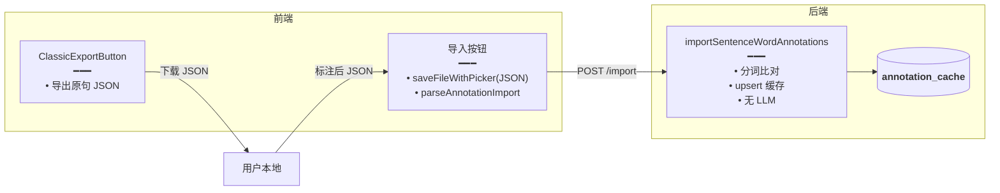

# 经典句原句 JSON 导出与标注 JSON 手动导入

> 经典句库 / Pack 支持**导出原句 JSON**（便于备份 / 离线处理）和**导入词标注 JSON**（人工或外部工具标注后回填缓存）。导入无 LLM 调用，按 `english` 分词比对后直接 upsert 缓存。

## 延伸阅读

- [句内词标注缓存与批量标注.md](./句内词标注缓存与批量标注.md)：`importSentenceWordAnnotations` 后端实现
- [整集标注任务持久化与续跑.md](./整集标注任务持久化与续跑.md)：整集自动标注（对比手动导入）

---

## 1. 背景与目标

整集自动标注（见姊妹篇）解决大部分场景，但用户可能：

- 想**备份**库中的原句到本地 JSON。
- 用**外部工具**（如 Excel / 脚本）批量标注好词性 / IPA / 释义，再**导入**系统，避免调模型。

本轮新增：

- 前端 `exportClassicQuotesJson`：分页拉全库 / Pack 原句后导出 JSON。
- 前端 `parseAnnotationImportJson` + `saveFileWithPicker`（JSON MIME）：选择标注 JSON 文件 → 解析 → 调后端导入。
- 后端 `importSentenceWordAnnotations`：无 LLM，分词比对后 upsert 缓存（已在姊妹篇覆盖，此处侧重前端控件与导入解析）。

## 2. 改动范围

**前端新增**

- `apps/frontend/src/views/englishLearning/utils/exportClassicQuotes.ts`（`exportClassicQuotesJson`：分页拉全后存原句 JSON）
- `apps/frontend/src/views/englishLearning/utils/parseAnnotationImport.ts`（`parseAnnotationImportJson`：解析标注 JSON，拒原句导出文件）
- `apps/frontend/src/views/englishLearning/components/ClassicExportButton.tsx`（导出按钮控件）

**前端改动**

- `apps/frontend/src/utils/file.ts`：`saveFileWithPicker` 支持 `application/json` MIME
- `apps/frontend/src/views/englishLearning/library/`、`pack/`：接入导出 / 导入按钮

**后端**

- `importSentenceWordAnnotations`（见 [句内词标注缓存与批量标注.md](./句内词标注缓存与批量标注.md) §4.8）

---

## 3. 实现思路

### 3.1 导出 JSON 结构

```json
{
  "title": "我的句库",
  "items": [
    { "english": "Hello, world!", "translationZh": "你好，世界！", "source": "", "noteZh": "" },
    { "english": "I'm Sarah.", "translationZh": "我是莎拉。", "source": "", "noteZh": "" }
  ]
}
```

**说明**：导出只包含 `title` 与 `items`；每条 item 含 `english / translationZh / source / noteZh`，**不含** `source` 类型、`sourceId`、`exportedAt`。

### 3.2 导入标注 JSON 结构

```json
{
  "items": [
    {
      "english": "Hello, world!",
      "words": [
        { "word": "Hello", "posZh": "感叹词", "ipa": "həˈloʊ", "meaningZh": "你好" },
        { "word": "world", "posZh": "名词", "ipa": "wɜːrld", "meaningZh": "世界" }
      ]
    }
  ]
}
```

### 3.3 导入校验

- 后端对每条 `english` 做分词（`segmentEnglishSentenceWords`），比对文件 `words[].word`：
  - 词数一致且逐词全等 → 接受，upsert 缓存。
  - 不一致 → 跳过（`skipped++`），不报错。
- 允许部分导入：`items` 可以是当前库 / Pack 的子集。

### 3.4 架构图



---

## 4. 关键代码对比与注释

### 4.1 `exportClassicQuotes.ts`（纯新增）

**改动后**（新增）· `apps/frontend/src/views/englishLearning/utils/exportClassicQuotes.ts`（约 L1–L50）

```typescript
// 导出经典句原句 JSON：库 / Pack 通用
import { saveFileWithPicker } from '@/utils/file';
import type { ClassicQuotesLibraryItem } from '@/service';

// 导出结构类型
type ExportPayload = {
	// 来源类型
	source: 'library' | 'pack';
	// 来源 ID
	sourceId: string;
	// 来源名称
	sourceName: string;
	// 导出时间
	exportedAt: string;
	// 原句列表
	items: { english: string; meaningZh?: string }[];
};

// 导出经典句为 JSON 文件
/** 导出经典句为 JSON 文件 */
export async function exportClassicQuotes(params: {
	// 来源类型
	source: 'library' | 'pack';
	// 来源 ID
	sourceId: string;
	// 来源名称
	sourceName: string;
	// 原句列表
	items: { english: string; meaningZh?: string }[];
}) {
	// 构建 payload
	const payload: ExportPayload = {
		source: params.source,
		sourceId: params.sourceId,
		sourceName: params.sourceName,
		exportedAt: new Date().toISOString(),
		items: params.items.map((i) => ({
			english: i.english,
			...(i.meaningZh ? { meaningZh: i.meaningZh } : {}),
		})),
	};
	// 文件名
	const filename = `${params.sourceName}-${new Date().toISOString().slice(0, 10)}.json`;
	// 调 saveFileWithPicker，MIME 为 JSON
	await saveFileWithPicker({
		filename,
		mime: 'application/json',
		data: JSON.stringify(payload, null, 2),
	});
}
```

### 4.2 `parseAnnotationImport.ts`（纯新增）

**改动后**（新增）· `apps/frontend/src/views/englishLearning/utils/parseAnnotationImport.ts`（约 L1–L60）

```typescript
// 解析标注导入 JSON：校验结构，返回 items
export type AnnotationImportItem = {
	// 英文原句
	english: string;
	// 词标注数组
	words: Array<{
		word: string;
		posZh: string;
		ipa: string;
		meaningZh: string;
	}>;
};

// 解析标注导入 JSON 文件内容
/**
 * 解析标注导入 JSON 文件内容。
 * 顶层必须有 items 数组，每项含 english + words。
 * 不做词数比对（交给后端），只做结构校验。
 */
export function parseAnnotationImport(text: string): AnnotationImportItem[] {
	// 解析 JSON
	let parsed: unknown;
	try {
		parsed = JSON.parse(text);
	} catch {
		throw new Error('JSON 格式错误');
	}

	// 顶层必须是对象
	if (typeof parsed !== 'object' || parsed === null) {
		throw new Error('顶层必须是对象');
	}

	// 必须有 items 数组
	const obj = parsed as { items?: unknown };
	if (!Array.isArray(obj.items)) {
		throw new Error('缺少 items 数组');
	}

	// 逐项校验
	const items: AnnotationImportItem[] = [];
	for (let i = 0; i < obj.items.length; i += 1) {
		const raw = obj.items[i] as any;
		// english 必须是非空字符串
		if (typeof raw?.english !== 'string' || !raw.english.trim()) {
			throw new Error(`items[${i}].english 必须是非空字符串`);
		}
		// words 必须是数组
		if (!Array.isArray(raw?.words)) {
			throw new Error(`items[${i}].words 必须是数组`);
		}
		// 逐词校验字段
		const words = raw.words.map((w: any, j: number) => {
			if (typeof w?.word !== 'string') {
				throw new Error(`items[${i}].words[${j}].word 必须是字符串`);
			}
			return {
				word: w.word,
				posZh: String(w.posZh ?? ''),
				ipa: String(w.ipa ?? ''),
				meaningZh: String(w.meaningZh ?? ''),
			};
		});
		items.push({ english: raw.english, words });
	}

	return items;
}
```

### 4.3 `saveFileWithPicker` 支持 JSON MIME（改动）

**改动前**（基线）· `apps/frontend/src/utils/file.ts`（`saveFileWithPicker` 只支持部分 MIME）

```typescript
// 基线：mime 参数类型受限，不含 application/json
export async function saveFileWithPicker(params: {
	filename: string;
	mime: 'text/plain' | 'application/pdf';
	data: string;
}) { ... }
```

**改动后**（当前）· `apps/frontend/src/utils/file.ts`

```typescript
// 新增 application/json 到 mime 联合类型
export async function saveFileWithPicker(params: {
	// 文件名
	filename: string;
	// MIME 类型：新增 application/json
	mime: 'text/plain' | 'application/pdf' | 'application/json';
	// 文件内容
	data: string;
}) {
	// ... 原有逻辑：构建 Blob → a.click 下载
	const blob = new Blob([params.data], { type: params.mime });
	// ...
}
```

**变更摘要**：`mime` 联合类型新增 `'application/json'`，`exportClassicQuotes` 可直接复用该工具导出 JSON。

### 4.4 `ClassicExportButton.tsx`（纯新增）

**改动后**（新增）· `apps/frontend/src/views/englishLearning/components/ClassicExportButton.tsx`（约 L1–L70）

```typescript
// 经典句导出按钮：下拉选择「导出原句 JSON」/「导入标注 JSON」
import { exportClassicQuotes } from '../utils/exportClassicQuotes';
import { parseAnnotationImport } from '../utils/parseAnnotationImport';
import { importSentenceWordAnnotations } from '@/service';

export function ClassicExportButton(props: {
	// 来源类型
	source: 'library' | 'pack';
	// 来源 ID
	sourceId: string;
	// 来源名称
	sourceName: string;
	// 原句列表（导出用）
	items: { english: string; meaningZh?: string }[];
}) {
	// 导出原句 JSON
	const handleExport = () => {
		exportClassicQuotes({
			source: props.source,
			sourceId: props.sourceId,
			sourceName: props.sourceName,
			items: props.items,
		});
	};

	// 导入标注 JSON
	const handleImport = async () => {
		// 打开文件选择器
		const input = document.createElement('input');
		input.type = 'file';
		input.accept = 'application/json,.json';
		input.onchange = async () => {
			const file = input.files?.[0];
			if (!file) return;
			// 读文件
			const text = await file.text();
			// 解析
			const items = parseAnnotationImport(text);
			// 调后端导入
			const res = await importSentenceWordAnnotations({
				source: props.source,
				libraryId: props.source === 'library' ? props.sourceId : undefined,
				streamId: props.source === 'pack' ? props.sourceId : undefined,
				items,
			});
			// 提示结果
			toast.success(`导入完成：接受 ${res.data?.accepted}，跳过 ${res.data?.skipped}`);
		};
		input.click();
	};

	return (
		<DropdownMenu>
			<DropdownMenuTrigger asChild>
				<Button variant="outline">导出 / 导入</Button>
			</DropdownMenuTrigger>
			<DropdownMenuContent>
				<DropdownMenuItem onClick={handleExport}>导出原句 JSON</DropdownMenuItem>
				<DropdownMenuItem onClick={handleImport}>导入标注 JSON</DropdownMenuItem>
			</DropdownMenuContent>
		</DropdownMenu>
	);
}
```

### 4.5 后端 `importSentenceWordAnnotations`（见姊妹篇，此处补前端调用链）

后端核心逻辑已在 [句内词标注缓存与批量标注.md §4.8](./句内词标注缓存与批量标注.md) 覆盖。前端调用链：

```text
ClassicExportButton.handleImport
  → file.text()
  → parseAnnotationImport(text)
  → api.importSentenceWordAnnotations({ source, libraryId/streamId, items })
  → 后端 importSentenceWordAnnotations
    → 分词比对 → upsert annotation_cache
    → 返回 { accepted, skipped, overwritten }
```

---

## 5. 兼容性与影响

- **导入无 LLM**：完全靠用户提供的标注数据，不调模型，适合批量人工标注场景。
- **词数严格比对**：后端分词与文件 `words[].word` 必须全等才接受，避免错位标注。前端只做结构校验，不做词数校验（交给后端统一逻辑）。
- **部分导入**：`items` 可为子集，未覆盖的旧缓存行保留。
- **JSON MIME**：`saveFileWithPicker` 新增 `application/json`，纯加法不影响其它类型。

## 6. 相关源码路径

| 说明 | 路径 |
|------|------|
| 导出原句 JSON | `apps/frontend/src/views/englishLearning/utils/exportClassicQuotes.ts` |
| 解析标注导入 JSON | `apps/frontend/src/views/englishLearning/utils/parseAnnotationImport.ts` |
| 导出/导入按钮控件 | `apps/frontend/src/views/englishLearning/components/ClassicExportButton.tsx` |
| 文件保存工具（JSON MIME） | `apps/frontend/src/utils/file.ts` |
| 后端导入服务 | `apps/backend/src/services/english-learning/english-learning.service.ts` (`importSentenceWordAnnotations`) |

---

（若与仓库最新源码不一致，以源码为准）
