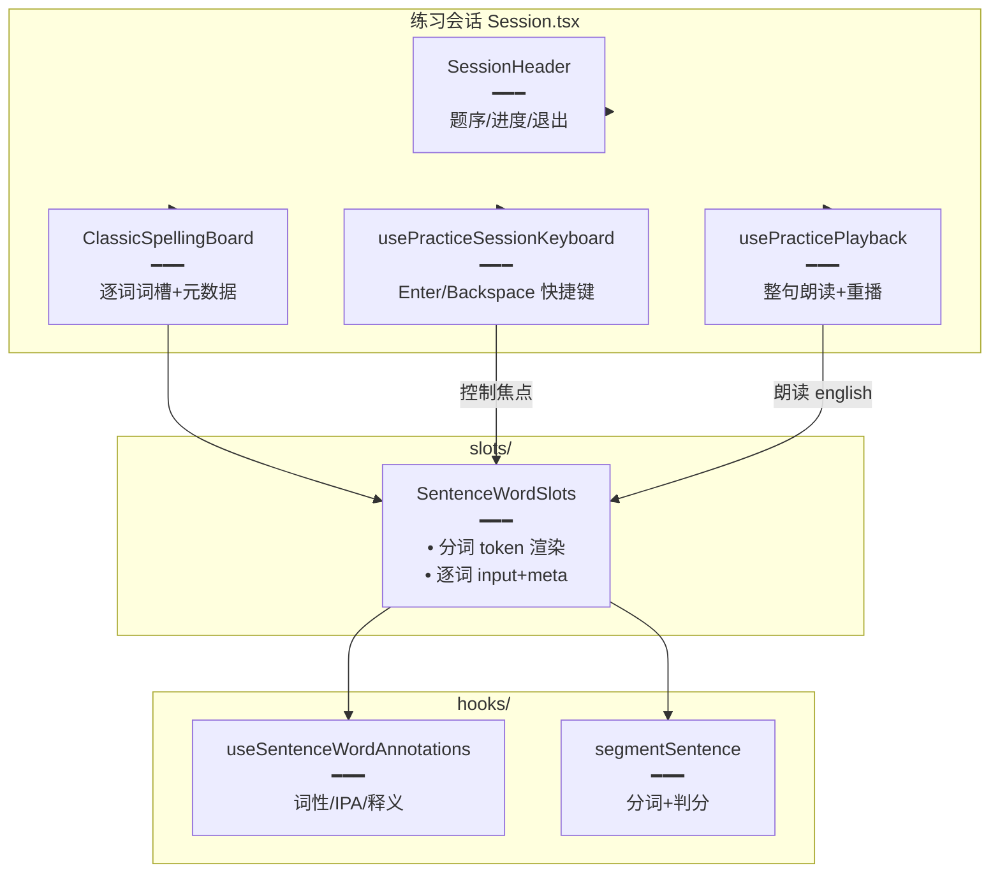

# 经典句看中写词槽练习

> 经典句「看中写」从整句填空升级为**逐词词槽**：每个词一个输入框，上方展示词性 / IPA / 释义，实时比对判分，Enter 跳下一空，全部正确自动判题。底层依赖 [句内词标注缓存与批量标注.md](./句内词标注缓存与批量标注.md) 提供的词元数据。

## 延伸阅读

- [句内词标注缓存与批量标注.md](./句内词标注缓存与批量标注.md)：词元（词性/IPA/释义）来源
- [整集标注任务持久化与续跑.md](./整集标注任务持久化与续跑.md)：整集预热让练习开局即命中词元

---

## 1. 背景与目标

旧版「看中写」是一个整句输入框，用户一次性输入整句，体验接近听写。本轮拆为**逐词词槽**：

- 每个词独立输入框，可逐词输入、逐词判分。
- 词槽上方展示词性（中文）、英式 IPA、中文释义，降低难度。
- 支持 Enter 跳下一空、Backspace 在空槽跳回上一空。
- 全部正确后自动判题并进入下一题。
- **单词练习同样走词槽**：单词项（含短语如 look forward to）按分词拆成多槽，短语的词性 / 释义挂在首槽，IPA 能按词切开时才分到各槽。

## 2. 改动范围

**前端新增**

- `apps/frontend/src/views/englishLearning/practice/slots/SentenceWordSlots.tsx`（词槽容器：逐词输入框 + 元数据悬浮）
- `apps/frontend/src/views/englishLearning/practice/slots/ClassicSpellingBoard.tsx`（拼写板：整句词槽渲染 + 键盘交互）
- `apps/frontend/src/views/englishLearning/practice/hooks/usePracticeSessionKeyboard.ts`（练习会话键盘快捷键）
- `apps/frontend/src/views/englishLearning/practice/hooks/usePracticePlayback.ts`（播放控制：整句朗读 + 词级音频）

**前端改动**

- `apps/frontend/src/views/englishLearning/practice/Session.tsx`（重构：接入词槽、元数据 hook、键盘 hook）
- `apps/frontend/src/views/englishLearning/practice/Setup.tsx`（练习设置：新增「看中写词槽」模式）
- `apps/frontend/src/views/englishLearning/practice/components/SessionHeader.tsx`（新增：会话顶栏，替代原 `SessionStageHeader`）
- 删除 `apps/frontend/src/views/englishLearning/practice/components/SessionStageHeader.tsx`

**复用**

- `apps/frontend/src/views/englishLearning/practice/utils/segmentSentence.ts`（分词 + 逐词比对）
- `apps/frontend/src/views/englishLearning/practice/hooks/useSentenceWordAnnotations.ts`（经典句词元拉取）
- `apps/frontend/src/views/englishLearning/practice/utils/wordMeta.ts`（词性色调、缩写→中文、短语 IPA 拆分）

---

## 3. 实现思路

### 3.1 分词与判分

- `segmentEnglishSentence(english)` 把句子切成 `SentenceWordToken[]`，每个 token 含 `raw`（原词）、`expect`（小写+直撇）、`after`（词后标点）。
- 用户输入走 `matchSlotInput(input, expect)` 返回 `empty / prefix / correct / wrong`。
- UI 只有 `correct` 标绿，`prefix` 不展示（内部用，避免半截正确误导）。

### 3.2 词槽渲染

```text
┌─────────────────────────────────────────────┐
│  [名] /həˈloʊ/  你好      [动] /aɪm/  我是   │
│  ┌──────┐ !  ┌────┐  ┌──────┐ .            │
│  │ Hello│    │ I'm│  │Sarah │              │
│  └──────┘    └────┘  └──────┘              │
└─────────────────────────────────────────────┘
```

- 每个词槽 = `<input>` + 上方元数据标签。
- 词后标点 `after` 渲染在词槽右侧，非输入态。
- 元数据从 `useSentenceWordAnnotations` 取，加载中显示占位。

### 3.3 键盘交互

| 按键 | 行为 |
|------|------|
| `Enter` | 当前槽正确 → 聚焦下一空；全对 → 判题 |
| `Backspace`（空槽） | 聚焦上一空并选中 |
| `Tab` | 原生焦点顺序 |

### 3.4 架构图



### 3.5 单词 / 短语词槽元数据分发

经典句的词元来自 `useSentenceWordAnnotations`（逐词标注，每词独立 posZh/ipa/meaningZh）。单词项的词元来自单词本身的 `pos / ipa / translationZh`，**整条短语共享**：

```text
短语 look forward to（pos=phr.v.，ipa=/lʊk ˈfɔːrwərd tuː/，释义=期待）

槽1 look        槽2 forward     槽3 to
[动词短语]      (无词性)        (无词性)
/lʊk/           /ˈfɔːrwərd/     /tuː/
期待            (无释义)        (无释义)
```

分发规则：
- `posAbbrToZh(pos)` 把 `phr.v.` → `动词短语`、`n.phr.` → `名词短语`（核心词性 + 「短语」后缀），色调跟核心词性。
- `splitPhraseIpa(ipa, wordCount)` 按空格切 IPA；段数与词数一致才返回数组，否则 `null`（整段 IPA 挂首槽，不强拆）。
- 首槽拿完整 `posZh / meaningZh` + 首段 IPA；其余槽仅拿对应 IPA（若可拆），`posZh / meaningZh` 留空。

---

## 4. 关键代码对比与注释

### 4.1 `SentenceWordSlots.tsx`（纯新增）

**改动后**（新增）· `apps/frontend/src/views/englishLearning/practice/slots/SentenceWordSlots.tsx`（约 L1–L150）

```typescript
// 逐词词槽容器：渲染 input + 上方元数据标签
import { useEffect, useRef } from 'react';
import { segmentEnglishSentence, matchSlotInput } from '../utils/segmentSentence';
import { useSentenceWordAnnotations } from '../hooks/useSentenceWordAnnotations';

// 词槽 props
export function SentenceWordSlots(props: {
	// 英文原句
	english: string;
	// 用户输入数组（与词槽一一对应）
	values: string[];
	// 输入变化回调
	onChange: (index: number, value: string) => void;
	// 是否禁用（已判题后只读）
	disabled?: boolean;
}) {
	const { english, values, onChange, disabled } = props;
	// 分词
	const tokens = useMemo(() => segmentEnglishSentence(english), [english]);
	// 拉取词元
	const { metaByIndex } = useSentenceWordAnnotations({
		enabled: !disabled,
		english,
		tokens,
	});
	// input ref 数组，用于键盘跳转
	const inputRefs = useRef<(HTMLInputElement | null)[]>([]);

	return (
		<div className="flex flex-wrap items-end gap-2">
			{tokens.map((token, i) => {
				// 比对结果
				const kind = matchSlotInput(values[i] ?? '', token.expect);
				// 元数据
				const meta = metaByIndex[i];
				return (
					<div key={i} className="flex flex-col items-center">
						{/* 元数据标签：词性 + IPA + 释义 */}
						{meta && (
							<div className="mb-1 text-xs text-muted-foreground">
								<span className="mr-1">[{meta.posZh}]</span>
								<span className="mr-1">/{meta.ipa}/</span>
								<span>{meta.meaningZh}</span>
							</div>
						)}
						{/* 词槽 input */}
						<div className="flex items-baseline">
							<input
								ref={(el) => {
									inputRefs.current[i] = el;
								}}
								value={values[i] ?? ''}
								disabled={disabled}
								onChange={(e) => onChange(i, e.target.value)}
								// correct 标绿，wrong 标红
								className={
									'w-24 rounded border px-2 py-1 text-center ' +
									(kind === 'correct'
										? 'border-green-500 text-green-700'
										: kind === 'wrong'
											? 'border-red-500'
											: 'border-input')
								}
							/>
							{/* 词后标点 */}
							{token.after && (
								<span className="ml-0.5 text-lg">{token.after}</span>
							)}
						</div>
					</div>
				);
			})}
		</div>
	);
}
```

### 4.2 `ClassicSpellingBoard.tsx`（纯新增，摘录键盘逻辑）

**改动后**（新增）· `apps/frontend/src/views/englishLearning/practice/slots/ClassicSpellingBoard.tsx`（约 L1–L120，摘录键盘处理）

```typescript
// 拼写板：管理词槽 values + 键盘交互（Enter 跳下一个 / Backspace 跳回上一个）
export function ClassicSpellingBoard(props: {
	english: string;
	disabled?: boolean;
	// 全部正确时回调
	onAllCorrect?: () => void;
}) {
	const { english, disabled, onAllCorrect } = props;
	const tokens = useMemo(() => segmentEnglishSentence(english), [english]);
	// 用户输入
	const [values, setValues] = useState<string[]>(() => tokens.map(() => ''));

	// 全部正确？
	const allCorrect = useMemo(
		() =>
			tokens.every((t, i) => matchSlotInput(values[i] ?? '', t.expect) === 'correct'),
		[tokens, values],
	);

	// allCorrect 变化 → 触发判题
	useEffect(() => {
		if (allCorrect && !disabled) onAllCorrect?.();
	}, [allCorrect, disabled, onAllCorrect]);

	// 单个输入变化
	const handleChange = (i: number, v: string) => {
		setValues((prev) => {
			const next = [...prev];
			next[i] = v;
			return next;
		});
	};

	// 键盘：Enter 跳下一个正确空；Backspace 空槽跳回上一个
	const handleKeyDown = (i: number, e: React.KeyboardEvent<HTMLInputElement>) => {
		if (e.key === 'Enter') {
			e.preventDefault();
			// 当前槽正确 → 找下一个未正确的槽聚焦
			if (matchSlotInput(values[i] ?? '', tokens[i]!.expect) === 'correct') {
				const nextIdx = values.findIndex(
					(v, idx) =>
						idx > i &&
						matchSlotInput(v ?? '', tokens[idx]!.expect) !== 'correct',
				);
				if (nextIdx >= 0) {
					// 聚焦下一槽（通过 ref 或 DOM）
					focusSlot(nextIdx);
				}
			}
		} else if (e.key === 'Backspace' && !values[i]) {
			// 空槽 Backspace → 聚焦上一槽并选中
			e.preventDefault();
			if (i > 0) focusSlot(i - 1, true);
		}
	};

	return (
		<SentenceWordSlots
			english={english}
			values={values}
			onChange={handleChange}
			disabled={disabled}
		/>
	);
}
```

### 4.3 `usePracticeSessionKeyboard.ts`（纯新增）

**改动后**（新增）· `apps/frontend/src/views/englishLearning/practice/hooks/usePracticeSessionKeyboard.ts`（约 L1–L60）

```typescript
// 练习会话级键盘：空格播放整句、Enter 判题、左右切题
export function usePracticeSessionKeyboard(args: {
	// 是否启用
	enabled: boolean;
	// 播放整句
	onPlay: () => void;
	// 判题
	onSubmit: () => void;
	// 上一题
	onPrev: () => void;
	// 下一题
	onNext: () => void;
}) {
	useEffect(() => {
		if (!args.enabled) return;
		const handler = (e: KeyboardEvent) => {
			// input 内不拦截（由词槽自己处理）
			const tag = (e.target as HTMLElement)?.tagName;
			if (tag === 'INPUT' || tag === 'TEXTAREA') return;

			// 空格 → 播放（防止页面滚动）
			if (e.code === 'Space') {
				e.preventDefault();
				args.onPlay();
			}
			// Enter → 判题
			else if (e.key === 'Enter') {
				e.preventDefault();
				args.onSubmit();
			}
			// 左箭头 → 上一题
			else if (e.key === 'ArrowLeft') {
				args.onPrev();
			}
			// 右箭头 → 下一题
			else if (e.key === 'ArrowRight') {
				args.onNext();
			}
		};
		window.addEventListener('keydown', handler);
		return () => window.removeEventListener('keydown', handler);
	}, [args]);
}
```

### 4.4 `Session.tsx` 重构（改动，摘录接入部分）

**改动前**（基线）· 整句输入框模式

```tsx
// 旧版：单一 textarea 输入整句
<textarea
	value={answer}
	onChange={(e) => setAnswer(e.target.value)}
	placeholder="输入整句..."
/>
```

**改动后**（当前）· `apps/frontend/src/views/englishLearning/practice/Session.tsx`（摘录）

```tsx
// 练习会话：接入词槽、元数据、键盘、播放
export default function Session() {
	const { item } = usePracticeStore();
	// 是否已经判题
	const [revealed, setRevealed] = useState(false);

	// 播放整句
	const { play } = usePracticePlayback({ english: item.english });

	// 会话级键盘
	usePracticeSessionKeyboard({
		enabled: !revealed,
		onPlay: play,
		onSubmit: () => setRevealed(true),
		onPrev: () => goPrev(),
		onNext: () => goNext(),
	});

	return (
		<div className="flex flex-col gap-4 p-4">
			{/* 会话顶栏（新增，替代 SessionStageHeader） */}
			<SessionHeader item={item} onExit={handleExit} />

			{/* 拼写板：逐词词槽 */}
			<ClassicSpellingBoard
				english={item.english}
				disabled={revealed}
				onAllCorrect={() => setRevealed(true)}
			/>

			{/* 判题后展示原句与释义 */}
			{revealed && (
				<div className="rounded-lg bg-muted p-3">
					<div className="text-lg">{item.english}</div>
					<div className="text-sm text-muted-foreground">{item.meaningZh}</div>
				</div>
			)}
		</div>
	);
}
```

**变更摘要**：`Session.tsx` 从「整句 textarea」重构为「逐词词槽 `ClassicSpellingBoard`」，接入 `usePracticeSessionKeyboard`（空格播放、Enter 判题、方向键切题）和 `usePracticePlayback`，顶栏抽为 `SessionHeader`，删除旧 `SessionStageHeader`。

### 4.5 删除 `SessionStageHeader.tsx`（纯删除）

**变更摘要**：`SessionStageHeader` 被更通用的 `SessionHeader` 替代，删除该文件避免双份维护。删除前确认无其它引用：

```bash
# 仓库内已无 import SessionStageHeader
grep -r "SessionStageHeader" apps/frontend/src
# (无输出)
```

### 4.6 `Session.tsx` 单词短语词槽元数据分发（改动）

**改动前**（基线）· 单词练习用整句输入框，元数据只在判题后展示

```tsx
// 基线：单词项走整句输入，无逐词词槽
<input value={input} onChange={(e) => setInput(e.target.value)} />
```

**改动后**（当前）· `apps/frontend/src/views/englishLearning/practice/Session.tsx`（约 L92–L120）

```tsx
// 单词项元数据：pos 缩写转中文、ipa 按词拆、释义挂首槽
const vocabMetaByIndex = useMemo((): readonly (SentenceWordMeta | null)[] => {
	// 非单词项或无分词 → 空
	if (!isPracticeVocabItem(item) || tokens.length === 0) return EMPTY_META;
	// 整条短语共享的元数据
	const meta: SentenceWordMeta = {
		// 词性缩写转中文：phr.v. → 动词短语
		posZh: posAbbrToZh(item.pos || ''),
		// 音标原文（可能含空格的多词 IPA）
		ipa: item.ipa?.trim() || '',
		// 中文释义
		meaningZh: item.translationZh?.trim() || '',
	};
	// 三项全空 → 所有槽无元数据
	if (!meta.posZh && !meta.ipa && !meta.meaningZh) {
		return tokens.map(() => null);
	}
	// 尝试把短语 IPA 按空格拆到各词；段数≠词数则 null
	const ipaParts = splitPhraseIpa(meta.ipa, tokens.length);
	// 首槽拿完整元数据 + 首段 IPA；其余槽只拿 IPA（可拆时）
	return tokens.map((_, i) => {
		if (i === 0) {
			return { ...meta, ipa: ipaParts ? ipaParts[0]! : meta.ipa };
		}
		if (!ipaParts) return null;
		return { posZh: '', ipa: ipaParts[i]!, meaningZh: '' };
	});
}, [item, tokens]);

// 经典句走标注 hook，单词走本地短语分发
const metaByIndex = isClassic ? classicAnnotate.metaByIndex : vocabMetaByIndex;
```

**变更摘要**：单词项（含多词短语）的元数据从「整句展示」改为「按词槽分发」——词性/释义挂首槽，IPA 可按词拆时均分到各槽，不可拆时整段挂首槽。

### 4.7 `wordMeta.ts` 短语词性与 IPA 拆分（改动）

**改动后**（当前）· `apps/frontend/src/views/englishLearning/practice/utils/wordMeta.ts`（约 L73–L138）

```typescript
// 英文词性缩写 → 中文映射表；phr/phrase → 短语
const POS_ZH: Record<string, string> = {
	n: '名词', v: '动词', adj: '形容词', adv: '副词',
	prep: '介词', conj: '连词', pron: '代词', det: '限定词',
	art: '冠词', aux: '助动词', num: '数词', int: '感叹词',
	phr: '短语', phrase: '短语',
};

// 按 . 切分词性标记，过滤空段
function posParts(pos: string): string[] {
	return pos.trim().toLowerCase().split('.').map((s) => s.trim()).filter(Boolean);
}

// 短语 IPA 按空格拆到各词；段数与词数不一致返回 null（不强拆）
export function splitPhraseIpa(ipa: string, wordCount: number): string[] | null {
	// 单词无拆分必要
	if (wordCount <= 1) return null;
	// 去掉斜杠包裹，按空白切
	const inner = ipa.trim().replace(/\//g, ' ').trim();
	if (!inner) return null;
	const parts = inner.split(/\s+/).filter(Boolean);
	// 段数必须严格等于词数，否则整段挂首槽
	if (parts.length !== wordCount) return null;
	return parts;
}

// 词性缩写 → 中文；phr.n. / n.phr. → 名词短语（核心词性 + 短语后缀）
export function posAbbrToZh(pos: string): string {
	const raw = pos.trim();
	if (!raw) return '';
	const parts = posParts(raw);
	if (parts.length === 0) return raw;
	// 单词性直接查表
	if (parts.length === 1) return POS_ZH[parts[0]!] ?? raw;
	// 多段：提取非 phr 的核心词性
	const cores = parts.filter((p) => p !== 'phr' && p !== 'phrase');
	// 恰好一个核心 + 短语标记 → 「核心词性短语」
	if (cores.length === 1 && cores.length < parts.length) {
		const zh = POS_ZH[cores[0]!];
		if (zh && zh !== '短语') return `${zh}短语`;
		return '短语';
	}
	// 无法识别则原样返回
	return raw;
}
```

**变更摘要**：`posAbbrToZh` 识别 `phr.v.` / `n.phr.` 等合成标记，输出「动词短语」/「名词短语」，色调跟核心词性；`splitPhraseIpa` 仅在 IPA 段数与词数严格相等时才拆分，避免误切。

---

## 5. 兼容性与影响

- **逐词输入更易上手**：相比整句听写，逐词词槽降低输入门槛，元数据提示帮助理解。
- **整集预热依赖**：词元数据来自缓存，练习开局 `prefetchSentenceWordAnnotationsBatch` 灌内存；未命中时 `useSentenceWordAnnotations` 单句补拉，加载中显示占位。
- **键盘冲突处理**：`usePracticeSessionKeyboard` 在 input/textarea 内不拦截，由词槽自行处理 Enter/Backspace；避免双重触发。
- **删除文件**：`SessionStageHeader.tsx` 已删除，所有引用迁移至 `SessionHeader.tsx`。

## 6. 相关源码路径

| 说明 | 路径 |
|------|------|
| 词槽容器 | `apps/frontend/src/views/englishLearning/practice/slots/SentenceWordSlots.tsx` |
| 拼写板 | `apps/frontend/src/views/englishLearning/practice/slots/ClassicSpellingBoard.tsx` |
| 练习会话 | `apps/frontend/src/views/englishLearning/practice/Session.tsx` |
| 练习设置 | `apps/frontend/src/views/englishLearning/practice/Setup.tsx` |
| 会话顶栏 | `apps/frontend/src/views/englishLearning/practice/components/SessionHeader.tsx` |
| 会话键盘 hook | `apps/frontend/src/views/englishLearning/practice/hooks/usePracticeSessionKeyboard.ts` |
| 播放 hook | `apps/frontend/src/views/englishLearning/practice/hooks/usePracticePlayback.ts` |
| 分词 + 判分 | `apps/frontend/src/views/englishLearning/practice/utils/segmentSentence.ts` |
| 词元 hook | `apps/frontend/src/views/englishLearning/practice/hooks/useSentenceWordAnnotations.ts` |

---

（若与仓库最新源码不一致，以源码为准）
