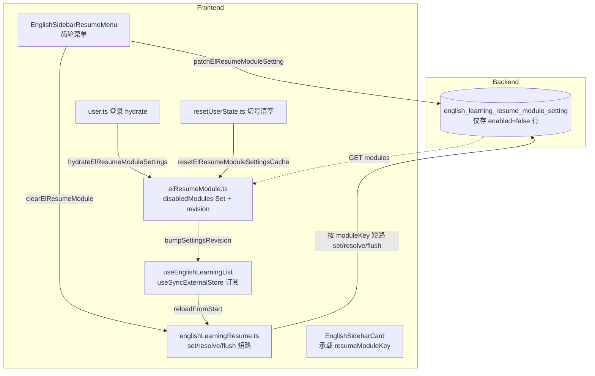

# 英语学习列表续读模块开关：按模块关闭/清除阅读进度

> 解决「列表续读位置持久化后无法关闭/清除」的问题：单词库、语句库、收藏、错题、每日记词记录五个侧栏模块各自提供续读，但用户无法针对某个模块整体关闭续读或一键清除历史进度。  
> 本轮新增**服务端持久化的模块开关**（仅记录关闭状态）+ **会话级本地缓存**（默认全开，未登录也能用），并在侧栏模块标题处嵌入齿轮菜单（清除/开关）。  
> 姊妹文档：续读表与 keepalive flush 见 [资源库词条续读.md](./资源库词条续读.md)；5 个固定列表续读合表见 [固定列表统一虚拟滚动.md](./固定列表统一虚拟滚动.md)；路径与命名收口见 [英语学习列表模块收口.md](./英语学习列表模块收口.md)；侧栏卡片容器统一见 [侧边栏UI统一.md](./侧边栏UI统一.md)。

若与仓库最新源码不一致，**以源码为准**。

---

## 1. 背景与目标

### 1.1 用户视角

在英语学习首页侧栏的五个模块——**单词库 / 语句库 / 我的收藏 / 错题集 / 每日记词记录**——已经各自记住了「上次读到第几条」。用户希望：

1. **关闭某个模块的续读**：例如「每日记词记录列表」不想再被记位置了，可点侧栏标题旁的齿轮 → 关闭阅读进度，列表会立即从首屏重新加载，且本设备与其它设备登录同账号都不再为该模块续读；
2. **一键清除某个模块的全部续读**：例如收藏列表换了主题，想把旧进度清掉重新从第 0 条看起，可点齿轮 → 清除阅读进度（二次确认），本地与服务端 offset 一并归零、列表重载；
3. **关闭后再开**仍可恢复续读能力，关闭状态本身按账号保存，跨设备登录同账号一致。

**改前**：续读位置已经持久化（见姊妹稿），但用户**无法针对单个模块关闭**或**清除历史**——只能整体清空浏览器存储，且公共库/收藏等不同模块的进度互相耦合，无法精细控制。

**改后**：每个侧栏模块标题旁出现齿轮按钮，下拉两项：**清除阅读进度**（二次确认）与**关闭/开启阅读进度**。操作即时生效（列表从首屏重载），状态按账号保存（未登录仅本地缓存，刷新即重置）。

### 1.2 设计约束

| 约束 | 说明 |
| ---- | ---- |
| 模块粒度 | 5 个侧栏模块各一个开关，互不影响 |
| 仅持久化关闭状态 | 服务端表只存 `enabled=false` 行；开启时直接删行，不存历史 |
| 默认全开 | 未登录、新账号、拉取失败均视为全开（不阻断续读） |
| 会话级缓存 | 本地 `Set<moduleKey>` 维护当前会话的禁用集合，登录后 hydrate；切换账号清空 |
| 操作即时生效 | 开/关/清除后 bump revision，订阅的列表 Hook 自动 `reloadFromStart` |
| 复用现有续读表 | 不新建 offset 表，沿用 `english_library_items_resume`（占位 libraryId 见 [英语学习列表模块收口.md](./英语学习列表模块收口.md)） |
| 清除 = offset 归零 | 清除时本地 store 与服务端 PATCH 都写 0，并失效会话缓存 |

---

## 2. 改动范围

### 2.1 后端

| 说明 | 路径 |
| ---- | ---- |
| 模块 key 常量（新建） | `apps/backend/src/services/english-learning/english-learning-resume-module.constants.ts` |
| 模块开关实体（新建） | `apps/backend/src/services/english-learning/entity/english-learning-resume-module-setting.entity.ts` |
| 更新 DTO（新建） | `apps/backend/src/services/english-learning/dto/update-resume-module-setting.dto.ts` |
| 占位迁移（新建） | `apps/backend/src/migrations/1787475151244-resume_module_setting.ts`、`apps/backend/src/migrations/1787475157104-resume_module_setting.ts` |
| 控制器：GET/PATCH 模块开关 | `apps/backend/src/services/english-learning/english-learning.controller.ts` |
| 服务：拉取/更新模块开关 | `apps/backend/src/services/english-learning/english-learning.service.ts` |
| 模块：注册实体 | `apps/backend/src/services/english-learning/english-learning.module.ts` |

### 2.2 前端

| 说明 | 路径 |
| ---- | ---- |
| 模块开关工具（新建） | `apps/frontend/src/views/englishLearning/utils/elResumeModule.ts` |
| API：GET/PATCH 模块开关 | `apps/frontend/src/service/index.ts`、`apps/frontend/src/service/api.ts` |
| 续读 store：按模块短路 | `apps/frontend/src/store/englishLearningResume.ts` |
| 续读 store 导出 helper | 同上（`elFixedListKind` 改 `export`） |
| 登录后 hydrate 模块开关 | `apps/frontend/src/store/user.ts` |
| 切换账号清空模块缓存 | `apps/frontend/src/store/resetUserState.ts` |
| 列表 Hook：订阅 revision + 重载 | `apps/frontend/src/views/englishLearning/hooks/useEnglishLearningList.ts` |
| 侧栏齿轮菜单（新建） | `apps/frontend/src/views/englishLearning/sidebar/components/EnglishSidebarResumeMenu.tsx` |
| 侧栏卡片容器（新建，承载齿轮） | `apps/frontend/src/views/englishLearning/sidebar/components/EnglishSidebarCard.tsx` |
| 侧栏标题组件：嵌入齿轮 | `apps/frontend/src/views/englishLearning/sidebar/components/EnglishSidebarHeader.tsx` |
| 旧容器删除 | `apps/frontend/src/views/englishLearning/sidebar/components/SidebarPanel.tsx` |
| 7 个侧栏组件改用新卡片 | `EnglishSource.tsx`、`FavoriteSession.tsx`、`MistakeBookSession.tsx`、`NotesSession.tsx`、`ReviewSession.tsx`、`LearningToolbar.tsx`、`sections/vocabulary/index.tsx`、`sections/classic/index.tsx` |
| 7 个列表页传 `resumeModuleKey` | `library/{vocabulary,classic}/index.tsx`、`favorites/{vocabulary,classic}/index.tsx`、`mistakes/{vocabulary,classic}/*.tsx`、`daily/records/index.tsx` |
| i18n 文案 | `apps/frontend/src/i18n/locales/zh-CN.ts`、`apps/frontend/src/i18n/locales/en-US.ts` |

---

## 3. 实现思路

### 3.1 总体数据流



### 3.2 模块 key 与占位映射

5 个模块 key 与已有占位 `libraryId` 一一对应：

| moduleKey | 占位 libraryId 来源 | 影响的列表 |
| --- | --- | --- |
| `library-vocab` | `ENGLISH_LEARNING_LIST_RESUME_LIBRARY_ID.vocab` | 单词库词条列表（每库一行） |
| `library-classic` | 同上 `classic` | 经典语句库词条列表（每库一行） |
| `favorites` | `vocabFavorites` + `classicFavorites` | 单词收藏 + 经典句收藏 |
| `mistakes` | `vocabMistakes` + `classicMistakes` | 单词错题 + 经典句错题 |
| `daily-memorize` | `vocabDailyMemorize` | 每日记词记录 |

资源库类（`library-vocab` / `library-classic`）一个模块对应多个 `libraryId`，关闭时需遍历当前账号所有库批量归零；固定列表类（`favorites` / `mistakes` / `daily-memorize`）一个模块对应固定占位 `libraryId`，关闭/清除时直接对 1~2 个 scope 操作。

### 3.3 服务端只存「关闭」

新表 `english_learning_resume_module_setting`：

- 唯一索引 `(user_id, module_key)`，避免同一用户重复行；
- `enabled` 列默认 `false`，但**仅当用户关闭某模块时才 UPSERT 一行 `enabled=false`**；
- 用户开启时 `DELETE` 该行，不保留任何历史；
- 拉取接口 `GET /items-resume/modules` 只 `find enabled=false` 行，前端按 key 集合反推禁用集合，缺省视为开启。

这样默认全开、新账号零行、表体积可控；切换账号或未登录直接走前端默认 `disabledModules = ∅`，无需服务端兜底。

### 3.4 前端会话级缓存与订阅

`elResumeModule.ts` 维护模块级状态：

- `disabledModules: Set<ElResumeModuleKey>`：会话内的禁用集合；
- `settingsRevision: number` + `revisionListeners`：简易订阅器（基于 `useSyncExternalStore`）；
- `hydratePromise`：可重入的登录后拉取；
- `bumpSettingsRevision()`：状态变化时通知所有订阅者并派发 `window` 自定义事件，便于跨组件感知。

### 3.5 续读 store 三段短路

在 `englishLearningResume.ts` 的三个对外入口——`setElResumeOffset`、`resolveElResumeOffset`、`flushElResume`——开头检查模块是否禁用：禁用则**直接 return**，不再写入/读取/上报 offset。固定列表入口（`resolveElFixedListResume`、`flushElFixedListResume`、`resolveElFixedListInitialResume`）同理。这保证关闭后**没有任何续读写入**，避免「关闭但仍在 flush」的脏数据。

### 3.6 列表 Hook 订阅 + 自动重载

`useEnglishLearningList` 新增可选 `resumeModuleKey`：

- 进入时（`resumeModuleKey` 变化）调一次 `hydrateElResumeModuleSettings()`，确保设置已拉取；
- 通过 `useSyncExternalStore(subscribeElResumeSettings, getElResumeSettingsRevision)` 订阅 revision；
- revision 变化时，重置 `bootedLibraryIdRef.current = null` 并调用 `reloadFromStart(false)`，让列表从首屏重新拉取（清掉旧 offset 灌入的视图）。

### 3.7 侧栏齿轮菜单与卡片统一

- 新建 `EnglishSidebarCard`：把原 `SidebarPanel` + `EnglishSidebarHeader` + `EnglishSidebarActions` 三段合一，新增 `prepend` slot（标题上方，用于挂 Confirm）与 `resumeModuleKey` 透传给 header；
- `EnglishSidebarHeader` 新增 `resumeModuleKey` 可选 prop，渲染时在标题右侧挂 `<EnglishSidebarResumeMenu>`；
- `EnglishSidebarResumeMenu` 用 DropdownMenu + Confirm 实现齿轮菜单，文案走 i18n；
- 7 个侧栏组件改为 `<EnglishSidebarCard>`，5 个挂 `resumeModuleKey`，2 个（NotesSession、ReviewSession、LearningToolbar）保持原结构不挂齿轮；
- 删除 `SidebarPanel.tsx`。

### 3.8 清除流程

`clearElResumeModule(moduleKey)` 分两支：

- `library-vocab` / `library-classic`：调 `listEnglishVocabularyLibraries` / `listEnglishClassicQuotesLibraries` 拉全部库（最多 1000），逐个 `clearElResumeOffset(kind, lib.id)` + 失效会话缓存 + `patchElListResume(kind, lib.id, 0)`；
- `favorites` / `mistakes` / `daily-memorize`：对 `FIXED_SCOPES_BY_MODULE[moduleKey]` 中的 1~2 个 scope 并行执行 `clearFixedScopeResume`：`clearElResumeOffset(kind, id)` + `invalidateLibraryWordsListCache` + `patchElListResume(kind, id, 0)`。

未登录仅清本地（`clearElResumeOffset` 只动会话缓存，不调服务端 PATCH）。

---

## 4. 关键代码对比与注释

### 4.1 后端：模块 key 常量（纯新增）

**改动后** · `apps/backend/src/services/english-learning/english-learning-resume-module.constants.ts`（约 L1–L19，完整文件）

```typescript
// 模块开关 key 列表，与前端 ElResumeModuleKey 一一对应；只读元组确保类型窄化
/** 英语学习列表续读模块开关（与前端 ElResumeModuleKey 一致） */
export const ENGLISH_LEARNING_RESUME_MODULE_KEYS = [
	// 单词库词条列表模块（每库一行续读，开启时按 kind=vocab 写入）
	'library-vocab',
	// 经典语句库词条列表模块（每库一行续读，开启时按 kind=classic 写入）
	'library-classic',
	// 收藏模块（单词收藏 + 经典句收藏两条占位续读）
	'favorites',
	// 错题集模块（单词错题 + 经典句错题两条占位续读）
	'mistakes',
	// 每日记词记录模块（单条占位续读）
	'daily-memorize',
// as const 使类型为字面量元组，便于下方取 keyof
] as const;

// 模块 key 联合类型，供实体列、DTO、Service 共享
export type EnglishLearningResumeModuleKey =
	// 索引访问元组元素类型，得到 5 个字面量的联合
	(typeof ENGLISH_LEARNING_RESUME_MODULE_KEYS)[number];

// 运行时类型守卫，用于将 string 收窄为模块 key（控制器入参校验）
export function isEnglishLearningResumeModuleKey(
	value: string,
): value is EnglishLearningResumeModuleKey {
	// 把只读元组断言为普通 string[] 后用 includes 判定
	return (ENGLISH_LEARNING_RESUME_MODULE_KEYS as readonly string[]).includes(
		value,
	);
}
```

**变更摘要**：纯新增文件，定义 5 个模块 key + 联合类型 + 类型守卫，前后端共用同一组字面量。

### 4.2 后端：模块开关实体（纯新增）

**改动后** · `apps/backend/src/services/english-learning/entity/english-learning-resume-module-setting.entity.ts`（约 L1–L28，完整文件）

```typescript
// 引入 TypeORM 列装饰器，分别用于主键、普通列、唯一索引、更新时间
import {
	Column,
	Entity,
	Index,
	PrimaryGeneratedColumn,
	UpdateDateColumn,
} from 'typeorm';
// 引入模块 key 联合类型，作为实体列的 TS 类型
import type { EnglishLearningResumeModuleKey } from '../english-learning-resume-module.constants';

/** 用户按模块关闭列表续读记录（默认开启，仅持久化关闭状态） */
// 实体对应数据表 english_learning_resume_module_setting
@Entity('english_learning_resume_module_setting')
// 唯一索引 (user_id, module_key)，保证同一用户同一模块只有一行
@Index('UQ_elrms_user_module', ['userId', 'moduleKey'], { unique: true })
export class EnglishLearningResumeModuleSetting {
	// 主键，uuid 自动生成
	@PrimaryGeneratedColumn('uuid')
	id!: string;

	// 用户 id（int 类型），与 users 表对齐
	@Column({ name: 'user_id', type: 'int' })
	userId!: number;

	// 模块 key，varchar(32) 容纳 5 个字面量
	@Column({ name: 'module_key', type: 'varchar', length: 32 })
	moduleKey!: EnglishLearningResumeModuleKey;

	// 是否启用，boolean；默认 false 表示新建行即关闭（开启时直接删行）
	@Column({ name: 'enabled', type: 'boolean', default: false })
	enabled!: boolean;

	// 更新时间戳，由 ORM 自动维护
	@UpdateDateColumn({ name: 'updated_at', type: 'timestamp' })
	updatedAt!: Date;
}
```

**变更摘要**：纯新增实体，唯一索引 `(userId, moduleKey)`，仅存关闭行。

### 4.3 后端：更新 DTO（纯新增）

**改动后** · `apps/backend/src/services/english-learning/dto/update-resume-module-setting.dto.ts`（约 L1–L13，完整文件）

```typescript
// class-validator 的两个校验装饰器：枚举值与布尔值
import { IsBoolean, IsIn } from 'class-validator';
// 引入模块 key 元组与联合类型
import {
	ENGLISH_LEARNING_RESUME_MODULE_KEYS,
	type EnglishLearningResumeModuleKey,
} from '../english-learning-resume-module.constants';

export class UpdateResumeModuleSettingDto {
	// moduleKey 必须是 5 个字面量之一；用展开元组的方式给 IsIn
	@IsIn([...ENGLISH_LEARNING_RESUME_MODULE_KEYS])
	moduleKey!: EnglishLearningResumeModuleKey;

	// enabled 必须是布尔，控制开启/关闭
	@IsBoolean()
	enabled!: boolean;
}
```

**变更摘要**：纯新增 DTO，`@IsIn` 校验模块 key 白名单。

### 4.4 后端：控制器路由（纯新增）

**对比范围**：`EnglishLearningController` 类的两个新方法（`getResumeModuleSettings`、`updateResumeModuleSetting`）。

**改动前** · `apps/backend/src/services/english-learning/english-learning.controller.ts`（基线无此方法）

```typescript
// ...（无 items-resume/modules 路由，仅有各列表的 items-resume 路由）
```

**改动后** · `apps/backend/src/services/english-learning/english-learning.controller.ts`（约 L936–L962，新增 2 个路由）

```typescript
// 引入更新 DTO，作为 @Body() 的校验类型
import { UpdateResumeModuleSettingDto } from './dto/update-resume-module-setting.dto';

// GET /items-resume/modules：拉取当前用户所有模块开关
@Get('items-resume/modules')
async getResumeModuleSettings(@Req() req: AuthedRequest) {
	// 从鉴权中间件取 userId，未登录抛 401
	const userId = req.user?.userId;
	if (userId == null) {
		throw new UnauthorizedException('未授权');
	}
	// 委托 Service 返回 Record<moduleKey, boolean>（缺省视为 true）
	const data =
		await this.englishLearningService.getResumeModuleSettings(userId);
	// 包一层 success + modules 字段，与前端 ElResumeModuleSettings 对齐
	return { success: true, data: { modules: data } };
}

// PATCH /items-resume/modules：更新单个模块开关
@Patch('items-resume/modules')
async updateResumeModuleSetting(
	@Req() req: AuthedRequest,
	// @Body() 触发 class-validator 校验 moduleKey/enabled
	@Body() dto: UpdateResumeModuleSettingDto,
) {
	// 同样从鉴权取 userId
	const userId = req.user?.userId;
	if (userId == null) {
		throw new UnauthorizedException('未授权');
	}
	// 委托 Service 写库（开启=删行，关闭=UPSERT），返回全量 modules
	const data = await this.englishLearningService.updateResumeModuleSetting(
		userId,
		dto.moduleKey,
		dto.enabled,
	);
	// 同样包 modules 字段，前端用全量结果覆盖本地缓存
	return { success: true, data: { modules: data } };
}
```

**变更摘要**：在已有 `items-resume` 子路由前挂 `modules`，避免被 `:libraryId` 等参数路由匹配。

### 4.5 后端：Service 读写与 upsert（纯新增）

**对比范围**：`EnglishLearningService` 类的两个新方法（`getResumeModuleSettings`、`updateResumeModuleSetting`）与构造器注入新仓库。

**改动前** · `apps/backend/src/services/english-learning/english-learning.service.ts`（基线无 `resumeModuleSettingRepo`）

```typescript
// ...（构造器无 resumeModuleSettingRepo 注入；无模块开关读写方法）
```

**改动后** · `apps/backend/src/services/english-learning/english-learning.service.ts`（构造器新增注入约 L299–L300；新方法约 L2828–L2858）

```typescript
// 引入模块 key 元组与联合类型
import {
	ENGLISH_LEARNING_RESUME_MODULE_KEYS,
	type EnglishLearningResumeModuleKey,
} from './english-learning-resume-module.constants';
// 引入模块开关实体
import { EnglishLearningResumeModuleSetting } from './entity/english-learning-resume-module-setting.entity';

// 构造器新增注入：模块开关仓库
@InjectRepository(EnglishLearningResumeModuleSetting)
private readonly resumeModuleSettingRepo: Repository<EnglishLearningResumeModuleSetting>,

// 拉取当前用户全部模块开关：返回 Record<key, boolean>
async getResumeModuleSettings(
	userId: number,
): Promise<Record<EnglishLearningResumeModuleKey, boolean>> {
	// 只查 enabled=false 行，开启行不入库存（默认开启策略）
	const rows = await this.resumeModuleSettingRepo.find({
		where: { userId, enabled: false },
		// 只取 moduleKey 列，减少传输
		select: ['moduleKey'],
	});
	// 把关闭行转成 Set 便于 O(1) 查询
	const disabled = new Set(rows.map((row) => row.moduleKey));
	// 构造全量 Record，缺省视为开启（!disabled.has(key)）
	const modules = {} as Record<EnglishLearningResumeModuleKey, boolean>;
	// 遍历 5 个 key 填值，保证响应字段完整
	for (const key of ENGLISH_LEARNING_RESUME_MODULE_KEYS) {
		// 不在关闭集合中即视为开启
		modules[key] = !disabled.has(key);
	}
	// 返回完整 modules Record
	return modules;
}

// 更新单个模块开关：开启=删行，关闭=UPSERT
async updateResumeModuleSetting(
	userId: number,
	moduleKey: EnglishLearningResumeModuleKey,
	enabled: boolean,
): Promise<Record<EnglishLearningResumeModuleKey, boolean>> {
	// 开启 → 删除该行，使表只保留关闭状态
	if (enabled) {
		await this.resumeModuleSettingRepo.delete({ userId, moduleKey });
	} else {
		// 关闭 → UPSERT 一行 enabled=false，按 (userId, moduleKey) 唯一索引去重
		await this.resumeModuleSettingRepo.upsert(
			{ userId, moduleKey, enabled: false },
			['userId', 'moduleKey'],
		);
	}
	// 返回全量 modules，便于前端覆盖本地缓存
	return this.getResumeModuleSettings(userId);
}
```

**变更摘要**：构造器注入新仓库；`getResumeModuleSettings` 仅查 `enabled=false` 行反推全量；`updateResumeModuleSetting` 开启=删行/关闭=UPSERT，最终都返回全量。

### 4.6 后端：模块注册实体（纯新增）

**改动前** · `apps/backend/src/services/english-learning/english-learning.module.ts`（基线无该实体）

```typescript
// ...（imports 与 forFeature 数组无 EnglishLearningResumeModuleSetting）
```

**改动后** · `apps/backend/src/services/english-learning/english-learning.module.ts`（imports 新增约 L16、`forFeature` 数组新增约 L51）

```typescript
// 引入模块开关实体
import { EnglishLearningResumeModuleSetting } from './entity/english-learning-resume-module-setting.entity';

// forFeature 数组新增该实体，使 Repository 可被注入到 Service
EnglishLearningResumeModuleSetting,
```

**变更摘要**：导入 + 注册实体到 `forFeature`。

### 4.7 前端：API 路径常量（纯新增）

**改动前** · `apps/frontend/src/service/api.ts`（基线无该常量）

```typescript
// ...（仅有各列表的 items-resume 路径常量）
```

**改动后** · `apps/frontend/src/service/api.ts`（约 L209–L214）

```typescript
// 各模块列表续读开关（按用户）：GET/PATCH 共用同一 URL
/** 各模块列表续读开关（按用户） */
export const ENGLISH_LEARNING_ITEMS_RESUME_MODULES =
	'/english-learning/items-resume/modules';
```

**变更摘要**：新增 1 个 API 路径常量。

### 4.8 前端：service/index.ts 类型与请求函数（纯新增）

**改动前** · `apps/frontend/src/service/index.ts`（基线无模块开关类型与函数）

```typescript
// ...（仅有 keepVocabFavResume / keepClassicFavResume 等 keepalive 包装）
```

**改动后** · `apps/frontend/src/service/index.ts`（约 L78、L1987–L2014）

```typescript
// 引入模块开关 API 路径常量
import {
	// ...其它既有常量
	ENGLISH_LEARNING_ITEMS_RESUME_MODULES,
	// ...
} from './api';

// 模块开关 Record 类型，键为 5 个字面量，值为布尔
export type ElResumeModuleSettings = Record<
	// 单词库词条列表模块
	| 'library-vocab'
	// 经典语句库词条列表模块
	| 'library-classic'
	// 收藏模块
	| 'favorites'
	// 错题集模块
	| 'mistakes'
	// 每日记词记录模块
	| 'daily-memorize',
	boolean
>;

// 拉取当前用户全部模块开关（默认 silent 静默，避免登录瞬时弹错）
export const getElResumeModuleSettings = async (options?: {
	silent?: boolean;
}) => {
	// GET /items-resume/modules，返回 { modules: ElResumeModuleSettings }
	return await http.get<{ modules: ElResumeModuleSettings }>(
		ENGLISH_LEARNING_ITEMS_RESUME_MODULES,
		// 默认静默，不触发全局错误 Toast
		{ silent: options?.silent ?? true },
	);
};

// 更新单个模块开关
export const patchElResumeModuleSetting = async (
	// 模块 key，对齐 5 个字面量之一
	moduleKey: keyof ElResumeModuleSettings,
	// 目标开关状态
	enabled: boolean,
	options?: { silent?: boolean },
) => {
	// PATCH /items-resume/modules，body = { moduleKey, enabled }
	return await http.patch<{ modules: ElResumeModuleSettings }>(
		ENGLISH_LEARNING_ITEMS_RESUME_MODULES,
		// 请求体，后端 DTO 校验 moduleKey/enabled
		{ moduleKey, enabled },
		// 默认静默，由调用方决定是否弹 Toast
		{ silent: options?.silent ?? true },
	);
};
```

**变更摘要**：新增 `ElResumeModuleSettings` 类型 + GET/PATCH 包装函数，均默认 silent。

### 4.9 前端：模块开关工具 `elResumeModule.ts`（纯新增）

**改动后** · `apps/frontend/src/views/englishLearning/utils/elResumeModule.ts`（约 L1–L210，完整文件）

```typescript
/**
 * 英语学习列表续读：按侧栏模块开关与清除（服务端持久化 + 本地会话缓存）。
 */
// 引入固定列表占位 libraryId 常量，用于 entryResumeModuleKey 反推模块
import { ENGLISH_LEARNING_LIST_RESUME_LIBRARY_ID } from '@/constants';
// 引入鉴权工具，未登录时跳过服务端调用
import { hasValidAuthToken } from '@/router/authPaths';
// 引入服务端 API、类型
import {
	getElResumeModuleSettings,
	listEnglishClassicQuotesLibraries,
	listEnglishVocabularyLibraries,
	patchElListResume,
	patchElResumeModuleSetting,
	type ElResumeModuleSettings,
} from '@/service';
// 引入固定列表 scope 类型与 helper
import type { ElFixedListScope } from '@/store/englishLearningResume';
import {
	clearElResumeOffset,
	elFixedListKind,
	elFixedListResumeId,
} from '@/store/englishLearningResume';
// 引入库类型，用于 libraryResumeModuleKey
import type { LibraryKind } from '@/views/englishLearning/library/types';
// 引入会话缓存失效函数
import { invalidateLibraryWordsListCache } from './libraryWordsListCache';

// 模块 key 类型 = ElResumeModuleSettings 的 keyof，对齐 5 个字面量
export type ElResumeModuleKey = keyof ElResumeModuleSettings;

// 5 个模块 key 数组，用于遍历初始化 Record 与遍历拉取结果
export const EL_RESUME_MODULE_KEYS: ElResumeModuleKey[] = [
	'library-vocab',
	'library-classic',
	'favorites',
	'mistakes',
	'daily-memorize',
];

// 自定义事件名，用于跨组件感知设置变化（不依赖 React 上下文）
export const EL_RESUME_SETTINGS_CHANGED = 'english-learning-resume-settings-changed';

// 固定列表 scope → 模块 key 映射；library-* 不在此表（每库一行）
const FIXED_SCOPES_BY_MODULE: Record<
	// 排除 library-* 的字面量类型
	Exclude<ElResumeModuleKey, `library-${string}`>,
	ElFixedListScope[]
> = {
	// favorites 模块覆盖 单词 + 经典句 两个 scope
	favorites: ['vocab-favorites', 'classic-favorites'],
	// mistakes 模块覆盖 单词 + 经典句 两个 scope
	mistakes: ['vocab-mistakes', 'classic-mistakes'],
	// daily-memorize 模块仅覆盖单词记词记录一个 scope
	'daily-memorize': ['vocab-daily-memorize'],
};

// 固定列表 scope → 会话缓存命名空间（与 cacheNamespace 一致）
const CACHE_NS_BY_SCOPE: Record<ElFixedListScope, string> = {
	'vocab-favorites': 'vocab-favorites',
	'classic-favorites': 'classic-favorites',
	'vocab-mistakes': 'vocab-mistakes',
	'classic-mistakes': 'classic-mistakes',
	'vocab-daily-memorize': 'vocab-daily-memorize',
};

// 设置 revision 号，订阅者通过 useSyncExternalStore 感知变化
let settingsRevision = 0;
// 订阅者集合，bump 时遍历通知
const revisionListeners = new Set<() => void>();
// 当前会话的禁用模块集合，登录后 hydrate、切号清空
const disabledModules = new Set<ElResumeModuleKey>();
// 可重入的 hydrate Promise，避免登录瞬间多次重复拉取
let hydratePromise: Promise<void> | null = null;

// 内部 helper：bump revision 并派发自定义事件
function bumpSettingsRevision(): void {
	// 自增 revision 号
	settingsRevision += 1;
	// 通知所有 React 订阅者（useSyncExternalStore）
	for (const listener of revisionListeners) listener();
	// 派发 window 级事件，便于非 React 代码感知
	window.dispatchEvent(
		new CustomEvent(EL_RESUME_SETTINGS_CHANGED, { bubbles: true }),
	);
}

// 内部 helper：把服务端 modules Record 应用到本地 disabledModules 集合
function applyModuleSettings(modules: ElResumeModuleSettings): boolean {
	// 构造下一轮禁用集合
	const nextDisabled = new Set<ElResumeModuleKey>();
	// 遍历 5 个 key，false 的加入禁用集合
	for (const key of EL_RESUME_MODULE_KEYS) {
		if (modules[key] === false) nextDisabled.add(key);
	}
	// 比较集合大小与元素差异，决定是否 bump
	const changed =
		nextDisabled.size !== disabledModules.size ||
		[...nextDisabled].some((key) => !disabledModules.has(key));
	// 清空旧集合
	disabledModules.clear();
	// 重新填充新禁用集合
	for (const key of nextDisabled) disabledModules.add(key);
	// 返回是否变化，供 hydrate 决定是否 bump
	return changed;
}

// 对外：返回当前 revision 号，供 useSyncExternalStore getSnapshot
export function getElResumeSettingsRevision(): number {
	return settingsRevision;
}

// 对外：订阅 revision 变化，返回取消订阅函数
export function subscribeElResumeSettings(listener: () => void): () => void {
	// 加入订阅集合
	revisionListeners.add(listener);
	// 返回取消函数
	return () => revisionListeners.delete(listener);
}

/** 从服务端拉取模块开关（登录用户）；可重入 */
export async function hydrateElResumeModuleSettings(): Promise<void> {
	// 未登录：清空禁用集合（默认全开），并 bump 通知订阅者
	if (!hasValidAuthToken()) {
		// 仅在有禁用项时才清 + bump，避免无谓渲染
		if (disabledModules.size > 0) {
			disabledModules.clear();
			bumpSettingsRevision();
		}
		// 直接返回，不发请求
		return;
	}
	// 已登录但已有 in-flight Promise：复用，避免重复请求
	if (hydratePromise) return hydratePromise;
	// 立即赋值 in-flight Promise，再次调用会复用
	hydratePromise = (async () => {
		try {
			// 静默拉取，失败不弹 Toast
			const res = await getElResumeModuleSettings({ silent: true });
			// 应用结果；若与本地集合有差异则 bump
			if (res.data?.modules && applyModuleSettings(res.data.modules)) {
				bumpSettingsRevision();
			}
		} catch {
			// 拉取失败保持默认全开（不清空本地集合）
		}
	})();
	// 返回 in-flight Promise
	return hydratePromise;
}

// 对外：重置模块缓存（切换账号调用），清空并 bump
export function resetElResumeModuleSettingsCache(): void {
	// 清空禁用集合
	disabledModules.clear();
	// 清空 in-flight Promise，下次 hydrate 可重新发起
	hydratePromise = null;
	// bump 通知订阅者（虽然此时组件可能已卸载）
	bumpSettingsRevision();
}

// 对外：库类型 → 模块 key（library-vocab / library-classic）
export function libraryResumeModuleKey(kind: LibraryKind): ElResumeModuleKey {
	return kind === 'vocab' ? 'library-vocab' : 'library-classic';
}

/** 词库/语句库条目或固定列表占位 library_id 对应的侧栏模块 */
export function entryResumeModuleKey(
	kind: LibraryKind,
	libraryId: string,
): ElResumeModuleKey {
	// 去掉前后空白
	const id = libraryId.trim();
	// 引用占位常量，便于逐一比对
	const R = ENGLISH_LEARNING_LIST_RESUME_LIBRARY_ID;
	// 收藏占位 → favorites 模块
	if (id === R.vocabFavorites || id === R.classicFavorites) return 'favorites';
	// 错题占位 → mistakes 模块
	if (id === R.vocabMistakes || id === R.classicMistakes) return 'mistakes';
	// 每日记词占位 → daily-memorize 模块
	if (id === R.vocabDailyMemorize) return 'daily-memorize';
	// 其余按 kind 走 library-vocab / library-classic
	return libraryResumeModuleKey(kind);
}

// 对外：固定列表 scope → 模块 key（按后缀判断）
export function fixedListResumeModuleKey(
	scope: ElFixedListScope,
): ElResumeModuleKey {
	// 收藏后缀 → favorites
	if (scope.endsWith('-favorites')) return 'favorites';
	// 错题后缀 → mistakes
	if (scope.endsWith('-mistakes')) return 'mistakes';
	// 其余（daily-memorize）→ daily-memorize
	return 'daily-memorize';
}

// 对外：判断某模块是否启用（不在禁用集合中即启用）
export function isElResumeModuleEnabled(moduleKey: ElResumeModuleKey): boolean {
	return !disabledModules.has(moduleKey);
}

// 对外：设置某模块开关（登录用户），并即时更新本地集合
export async function setElResumeModuleEnabled(
	moduleKey: ElResumeModuleKey,
	enabled: boolean,
): Promise<void> {
	// 未登录直接抛错，调用方应提示先登录
	if (!hasValidAuthToken()) {
		throw new Error('login required');
	}
	// 调服务端 PATCH，拿到最新全量 modules
	const res = await patchElResumeModuleSetting(moduleKey, enabled);
	if (res.data?.modules) {
		// 服务端返回全量时直接应用
		applyModuleSettings(res.data.modules);
	} else if (enabled) {
		// 无返回时按乐观更新：开启 → 从禁用集合移除
		disabledModules.delete(moduleKey);
	} else {
		// 关闭 → 加入禁用集合
		disabledModules.add(moduleKey);
	}
	// 通知订阅者
	bumpSettingsRevision();
}

// 内部 helper：清除固定列表 scope 的续读（本地 + 服务端）
async function clearFixedScopeResume(scope: ElFixedListScope): Promise<void> {
	// 反查 kind 与占位 id
	const kind = elFixedListKind(scope);
	const id = elFixedListResumeId(scope);
	// 清本地 offset（store 内 Map）
	clearElResumeOffset(kind, id);
	// 失效该 scope 的会话缓存
	invalidateLibraryWordsListCache(CACHE_NS_BY_SCOPE[scope], id);
	// 登录用户：PATCH 写 0，让服务端续读也归零
	if (hasValidAuthToken()) {
		await patchElListResume(kind, id, 0);
	}
}

// 内部 helper：清除某 kind 下所有库的续读（库类模块专用）
async function clearLibraryKindResume(kind: LibraryKind): Promise<void> {
	// cacheNs 直接用 kind 字符串，与列表 cacheNamespace 一致
	const cacheNs = kind;
	// 按类型选列表 API
	const listFn =
		kind === 'vocab'
			? listEnglishVocabularyLibraries
			: listEnglishClassicQuotesLibraries;
	// 登录用户：拉全部库（最多 1000）后批量归零
	if (hasValidAuthToken()) {
		const res = await listFn({ limit: 1000, offset: 0 });
		const libs = Array.isArray(res.data) ? res.data : [];
		// 并行清每个库
		await Promise.all(
			libs.map(async (lib) => {
				// 清本地 offset
				clearElResumeOffset(kind, lib.id);
				// 失效会话缓存
				invalidateLibraryWordsListCache(cacheNs, lib.id);
				// 服务端写 0
				await patchElListResume(kind, lib.id, 0);
			}),
		);
		// 完成
		return;
	}
	// 未登录仅清会话缓存（无库列表 API 可调）
}

/** 清除模块下全部续读（本地 + 服务端 offset 归零） */
export async function clearElResumeModule(
	moduleKey: ElResumeModuleKey,
): Promise<void> {
	// 库类模块：按 kind 遍历全部库归零
	if (moduleKey === 'library-vocab') {
		await clearLibraryKindResume('vocab');
	} else if (moduleKey === 'library-classic') {
		await clearLibraryKindResume('classic');
	} else {
		// 固定列表模块：并行清 1~2 个 scope
		await Promise.all(
			FIXED_SCOPES_BY_MODULE[moduleKey].map((scope) =>
				clearFixedScopeResume(scope),
			),
		);
	}
	// 清完通知订阅者，触发列表 reloadFromStart
	bumpSettingsRevision();
}
```

**变更摘要**：纯新增工具文件，提供 hydrate / 设置 / 清除 / 类型守卫 / 订阅五类能力。

### 4.10 前端：续读 store 三段短路（修改）

**对比范围**：`setElResumeOffset`、`resolveElResumeOffset`、`flushElResume`、`elFixedListKind`、`resolveElFixedListResume`、`flushElFixedListResume`、`resolveElFixedListInitialResume`。

**改动前** · `apps/frontend/src/store/englishLearningResume.ts`（基线版本）

```typescript
// ...（顶部 import 无 elResumeModule）
export function setElResumeOffset(
	kind: ElListResumeKind,
	libraryId: string,
	offset: number,
	pageSize = PAGE_SIZE_HINT,
): void {
	const id = libraryId.trim();
	if (!id) return;
	// 无模块开关判定，直接写本地
	const key = entryKey(kind, id);
	const next = alignResumeOffset(offset, pageSize);
	if (next <= 0) {
		// ...
	}
}

export function resolveElResumeOffset(
	kind: ElListResumeKind,
	libraryId: string,
	fallback = 0,
	pageSize = PAGE_SIZE_HINT,
): number {
	// 无模块开关判定，直接读本地
	const stored = getElResumeOffset(kind, libraryId);
	if (stored !== undefined) return stored;
	return alignResumeOffset(fallback, pageSize);
}

export function flushElResume(
	kind: ElListResumeKind,
	libraryId: string,
	options: { force?: boolean } = {},
): void {
	const id = libraryId.trim();
	if (!id) return;
	// 无模块开关判定，直接 flush
	const key = entryKey(kind, id);
	if (!dirty.has(key)) return;
	const offset = offsets.get(key) ?? 0;
	// ...
}

// 内部 helper，未导出
function elFixedListKind(scope: ElFixedListScope): LibraryKind {
	return scope.startsWith('classic') ? 'classic' : 'vocab';
}

export function resolveElFixedListResume(
	scope: ElFixedListScope,
	fallback = 0,
): number {
	// 无模块开关判定
	const kind = elFixedListKind(scope);
	const id = elFixedListResumeId(scope);
	return resolveElResumeOffset(kind, id, fallback, PAGE_SIZE_HINT);
}

export function flushElFixedListResume(
	// ...
): void {
	// 无模块开关判定
	// ...
}

export async function resolveElFixedListInitialResume(
	scope: ElFixedListScope,
): Promise<number> {
	// 无模块开关判定
	const kind = elFixedListKind(scope);
	const id = elFixedListResumeId(scope);
	const stored = getElResumeOffset(kind, id);
	// ...
}
```

**改动后** · `apps/frontend/src/store/englishLearningResume.ts`（顶部 import 约 L18–L23；`setElResumeOffset` 约 L52–L57；`resolveElResumeOffset` 约 L82–L85；`flushElResume` 约 L120–L121；`elFixedListKind` 约 L186；`resolveElFixedListResume` 约 L193；`resolveElFixedListInitialResume` 约 L220）

```typescript
// 引入模块开关判定与 scope/key 映射 helper
import {
	entryResumeModuleKey,
	fixedListResumeModuleKey,
	isElResumeModuleEnabled,
} from '@/views/englishLearning/utils/elResumeModule';

// setElResumeOffset：写入本地前先按模块短路
export function setElResumeOffset(
	kind: ElListResumeKind,
	libraryId: string,
	offset: number,
	pageSize = PAGE_SIZE_HINT,
): void {
	const id = libraryId.trim();
	if (!id) return;
	// 模块禁用时直接 return，避免写入本地 offset
	if (!isElResumeModuleEnabled(entryResumeModuleKey(kind, id))) return;
	// ...（其余逻辑不变：alignResumeOffset / entryKey / Map.set / dirty 标记）
}

// resolveElResumeOffset：读取前先按模块短路
export function resolveElResumeOffset(
	kind: ElListResumeKind,
	libraryId: string,
	fallback = 0,
	pageSize = PAGE_SIZE_HINT,
): number {
	// 模块禁用时直接返回 0，不再读本地或 fallback
	if (!isElResumeModuleEnabled(entryResumeModuleKey(kind, libraryId))) return 0;
	// ...（其余逻辑不变：getElResumeOffset / alignResumeOffset）
}

// flushElResume：keepalive 上报前先按模块短路
export function flushElResume(
	kind: ElListResumeKind,
	libraryId: string,
	options: { force?: boolean } = {},
): void {
	const id = libraryId.trim();
	if (!id) return;
	// 模块禁用时直接 return，避免向服务端 PATCH
	if (!isElResumeModuleEnabled(entryResumeModuleKey(kind, id))) return;
	// ...（其余逻辑不变：dirty 检查 / patchElListResume / keepalive）
}

// elFixedListKind 改为 export（供 elResumeModule.ts 内部使用）
export function elFixedListKind(scope: ElFixedListScope): LibraryKind {
	return scope.startsWith('classic') ? 'classic' : 'vocab';
}

// resolveElFixedListResume：固定列表入口也按模块短路
export function resolveElFixedListResume(
	scope: ElFixedListScope,
	fallback = 0,
): number {
	// 模块禁用时直接返回 0
	if (!isElResumeModuleEnabled(fixedListResumeModuleKey(scope))) return 0;
	// ...（其余逻辑不变）
}

// flushElFixedListResume：（同 resolve，开头加短路）
export function flushElFixedListResume(
	// ...
): void {
	// ...（开头同样加 isElResumeModuleEnabled 守卫）
}

// resolveElFixedListInitialResume：服务端首拉时也短路
export async function resolveElFixedListInitialResume(
	scope: ElFixedListScope,
): Promise<number> {
	// 模块禁用时直接返回 0，不发 GET
	if (!isElResumeModuleEnabled(fixedListResumeModuleKey(scope))) return 0;
	// ...（其余逻辑不变）
}
```

**变更摘要**：5 个对外入口开头加 `isElResumeModuleEnabled` 短路；`elFixedListKind` 由内部 helper 改 export（供 elResumeModule 内部使用，避免循环 import）。

### 4.11 前端：登录后 hydrate（修改）

**对比范围**：`UserStore.setInfo` 在 `nextId > 0` 分支新增 `hydrateElResumeModuleSettings()` 调用。

**改动前** · `apps/frontend/src/store/user.ts`（基线 `setInfo` 仅预拉 TTS 与插件偏好）

```typescript
import { prefetchMinimaxTtsUserPrefs } from '@/utils/minimaxTtsPrefs';

import { USER_INFO_STORAGE_KEY } from './loggedInUserId';
import { resetUserState } from './resetUserState';

class UserStore {
	setInfo(userInfo: UserInfo) {
		// ...
		const nextId = userInfo.id;
		if (nextId > 0 && isMembershipActiveFromUserInfo(userInfo)) {
			prefetchMinimaxTtsUserPrefs(nextId);
		}
		// 无模块开关 hydrate
		if (prevId !== nextId) {
			// ...
		}
	}
}
```

**改动后** · `apps/frontend/src/store/user.ts`（imports 新增约 L12；`setInfo` 新增约 L101–L103）

```typescript
import { prefetchMinimaxTtsUserPrefs } from '@/utils/minimaxTtsPrefs';

import { USER_INFO_STORAGE_KEY } from './loggedInUserId';
import { resetUserState } from './resetUserState';
// 引入模块开关 hydrate，登录后立即拉一次
import { hydrateElResumeModuleSettings } from '@/views/englishLearning/utils/elResumeModule';

class UserStore {
	setInfo(userInfo: UserInfo) {
		// ...
		const nextId = userInfo.id;
		if (nextId > 0 && isMembershipActiveFromUserInfo(userInfo)) {
			prefetchMinimaxTtsUserPrefs(nextId);
		}
		// 登录用户（含同账号刷新资料）都拉一次模块开关；未登录由 hydrate 内部短路
		if (nextId > 0) {
			void hydrateElResumeModuleSettings();
		}
		if (prevId !== nextId) {
			// ...（其余逻辑不变）
		}
	}
}
```

**变更摘要**：登录成功后立即静默拉取模块开关；未登录由 `hydrate` 内部短路。

### 4.12 前端：切换账号清空缓存（修改）

**对比范围**：`resetUserState` 新增调用 `resetElResumeModuleSettingsCache()`。

**改动前** · `apps/frontend/src/store/resetUserState.ts`（基线仅清 El resume offset 缓存）

```typescript
import { clearElResumeCache } from './englishLearningResume';
// ...
export function resetUserState(): void {
	// ...
	clearElResumeCache();
	// ...
}
```

**改动后** · `apps/frontend/src/store/resetUserState.ts`（imports 新增约 L8；调用新增约 L34）

```typescript
import { clearElResumeCache } from './englishLearningResume';
// 引入模块开关缓存重置，避免切号后看到上一账号的禁用状态
import { resetElResumeModuleSettingsCache } from '@/views/englishLearning/utils/elResumeModule';

export function resetUserState(): void {
	// ...
	// 清 offset 缓存（既有）
	clearElResumeCache();
	// 清模块开关集合（新增），让新账号登录前先回到默认全开
	resetElResumeModuleSettingsCache();
	// ...
}
```

**变更摘要**：切号流程多调一次 `resetElResumeModuleSettingsCache`，避免新账号登录前短暂残留旧账号禁用集合。

### 4.13 前端：列表 Hook 订阅 + 自动重载（修改）

**对比范围**：`useEnglishLearningList` 新增 `resumeModuleKey` 选项、`useSyncExternalStore` 订阅 revision、两个新 `useEffect`。

**改动前** · `apps/frontend/src/views/englishLearning/hooks/useEnglishLearningList.ts`（基线无 module key 与订阅逻辑）

```typescript
import { useEffect, useRef, useState } from 'react';
// ...（无 useSyncExternalStore）

export type UseEnglishLearningListOptions<TItem, TLibrary> = {
	// ...
	persistResume?: boolean;
	onResumeOffsetChange?: (libraryId: string, offset: number) => void;
	// ...
};

export function useEnglishLearningList<TItem, TLibrary>({
	resolveInitialResume,
	refetchOnEnter = false,
	persistResume = true,
	onResumeOffsetChange,
	// ...
}: UseEnglishLearningListOptions<TItem, TLibrary>) {
	// ...
	const refetchOnEnterRef = useRef(refetchOnEnter);
	const bootedLibraryIdRef = useRef<string | null>(null);

	resolveInitialResumeRef.current = resolveInitialResume;
	refetchOnEnterRef.current = refetchOnEnter;
	// ...（无 settingsRev / prevSettingsRevRef / 两个新 useEffect）
}
```

**改动后** · `apps/frontend/src/views/englishLearning/hooks/useEnglishLearningList.ts`（import 约 L9–L13、L27–L32；类型新增约 L55–L56；解构新增约 L74；订阅约 L114–L119；两个新 useEffect 约 L494–L505）

```typescript
// 从 react 引入 useSyncExternalStore 用于订阅外部 store
import {
	useEffect,
	useRef,
	useState,
	useSyncExternalStore,
} from 'react';
import { VOCAB_LIBRARY_ITEMS_PAGE_SIZE } from '@/constants';
import { useI18n } from '@/hooks';
// ...（其它既有 import）
// 引入模块开关 hydrate / 订阅 / revision / 类型
import {
	getElResumeSettingsRevision,
	hydrateElResumeModuleSettings,
	subscribeElResumeSettings,
	type ElResumeModuleKey,
} from '../utils/elResumeModule';

export type UseEnglishLearningListOptions<TItem, TLibrary> = {
	// ...
	persistResume?: boolean;
	/** 侧栏续读模块；设置变更时重载列表 */
	resumeModuleKey?: ElResumeModuleKey;
	onResumeOffsetChange?: (libraryId: string, offset: number) => void;
	// ...
};

export function useEnglishLearningList<TItem, TLibrary>({
	resolveInitialResume,
	refetchOnEnter = false,
	persistResume = true,
	// 新增：模块 key 透传，用于订阅 revision 与进入时 hydrate
	resumeModuleKey,
	onResumeOffsetChange,
	// ...
}: UseEnglishLearningListOptions<TItem, TLibrary>) {
	// ...
	const refetchOnEnterRef = useRef(refetchOnEnter);
	const bootedLibraryIdRef = useRef<string | null>(null);

	// 订阅外部 store：revision 变化触发组件重渲染
	const settingsRev = useSyncExternalStore(
		// 订阅函数（来自 elResumeModule）
		subscribeElResumeSettings,
		// 客户端快照：当前 revision
		getElResumeSettingsRevision,
		// 服务端快照（SSR 时使用，本项目无 SSR，与客户端同)
		getElResumeSettingsRevision,
	);
	// 记录上一次 revision，避免无变化时误触发重载
	const prevSettingsRevRef = useRef(settingsRev);

	resolveInitialResumeRef.current = resolveInitialResume;
	refetchOnEnterRef.current = refetchOnEnter;

	// ...（既有 useEffect：缓存恢复 / fetchInitialWindow 等）

	// 新增：进入列表时 hydrate 一次模块开关（仅当传入 resumeModuleKey）
	useEffect(() => {
		// 无 module key 则不订阅（如未来未挂载的列表）
		if (!resumeModuleKey) return;
		// 静默拉取，失败保持默认全开
		void hydrateElResumeModuleSettings();
		// deps 只依赖 module key，避免每次 render 都拉
	}, [resumeModuleKey]);

	// 新增：revision 变化时重载列表（从首屏重新拉）
	useEffect(() => {
		// 无 module key 或无 libraryId 时不重载
		if (!resumeModuleKey || !libraryId) return;
		// revision 未变化则跳过（避免初次 mount 误触发）
		if (prevSettingsRevRef.current === settingsRev) return;
		// 更新上次 revision 号
		prevSettingsRevRef.current = settingsRev;
		// 重置 booted 标记，让 fetchInitialWindow 重新走
		bootedLibraryIdRef.current = null;
		// 调 reloadFromStart(false) 从首屏重新拉（false 表示不强制清缓存，由 settings 短路决定）
		void reloadFromStart(false);
		// deps 包含 settingsRev，确保 revision 变化时重新执行
	}, [libraryId, reloadFromStart, resumeModuleKey, settingsRev]);

	// ...（既有 useEffect：initialScrollTop / prepend 钉视口等）
}
```

**变更摘要**：新增 `resumeModuleKey` 选项 + `useSyncExternalStore` 订阅 + 两个 `useEffect`（hydrate / 重载）。

### 4.14 前端：侧栏齿轮菜单组件（纯新增）

**改动后** · `apps/frontend/src/views/englishLearning/sidebar/components/EnglishSidebarResumeMenu.tsx`（约 L1–L141，完整文件）

```typescript
// 二次确认弹窗组件（用于清除进度）
import Confirm from '@design/Confirm';
// Toast 与下拉菜单 UI
import { Toast } from '@ui/index';
import {
	DropdownMenu,
	DropdownMenuContent,
	DropdownMenuItem,
	DropdownMenuLabel,
	DropdownMenuSeparator,
	DropdownMenuTrigger,
} from '@ui/dropdown-menu';
// 齿轮图标
import { Settings2 } from 'lucide-react';
// React hooks
import { useCallback, useEffect, useState, useSyncExternalStore } from 'react';
// i18n
import { useI18n } from '@/hooks';
// 鉴权检查
import { hasValidAuthToken } from '@/router/authPaths';
// className 合并工具
import { cn } from '@/lib/utils';
// 模块开关工具：清除 / hydrate / 状态 / 设置 / 订阅
import {
	clearElResumeModule,
	hydrateElResumeModuleSettings,
	isElResumeModuleEnabled,
	setElResumeModuleEnabled,
	subscribeElResumeSettings,
	type ElResumeModuleKey,
} from '@/views/englishLearning/utils/elResumeModule';

// 组件 props：当前模块 key 与可选 className
type EnglishSidebarResumeMenuProps = {
	moduleKey: ElResumeModuleKey;
	className?: string;
};

export function EnglishSidebarResumeMenu({
	moduleKey,
	className,
}: EnglishSidebarResumeMenuProps) {
	// i18n 翻译函数
	const { t } = useI18n();
	// 控制清除二次确认弹窗
	const [clearOpen, setClearOpen] = useState(false);
	// 订阅 revision：模块开关变化时重渲染
	const enabled = useSyncExternalStore(
		// 订阅函数
		subscribeElResumeSettings,
		// 客户端快照：当前模块是否启用
		() => isElResumeModuleEnabled(moduleKey),
		// 服务端快照（同客户端）
		() => isElResumeModuleEnabled(moduleKey),
	);

	// 进入组件时 hydrate 一次（侧栏挂载即拉取，避免列表挂载早于 store 时错过）
	useEffect(() => {
		void hydrateElResumeModuleSettings();
		// 仅 mount 一次
	}, []);

	// 点击「关闭/开启」：调 setElResumeModuleEnabled 并 Toast
	const onToggleEnabled = useCallback(async () => {
		// 未登录提示先登录
		if (!hasValidAuthToken()) {
			Toast({
				type: 'error',
				title: t('englishLearning.resume.loginRequired'),
			});
			return;
		}
		try {
			// 调服务端 PATCH，乐观切换
			await setElResumeModuleEnabled(moduleKey, !enabled);
			// 成功 Toast：根据切换前后选不同文案
			Toast({
				type: 'success',
				title: enabled
					? t('englishLearning.resume.disabledToast')
					: t('englishLearning.resume.enabledToast'),
			});
		} catch {
			// 失败 Toast
			Toast({
				type: 'error',
				title: t('englishLearning.resume.toggleFailed'),
			});
		}
	}, [enabled, moduleKey, t]);

	// 确认清除：调 clearElResumeModule 并 Toast
	const onConfirmClear = useCallback(async () => {
		try {
			// 调清除（本地 + 服务端 offset 归零）
			await clearElResumeModule(moduleKey);
			// 关闭二次确认弹窗
			setClearOpen(false);
			// 成功 Toast
			Toast({
				type: 'success',
				title: t('englishLearning.resume.clearSuccess'),
			});
		} catch {
			// 失败 Toast
			Toast({
				type: 'error',
				title: t('englishLearning.resume.clearFailed'),
			});
		}
	}, [moduleKey, t]);

	return (
		<>
			{/* 二次确认弹窗：清除会同时清本地与服务端 */}
			<Confirm
				open={clearOpen}
				onOpenChange={setClearOpen}
				title={t('englishLearning.resume.clearConfirmTitle')}
				description={t('englishLearning.resume.clearConfirmDesc')}
				descriptionClassName="text-left"
				confirmText={t('englishLearning.resume.clearConfirmAction')}
				cancelText={t('common.cancel')}
				confirmVariant="destructive"
				// 不自动关闭，等待异步完成
				closeOnConfirm={false}
				// 确认时调清除
				onConfirm={() => void onConfirmClear()}
			/>
			{/* 齿轮下拉菜单 */}
			<DropdownMenu>
				<DropdownMenuTrigger asChild>
					{/* 触发按钮：齿轮图标，hover 变 teal */}
					<button
						type="button"
						className={cn(
							'cursor-pointer text-sm text-textcolor opacity-55 -mr-0.5 hover:text-teal-500 hover:opacity-100',
							className,
						)}
						aria-label={t('englishLearning.resume.settingsAria')}
					>
						<Settings2 className="size-4.5" aria-hidden />
					</button>
				</DropdownMenuTrigger>
				{/* 下拉内容：窄宽，右对齐 */}
				<DropdownMenuContent
					className="min-w-auto w-30"
					align="end"
					sideOffset={6}
					scrollable={false}
				>
					{/* 标签：设置 */}
					<DropdownMenuLabel className="text-textcolor px-[13px] py-1 text-sm font-medium opacity-60">
						{t('englishLearning.resume.settingsLabel')}
					</DropdownMenuLabel>
					<DropdownMenuSeparator className="mx-0" />
					{/* 清除阅读进度：打开二次确认 */}
					<DropdownMenuItem
						className="flex items-center justify-center"
						onSelect={() => setClearOpen(true)}
					>
						{t('englishLearning.resume.clearAction')}
					</DropdownMenuItem>
					{/* 开启/关闭：根据当前状态切换文案 */}
					<DropdownMenuItem
						className="flex items-center justify-center"
						onSelect={() => void onToggleEnabled()}
					>
						{enabled
							? t('englishLearning.resume.disableAction')
							: t('englishLearning.resume.enableAction')}
					</DropdownMenuItem>
				</DropdownMenuContent>
			</DropdownMenu>
		</>
	);
}
```

**变更摘要**：纯新增组件，齿轮 + Confirm + Toast，订阅 revision 保证状态实时。

### 4.15 前端：侧栏卡片容器统一（新建 + 删除）

**对比范围**：新建 `EnglishSidebarCard.tsx`、修改 `EnglishSidebarHeader.tsx` 嵌入齿轮、删除 `SidebarPanel.tsx`、7 个侧栏组件迁移。

**改动前** · `apps/frontend/src/views/englishLearning/sidebar/components/SidebarPanel.tsx`（基线 14 行简单容器）

```typescript
import { type ReactNode } from 'react';
import { cn } from '@/lib/utils';
import { SIDEBAR_CARD } from '../tokens';

/** 左栏内统一区块卡片容器 */
export function SidebarPanel({
	children,
	className,
}: {
	children: ReactNode;
	className?: string;
}) {
	return <div className={cn(SIDEBAR_CARD, className)}>{children}</div>;
}
```

**改动后** · `apps/frontend/src/views/englishLearning/sidebar/components/EnglishSidebarCard.tsx`（约 L1–L60，完整文件）

```typescript
// 图标类型
import type { LucideIcon } from 'lucide-react';
// React 节点类型
import type { ReactNode } from 'react';
// className 合并
import { cn } from '@/lib/utils';
// 模块 key 类型，用于在标题处嵌入齿轮
import type { ElResumeModuleKey } from '@/views/englishLearning/utils/elResumeModule';
// 卡片容器 token
import { SIDEBAR_CARD } from '../tokens';
// 底栏按钮组件
import {
	EnglishSidebarActions,
	type EnglishSidebarAction,
} from './EnglishSidebarActions';
// 标题组件（已改造为可嵌入齿轮）
import { EnglishSidebarHeader } from './EnglishSidebarHeader';

// 重新导出 action 类型，方便调用方 import 一处
export type { EnglishSidebarAction };

// 卡片 props：容器 + 标题 + 内容 + 底栏
export type EnglishSidebarCardProps = {
	className?: string;
	/** 标题上方（如 Confirm） */
	prepend?: ReactNode;
	// 模块 key：传入则在标题右侧挂齿轮
	resumeModuleKey?: ElResumeModuleKey;
	icon: LucideIcon;
	iconGradient: string;
	title: string;
	description?: ReactNode;
	headerClassName?: string;
	children?: ReactNode;
	actions?: EnglishSidebarAction[];
	actionsClassName?: string;
};

/** 英语学习侧栏统一卡片：容器 + 标题区 + 可选内容 + 可选底栏按钮 */
export function EnglishSidebarCard({
	className,
	prepend,
	resumeModuleKey,
	icon,
	iconGradient,
	title,
	description,
	headerClassName,
	children,
	actions,
	actionsClassName,
}: EnglishSidebarCardProps) {
	return (
		// 容器：复用原 SIDEBAR_CARD token
		<div className={cn(SIDEBAR_CARD, className)}>
			{/* 标题上方插槽：如 Confirm 弹窗 */}
			{prepend}
			{/* 标题区：透传 resumeModuleKey 让 header 决定是否挂齿轮 */}
			<EnglishSidebarHeader
				icon={icon}
				iconGradient={iconGradient}
				title={title}
				resumeModuleKey={resumeModuleKey}
				description={description}
				className={headerClassName}
			/>
			{/* 卡片正文 */}
			{children}
			{/* 底栏按钮：有 actions 才渲染 */}
			{actions && actions.length > 0 ? (
				<EnglishSidebarActions actions={actions} className={actionsClassName} />
			) : null}
		</div>
	);
}
```

**变更摘要**：删 `SidebarPanel`；新建 `EnglishSidebarCard` 把容器 + 标题 + 底栏 + 可选 `prepend` + 可选 `resumeModuleKey` 合一。

### 4.16 前端：侧栏标题组件嵌入齿轮（修改）

**对比范围**：`EnglishSidebarHeader` 新增 `resumeModuleKey` prop 与右侧齿轮渲染。

**改动前** · `apps/frontend/src/views/englishLearning/sidebar/components/EnglishSidebarHeader.tsx`（基线仅标题文字，无齿轮）

```typescript
import type { LucideIcon } from 'lucide-react';
import type { ReactNode } from 'react';
import { cn } from '@/lib/utils';
import {
	SIDEBAR_DESC,
	SIDEBAR_HEADER_ROW,
	SIDEBAR_ICON_BOX,
	SIDEBAR_TITLE,
} from '../tokens';

type EnglishSidebarHeaderProps = {
	icon: LucideIcon;
	iconGradient: string;
	title: string;
	description?: ReactNode;
	className?: string;
};

export function EnglishSidebarHeader({
	icon: Icon,
	iconGradient,
	title,
	description,
	className,
}: EnglishSidebarHeaderProps) {
	return (
		<div className={cn(SIDEBAR_HEADER_ROW, className)}>
			<div className={cn(SIDEBAR_ICON_BOX, iconGradient)}>
				<Icon className="size-6 text-white" aria-hidden />
			</div>
			<div className="min-w-0 flex-1 flex flex-col justify-between">
				<div className={cn(SIDEBAR_TITLE, 'min-w-0')}>{title}</div>
				{description != null ? (
					<div className={cn(SIDEBAR_DESC, 'flex h-5 items-center gap-2')}>
						{description}
					</div>
				) : null}
			</div>
		</div>
	);
}
```

**改动后** · `apps/frontend/src/views/englishLearning/sidebar/components/EnglishSidebarHeader.tsx`（imports 新增约 L1–L9；props 新增约 L18；解构新增约 L27；标题区改造约 L36–L46）

```typescript
// 改为同时引入 type 与值（lucide-react 风格统一）
import { type LucideIcon } from 'lucide-react';
import type { ReactNode } from 'react';
import { cn } from '@/lib/utils';
// 引入模块 key 类型
import type { ElResumeModuleKey } from '@/views/englishLearning/utils/elResumeModule';
import {
	SIDEBAR_DESC,
	SIDEBAR_HEADER_ROW,
	SIDEBAR_ICON_BOX,
	SIDEBAR_TITLE,
} from '../tokens';
// 引入齿轮菜单组件
import { EnglishSidebarResumeMenu } from './EnglishSidebarResumeMenu';

type EnglishSidebarHeaderProps = {
	icon: LucideIcon;
	iconGradient: string;
	title: string;
	description?: ReactNode;
	className?: string;
	// 新增：模块 key，传入则在标题右侧挂齿轮
	resumeModuleKey?: ElResumeModuleKey;
};

export function EnglishSidebarHeader({
	icon: Icon,
	iconGradient,
	title,
	description,
	className,
	// 解构模块 key
	resumeModuleKey,
}: EnglishSidebarHeaderProps) {
	return (
		<div className={cn(SIDEBAR_HEADER_ROW, className)}>
			<div className={cn(SIDEBAR_ICON_BOX, iconGradient)}>
				<Icon className="size-6 text-white" aria-hidden />
			</div>
			<div className="min-w-0 flex-1 flex flex-col justify-between">
				{/* 标题区改为 flex，左侧 truncate 标题、右侧可选齿轮 */}
				<div
					className={cn(
						SIDEBAR_TITLE,
						'flex items-center justify-between gap-2 min-w-0',
					)}
				>
					{/* 标题文字：truncate 避免长标题挤掉齿轮 */}
					<span className="truncate">{title}</span>
					{/* 有 module key 才渲染齿轮，避免无续读的卡片也出齿轮 */}
					{resumeModuleKey ? (
						<EnglishSidebarResumeMenu moduleKey={resumeModuleKey} />
					) : null}
				</div>
				{description != null ? (
					<div className={cn(SIDEBAR_DESC, 'flex h-5 items-center gap-2')}>
						{description}
					</div>
				) : null}
			</div>
		</div>
	);
}
```

**变更摘要**：标题区改 flex，右侧可选挂齿轮；无 `resumeModuleKey` 时回退原表现。

### 4.17 前端：7 个侧栏组件迁移（修改，节选）

**对比范围**：`FavoriteSession`、`MistakeBookSession`、`EnglishSource`、`NotesSession`、`ReviewSession`、`LearningToolbar`、`sections/vocabulary`、`sections/classic` 由 `SidebarPanel + EnglishSidebarHeader + EnglishSidebarActions` 三段改为单个 `EnglishSidebarCard`，5 个挂 `resumeModuleKey`。

以 `FavoriteSession.tsx` 为例（其余结构对称）。

**改动前** · `apps/frontend/src/views/englishLearning/sidebar/components/FavoriteSession.tsx`（基线三段式）

```typescript
import { EnglishSidebarActions } from './EnglishSidebarActions';
import { EnglishSidebarHeader } from './EnglishSidebarHeader';
import { SidebarPanel } from './SidebarPanel';

export function FavoriteSession() {
	const { t } = useI18n();
	const navigate = useNavigate();

	return (
		<SidebarPanel className="@container min-w-0">
			<EnglishSidebarHeader
				icon={Layers}
				iconGradient={ENGLISH_SIDEBAR_ICON_GRADIENT.favorites}
				className="mb-5.5"
				title={t('route.englishLearning.favorites.title')}
				description={t('englishLearning.favorites.desc')}
			/>
			<EnglishSidebarActions
				actions={[
					{
						label: t('englishLearning.favorites.vocab.nav'),
						onClick: () => navigate('/english-learning/favorites?kind=vocab'),
						gradientKey: 'favorites',
					},
					{
						label: t('englishLearning.favorites.classic.nav'),
						onClick: () => navigate('/english-learning/favorites?kind=classic'),
						gradientKey: 'favorites',
					},
				]}
			/>
		</SidebarPanel>
	);
}
```

**改动后** · `apps/frontend/src/views/englishLearning/sidebar/components/FavoriteSession.tsx`（约 L1–L40，单卡片 + 模块 key）

```typescript
// 改为只引入一个组件，避免三段式
import { EnglishSidebarCard } from './EnglishSidebarCard';

export function FavoriteSession() {
	const { t } = useI18n();
	const navigate = useNavigate();

	return (
		<EnglishSidebarCard
			className="@container min-w-0"
			// 挂 favorites 模块 key，标题右侧出现齿轮
			resumeModuleKey="favorites"
			icon={Layers}
			iconGradient={ENGLISH_SIDEBAR_ICON_GRADIENT.favorites}
			headerClassName="mb-5.5"
			title={t('route.englishLearning.favorites.title')}
			description={t('englishLearning.favorites.desc')}
			// 底栏按钮直接走 actions prop
			actions={[
				{
					label: t('englishLearning.favorites.vocab.nav'),
					onClick: () => navigate('/english-learning/favorites?kind=vocab'),
					gradientKey: 'favorites',
				},
				{
					label: t('englishLearning.favorites.classic.nav'),
					onClick: () => navigate('/english-learning/favorites?kind=classic'),
					gradientKey: 'favorites',
				},
			]}
		/>
	);
}
```

**变更摘要**：7 个侧栏组件统一改用 `EnglishSidebarCard`，其中 5 个（收藏 / 错题 / 单词库 / 语句库 / 每日记词）挂 `resumeModuleKey`；学习笔记 / 今日复习 / 快捷意图三块不挂齿轮。

### 4.18 前端：7 个列表页传 `resumeModuleKey`（修改）

**对比范围**：`library/{vocabulary,classic}/index.tsx`、`favorites/{vocabulary,classic}/index.tsx`、`mistakes/{vocabulary,classic}/*.tsx`、`daily/records/index.tsx` 在 `useEnglishLearningList` 调用处新增 `resumeModuleKey`。

以 `daily/records/index.tsx` 为例（其余结构对称，仅 key 不同）。

**改动前** · `apps/frontend/src/views/englishLearning/daily/records/index.tsx`（约 L89–L98，无 `resumeModuleKey`）

```typescript
} = useEnglishLearningList<EnglishDailyMemorizeRecordEntry, null>({
	libraryId: LIST_RESUME_ID,
	cacheNamespace: 'vocab-daily-memorize',
	initialResumeOffset: resolveElFixedListResume(LIST_SCOPE),
	resolveInitialResume: () => resolveElFixedListInitialResume(LIST_SCOPE),
	refetchOnEnter: true,
	onResumeOffsetChange: handleResumeOffsetChange,
	viewportRef: scrollViewportRef,
	fetchPage: fetchRecordsPage,
});
```

**改动后** · `apps/frontend/src/views/englishLearning/daily/records/index.tsx`（约 L89–L99，新增一行）

```typescript
} = useEnglishLearningList<EnglishDailyMemorizeRecordEntry, null>({
	libraryId: LIST_RESUME_ID,
	cacheNamespace: 'vocab-daily-memorize',
	initialResumeOffset: resolveElFixedListResume(LIST_SCOPE),
	resolveInitialResume: () => resolveElFixedListInitialResume(LIST_SCOPE),
	refetchOnEnter: true,
	onResumeOffsetChange: handleResumeOffsetChange,
	// 新增：模块 key 透传，使 Hook 订阅 revision 并在变化时重载
	resumeModuleKey: 'daily-memorize',
	viewportRef: scrollViewportRef,
	fetchPage: fetchRecordsPage,
});
```

**变更摘要**：7 个列表页在 `useEnglishLearningList` 调用处新增一行 `resumeModuleKey`。

| 列表页 | `resumeModuleKey` |
| --- | --- |
| `library/vocabulary/index.tsx` | `'library-vocab'` |
| `library/classic/index.tsx` | `'library-classic'` |
| `favorites/vocabulary/index.tsx` | `'favorites'` |
| `favorites/classic/index.tsx` | `'favorites'` |
| `mistakes/vocabulary/VocabularyMistakesPanel.tsx` | `'mistakes'` |
| `mistakes/classic/ClassicQuoteMistakesPanel.tsx` | `'mistakes'` |
| `daily/records/index.tsx` | `'daily-memorize'` |

### 4.19 前端：i18n 文案（纯新增）

**对比范围**：`zh-CN.ts` 与 `en-US.ts` 各新增 15 条 `englishLearning.resume.*` 文案。

**改动前** · `apps/frontend/src/i18n/locales/zh-CN.ts`（基线无 resume 段）

```typescript
// ...（无 englishLearning.resume.* 文案）
```

**改动后** · `apps/frontend/src/i18n/locales/zh-CN.ts`（约 L1339–L1353）

```typescript
// 齿轮菜单 aria 标签
'englishLearning.resume.settingsAria': '阅读进度设置',
// 下拉标题
'englishLearning.resume.settingsLabel': '设置',
// 清除动作
'englishLearning.resume.clearAction': '清除阅读进度',
// 关闭动作
'englishLearning.resume.disableAction': '关闭阅读进度',
// 开启动作
'englishLearning.resume.enableAction': '开启阅读进度',
// 二次确认标题
'englishLearning.resume.clearConfirmTitle': '清除阅读进度？',
// 二次确认描述
'englishLearning.resume.clearConfirmDesc':
	'将删除已保存的阅读位置，列表将从开头重新加载。',
// 二次确认按钮
'englishLearning.resume.clearConfirmAction': '清除',
// 清除成功 Toast
'englishLearning.resume.clearSuccess': '阅读进度已清除',
// 清除失败 Toast
'englishLearning.resume.clearFailed': '清除阅读进度失败',
// 关闭成功 Toast
'englishLearning.resume.disabledToast': '已关闭阅读进度记录',
// 开启成功 Toast
'englishLearning.resume.enabledToast': '已开启阅读进度记录',
// 未登录提示
'englishLearning.resume.loginRequired': '请先登录后再修改阅读进度设置',
// 切换失败 Toast
'englishLearning.resume.toggleFailed': '更新阅读进度设置失败',
```

**变更摘要**：15 条中英文案一一对应，覆盖齿轮菜单与 Toast 全部文案。

---

## 5. 兼容性与影响

### 5.1 兼容性

- **数据库**：新增表 `english_learning_resume_module_setting`，迁移文件 `1787475151244-resume_module_setting.ts` / `1787475157104-resume_module_setting.ts`（两个空迁移占位，实体由 TypeORM `synchronize` 自动建表，部署时按既有同步策略执行）。
- **API**：新增 `GET/PATCH /english-learning/items-resume/modules`，不影响既有 `:libraryId/items-resume` 路由（路由表顺序：`modules` 子路径在前，避免被参数路由匹配）。
- **前端**：`useEnglishLearningList` 新增可选 `resumeModuleKey`，未传入时行为完全一致（既有非英语学习列表不受影响）。
- **未登录**：默认全开，不发起 GET/PATCH；齿轮菜单点击会提示「请先登录后再修改阅读进度设置」。

### 5.2 行为变化

- 切换账号、登出、401 失效时，模块开关缓存与 offset 缓存一并清空，避免新账号看到旧账号禁用状态。
- 关闭某模块后，对应列表 `setElResumeOffset` / `resolveElResumeOffset` / `flushElResume` 三个入口全部短路，不再写入或读取 offset；但已存在的旧 offset 不会自动删除，需用户主动点「清除阅读进度」。
- 开启模块后，下次进入列表会重新 hydrate 并按已存在的 offset 续读。
- 设置变化（开/关/清除）会触发当前已挂载的对应列表 `reloadFromStart(false)`，从首屏重新拉取。

### 5.3 风险与回归

| 风险 | 验证 |
| --- | --- |
| 路由顺序导致 `modules` 被 `:libraryId` 匹配 | 启动后端，先调 `GET /items-resume/modules` 应返回 modules Record，而非 404 |
| 模块开关失败导致默认禁用 | `getElResumeModuleSettings` 异常时保持 `disabledModules` 不变（默认全开） |
| 切号后短暂残留旧禁用集合 | 登出→换号登录，列表首屏应从 0 开始（无续读） |
| 关闭模块后仍 flush 旧 offset | 关闭后滑动列表，Network 面板不应出现 `PATCH /items-resume/:libraryId` |
| 齿轮菜单 i18n 缺失 | 切换中英文界面，齿轮菜单文案应同步切换 |
| 列表 Hook 订阅 revision 后初次 mount 误触发 reload | 检查 `prevSettingsRevRef.current === settingsRev` 守卫，初次 mount 不应触发额外请求 |

---

## 6. 维护速查

| 问题现象 | 先查哪个子模块 | 具体文件 |
| --- | --- | --- |
| 齿轮不出现 | `EnglishSidebarHeader` 的 `resumeModuleKey` 是否传入 | 检查侧栏组件是否传 `resumeModuleKey` 给 `EnglishSidebarCard` |
| 关闭模块后列表仍续读 | store 三段短路 | `englishLearningResume.ts` 的 `setElResumeOffset` / `resolveElResumeOffset` / `flushElResume` 开头是否调 `isElResumeModuleEnabled` |
| 关闭后仍发 PATCH | flush 短路 | 同上 `flushElResume` 与 `flushElFixedListResume` |
| 列表不自动重载 | `useEnglishLearningList` 订阅 | 列表页是否传 `resumeModuleKey` 给 Hook |
| 切号后仍看到旧禁用状态 | `resetUserState` | 是否调了 `resetElResumeModuleSettingsCache()` |
| 登录后默认禁用 | `hydrate` 失败 | Network 看 `GET /items-resume/modules` 是否 200，失败应保持默认全开 |
| 清除后 offset 仍非 0 | `clearElResumeModule` | 检查 `clearElResumeOffset` + `patchElListResume(kind, id, 0)` 是否都执行 |
| 库类模块清除漏库 | `clearLibraryKindResume` | 检查 `listEnglishVocabularyLibraries({ limit: 1000, offset: 0 })` 是否拉到全部 |
| 侧栏卡片样式错乱 | `EnglishSidebarCard` | 检查 `prepend` 是否放在标题之上、`actions` 是否在 children 之后 |
| TypeScript 报 `elFixedListKind` 不可见 | store 导出 | `englishLearningResume.ts` 是否 `export function elFixedListKind` |

---

## 7. 相关源码路径

| 说明 | 路径 |
| ---- | ---- |
| 模块 key 常量 | `apps/backend/src/services/english-learning/english-learning-resume-module.constants.ts` |
| 模块开关实体 | `apps/backend/src/services/english-learning/entity/english-learning-resume-module-setting.entity.ts` |
| 更新 DTO | `apps/backend/src/services/english-learning/dto/update-resume-module-setting.dto.ts` |
| 占位迁移 | `apps/backend/src/migrations/1787475151244-resume_module_setting.ts`、`apps/backend/src/migrations/1787475157104-resume_module_setting.ts` |
| 控制器路由 | `apps/backend/src/services/english-learning/english-learning.controller.ts` |
| 服务读写 | `apps/backend/src/services/english-learning/english-learning.service.ts` |
| 模块注册 | `apps/backend/src/services/english-learning/english-learning.module.ts` |
| API 路径常量 | `apps/frontend/src/service/api.ts` |
| API 包装函数 | `apps/frontend/src/service/index.ts` |
| 模块开关工具 | `apps/frontend/src/views/englishLearning/utils/elResumeModule.ts` |
| 续读 store 三段短路 | `apps/frontend/src/store/englishLearningResume.ts` |
| 登录 hydrate | `apps/frontend/src/store/user.ts` |
| 切号清空 | `apps/frontend/src/store/resetUserState.ts` |
| 列表 Hook 订阅 | `apps/frontend/src/views/englishLearning/hooks/useEnglishLearningList.ts` |
| 齿轮菜单组件 | `apps/frontend/src/views/englishLearning/sidebar/components/EnglishSidebarResumeMenu.tsx` |
| 侧栏卡片容器 | `apps/frontend/src/views/englishLearning/sidebar/components/EnglishSidebarCard.tsx` |
| 侧栏标题组件 | `apps/frontend/src/views/englishLearning/sidebar/components/EnglishSidebarHeader.tsx` |
| 已删除容器 | ~~`apps/frontend/src/views/englishLearning/sidebar/components/SidebarPanel.tsx`~~ |
| 7 个侧栏组件迁移 | `EnglishSource.tsx`、`FavoriteSession.tsx`、`MistakeBookSession.tsx`、`NotesSession.tsx`、`ReviewSession.tsx`、`LearningToolbar.tsx`、`sections/vocabulary/index.tsx`、`sections/classic/index.tsx` |
| 7 个列表页传 key | `library/{vocabulary,classic}/index.tsx`、`favorites/{vocabulary,classic}/index.tsx`、`mistakes/{vocabulary,classic}/*.tsx`、`daily/records/index.tsx` |
| i18n 文案 | `apps/frontend/src/i18n/locales/zh-CN.ts`、`apps/frontend/src/i18n/locales/en-US.ts` |

---

若与仓库最新源码不一致，**以源码为准**。
