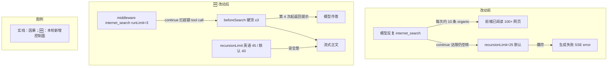

# 英语 Agent 联网次数封顶

> **文档角色**：实现思路专题（落地归档）  
> **日期**：2026-09-17  
> **需求摘要**：英语学习 Agent（及词包主检索）单轮反复调用 `internet_search`，触发 LangGraph `GRAPH_RECURSION_LIMIT`（默认 25），前端显示「生成失败」；本轮以工具硬顶 + 中间件收紧 + 显式 `recursionLimit` + 提示词约束修复。

## 延伸阅读

- [英语学习主Agent联网搜索转LLM.md](./英语学习主Agent联网搜索转LLM.md) — 主检索阶段搜索结果如何进入模型上下文
- [llm/Agent创建LLM统一.md](../llm/Agent创建LLM统一.md) — Agent / LLM 统一接入

---

## 1. 背景与目标

用户在英语学习右侧 Agent 提问时，模型会连续多次 `internet_search`（界面「已阅读 n 个网页」可达百余条），直至：

```
Recursion limit of 25 reached without hitting a stop condition.
```

前端 `englishAgentStore` 在正文为空时把 SSE `error` 帧写成「生成失败：…」。

**根因叠层**：

1. `toolCallLimitMiddleware` 使用 `exitBehavior: 'continue'`：达限后只拦工具，模型仍可反复发起 tool call，继续消耗图步。
2. `threadLimit` 与 `runLimit` 同为 12，语义易误解；本仓历史消息不含 ToolMessage，真正致命的是单轮连搜。
3. `AgentService.streamEvents` **未传** `recursionLimit`，默认 25；十余次「模型↔工具」往返即触顶，来不及产出正文。

**目标**：英语模式下本轮联网 ≤3 次；达限后返回提示文案促模型作答；图步显式抬高作安全垫；词包主检索阶段对齐同一策略。

---

## 2. 改动范围

| 路径 | 角色 |
|------|------|
| `apps/backend/src/services/agent/agent-middleware.ts` | `profile`、联网专用 limit、去掉双封顶、`agentStreamRecursionLimit` |
| `apps/backend/src/services/agent/agent-tools.ts` | `maxInternetSearchCallsPerRun` + `beforeSearch` 闭包计数 |
| `apps/backend/src/services/web-search/web-search.service.ts` | `beforeSearch` 钩子；description 禁反复换 query |
| `apps/backend/src/services/agent/agent.service.ts` | 英语 profile / maxSearch=3 / recursionLimit |
| `apps/backend/src/services/agent/agent.prompt.ts` | 英语专项：联网至多 1～2 次、搜完即答 |
| `apps/backend/src/services/english-learning/english-learning.service.ts` | 词包主检索阶段对齐封顶 |

---

## 3. 实现思路



要点：

1. **硬顶优先**：工具内计数不打 API，比只抬 `recursionLimit` 更治本。
2. **不用 `exitBehavior: 'end'`**：第 4 次搜直接掐死图，模型来不及根据已有结果写正文。
3. **去掉 `threadLimit=runLimit`**：只按本轮（上次 Human 之后）计 `runLimit`。
4. **提示词**：约束「至多 1～2 次、立即作答」，与硬顶双保险。

---

## 4. 关键实现（改动前 / 改动后）

### 4.1 `buildAgentLangchainMiddleware` + `agentStreamRecursionLimit`

**对比范围**：`apps/backend/src/services/agent/agent-middleware.ts` 全文件导出符号。

**改动前** · `apps/backend/src/services/agent/agent-middleware.ts`（基线，约 L12–L35）

```typescript
// 中间件构建入参类型：摘要模型 + token 估算
export type BuildAgentLangchainMiddlewareInput = {
	// 非流式副模型，供 summarizationMiddleware 折叠长对话
	summaryLlm: ChatOpenAI;
	// 与 AgentMemoryService.estimatePromptTokens 对齐的计数器
	estimatePromptTokens: (messages: BaseMessage[]) => number;
};

// 组装 createAgent 使用的中间件链
export function buildAgentLangchainMiddleware(
	// 摘要与计数依赖
	input: BuildAgentLangchainMiddlewareInput,
): ReadonlyArray<AgentMiddleware> {
	return [
		// 长对话摘要折叠，降低上下文膨胀
		summarizationMiddleware({
			// 副模型执行摘要
			model: input.summaryLlm,
			// token 或消息数达阈触发
			trigger: { tokens: 6000, messages: 12 },
			// 折叠后保留尾部消息数
			keep: { messages: 28 },
			// 自定义 token 估算
			tokenCounter: input.estimatePromptTokens,
		}),
		// 全工具次数上限；thread 与 run 同为 12；达限 continue 易空转
		toolCallLimitMiddleware({
			runLimit: 12,
			threadLimit: 12,
			exitBehavior: 'continue',
		}),
	];
}
```

**改动后** · `apps/backend/src/services/agent/agent-middleware.ts`（当前，约 L12–L58）

```typescript
// 中间件构建入参类型：摘要模型 + token 估算 + 可选场景 profile
export type BuildAgentLangchainMiddlewareInput = {
	// 非流式副模型，供 summarizationMiddleware 折叠长对话
	summaryLlm: ChatOpenAI;
	// 与 AgentMemoryService.estimatePromptTokens 对齐的计数器
	estimatePromptTokens: (messages: BaseMessage[]) => number;
	/**
	 * english_learning：收紧本轮工具次数，避免模型反复 internet_search 烧穿 LangGraph recursionLimit。
	 * 默认与其它 Agent 一致。
	 */
	profile?: 'default' | 'english_learning';
};

// 组装 createAgent 使用的中间件链
export function buildAgentLangchainMiddleware(
	// 摘要、计数与场景 profile
	input: BuildAgentLangchainMiddlewareInput,
): ReadonlyArray<AgentMiddleware> {
	// 是否英语学习专项：决定是否加联网专用 limit 与更紧的总 limit
	const english = input.profile === 'english_learning';
	return [
		// 长对话摘要折叠，降低上下文膨胀
		summarizationMiddleware({
			// 副模型执行摘要
			model: input.summaryLlm,
			// token 或消息数达阈触发
			trigger: { tokens: 6000, messages: 12 },
			// 折叠后保留尾部消息数
			keep: { messages: 28 },
			// 自定义 token 估算
			tokenCounter: input.estimatePromptTokens,
		}),
		// 英语：单独封顶 internet_search；continue + 工具硬顶；勿用 end 以免掐死作答
		...(english
			? [
					toolCallLimitMiddleware({
						// 只限制联网工具
						toolName: 'internet_search',
						// 本轮最多 3 次联网 tool call
						runLimit: 3,
						// 超额时拦工具、让模型继续生成正文
						exitBehavior: 'continue',
					}),
				]
			: []),
		toolCallLimitMiddleware({
			// 仅按本轮计数；勿 threadLimit=runLimit，避免达限后空转耗尽图步
			runLimit: english ? 8 : 12,
			// 超额拦工具，模型决定何时结束
			exitBehavior: 'continue',
		}),
	];
}

/** Agent.streamEvents 的图步上限（默认 LangGraph 为 25，工具往返易触顶） */
export function agentStreamRecursionLimit(
	// 场景：英语略高，给搜完作答留余量
	profile?: 'default' | 'english_learning',
): number {
	// 英语 45、其它 40；无硬公式，须明显高于默认 25
	return profile === 'english_learning' ? 45 : 40;
}
```

**变更摘要**：英语 profile 增加联网专用 limit；去掉 `threadLimit`；新增 `agentStreamRecursionLimit`。

---

### 4.2 `buildAgentLangChainTools` 联网硬顶

**对比范围**：`buildAgentLangChainTools` 全函数 + deps 新增字段。

**改动前** · `apps/backend/src/services/agent/agent-tools.ts`（约 L55–L70）

```typescript
// 组装 Agent 工具列表：联网 → RAG → 日期
export function buildAgentLangChainTools(
	// 检索 / 知识库 / 用户等依赖
	deps: BuildAgentLangChainToolsDeps,
	// 可选：联网完成回调
	opts?: BuildAgentLangChainToolsOpts,
): DynamicTool[] {
	const tools: DynamicTool[] = [
		// 注册 internet_search 等联网工具
		...deps.webSearchService.createLangChainWebSearchTools({
			// SSE 推送 organic
			onSearchComplete: opts?.onInternetSearchComplete,
			// Serper 时效档
			recency: deps.webSearchRecency,
			// Tavily 起止日
			tavilyStartDate: deps.webSearchTavilyStartDate,
			tavilyEndDate: deps.webSearchTavilyEndDate,
		}),
		// 用户知识库 RAG 工具
		deps.knowledgeQaService.createAgentKnowledgeRagTool(deps.userId),
		// 始终注册当前日期工具
		createAgentDateTool(),
	];
	// 返回完整工具数组
	return tools;
}
```

**改动后** · `apps/backend/src/services/agent/agent-tools.ts`（约 L60–L88）

```typescript
// 组装 Agent 工具列表：联网 → RAG → 可选日期；支持本轮联网次数硬顶
export function buildAgentLangChainTools(
	// 检索 / 知识库 / 用户 / 可选 maxInternetSearchCallsPerRun
	deps: BuildAgentLangChainToolsDeps,
	// 可选：联网完成回调
	opts?: BuildAgentLangChainToolsOpts,
): DynamicTool[] {
	// 本轮联网成功次数上限；未传则不硬顶
	const maxSearch = deps.maxInternetSearchCallsPerRun;
	// 闭包计数：同一 Agent 实例内累计成功进入检索的次数
	let searchCalls = 0;
	const tools: DynamicTool[] = [
		// 注册 internet_search，并注入 beforeSearch
		...deps.webSearchService.createLangChainWebSearchTools({
			// SSE 推送 organic
			onSearchComplete: opts?.onInternetSearchComplete,
			// Serper 时效档
			recency: deps.webSearchRecency,
			// Tavily 起止日
			tavilyStartDate: deps.webSearchTavilyStartDate,
			tavilyEndDate: deps.webSearchTavilyEndDate,
			// 打 API 前：达限则返回提示字符串、跳过检索
			beforeSearch: () => {
				// 未配置上限则放行
				if (maxSearch == null) return null;
				// 已达上限：提示模型立刻作答，禁止再搜
				if (searchCalls >= maxSearch) {
					return (
						`本轮联网已达上限（${maxSearch} 次）。` +
						`请立刻根据已有检索结果与常识作答，禁止再次调用 internet_search。`
					);
				}
				// 计入一次即将发生的检索
				searchCalls += 1;
				// 放行真实检索
				return null;
			},
		}),
		// 用户知识库 RAG 工具
		deps.knowledgeQaService.createAgentKnowledgeRagTool(deps.userId),
		// 仅当未显式关闭时注册日期工具
		...(deps.includeCurrentDateTool === false ? [] : [createAgentDateTool()]),
	];
	// 返回完整工具数组
	return tools;
}
```

**变更摘要**：`beforeSearch` 闭包硬顶；`includeCurrentDateTool === false` 时可去掉日期工具。

---

### 4.3 `createLangChainWebSearchTools` 的 `beforeSearch`

**改动前** · `apps/backend/src/services/web-search/web-search.service.ts`（约 `internet_search` func）

```typescript
				func: async (input: string) => {
					// 规范化模型传入的检索串
					const searchQuery =
						typeof input === 'string' ? input : String(input ?? '');
					// 走与 Chat 相同的检索拼装
					const r = await this.formatSearchContextForPrompt(searchQuery, {
						provider,
						recency,
						tavilyStartDate,
						tavilyEndDate,
					});
					// 回调 organic 供 SSE
					opts?.onSearchComplete?.(r, { searchQuery });
					// 返回可进模型上下文的文本
					return r.promptText ?? '（无检索结果）';
				},
```

**改动后** · 同文件（约 L105–L120）

```typescript
				func: async (input: string) => {
					// 硬顶钩子：非空则跳过 API，直接作为 tool observation
					const blocked = opts?.beforeSearch?.();
					// 达限时把提示交给模型，促其作答
					if (blocked) return blocked;
					// 规范化模型传入的检索串
					const searchQuery =
						typeof input === 'string' ? input : String(input ?? '');
					// 走与 Chat 相同的检索拼装
					const r = await this.formatSearchContextForPrompt(searchQuery, {
						provider,
						recency,
						tavilyStartDate,
						tavilyEndDate,
					});
					// 回调 organic 供 SSE
					opts?.onSearchComplete?.(r, { searchQuery });
					// 返回可进模型上下文的文本
					return r.promptText ?? '（无检索结果）';
				},
```

**变更摘要**：检索入口可短路；description 追加「禁止本轮反复换 query」。

---

### 4.4 `AgentService`：英语 profile / 硬顶 / recursionLimit

**对比范围**：`stream` 路径内「拼装工具 → createAgent → streamEvents」接线片段（同一段上下文，非整方法）。

**改动前** · `apps/backend/src/services/agent/agent.service.ts`（基线，约 L836–L883）

```typescript
			// 拼装工具集：联网 / RAG / 日期 + 本轮 Skill 工具
			const tools = [
				// 通用工具组装，无联网次数硬顶
				...buildAgentLangChainTools(
					{
						// 注入联网检索服务
						webSearchService: this.webSearchService,
						// 注入知识库问答服务
						knowledgeQaService: this.knowledgeQaService,
						// 当前用户，供 RAG 鉴权
						userId,
					},
					{
						// 检索完成后合并 organic 并经 SSE 推前端
						onInternetSearchComplete: (r) => {
							// 本批 organic 列表
							const batch = r.organic;
							// 空批不推送，避免无意义帧
							if (!batch?.length) return;
							// 与本轮已累计结果去重合并
							turnSearchOrganic = mergeAgentSearchOrganic(
								turnSearchOrganic,
								batch,
							);
							// 推送带序号的 organic，驱动「已阅读网页」
							subscriber.next({
								type: 'searchOrganic',
								data: {
									organic: withAgentOrganicPositions(turnSearchOrganic),
								},
							});
						},
					},
				),
				// 本轮已选 Skill 对应工具
				...buildAgentSkillTools(skillBodies),
			];

			// 创建 LangChain Agent：无 profile、无显式 recursionLimit
			const agent = createAgent({
				// 主聊天大模型，流式推理
				model: mainLlm,
				// 工具列表（Web / RAG / 日期等）
				tools,
				// 按 assistMode 解析系统提示
				systemPrompt: resolveAgentSystemPrompt(
					dto,
					formatSkillsSystemAppend(skillBodies),
				),
				// 默认中间件：摘要 + 全工具 runLimit/threadLimit=12
				middleware: buildAgentLangchainMiddleware({
					// 副模型做长对话摘要
					summaryLlm: summaryLlm,
					// token 估算与记忆服务对齐
					estimatePromptTokens: (msgs) =>
						this.memory.estimatePromptTokens(msgs),
				}),
			});

			// 开始流式事件；未传 recursionLimit → LangGraph 默认 25
			const eventStream = agent.streamEvents(
				{ messages: lcMessages },
				{ version: 'v2', signal: abortController.signal },
			);
```

**改动后** · `apps/backend/src/services/agent/agent.service.ts`（当前，约 L836–L897）

```typescript
			// 拼装工具集：英语模式额外传入联网硬顶 3
			const tools = [
				// 通用工具组装；英语时 maxInternetSearchCallsPerRun=3
				...buildAgentLangChainTools(
					{
						// 注入联网检索服务
						webSearchService: this.webSearchService,
						// 注入知识库问答服务
						knowledgeQaService: this.knowledgeQaService,
						// 当前用户，供 RAG 鉴权
						userId,
						// 仅英语学习：本轮成功联网不超过 3 次
						...(dto.assistMode === 'english_learning'
							? { maxInternetSearchCallsPerRun: 3 }
							: {}),
					},
					{
						// 检索完成后合并 organic 并经 SSE 推前端
						onInternetSearchComplete: (r) => {
							// 本批 organic 列表
							const batch = r.organic;
							// 空批不推送，避免无意义帧
							if (!batch?.length) return;
							// 与本轮已累计结果去重合并
							turnSearchOrganic = mergeAgentSearchOrganic(
								turnSearchOrganic,
								batch,
							);
							// 推送带序号的 organic，驱动「已阅读网页」
							subscriber.next({
								type: 'searchOrganic',
								data: {
									organic: withAgentOrganicPositions(turnSearchOrganic),
								},
							});
						},
					},
				),
				// 本轮已选 Skill 对应工具
				...buildAgentSkillTools(skillBodies),
			];

			// 场景 profile：驱动中间件收紧与图步上限
			const agentProfile =
				dto.assistMode === 'english_learning'
					? ('english_learning' as const)
					: ('default' as const);

			// 创建 LangChain Agent：传入 profile
			const agent = createAgent({
				// 主聊天大模型，流式推理
				model: mainLlm,
				// 工具列表（Web / RAG / 日期等）
				tools,
				// 按 assistMode 解析系统提示（英语含至多 1～2 次联网约束）
				systemPrompt: resolveAgentSystemPrompt(
					dto,
					formatSkillsSystemAppend(skillBodies),
				),
				// 英语：联网专用 limit + 总 runLimit=8；其它保持 12
				middleware: buildAgentLangchainMiddleware({
					// 副模型做长对话摘要
					summaryLlm: summaryLlm,
					// token 估算与记忆服务对齐
					estimatePromptTokens: (msgs) =>
						this.memory.estimatePromptTokens(msgs),
					// 场景 profile 传入中间件
					profile: agentProfile,
				}),
			});

			// 开始流式事件；显式抬高图步，配合工具封顶
			const eventStream = agent.streamEvents(
				{ messages: lcMessages },
				{
					version: 'v2',
					signal: abortController.signal,
					// 默认 25 易触顶；英语 45 / 默认 40
					recursionLimit: agentStreamRecursionLimit(agentProfile),
				},
			);
```

**变更摘要**：英语 `assistMode` 同时打开硬顶、中间件 profile 与更高 `recursionLimit`；非英语仅抬默认图步并去掉 thread 双封顶副作用（见中间件）。

---

### 4.5 `ENGLISH_LEARNING_SYSTEM_APPEND` 提示词

**对比范围**：`export const ENGLISH_LEARNING_SYSTEM_APPEND` 全常量（摘录：中间条目用 `// ...` 对称省略，仅展开第 6 条）。

**改动前** · `apps/backend/src/services/agent/agent.prompt.ts`（基线，约 L6–L16）

```typescript
// 英语学习 assistMode 追加到系统提示的专项约束常量
export const ENGLISH_LEARNING_SYSTEM_APPEND = `【英语学习专项约束】
// ...（未改动：服务范围与 1～5 条学习约束）
// 第 6 条仅说「可适度」联网，未限制次数与搜完即答
6）工具：仅在问题属于英语学习范畴时调用；用户生词本与笔记已入库时优先「知识库检索」；需核查用法或新闻英语时可适度「互联网搜索」摘要并标注信息性质。
// ...（未改动：第 7 条边界）
`;
```

**改动后** · `apps/backend/src/services/agent/agent.prompt.ts`（当前，约 L6–L16）

```typescript
// 英语学习 assistMode 追加到系统提示的专项约束常量
export const ENGLISH_LEARNING_SYSTEM_APPEND = `【英语学习专项约束】
// ...（未改动：服务范围与 1～5 条学习约束）
// 第 6 条改为次数上限 + 立即作答，与工具硬顶双保险
6）工具：仅在问题属于英语学习范畴时调用；用户生词本与笔记已入库时优先「知识库检索」；需核查用法或新闻英语时可「互联网搜索」**至多 1～2 次**，拿到摘要后**立即作答**，禁止换关键词反复联网或为「再搜一轮」空转。
// ...（未改动：第 7 条边界）
`;
```

**变更摘要**：从「可适度」改为次数上限 + 搜完即答，减少模型空转动机。

---

### 4.6 词包主检索 `runEnglishPackMasterResearchPhase` 中间件

**对比范围**：主检索阶段 `buildAgentLangChainTools` deps + `createAgent` middleware 数组。

**改动前** · `apps/backend/src/services/english-learning/english-learning.service.ts`（基线，约 L1458–L1506）

```typescript
			// 动态构建工具：联网 / RAG；无联网硬顶
			const tools = buildAgentLangChainTools(
				{
					webSearchService: this.webSearchService,
					knowledgeQaService: this.knowledgeQaService,
					userId,
					webSearchRecency: webSearchTime.recency,
					webSearchTavilyStartDate: webSearchTime.tavilyStartDate,
					webSearchTavilyEndDate: webSearchTime.tavilyEndDate,
					// includeCurrentDateTool 推断逻辑本轮未启用（注释保留）
					// includeCurrentDateTool:
					// 	this.inferEnglishPackUserNeedsCurrentDateTool(topic),
				},
				{
					// organic 经 onToolEvent 推前端
					onInternetSearchComplete: async (r, meta) => {
						const list = r.organic;
						if (!onToolEvent || !Array.isArray(list) || list.length === 0) {
							return;
						}
						const q = meta?.searchQuery?.trim();
						await Promise.resolve(
							onToolEvent({
								phase: 'organic',
								name: 'internet_search',
								searchOrganic: list,
								searchQuery: q || undefined,
							}),
						);
					},
				},
			);

			// 创建 Agent：仅一套全工具 limit，thread=run=12
			const agent = createAgent({
				model: mainLlm,
				tools,
				systemPrompt: AGENT_SYSTEM_PROMPT,
				// 与旧 chat Agent 中间件一致，无摘要折叠
				middleware: [
					toolCallLimitMiddleware({
						runLimit: 12,
						threadLimit: 12,
						exitBehavior: 'continue',
					}),
				],
			});
```

**改动后** · `apps/backend/src/services/english-learning/english-learning.service.ts`（当前，约 L1459–L1507）

```typescript
			// 动态构建工具：联网硬顶 3，与右侧 Agent 对齐
			const tools = buildAgentLangChainTools(
				{
					webSearchService: this.webSearchService,
					knowledgeQaService: this.knowledgeQaService,
					userId,
					webSearchRecency: webSearchTime.recency,
					webSearchTavilyStartDate: webSearchTime.tavilyStartDate,
					webSearchTavilyEndDate: webSearchTime.tavilyEndDate,
					// 主检索阶段：联网至多 3 次，避免无限 search
					maxInternetSearchCallsPerRun: 3,
					// includeCurrentDateTool 推断逻辑本轮未启用（注释保留）
					// includeCurrentDateTool:
					// 	this.inferEnglishPackUserNeedsCurrentDateTool(topic),
				},
				{
					// organic 经 onToolEvent 推前端
					onInternetSearchComplete: async (r, meta) => {
						const list = r.organic;
						if (!onToolEvent || !Array.isArray(list) || list.length === 0) {
							return;
						}
						const q = meta?.searchQuery?.trim();
						await Promise.resolve(
							onToolEvent({
								phase: 'organic',
								name: 'internet_search',
								searchOrganic: list,
								searchQuery: q || undefined,
							}),
						);
					},
				},
			);

			// 创建 Agent：联网专用 limit=3 + 总 runLimit=8，去掉 threadLimit
			const agent = createAgent({
				model: mainLlm,
				tools,
				systemPrompt: AGENT_SYSTEM_PROMPT,
				// 与英语聊天 Agent 策略对齐，无摘要折叠
				middleware: [
					toolCallLimitMiddleware({
						toolName: 'internet_search',
						runLimit: 3,
						exitBehavior: 'continue',
					}),
					toolCallLimitMiddleware({
						runLimit: 8,
						exitBehavior: 'continue',
					}),
				],
			});
```

**变更摘要**：词包主检索与右侧英语 Agent 共用「硬顶 3 + 中间件双层」策略，避免包生成阶段同样烧穿图步。

---

## 5. 兼容性与影响

| 项 | 说明 |
|----|------|
| 非英语 Agent | 无联网硬顶；`recursionLimit=40`；总工具 runLimit 仍 12；去掉 threadLimit |
| 英语 Agent / 词包主检索 | 联网 ≤3；总工具 ≤8；recursionLimit=45 |
| 用户可见 | 不再因无限 search 整轮失败；「已阅读网页」数量显著下降 |

**回归**：英语 Agent 需时效检索的问题仍可搜 1～3 次并出正文；故意诱导连搜应在第 4 次起看到工具提示并作答。

---

## 6. 相关源码路径

| 说明 | 路径 |
|------|------|
| 中间件 / 图步上限 | `apps/backend/src/services/agent/agent-middleware.ts` |
| 工具组装硬顶 | `apps/backend/src/services/agent/agent-tools.ts` |
| 联网工具钩子 | `apps/backend/src/services/web-search/web-search.service.ts` |
| SSE Agent 接线 | `apps/backend/src/services/agent/agent.service.ts` |
| 英语提示词 | `apps/backend/src/services/agent/agent.prompt.ts` |
| 词包主检索 | `apps/backend/src/services/english-learning/english-learning.service.ts` |

---

若与仓库最新源码不一致，以源码为准。
