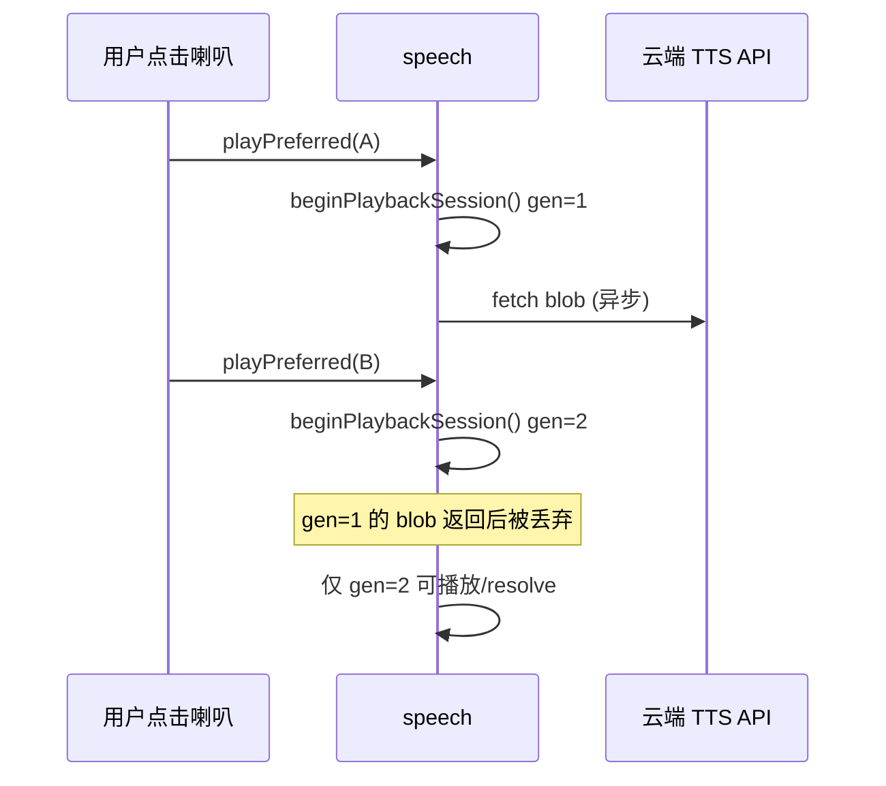

# 英语学习朗读：播放世代与异步丢弃

> **文档角色**：`playbackGeneration` 播放世代、快速连点防串音。  
> **按会员选路（单词/语句/练习统一云端或本机）**见 [`TTS会员路由.md`](./TTS会员路由.md)。  
> 收藏抽屉与主列表共用朗读见 [`英语收藏抽屉.md`](./英语收藏抽屉.md)。  
> **云端同句读音一致（MP3 LRU 缓存）**见 [`英语TTS缓存一致性.md`](./英语TTS缓存一致性.md)。  
> **MiniMax 流式 TTS 与硅基回退**见 [`MiniMax云端TTS.md`](./MiniMax云端TTS.md)。  
> **设置页用户偏好**见 [`云端TTS设置.md`](./云端TTS设置.md)。  
> **本机 Web Speech 音色**见 [`英语TTS本地语音.md`](./英语TTS本地语音.md)。  
> **cancel 后 settle（首句无声修复）**见 [`TTS本地取消结算影响.md`](./TTS本地取消结算影响.md)。

## 1. 背景与目标

### 1.1 用户视角

英语学习多处提供「喇叭」朗读：资源库单词、单词包、我的收藏、词形参考页等。用户快速连续点击不同词条时，可能出现：

- **旧请求晚到**：云端 TTS 的 MP3 在用户已点下一条后才开始播放，两条声音叠在一起；
- **单词走云端延迟高**：单个单词也走硅基云端 TTS，首包慢、且占用远程带宽。

### 1.2 本轮目标（播放世代）

| 层级 | 目标 |
|------|------|
| `speech.ts` | 引入 **`playbackGeneration`（播放世代）**，新播放 / `stopAll` 时作废上一轮异步结果 |

**朗读选路（会员云端 / 非会员本机）**已迁至 [`TTS会员路由.md`](./TTS会员路由.md)；本文不再维护「单词 `preferLocal: true`」策略。

若与仓库最新源码不一致，**以源码为准**。

---

## 2. 改动范围

| 说明 | 路径 |
|------|------|
| 朗读核心 | `apps/frontend/src/utils/speech.ts` |
| 我的收藏 · 单词 | `apps/frontend/src/views/englishLearning/favorites/VocabularyFavoritesSection.tsx` |
| 资源库 · 单词 | `apps/frontend/src/views/englishLearning/library/VocabularyLibraryWordsPanel.tsx` |
| 单词包列表 | `apps/frontend/src/views/englishLearning/pack/VocabularyPackList.tsx` |
| 词形参考 | `apps/frontend/src/views/englishLearning/reference/EnglishMorphologyReferencePage.tsx` |

---

## 3. 实现思路

### 3.1 播放世代（generation）



1. **`beginPlaybackSession()`**：`playbackGeneration += 1`，并 `stopPlaybackMediaOnly()`（停本机 speech + 云端 Audio），返回当前世代号。
2. **`stopAllPlayback()`**：同样递增世代并清空介质（与改前「停播」语义一致，且保证后续异步回调无效）。
3. **云端 / 本机路径**：在 `fetchCloudTtsBlob`、`playCloudMp3Blob`、`speakOneUtterance`、分句循环等 **await 前后** 检查 `isPlaybackGenerationActive(generation)`；已作废则 **静默 resolve**，不抛错、不覆盖新播放。

**为何 `playCloudMp3Blob` 内用 `stopPlaybackMediaOnly` 而非 `stopAll`**：同一会话内从云端切到本机回退时，只需清介质，不应再递增世代导致当前 generation 失效。

### 3.2 `preferLocal` 与会员选路

**当前产品策略**见 [`TTS会员路由.md`](./TTS会员路由.md)：

| `preferLocal` | 策略 |
|---------------|------|
| 省略 | 有效会员 → 云端 TTS（失败回退本机）；非会员 → 本机 |
| `true` | 强制本机（如本机音色设置试听） |

历史上曾用 `preferLocal: true` 让单词走本机；该策略已废弃。

### 3.3 与列表网络问题的关系

本方案**不解决** `error sending request` 类 HTTP 列表错误；该问题见 [`英语学习列表网络重试.md`](./英语学习列表网络重试.md)。TTS 云端路径仍可能失败，句子场景会回退本机。

### 3.4 云端同句读音漂移与 MP3 缓存

硅基 CosyVoice2 **无 seed**，同一 `text` 多次合成听感可能不同。已在前后端对规范化文本做 **MP3 LRU 缓存**（前端 64 条、后端 256 条）：**第一次**合成结果作为该句标准读音，**之后**重复播放复用缓存。详见 [`英语TTS缓存一致性.md`](./英语TTS缓存一致性.md)。

---

## 4. 关键代码与注释

### 4.1 选项类型与播放世代

**来源**：`apps/frontend/src/utils/speech.ts`（约 L72–L120）

```typescript
export type PlayPreferredOptions = {
	/** 为 true：优先本机 Web Speech（单词）；默认 false：优先云端 TTS（句子） */
	preferLocal?: boolean;
	/** 本机朗读时透传给 Web Speech 的 rate / pitch / volume */
	speak?: SpeakOptions;
};

/** 模块级世代计数；与 stopAll / 新播放 同步递增 */
let playbackGeneration = 0;

function isPlaybackGenerationActive(generation: number): boolean {
	return generation === playbackGeneration;
}

/** 只停介质，不递增世代（会话内切换云端/本机时用） */
function stopPlaybackMediaOnly(): void {
	window.speechSynthesis?.cancel();
	// 暂停 cloudAudio、revokeObjectURL ...
}

/** 新播放开始：作废旧世代并清空介质 */
function beginPlaybackSession(): number {
	playbackGeneration += 1;
	stopPlaybackMediaOnly();
	return playbackGeneration;
}

export function stopAllPlayback(): void {
	playbackGeneration += 1;
	stopPlaybackMediaOnly();
}
```

### 4.2 云端 MP3：世代校验

**来源**：`apps/frontend/src/utils/speech.ts`（`playCloudMp3Blob` 约 L158–L210）

```typescript
function playCloudMp3Blob(blob: Blob, generation: number): Promise<void> {
	stopPlaybackMediaOnly();
	if (!isPlaybackGenerationActive(generation)) {
		return Promise.resolve(); // 说明：已被新点击作废，安静结束
	}

	const url = URL.createObjectURL(blob);
	// ...
	audio.onended = () => {
		if (!isPlaybackGenerationActive(generation)) {
			// 说明：清理 object URL，避免泄漏；不更新 playingKey（由 UI 层管理）
			resolve();
			return;
		}
		// 正常结束清理
	};
	audio.onerror = () => {
		if (!isPlaybackGenerationActive(generation)) {
			resolve();
			return;
		}
		reject(new Error('AUDIO_PLAY'));
	};
	void audio.play().catch((err) => {
		if (!isPlaybackGenerationActive(generation)) {
			resolve();
			return;
		}
		reject(err);
	});
}
```

### 4.3 `playPreferred` 分支

**来源**：`apps/frontend/src/utils/speech.ts`（约 L300–L331）

```typescript
export async function playPreferred(
	rawText: string,
	options?: PlayPreferredOptions,
): Promise<void> {
	const plain = stripMarkdownForTts(rawText);
	if (!plain) return;

	const generation = beginPlaybackSession();
	const speakOpts = options?.speak;

	// 分支 1：单词 — 仅本机
	if (options?.preferLocal) {
		if (!isPlaybackGenerationActive(generation)) return;
		if (!isSpeechSupported()) {
			throw new Error('NO_TTS');
		}
		await speakTextWithGeneration(rawText, generation, speakOpts);
		return;
	}

	// 分支 2：句子 — 云端优先，失败回退本机
	try {
		const blob = await fetchCloudTtsBlob(plain);
		if (!isPlaybackGenerationActive(generation)) return;
		await playCloudMp3Blob(blob, generation);
	} catch {
		if (!isPlaybackGenerationActive(generation)) return;
		if (!isSpeechSupported()) throw new Error('NO_TTS');
		await speakTextWithGeneration(rawText, generation, speakOpts);
	}
}
```

### 4.4 页面接入（选路）

单词/练习等页面的 **`preferLocal: true` 已移除**；默认按会员选路，见 [`TTS会员路由.md`](./TTS会员路由.md) §4.4。

---

## 5. 兼容性与影响

| 项 | 说明 |
|----|------|
| API | 无后端变更；`playPreferred` 第二参数可选 |
| 朗读选路 | 见 [`TTS会员路由.md`](./TTS会员路由.md) |
| 播放世代 | 快速连点仍丢弃过期异步结果 |
| 竞态 | 快速连点仅最后一条有效播放，旧 Promise 静默结束 |

---

## 6. 建议回归测试

1. 资源库 / 收藏 / 单词包：快速连续点不同单词喇叭，不应两条同时响。
2. 单词：断网时仍可本机朗读（若系统有英文 voice）。
3. 经典句包：仍走云端；云端失败时可回退本机。
4. 播放中切换 Tab 或 `stopAllPlayback()`：声音立即停止，且无迟到的云端 MP3。

---

## 7. 相关文档

| 说明 | 路径 |
|------|------|
| 同句云端读音缓存 | [`英语TTS缓存一致性.md`](./英语TTS缓存一致性.md) |
| 列表 / 收藏 HTTP 韧性 | [`英语学习列表网络重试.md`](./英语学习列表网络重试.md) |
| 收藏抽屉朗读 | [`英语收藏抽屉.md`](./英语收藏抽屉.md) |
| 包内收藏与 TTS | [`英语词包收藏.md`](./英语词包收藏.md) |
