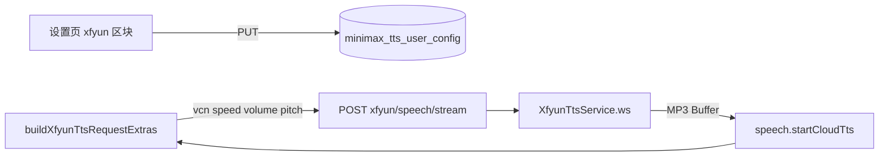

# 讯飞在线云端朗读（playbackSource=xfyun）

> **文档角色（主文档）**：有效会员在 **语音设置** 增加第三种朗读来源 **讯飞云端**；Nest 经 `ws` 连讯飞 WebSocket 合成 MP3，前端与 MiniMax 共用偏好表与 `speech` 选路。  
> **规划态思路（架构/时序/分阶段）**：[`docs/ideas/讯飞云TTS.md`](../ideas/tts/讯飞云TTS.md)  
> **延伸阅读**：[`TTS播放源.md`](./TTS播放源.md)（选路字段）、[`云端TTS设置.md`](./云端TTS设置.md)（设置页结构）、[`MiniMax云端TTS.md`](./MiniMax云端TTS.md)（MiniMax 路径）、[`TTS端到端指南.md`](./TTS端到端指南.md)（全景）、[`云端TTS用户凭据回退影响.md`](../impact/云端TTS用户凭据回退影响.md)（用户凭证与失败降级影响面）。

若与仓库最新源码不一致，**以源码为准**。

---

## 1. 背景与目标

### 1.1 问题

| 维度 | 改前 | 改后 |
|------|------|------|
| 会员朗读来源 | 本机 Web Speech / MiniMax 云端 **二选一** | 增加 **讯飞在线合成**（`playbackSource: 'xfyun'`），**三选一互斥** |
| 中文听书 | MiniMax 或硅基回退，中文体验一般 | 讯飞发音人 + 0–100 语速/音量/音高，适合 EPUB 听书/听当前 |
| 服务端 Node 18 | — | 不可用全局 `WebSocket`；`undici@8` 缺 `File`；改用 **`ws` 包** |

### 1.2 核心决策

1. **不新建偏好表**：`playbackSource` 扩展为 `'local' \| 'cloud' \| 'xfyun'`，讯飞 vcn 仍存 `voiceId`；音量/音高 UI 用 0–100，入库经线性映射复用 `vol`/`pitch`（与 MiniMax 量纲不同但共用列，切换来源时数值会「语义漂移」——与现有 speed 共用字段策略一致）。
2. **HTTP 形态与 MiniMax 对齐**：`POST /speech-transcription/xfyun/speech/stream` 返回 MP3；Nest 内 WebSocket 收齐后整段输出（非浏览器直连 wss）。
3. **Node 18 生产兼容**：`import WebSocket from 'ws'`，不用 Node 22 全局 WebSocket，不用 `undici@8`。
4. **未配置回退**：服务端无 `XFYUN_*` 或请求失败时，`speech` 仍走既有硅基/MiniMax/本机回退链。

---

## 2. 改动范围

| 路径 | 职责 |
|------|------|
| `apps/backend/src/services/speech-transcription/xfyun-tts.service.ts` | 讯飞 WS 合成、LRU、鉴权 URL |
| `apps/backend/src/services/speech-transcription/dto/xfyun-tts.dto.ts` | 请求体 `text/vcn/speed/volume/pitch` |
| `apps/backend/src/services/speech-transcription/speech-transcription.controller.ts` | 流式/整段 HTTP 端点 |
| `apps/backend/src/enum/config.enum.ts` | `XFYUN_APP_ID` 等 env 键 |
| `apps/backend/package.json` | 直接依赖 `ws` |
| `apps/frontend/src/constants/xfyunTts.ts` | 发音人列表、0–100 映射函数 |
| `apps/frontend/src/utils/minimaxTtsPrefs.ts` | `buildXfyunTtsRequestExtras`、选路归一化 |
| `apps/frontend/src/utils/speech.ts` | 按 `playbackSource` 选 API 与缓存 key |
| `apps/frontend/src/views/setting/cloudTts/index.tsx` | 讯飞参数区（发音人/语速/音量/音高） |
| `apps/frontend/src/views/setting/cloudTts/PlaybackSourcePicker.tsx` | 三选一选路 UI（新） |
| `apps/frontend/src/service/cloudTtsSettings.ts` | `TtsPlaybackSource` 类型 |
| `apps/backend/.../minimax-tts-prefs.service.ts` 等 | DTO/实体 `playbackSource` 含 `xfyun` |

---

## 3. 实现思路

### 3.1 数据流



### 3.2 参数映射（讯飞 0–100 ↔ 入库 vol/pitch）

| 讯飞 API | UI 展示 | 入库字段 | 映射 |
|----------|---------|----------|------|
| speed | 仍用 MiniMax 0.5–2 滑块 | `speed` | `(speed-0.5)/1.5×100` |
| volume | 0–100 | `vol` | `0.01 + v/100×(10-0.01)` |
| pitch | 0–100（50=默认） | `pitch` | `(p-50)/50×12` |

默认：`vol=5` → volume 50；`pitch=0` → pitch 50。

### 3.3 部署注意

- 服务端 `.env`：`XFYUN_APP_ID`、`XFYUN_API_KEY`、`XFYUN_API_SECRET`；可选 `XFYUN_TTS_VCN`。
- Node **v18.x**：须 `pnpm install --prod` 安装 `ws`；勿依赖 `undici@8` 作 WebSocket。

---

## 4. 关键代码对比与注释

### 4.1 `normalizePlaybackSource`（`apps/frontend/src/utils/minimaxTtsPrefs.ts`）

**对比范围**：选路归一化函数全函数。

**改动前** · `apps/frontend/src/utils/minimaxTtsPrefs.ts`（基线，`normalizeMinimaxTtsUserPrefs` 内联）

```typescript
// 从原始对象读取 playbackSource 字段
playbackSource: o.playbackSource === 'local' ? 'local' : 'cloud',
```

**改动后** · `apps/frontend/src/utils/minimaxTtsPrefs.ts`（当前，约 L51–L71）

```typescript
// 将未知选路值收敛为合法的三态之一
function normalizePlaybackSource(raw: unknown): TtsPlaybackSource {
	// 显式本机则返回 local
	if (raw === 'local') return 'local';
	// 显式讯飞则返回 xfyun
	if (raw === 'xfyun') return 'xfyun';
	// 其余（含 cloud、undefined、非法字符串）回落 MiniMax 云端
	return 'cloud';
}

// 切换朗读来源时，voiceId 在 MiniMax id 与讯飞 vcn 间对齐默认值
export function voiceIdForPlaybackSource(
	source: TtsPlaybackSource,
	currentVoiceId: string,
): string {
	// 目标为讯飞：若当前已是合法 vcn 则保留，否则默认 x4_yezi
	if (source === 'xfyun') {
		return isXfyunTtsVcn(currentVoiceId)
			? currentVoiceId
			: DEFAULT_XFYUN_TTS_VCN;
	}
	// 目标为 MiniMax 云端但 voiceId 仍是讯飞 vcn 时，改回 MiniMax 默认音色
	if (source === 'cloud' && isXfyunTtsVcn(currentVoiceId)) {
		return DEFAULT_MINIMAX_TTS_VOICE_ID;
	}
	// 本机或其它：保留当前 id，空则 MiniMax 默认
	return currentVoiceId || DEFAULT_MINIMAX_TTS_VOICE_ID;
}
```

**变更摘要**：`playbackSource` 从二值扩展为三值；切换来源时自动修正 `voiceId` 避免把 vcn 发给 MiniMax 或反之。

---

### 4.2 `buildXfyunTtsRequestExtras`（`apps/frontend/src/utils/minimaxTtsPrefs.ts`）

**对比范围**：纯新增函数（改动后）。

**改动后** · `apps/frontend/src/utils/minimaxTtsPrefs.ts`（当前，约 L291–L303）

```typescript
// 讯飞在线合成 POST body（不含 text）；与 MiniMax 共用 vol/pitch/speed 字段，此处映射到 0–100
export function buildXfyunTtsRequestExtras(): Record<string, unknown> {
	// 读取内存中已加载的用户朗读偏好
	const prefs = loadMinimaxTtsUserPrefs();
	// 若 voiceId 是已开通的讯飞 vcn 则直接使用，否则环境/默认 x4_yezi
	const vcn = isXfyunTtsVcn(prefs.voiceId)
		? prefs.voiceId
		: DEFAULT_XFYUN_TTS_VCN;
	// 返回讯飞 API 需要的四个 business 字段（均为 0–100 整数语义）
	return {
		vcn,
		speed: xfyunSpeedFromMinimaxSpeed(prefs.speed),
		volume: xfyunVolumeFromVol(prefs.vol),
		pitch: xfyunPitchFromPitch(prefs.pitch),
	};
}
```

**变更摘要**：新建；试听与 `speech` 云端请求共用；缓存 suffix 亦序列化此对象。

---

### 4.3 `volFromXfyunVolume` / `xfyunVolumeFromVol`（`apps/frontend/src/constants/xfyunTts.ts`）

**对比范围**：音量双向映射（纯新增，改动后）。

**改动后** · `apps/frontend/src/constants/xfyunTts.ts`（当前，约 L40–L57）

```typescript
// 将任意数值钳制到讯飞 0–100 整数
function clampXfyunParam(n: number): number {
	return Math.min(100, Math.max(0, Math.round(n)));
}

// MiniMax 音量 0.01–10 → 讯飞 0–100（用于 UI 展示与 API）
export function xfyunVolumeFromVol(vol: number): number {
	return clampXfyunParam(((vol - 0.01) / (10 - 0.01)) * 100);
}

// 讯飞 UI 音量 0–100 → 写回 prefs.vol（满足后端 DTO 0.01–10）
export function volFromXfyunVolume(volume: number): number {
	const v = clampXfyunParam(volume);
	return 0.01 + (v / 100) * (10 - 0.01);
}
```

**变更摘要**：设置页讯飞音量滑块与入库字段之间的唯一转换点。

---

### 4.4 `buildCloudTtsCacheKey`（`apps/frontend/src/utils/speech.ts`）

**对比范围**：新增函数 + 调用点替换（摘录 `getCloudTtsFromCache` 调用处）。

**改动前** · `apps/frontend/src/utils/speech.ts`（基线，约 L794–808）

```typescript
// 命中 LRU 时用 plain 文本拼接 MiniMax 参数后缀作为 key
const cacheKey = plain + buildMinimaxTtsCacheKeySuffix();
```

**改动后** · `apps/frontend/src/utils/speech.ts`（当前，约 L808–818、L985–1015）

```typescript
/** 云端 MP3 LRU key：按用户选路区分 MiniMax / 讯飞参数后缀 */
function buildCloudTtsCacheKey(plain: string): string {
	// 读取当前 playbackSource
	const prefs = loadMinimaxTtsUserPrefs();
	// 讯飞路径：plain + 分隔符 + xfyun + userId/vcn/speed/volume/pitch JSON
	if (prefs.playbackSource === 'xfyun') {
		return `${plain}\u0000xfyun${buildXfyunTtsCacheKeySuffix()}`;
	}
	// MiniMax/默认云端：沿用原有 plain + minimax extras JSON 后缀
	return plain + buildMinimaxTtsCacheKeySuffix();
}

// ...（未改动）startCloudTts 内 cacheKey 与 fetch URL/body 分支：

// 根据选路决定 POST 路径
const url = `${BASE_URL}${
	source === 'xfyun'
		? SPEECH_XFYUN_TTS_STREAM
		: extras && Object.keys(extras).length
			? SPEECH_MINIMAX_TTS_STREAM
			: SPEECH_TTS
}`;
// 讯飞时 body 为 text + buildXfyunTtsRequestExtras()；MiniMax 为 buildMinimaxTtsRequestExtras()
const body =
	source === 'xfyun'
		? { text: plain, ...buildXfyunTtsRequestExtras() }
		: { text: plain, ...extras };
```

**变更摘要**：同一句话在切换 MiniMax/讯飞 后不会命中错误缓存 MP3。

---

### 4.5 `UpsertMinimaxTtsPrefsDto.playbackSource`（`apps/backend/.../upsert-minimax-tts-prefs.dto.ts`）

**对比范围**：`playbackSource` 校验装饰器一行。

**改动前** · `apps/backend/src/services/speech-transcription/dto/upsert-minimax-tts-prefs.dto.ts`（基线）

```typescript
// 仅允许 local 或 cloud
@IsIn(['local', 'cloud'])
playbackSource!: 'local' | 'cloud';
```

**改动后** · `apps/backend/src/services/speech-transcription/dto/upsert-minimax-tts-prefs.dto.ts`（当前）

```typescript
// 会员朗读三选一：本机 / MiniMax / 讯飞
@IsIn(['local', 'cloud', 'xfyun'])
playbackSource!: 'local' | 'cloud' | 'xfyun';
```

**变更摘要**：入库校验与前端 `TtsPlaybackSource` 对齐。

---

### 4.6 `synthesizeViaWebSocket`（`apps/backend/src/services/speech-transcription/xfyun-tts.service.ts`）

**对比范围**：纯新增服务中的 WebSocket 合成核心（改动后摘录）。

**改动后** · `apps/backend/src/services/speech-transcription/xfyun-tts.service.ts`（当前，约 L204–278）

```typescript
/** ponytail: ws 包（Node 18 无全局 WebSocket；undici@8 需 Node 20+） */
private synthesizeViaWebSocket(resolved: XfyunTtsResolved): Promise<Buffer> {
	// 从环境变量解析讯飞应用凭证
	const { appId, apiKey, apiSecret } = this.resolveCredentials();
	// 构造含 business.speed/volume/pitch 的单帧 JSON
	const requestPayload = this.buildRequestPayload(resolved, appId);
	// HMAC 鉴权后的 wss URL
	const wsUrl = this.buildAuthWsUrl(apiKey, apiSecret);

	return new Promise((resolve, reject) => {
		// 收集各 WS 帧 base64 解码后的 MP3 片段
		const parts: Buffer[] = [];
		// 防止 open/message/close 重复 settle
		let settled = false;
		const finish = (err?: Error, buffer?: Buffer) => {
			if (settled) return;
			settled = true;
			clearTimeout(timer);
			try {
				ws.close();
			} catch {
				// ignore
			}
			if (err) reject(err);
			else resolve(buffer ?? Buffer.alloc(0));
		};

		// 使用 ws 包建立连接（Node 18 兼容）
		const ws = new WebSocket(wsUrl);
		const timer = setTimeout(() => {
			finish(new HttpException('讯飞 TTS 超时', HttpStatus.GATEWAY_TIMEOUT));
		}, WS_TIMEOUT_MS);

		ws.on('open', () => {
			ws.send(requestPayload);
		});

		ws.on('message', (data) => {
			const raw =
				typeof data === 'string' ? data : Buffer.from(data).toString('utf8');
			const msg = this.parseWsPayload(raw);
			this.assertXfyunOk(msg, '讯飞语音合成');
			const audioB64 = msg.data?.audio?.trim();
			if (audioB64) {
				parts.push(Buffer.from(audioB64, 'base64'));
			}
			if (msg.data?.status === 2) {
				if (parts.length === 0) {
					finish(
						new HttpException(
							'讯飞语音合成未返回音频',
							HttpStatus.BAD_GATEWAY,
						),
					);
					return;
				}
				finish(undefined, Buffer.concat(parts));
			}
		});

		ws.on('error', () => {
			finish(
				new HttpException('讯飞 TTS WebSocket 错误', HttpStatus.BAD_GATEWAY),
			);
		});

		ws.on('close', () => {
			if (!settled && parts.length > 0) {
				finish(undefined, Buffer.concat(parts));
				return;
			}
			if (!settled) {
				finish(
					new HttpException(
						'讯飞 TTS 连接已关闭且无音频',
						HttpStatus.BAD_GATEWAY,
					),
				);
			}
		});
	});
}
```

**变更摘要**：Nest 侧 WS 客户端；单帧 `status:2` 发全文（避免 10163）；`ws` 事件 API 替代浏览器 `addEventListener`。

---

## 5. 兼容性与影响

| 项 | 说明 |
|----|------|
| 数据库 | `playback_source` 列 varchar，新值 `xfyun` 无需 migration（若已有列） |
| 非会员 | 仍仅本机，无选路 UI |
| MiniMax 用户 | 选 `cloud` 时行为与改前一致 |
| 电子书听书 | `playbackSource===xfyun` 时走讯飞分段流水线（与 MiniMax 共用 `speech`） |
| 生产 Node 18 | 必须安装 `ws`；禁用仅 `undici` 方案 |

---

## 6. 风险与回归

- [ ] 语音设置：三选一切换后试听（MiniMax / 讯飞 / 本机）
- [ ] 讯飞：改 vcn、语速、**音量、音高** 后试听与听书缓存是否更新
- [ ] 服务端无 `XFYUN_*`：应回退，不 500 拖死整站（除误配 undici 导致启动失败——已修复为 ws）
- [ ] 发音人 11200：控制台未授权 vcn 时错误文案是否可读
- [ ] 登录后 PUT `/settings/cloud-tts` 保存 `playbackSource: xfyun` 不触发 DTO 400

---

## 7. 相关源码路径

| 说明 | 路径 |
|------|------|
| 讯飞合成服务 | `apps/backend/src/services/speech-transcription/xfyun-tts.service.ts` |
| HTTP 端点 | `apps/backend/src/services/speech-transcription/speech-transcription.controller.ts` |
| 前端选路与请求 | `apps/frontend/src/utils/speech.ts` |
| 偏好与 extras | `apps/frontend/src/utils/minimaxTtsPrefs.ts` |
| 设置页 UI | `apps/frontend/src/views/setting/cloudTts/index.tsx` |
| 参数映射 | `apps/frontend/src/constants/xfyunTts.ts` |

---

（若与仓库最新源码不一致，以源码为准）
