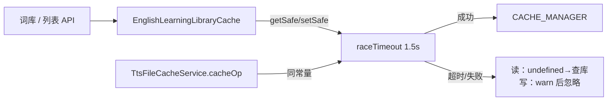

# 词库 Cache 超时旁路

> **文档角色**：已落地实现归档。  
> **延伸阅读**：[TTS缓存复用全局Cache.md](./TTS缓存复用全局Cache.md)（同 `CACHE_COMMAND_TIMEOUT_MS` 的 TTS `cacheOp`）、[文库单词列表缓存.md](./文库单词列表缓存.md)、[练习请求作用域与预热.md](./练习请求作用域与预热.md)、规划态 [ideas/english/练习听写请求防阻塞.md](../ideas/english/练习听写请求防阻塞.md)。

## 1. 背景与目标

英语资源库列表旁路走全局 `CACHE_MANAGER`。Redis 抖动时，`cache.get/set` 可能长时间挂起，拖死词库接口甚至拖累同进程其它路由。

本轮目标：

- 在 **业务层** 对单次 Cache await 做 **1500ms** race，超时当 miss（读）或静默跳过（写）；
- **不改** Keyv / Bull 连接参数（避免伤验证码与 BullMQ 阻塞命令）；
- Bull 工厂显式 `maxRetriesPerRequest: null`，消除启动 WARNING。

## 2. 改动范围

- `apps/backend/src/factorys/redis-config.factory.ts`（导出 `CACHE_COMMAND_TIMEOUT_MS`；删注释掉的测试连接死代码）
- `apps/backend/src/services/english-learning/english-learning-library.cache.ts`（`raceTimeout` + `getSafe`/`setSafe`）
- `apps/backend/src/factorys/bull-redis-connection.factory.ts`（显式 `maxRetriesPerRequest: null`；**保持** `enableOfflineQueue: true`）

## 3. 实现思路



**权衡**：不用全局 `commandTimeout`——Bull 的 `XREAD BLOCK` / `BZPOPMIN` 会被误杀；验证码长等也会误伤。

## 4. 关键实现（改动前 / 改动后）

### 4.1 `CACHE_COMMAND_TIMEOUT_MS`

**改动前** · `redis-config.factory.ts`：无该常量；曾有注释掉的 `test_connection` 探测块。

**改动后** · `apps/backend/src/factorys/redis-config.factory.ts`（当前，约 L7–L11）

```typescript
/**
 * 仅供词库 getSafe / TTS cacheOp 等「单次 await 旁路」用，不改变 Keyv 连接参数。
 * 验证码等仍走原 Cache 连接语义。
 */
export const CACHE_COMMAND_TIMEOUT_MS = 1500;
```

**变更摘要**：连接工厂 socket / reconnect 策略与改前一致；仅多导出常量并去掉死代码注释块。

---

### 4.2 `raceTimeout` + `getSafe` / `setSafe`

**对比范围**：三方法。

**改动前** · `english-learning-library.cache.ts`（基线）

```typescript
	async getSafe<T>(key: string): Promise<T | undefined> {
		try {
			const v = await this.cache.get<T>(key);
			return v === null || v === undefined ? undefined : v;
		} catch (e) {
			this.logger.warn?.(
				`[el-lib-cache] get failed key=${key}: ${e instanceof Error ? e.message : e}`,
			);
			return undefined;
		}
	}

	async setSafe(key: string, value: unknown, ttlMs: number): Promise<void> {
		try {
			await this.cache.set(key, value, ttlMs);
		} catch (e) {
			this.logger.warn?.(
				`[el-lib-cache] set failed key=${key}: ${e instanceof Error ? e.message : e}`,
			);
		}
	}
```

**改动后** · 同文件（当前，约 L99–L137）

```typescript
	// 单次 Promise 与定时器竞速；超时抛 CACHE_TIMEOUT，由调用方当失败处理
	private raceTimeout<T>(p: Promise<T>, label: string): Promise<T> {
		return new Promise<T>((resolve, reject) => {
			const timer = setTimeout(() => {
				reject(new Error(`CACHE_TIMEOUT:${label}`));
			}, CACHE_COMMAND_TIMEOUT_MS);
			p.then(
				(v) => {
					clearTimeout(timer);
					resolve(v);
				},
				(e) => {
					clearTimeout(timer);
					reject(e);
				},
			);
		});
	}

	async getSafe<T>(key: string): Promise<T | undefined> {
		try {
			// 超时或 Redis 错 → catch → undefined → 上层查库
			const v = await this.raceTimeout(this.cache.get<T>(key), 'get');
			return v === null || v === undefined ? undefined : v;
		} catch (e) {
			this.logger.warn?.(
				`[el-lib-cache] get failed key=${key}: ${e instanceof Error ? e.message : e}`,
			);
			return undefined;
		}
	}

	async setSafe(key: string, value: unknown, ttlMs: number): Promise<void> {
		try {
			// 写超时只 warn，不抛到业务，避免列表接口 500
			await this.raceTimeout(this.cache.set(key, value, ttlMs), 'set');
		} catch (e) {
			this.logger.warn?.(
				`[el-lib-cache] set failed key=${key}: ${e instanceof Error ? e.message : e}`,
			);
		}
	}
```

**变更摘要**：语义仍为 fail-open；增加硬超时上限。

---

### 4.3 Bull `maxRetriesPerRequest`

**改动前** · `bull-redis-connection.factory.ts`：未显式写该字段（Bull 警告）。

**改动后** · 同文件（当前，约 L10–L17）

```typescript
export function createBullRedisConnectionOptions(configService: ConfigService) {
	return {
		host: configService.get<string>(RedisEnum.REDIS_HOST) ?? 'localhost',
		port: configService.get<number>(RedisEnum.REDIS_PORT) ?? 6379,
		username: configService.get<string>(RedisEnum.REDIS_USERNAME),
		password: configService.get<string>(RedisEnum.REDIS_PASSWORD),
		connectTimeout: 5000,
		// BullMQ 要求 null；显式写出消除 WARNING，勿改成数字
		maxRetriesPerRequest: null,
		socket: {
			keepAlive: true,
			keepAliveInitialDelay: 30000,
		},
		// ...（未改动：retryStrategy / enableOfflineQueue: true / reconnectOnError）
	};
}
```

**变更摘要**：**禁止**把 `enableOfflineQueue` 改成 `false`（会导致 Worker「Stream isn't writeable」刷屏）。

## 5. 行为变化与兼容性

- 词库列表：Redis 慢时最多多等 1.5s 再回源 DB，用户侧表现为偶发略慢而非卡死。
- 验证码 / 其它 Cache 调用方：未包 `raceTimeout` 的路径行为不变。
- Bull：仅消 WARNING，队列语义不变。

## 6. 测试与回归

1. 人为让 Redis 极慢 / 断连：打开资源库列表仍应在约数秒内回源成功。
2. 登录验证码收发正常。
3. 后端启动无 `maxRetriesPerRequest` WARNING；空闲无 offlineQueue=false 刷屏。

## 7. 相关源码路径

| 说明 | 路径 |
|------|------|
| 超时常量 | `apps/backend/src/factorys/redis-config.factory.ts` |
| 词库旁路 | `apps/backend/src/services/english-learning/english-learning-library.cache.ts` |
| Bull 连接 | `apps/backend/src/factorys/bull-redis-connection.factory.ts` |

---

（若与仓库最新源码不一致，以源码为准）
