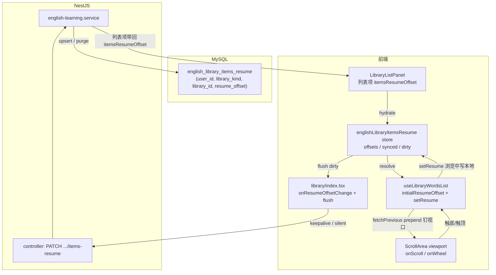

# 资源库词条列表续读：跨会话进度持久化与双向分页

> **路径已收口**：本文代码块中的 `library/hooks/useLibraryWordsList.ts`、`store/englishLibraryItemsResume.ts` 等路径已在本轮重命名/合并——Hook 改为 `hooks/useEnglishLearningList.ts`、store 改为 `store/englishLearningResume.ts`。完整变更见 [英语学习列表模块收口.md](./英语学习列表模块收口.md)。

> 解决英语学习 **单词库 / 经典语句库** 右侧词条列表「刷新页面 / 重开应用后，又回到首屏」的问题。  
> 对齐电子书阅读进度：浏览中只改本地 offset，离开当前库 / 切后台 / 刷新 / 关闭页时再 flush 到数据库，下次再进同一库直接定位到上次的「页起点」。  
> 姊妹文档：会话内（不刷新）缓存与滚动位置恢复见 [`文库单词列表缓存.md`](./文库单词列表缓存.md)；列表网络重试见 [`英语学习列表网络重试.md`](./英语学习列表网络重试.md)；收藏星增量见 [`收藏星增量UI.md`](./收藏星增量UI.md)。

若与仓库最新源码不一致，**以源码为准**。

---

## 1. 背景与目标

### 1.1 用户视角

在英语学习 **资源库** 页：

1. 选中某个库，向下滚动加载多页词条；
2. 关闭浏览器 / 退出桌面应用，**或刷新整页**；
3. 再次进入同一个库。

**改前**：右侧列表回到首屏（第 0 条起），需要重新滚到底并等待加载更多。已有的「会话内缓存」只在**不刷新**时有效，刷新即清空。

**改后**：跨会话也能**直接定位到上次阅读的页起点**（对齐到分页粒度），向上滚动还能继续加载更早的词条（双向分页）；公开库的非所有者也有自己独立的进度。

### 1.2 设计约束

| 约束 | 说明 |
| ---- | ---- |
| 跨会话持久化 | 新增 `english_library_items_resume` 表，按 (user, kind, library) 唯一 |
| 按用户隔离 | 公开库的非所有者也能记进度，互不覆盖 |
| 对齐页起点 | offset 取 `floor(offset / pageSize) * pageSize`，避免落在分页中间 |
| 浏览中不写库 | 本地 dirty 标记，离开库 / 切后台 / pagehide 时再 flush（与电子书进度一致） |
| keepalive 上报 | pagehide / 卸载阶段用 `fetch(..., { keepalive: true })`，避免被浏览器掐断 |
| 取消公开清理 | 公开库转私有时删掉非所有者进度，避免孤儿数据 |
| 删库清理 | 删除库时按 (kind, libraryId) 批量清掉所有用户的进度 |
| 双向分页 | 进续读页后向上滚触发 `fetchPrevious`，prepend 时钉住视口防黑屏 |

---

## 2. 改动范围

### 2.1 后端

| 说明 | 路径 |
| ---- | ---- |
| 续读实体（新建） | `apps/backend/src/services/english-learning/entity/english-library-items-resume.entity.ts` |
| 续读 DTO（新建） | `apps/backend/src/services/english-learning/dto/update-library-items-resume.dto.ts` |
| 建表迁移（新建） | `apps/backend/src/migrations/1787360581773-english_library_items_resume.ts` |
| 占位迁移（新建） | `apps/backend/src/migrations/1787360578741-english_library_items_resume.ts` |
| 控制器：续读路由 | `apps/backend/src/services/english-learning/english-learning.controller.ts` |
| 服务：续读读写 + 清理 | `apps/backend/src/services/english-learning/english-learning.service.ts` |
| 模块：注册实体 | `apps/backend/src/services/english-learning/english-learning.module.ts` |

### 2.2 前端

| 说明 | 路径 |
| ---- | ---- |
| 续读 store（新建） | `apps/frontend/src/store/englishLibraryItemsResume.ts` |
| offset 对齐工具（新建） | `apps/frontend/src/views/englishLearning/library/utils/libraryWordsListResume.ts` |
| API：PATCH + keepalive | `apps/frontend/src/service/index.ts` |
| 列表 Hook：双向分页 + 续读 | `apps/frontend/src/views/englishLearning/library/hooks/useLibraryWordsList.ts` |
| 资源库页：flush 与回写 | `apps/frontend/src/views/englishLearning/library/index.tsx` |
| 单词库面板：续读入口 + prepend | `apps/frontend/src/views/englishLearning/library/vocabulary/index.tsx` |
| 经典句库面板：续读入口 + prepend | `apps/frontend/src/views/englishLearning/library/classic/index.tsx` |
| 左侧列表：续读灌入与同步 | `apps/frontend/src/views/englishLearning/library/components/LibraryListPanel.tsx` |
| 会话缓存：窗口字段 | `apps/frontend/src/views/englishLearning/library/utils/libraryWordsListCache.ts` |
| 收藏增量：识别 prepend | `apps/frontend/src/hooks/useIncrementalVocabFavoriteStatus.ts`、`apps/frontend/src/hooks/useIncrementalClassicQuoteFavoriteStatus.ts` |
| 卡片：`h-full` 防 prepend 塌陷 | `apps/frontend/src/views/englishLearning/components/VocabularyWordCard.tsx`、`apps/frontend/src/views/englishLearning/components/ClassicQuoteCard.tsx` |
| 换号清空 | `apps/frontend/src/store/resetUserState.ts` |

---

## 3. 实现思路

### 3.1 总体数据流



### 3.2 关键决策

1. **offset 对齐页起点**：DB 存的是「页起点」而非任意 scrollTop 像素。原因：分页 API 以 offset 取整页，落在中间会少半页；对齐后无论 pageSize 怎么变都能直接 GET。
2. **浏览中不写库**：每次滚一页就 PATCH 一次既浪费又会与触底加载抢请求；改为本地 dirty，离开库 / pagehide / visibilitychange=hidden 时一次性 flush，与电子书进度防抖同源。
3. **keepalive fetch**：`http.patch` 是 async Promise，pagehide 时会被浏览器掐断；改用原生 `fetch(..., { keepalive: true })` 兜底（仅用于离场瞬间）。
4. **公开库非所有者也独立**：续读按 `(userId, kind, libraryId)` 唯一，而非按 owner；公开库被多人浏览时各记各的，互不覆盖。
5. **取消公开清理非所有者进度**：公开→私有时，非所有者已不可见该库，孤儿进度既占空间又可能在再次公开时跳到过期位置；保留创建者自己的进度。
6. **双向分页 + prepend 钉视口**：进续读页后向上滚需要加载更早的词条；prepend 会把已绘制内容顶下去，桌面 WKWebView 在 `scrollTop≈0` 时会落到未绘制新区导致黑屏一帧——用 `flushSync` + `ΔscrollHeight` 在同一同步回合钉住视口。
7. **收藏增量识别 prepend**：原增量 Hook 只认「末尾追加」，prepend 会被误判为「整体替换」而清空已查状态；新增「头部 prepend」签名判断。

---

## 4. 关键代码对比与注释

### 4.1 续读实体（新建，纯新增）

**来源**：`apps/backend/src/services/english-learning/entity/english-library-items-resume.entity.ts`（当前，约 L1–L37）

```typescript
// 引入 TypeORM 装饰器：列、实体、索引、主键、更新时间
import {
	Column,
	Entity,
	Index,
	PrimaryGeneratedColumn,
	UpdateDateColumn,
} from 'typeorm';

// 续读类型：vocab=单词库，classic=经典语句库
export type EnglishLibraryItemsResumeKind = 'vocab' | 'classic';

// 实体对应表 english_library_items_resume
@Entity('english_library_items_resume')
// 唯一索引：同一用户对同一类型同一库只能有一条进度
@Index('UQ_elir_user_kind_library', ['userId', 'libraryKind', 'libraryId'], {
	unique: true,
})
// 普通索引：按库批量清理（删库 / 取消公开）走 (kind, libraryId)
@Index('idx_elir_kind_library', ['libraryKind', 'libraryId'])
export class EnglishLibraryItemsResume {
	// 主键 uuid
	@PrimaryGeneratedColumn('uuid')
	id!: string;

	// 进度归属用户
	@Column({ name: 'user_id', type: 'int' })
	userId!: number;

	// 库类型（vocab / classic）
	@Column({ name: 'library_kind', type: 'varchar', length: 16 })
	libraryKind!: EnglishLibraryItemsResumeKind;

	// 库 id（与 vocab / classic 库主表 id 对应）
	@Column({ name: 'library_id', type: 'varchar', length: 36 })
	libraryId!: string;

	// 续读 offset（页起点）；默认 0 表示从头开始
	@Column({ name: 'resume_offset', type: 'int', default: 0 })
	resumeOffset!: number;

	// 最近一次 upsert 时间，便于排查
	@UpdateDateColumn({ name: 'updated_at', type: 'timestamp' })
	updatedAt!: Date;
}
```

### 4.2 续读 DTO（新建，纯新增）

**来源**：`apps/backend/src/services/english-learning/dto/update-library-items-resume.dto.ts`（当前，约 L1–L7）

```typescript
// class-validator 校验装饰器
import { IsInt, Min } from 'class-validator';

// 更新单词库 / 语句库词条列表续读 offset（页起点）
export class UpdateLibraryItemsResumeDto {
	// 必须是整数
	@IsInt()
	// 最小 0（offset=0 表示从头开始 / 清空进度）
	@Min(0)
	offset!: number;
}
```

### 4.3 模块：注册实体（改动前 / 改动后）

**对比范围**：`english-learning.module.ts` 的 `imports` 数组 `TypeOrmModule.forFeature([...])` 列表（仅展示 import 与注册两处）。

**改动前** · `apps/backend/src/services/english-learning/english-learning.module.ts`（基线，约 L10、L45）

```typescript
// 旧版 import 区——尚未引入续读实体
import { EnglishClassicQuotesLibraryItem } from './entity/english-classic-quotes-library-item.entity';
import { EnglishClassicQuotesPackItem } from './entity/english-classic-quotes-pack-item.entity';
// ...
// 旧版 forFeature 列表——未注册续读实体
			EnglishVocabularyLibraryItem,
			EnglishClassicQuotesLibrary,
			EnglishClassicQuotesLibraryItem,
		]),
	],
```

**改动后** · `apps/backend/src/services/english-learning/english-learning.module.ts`（当前，约 L10–L13、L46–L49）

```typescript
// 经典语句库子表实体（既有）
import { EnglishClassicQuotesLibraryItem } from './entity/english-classic-quotes-library-item.entity';
// 新增：续读实体，供 service 注入 Repository
import { EnglishLibraryItemsResume } from './entity/english-library-items-resume.entity';
// 经典语句包项（既有，import 顺序按字母）
import { EnglishClassicQuotesPackItem } from './entity/english-classic-quotes-pack-item.entity';
// ...
			EnglishVocabularyLibraryItem,
			EnglishClassicQuotesLibrary,
			EnglishClassicQuotesLibraryItem,
			// 新增：注册续读实体，使 service 可 @InjectRepository(EnglishLibraryItemsResume)
			EnglishLibraryItemsResume,
		]),
	],
```

**变更摘要**：新增实体 import 与 `forFeature` 注册一项，使 `EnglishLibraryItemsResume` 可被注入。

### 4.4 控制器：续读路由（新建，纯新增）

**来源**：`apps/backend/src/services/english-learning/english-learning.controller.ts`（当前，约 L459–L476、L653–L670；两个路由结构对称）

```typescript
// 引入续读 DTO
import { UpdateLibraryItemsResumeDto } from './dto/update-library-items-resume.dto';
// ...
// 单词库续读路由：PATCH vocabulary-libraries/:libraryId/items-resume
@Patch('vocabulary-libraries/:libraryId/items-resume')
async updateVocabularyLibraryItemsResume(
	// 鉴权后的请求，含 user
	@Req() req: AuthedRequest,
	// 路径参数：库 id
	@Param('libraryId') libraryId: string,
	// 请求体：{ offset }
	@Body() dto: UpdateLibraryItemsResumeDto,
) {
	// 取登录用户 id
	const userId = req.user?.userId;
	// 未登录直接抛 401
	if (userId == null) {
		throw new UnauthorizedException('未授权');
	}
	// 委托 service upsert 续读并返回最新库列表项
	const data =
		await this.englishLearningService.updateVocabularyLibraryItemsResume(
			userId,
			libraryId,
			dto.offset,
		);
	// 统一返回结构
	return { success: true, data };
}
// ...
// 经典语句库续读路由：PATCH classic-quotes-libraries/:libraryId/items-resume
@Patch('classic-quotes-libraries/:libraryId/items-resume')
async updateClassicQuotesLibraryItemsResume(
	@Req() req: AuthedRequest,
	@Param('libraryId') libraryId: string,
	@Body() dto: UpdateLibraryItemsResumeDto,
) {
	const userId = req.user?.userId;
	if (userId == null) {
		throw new UnauthorizedException('未授权');
	}
	// 经典句库版本，service 内部走 'classic' kind
	const data =
		await this.englishLearningService.updateClassicQuotesLibraryItemsResume(
			userId,
			libraryId,
			dto.offset,
		);
	return { success: true, data };
}
```

### 4.5 服务：列表项映射加 `itemsResumeOffset`（改动前 / 改动后）

**对比范围**：`mapVocabularyLibraryListItem` 与 `mapClassicQuotesLibraryListItem` 两个映射函数（结构对称，以单词库为例）。

**改动前** · `apps/backend/src/services/english-learning/english-learning.service.ts`（基线，约 L1999–L2011；旧版 mapClassicQuotesLibraryListItem 原位于 L2284）

```typescript
// 旧版映射函数：只有 2 个参数，不携带续读
private mapVocabularyLibraryListItem(
	row: EnglishVocabularyLibrary,
	viewerUserId: number,
) {
	return {
		id: row.id,
		title: row.title,
		wordCount: row.wordCount,
		createdAt: row.createdAt.toISOString(),
		isPublic: row.isPublic,
		isOwned: row.userId === viewerUserId,
	};
}
```

**改动后** · `apps/backend/src/services/english-learning/english-learning.service.ts`（当前，约 L1999–L2018；mapClassicQuotesLibraryListItem 已上移与此对称）

```typescript
// 新版：第 3 个参数为续读 offset，缺省 0
private mapVocabularyLibraryListItem(
	row: EnglishVocabularyLibrary,
	viewerUserId: number,
	// 当前用户对该库的续读 offset；非所有者也可有独立进度
	itemsResumeOffset = 0,
) {
	return {
		id: row.id,
		title: row.title,
		wordCount: row.wordCount,
		createdAt: row.createdAt.toISOString(),
		isPublic: row.isPublic,
		isOwned: row.userId === viewerUserId,
		// 输出字段：对齐到 ≥0，避免负数 offset 透出
		itemsResumeOffset: Math.max(0, itemsResumeOffset),
	};
}

// 新版：经典语句库映射移到 mapVocabulary 旁边，结构对称
private mapClassicQuotesLibraryListItem(
	row: EnglishClassicQuotesLibrary,
	viewerUserId: number,
	itemsResumeOffset = 0,
) {
	return {
		id: row.id,
		title: row.title,
		quoteCount: row.quoteCount,
		createdAt: row.createdAt.toISOString(),
		isPublic: row.isPublic,
		isOwned: row.userId === viewerUserId,
		itemsResumeOffset: Math.max(0, itemsResumeOffset),
	};
}
```

**变更摘要**：两个映射函数新增 `itemsResumeOffset` 可选参数并在返回对象中输出；经典语句库映射从下方上移到单词库旁，便于对称维护。

### 4.6 服务：续读读写与清理辅助（新建，纯新增）

**来源**：`apps/backend/src/services/english-learning/english-learning.service.ts`（当前，约 L2041–L2126）

```typescript
// 批量挂载当前用户的续读 offset：列表页 ≤100，一次 IN 查询
private async loadLibraryItemsResumeOffsetMap(
	userId: number,
	libraryKind: EnglishLibraryItemsResumeKind,
	libraryIds: string[],
): Promise<Map<string, number>> {
	// 返回 libraryId → offset 的映射
	const map = new Map<string, number>();
	// 空列表直接返回空 map，避免 IN() 报错
	if (libraryIds.length === 0) return map;
	// 一次查询当前用户在这批库上的所有进度
	const rows = await this.libraryItemsResumeRepo.find({
		where: {
			userId,
			libraryKind,
			libraryId: In(libraryIds),
		},
		// 只取需要的两列，减少传输
		select: ['libraryId', 'resumeOffset'],
	});
	// 填入 map，并对齐 ≥0
	for (const row of rows) {
		map.set(row.libraryId, Math.max(0, row.resumeOffset ?? 0));
	}
	return map;
}

// 单库查询当前用户的续读 offset
private async getLibraryItemsResumeOffset(
	userId: number,
	libraryKind: EnglishLibraryItemsResumeKind,
	libraryId: string,
): Promise<number> {
	// 只取 resumeOffset 一列
	const row = await this.libraryItemsResumeRepo.findOne({
		where: { userId, libraryKind, libraryId },
		select: ['resumeOffset'],
	});
	// 无记录时返回 0（从头开始）
	return Math.max(0, row?.resumeOffset ?? 0);
}

/**
 * 按库清理全部浏览进度。
 * 先按 (library_kind, library_id) 索引取一批 id 再删，避免单次超长 DELETE 锁表；
 * 升级路径可改成原生 LIMIT 删。
 */
private async purgeLibraryItemsResume(
	libraryKind: EnglishLibraryItemsResumeKind,
	libraryId: string,
): Promise<void> {
	// 每批 2000 条，控制单次 DELETE 体积
	const chunk = 2000;
	for (;;) {
		// 先查这批 id
		const rows = await this.libraryItemsResumeRepo.find({
			where: { libraryKind, libraryId },
			select: ['id'],
			take: chunk,
		});
		// 没有了就退出
		if (rows.length === 0) break;
		// 按 id 批量删
		await this.libraryItemsResumeRepo.delete({
			id: In(rows.map((r) => r.id)),
		});
		// 不足一批说明已到末尾
		if (rows.length < chunk) break;
	}
}

/**
 * 取消公开：删掉非所有者进度，保留创建者进度。
 * 非所有者已不可见该库，孤儿进度占空间且再公开时可能跳到过期位置。
 */
private async purgeLibraryItemsResumeExceptOwner(
	libraryKind: EnglishLibraryItemsResumeKind,
	libraryId: string,
	ownerUserId: number,
): Promise<void> {
	const chunk = 2000;
	for (;;) {
		// 查非所有者的进度 id（Not 排除 owner）
		const rows = await this.libraryItemsResumeRepo.find({
			where: {
				libraryKind,
				libraryId,
				userId: Not(ownerUserId),
			},
			select: ['id'],
			take: chunk,
		});
		if (rows.length === 0) break;
		await this.libraryItemsResumeRepo.delete({
			id: In(rows.map((r) => r.id)),
		});
		if (rows.length < chunk) break;
	}
}

// upsert 当前用户对某库的续读 offset
private async upsertLibraryItemsResume(
	userId: number,
	libraryKind: EnglishLibraryItemsResumeKind,
	libraryId: string,
	offset: number,
): Promise<number> {
	// 对齐到 ≥0 整数；NaN / undefined 兜底 0
	const next = Math.max(0, Math.floor(Number(offset) || 0));
	// offset=0 视为「从头开始」：直接删记录，不保留 0 行
	if (next <= 0) {
		await this.libraryItemsResumeRepo.delete({
			userId,
			libraryKind,
			libraryId,
		});
		return 0;
	}
	// 否则 upsert：按 (userId, libraryKind, libraryId) 唯一约束冲突时更新 resumeOffset
	await this.libraryItemsResumeRepo.upsert(
		{
			userId,
			libraryKind,
			libraryId,
			resumeOffset: next,
		},
		['userId', 'libraryKind', 'libraryId'],
	);
	return next;
}
```

### 4.7 服务：续读写入入口（新建，纯新增）

**来源**：`apps/backend/src/services/english-learning/english-learning.service.ts`（当前，约 L2278–L2296、L2604–L2622；两个对称）

```typescript
// 更新单词库词条列表续读 offset（可读即可：自有或公开）
async updateVocabularyLibraryItemsResume(
	userId: number,
	libraryId: string,
	offset: number,
): Promise<VocabularyLibraryListItem> {
	// 断言当前用户对该库「可读」——非所有者也可写自己的进度
	const lib = await this.assertVocabularyLibraryReadable(userId, libraryId);
	// upsert 进度
	const resume = await this.upsertLibraryItemsResume(
		userId,
		'vocab',
		libraryId,
		offset,
	);
	// 返回最新库列表项（含 itemsResumeOffset）
	return this.mapVocabularyLibraryListItem(lib, userId, resume);
}
// ...
// 更新经典语句库列表续读 offset（可读即可：自有或公开）
async updateClassicQuotesLibraryItemsResume(
	userId: number,
	libraryId: string,
	offset: number,
): Promise<ClassicQuotesLibraryListItem> {
	// 经典句库的可读断言
	const lib = await this.assertClassicQuotesLibraryReadable(
		userId,
		libraryId,
	);
	// upsert 进度，kind='classic'
	const resume = await this.upsertLibraryItemsResume(
		userId,
		'classic',
		libraryId,
		offset,
	);
	// 返回最新列表项
	return this.mapClassicQuotesLibraryListItem(lib, userId, resume);
}
```

### 4.8 服务：词条分页查询附带续读（改动前 / 改动后）

**对比范围**：`listVocabularyLibraryItems` 的取数与返回段（经典语句库版本对称）。

**改动前** · `apps/backend/src/services/english-learning/english-learning.service.ts`（基线，约 L2126–L2140）

```typescript
// 旧版：只查 items，不查续读
const rows = await this.vocabLibraryItemRepo.find({
	where: { libraryId },
	order: { sortOrder: 'ASC' },
	take: limit,
	skip: offset,
});

return {
	// 旧版映射不带续读
	library: this.mapVocabularyLibraryListItem(lib, userId),
	items: rows.map((r) => this.mapLibraryItemRow(r)),
};
```

**改动后** · `apps/backend/src/services/english-learning/english-learning.service.ts`（当前，约 L2312–L2328）

```typescript
// 新版：items 与 续读 并行查询，节省一次 RTT
const [rows, resume] = await Promise.all([
	// 词条查询（与旧版一致）
	this.vocabLibraryItemRepo.find({
		where: { libraryId },
		order: { sortOrder: 'ASC' },
		take: limit,
		skip: offset,
	}),
	// 并行查当前用户对该库的续读 offset
	this.getLibraryItemsResumeOffset(userId, 'vocab', libraryId),
]);

return {
	// 映射时把续读带进列表项
	library: this.mapVocabularyLibraryListItem(lib, userId, resume),
	items: rows.map((r) => this.mapLibraryItemRow(r)),
};
```

**变更摘要**：用 `Promise.all` 并行查询 items 与续读 offset，并在返回的 `library` 上携带 `itemsResumeOffset`，省一次串行 RTT。

### 4.9 服务：取消公开时清理非所有者进度（改动前 / 改动后）

**对比范围**：`updateVocabularyLibraryVisibility` 的写入与返回段（经典语句库版本对称）。

**改动前** · `apps/backend/src/services/english-learning/english-learning.service.ts`（基线，约 L2093–L2098）

```typescript
// 旧版：未判断 wasPublic，直接写 isPublic 并返回
if (!lib) {
	throw new NotFoundException('单词库不存在');
}
lib.isPublic = dto.isPublic;
const saved = await this.vocabLibraryRepo.save(lib);
// 旧版映射不带续读
return this.mapVocabularyLibraryListItem(saved, userId);
```

**改动后** · `apps/backend/src/services/english-learning/english-learning.service.ts`（当前，约 L2245–L2262）

```typescript
if (!lib) {
	throw new NotFoundException('单词库不存在');
}
// 记下改前是否公开
const wasPublic = lib.isPublic;
// 写入新的可见性
lib.isPublic = dto.isPublic;
const saved = await this.vocabLibraryRepo.save(lib);
// 公开→私有：删非所有者进度，避免孤儿
if (wasPublic && !saved.isPublic) {
	await this.purgeLibraryItemsResumeExceptOwner(
		'vocab',
		libraryId,
		saved.userId,
	);
}
// 重新查当前用户的续读（取消公开可能影响自身进度保留情况）
const resume = await this.getLibraryItemsResumeOffset(
	userId,
	'vocab',
	libraryId,
);
// 返回带续读的列表项
return this.mapVocabularyLibraryListItem(saved, userId, resume);
```

**变更摘要**：公开→私有时清理非所有者进度；返回前补查自身续读。删库路径（`deleteVocabularyLibrary` 等）新增 `purgeLibraryItemsResume('vocab', libraryId)` 调用（结构对称，此处略）。

### 4.10 前端 API：PATCH 与 keepalive 兜底（新建，纯新增）

**来源**：`apps/frontend/src/service/index.ts`（当前，约 L815–L851、L957–L993；单词库与经典句库对称）

```typescript
// 列表项类型新增可选字段：续读 offset
export type EnglishVocabularyLibraryListItem = {
	// ...
	// 续读 offset（当前登录用户；公开库非所有者也独立）
	itemsResumeOffset?: number;
};
// ...
// 更新单词库词条列表续读 offset（可读即可）
export const patchEnglishVocabularyLibraryItemsResume = async (
	libraryId: string,
	offset: number,
	options?: { silent?: boolean },
) => {
	// 走通用 http.patch，silent 默认 true 不弹错误 Toast
	return await http.patch<EnglishVocabularyLibraryListItem>(
		ENGLISH_LEARNING_VOCABULARY_LIBRARIES,
		{ offset },
		{
			// URL 拼成 .../vocabulary-libraries/:libraryId/items-resume
			params: [libraryId, 'items-resume'],
			silent: options?.silent ?? true,
		},
	);
};

// 刷新 / 关闭页时 keepalive 上报续读（async PATCH 会被浏览器中断）
export function patchEnglishVocabularyLibraryItemsResumeKeepalive(
	libraryId: string,
	offset: number,
): void {
	// SSR / 非浏览器环境直接返回
	if (typeof window === 'undefined') return;
	// 从 localStorage 取 token
	const token = localStorage.getItem('token')?.trim();
	// 未登录不报
	if (!token) return;
	// 原生 fetch + keepalive，允许在 pagehide 阶段发出
	void fetch(
		`${BASE_URL}${ENGLISH_LEARNING_VOCABULARY_LIBRARIES}/${encodeURIComponent(libraryId)}/items-resume`,
		{
			method: 'PATCH',
			headers: {
				'Content-Type': 'application/json',
				Authorization: `Bearer ${token}`,
			},
			body: JSON.stringify({ offset }),
			// 关键：keepalive 让请求在页面卸载后仍能完成
			keepalive: true,
		},
	);
}
```

**说明**：经典语句库版本 `patchEnglishClassicQuotesLibraryItemsResume` / `patchEnglishClassicQuotesLibraryItemsResumeKeepalive` 结构对称，仅常量换为 `ENGLISH_LEARNING_CLASSIC_QUOTES_LIBRARIES`。

### 4.11 前端 store：会话内 offset 缓存与 dirty flush（新建，纯新增）

**来源**：`apps/frontend/src/store/englishLibraryItemsResume.ts`（当前，全文 L1–L152）

```typescript
/**
 * 资源库词条续读 offset 会话缓存。
 * 浏览中只改本地；离开当前库 / 切后台 / 刷新时再 flush 到 DB（对齐电子书进度）。
 */
// 引入单词库与经典句库的 PATCH 与 keepalive 上报
import {
	patchEnglishClassicQuotesLibraryItemsResume,
	patchEnglishClassicQuotesLibraryItemsResumeKeepalive,
	patchEnglishVocabularyLibraryItemsResume,
	patchEnglishVocabularyLibraryItemsResumeKeepalive,
} from '@/service';
// 库类型 vocab / classic
import type { LibraryKind } from '@/views/englishLearning/library/types';
// offset 对齐工具
import { alignResumeOffset } from '@/views/englishLearning/library/utils/libraryWordsListResume';

// 默认页大小，用于对齐
const PAGE_SIZE_HINT = 50;

// 当前会话内已写入的 offset
const offsets = new Map<string, number>();
// 已成功同步到服务端的值；与 offsets 不同则视为 dirty
const synced = new Map<string, number>();
// dirty 标记集合
const dirty = new Set<string>();

// 组合 key：kind:libraryId
function entryKey(kind: LibraryKind, libraryId: string): string {
	return `${kind}:${libraryId}`;
}

// 判断是否需要标记 dirty
function markDirtyIfNeeded(key: string, next: number) {
	// 取已同步值，缺省 0
	const prevSynced = synced.get(key) ?? 0;
	// 与已同步值相同则不脏
	if (next === prevSynced) {
		dirty.delete(key);
	} else {
		// 否则标记为脏，待 flush
		dirty.add(key);
	}
}

// 浏览中：写入本地 offset（不立即上报）
export function setEnglishLibraryItemsResumeOffset(
	kind: LibraryKind,
	libraryId: string,
	offset: number,
	pageSize = PAGE_SIZE_HINT,
): void {
	// 去空格
	const id = libraryId.trim();
	if (!id) return;
	const key = entryKey(kind, id);
	// 对齐到页起点
	const next = alignResumeOffset(offset, pageSize);
	// offset=0 视为从头开始，删掉本地记录
	if (next <= 0) {
		offsets.delete(key);
	} else {
		offsets.set(key, next);
	}
	// 评估 dirty
	markDirtyIfNeeded(key, next);
}

// 仅会话内写过 / 从列表灌过时有值
export function getEnglishLibraryItemsResumeOffset(
	kind: LibraryKind,
	libraryId: string,
): number | undefined {
	const id = libraryId.trim();
	if (!id) return undefined;
	const key = entryKey(kind, id);
	// 既没写过也没脏标记，返回 undefined（让调用方走 fallback）
	if (!offsets.has(key) && !dirty.has(key)) return undefined;
	return offsets.get(key) ?? 0;
}

// store 优先，否则用列表 / 接口带回的 fallback
export function resolveEnglishLibraryItemsResumeOffset(
	kind: LibraryKind,
	libraryId: string,
	fallback = 0,
	pageSize = PAGE_SIZE_HINT,
): number {
	// 先看本地 store
	const stored = getEnglishLibraryItemsResumeOffset(kind, libraryId);
	// 有就直接用
	if (stored !== undefined) return stored;
	// 否则用 fallback（来自 API 列表项）并对齐
	return alignResumeOffset(fallback, pageSize);
}

// 列表拉取后：用 API 值填补尚未写入的条目（不覆盖会话内更新，且视为已同步）
export function hydrateEnglishLibraryItemsResumeOffset(
	kind: LibraryKind,
	libraryId: string,
	offset: number,
	pageSize = PAGE_SIZE_HINT,
): void {
	const id = libraryId.trim();
	if (!id) return;
	const key = entryKey(kind, id);
	// 会话内已写过 / 已脏则不覆盖
	if (offsets.has(key) || dirty.has(key)) return;
	// 对齐
	const next = alignResumeOffset(offset, pageSize);
	if (next > 0) {
		offsets.set(key, next);
	}
	// 视为已同步
	synced.set(key, next);
	dirty.delete(key);
}

/**
 * 将本地 dirty 续读刷到服务端。
 * keepalive：pagehide / 切后台 / 卸载，避免被浏览器掐断。
 */
export function flushEnglishLibraryItemsResume(
	kind: LibraryKind,
	libraryId: string,
	opts?: { keepalive?: boolean },
): void {
	const id = libraryId.trim();
	if (!id) return;
	const key = entryKey(kind, id);
	// 不脏就不发
	if (!dirty.has(key)) return;
	// 取当前 offset，缺省 0
	const offset = offsets.get(key) ?? 0;

	// keepalive 路径：pagehide / 卸载阶段
	if (opts?.keepalive) {
		if (kind === 'vocab') {
			patchEnglishVocabularyLibraryItemsResumeKeepalive(id, offset);
		} else {
			patchEnglishClassicQuotesLibraryItemsResumeKeepalive(id, offset);
		}
		// 乐观标记为已同步
		synced.set(key, offset);
		dirty.delete(key);
		return;
	}

	// 普通路径：async PATCH
	const patch =
		kind === 'vocab'
			? patchEnglishVocabularyLibraryItemsResume
			: patchEnglishClassicQuotesLibraryItemsResume;
	// 失败保持 dirty，下次离开再试
	void patch(id, offset)
		.then(() => {
			synced.set(key, offset);
			dirty.delete(key);
		})
		.catch(() => {
			// 保持 dirty，下次离开再试
		});
}

// 清掉单个库的本地进度（删库 / 切库时用）
export function clearEnglishLibraryItemsResumeOffset(
	kind: LibraryKind,
	libraryId: string,
): void {
	const id = libraryId.trim();
	if (!id) return;
	const key = entryKey(kind, id);
	offsets.delete(key);
	synced.delete(key);
	dirty.delete(key);
}

// 切换账号时清空（由 resetUserState 调用）
export function clearEnglishLibraryItemsResumeCache(): void {
	offsets.clear();
	synced.clear();
	dirty.clear();
}
```

### 4.12 前端工具：offset 对齐页起点（新建，纯新增）

**来源**：`apps/frontend/src/views/englishLearning/library/utils/libraryWordsListResume.ts`（当前，约 L1–L8）

```typescript
/**
 * 资源库词条续读 offset：对齐到页起点
 */

// 将任意 offset 对齐到页起点；非法值回退 0
export function alignResumeOffset(offset: number, pageSize: number): number {
	// 非有限数 / 非正 / 页大小非正 → 0
	if (!Number.isFinite(offset) || offset <= 0 || pageSize <= 0) return 0;
	// 向下取整到 pageSize 的倍数
	return Math.floor(offset / pageSize) * pageSize;
}
```

### 4.13 前端 Hook：refs 与 `setResume`（改动前 / 改动后）

**对比范围**：`useLibraryWordsList` 的 refs 声明段与 `setResume` 新增回调。

**改动前** · `apps/frontend/src/views/englishLearning/library/hooks/useLibraryWordsList.ts`（基线，约 L48–L66）

```typescript
const [resolvedLibrary, setResolvedLibrary] = useState<TLibrary | null>(null);
const [loading, setLoading] = useState(false);
const [loadingMore, setLoadingMore] = useState(false);
// 从缓存恢复时用于恢复 ScrollArea 滚动位置
const [initialScrollTop, setInitialScrollTop] = useState(0);

// 旧版：单一 offset（= 已加载 items.length），不支持双向
const offsetRef = useRef(0);
const hasMoreRef = useRef(true);
const fetchingMoreRef = useRef(false);
const libraryIdRef = useRef<string | null>(null);
const loadGenRef = useRef(0);
const scrollTopRef = useRef(0);
```

**改动后** · `apps/frontend/src/views/englishLearning/library/hooks/useLibraryWordsList.ts`（当前，约 L60–L115）

```typescript
const [resolvedLibrary, setResolvedLibrary] = useState<TLibrary | null>(null);
const [loading, setLoading] = useState(false);
const [loadingMore, setLoadingMore] = useState(false);
// 新增：向上 prepend 时的 loading
const [loadingPrevious, setLoadingPrevious] = useState(false);
// 从缓存恢复时用于恢复滚动位置
const [initialScrollTop, setInitialScrollTop] = useState(0);

// 新版：双向窗口——下界（API offset）与上界（下一页 offset）
const startOffsetRef = useRef(0);
const endOffsetRef = useRef(0);
const hasMoreRef = useRef(true);
// 新增：是否还有更早的页（向上 prepend 用）
const hasPreviousRef = useRef(false);
const fetchingMoreRef = useRef(false);
// 新增：向上 prepend 锁
const fetchingPrevRef = useRef(false);
// 新增：prepend 校正期间忽略触顶 / 触底
const suppressScrollLoadRef = useRef(false);
// 新增：进入后续读页后，用户滚动 / 点击后再允许无限加载
const scrollLoadArmedRef = useRef(false);
// 新增：上次 scrollTop，用于判断方向（up / down）
const lastScrollTopRef = useRef(0);
const libraryIdRef = useRef<string | null>(null);
const loadGenRef = useRef(0);
const scrollTopRef = useRef(0);
// 新增：resolvedLibrary 的 ref，避免 onViewportScroll 依赖 state 触发重建
const resolvedLibraryRef = useRef<TLibrary | null>(null);
// 新增：items 的 ref，同上
const itemsRef = useRef<TItem[]>([]);
// 新增：fetchPage 的 ref，避免 fetchPageWithRetry 重建
const fetchPageRef = useRef(fetchPage);
// 新增：t 的 ref，避免 onViewportScroll 依赖 t 重建
const tRef = useRef(t);
// 新增：上次已写入的续读，避免重复上报
const lastSavedResumeRef = useRef(0);
// 新增：进入库时的续读（来自列表项）
const initialResumeOffsetRef = useRef(initialResumeOffset);
// 新增：是否写回服务端（非所有者应 false，但本应用中非所有者也写自己的进度）
const persistResumeRef = useRef(persistResume);
// 新增：续读变更回调 ref
const onResumeOffsetChangeRef = useRef(onResumeOffsetChange);
// 新增：fetchFirstPage 的 ref，避免 useEffect 依赖重建导致重载
const fetchFirstPageRef = useRef<
	(id: string, gen: number, resumeOffset: number) => Promise<void>
>(async () => {});

// 同步 ref 到最新值（每次渲染都执行）
fetchPageRef.current = fetchPage;
tRef.current = t;
resolvedLibraryRef.current = resolvedLibrary;
itemsRef.current = items;
initialResumeOffsetRef.current = initialResumeOffset;
persistResumeRef.current = persistResume;
onResumeOffsetChangeRef.current = onResumeOffsetChange;

// 新增：写续读的统一入口（对齐 + 去重 + 委托回调）
const setResume = useCallback(
	(offset: number) => {
		// 当前库 id
		const id = libraryIdRef.current;
		if (!id) return;
		// 对齐到页起点
		const next = alignResumeOffset(offset, pageSize);
		// 与上次相同则不写，避免重复上报
		if (next === lastSavedResumeRef.current) return;
		// 记下本次写入
		lastSavedResumeRef.current = next;
		// 不持久化则直接返回（非所有者场景）
		if (!persistResumeRef.current) return;
		// 委托页面层写本地 store + 同步左侧列表
		onResumeOffsetChangeRef.current?.(id, next);
	},
	[pageSize],
);
```

**变更摘要**：把单一 `offsetRef` 拆成 `startOffsetRef` / `endOffsetRef` 双窗口，新增 `hasPreviousRef`、`fetchingPrevRef`、`suppressScrollLoadRef`、`scrollLoadArmedRef`、`lastScrollTopRef` 等 prepend / 方向判定 refs；新增 `setResume` 统一写续读。

### 4.14 前端 Hook：`applyWindow`（新建，纯新增）

**来源**：`apps/frontend/src/views/englishLearning/library/hooks/useLibraryWordsList.ts`（当前，约 L141–L156）

```typescript
// 新增：把一段查询结果应用为当前窗口（首屏 / prepend / append 共用）
const applyWindow = useCallback(
	(
		id: string,
		// 这段的 API offset（页起点）
		startOffset: number,
		// 这段的词条数组
		list: TItem[],
		// 库元信息
		resolved: TLibrary | null,
	) => {
		// 下界 = 这段起点
		startOffsetRef.current = startOffset;
		// 上界 = 起点 + 这段长度
		endOffsetRef.current = startOffset + list.length;
		// 还有更早的页当且仅当起点 > 0
		hasPreviousRef.current = startOffset > 0;
		// 还有更多当且仅当这段满页
		hasMoreRef.current = list.length >= pageSize;
		// 写入 items
		setItems(list);
		// 写入库元信息
		if (resolved) setResolvedLibrary(resolved);
		// 写续读（本地 + 委托）
		setResume(startOffset);
		// 持久化到会话缓存
		persistCache(id, { items: list, resolvedLibrary: resolved });
	},
	[pageSize, persistCache, setResume],
);
```

### 4.15 前端 Hook：`fetchFirstPage` 进续读页（改动前 / 改动后）

**对比范围**：`fetchFirstPage` 函数签名与首屏取数段。

**改动前** · `apps/frontend/src/views/englishLearning/library/hooks/useLibraryWordsList.ts`（基线，约 L82–L112）

```typescript
const fetchFirstPage = useCallback(
	async (id: string, gen: number) => {
		fetchingMoreRef.current = false;
		setLoading(true);
		setLoadingMore(false);
		setInitialScrollTop(0);
		scrollTopRef.current = 0;
		// 旧版：offset 重置为 0
		offsetRef.current = 0;
		hasMoreRef.current = true;
		setItems([]);
		setResolvedLibrary(null);
		try {
			// 旧版：永远从 0 拉首屏
			const data = await fetchPageWithRetry(id, 0);
			if (gen !== loadGenRef.current || libraryIdRef.current !== id) return;
			const resolved = data.library ?? null;
			if (resolved) {
				setResolvedLibrary(resolved);
			}
			const list = Array.isArray(data.items) ? data.items : [];
			setItems(list);
			offsetRef.current = list.length;
			hasMoreRef.current = list.length >= pageSize;
			persistCache(id, {
				items: list,
				resolvedLibrary: resolved,
			});
		} catch {
			// ...
		}
	},
	[fetchPageWithRetry, pageSize, persistCache, t],
);
```

**改动后** · `apps/frontend/src/views/englishLearning/library/hooks/useLibraryWordsList.ts`（当前，约 L157–L210）

```typescript
const fetchFirstPage = useCallback(
	// 新签名：第 3 个参数 resumeOffset
	async (id: string, gen: number, resumeOffset: number) => {
		fetchingMoreRef.current = false;
		// 重置 prepend 锁
		fetchingPrevRef.current = false;
		// 进入库期间禁止触底 / 触顶自动加载
		suppressScrollLoadRef.current = true;
		// 用户未滚动 / 点击前不允许无限加载
		scrollLoadArmedRef.current = false;
		setLoading(true);
		setLoadingMore(false);
		setLoadingPrevious(false);
		setInitialScrollTop(0);
		scrollTopRef.current = 0;
		// 双窗口都重置到续读起点
		lastScrollTopRef.current = 0;
		startOffsetRef.current = resumeOffset;
		endOffsetRef.current = resumeOffset;
		hasMoreRef.current = true;
		// 还有更早的页当且仅当续读起点 > 0
		hasPreviousRef.current = resumeOffset > 0;
		setItems([]);
		setResolvedLibrary(null);
		try {
			// 起点 = 续读 offset
			let startOffset = resumeOffset;
			let data = await fetchPageWithRetry(id, startOffset);
			if (gen !== loadGenRef.current || libraryIdRef.current !== id) return;
			let list = Array.isArray(data.items) ? data.items : [];
			// 续读起点处无数据（库被裁短了）：回退到 0 重拉
			if (list.length === 0 && startOffset > 0) {
				startOffset = 0;
				// 标记续读为 -1，后续 setResume 会重新写
				lastSavedResumeRef.current = -1;
				data = await fetchPageWithRetry(id, 0);
				if (gen !== loadGenRef.current || libraryIdRef.current !== id) {
					return;
				}
				list = Array.isArray(data.items) ? data.items : [];
			}
			const resolved = data.library ?? null;
			// 用 applyWindow 一次性应用
			applyWindow(id, startOffset, list, resolved);
		} catch {
			if (gen !== loadGenRef.current) return;
			setItems([]);
			hasMoreRef.current = false;
			// 失败也清掉 hasPrevious
			hasPreviousRef.current = false;
			Toast({
				type: 'error',
				// 用 ref 读最新 t，避免依赖 t 重建
				title: tRef.current('englishLearning.library.wordsLoadFailed'),
			});
		} finally {
			if (gen === loadGenRef.current) {
				setLoading(false);
				// 下一帧再放开自动加载，避免 loading 收缩触发误加载
				requestAnimationFrame(() => {
					suppressScrollLoadRef.current = false;
				});
			}
		}
	},
	[applyWindow, fetchPageWithRetry],
);
```

**变更摘要**：首屏不再固定从 0 拉，改从 `resumeOffset` 起；续读起点处无数据时回退到 0；用 `applyWindow` 统一应用窗口；loading 结束后下一帧放开自动加载。

### 4.16 前端 Hook：`fetchPrevious` prepend 钉视口（新建，纯新增）

**来源**：`apps/frontend/src/views/englishLearning/library/hooks/useLibraryWordsList.ts`（当前，约 L268–L392）

```typescript
const fetchPrevious = useCallback(async () => {
	const id = libraryIdRef.current;
	const gen = loadGenRef.current;
	// 多重互斥：无库 / 无更早页 / 正在向下 / 正在向上 / 抑制期 / 未武装 / 加载中
	if (
		!id ||
		!hasPreviousRef.current ||
		fetchingMoreRef.current ||
		fetchingPrevRef.current ||
		suppressScrollLoadRef.current ||
		!scrollLoadArmedRef.current ||
		loading
	) {
		return;
	}
	// 当前窗口下界
	const start = startOffsetRef.current;
	// 已到顶则关掉 hasPrevious
	if (start <= 0) {
		hasPreviousRef.current = false;
		return;
	}
	// 上一页起点
	const prevOffset = Math.max(0, start - pageSize);
	// 视口元素（用于钉 scrollTop）
	const el = viewportRef?.current ?? null;

	// 进入 prepend
	fetchingPrevRef.current = true;
	// 期间禁止触底 / 触顶
	suppressScrollLoadRef.current = true;

	// 顶部插入 loading 时先钉住视口，避免列表被顶开（与底部 loading 不顶视口对称）
	if (el) {
		// 插入 loading 前的 scrollHeight 与 scrollTop
		const h0 = el.scrollHeight;
		const t0 = el.scrollTop;
		// flushSync 让 loading 立即上屏
		flushSync(() => {
			setLoadingPrevious(true);
		});
		// 把 scrollTop 钉回原视觉位置
		el.scrollTop = t0 + (el.scrollHeight - h0);
		scrollTopRef.current = el.scrollTop;
		lastScrollTopRef.current = el.scrollTop;
	} else {
		setLoadingPrevious(true);
	}

	try {
		const data = await fetchPageWithRetry(id, prevOffset);
		// 切库 / 重载则放弃
		if (gen !== loadGenRef.current || libraryIdRef.current !== id) {
			suppressScrollLoadRef.current = false;
			return;
		}
		const chunk = Array.isArray(data.items) ? data.items : [];
		const lib = resolvedLibraryRef.current;
		// 上一页为空：关掉 hasPrevious 并恢复视口
		if (chunk.length === 0) {
			hasPreviousRef.current = false;
			if (el) {
				const h0 = el.scrollHeight;
				const t0 = el.scrollTop;
				flushSync(() => {
					setLoadingPrevious(false);
				});
				el.scrollTop = Math.max(0, t0 + (el.scrollHeight - h0));
				scrollTopRef.current = el.scrollTop;
				lastScrollTopRef.current = el.scrollTop;
			} else {
				setLoadingPrevious(false);
			}
			suppressScrollLoadRef.current = false;
			return;
		}

		/**
		 * 根因（桌面 WKWebView 尤甚）：
		 * - 下滑 append：上方 DOM 不变，视口仍是已绘制内容 → 无闪烁
		 * - 上滑 prepend：上方插入后若 scrollTop 仍≈0，视口落到未绘制新区 → 黑屏一帧
		 * ScrollArea 默认内层 flex / table 会加剧 scrollTop 回弹；列表侧用 viewportClassName
		 * 强制 block，并用 ΔscrollHeight 在同一同步回合钉住视口。
		 */
		// prepend 前的 scrollHeight 与 scrollTop
		const heightBefore = el?.scrollHeight ?? 0;
		const topBefore = el?.scrollTop ?? 0;

		// flushSync 让 prepend 立即上屏，便于同一同步回合校正 scrollTop
		flushSync(() => {
			setItems((prev) => {
				// 拼到前面
				const next = [...chunk, ...prev];
				// 窗口下界前移
				startOffsetRef.current = prevOffset;
				// 上界随之平移
				endOffsetRef.current = prevOffset + next.length;
				// 还有没有更早的页
				hasPreviousRef.current = prevOffset > 0;
				// 持久化到会话缓存
				persistCache(id, { items: next, resolvedLibrary: lib });
				return next;
			});
			// 关掉向上 loading
			setLoadingPrevious(false);
		});

		// 钉视口：scrollTop += ΔscrollHeight
		const viewport = viewportRef?.current;
		if (viewport) {
			// 新 scrollTop = 旧 scrollTop + 新增高度
			const nextTop = Math.max(
				0,
				topBefore + (viewport.scrollHeight - heightBefore),
			);
			viewport.scrollTop = nextTop;
			scrollTopRef.current = nextTop;
			lastScrollTopRef.current = nextTop;
			// 延后写续读，避免父级重渲与钉住抢同一帧
			queueMicrotask(() => {
				setResume(prevOffset);
			});
			// 下一帧再确认一次 scrollTop（WKWebView 偶尔回弹）
			requestAnimationFrame(() => {
				if (viewportRef?.current === viewport) {
					viewport.scrollTop = nextTop;
					scrollTopRef.current = viewport.scrollTop;
					lastScrollTopRef.current = viewport.scrollTop;
				}
				// 放开自动加载
				suppressScrollLoadRef.current = false;
			});
		} else {
			setResume(prevOffset);
			suppressScrollLoadRef.current = false;
		}
	} catch {
		// 出错也放开抑制
		suppressScrollLoadRef.current = false;
		if (gen !== loadGenRef.current) return;
		Toast({
			type: 'error',
			title: tRef.current('englishLearning.library.wordsLoadMoreFailed'),
		});
	} finally {
		if (gen === loadGenRef.current) {
			fetchingPrevRef.current = false;
			setLoadingPrevious(false);
		}
	}
}, [
	fetchPageWithRetry,
	loading,
	pageSize,
	persistCache,
	setResume,
	viewportRef,
]);
```

### 4.17 前端 Hook：`onViewportScroll` 方向判定 + `onViewportWheel`（改动前 / 改动后）

**对比范围**：`onViewportScroll` 与新增的 `onViewportWheel` / `armScrollLoad`。

**改动前** · `apps/frontend/src/views/englishLearning/library/hooks/useLibraryWordsList.ts`（基线，约 L211–L230）

```typescript
const onViewportScroll = useCallback<UIEventHandler<HTMLDivElement>>(
	(e) => {
		const el = e.currentTarget;
		// 旧版：只记录 scrollTop
		scrollTopRef.current = el.scrollTop;
		if (libraryIdRef.current && cacheNamespace) {
			setLibraryWordsListCache<TItem, TLibrary>(
				cacheNamespace,
				libraryIdRef.current,
				{
					// 旧版缓存字段：offset（单一）
					items,
					resolvedLibrary,
					offset: offsetRef.current,
					hasMore: hasMoreRef.current,
					scrollTop: el.scrollTop,
				},
			);
		}
		// 旧版：只触底加载
		const rest = el.scrollHeight - el.scrollTop - el.clientHeight;
		if (rest < SCROLL_LOAD_THRESHOLD_PX) {
			void fetchMore();
		}
	},
	[cacheNamespace, fetchMore, items, resolvedLibrary],
);
```

**改动后** · `apps/frontend/src/views/englishLearning/library/hooks/useLibraryWordsList.ts`（当前，约 L419–L470）

```typescript
const onViewportScroll = useCallback<UIEventHandler<HTMLDivElement>>(
	(e) => {
		const el = e.currentTarget;
		// 当前 scrollTop
		const top = el.scrollTop;
		// 上次 scrollTop
		const prevTop = lastScrollTopRef.current;
		// 方向判定（带 0.5px 容差）
		const goingUp = top < prevTop - 0.5;
		const goingDown = top > prevTop + 0.5;
		// 更新 lastScrollTop
		lastScrollTopRef.current = top;
		scrollTopRef.current = top;
		if (libraryIdRef.current && cacheNamespace) {
			setLibraryWordsListCache<TItem, TLibrary>(
				cacheNamespace,
				libraryIdRef.current,
				{
					// 新版缓存字段：双窗口 + hasPrevious
					items: itemsRef.current,
					resolvedLibrary: resolvedLibraryRef.current,
					startOffset: startOffsetRef.current,
					endOffset: endOffsetRef.current,
					hasMore: hasMoreRef.current,
					hasPrevious: hasPreviousRef.current,
					scrollTop: top,
				},
			);
		}
		// 抑制期 / 未武装则不自动加载
		if (suppressScrollLoadRef.current || !scrollLoadArmedRef.current) {
			return;
		}
		// 向上且接近顶部 → prepend
		if (goingUp && top < SCROLL_LOAD_THRESHOLD_PX) {
			void fetchPrevious();
		}
		// 向下且接近底部 → append
		const rest = el.scrollHeight - top - el.clientHeight;
		if (goingDown && rest < SCROLL_LOAD_THRESHOLD_PX) {
			void fetchMore();
		}
	},
	[cacheNamespace, fetchMore, fetchPrevious],
);

// 武装自动加载（用户首次滚动 / 点击后开启）
const armScrollLoad = useCallback(() => {
	scrollLoadArmedRef.current = true;
}, []);

// 桌面端 wheel 也走加载（与 scroll 互补）
const onViewportWheel = useCallback<WheelEventHandler<HTMLDivElement>>(
	(e) => {
		// 武装
		armScrollLoad();
		// 抑制期不加载
		if (suppressScrollLoadRef.current) return;
		// 向下滚
		if (e.deltaY >= 0) {
			const el = e.currentTarget;
			const rest = el.scrollHeight - el.scrollTop - el.clientHeight;
			if (rest < SCROLL_LOAD_THRESHOLD_PX) {
				void fetchMore();
			}
			return;
		}
		// 向上滚
		const el = e.currentTarget;
		if (el.scrollTop < SCROLL_LOAD_THRESHOLD_PX) {
			void fetchPrevious();
		}
	},
	[armScrollLoad, fetchMore, fetchPrevious],
);
```

**变更摘要**：滚动回调改为方向判定 + 抑制 + 武装三重守卫，并新增 `onViewportWheel` 走 wheel 加载；缓存字段从单一 `offset` 改为 `startOffset` / `endOffset` / `hasPrevious`。

### 4.18 前端 Hook：`libraryId` effect 与返回值（改动前 / 改动后）

**对比范围**：`libraryId` 变化时的 effect 与 hook 返回对象。

**改动前** · `apps/frontend/src/views/englishLearning/library/hooks/useLibraryWordsList.ts`（基线，约 L211–L231、L249–L258）

```typescript
// 旧版 effect：优先从缓存恢复，否则 fetchFirstPage(id, gen)
useEffect(() => {
	libraryIdRef.current = libraryId;
	if (!libraryId) {
		loadGenRef.current += 1;
		setItems([]);
		setResolvedLibrary(null);
		setInitialScrollTop(0);
		return;
	}
	// 旧版：先试缓存
	if (restoreFromCache(libraryId)) {
		return;
	}
	const gen = ++loadGenRef.current;
	void fetchFirstPage(libraryId, gen);
}, [libraryId, fetchFirstPage, restoreFromCache]);

// 旧版返回：无 loadingPrevious / wheel / pointer
return {
	items,
	resolvedLibrary,
	loading,
	loadingMore,
	initialScrollTop,
	onViewportScroll,
};
```

**改动后** · `apps/frontend/src/views/englishLearning/library/hooks/useLibraryWordsList.ts`（当前，约 L394–L417、L490–L499）

```typescript
// fetchFirstPage 经 ref 调用，避免依赖重建
fetchFirstPageRef.current = fetchFirstPage;

// 切换库时读列表项续读；故意不依赖 initialResumeOffset 后续变更，避免写回后重载
useEffect(() => {
	libraryIdRef.current = libraryId;
	// 切库期间关闭自动加载
	scrollLoadArmedRef.current = false;
	lastScrollTopRef.current = 0;
	if (!libraryId) {
		loadGenRef.current += 1;
		setItems([]);
		setResolvedLibrary(null);
		setInitialScrollTop(0);
		return;
	}
	// 对齐续读到页起点
	const resumeOffset = alignResumeOffset(
		initialResumeOffsetRef.current,
		pageSize,
	);
	// 标记上次写入，避免本次 setResume 重复上报
	lastSavedResumeRef.current = resumeOffset;
	const gen = ++loadGenRef.current;
	// 经 ref 调用，避免依赖 fetchFirstPage 重建
	void fetchFirstPageRef.current(libraryId, gen, resumeOffset);
}, [libraryId, pageSize]);

// 新版返回：新增 loadingPrevious / onViewportWheel / onViewportPointerDown
return {
	items,
	resolvedLibrary,
	loading,
	loadingMore,
	loadingPrevious,
	initialScrollTop,
	onViewportScroll,
	onViewportWheel,
	// pointerDown 用于武装自动加载（触摸端）
	onViewportPointerDown: armScrollLoad,
};
```

**变更摘要**：effect 不再走会话缓存 `restoreFromCache`（缓存字段已改为窗口模型，但本轮首屏优先用续读起点），改为读 `initialResumeOffset` 后 `fetchFirstPage`；返回新增 `loadingPrevious` / `onViewportWheel` / `onViewportPointerDown`。

> 注：`fetchMore` 同步把 `offsetRef` 改为 `endOffsetRef`，并在成功后 `setResume(offset)` 写续读；结构对称，此处从略。

### 4.19 前端页面：`onSelectLibrary` / `onResumeOffsetChange` / flush effect（改动前 / 改动后）

**对比范围**：`library/index.tsx` 的选中、续读回写与离场 flush 三段。

**改动前** · `apps/frontend/src/views/englishLearning/library/index.tsx`（基线，约 L33–L85）

```typescript
// 旧版：仅 selectedLibrary
const [selectedLibrary, setSelectedLibrary] =
	useState<EnglishLibraryListItem | null>(null);
// 旧版：listBootLibraryId
const [listBootLibraryId, setListBootLibraryId] = useState<string | null>(
	() => searchParams.get('library'),
);

useEffect(() => {
	setListBootLibraryId(searchParams.get('library'));
	setSelectedLibrary(null);
}, [kind]);

const onSelectLibrary = useCallback(
	(library: EnglishLibraryListItem) => {
		// 旧版：直接 setSelectedLibrary
		setSelectedLibrary(library);
		setSearchParams(
			(prev) => {
				const next = new URLSearchParams(prev);
				next.set('library', library.id);
				return next;
			},
			{ replace: true },
		);
	},
	[kind, setSearchParams],
);

const onLibraryDeleted = useCallback(
	(deletedId: string) => {
		invalidateLibraryWordsListCache(kind, deletedId);
		setSelectedLibrary(null);
		setSearchParams(
			(prev) => {
				const next = new URLSearchParams(prev);
				next.delete('library');
				return next;
			},
			{ replace: true },
		);
	},
	[kind, setSearchParams],
);

// 旧版：直接从 selectedLibrary 取 id
const libraryIdFromUrl = searchParams.get('library');
const activeLibraryId = selectedLibrary?.id ?? libraryIdFromUrl;

const vocabLibraryMeta =
	kind === 'vocab' && selectedLibrary
		? (selectedLibrary as EnglishVocabularyLibraryListItem)
		: null;
```

**改动后** · `apps/frontend/src/views/englishLearning/library/index.tsx`（当前，约 L33–L160）

```typescript
// 新增：从 store 导入 resolve / set / flush / clear
import {
	clearEnglishLibraryItemsResumeOffset,
	flushEnglishLibraryItemsResume,
	resolveEnglishLibraryItemsResumeOffset,
	setEnglishLibraryItemsResumeOffset,
} from '@/store/englishLibraryItemsResume';
// ...
const [selectedLibrary, setSelectedLibrary] =
	useState<EnglishLibraryListItem | null>(null);
// 新增：与 kind 对齐前不展示右侧，避免切 kind 时用错库 id flush
const [selectedKind, setSelectedKind] = useState<LibraryKind | null>(null);
const [listBootLibraryId, setListBootLibraryId] = useState<string | null>(
	() => searchParams.get('library'),
);

useEffect(() => {
	setListBootLibraryId(searchParams.get('library'));
	setSelectedLibrary(null);
	// 新增：切 kind 时也清掉 selectedKind
	setSelectedKind(null);
}, [kind]);

const onSelectLibrary = useCallback(
	(library: EnglishLibraryListItem) => {
		// 新增：用 store 优先解析续读（会话内写过优先），否则用列表项带回的值
		const itemsResumeOffset = resolveEnglishLibraryItemsResumeOffset(
			kind,
			library.id,
			library.itemsResumeOffset ?? 0,
		);
		// 同步 selectedKind，避免切 kind 时右侧误用旧库 id flush
		setSelectedKind(kind);
		// 把解析后的续读塞进 selectedLibrary
		setSelectedLibrary({ ...library, itemsResumeOffset });
		setSearchParams(
			(prev) => {
				const next = new URLSearchParams(prev);
				next.set('library', library.id);
				return next;
			},
			{ replace: true },
		);
	},
	[kind, setSearchParams],
);

const onLibraryDeleted = useCallback(
	(deletedId: string) => {
		invalidateLibraryWordsListCache(kind, deletedId);
		// 新增：清掉该库的本地续读
		clearEnglishLibraryItemsResumeOffset(kind, deletedId);
		setSelectedLibrary(null);
		setSelectedKind(null);
		setSearchParams(
			(prev) => {
				const next = new URLSearchParams(prev);
				next.delete('library');
				return next;
			},
			{ replace: true },
		);
	},
	[kind, setSearchParams],
);

// 新增：续读变更回调——写本地 store + 同步左侧列表项
const onResumeOffsetChange = useCallback(
	(libraryId: string, offset: number) => {
		// 写本地 store（dirty）
		setEnglishLibraryItemsResumeOffset(kind, libraryId, offset);
		// 同步 selectedLibrary，左侧列表项再点同一库时读到最新值
		setSelectedLibrary((prev) =>
			prev?.id === libraryId ? { ...prev, itemsResumeOffset: offset } : prev,
		);
	},
	[kind],
);

// 新增：kind 与 selectedKind 对齐后才认为右侧有效
const activeLibrary = selectedKind === kind ? selectedLibrary : null;
const activeLibraryId = activeLibrary?.id ?? null;

// 新增：对齐电子书——切库 / 离页 / 刷新 / 切后台时 flush 续读
useEffect(() => {
	const k = kind;
	const id = activeLibraryId;
	// 无选中库则不挂监听
	if (!id) return;

	// flush 闭包：可选 keepalive
	const flush = (opts?: { keepalive?: boolean }) => {
		flushEnglishLibraryItemsResume(k, id, opts);
	};
	// pagehide：keepalive flush
	const onPageHide = () => flush({ keepalive: true });
	// visibilitychange=hidden：keepalive flush（切后台 / 切 Tab）
	const onVisibility = () => {
		if (document.visibilityState === 'hidden') {
			flush({ keepalive: true });
		}
	};
	window.addEventListener('pagehide', onPageHide);
	document.addEventListener('visibilitychange', onVisibility);
	// 卸载时也 keepalive flush 一次
	return () => {
		window.removeEventListener('pagehide', onPageHide);
		document.removeEventListener('visibilitychange', onVisibility);
		flush({ keepalive: true });
	};
}, [kind, activeLibraryId]);

const vocabLibraryMeta =
	// 改用 activeLibrary（已对齐 kind）
	kind === 'vocab' && activeLibrary
		? (activeLibrary as EnglishVocabularyLibraryListItem)
		: null;
```

**变更摘要**：新增 `selectedKind` 防 kind 切换误 flush；`onSelectLibrary` 用 store 解析续读；新增 `onResumeOffsetChange` 写本地 + 同步列表；新增离场 flush effect（pagehide / visibilitychange / 卸载）；下游改用 `activeLibrary`。

### 4.20 前端左侧列表：`withResumeFromStore` 与 `selectedLibrary` 同步（改动前 / 改动后）

**对比范围**：`LibraryListPanel` 的列表项灌入与 `selectedLibrary` effect。

**改动前** · `apps/frontend/src/views/englishLearning/library/components/LibraryListPanel.tsx`（基线，fetchFirstPage / fetchMore 内直接 `setEntries(list)`）

```typescript
// 旧版：直接用 API 返回的 list，不带 store 灌入
const list = Array.isArray(res.data) ? res.data : [];
setEntries(list);
offsetRef.current = list.length;
hasMoreRef.current = list.length >= VOCAB_LIBRARY_LIST_PAGE_SIZE;
```

**改动后** · `apps/frontend/src/views/englishLearning/library/components/LibraryListPanel.tsx`（当前，约 L60–L76、L114–L129、L147–L152）

```typescript
// 新增：API 列表项 → 灌入 store（不覆盖会话更新）→ 用 store 覆盖展示字段
function withResumeFromStore(
	kind: LibraryKind,
	list: EnglishLibraryListItem[],
): EnglishLibraryListItem[] {
	return list.map((item) => {
		// 把 API 带回的 itemsResumeOffset 灌入 store（不覆盖会话内已写）
		hydrateEnglishLibraryItemsResumeOffset(
			kind,
			item.id,
			item.itemsResumeOffset ?? 0,
		);
		// 再用 store 解析（会话内写过优先），覆盖展示字段
		return {
			...item,
			itemsResumeOffset: resolveEnglishLibraryItemsResumeOffset(
				kind,
				item.id,
				item.itemsResumeOffset ?? 0,
			),
		};
	});
}

// 列表项 props 新增 selectedLibrary
export type LibraryListPanelProps = {
	kind: LibraryKind;
	selectedId: string | null;
	initialLibraryId?: string | null;
	// 新增：用于把续读 offset 写回左侧列表项，避免再点同一库时读到旧值
	selectedLibrary?: EnglishLibraryListItem | null;
	onSelect: (library: EnglishLibraryListItem) => void;
	onLibraryDeleted?: (deletedId: string) => void;
	// ...
};

// 在 fetchFirstPage / fetchMore 中用 withResumeFromStore 包一层
const list = withResumeFromStore(
	kind,
	Array.isArray(res.data) ? res.data : [],
);
setEntries(list);
// ...

// 新增 effect：右侧续读写回后同步到左侧列表项
useEffect(() => {
	if (!selectedLibrary) return;
	// 右侧最新 offset
	const offset = selectedLibrary.itemsResumeOffset ?? 0;
	setEntries((prev) => {
		// 找到对应项
		const idx = prev.findIndex((e) => e.id === selectedLibrary.id);
		if (idx < 0) return prev;
		const cur = prev[idx];
		// 未变则不更新（避免无谓重渲）
		if ((cur.itemsResumeOffset ?? 0) === offset) return prev;
		// 更新这一项的 itemsResumeOffset
		const next = prev.slice();
		next[idx] = { ...cur, itemsResumeOffset: offset };
		return next;
	});
}, [selectedLibrary]);
```

**变更摘要**：API 列表项经 `withResumeFromStore` 灌入 store 并覆盖展示字段；新增 `selectedLibrary` prop 与 effect，把右侧续读实时同步回左侧列表项。

### 4.21 前端收藏增量：识别头部 prepend（改动前 / 改动后）

**对比范围**：`useIncrementalVocabFavoriteStatus` 的签名判定段（经典句版本对称）。

**改动前** · `apps/frontend/src/hooks/useIncrementalVocabFavoriteStatus.ts`（基线，约 L1–L51）

```typescript
/**
 * 按列表增量查询单词收藏状态：仅对尚未查询过的词请求 /status，结果合并进 Map。
 * 列表被整体替换（非末尾追加）时清空本地状态并重新查询。
 */
// ...
// 旧版：只认末尾追加
const appended =
	prevSig.length > 0 &&
	(itemsWordSig === prevSig ||
		itemsWordSig.startsWith(`${prevSig}${WORD_SIG_SEP}`));
// 非追加 → 整体替换 → 清空
if (!appended) {
	setFavoriteIdByWordKey(new Map());
	queriedKeysRef.current = new Set();
}
```

**改动后** · `apps/frontend/src/hooks/useIncrementalVocabFavoriteStatus.ts`（当前，约 L1–L53）

```typescript
/**
 * 按列表增量查询单词收藏状态：仅对尚未查询过的词请求 /status，结果合并进 Map。
 * 末尾追加 / 头部 prepend 均视为增量；仅整体替换时才清空本地状态并重新查询。
 */
// ...
const appended =
	prevSig.length > 0 &&
	(itemsWordSig === prevSig ||
		itemsWordSig.startsWith(`${prevSig}${WORD_SIG_SEP}`));
// 新增：头部 prepend 判定——新签名以旧签名结尾
const prepended =
	prevSig.length > 0 &&
	(itemsWordSig === prevSig ||
		itemsWordSig.endsWith(`${WORD_SIG_SEP}${prevSig}`));
// 非追加且非 prepend → 整体替换 → 清空
if (!appended && !prepended) {
	setFavoriteIdByWordKey(new Map());
	queriedKeysRef.current = new Set();
}
```

**变更摘要**：新增 `prepended` 签名判定，使向上 prepend 也被视为增量，避免清空已查状态触发全表重新查询 `/status`。

### 4.22 前端卡片：`h-full` 防 prepend 塌陷（改动前 / 改动后）

**对比范围**：`VocabularyWordCard` 与 `ClassicQuoteCard` 的根 `div` 与 `WordHeader` 的 `Label` className（两卡对称）。

**改动前** · `apps/frontend/src/views/englishLearning/components/VocabularyWordCard.tsx`（基线，约 L69、L192）

```typescript
// 旧版：Label 无 h-full
<Label
	htmlFor={controlId}
	className="select-text flex min-w-0 cursor-pointer flex-wrap items-baseline gap-x-2 gap-y-0.5"
>
// ...
// 旧版：根 div 无 h-full
<div
	className={cn(
		'select-text bg-theme/5 border border-theme/5 flex min-w-0 flex-col rounded-md px-3 py-2.5',
		className,
	)}
>
```

**改动后** · `apps/frontend/src/views/englishLearning/components/VocabularyWordCard.tsx`（当前，约 L69、L192）

```typescript
// 新增 h-full：让卡片在 grid 单元格内撑满，prepend 时上方 loading 行不会顶塌已绘制卡片
<Label
	htmlFor={controlId}
	className="select-text h-full flex min-w-0 cursor-pointer flex-wrap items-baseline gap-x-2 gap-y-0.5"
>
// ...
// 新增 h-full：同上
<div
	className={cn(
		'select-text h-full bg-theme/5 border border-theme/5 flex min-w-0 flex-col rounded-md px-3 py-2.5',
		className,
	)}
>
```

**变更摘要**：卡片根 `div` 与 `Label` 加 `h-full`，使 grid 单元格在 prepend 顶部 loading 行时高度不塌陷。`ClassicQuoteCard.tsx` 同款加 `h-full`。

### 4.23 前端会话缓存：字段从单一 offset 改为窗口（改动前 / 改动后）

**对比范围**：`libraryWordsListCache.ts` 的 `LibraryWordsListCacheEntry` 类型。

**改动前** · `apps/frontend/src/views/englishLearning/library/utils/libraryWordsListCache.ts`（基线，约 L1–L9）

```typescript
/**
 * 资源库词条列表会话内缓存：切换单词库 / 离开页面再返回时恢复已加载分页与滚动位置
 */

export type LibraryWordsListCacheEntry<TItem, TLibrary> = {
	items: TItem[];
	resolvedLibrary: TLibrary | null;
	// 旧版：单一 offset（= items.length）
	offset: number;
	hasMore: boolean;
	scrollTop: number;
};
```

**改动后** · `apps/frontend/src/views/englishLearning/library/utils/libraryWordsListCache.ts`（当前，约 L1–L12）

```typescript
/**
 * 资源库词条列表会话内缓存：切换单词库 / 离开页面再返回时恢复已加载窗口与滚动位置
 */

export type LibraryWordsListCacheEntry<TItem, TLibrary> = {
	items: TItem[];
	resolvedLibrary: TLibrary | null;
	// 新版：当前窗口下界（API offset）
	startOffset: number;
	// 新版：当前窗口上界（下一页 API offset）
	endOffset: number;
	hasMore: boolean;
	// 新增：是否还有更早的页
	hasPrevious: boolean;
	scrollTop: number;
};
```

**变更摘要**：缓存字段从单一 `offset` 改为 `startOffset` / `endOffset` / `hasPrevious`，与双向窗口模型对齐。注：本轮首屏优先用续读起点，会话缓存命中路径已移除（见 §4.18）。

### 4.24 前端换号清空（改动前 / 改动后）

**对比范围**：`resetUserState.ts` 的清理调用段。

**改动前** · `apps/frontend/src/store/resetUserState.ts`（基线，约 L6–L31）

```typescript
import ebookAssistantStore from './ebookAssistant';
import englishAgentStore from './englishAgent';
import EnglishPackStore from './englishPack';
import { clearEnglishPracticePoolCache } from './englishPracticePool';
import knowledgeStore from './knowledge';
// ...
		ebookStore.resetOnUserSwitch();
		ebookAssistantStore.resetForBook();
		clearEnglishPracticePoolCache();
		clearMinimaxTtsUserPrefsCache();
		clearPluginEnabledPrefsCache();
```

**改动后** · `apps/frontend/src/store/resetUserState.ts`（当前，约 L6–L31）

```typescript
import ebookAssistantStore from './ebookAssistant';
import englishAgentStore from './englishAgent';
import EnglishPackStore from './englishPack';
import { clearEnglishPracticePoolCache } from './englishPracticePool';
// 新增：换号时清空资源库续读会话缓存
import { clearEnglishLibraryItemsResumeCache } from './englishLibraryItemsResume';
import knowledgeStore from './knowledge';
// ...
		ebookStore.resetOnUserSwitch();
		ebookAssistantStore.resetForBook();
		clearEnglishPracticePoolCache();
		// 新增：清空续读本地缓存，避免看到上一账号进度
		clearEnglishLibraryItemsResumeCache();
		clearMinimaxTtsUserPrefsCache();
		clearPluginEnabledPrefsCache();
```

**变更摘要**：换号 / 登出 / 401 时调用 `clearEnglishLibraryItemsResumeCache`，清空续读本地 Map。

---

## 5. 兼容性与影响

| 项 | 说明 |
| -- | ---- |
| 数据库 | 新增表 `english_library_items_resume`，需执行迁移；占位迁移文件 `1787360578741` 为空，`1787360581773` 实际建表 |
| API | 新增两条 PATCH 路由；既有列表 / 词条接口在 `library` 字段上新增 `itemsResumeOffset`（前端旧版本会忽略） |
| 公开库 | 非所有者也可写自己进度；公开→私有时清理非所有者进度 |
| 删库 | 删除库时按 (kind, libraryId) 批量清掉所有用户的进度（分块 2000） |
| 换号 | `resetUserState` 清空本地续读 Map，不会看到上一账号进度 |
| 会话缓存 | 字段从 `offset` 改为 `startOffset` / `endOffset` / `hasPrevious`；旧版缓存对象在新代码中不再被消费（命中路径已移除） |
| 收藏增量 | 向上 prepend 不再触发清空已查状态，减少 `/status` 重复查询 |
| 卡片高度 | 卡片加 `h-full`，prepend 顶部 loading 行不会塌陷已绘制卡片 |

---

## 6. 风险与回归

1. **续读起点处词条被删 / 库被裁短**：`fetchFirstPage` 已加 `list.length === 0 && startOffset > 0` 回退到 0 的兜底；测试时手动删库后再进。
2. **pagehide flush 丢包**：keepalive fetch 仍可能因网络问题失败；本地 dirty 不会清，下次进同一库时若 store 仍在内存会再试，但**刷新整页后** store 清空，进度只能等下次浏览写库。属可接受降级。
3. **prepend 视口抖动**：桌面 WKWebView 已加 `flushSync` + `ΔscrollHeight` + rAF 二次确认；测试向上连续快速滚动。
4. **取消公开清理**：公开→私有时清理非所有者进度，测试该路径后非所有者再不可见该库的进度。
5. **双向并发**：`fetchingMoreRef` / `fetchingPrevRef` 互斥；测试向上 prepend 进行中同时向下触底。
6. **换号**：测试 A 账号浏览后登出换 B 账号，B 不应看到 A 的进度；A 重新登录后应恢复 A 的进度（DB 持久化）。
7. **公开库多人**：测试 A 的公开库被 B 浏览，B 有自己的进度；A 改进度不影响 B；B 改进度不影响 A。

---

## 7. 相关源码与文档

| 说明 | 路径 |
| ---- | ---- |
| 续读实体 | `apps/backend/src/services/english-learning/entity/english-library-items-resume.entity.ts` |
| 续读 DTO | `apps/backend/src/services/english-learning/dto/update-library-items-resume.dto.ts` |
| 建表迁移 | `apps/backend/src/migrations/1787360581773-english_library_items_resume.ts` |
| 控制器路由 | `apps/backend/src/services/english-learning/english-learning.controller.ts` |
| 服务读写 | `apps/backend/src/services/english-learning/english-learning.service.ts` |
| 模块注册 | `apps/backend/src/services/english-learning/english-learning.module.ts` |
| 前端 API | `apps/frontend/src/service/index.ts` |
| 续读 store | `apps/frontend/src/store/englishLibraryItemsResume.ts` |
| offset 对齐 | `apps/frontend/src/views/englishLearning/library/utils/libraryWordsListResume.ts` |
| 列表 Hook | `apps/frontend/src/views/englishLearning/library/hooks/useLibraryWordsList.ts` |
| 资源库页 | `apps/frontend/src/views/englishLearning/library/index.tsx` |
| 单词库面板 | `apps/frontend/src/views/englishLearning/library/vocabulary/index.tsx` |
| 经典句库面板 | `apps/frontend/src/views/englishLearning/library/classic/index.tsx` |
| 左侧列表 | `apps/frontend/src/views/englishLearning/library/components/LibraryListPanel.tsx` |
| 会话缓存 | `apps/frontend/src/views/englishLearning/library/utils/libraryWordsListCache.ts` |
| 收藏增量（单词） | `apps/frontend/src/hooks/useIncrementalVocabFavoriteStatus.ts` |
| 收藏增量（经典句） | `apps/frontend/src/hooks/useIncrementalClassicQuoteFavoriteStatus.ts` |
| 单词卡片 | `apps/frontend/src/views/englishLearning/components/VocabularyWordCard.tsx` |
| 经典句卡片 | `apps/frontend/src/views/englishLearning/components/ClassicQuoteCard.tsx` |
| 换号清空 | `apps/frontend/src/store/resetUserState.ts` |
| 会话内缓存（姊妹稿） | [`文库单词列表缓存.md`](./文库单词列表缓存.md) |
| 列表网络重试 | [`英语学习列表网络重试.md`](./英语学习列表网络重试.md) |
| 收藏星增量 | [`收藏星增量UI.md`](./收藏星增量UI.md) |
| 电子书进度远程防抖（同源思路） | [`../ebook/电子书进度远程防抖影响.md`](../ebook/电子书进度远程防抖影响.md) |

---

若与仓库最新源码不一致，**以源码为准**。
