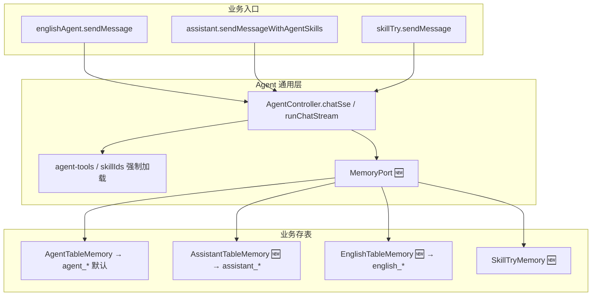
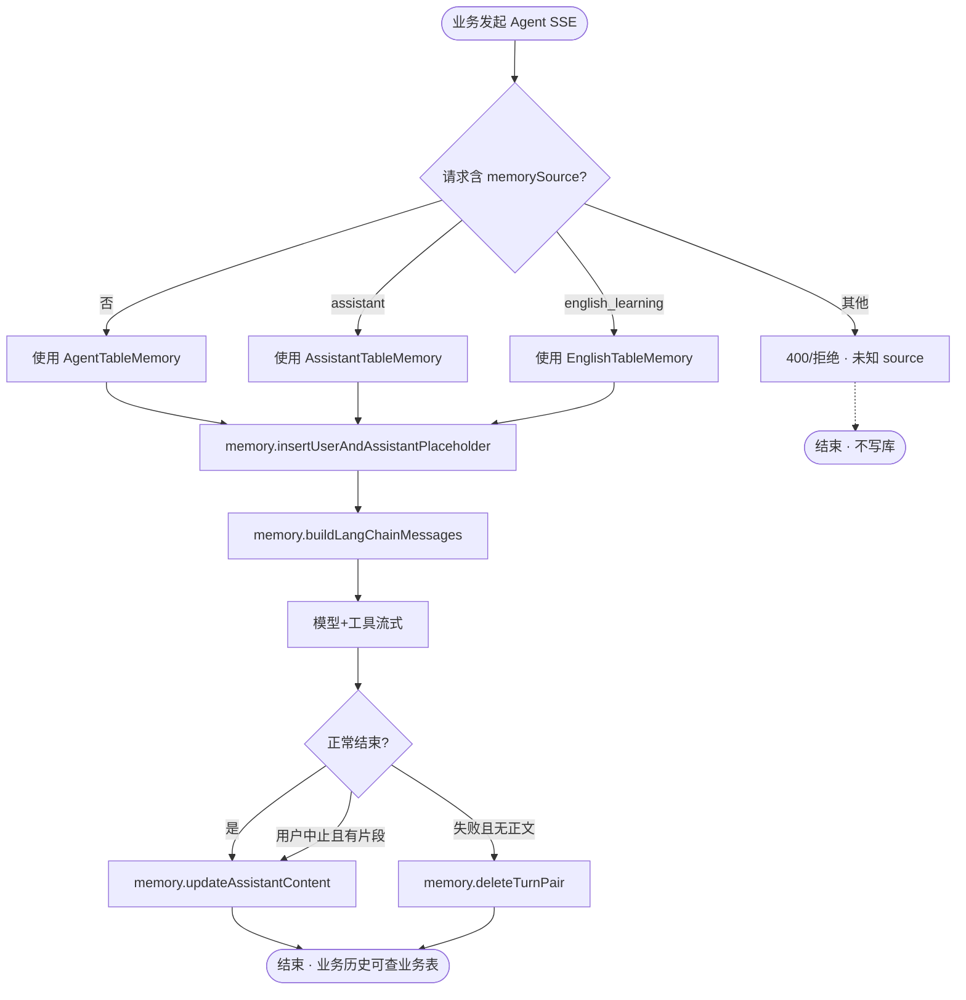
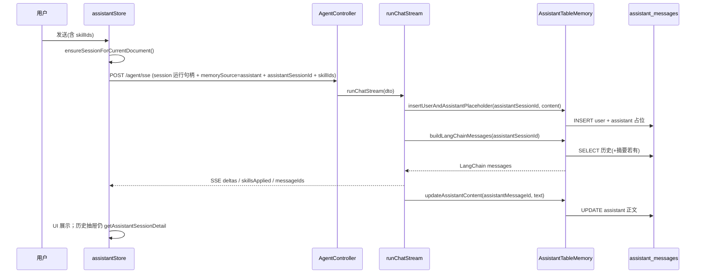
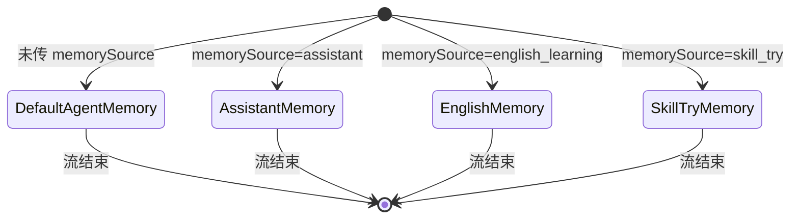

# Agent 业务消息分表 — 实现思路

> **状态**：M0–M4 已落地（2026-09-15）  
> **日期**：2026-09-15  
> **需求摘要**：`agent_*` 收敛为通用模型调用层；各业务消息落各自业务表（英语→`english_agent_*`，知识库带 Skill→`assistant_*`，试跑→`skill_try_messages`）；**不得回退**现已实现功能逻辑。

## 延伸阅读

- **落地归档（改动要点 + 回归清单）**：[docs/agent/Agent业务消息分表落地.md](../../agent/Agent业务消息分表落地.md)
- [知识库Skill编辑与Agent接入.md](../knowledge/知识库Skill编辑与Agent接入.md) — Skill 页 + 知识库 AI→Agent SSE（硬约束兼容现网）
- [guide/05-知识库与RAG.md](../../../guide/05-知识库与RAG.md) — 知识库 / Assistant 现架构
- 后端：`apps/backend/src/services/agent/`、`apps/backend/src/services/assistant/`
- 前端：`apps/frontend/src/store/englishAgent.ts`、`assistant.ts`（`sendMessageWithAgentSkills`）、`skillTry.ts`

---

## 0. 读本文你将得到什么

- **问题**：业务共用 `agent_messages` 作真相源，导致知识库历史与 Agent 记忆错位、英语与试跑无法独立演进。
- **一句话方案**：Agent SSE 只做推理/工具/停流；消息读写经可插拔 **MemoryPort**，按业务路由到各自表；默认实现仍写 `agent_*` 以保兼容。
- **改动层**：后端记忆抽象 + DTO 绑定 → 知识库 Skill 先切 `assistant_*` → 英语 / Skill 试跑分阶段迁表；前端去掉双写与 localStorage 链接。
- **阶段**：M0 抽象零行为 → M1 知识库 Skill 单写助手表 → M2 英语独立表 → M3 试跑分表 → M4 收缩 `agent_messages`。
- **最大风险**：只改落库、不改 `buildLangChainMessagesFromDb` 记忆源 → **续聊丢上下文**。

### 0.1 落地快照（M0–M4）

| 项 | 状态 |
|----|------|
| `AgentTurnMemory` + 默认 `AgentMemoryService` | ✅ |
| `AssistantTableMemory` + `memorySource=assistant` | ✅ |
| `EnglishTableMemory` + `english_agent_*` | ✅ |
| `SkillTryTableMemory` + `skill_try_messages` | ✅ |
| 产品路径停写 `agent_messages`（M4） | ✅ |
| 历史回填 Bootstrap / migration | ❌ 不迁旧数据（仅建表；以新会话为准） |

详细改动与**回归测试点**见 [Agent业务消息分表落地.md](../../agent/Agent业务消息分表落地.md)。

---

## 1. 需求与边界

### 1.1 用户故事

| 角色 | 场景 | 行为 | 期望结果 |
|------|------|------|----------|
| 作者 | 知识库 AI + 已选 Skill | 多轮问答、切历史、刷新 | 消息在 `assistant_*`；续聊仍有 Skill/工具上下文 |
| 学员 | 英语学习 Agent | 多会话、历史、分享 | 消息在英语业务表；体验与现网等价 |
| 作者 | Skill 试跑 / 生成 | 右侧 Agent 试跑 | 消息不污染知识库/英语列表；可按 Skill 清理 |
| 开发 | 扩展新业务 Agent | 复用 `/agent/sse` | 只挂新 Memory 适配器，不改推理主循环 |

### 1.2 范围

| 在范围内 | 不在范围内（非目标） |
|----------|----------------------|
| MemoryPort + 按 `memorySource` 分表 | 把无 Skill 知识库也改成 Agent（现网 `/assistant/sse` 不动） |
| 知识库带 Skill → 读写 `assistant_*` | 大爆炸一次迁完所有业务 |
| 英语学习 → 独立会话/消息表（或规划中的 english_*） | 合并 Assistant 与 Agent 为单表 |
| 分阶段迁移；默认 Memory 仍写 `agent_*` | 用本需求重写知识库壳 / RAG |
| 影响点评估与验收门禁 | DeepAgents 真并行子 Agent |

### 1.3 约束与依赖

- **兼容性最高优先**：英语学习、无 Skill 知识库、Skill 试跑、电子书助手在对应阶段完成前 **行为零回退**。
- 须复用：`AgentService.runChatStream`、`AgentMemoryService` 现有 insert/update/build/compact、`AssistantService` 占位写入、前端 `streamAgentSse`。
- `assistMode` / `skillIds` 继续只影响提示与工具，**不单独决定存哪张表**（存表由 `memorySource` 决定）。
- Ponytail：先抽象、再按业务切；禁止无默认实现的大重构。

---

## 2. 方案总览（一句话 + 要点）

**一句话方案**：在 `runChatStream` 与 DB 之间引入 **MemoryPort**；请求携带 `memorySource` + `businessSessionId`；知识库 Skill 用 Assistant 适配器读写 `assistant_*`，英语/试跑分阶段换适配器；未指定时仍走 Agent 表默认实现。

| # | 设计要点 | 理由 |
|---|----------|------|
| 1 | Agent = 通用调用（SSE/工具/停流/epoch） | 业务只换「记在哪」，不换推理管线 |
| 2 | 记忆与业务表同源 | 避免双写漂移；续聊与历史同一真相源 |
| 3 | 默认 Memory = 现 `agent_*` | 未迁移业务零改动 |
| 4 | 知识库 Skill 优先切 `assistant_*` | 历史抽屉已读助手表；去掉 `append-turn` 双写 |
| 5 | 服务端显式绑定会话 id | 淘汰 `localStorage` `ka:agentSid:*` 当真相 |

---

## 3. 现状与复用

| 能力 | 仓库中已有 | 本需求中的用法 |
|------|------------|----------------|
| Agent SSE 主循环 | `agent.service.ts` → `runChatStream` | 扩展：注入 MemoryPort，其余不动 |
| Agent 记忆读写 | `agent-memory.service.ts`（`insertUserAndAssistantPlaceholder` / `updateAssistantContent` / `buildLangChainMessagesFromDb` / `compactSessionIfNeeded`） | 收成默认 `AgentTableMemory`；接口对齐 |
| 助手占位+更新 | `assistant.service.ts` 私有 insert/update | 扩展为 `AssistantTableMemory` 实现 |
| Skill 双写过渡 | `assistant.ts` `appendAssistantSessionTurn` + `POST /assistant/session/append-turn` | M1 后删除前端双写 |
| 英语全链路 | `englishAgent.ts` + `/agent/session*` | M2 前继续默认 Memory |
| Skill 试跑索引 | `skill_try_sessions` 与 `agent_sessions` 同 id | M3 再定消息表归属 |
| 电子书 | `ebook-assistant` 自有表 | **不适用**（已分表；仅复用前端 SSE 工具形态） |
| 分享 | `share.service` `sessionType: 'agent'` | 按业务分支改读表 |

**调研结论**：

- 今日 **同一套** `agent_sessions` / `agent_messages` 服务英语、知识库 Skill、Skill 试跑；`assistMode`/`skillIds` **不改表**。
- 知识库 Skill 是唯一双写路径：生成写 `agent_*`，展示靠 `assistant_*` + `append-turn`；记忆仍读 `agent_*`。
- 电子书已证明「业务自有表 + 复用调用形态」可行；本方案是把该模式正式化到 Agent 后端。

---

## 4. 架构图



**图内方法说明**：

| 方法 / 模块入口 | 功能 |
|-----------------|------|
| `englishAgent.sendMessage` | 英语学习发问；现走 `/agent/sse` + `assistMode=english_learning`；M2 前记忆仍默认 `agent_*` |
| `assistant.sendMessageWithAgentSkills` | 知识库已选 Skill 时发问；带 `skillIds`；M1 后传 `memorySource=assistant` + `assistantSessionId` |
| `skillTry.sendMessage` | Skill 页试跑/生成；现消息在 `agent_*`，列表经 `skill_try_sessions` 隔离 |
| `AgentController.chatSse` / `runChatStream` | 通用流式推理：占位→组上下文→工具→写回正文/停流清理；改为经 MemoryPort 读写 |
| `MemoryPort`（新增） | 抽象：insert 占位、update 助手正文、build LangChain 历史、compact、删 turn；按 `memorySource` 选实现 |
| `AgentTableMemory` | 现 `AgentMemoryService` 行为封装；**未指定 source 时的默认实现** |
| `AssistantTableMemory`（新增） | 对 `assistant_sessions`/`assistant_messages` 做同等契约；供知识库 Skill |
| `EnglishTableMemory`（新增） | M2：英语业务表读写；列表/详情/分享改读此表 |
| `SkillTryMemory`（新增） | M3：试跑消息与索引表归属落地 |

**读图要点**：

- 业务只连 Agent 通用层；**不**再直接假设消息一定在 `agent_messages`。
- 新增点集中在 Memory 适配器；`runChatStream` 主循环保持一条。
- 默认实现保证未迁移调用方行为不变。

---

## 5. 主流程图



**图内方法说明**：

| 方法 | 功能 |
|------|------|
| `memory.insertUserAndAssistantPlaceholder` | 同 turn 写入 user + 空 assistant；可顺带写首条标题 |
| `memory.buildLangChainMessages` | 从**当前业务表**组装多轮（含摘要水印若该实现支持） |
| `memory.updateAssistantContent` | 流结束/中止时回写助手正文与可选 `searchOrganic` |
| `memory.deleteTurnPair` | 失败且无有效正文时删除本轮成对行，避免脏数据 |

**读图要点**：

- 分支只在「选哪个 Memory」；其后生命周期与现 `runChatStream` 一致。
- 失败路径虚线：未知 `memorySource` 直接拒，避免写错表。
- **写哪张表 = 读哪张表**，禁止只写业务表却仍从 `agent_*` 组上下文。

---

## 6. 核心时序图

（Happy path：知识库带 Skill，M1 目标态）



**图内方法说明**：

| 方法 | 功能 |
|------|------|
| `ensureSessionForCurrentDocument()` | 保证知识库当前文档有 `assistant` 会话 id，供 Memory 绑定 |
| `POST /agent/sse` | 通用流式入口；M1 起知识库 Skill 必须带 `memorySource` + `assistantSessionId` |
| `runChatStream(dto)` | 编排占位、组上下文、工具、落库、停流；不感知业务 UI |
| `insertUserAndAssistantPlaceholder(...)` | 在 `assistant_*` 落本轮占位；返回供 SSE `messageIds` 的真实 id |
| `buildLangChainMessages(...)` | 从 `assistant_*`（非 `agent_messages`）组装多轮 |
| `updateAssistantContent(...)` | 将流式结果写回助手消息行 |
| `getAssistantSessionDetail` | 历史抽屉水合；与无 Skill 路径同一 API |

**读图要点**：

- 前端 **不再** `appendAssistantSessionTurn` 二次落库。
- Agent 运行句柄（若仍创建 `agent_sessions` 行）可仅用于 epoch/停流；**消息真相在 assistant**。
- 无 Skill 路径不进入本时序（仍 `/assistant/sse`）。

---

## 7. （可选）状态机



**图内方法说明**：

| 方法 / 迁移 | 功能 |
|-------------|------|
| 未传 `memorySource` | 绑定 `AgentTableMemory`，兼容英语/试跑现网 |
| `memorySource=assistant` | 绑定助手表；缺 `assistantSessionId` 则拒绝 |
| `memorySource=english_learning` | M2 启用；此前勿对英语强开，以免空表 |

---

## 8. 模块职责与接口草图

### 8.1 模块一览

| 模块 | 职责 | 新增/改动 | 预估路径 |
|------|------|-----------|----------|
| MemoryPort | 记忆读写契约 | 新增 | `apps/backend/src/services/agent/memory/` |
| AgentTableMemory | 默认 `agent_*` | 扩展（包装现服务） | `agent-memory.service.ts` |
| AssistantTableMemory | 知识库 Skill 记忆 | 新增 | 同上 + 调 assistant repos |
| AgentChatDto | `memorySource` / 业务 sessionId | 扩展 | `dto/agent-chat.dto.ts` |
| assistant store | 去掉双写；传绑定字段 | 改动 | `store/assistant.ts` |
| englishAgent | M2：业务 API 列表详情 | 改动 | `store/englishAgent.ts` |
| share | 按 sessionType/业务读表 | 扩展 | `share.service.ts` |

### 8.2 关键接口（草图）

```typescript
type MemorySource = 'agent' | 'assistant' | 'english_learning' | 'skill_try';

interface MemoryPort {
  insertUserAndAssistantPlaceholder(
    businessSessionId: string,
    turnId: string,
    userContent: string,
  ): Promise<{ userMessageId: string; assistantMessageId: string }>;
  updateAssistantContent(
    assistantMessageId: string,
    content: string,
    extras?: { searchOrganic?: unknown },
  ): Promise<void>;
  buildLangChainMessages(businessSessionId: string): Promise<BaseMessage[]>;
  compactSessionIfNeeded?(businessSessionId: string): Promise<void>;
  deleteTurnPair(businessSessionId: string, turnId: string): Promise<void>;
}

// AgentChatDto 增量（概念）
// memorySource?: MemorySource; // 缺省 = 'agent'
// assistantSessionId?: string; // source=assistant 时必填
```

### 8.3 数据模型

| 字段/实体 | 来源 | 存储 | 说明 |
|-----------|------|------|------|
| 运行句柄 session | Agent | `agent_sessions`（过渡可保留） | 停流 epoch；可与业务 session 同 id 或仅作 run id |
| 知识库消息 | Assistant Memory | `assistant_messages` | 与无 Skill 同表 |
| 英语消息 | English Memory | english 业务表（待建/待确认命名） | 列表详情分享同源 |
| Skill 试跑 | Try Memory | 待定（独立消息表或带 kind 的旁路） | 须可随 Skill 删除级联 |
| 摘要 | 各 Memory 自管 | 现 `agent_session_summaries` 或分表 | 压缩水印必须与消息同源 |

---

## 9. 分阶段实现步骤

| 阶段 | 目标 | 交付物 | 依赖 |
|------|------|--------|------|
| M0 | 抽象 MemoryPort，行为不变 | 默认实现 = 现 Agent 表；全回归绿 | — |
| M1 | 知识库 Skill 单写 `assistant_*` | DTO + AssistantTableMemory；删双写 | M0 |
| M2 | 英语学习迁业务表 | 表 + API + store 列表详情分享 | M0 |
| M3 | Skill 试跑分表 | 与 `skill_try_sessions` 对齐删除 | M0 |
| M4 | 收缩 `agent_messages` | 确认无业务再读后停写或仅 run 日志 | M1–M3 |

### M0

- [x] 抽出 `MemoryPort`（`AgentTurnMemory`），`runChatStream` 只依赖接口
- [x] 默认实现委托现有 `AgentMemoryService`
- [x] 英语 / 试跑 / 知识库 Skill **无行为 diff** 回归（缺省仍写 `agent_*`）

### M1

- [x] `AgentChatDto` 增加 `memorySource` + `assistantSessionId`
- [x] `AssistantTableMemory`：占位 / 更新 / 组上下文（摘要 no-op）
- [x] `sendMessageWithAgentSkills` 传绑定字段；删除 `append-turn` 双写
- [ ] 验收：切历史、刷新、多轮 Skill、无 Skill 路径不变（见落地文档回归清单）

### M2

- [x] 英语会话/消息/摘要表（不迁旧数据）
- [x] 列表/详情/删/标题/分享改读英语表；SSE `memorySource=english_learning`
- [x] 前端建会话与 SSE 传 `memorySource`

### M3–M4

- [x] `skill_try_messages` + SkillTryTableMemory；SSE `memorySource=skill_try`
- [x] 产品路径不再写 `agent_messages`；遗留仅作回退

---

## 10. 关键决策与备选方案

| 决策 | 选用 | 备选 | 为何不选备选 |
|------|------|------|--------------|
| 记忆抽象 | MemoryPort + 分表适配器 | 维持双写 | 双写两套真相、易漂移、链接靠 localStorage |
| 知识库 Skill | 读写 `assistant_*` | 改回纯 `/assistant/sse` | Skill 工具链已在 Agent，回迁成本高 |
| 兼容策略 | 缺省仍 `agent_*` | 强制所有业务立刻分表 | 违反「不影响已实现功能」 |
| 运行句柄 | 过渡保留 `agent_sessions` | 立刻废除 agent 表 | 停流/epoch 需另设计；分阶段更稳 |

---

## 11. 风险、边界与待确认

| 项 | 等级 | 说明 | 缓解 |
|----|------|------|------|
| 记忆源与落库不一致 | **高** | 只改写表不改 `buildLangChainMessages*` | 同一 Memory 实现读写成对；M1 验收多轮 |
| 英语/试跑列表详情 | 高 | 仍调 `/agent/session/:id` 读空表 | M2/M3 完成前勿对它们切换 source |
| 分享 `sessionType:'agent'` | 中 | 读错表导致分享空 | 分享按业务类型分支 |
| 摘要压缩 | 中 | `agent_session_summaries` 绑 agent session | Assistant/English Memory 自管摘要或首期关闭 compact |
| 消息 id 语义 | 中 | SSE `messageIds` 从 agent uuid 变为业务表 id | 前端以 SSE 为准；分享/跳转跟新 id |
| 停流部分正文 | 中 | `finalizeTurn` / `deleteTurnPair` 写错实现 | 停流路径单测/手工中止用例 |

**待确认**：

- [ ] 英语业务表命名与是否已有迁移草稿（验证：搜 `english_*` entity / migrations）
- [ ] `assistant` Memory 是否首期支持 compact（验证：长会话 token 压力）
- [ ] M1 后 `agent_sessions` 对知识库 Skill 是「同 id」还是「仅 run id」（验证：停流是否仍按 agent sessionId）

---

## 12. 验收清单

| # | 用例 | 步骤 | 期望 |
|---|------|------|------|
| AC1 | 无 Skill 知识库 | 不选 Skill 多轮、切历史、刷新 | 与现网一致；仍 `/assistant/sse` + `assistant_*` |
| AC2 | 有 Skill 知识库（M1） | 选 Skill 多轮 → 切历史 → 刷新 → 再问 | 历史有正文；续聊有上下文；**无** `append-turn`；`assistant_messages` 有行 |
| AC3 | 英语学习（M0/M2 前） | 多会话、停流、分享 | 与现网一致；数据仍在 `agent_*` |
| AC4 | 英语学习（M2 后） | 同上 | 数据在英语表；列表详情分享正确 |
| AC5 | Skill 试跑 | 试跑后删 Skill | 会话级联清理符合现网约定 |
| AC6 | 电子书助手 | 阅读页助手多轮 | **零回归**（不走本改造） |

---

## 13. 实现影响点矩阵

| 模块 | 影响 | 风险 | 阶段未改时的后果 |
|------|------|------|------------------|
| `agent-memory.service` / `runChatStream` | 记忆读写可路由 | 高 | 续聊丢上下文 |
| `agent.controller` 会话 CRUD | 英语/试跑列表详情换源 | 高 | UI 历史空 |
| 知识库 `assistant.ts` | 去双写、传绑定 | 中 | 继续双写可用但债留 |
| `englishAgent.ts` | 会话水合/分享 | 高 | 切 source 过早则空历史 |
| `skillTry.ts` + `skill_try_sessions` | 同 id/级联 | 中高 | 删 Skill 残留或误删 |
| `share.service` | 读表分支 | 中 | 分享空正文 |
| `agent_session_summaries` | 跟消息同源 | 中 | 误压缩或失效 |
| 停流 finalize/delete | 部分正文落点 | 中 | 丢尾段或空行 |
| `streamAgentSse` | body 增量字段 | 低 | — |
| 无 Skill `/assistant/sse` | **应零改动** | — | 基线回归 |
| 电子书 | **应零改动** | — | — |

---

## 14. 预估改动面（实现阶段参考）

| 类型 | 路径（预估） |
|------|--------------|
| 后端 | `apps/backend/src/services/agent/**`、`assistant/**`（Memory 复用）、可能 `share/**`、英语模块（M2） |
| 前端 | `store/assistant.ts`、`englishAgent.ts`、`skillTry.ts`、`service/api.ts` / `index.ts` |
| 迁移 | 英语业务表（M2）；试跑消息表（M3，若新建） |
| 文档（落地后） | `docs/knowledge/` 或 `docs/agent/` 实现归档；本文保持规划索引 |

---

（本文档为规划态实现思路；落地后以源码与 `docs/<功能域>/` 专题为准）
