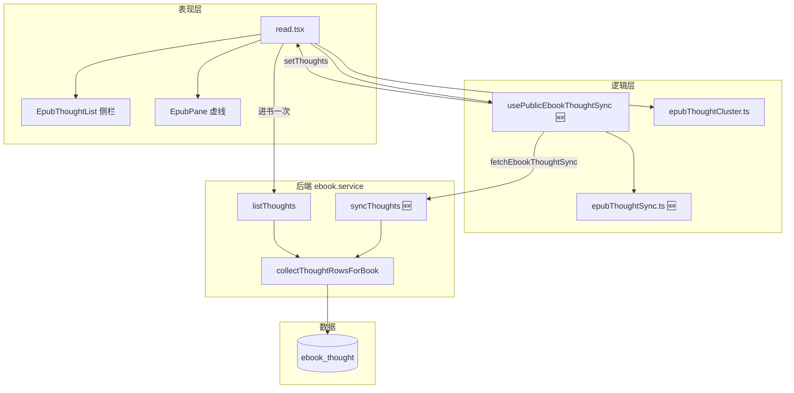
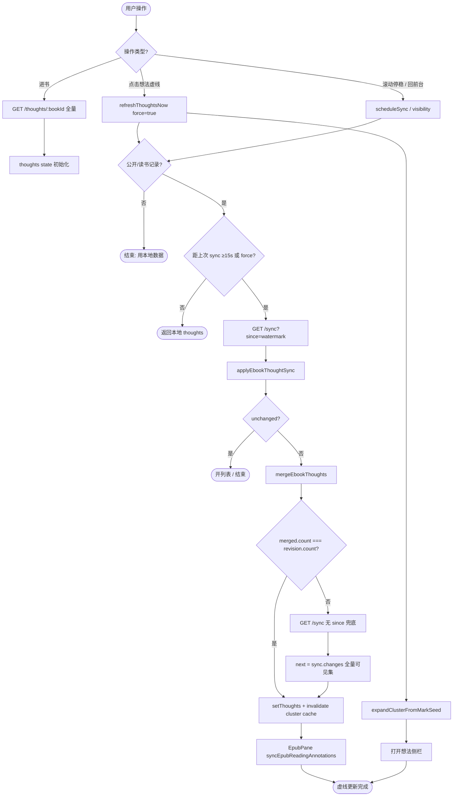
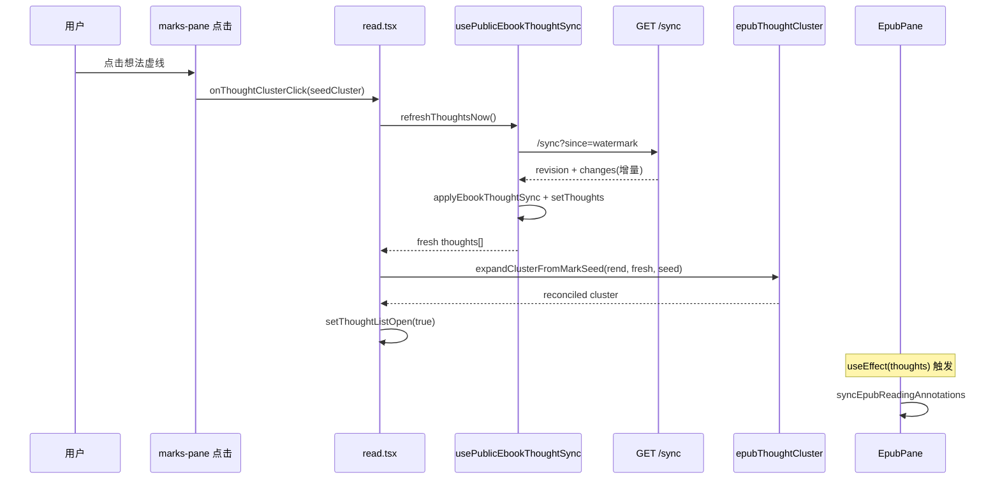
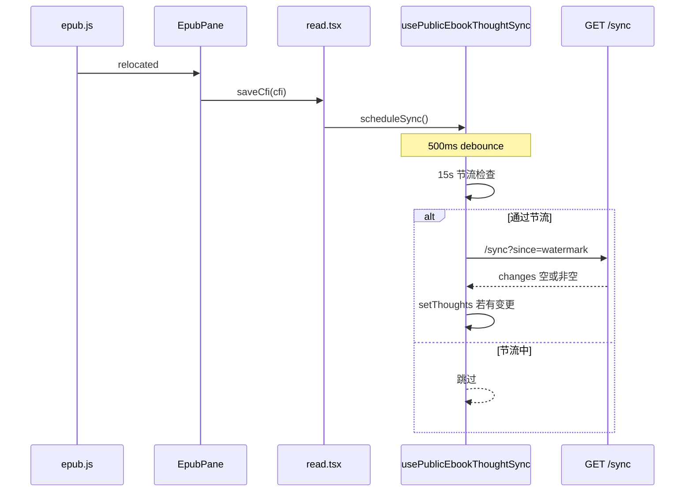

# 公开书想法实时同步 — 实现思路

> **状态**：核心能力已上线（2026-07-02）｜本文描述 **已落地逻辑** + **接口/性能优化** 设计与后续演进  
> **日期**：2026-07-02  
> **需求摘要**：多人共读公开书时，读者应能 **低开销** 看到他人新增/更新的想法与正文虚线；点击划线打开列表须 **一次交互即最新**，滚动停稳时 **后台增量** 对齐，私有书 **零额外请求**。

## 延伸阅读

- **实现归档（主文档）**：[EPUB公开想法实时同步影响.md](../../ebook/EPUB公开想法实时同步影响.md)
- [EPUB公开想法下划线修复.md](../epub/EPUB公开想法下划线修复.md) — 公开书虚线叠层与 patch 几何
- [EPUB滚动卡顿性能.md](../epub/EPUB滚动卡顿性能.md) — 滚动 patch 调度与 `thoughtStackProjectionCache`
- [电子书公开分享影响.md](../../ebook/电子书公开分享影响.md) — 公开书 MVP、`listThoughts` 合并规则
- [电子书想法同步性能优化.md](./电子书想法同步性能优化.md) — **Sync 性能优化**（P0/M8/M6 已上线）：SQL 增量、deletedIds、私有 gate

---

## 0. 读本文你将得到什么

- **问题**：公开书想法只在进书时全量拉一次；他人新增后本地 stale，需刷新或点两次才看到列表/划线。
- **一句话方案**：**双轨同步** — 交互轨（点划线 → `/sync?since=` → 连通聚类 → 开列表）+ 背景轨（滚动停稳 / 回前台 → 同链路增量）；私有书 `enabled=false` 无请求。
- **接口层**：单次 `GET .../sync` 返回 `{ revision, changes, deletedIds? }`；增量合并 + id 剔除，**无**无 since 二次全量。
- **已改模块**：后端 `syncThoughts`；前端 `usePublicEbookThoughtSync`、`epubThoughtSync.ts`、`read.tsx` 的 `openThoughtCluster`；进书仍用 `GET /thoughts/:bookId` 首屏全量（一次）。
- **性能专题**：见 [电子书想法同步性能优化.md](./电子书想法同步性能优化.md)（M8 SQL 增量 + M6 软删已上线）。

---

## 1. 需求与边界

### 1.1 用户故事

| 角色 | 场景 | 行为 | 期望结果 |
|------|------|------|----------|
| 读者 A | 共读公开书，B 刚在同段写想法 | A 点击该段想法虚线 | 侧栏列表 **一次点击** 含 B 的想法；虚线随后对齐 |
| 读者 A | 滚动阅读，未点列表 | 滚过 B 新增想法所在章 | 停稳后 **≤1 次 sync**，正文出现他人虚线（无需整书刷新） |
| 书主 | 读自己公开源书 | 同上 | 合并读者公开想法，增量同步 |
| 私有书读者 | 仅本人想法 | 任意操作 | **不调用** `/sync` / 公开合并逻辑 |
| 任意读者 | 想法 1000+ 条 | 点一条划线 | 网络 payload **仅增量**（通常个位数 DTO），非 1000 条 |

### 1.2 范围

| 在范围内 | 不在范围内（非目标） |
|----------|----------------------|
| 公开书 / 读书记录（`sourceBookId`）想法增量 | WebSocket / SSE 推送（后续可选） |
| `GET /thoughts/:bookId/sync` | 后端 CFI 归一化存储 |
| 点击列表 `expandClusterFromMarkSeed` 重建 cluster | PDF 想法 |
| 滚动 `relocated` → `saveCfi` → `scheduleSync` | 高亮（highlight）实时同步 |
| 进书首屏 `GET /thoughts/:bookId` 一次全量 | 按 spine 分页 sync（待确认是否要做） |

### 1.3 约束与依赖

- 须复用 `collectThoughtRowsForBook` + `filterThoughtsVisibleToUser`（与 `listThoughts` 一致）。
- 须复用 `syncEpubReadingAnnotations` / `applyEpubThoughtUnderlines` 渲染虚线（`thoughts` state 变更驱动 EpubPane）。
- Ponytail：无新依赖；背景 sync **15s 最小间隔**；滚动 debounce **500ms**。
- 与滚动 patch **80ms relocated 合并** 独立，互不阻塞。

---

## 2. 方案总览（一句话 + 要点）

**一句话方案**：公开书维护本地 `thoughts[]` + watermark（`max(updatedAt)-1ms`）；**交互**与**背景**共用 `fetchEbookThoughtSync` 增量合并 + `deletedIds` 剔除；列表用 **连通 CFI 闭包** 聚类，避免 stale mark `thoughtIds` 漏人。

| # | 设计要点 | 理由 |
|---|----------|------|
| 1 | **单接口 sync** | 一次返回 `revision + changes + deletedIds`，省 RTT |
| 2 | **since = localMax − 1ms** | 服务端 `updatedAt > since`，避免同毫秒漏增量 |
| 3 | **双轨触发** | 点划线 `force` 跳节流；滚动/visibility 低频探测 |
| 4 | **先 sync 后开列表** | 避免先展示 seed cluster 再异步补数据（「点两次」） |
| 5 | **`expandClusterFromMarkSeed`** | 与 mark 点击同构聚类，跨 CFI 连通扩展 |
| 6 | **deletedIds 增量剔除** | 删除/改私密不再二次无 since 全量（见性能专题） |
| 7 | **私有书 gate** | `isSharedEbookThoughtContext` 为 false 时 hook 空转 |

---

## 3. 现状与复用

| 能力 | 仓库中已有 | 本需求用法 |
|------|------------|------------|
| 想法合并查询 | `ebook.service collectThoughtRowsForBook` | sync / listThoughts 共用 |
| 全量列表 | `GET /thoughts/:bookId` · `listThoughts` | **进书首屏一次** |
| 增量 sync 🆕 | `GET /thoughts/:bookId/sync?since=` · `syncThoughts` | 交互 + 背景 |
| revision/changes 拆分 | `/revision`、`/changes` | 保留兼容；前端主路径只用 `/sync` |
| 前端合并 | `mergeEbookThoughts` · `applyEbookThoughtSync` | 按 id 覆盖/追加 |
| Hook 🆕 | `usePublicEbookThoughtSync` | read.tsx 接线 |
| 点划线聚类 | `expandClusterFromMarkSeed` · `epubThoughtCluster.ts` | openThoughtCluster 刷新后重建 |
| 虚线渲染 | `syncEpubReadingAnnotations` · EpubPane `useEffect(thoughts)` | setThoughts 后自动 apply |
| 滚动 relocated | `EpubPane` → `saveCfi` | `schedulePublicThoughtSync()` |

**调研结论**：实时性瓶颈不在 epub.js，而在 **数据层只拉一次** + **列表用 stale cluster**。sync 增量 + 点开前 refresh + 连通聚类已闭环；**性能优化**（SQL 增量、deletedIds、私有 gate）见 [电子书想法同步性能优化.md](./电子书想法同步性能优化.md)。

---

## 4. 架构图



**图内方法说明**：

| 方法 / 模块入口 | 功能 |
|-----------------|------|
| `usePublicEbookThoughtSync` | 公开书专用 Hook：背景 scheduleSync、交互 refreshThoughtsNow；私有书 enabled=false |
| `syncThoughts(options?)`（Hook 内） | 调 `/sync`、apply 合并、必要时二次无 since 兜底；inFlight 合并并发 |
| `applyEbookThoughtSync(local, sync)` | 判定 unchanged / 增量 merge / needsFullResync（条数不一致） |
| `fetchEbookThoughtSync(bookId, since?)` | HTTP GET `/thoughts/:bookId/sync`；since 可选 |
| `openThoughtCluster(cluster)`（read.tsx） | 点划线：await refresh → expandClusterFromMarkSeed → 开侧栏 |
| `syncThoughts(userId, bookId, since?)`（后端） | 一次 collect rows → revision + filter changes → DTO |
| `collectThoughtRowsForBook` | 源书/读书记录三分支合并 owner + reader 行，再 visibility 过滤 |
| `listThoughts` | 进书首屏全量；不参与点击增量 |
| `expandClusterFromMarkSeed` | 从 seed CFI 做连通闭包，重建 `EbookThoughtClickCluster` |
| `syncEpubReadingAnnotations` | thoughts 变更后 EpubPane 重 apply 虚线 mark |

**读图要点**：

- 数据入口两条：**首屏全量**（listThoughts）与 **运行时 sync**（增量）；UI 只持有一份 `thoughts` state。
- Hook 是公开书 sync 唯一编排点；Cluster 模块不负责 HTTP。
- 虚线层被动响应 `thoughts`，不单独 poll。

---

## 5. 主流程图



**图内方法说明**：

| 方法 | 功能 |
|------|------|
| `refreshThoughtsNow()` | `syncThoughts({ force: true })` 别名；打开列表前必调 |
| `scheduleSync()` | relocated 后 500ms debounce 触发背景 sync |
| `ebookThoughtSyncSinceParam(localMax)` | 生成 since = max(updatedAt) − 1ms |
| `applyEbookThoughtSync` | 输出 next 与 needsFullResync |
| `mergeEbookThoughts` | id Map 合并，createdAt 降序 |
| `invalidateThoughtClusterConnectivityCache` | 想法变更后清连通图 cache，避免聚类用旧 adj |
| `expandClusterFromMarkSeed` | 用 fresh thoughts 在 seed CFIs 上扩展连通簇 |
| `syncEpubReadingAnnotations` | apply 想法/划线 mark |

**读图要点**：

- **交互轨**走 force 分支，不受 15s 节流。
- **unchanged** 时零合并，仍可开列表（本地已最新）。
- **兜底**仅当条数对不齐；日常「B 新增一条」走单趟增量。

---

## 6. 核心时序图

### 6.1 点击虚线打开列表（Happy path）



**图内方法说明**：

| 方法 | 功能 |
|------|------|
| `onThoughtClusterClick` | epubUserHighlights 注册；scheduleThoughtClusterClick 后传入 seed cluster |
| `refreshThoughtsNow` | force sync，返回最新 thoughts 数组 |
| `applyEbookThoughtSync` | 增量合并；无变更则原样返回 |
| `expandClusterFromMarkSeed` | 将服务端新想法纳入同段连通 CFI |
| `syncEpubReadingAnnotations` | 重 apply 虚线（含新 thoughtIds） |

**读图要点**：

- 列表打开在 **sync + 聚类完成之后**，保证首屏条数正确。
- 虚线更新异步于 React commit，与侧栏并行可接受。

### 6.2 背景滚动同步



**图内方法说明**：

| 方法 | 功能 |
|------|------|
| `saveCfi` | 保存进度 + 触发 schedulePublicThoughtSync |
| `scheduleSync` | 500ms 合并连续 relocated |
| `syncThoughts` | 背景模式无 force，受 15s MIN_SYNC_INTERVAL 约束 |

---

## 7. 接口设计（已上线 + 优化逻辑）

### 7.1 端点一览

| 方法 | 路径 | 用途 | 调用方 |
|------|------|------|--------|
| GET | `/ebook/thoughts/:bookId` | 全量可见想法 | 进书 `read.tsx` useEffect **一次** |
| GET | `/ebook/thoughts/:bookId/sync?since=` 🆕 | revision + 增量 changes | Hook 主路径 |
| GET | `/ebook/thoughts/:bookId/sync`（无 since） | changes=全量可见集 | 条数兜底 |
| GET | `/ebook/thoughts/:bookId/revision` | 仅 count + latestUpdatedAt | 兼容；前端可不调用 |
| GET | `/ebook/thoughts/:bookId/changes?since=` | 仅 changes | 兼容；由 syncThoughts 内部复用 |

### 7.2 响应结构

```typescript
type EbookThoughtRevision = {
  count: number;
  latestUpdatedAt: string | null;
};

type EbookThoughtSync = {
  revision: EbookThoughtRevision;
  changes: EbookThought[]; // since 存在时为 updatedAt > since 的子集；无 since 时为全量可见
};
```

### 7.3 接口优化逻辑（为何这样设计）

| 优化点 | 改前思路 | 现方案 | 收益 |
|--------|----------|--------|------|
| RTT | revision 与 changes 两次请求 | 单次 `/sync` | 延迟减半 |
| 打开列表 | `GET /thoughts` 全量 | `/sync?since=` 增量 | 想法多时 payload 小 |
| URL 兜底 | `fetchEbookThoughts` | `/sync` 无 since | 语义统一，避免误用全量 API |
| since 边界 | 严格 max(updatedAt) | **max − 1ms** | 减少「有 count 差但 changes 空」 |
| 并发 | 重复点击多次请求 | `inFlightRef` 共享 Promise | 避免风暴 |
| 私有书 | 与公开同一 hook | `enabled=false` | 零请求 |
| 首屏 | — | 仍全量一次 | 保证首屏虚线完整；与运行时增量分离 |

### 7.4 服务端现实现状与瓶颈

```typescript
// 伪代码：apps/backend/src/services/ebook/ebook.service.ts
async syncThoughts(userId, bookId, since?) {
  const rows = await collectThoughtRowsForBook(...); // 内存全表 collect
  const revision = buildThoughtRevision(rows);
  const changed = since ? rows.filter(r => r.updatedAt > since) : rows;
  return { revision, changes: await mapThoughtRowsToDtos(changed) };
}
```

| 瓶颈 | 说明 | 后续优化方向（§10） |
|------|------|---------------------|
| 每次 sync 全 collect | 想法 N 大时 DB+内存 O(N) | DB `MAX(updated_at)` + 按 since 索引查询 |
| 兜底无 since | changes=N 条 DTO | 响应带 `deletedIds` 或按 CFI 范围 sync |
| 无推送 | 最长 15s + 滚动 debounce 延迟 | 可选 SSE（非 MVP） |

---

## 8. 模块职责与接口草图

| 模块 | 职责 | 状态 | 路径 |
|------|------|------|------|
| `syncThoughts`（后端） | 合并查询 + revision + 增量 DTO | 已上线 | `ebook.service.ts` |
| `fetchEbookThoughtSync` | HTTP 封装 | 已上线 | `service/index.ts` |
| `applyEbookThoughtSync` | 合并策略 / 兜底判定 | 已上线 | `apps/frontend/src/views/ebook/utils/epub/mark/epubThoughtSync.ts` |
| `usePublicEbookThoughtSync` | 双轨调度 | 已上线 | `hooks/usePublicEbookThoughtSync.ts` |
| `openThoughtCluster` | 交互轨 UI | 已上线 | `read.tsx` |

---

## 9. 分阶段实现步骤

| 阶段 | 目标 | 状态 |
|------|------|------|
| M1 | 后端 `/sync` + `collectThoughtRowsForBook` 抽取 | ✅ |
| M2 | 前端 Hook + 滚动/visibility 背景同步 | ✅ |
| M3 | 点击列表 refresh + `expandClusterFromMarkSeed` | ✅ |
| M4 | 去掉打开列表时 `GET /thoughts` 全量；兜底改 `/sync` | ✅ |
| M5 | 阅读页去掉 `hydrate()` 误拉书架 | ✅（相关优化） |

### 后续可选（M7+）

- [x] **M6**：`deletedIds` + 软删，取消无 since 全量兜底 — 见 [性能专题](./电子书想法同步性能优化.md)
- [x] **M8**：DB 层 aggregate + `updated_at > since` 增量查询
- [ ] **M7**：`GET /sync?since=&cfiRanges=` 点击簇范围 sync
- [ ] **M9**：进书首屏改为 `/sync` 无 since 或分页 cursor

---

## 10. 关键决策与备选方案

| 决策 | 选用 | 备选 | 为何不选备选 |
|------|------|------|--------------|
| 同步机制 | 轮询 sync | WebSocket 推送 | 无基建；15s+点击 force 够用 |
| 打开列表 | 先 sync 再开 UI | 先开再异步刷新 | 用户反馈「点两次」 |
| 聚类 | expandClusterFromMarkSeed | reconcileThoughtClickCluster | 后者不扩展连通 CFI |
| 兜底 | `/sync` 无 since | `GET /thoughts` | URL 混用难排查 |
| 首屏 | 全量 listThoughts | 仅 sync | 首屏需完整虚线，一次全量可接受 |
| 背景频率 | 15s + 500ms debounce | 每次 relocated 都 sync | 滚动性能（见 scroll-stutter 文档） |

---

## 11. 风险、边界与待确认

| 项 | 等级 | 说明 | 缓解 |
|----|------|------|------|
| 兜底全量 payload | 中 | 删除/visibility 导致 count 不一致 | M6 deletedIds |
| 服务端 O(N) collect | 中 | 想法上千每次 sync 扫全表 | M8 DB 索引查询 |
| mark thoughtIds 滞后 | 低 | apply 虚线晚于开列表 1 帧 | setThoughts → EpubPane effect |
| 同毫秒边界 | 低 | 已用 since−1ms | 监控 changes 空但 count 增 |
| 私密想法 | 低 | filterThoughtsVisibleToUser | 后端权威 |

**待确认**：

- [ ] 进书首屏是否改为 `/sync` 无 since（与 listThoughts 等价 payload，仅统一 URL）— 验证：Network 仅一条 sync

---

## 12. 验收清单

| # | 用例 | 步骤 | 期望 |
|---|------|------|------|
| AC1 | 点击列表增量 | A 读公开书，B 同段新增，A 点虚线 | 1 次 `/sync?since=`；列表含 B；无 `/thoughts/:id` |
| AC2 | 无变更 | 无人新增，A 点虚线 | `/sync` 返回 changes:[]；列表正常 |
| AC3 | 背景虚线 | B 新增，A 滚到该段停稳 | ≤15s 内出现虚线；仅 `/sync` |
| AC4 | 私有书 | 非公开书阅读 | 无 `/sync` 请求 |
| AC5 | 大量想法 | 500+ 条，B 新增 1 条 | changes 长度 ≈1，非 500 |
| AC6 | 并发点击 | 快速连点虚线 | inFlight 合并，无请求风暴 |

---

## 13. 预估改动面（M6+ 参考）

| 类型 | 路径 |
|------|------|
| 后端 | `ebook.service.ts`、`ebook.controller.ts`、可选 migration 索引 `updated_at` |
| 前端 | `apps/frontend/src/views/ebook/utils/epub/mark/epubThoughtSync.ts`、`usePublicEbookThoughtSync.ts` |
| 文档（实现后） | `docs/ebook/电子书公开想法实时同步.md`（implementation-doc-from-diff） |

---

（本文档描述已上线核心 + 接口优化逻辑；落地细节以源码为准。）
