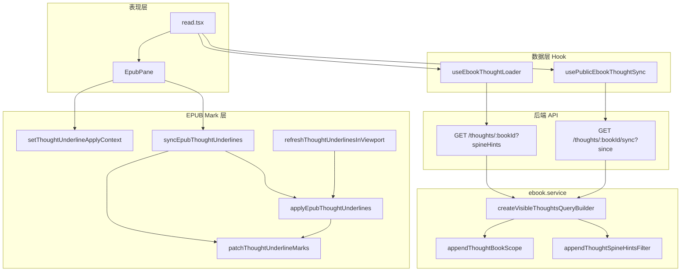
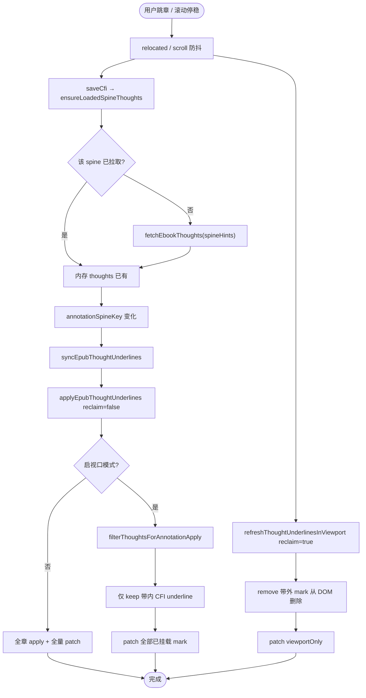
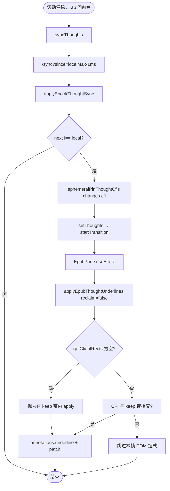
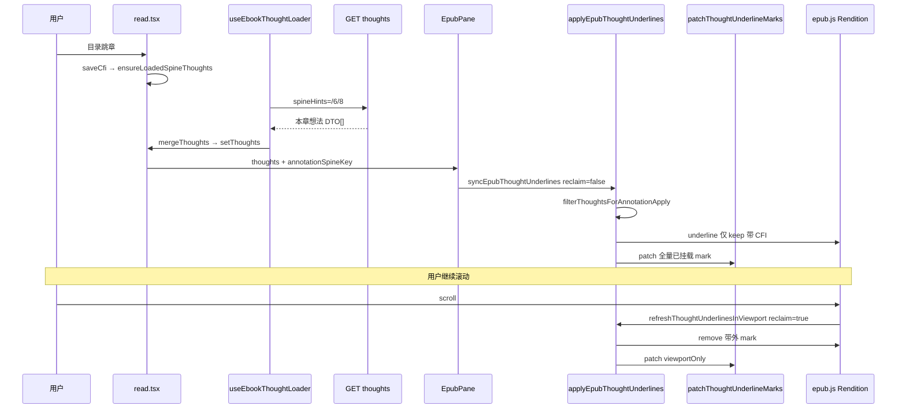
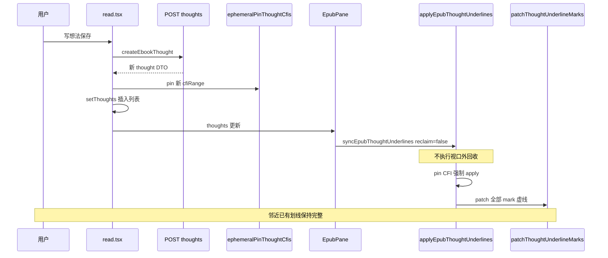
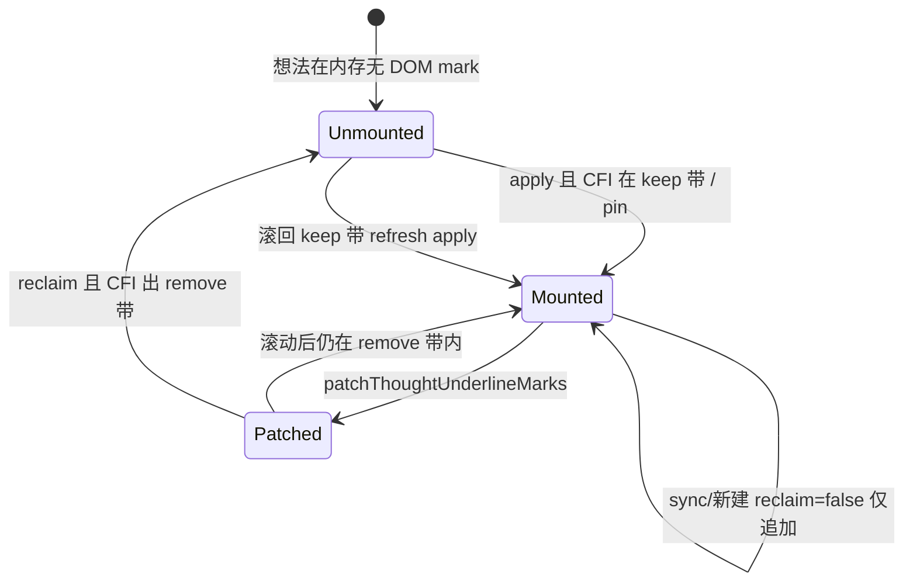

# 公开书多人想法划线与视口性能优化 — 实现思路

> **状态**：已落地（2026-07-03）｜本文描述 **当前主线实现** 的端到端逻辑  
> **日期**：2026-07-03  
> **需求摘要**：公开书多人共读时，读者应能看到 **所有人公开想法** 的正文虚线（本人/他人配色区分），并在 **数百条想法** 场景下换章、滚动不卡顿；增量 sync 与本地新建后划线须 **即时可见** 且 **不误删邻近已有划线**。

## 延伸阅读

- **实现归档（主文档）**：[EPUB想法视口性能.md](../../ebook/EPUB想法视口性能.md)
- [电子书公开想法实时同步.md](./电子书公开想法实时同步.md) — `/sync` 双轨触发、聚类列表、接口总览
- [电子书想法同步性能优化.md](./电子书想法同步性能优化.md) — SQL 增量、deletedIds、私有书 gate
- [EPUB滚动卡顿性能.md](../epub/EPUB滚动卡顿性能.md) — relocated 80ms 合并、叠层投影缓存
- [EPUB公开想法下划线修复.md](../epub/EPUB公开想法下划线修复.md) — 多人虚线叠层与 patch 几何
- [EPUB标注分层.md](../epub/EPUB标注分层.md) — 用户线 / 想法线 / 听书背景三层

---

## 0. 读本文你将得到什么

- **多人划线**：公开源书下，任意读者可见 **源书 + 各读书记录** 上 `is_public=true` 的想法；虚线按 **本人琥珀 / 他人灰** 区分，点击仍走连通聚类侧栏。
- **一句话方案**：**按章拉数据 + 视口虚拟化挂载 mark** — 内存累积想法、DOM 只保留视口附近 underline；数据变更与滚动回收 **分轨**，sync/新建用 `ephemeralPin` 强制挂载。
- **主要层次**：后端 `appendThoughtBookScope` + `spineHints` SQL；前端 `useEbookThoughtLoader` + `usePublicEbookThoughtSync` + `epubThoughtAnnotations` 视口 apply。
- **性能关键**：换章不再对全书 CFI 做 `annotations.underline`；滚动停稳才 `reclaimOffViewportMarks`；patch 叠层仅处理视口内 mark。
- **已知边界**：实时性仍受 `/sync` 15s 节流；极长章内密集划线依赖 keep/remove 滞回带，见 §11。

---

## 1. 需求与边界

### 1.1 用户故事

| 角色 | 场景 | 行为 | 期望结果 |
|------|------|------|----------|
| 读者 A | 共读公开书 | 滚动到 B 写过想法的段落 | 看到他人灰色虚线；停稳后无需点击 |
| 读者 B | 刚在同段写公开想法 | A 下次 sync | A 视口内 **自动出现** 新虚线 |
| 任意读者 | 同屏多条摘录 | 再新建一条想法 | **邻近已有划线不丢失、不虚线断裂** |
| 书主 | 读自己公开源书 | 看读者公开想法 | 与读者同等可见范围 |
| 私有书读者 | 仅本人想法 | 任意操作 | 无 `/sync`；小书全量 apply，无视口裁剪 |

### 1.2 范围

| 在范围内 | 不在范围内（非目标） |
|----------|----------------------|
| EPUB 想法虚线（underline mark） | PDF 想法 |
| 公开书 / `sourceBookId` 读书记录 | WebSocket 推送 |
| 按 spine `GET /thoughts?spineHints=` | 全书首屏一次全量 list（已废弃） |
| 视口动态 mount/unmount + 滞回带 | 服务端 CFI 归一化 |
| sync 增量 + `ephemeralPinThoughtCfis` | 用户高亮（highlight）视口虚拟化 |

### 1.3 约束与依赖

- 渲染仍基于 epub.js `rend.annotations.underline` + 自研 SVG patch（见 `epub-mark-layers`）。
- Ponytail：无新依赖；阈值常量集中在 `epubThoughtAnnotations.ts`。
- 与听书背景、用户划线 patch **同 relocated 80ms 调度**，但想法 apply 与用户线 sync **已拆分**。

---

## 2. 方案总览（一句话 + 要点）

**一句话方案**：**数据按章进内存、mark 按视口进 DOM** — `useEbookThoughtLoader` 拉当前 spine；`applyEpubThoughtUnderlines` 在阈值以上只 apply keep 带内 CFI；滚动 `reclaimOffViewportMarks` 回收远处 mark；sync/新建/侧栏锚点用 pin 绕过裁剪。

| # | 设计要点 | 理由 |
|---|----------|------|
| 1 | **扩展 `appendThoughtBookScope`** | 公开源书：源书全部想法 + 所有读书记录；可见性仍 `(user_id=我 OR is_public)` |
| 2 | **`spineHints` 按章 list** | 换章只拉当前章 API，避免 494 条一次进内存+apply |
| 3 | **三层裁剪阈值** | spine≥35 按章；章≥8 或全书≥30 启视口；小书行为不变 |
| 4 | **keep/remove 滞回带** | keep 0.85 屏、remove 1.7 屏，减少滚动边界闪烁 |
| 5 | **双轨 apply** | 数据变更：`reclaimOffViewportMarks=false` + 全量 patch；滚动：`true` + viewportOnly patch |
| 6 | **`ephemeralPinThoughtCfis`** | sync changes / 本地 create 强制下一轮 apply，布局未就绪时 `rects.length===0` 视为在带内 |
| 7 | **拆分 sync** | `syncEpubThoughtUnderlines` 与 `syncEpubUserHighlights` 分离，想法变更不清叠层缓存 |

---

## 3. 现状与复用

| 能力 | 仓库中已有 | 本需求用法 |
|------|------------|------------|
| 想法合并查询 | `ebook.service` · `createVisibleThoughtsQueryBuilder` | list / sync 共用 scope + 可见性 |
| 公开范围扩展 | `appendThoughtBookScope` | 公开源书 `readingIds` 全并入 |
| 按章 SQL 过滤 | `appendThoughtSpineHintsFilter` · `QueryEbookListThoughtsDto` | `GET /thoughts/:id?spineHints=/6/4` |
| 增量 sync | `usePublicEbookThoughtSync` · `applyEbookThoughtSync` | 背景 + 点击 force；pin sync changes |
| 按章加载 Hook | `useEbookThoughtLoader` | `ensureLoadedSpineThoughts` on `saveCfi` |
| 划线 apply | `applyEpubThoughtUnderlines` | 视口 + spine + pin |
| 虚线 patch | `patchThoughtUnderlineMarks` · `thoughtStackProjectionCache` | viewportOnly 于滚动轨 |
| 他人配色 | `THOUGHT_LINE_COLOR_FOREIGN` · `thoughtLineOwnByCfi` | 同 CFI 组含本人则琥珀 |
| 点击聚类 | `expandClusterFromMarkSeed` · `epubThoughtCluster` | 数据在内存，不依赖视口外 mark |
| 编排入口 | `EpubPane` · `syncEpubThoughtUnderlines` | `annotationSpineKey` 换章重 apply |

**调研结论**：多人可见性在后端 scope + `is_public` 一层解决；卡顿主因是 **全书 apply + 全章 patch**，视口虚拟化在 `epubThoughtAnnotations` 单点收敛，无需改 epub.js。

---

## 4. 架构图



**图内方法说明**：

| 方法 / 模块入口 | 功能 |
|-----------------|------|
| `useEbookThoughtLoader` | 按 `collectLoadedSpineHints` 去重拉章；`mergeThoughtLists` 累积内存；`startTransition` 降低主线程阻塞 |
| `usePublicEbookThoughtSync` | 公开书 `/sync`；合并后 `ephemeralPinThoughtCfis(changes.cfiRange)`；15s 节流 + relocated 2s debounce |
| `appendThoughtBookScope` | 限定想法行所属 `book_id` 集合（源书 / 读书记录 / 私有本人） |
| `appendThoughtSpineHintsFilter` | `cfi_range LIKE %epubcfi(/6/4!%` 按章过滤 |
| `createVisibleThoughtsQueryBuilder` | scope + `(user_id=viewer OR is_public)` + `deleted_at IS NULL` |
| `setThoughtUnderlineApplyContext` | 向 mark 层注入 `getThoughts` / `appliedRef` / `getPinnedCfis` |
| `applyEpubThoughtUnderlines` | spine 过滤 → 视口 keep 带 apply → 可选 remove 带回收；写 `appliedRef` 签名 |
| `refreshThoughtUnderlinesInViewport` | 滚动/换章停稳调用；`reclaimOffViewportMarks: true` |
| `syncEpubThoughtUnderlines` | 想法数据变更轨：`reclaimOffViewportMarks` 默认 false；全量 patch |
| `patchThoughtUnderlineMarks` | 视口内 mark 叠层扣减、画虚线段；`viewportOnly` 控制范围 |

**读图要点**：

- **数据面**（Loader + Sync）与 **渲染面**（Apply + Patch）解耦：内存可累积多章，DOM 只保留视口附近。
- 后端 **范围**（scope）与 **可见性**（public）分两道 SQL；前端不再二次过滤「谁能看」。
- EpubPane 是想法线与用户线的 **编排入口**，但二者已拆成独立 sync 函数。

---

## 5. 主流程图

### 5.1 换章 + 视口挂载



**图内方法说明**：

| 方法 | 功能 |
|------|------|
| `ensureLoadedSpineThoughts` | 遍历 rendition 已加载 iframe 的 spine hint，每章最多请求一次 list |
| `fetchEbookThoughts(bookId, { spineHints })` | HTTP GET 带逗号分隔 spine 路径 |
| `syncEpubThoughtUnderlines` | 数据变更轨；不回收视口外 mark |
| `filterThoughtsForAnnotationApply` | 大书时只保留 `collectLoadedSpineHints` 对应想法 |
| `applyEpubThoughtUnderlines` | 核心 apply；`reclaimOffViewportMarks` 控制是否删远处 mark |
| `refreshThoughtUnderlinesInViewport` | 滚动轨；`reclaimOffViewportMarks: true` |
| `patchThoughtUnderlineMarks(..., viewportOnly)` | `true` 时只 patch 视口内 SVG group |

**读图要点**：

- **换章**走数据轨（拉章 + syncThought），**滚动停稳**走回收轨（refresh + viewport patch）。
- 阈值未达时退化为全章 apply，与小书行为一致。
- `reclaim=false` 是修复「新建划线丢失邻近线」的关键分支。

### 5.2 他人新增想法（sync）



**图内方法说明**：

| 方法 | 功能 |
|------|------|
| `syncThoughts` | `usePublicEbookThoughtSync` 主入口；force 跳 15s 节流 |
| `applyEbookThoughtSync` | merge changes + prune deletedIds |
| `ephemeralPinThoughtCfis` | 下一轮 apply 无视视口裁剪；apply 结束后 clear |
| `isCfiRangeInThoughtBand` | `rects.length===0` 时返回 true，避免布局未就绪误跳过 |

**读图要点**：

- sync 只更新 **内存**；DOM 由 `thoughts` effect 触发 apply。
- pin + 空 rects 兜底解决「他人新增须点击才出现」类问题。

---

## 6. 核心时序图

### 6.1 公开书阅读：换章 + 视口划线



**图内方法说明**：

| 方法 | 功能 |
|------|------|
| `saveCfi` | 写进度；公开书 `schedulePublicThoughtSync`；rAF 后 `ensureLoadedSpineThoughts` |
| `mergeThoughtLists` | 按 id 去重合并，不丢已访问章数据 |
| `syncEpubThoughtUnderlines` | invalidate 缺失 DOM → apply → patch → restack |
| `filterThoughtsForAnnotationApply` | 大书按已加载 spine 过滤待 apply 想法 |
| `refreshThoughtUnderlinesInViewport` | 滚动监听器 100ms 防抖后调用 |

**读图要点**：

- 换章 **先拉数据再 apply**；滚动 **先回收再补 keep 带**。
- `Rend` 只接收 keep 带内的 `underline` 调用，是卡顿优化的核心。

### 6.2 本地新建想法（不丢邻近线）



**图内方法说明**：

| 方法 | 功能 |
|------|------|
| `createEbookThought` | 持久化想法；返回含 `cfiRange` 的 DTO |
| `ephemeralPinThoughtCfis` | 与侧栏 `getPinnedThoughtCfis` 同效，仅存活一轮 apply |
| `syncEpubThoughtUnderlines` | `reclaimOffViewportMarks` 省略 → false |

**读图要点**：

- 新建走 **数据变更轨**，禁止滚动轨的 `reclaim` 与 `viewportOnly` patch。
- 全量 patch 保证叠层扣减后虚线不断裂。

---

## 7. 状态机：视口 mark 生命周期



**图内方法说明**：

| 方法 | 功能 |
|------|------|
| `shouldKeepCfiApplied` | 已有 mark 用 remove 带判定是否保留；无 mark 用 keep 带判定是否挂载 |
| `reclaimOffViewportMarks` | apply 选项；true 时启用 `shouldKeepCfiApplied` 删除逻辑 |

**读图要点**：

- **滞回**：remove 带比 keep 带宽，避免边界来回 mount/unmount。
- pin（侧栏 / ephemeral）使 Mounted 免疫 reclaim。

---

## 8. 模块职责与接口草图

### 8.1 模块一览

| 模块 | 职责 | 状态 | 路径 |
|------|------|------|------|
| 公开范围 SQL | 多人 book_id 集合 | 扩展 | `apps/backend/.../ebook.service.ts` |
| spineHints DTO | list 按章查询 | 新增 | `dto/query-ebook-list-thoughts.dto.ts` |
| 按章加载 Hook | 去重拉章、合并内存 | 新增 | `hooks/useEbookThoughtLoader.ts` |
| 公开 sync Hook | 增量 + pin changes | 扩展 | `hooks/usePublicEbookThoughtSync.ts` |
| 视口 apply | mount/unmount/patch | 扩展 | `utils/epub/mark/epubThoughtAnnotations.ts` |
| 拆分 sync | 想法线 vs 用户线 | 扩展 | `utils/epub/mark/epubUserHighlights.ts` |
| 阅读页编排 | pin / spineKey / 保存 | 扩展 | `views/ebook/read.tsx` · `EpubPane.tsx` |

### 8.2 关键阈值（当前常量）

| 常量 | 值 | 含义 |
|------|-----|------|
| `SPINE_SCOPED_APPLY_MIN_GROUPS` | 35 | 全书 CFI 组数超此值按已加载 spine 过滤 apply 输入 |
| `VIEWPORT_APPLY_MIN_CHAPTER_CFIS` | 8 | 当前章组数超此值启视口 |
| `VIEWPORT_APPLY_MIN_TOTAL_CFIS` | 30 | 全书组数超此值启视口 |
| `VIEWPORT_KEEP_MARGIN_FACTOR` | 0.85 | keep 带半屏倍数 |
| `VIEWPORT_REMOVE_MARGIN_FACTOR` | 1.7 | remove 带半屏倍数 |
| `MIN_SYNC_INTERVAL_MS` | 15000 | 背景 sync 最小间隔 |
| `RELOCATED_PATCH_IDLE_MS` | 120 | 换章后 apply/patch 防抖 |

### 8.3 关键接口草图

```typescript
// 前端 service
fetchEbookThoughts(bookId, { spineHints?: string[] }): Promise<EbookThought[]>

// apply 选项（epubThoughtAnnotations.ts）
type ApplyThoughtUnderlineOptions = {
  pinCfis?: Iterable<string>;
  reclaimOffViewportMarks?: boolean; // 仅滚动轨 true
};

// Hook 出口
useEbookThoughtLoader(): {
  thoughts, setThoughts, ensureLoadedSpineThoughts
}
```

### 8.4 数据模型（无表变更）

| 字段 | 来源 | 说明 |
|------|------|------|
| `cfi_range` | `ebook_thought` | 视口判定、spineHints LIKE 过滤依据 |
| `is_public` | `ebook_thought` | 他人可见性 |
| `user_id` | `ebook_thought` | 本人虚线配色 |
| `book_id` | `ebook_thought` | scope 过滤（源书 / 读书记录） |

---

## 9. 分阶段实现步骤（已完成的里程碑）

| 阶段 | 目标 | 状态 |
|------|------|------|
| M1 | 公开书 scope：所有人公开想法可见 | ✅ `appendThoughtBookScope` |
| M2 | `/sync` SQL 增量 + 私有 gate | ✅ 见 sync 性能专题 |
| M3 | 按章 `spineHints` list + Loader | ✅ `useEbookThoughtLoader` |
| M4 | 视口虚拟化 apply + 滚动回收 | ✅ `applyEpubThoughtUnderlines` |
| M5 | 拆分 sync + pin sync/新建 | ✅ `ephemeralPinThoughtCfis` |
| M6 | 修复新建丢线 / sync 不显示 | ✅ `reclaim=false` 数据轨 |

**后续可选（未做）**：

- [ ] WebSocket 推送替代 15s 节流
- [ ] `source_book_id` 冗余列降低 `In(readingIds)` 成本
- [ ] 按视口 bbox 的后端 CFI 范围 sync（减少内存累积）

---

## 10. 关键决策与备选方案

| 决策 | 选用 | 备选 | 为何不选备选 |
|------|------|------|--------------|
| 划线挂载策略 | 视口虚拟化 + 滞回 | 每章全量 apply | 494 条换章卡死 |
| 首屏数据 | 按章 list | 全书全量 list | 首包与 apply 都过大 |
| 回收时机 | 仅滚动轨 reclaim | 每次 setThoughts 都回收 | 误删屏内邻近 mark |
| 他人线配色 | 同 mark 灰色虚线 | 每用户一色 | 实现与性能成本高 |
| 实时性 | HTTP sync 节流 | WebSocket | YAGNI；sync 专题已优化 SQL |

---

## 11. 风险、边界与待确认

| 项 | 等级 | 说明 | 缓解 |
|----|------|------|------|
| sync 延迟 | 中 | 他人想法最多 ~15s + 滚动 debounce 才出现 | force sync on 点击；可下调节流 |
| 内存累积 | 低 | 访问多章后 `thoughts[]` 变大 | 仅影响聚类/点击；DOM 仍视口裁剪 |
| CFI 布局竞态 | 中 | 极少数机型 rects 空 | `rects.length===0 → true` + ephemeralPin |
| 跨行摘录 patch | 中 | 叠层 O(n²) 在密集区仍可能热 | viewportOnly patch；见 scroll-stutter 专题 |
| `readingIds` 膨胀 | 低 | 超大量读者时 SQL `In` 变大 | 远期冗余列或分页 sync |

**待确认**：

- [ ] 分页模式（非 scrolled）下 `getEpubScrollContainer` 为 null 时，视口根回退 `documentElement` 是否足够（验证：翻页模式公开大书）

---

## 12. 验收清单

| # | 用例 | 步骤 | 期望 |
|---|------|------|------|
| AC1 | 多人可见 | A、B 共读公开书，B 写公开想法 | A sync 后视口内见灰色虚线 |
| AC2 | 换章流畅 | 公开书 400+ 想法，目录跳章 | 无明显长卡顿；本章划线逐渐出现 |
| AC3 | 新建不丢线 | 同屏 2+ 条摘录，再写想法 | 原有虚线完整、不断裂 |
| AC4 | 点击列表 | 点划线 | `refreshThoughtsNow` 后列表含他人最新 |
| AC5 | 私有书 | 私有书阅读 | 无 `/sync`；无 spine/视口裁剪（小书） |
| AC6 | 本人配色 | 自己划线 | 琥珀色；仅他人为灰 |

---

## 13. 预估改动面（已实现参考）

| 类型 | 路径 |
|------|------|
| 后端 | `ebook.service.ts` · `ebook.controller.ts` · `query-ebook-list-thoughts.dto.ts` |
| 前端 Hook | `useEbookThoughtLoader.ts` · `usePublicEbookThoughtSync.ts` |
| 前端 Mark | `epubThoughtAnnotations.ts` · `epubUserHighlights.ts` · `epubMarkShared.ts` |
| 前端页面 | `read.tsx` · `EpubPane.tsx` |
| 前端 API | `service/index.ts` · `fetchEbookThoughts` |
| 文档 | 本文；姊妹稿见 §延伸阅读 |

---

（本文档为 **已落地** 实现思路归档；符号级逐行说明见 `docs/ebook/developer/` 与 `implementation-doc-from-diff` 产出）
