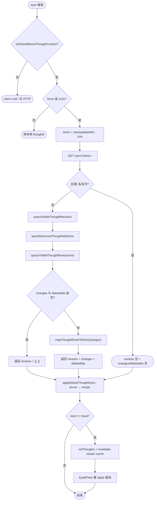
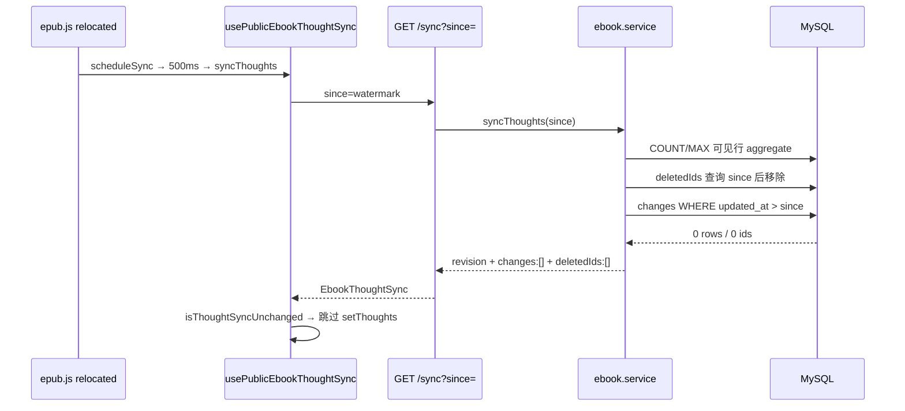
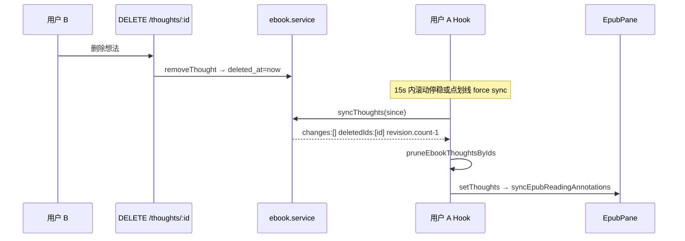

# 公开书想法 Sync 性能优化 — 实现思路

> **状态**：已上线（2026-07-02）  
> **日期**：2026-07-02  
> **需求摘要**：在 **不改变** 公开书想法实时同步产品行为的前提下，消除 `/sync` 嗅探在 **私有书误触发**、**无变更全表扫描**、**删除/改私密二次全量** 三类性能浪费。

## 延伸阅读

- [电子书公开想法实时同步.md](./电子书公开想法实时同步.md) — 实时同步产品链路（双轨触发、点击聚类、接口总览）
- [EPUB滚动卡顿性能.md](../epub/EPUB滚动卡顿性能.md) — 滚动 patch 与虚线叠层性能（与 sync 触发独立）
- [电子书公开分享影响.md](../../ebook/电子书公开分享影响.md) — 公开书 MVP、`listThoughts` 可见性合并

---

## 0. 读本文你将得到什么

- **三类瓶颈**：私有书仍嗅探 `/sync`；`since` 只减响应体、服务端仍全量 collect；删除/改私密触发 **第二次无 since 全量**。
- **一句话方案**：**前端 gate 私有书** + **后端 SQL 分层查询（aggregate / 增量 / deletedIds）** + **软删替代硬删**，单次 `/sync?since=` 完成增删改私密对齐。
- **三层改动**：`ebookStore.ensureBookForRead` · `usePublicEbookThoughtSync` · `epubThoughtSync.ts`（前端）；`ebook.service` · `ebook_thought` entity + migration（后端）。
- **分三阶段落地**：P0 私有 gate → M8 SQL 增量 → M6 deletedIds（均已合并主线）。
- **剩余风险**：migration 前硬删的历史行无法回溯 `deletedIds`；公开书读者极多时 `appendThoughtBookScope` 的 `In(readingIds)` 仍可扩展（M7 CFI 范围 sync 为可选后续）。

---

## 1. 需求与边界

### 1.1 用户故事

| 角色 | 场景 | 行为 | 期望结果 |
|------|------|------|----------|
| 私有书读者 | 滚动 / 切 Tab | 正常阅读 | Network **零** `/sync` |
| 公开书读者 | 滚动停稳，无人改想法 | 背景嗅探 | 1 次 `/sync?since=`，**小 payload**；DB **不全表 load** |
| 公开书读者 | B 删除 1 条公开想法 | A 下次 sync | **1 次**请求，`deletedIds` 含 id，虚线消失 |
| 公开书读者 | B 将想法改私密 | A 下次 sync | **1 次**请求，`deletedIds` 含 id |
| 公开书读者 | B 新增 1 条 | A sync | `changes` 长度 ≈1，非全书 N 条 |

### 1.2 范围

| 在范围内 | 不在范围内（非目标） |
|----------|----------------------|
| `/sync` 服务端查询路径优化 | WebSocket / SSE 推送 |
| `deletedIds` + 软删除 | 想法回收站 UI |
| 私有书 `enabled=false` | 进书首屏仍 `GET /thoughts/:id` 全量一次 |
| 去掉无 `since` 二次兜底 | M7 按 CFI 范围 sync（可选） |
| DB 索引 `(book_id, updated_at)`、`(book_id, deleted_at)` | `source_book_id` 冗余列（远期） |

### 1.3 约束

- **行为不变**：合并可见性规则与 `listThoughts` 一致；交互仍 15s 节流 + 500ms relocated debounce。
- **API 兼容**：`deletedIds` 为新增字段，旧客户端可忽略（新客户端已不依赖全量兜底）。
- **Ponytail**：不引入新依赖；复用 TypeORM QueryBuilder。

---

## 2. 方案总览

**一句话方案**：把 sync 从「每次内存全量 collect + filter」改为「**scope 一次定义、三路 SQL**（revision aggregate · changes 增量 · deletedIds 剔除）」；前端 **一次 apply** 完成 merge + prune，去掉第二次 `/sync`。

| # | 优化项 | 改前 | 改后 |
|---|--------|------|------|
| P0 | 私有书 gate | 书架缓存 `isPublic` 过期可能误开 sync | `ensureBookForRead` 刷新元数据；`enabled = book && isSharedContext` |
| M8 | 无变更嗅探 | 全表 `find` + 内存 filter | `COUNT/MAX` aggregate + `updated_at > since` 空结果短路 |
| M8 | 有少量新增 | 全表 load | 仅 load 变更行 + aggregate |
| M6 | 删除/改私密 | `changes=[]` + count 不一致 → **第二次无 since 全量** | `deletedIds` + `pruneEbookThoughtsByIds`，**单次请求** |
| M6 | 删除 API | `DELETE` 硬删 | `deleted_at` 软删 |

---

## 3. 现状与复用

| 能力 | 已有位置 | 本优化用法 |
|------|----------|------------|
| sync 入口 | `GET /thoughts/:bookId/sync` · `ebook.controller` | 响应扩展 `deletedIds` |
| 前端 Hook | `usePublicEbookThoughtSync.ts` | 去掉二次 `fetchEbookThoughtSync` |
| 合并工具 | `epubThoughtSync.ts` | 新增 `pruneEbookThoughtsByIds` |
| 书籍元数据 | `ebookStore.ensureBookForRead` | 进阅读页始终 `getEbookBook` |
| 可见性规则 | 原 `collectThoughtRowsForBook` | 拆为 `appendThoughtBookScope` + 可见性 + `deleted_at IS NULL` |
| 虚线渲染 | `EpubPane` → `syncEpubReadingAnnotations` | 不变，`setThoughts` 驱动 |

**调研结论**：产品层 sync 链路已在 [电子书公开想法实时同步.md](./电子书公开想法实时同步.md) 落地；本次仅替换 **数据面实现**，不重做 UI/双轨触发。

---

## 4. 架构图

```mermaid
flowchart TB
  subgraph FE [前端 apps/frontend]
    Read[read.tsx]
    Hook[usePublicEbookThoughtSync]
    Util[epubThoughtSync.ts]
    Store[ebookStore.ensureBookForRead]
  end
  subgraph API [HTTP]
    SyncRoute["GET /thoughts/:bookId/sync?since="]
  end
  subgraph BE [后端 apps/backend]
    Svc[ebook.service.syncThoughts]
    Scope[appendThoughtBookScope]
    Rev[queryVisibleThoughtRevision]
    Chg[queryVisibleThoughtRows]
    Del[queryRemovedThoughtIdsSince]
    Soft[removeThought 软删]
  end
  subgraph DB [(MySQL ebook_thought)]
    Idx1["idx book_id + updated_at"]
    Idx2["idx book_id + deleted_at"]
  end
  Read --> Store
  Read --> Hook
  Hook --> Util
  Hook --> SyncRoute
  SyncRoute --> Svc
  Svc --> Rev
  Svc --> Chg
  Svc --> Del
  Rev --> Scope
  Chg --> Scope
  Del --> Scope
  Scope --> DB
  Soft --> DB
  Util -->|setThoughts| Read
```

**图内方法说明**：

| 方法 / 模块 | 功能 |
|-------------|------|
| `ensureBookForRead(bookId)` | 进阅读页拉 `getEbookBook`，刷新 `isPublic`/`sourceBookId`，清除过期 `publicSourceCache` |
| `usePublicEbookThoughtSync` | 公开/读书记录才 `enabled`；调度 background/interaction sync |
| `syncThoughts({ force? })`（Hook 内） | 算 `since` → 一次 HTTP → `applyEbookThoughtSync` → 条件 `setThoughts` |
| `applyEbookThoughtSync(local, sync)` | `prune(deletedIds)` → `merge(changes)`；无 `needsFullResync` |
| `syncThoughts(userId, bookId, since?)`（后端） | 编排 revision + changes + deletedIds 三路查询 |
| `appendThoughtBookScope(qb, userId, book)` | 按源书/公开/私有三分支附加 `book_id` 范围 OR 条件 |
| `queryVisibleThoughtRevision` | `COUNT(*)` + `MAX(updated_at)`，仅可见且未软删 |
| `queryVisibleThoughtRows(since?)` | 可见行；有 `since` 时 `updated_at > since` |
| `queryRemovedThoughtIdsSince` | 软删 id + 他人改私密 id，since 之后对 viewer 不可见 |
| `removeThought` | 写 `deleted_at`，非 `DELETE` |

**读图要点**：

- 性能优化集中在 **后端 SQL 分层**；前端从「apply + 可能二次 fetch」变为 **单次 apply**。
- `appendThoughtBookScope` 是 scope 唯一来源，保证 sync 与 `listThoughts` 同构。
- 索引服务 **增量 changes** 与 **deletedIds** 两条 WHERE 路径。

---

## 5. 主流程图



**图内方法说明**：

| 方法 | 功能 |
|------|------|
| `isSharedEbookThoughtContext(book)` | `book.isPublic \|\| book.sourceBookId` |
| `ebookThoughtSyncSinceParam(localMax)` | watermark 减 1ms，避免同毫秒漏增量 |
| `queryVisibleThoughtRevision` | SQL aggregate，O(1) 行返回 |
| `queryRemovedThoughtIdsSince` | 两路子查询：软删 + 改私密 |
| `queryVisibleThoughtRows` | 带 since 的增量行 |
| `pruneEbookThoughtsByIds` | 本地按 id 剔除 |
| `mergeEbookThoughts` | id Map 覆盖/追加，createdAt 降序 |
| `isThoughtSyncUnchanged` | changes、deletedIds 皆空且 revision 与 local 对齐则跳过 setState |

**读图要点**：

- **无变更**路径在 M8 后不再 load 全表 rows，仅 aggregate + 空增量查询。
- **删除/改私密**走 `deletedIds` 分支，**不**再出现「无 since 全量」菱形。
- 私有书在前后端 **双重短路**。

---

## 6. 核心时序图

### 6.1 无变更背景嗅探（M8 Happy path）



**图内方法说明**：

| 方法 | 功能 |
|------|------|
| `scheduleSync` | relocated debounce 500ms 后调 sync |
| `syncThoughts(since)`（后端） | 三路 SQL，空 changes/deletedIds 仍返回 revision |
| `isThoughtSyncUnchanged` | 避免无变更时 React 重渲染与虚线重 apply |

**读图要点**：M8 的价值在 DB 侧——aggregate 与增量查询替代全表实体 load。

### 6.2 他人删除想法（M6 Happy path）



**图内方法说明**：

| 方法 | 功能 |
|------|------|
| `removeThought` | 软删：保留行供 `deleted_at > since` 查询 |
| `queryRemovedThoughtIdsSince` | 软删子查询：`deleted_at > since` 且 `(own OR is_public)` |
| `pruneEbookThoughtsByIds` | 从 local 数组剔除 id，不二次 HTTP |

**读图要点**：M6 依赖软删；硬删无法产生 `deletedIds`。

---

## 7. 模块职责与接口草图

### 7.1 响应结构（已上线）

```typescript
type EbookThoughtSync = {
  revision: { count: number; latestUpdatedAt: string | null };
  changes: EbookThought[];
  deletedIds?: string[]; // 后端 since 路径恒返回数组
};
```

### 7.2 前端 apply 顺序（不可颠倒）

```typescript
function applyEbookThoughtSync(local, sync) {
  let next = pruneEbookThoughtsByIds(local, sync.deletedIds ?? []);
  if (sync.changes.length > 0) next = mergeEbookThoughts(next, sync.changes);
  return { next };
}
```

先 **剔除** 再 **合并**，避免已删 id 被 stale changes 写回。

### 7.3 数据模型变更

| 字段 | 表 | 说明 |
|------|-----|------|
| `deleted_at` | `ebook_thought` | NULL=有效；非 NULL=软删时刻 |
| `idx_ebook_thought_book_updated` | 索引 | 加速 `updated_at > since` |
| `idx_ebook_thought_book_deleted` | 索引 | 加速 `deleted_at > since` |

### 7.4 deletedIds 两条来源

| 来源 | SQL 条件 | 语义 |
|------|----------|------|
| 软删 | `deleted_at > since` + scope + `(user_id=viewer OR is_public)` | 删除公开/本人可见想法 |
| 改私密 | `deleted_at IS NULL` + `updated_at > since` + `user_id≠viewer` + `is_public=false` | 他人想法对 viewer 撤回 |

---

## 8. 分阶段实现步骤

| 阶段 | 目标 | 状态 |
|------|------|------|
| **P0** | 私有书零 `/sync` | ✅ |
| **M8** | SQL aggregate + 增量 + `updated_at` 索引 | ✅ |
| **M6** | 软删 + `deletedIds` + 去掉无 since 兜底 | ✅ |
| M7（可选） | 点划线 `cfiRanges` 范围 sync | 未做 |
| M9（可选） | 进书首屏改 `/sync` 统一 URL | 未做 |

### P0 任务清单

- [x] `ensureBookForRead` 始终 `getEbookBook`，清除 stale `publicSourceCache`
- [x] Hook `enabled` 要求 `book` 已加载且 `isSharedEbookThoughtContext`

### M8 任务清单

- [x] 抽取 `appendThoughtBookScope` / `createVisibleThoughtsQueryBuilder`
- [x] `queryVisibleThoughtRevision`（COUNT/MAX）
- [x] `queryVisibleThoughtRows(since?)` 替代内存 filter
- [x] migration `idx_ebook_thought_book_updated`

### M6 任务清单

- [x] entity `deleted_at` + migration
- [x] `removeThought` 软删；update/find 排除已删
- [x] `queryRemovedThoughtIdsSince`
- [x] 前端 `pruneEbookThoughtsByIds`；移除 Hook 二次 fetch
- [x] `isThoughtSyncUnchanged` 纳入 `deletedIds`

---

## 9. 关键决策与备选

| 决策 | 选用 | 备选 | 为何不选 |
|------|------|------|----------|
| 删除感知 | 软删 `deleted_at` | 墓碑表 | 单表改动最小，与 TypeORM 自然契合 |
| 改私密感知 | `deletedIds`（revoked 查询） | 在 changes 返回 `isPublic:false` 再前端滤 | 他人不应再 merge 私密内容，直接 id 剔除更清晰 |
| 删改对齐 | 去掉无 since 兜底 | 保留兜底作安全网 | 与 M6 目标冲突；极端不一致可进书全量 `listThoughts` 恢复 |
| revision 计算 | 每次 aggregate | 缓存 revision 表 | YAGNI；aggregate 已比全表 load 轻 |
| 私有 gate | 前后端双短路 | 仅后端返回空 | 省无效 RTT 与前端调度 |

---

## 10. 风险与边界

| 项 | 等级 | 说明 | 缓解 |
|----|------|------|------|
| migration 前硬删 | 低 | 无 `deleted_at` 历史 | 仅影响升级前已删行；新删走 M6 |
| 软删表膨胀 | 低 | 行永久保留 | 远期可物理清理 `deleted_at < now-90d` 任务 |
| scope 内 `In(readingIds)` | 中 | 热门公开书读者多 | M7/M9 或冗余 `source_book_id` |
| 无兜底后极端不一致 | 低 | 理论 count 仍不齐 | 重新进书 `GET /thoughts` 全量修复 |

**待确认**：

- [ ] 生产 migration 已执行（验证：`DESCRIBE ebook_thought` 含 `deleted_at`）

---

## 11. 验收清单

| # | 用例 | 步骤 | 期望 |
|---|------|------|------|
| AC1 | 私有书零 sync | 开私有书滚动 | 无 `/sync` |
| AC2 | 无变更嗅探 | 公开书、无人改想法 | 1 次 `/sync?since=`；changes/deletedIds 空；服务端不全表 load |
| AC3 | 增量新增 | B 新增 1 条 | A：`changes.length≈1` |
| AC4 | 软删同步 | B 删公开想法 | A：1 次请求；`deletedIds` 含 id；无第二次无 since |
| AC5 | 改私密 | B 公开→私密 | A：`deletedIds` 含 id |
| AC6 | 自己删 | A 删自己想法 | 本地即时更新；软删后他人 AC4 |
| AC7 | list 一致 | 对比 `GET /thoughts` 与 prune+merge 后 local | 可见集合一致 |

---

## 12. 预估改动面（已落地）

| 类型 | 路径 |
|------|------|
| 后端 entity | `apps/backend/src/services/ebook/ebook-thought.entity.ts` |
| 后端 service | `apps/backend/src/services/ebook/ebook.service.ts` |
| migration | `1782991000000-ebook_thought_updated_idx.ts`、`1782992000000-ebook_thought_soft_delete.ts` |
| 前端 types | `apps/frontend/src/views/ebook/types.ts` |
| 前端 util | `apps/frontend/src/views/ebook/utils/epub/mark/epubThoughtSync.ts` |
| 前端 hook | `apps/frontend/src/views/ebook/hooks/usePublicEbookThoughtSync.ts` |
| 前端 store | `apps/frontend/src/store/ebook.ts`（P0） |

---

## 13. 改前 / 改后对照

| 维度 | 改前 | 改后 |
|------|------|------|
| 私有书 Network | 可能误调 `/sync?since=` | 0 次 |
| 无变更 DB | `collectThoughtRowsForBook` 全表 | COUNT/MAX + 空增量 |
| 删除同步 | 2× HTTP；第 2 次全量 changes | 1× HTTP；`deletedIds` |
| 前端 apply | merge；可能 `needsFullResync` | prune → merge；单次 fetch |
| 删除持久化 | `DELETE` | `deleted_at` 软删 |

---

（本文档描述本次性能优化已落地实现；产品交互见 [电子书公开想法实时同步.md](./电子书公开想法实时同步.md)。）
