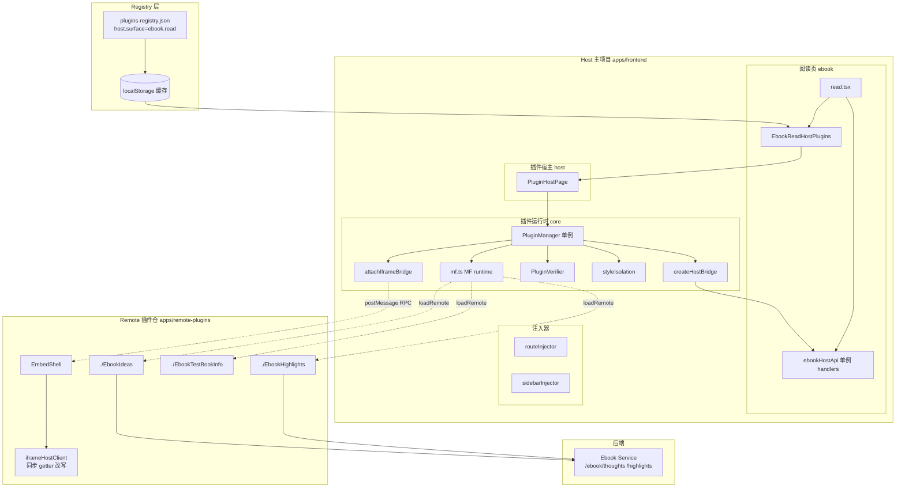
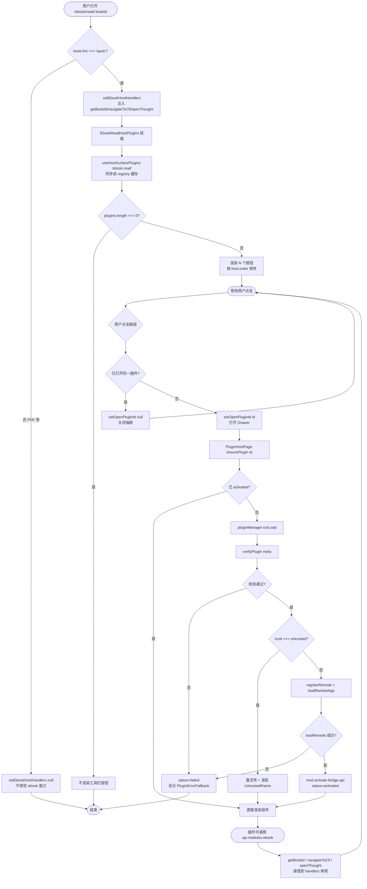
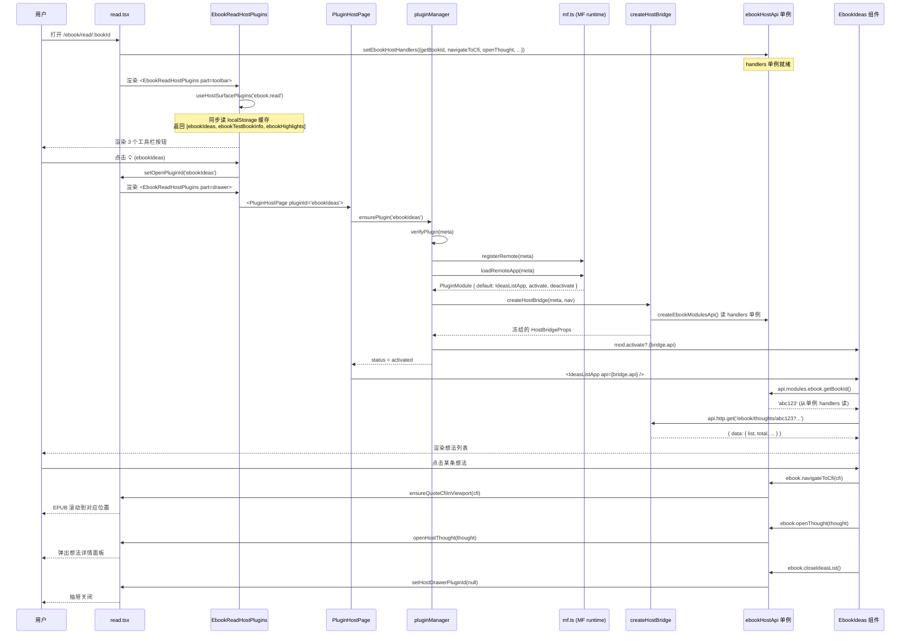
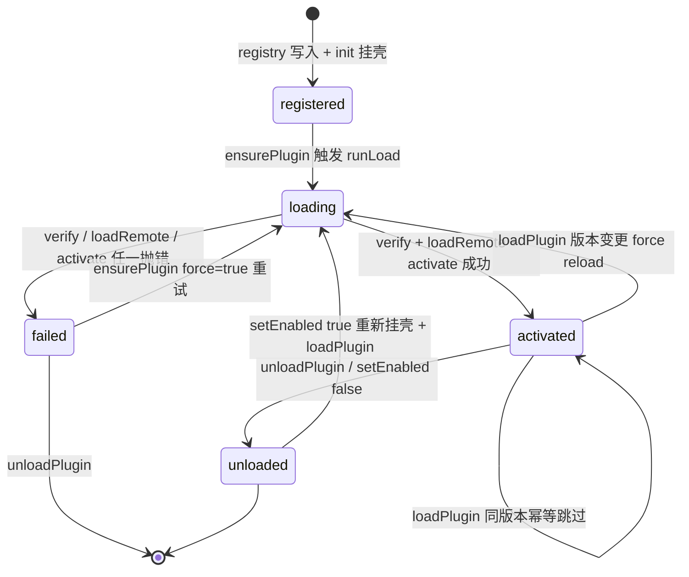

# Ebook 插件动态接入 — 实现思路

> **状态**：规划（核心能力已上线，本文为端到端实现手册）  
> **日期**：2026-07-28  
> **需求摘要**：让主项目 EPUB 阅读页能在运行时通过 registry 配置动态加载一组 ebook 插件（全书想法 / 全书划线 / 书信息测试等），并以「Host Surface + 单例 handlers 冻结代理」方式把当前 bookId / CFI 导航 / 想法面板等阅读上下文安全注入插件，支持 MF first-party 与 iframe untrusted 两种信任模式。

## 延伸阅读

- 通用插件系统手册：[docs/app/宿主插件集成指南.md](../../plugins/宿主插件集成指南.md)
- 第三方 MF 插件接入（CORS / capabilities / registry 上架）：[docs/ideas/第三方联邦插件接入.md](../plugins/第三方联邦插件接入.md)
- MF 主子样式互不影响：[docs/ideas/模块联邦CSS隔离.md](../plugins/模块联邦CSS隔离.md)
- 插件开发模板手册：[apps/remote-plugins/plugin-info.md](../../plugins/插件图标系统.md)
- 学习笔记 DOCX 导出端到端实现手册（同款「规划 + 实现手册」体裁）：[docs/ideas/学习笔记DOCX导出手册.md](../notes/学习笔记DOCX导出手册.md)

---

## 0. 读本文你将得到什么

- **要解决什么问题**：阅读页需要在不改 `read.tsx` 的前提下，按 registry 配置动态挂载多个 ebook 槽位插件（想法/划线/测试），并把当前 bookId、CFI 导航、想法面板等阅读上下文安全暴露给插件。
- **总体方案一句话**：插件在 registry 声明 `host.surface = 'ebook.read'`；阅读页用 `useHostSurfacePlugins` 同步枚举槽位插件 → 点击工具栏按钮触发 `PluginHostPage` → `pluginManager.ensurePlugin` 走 Module Federation runtime `loadRemote` 拉远端组件，同时 `createHostBridge` 装配冻结的 `api.modules.ebook` 代理；阅读页通过 `setEbookHostHandlers` 单例注入 live 闭包，冻结代理读穿透到最新 book 上下文。
- **主要改哪些层**：Host 插件运行时（`apps/frontend/src/plugins/`）、Ebook 阅读页接入点（`apps/frontend/src/views/ebook/`）、Remote 插件仓（`apps/remote-plugins/`）、Registry 配置（`apps/backend/uploads/remotes/plugins-registry.json`）。
- **分几阶段落地**：M1 通用插件运行时 → M2 ebook Host Surface 接入点 → M3 单例 handlers 冻结代理 → M4 首个 ebook 插件（Ideas）→ M5 iframe untrusted 适配 → M6 多插件扩展（Highlights/TestBookInfo）。
- **最大风险**：MF runtime 与 Host React 共享单例版本不匹配会炸「双重 React」；iframe 模式下 plugin 视图同步读 `getBookId()` 与 RPC 异步语义冲突，需「预取改写闭包」桥接。

---

## 1. 需求与边界

### 1.1 用户故事

| 角色 | 场景 | 行为 | 期望结果 |
|------|------|------|----------|
| 阅读页用户 | 读 EPUB 时想看全书想法 | 点工具栏 💡 按钮 | 抽屉打开「全书想法」列表，点击条目跳回原文 |
| 阅读页用户 | 想浏览全书划线 | 点 🖋️ 按钮 | 抽屉打开「全书划线」列表，滚动分页加载 |
| 插件作者 | 想加新插件（如「全书书签」） | 只改 registry JSON，新增一个 expose | 阅读页工具栏自动出现按钮，无需改 `read.tsx` |
| Host 维护者 | 想给插件开放新能力（如 `getChapterTitle`） | 扩 `EbookHostHandlers` + bridge 装配 | 已上线插件零改动继续工作 |
| 安全场景 | 不信任的第三方 ebook 插件 | 把 `trust` 设为 `untrusted` 并给 `iframeUrl` | 走沙箱 iframe + postMessage RPC，不进 MF |

### 1.2 范围

| 在范围内 | 不在范围内（非目标） |
|----------|----------------------|
| Host 侧插件运行时（MF + iframe 双模式） | 插件市场后台管理 UI（仅 Plugin Center 编辑 registry） |
| `ebook.read` Host Surface 发现机制 | 其它 surface（如 `chat.compose`，预留扩展点但不在本文） |
| `modules.ebook` 能力（bookId / navigateToCfi / openThought / closeIdeasList） | `modules.chat`、其它 module 能力 |
| 阅读页 toolbar + Drawer 接入点 | 顶栏全局插件入口（顶栏用通用 Plugin Center） |
| Remote 仓 3 个 ebook expose（Ideas/Highlights/TestBookInfo） | LearningNotes expose（非 ebook 域，本文不展开） |
| 样式隔离（`@scope([data-mf-plugin])`） | Shadow DOM 方案（已否决，见 [模块联邦CSS隔离.md](../plugins/模块联邦CSS隔离.md)） |
| i18n 双向同步（snapshot + event bus / postMessage locale push） | 插件本地 i18n 编辑器 |

### 1.3 约束与依赖

- **运行时**：Tauri 2 桌面 + Web 双端；MF 走 WebView 原生 fetch/import，第三方域名不必写进 Tauri `capabilities`（仅对方 Nginx 对 `https://dnhyxc.cn:9002` + `tauri://localhost` 开 CORS）。
- **React 版本**：Host React 19.1.x；Remote 须 `shared.react.singleton: true, requiredVersion: '^19.1.0'`，否则双重 React 直接 crash。
- **Host API 契约**：`HOST_API_VERSION = '1.0.0'`，插件通过 `hostApiRange: '^1.0.0'` 声明兼容；`PluginVerifier.satisfiesRange` 校验。
- **EPUB 阅读上下文**：仅 `book.fmt === 'epub'` 时绑定 `EbookHostHandlers`；PDF 不绑（当前未提供插件槽）。
- **复用现有能力**：`@/utils/fetch` 的 `http`、`@/utils` 的 `downloadBlob`、`@ui/sonner` 的 `Toast`、`@design/Drawer`、`@design/Tooltip`。

---

## 2. 方案总览（一句话 + 要点）

**一句话方案**：插件在 registry 声明 `host.surface='ebook.read'`；阅读页用 `useHostSurfacePlugins` 同步枚举槽位插件 → 工具栏按钮触发 `PluginHostPage` → `pluginManager` 走 MF runtime `loadRemote` 拉远端组件并 `createHostBridge` 装配冻结的 `api.modules.ebook` 代理；阅读页通过 `setEbookHostHandlers` 单例注入 live 闭包，冻结代理读穿透到最新 book 上下文；untrusted 插件降级走 iframe + postMessage RPC，并通过「预取改写闭包」桥接同步 getter。

| # | 设计要点 | 理由 |
|---|----------|------|
| 1 | 用 **Host Surface 声明**（registry `host.surface`）让插件自报挂载点 | 阅读页不硬编码插件 ID；新增插件零改 `read.tsx` |
| 2 | `pluginManager` 采用 **lazy loadRemote**（首次 `ensurePlugin` 才下载 MF Remote） | 不拖慢主应用启动；ebook 插件 `preload:'route'`，打开阅读页工具栏不立即下载 |
| 3 | `createHostBridge` **按 `permissions` 装配冻结 API** | 最小权限原则；未授权能力不存在，插件无法越权 |
| 4 | `modules.ebook` 用 **模块级单例 handlers + 冻结代理读穿透** | bridge 须 `deepFreeze`，但 bookId / navigateToCfi 随阅读变化；用单例让冻结代理永远读到最新闭包 |
| 5 | `EbookReadHostPlugins` 用 `useHostSurfacePlugins` 同步枚举 + `Drawer` 槽位 | UI 不闪烁；registry 缓存命中即渲染按钮 |
| 6 | 阅读页 `useEffect` 绑定 / 清理 `setEbookHostHandlers` | 切书、切 PDF 时清理；保证插件永远拿当前 book |
| 7 | untrusted iframe 模式 **预取 `getBookId/getBookTitle` 并改写闭包为同步** | plugin 视图同步读 getter，但 RPC 异步；预取后改写为同步返回，让 view 复用同一套渲染代码 |
| 8 | 样式隔离用 **`@scope([data-mf-plugin="id"])` 运行期捕获** | 比 Shadow DOM 轻量；Vite dev 与 prod link/style 都能拦截 |
| 9 | i18n 用 **`api.locale` snapshot + `eventBus.emit('locale')` 双轨** | snapshot 满足首次渲染；event 推送满足运行期切换；iframe 用 `postMessage` 推同语义消息 |

---

## 3. 现状与复用

> 调研基于 `apps/frontend/src/plugins/`、`apps/frontend/src/views/ebook/`、`apps/remote-plugins/` 真实源码。

| 能力 | 仓库中已有 | 本需求中的用法 |
|------|------------|----------------|
| MF runtime 单例 | `apps/frontend/src/plugins/core/mf.ts` | 直接复用：`registerRemote` + `loadRemoteApp` |
| 插件生命周期管理 | `apps/frontend/src/plugins/core/PluginManager.ts` | 直接复用：`init` / `ensurePlugin` / `unloadPlugin` / `setEnabled` |
| Registry 拉取与缓存 | `apps/frontend/src/plugins/core/registry.ts` | 直接复用：`fetchPluginRegistry({force:true})` + localStorage 缓存 |
| Host Surface 枚举 | `apps/frontend/src/plugins/core/hostSurface.ts` | 直接复用：`listHostSurfacePlugins('ebook.read')` |
| React Hook 形式枚举 | `apps/frontend/src/plugins/hooks/useHostSurfacePlugins.ts` | 直接复用：`useHostSurfacePlugins('ebook.read')` |
| Host Bridge 装配 | `apps/frontend/src/plugins/core/createHostBridge.ts` | 扩展：装配 `modules.ebook`（已有），新增 ebook 能力时再扩 |
| Ebook Host 能力单例 | `apps/frontend/src/plugins/host-api/ebookHostApi.ts` | 直接复用：`setEbookHostHandlers` + `createEbookModulesApi` |
| PluginHostPage 通用渲染器 | `apps/frontend/src/plugins/host/PluginHostPage.tsx` | 直接复用：传 `pluginId` 即渲染 |
| 样式隔离 | `apps/frontend/src/plugins/host/styleIsolation.ts` | 直接复用：`beginPluginStyleCapture` 在 `loadRemote` 期间捕获 |
| Iframe RPC Bridge | `apps/frontend/src/plugins/core/attachIframeBridge.ts` | 直接复用：untrusted 模式自动启用 |
| 插件工具栏 + Drawer 组件 | `apps/frontend/src/views/ebook/components/plugins/EbookReadHostPlugins.tsx` | 直接复用：阅读页只消费此组件 |
| 阅读页 handlers 绑定点 | `apps/frontend/src/views/ebook/read.tsx`（line 1099-1113） | 直接复用：`useEffect` 已绑定 `setEbookHostHandlers` |
| Remote 插件仓 | `apps/remote-plugins/` | 直接复用：3 个 ebook expose 已存在 |
| Iframe 客户端 | `apps/remote-plugins/src/utils/iframeHostClient.ts` | 直接复用：含「同步 getter 预取改写」桥接 |
| i18n 双向同步 | `apps/remote-plugins/src/hooks/useHostLocale.ts` | 直接复用：snapshot + event bus 双轨 |
| Registry JSON | `apps/backend/uploads/remotes/plugins-registry.json` | 扩展：新增 ebook 插件条目 |
| EPUB 阅读上下文（bookId / CFI 导航 / 想法面板） | `apps/frontend/src/views/ebook/read.tsx` | 直接复用：`book.id` / `book.title` / `ensureQuoteCfiInViewport` / `openHostThought` |
| 路由 | `apps/frontend/src/router/routes.ts` | 不适用：ebook 插件 `injectRoute:false`，不进路由表 |
| 后端 API | `apps/backend/src/services/ebook/` | 不适用：插件直连已有 `/ebook/thoughts/:bookId`、`/ebook/highlights/:bookId` |
| Toast / Drawer / Tooltip / Button | `@ui/*`、`@design/*` | 直接复用 |

**调研结论**：核心能力 **全部已上线**，本文不做新功能开发，而是把现有实现整理成端到端实现手册。新增 ebook 插件只需 3 步：(1) 在 `apps/remote-plugins/src/views/ebook/<name>/index.tsx` 写组件；(2) 在 `vite.config.ts` 的 `exposes` 增加映射；(3) 在 `plugins-registry.json` 加一条 `host.surface='ebook.read'` 条目。**无需改 `read.tsx`、无需改 PluginManager、无需改 Host Bridge**。

---

## 4. 架构图



**图内方法说明**：

| 方法 / 模块入口 | 功能 |
|-----------------|------|
| `pluginManager`（`PluginManagerImpl`） | 单例生命周期编排器：`init` 拉注册表挂壳；`ensurePlugin` 触发 `runLoad`；`unloadPlugin` 反向清理；`setEnabled` 持久化 |
| `registerRemote(d)` / `loadRemoteApp(d)` | MF runtime 注册远端 entry 并 `loadRemote('${remoteName}/${expose}')` 返回 `PluginModule` |
| `createHostBridge(d, nav)` | 按 `d.permissions` 装配 `api.{theme, locale, event, ui, navigate, http, modules}` 并 `deepFreeze` |
| `verifyPlugin(d)` | 校验 entry URL 协议、`hostApiRange` 满足 `HOST_API_VERSION`、可选 integrity / signature |
| `beginPluginStyleCapture(id, entry)` | 在 `loadRemoteApp` 期间 patch `head.appendChild`，把 Remote 注入的 style/link 用 `@scope([data-mf-plugin="id"])` 包裹 |
| `attachIframeBridge(iframe, bridge, targetOrigin)` | untrusted 模式：监听 iframe `ready` → 发 `init`；接收 `rpc` → `dispatchRpc` 回 `rpc-result`；监听 Host `locale` 事件转发 |
| `PluginHostPage({pluginId})` | 通用渲染器：`ensurePlugin` → 已 activated 则渲染 `<Comp {...liveBridge} />`（MF）或 `<UntrustedIframe>`（iframe） |
| `EbookReadHostPlugins({part, openPluginId, ...})` | 阅读页 Host 槽位组件：`part='toolbar'` 渲染按钮列表；`part='drawer'` 渲染 `<Drawer><PluginHostPage/></Drawer>` |
| `setEbookHostHandlers(next)` / `createEbookModulesApi()` | 模块级单例 holders + 冻结代理：`api.modules.ebook.getBookId()` 穿透到当前 `handlers` |
| `connectIframeHost(pluginId)` | untrusted plugin 端客户端：`ready` ping → `init` 后装配 RPC 桥；预取 `getBookId/getBookTitle` 改写为同步闭包 |
| `routeInjector.inject(id, routes)` / `sidebarInjector.add(item)` | 动态注入路由 / 侧栏项；ebook 插件 `injectRoute:false` + 无 `menu`，故实际不触发 |

**读图要点**：

- 三层分工清晰：**Registry 层**（配置 + 缓存）→ **Host 主项目**（运行时 + 阅读页接入点）→ **Remote 仓**（3 个 ebook expose + iframe 客户端）。
- ebook 插件走「虚线」路径：MF `loadRemote`（first-party）或 postMessage RPC（untrusted iframe）；后端 `/ebook/thoughts/:bookId` 等接口被插件经 `api.http` 间接调用，Host 不感知。
- `EbookReadHostPlugins` 是阅读页与插件运行时之间的**唯一耦合点**：阅读页只调 `useHostSurfacePlugins` + 渲染 `<PluginHostPage>`，不直接 import 任何插件代码。
- `setEbookHostHandlers` 单例位于 `host-api/ebookHostApi.ts`，是阅读页与已激活插件之间**唯一的运行期数据通道**。

---

## 5. 主流程图



**图内方法说明**：

| 方法 | 功能 |
|------|------|
| `setEbookHostHandlers(next)` | 阅读页 `useEffect` 调用：把当前 `book.id`、`book.title`、`ensureQuoteCfiInViewport`、`openHostThought` 包成 handlers 写入模块单例；`null` 表示清理 |
| `useHostSurfacePlugins(surface)` | React Hook：订阅 `subscribePluginEnabled`，同步读 `listHostSurfacePlugins('ebook.read')` |
| `listHostSurfacePlugins(surface)` | 从 localStorage 缓存解析 registry，过滤 `enabled && host?.surface === surface`，按 `host.order` 升序排序 |
| `pluginManager.ensurePlugin(id, opts?)` | get-or-load 入口：命中 activated 直接返回；命中 failed 且无 `force` 抛错；否则重新拉 registry + `mountShell` + `loadPlugin` |
| `pluginManager.runLoad(meta)` | 实际加载：建 `loading` 占位 → `verifyPlugin` → untrusted 走壳；否则 `registerRemote` + `beginPluginStyleCapture` + `loadRemoteApp` + `mod.activate` |
| `verifyPlugin(d)` | 校验 entry URL（prod 强制 https，dev 允许 localhost http）、`hostApiRange` 满足 `HOST_API_VERSION`、可选 integrity hash 与 signature |
| `registerRemote(d)` | `getMf().registerRemotes([{name, entry, type:'module'}], {force:true})` |
| `loadRemoteApp(d)` | `getMf().loadRemote('${remoteName}/${expose}')` 返回 `PluginModule`；缺 `default` 抛错 |
| `mod.activate?.(api)` | 插件可选的一次性初始化钩子；可读 `api` 做全局副作用 |
| `createHostBridge(d, nav)` | 装配冻结 bridge：`permissions` 含 `modules:ebook` 则注入 `api.modules.ebook = createEbookModulesApi()` |
| `createEbookModulesApi()` | 返回 `Object.freeze({getBookId, getBookTitle, navigateToCfi, openThought, closeIdeasList})`，每个方法读穿透到当前 `handlers` 单例 |

**读图要点**：

- 入口是「用户打开阅读页」而非「点击工具栏」：`setEbookHostHandlers` 在 `useEffect` 里先于任何插件加载执行，保证插件首次激活时单例已就绪。
- 关键分支在 `trust === untrusted`：first-party 走 MF `loadRemote`，untrusted 走 iframe 壳（不进 MF）。两条路径都最终到达「插件可调用 `api.modules.ebook`」。
- `PluginHostPage` 内置 `force` 重试：用户点击重试按钮时 `retryKey++` 触发 `ensurePlugin(id, {force:true})` 绕过 failed 缓存。
- 失败路径不会让阅读页崩溃：`PluginErrorBoundary` 兜底，仅 Drawer 内显示错误。

---

## 6. 核心时序图



**图内方法说明**：

| 方法 | 功能 |
|------|------|
| `setEbookHostHandlers(next)` | 阅读页 `useEffect` 调用：写入当前 book 的 handlers 闭包到模块单例；切书 / 切 PDF 时清理为 `null` |
| `useHostSurfacePlugins(surface)` | Hook：订阅 enabled 变更 + 同步读 `listHostSurfacePlugins`；返回按 `host.order` 排序的插件列表 |
| `pluginManager.ensurePlugin(id)` | 触发懒加载：命中 activated 返回；否则拉 registry → `mountShell` → `runLoad` |
| `pluginManager.runLoad(meta)` | `verifyPlugin` → `registerRemote` + `beginPluginStyleCapture` + `loadRemoteApp` → `createHostBridge` → `mod.activate?.(api)` → 写 `activated` |
| `verifyPlugin(meta)` | 校验 entry URL / `hostApiRange` 满足 `HOST_API_VERSION` / 可选 integrity |
| `registerRemote(meta)` | MF runtime `registerRemotes([{name, entry, type:'module'}], {force:true})` |
| `loadRemoteApp(meta)` | MF runtime `loadRemote('${remoteName}/${expose}')` 返回 `PluginModule` |
| `createHostBridge(d, nav)` | 按 `permissions` 装配 `api`，含 `modules.ebook = createEbookModulesApi()`，再 `deepFreeze` |
| `createEbookModulesApi()` | 返回冻结代理对象：`getBookId` 等方法读穿透到当前 `handlers` 单例 |
| `mod.activate?.(api)` | 插件可选钩子：一次性初始化（如全局 store bind） |
| `api.modules.ebook.getBookId()` | 插件同步调用：穿透冻结代理 → `handlers?.getBookId()` → 返回当前 bookId |
| `api.http.get(url)` | 插件发起 HTTP：经 Host `@/utils/fetch` 的 `http.get`，自动带鉴权 / 前缀 |
| `ebook.navigateToCfi(cfi)` | 穿透到 `handlers.navigateToCfi`（即阅读页 `ensureQuoteCfiInViewport`） |
| `ebook.openThought(thought)` | 穿透到 `handlers.openThought`（即阅读页 `openHostThought`） |
| `ebook.closeIdeasList()` | 穿透到 `handlers.closeIdeasList`（即 `setHostDrawerPluginId(null)`） |

**读图要点**：

- 时序图上半段是「阅读页加载」：`setEbookHostHandlers` 先于任何插件代码执行。
- 中段是「点击按钮 → MF 加载」：`PluginHostPage` 是阅读页与 `pluginManager` 之间的唯一接触点；MF Remote 仅在首次点击时下载。
- 下段是「插件回调 Host」：所有 ebook 能力调用都走 `handlers` 单例，阅读页不暴露任何全局对象给插件。
- 异步点仅在 `loadRemoteApp` 与 `api.http.get`；其它路径同步执行，符合 React 渲染模型。

---

## 7. 状态机（插件生命周期）



**图内方法说明**：

| 方法（触发迁移） | 功能 |
|------|------|
| `pluginManager.init()` | 启动时拉 registry → 对每个 `enabled` 插件 `mountShell`；`preload:'eager'` 的 `queueMicrotask` 后台 `loadPlugin` |
| `pluginManager.mountShell(meta)` | `injectRoute !== false` 则 `routeInjector.inject`；`meta.menu` 则 `sidebarInjector.add`；ebook 插件两者都不触发 |
| `pluginManager.ensurePlugin(id, opts?)` | 公共入口：activated 直接返回；failed 且无 `force` 抛错；inflight 复用 Promise |
| `pluginManager.runLoad(meta)` | 真实加载：建 `loading` → verify → MF 或 iframe → `activated`；失败写 `failed` + error message |
| `pluginManager.unloadPlugin(id)` | 调 `mod.deactivate?.()` → `eventBus.clearPlugin(id)` → `routeInjector.remove` + `sidebarInjector.remove` → `unloaded` |
| `pluginManager.setEnabled(id, enabled)` | `persistPluginEnabled` 写服务端 registry → `unloadPlugin` 或 `mountShell` |

**读图要点**：

- `registered` 是「已挂壳但未下载 MF Remote」的中间态：ebook 插件停在 `registered` 直到用户首次点击按钮。
- `failed` → `loading` 的重试由 `PluginHostPage` 内部 `retryKey` 状态触发，用户点击「重试」按钮即可。
- `activated` 之间可以「同版本幂等跳过」或「版本变更强制 reload」；reload 会先 `unloadPlugin` 再 `mountShell` + `loadPlugin`。

---

## 8. 模块职责与接口草图

### 8.1 模块一览

| 模块 | 职责 | 新增/改动 | 预估路径 |
|------|------|-----------|----------|
| MF runtime 单例 | 注册远端 entry、共享 React、`loadRemote` | 已有 | `apps/frontend/src/plugins/core/mf.ts` |
| PluginManager | 生命周期编排 | 已有 | `apps/frontend/src/plugins/core/PluginManager.ts` |
| Registry 拉取/缓存 | 拉 JSON、写 localStorage、`persistPluginEnabled` | 已有 | `apps/frontend/src/plugins/core/registry.ts` |
| Host Surface 枚举 | 同步读 registry 缓存按 surface 过滤 | 已有 | `apps/frontend/src/plugins/core/hostSurface.ts` |
| Host Bridge 装配 | 按 permissions 装配冻结 `api` | 已有 | `apps/frontend/src/plugins/core/createHostBridge.ts` |
| Ebook Host 能力单例 | 模块级 handlers + 冻结代理 | 已有 | `apps/frontend/src/plugins/host-api/ebookHostApi.ts` |
| EventBus | 按 pluginId 隔离的发布订阅 | 已有 | `apps/frontend/src/plugins/host-api/EventBus.ts` |
| Iframe RPC Bridge | untrusted 模式 postMessage RPC | 已有 | `apps/frontend/src/plugins/core/attachIframeBridge.ts` |
| PluginHostPage | 通用渲染器 + locale 推送 + ErrorBoundary | 已有 | `apps/frontend/src/plugins/host/PluginHostPage.tsx` |
| 样式隔离 | `@scope([data-mf-plugin])` 捕获 | 已有 | `apps/frontend/src/plugins/host/styleIsolation.ts` |
| 阅读页 Host 槽位组件 | toolbar + Drawer | 已有 | `apps/frontend/src/views/ebook/components/plugins/EbookReadHostPlugins.tsx` |
| 阅读页 handlers 绑定 | `useEffect` 绑定 `setEbookHostHandlers` | 已有 | `apps/frontend/src/views/ebook/read.tsx` (L1099-1130) |
| Remote 仓 EbookIdeas | 全书想法列表 + 分页 + CFI 跳转 | 已有 | `apps/remote-plugins/src/views/ebook/ideas/index.tsx` |
| Remote 仓 EbookHighlights | 全书划线列表 + 分页 | 已有 | `apps/remote-plugins/src/views/ebook/highlights/index.tsx` |
| Remote 仓 EbookTestBookInfo | 槽位测试 + Toast | 已有 | `apps/remote-plugins/src/views/ebook-test/book-info.tsx` |
| Remote 仓 iframeHostClient | untrusted 端 RPC + 同步 getter 改写 | 已有 | `apps/remote-plugins/src/utils/iframeHostClient.ts` |
| Remote 仓 EmbedShell | iframe landing 组件 | 已有 | `apps/remote-plugins/src/views/embed/index.tsx` |
| Registry 配置 | 3 条 ebook 插件 JSON | 已有 | `apps/backend/uploads/remotes/plugins-registry.json` (L56-148) |

### 8.2 关键接口（TypeScript 草图）

```typescript
// === Host 侧 ===

// apps/frontend/src/plugins/core/types.ts
type PluginDescriptor = {
  id: string;
  remoteName?: string;          // 多插件共享同一 MF Remote（ebook 全用 'remotePlugins'）
  expose?: string;              // 默认 './App'，ebook 用 './EbookIdeas' 等
  entry: string;                // mf-manifest.json URL
  hostApiRange: string;         // semver range，须满足 HOST_API_VERSION
  injectRoute?: boolean;        // false → 不进路由表（ebook 全 false）
  host?: {                      // 📌 ebook 槽位声明
    surface: 'ebook.read';      // 阅读页唯一 surface
    slot: 'drawer';             // 当前仅 drawer 一种槽位
    icon?: string;              // 'Lightbulb' | 'Sparkles' | 'Highlighter' | ...
    order?: number;             // 工具栏排序
  };
  permissions: PluginPermission[];  // 含 'modules:ebook' 才会注入 api.modules.ebook
  trust: 'first-party' | 'partner' | 'untrusted';
  iframeUrl?: string;           // untrusted 模式 iframe 加载页
  preload?: 'eager' | 'route' | 'idle';  // ebook 全用 'route'
  enabled: boolean;
};

type HostBridgeProps = {
  api: {
    theme: 'light' | 'dark';
    locale: Locale;
    event: { on; off; emit };
    ui?: { showToast; downloadBlob };
    navigate?: (to: string) => void;
    http?: { get; post; put; delete };
    modules?: Readonly<Record<string, unknown>>;  // modules.ebook 由 permissions 注入
  };
  plugin: { id; version; routePath };
};

// apps/frontend/src/plugins/host-api/ebookHostApi.ts
type EbookHostHandlers = {
  getBookId: () => string | null;
  getBookTitle: () => string | null;
  navigateToCfi: (cfi: string) => void | Promise<void>;
  openThought: (thought: EbookHostThought) => void;
  closeIdeasList?: () => void;
};
function setEbookHostHandlers(next: EbookHostHandlers | null): void;
function createEbookModulesApi(): Readonly<EbookModulesApi>;

// === Plugin 侧 ===

// apps/remote-plugins/src/views/ebook/ideas/index.tsx
type EbookModules = {
  getBookId: () => string | null;
  getBookTitle: () => string | null;
  navigateToCfi: (cfi: string) => void | Promise<void>;
  openThought: (thought: Thought) => void;
  closeIdeasList?: () => void;
};
export default function IdeasListApp({ api }: HostBridgeProps): JSX.Element;
export async function activate(): Promise<void>;
export async function deactivate(): Promise<void>;
```

### 8.3 数据模型

| 字段/实体 | 来源 | 存储 | 说明 |
|-----------|------|------|------|
| `PluginDescriptor` | `plugins-registry.json` | localStorage `dnhyxc.plugin.registry.{prod\|dev}.v1` | 每次启动 `fetchPluginRegistry({force:true})` 刷新；离线时回退缓存 |
| `LoadedPlugin` | `pluginManager` 内存 | `Map<id, LoadedPlugin>` | 含 `meta / bridge / mod / status` |
| `handlers` 单例 | `read.tsx` `useEffect` | `host-api/ebookHostApi.ts` 模块级 `let handlers` | 随 book 变化重新绑定 |
| `EventBus` 监听 | 插件 `event.on` | `EventBusImpl` 内 `Map<pluginId:event, Set<handler>>` + `byPlugin` 反向索引 | `clearPlugin(id)` O(1) 清理 |
| `inflight` Map | `pluginManager` | `Map<id, Promise<void>>` | 同插件并发 `ensurePlugin` 共用 Promise |
| Thought/Highlight DTO | 后端 `/ebook/thoughts/:bookId` | 后端 DB | 插件经 `api.http.get` 拉取 |

---

## 9. 分阶段实现步骤

> 核心能力已上线，本节既是「历史落地路径」也是「从零复刻的推荐顺序」。

| 阶段 | 目标 | 交付物 | 依赖 |
|------|------|--------|------|
| M1 | 通用插件运行时（MF + iframe） | `plugins/core/*` + `plugins/host/*` + `plugins/inject/*` | 无 |
| M2 | Registry + Host Surface 枚举 | `plugins/core/registry.ts` + `hostSurface.ts` + `useHostSurfacePlugins` | M1 |
| M3 | Ebook Host 能力单例 + Bridge 注入 | `host-api/ebookHostApi.ts` + `createHostBridge` 注入 `modules.ebook` | M1 |
| M4 | 阅读页接入点 + 首个 ebook 插件 | `EbookReadHostPlugins` + `read.tsx` 绑定 + `EbookIdeas` expose | M2, M3 |
| M5 | Iframe untrusted 适配 | `attachIframeBridge` + `iframeHostClient`（同步 getter 改写） + `EmbedShell` | M4 |
| M6 | 多插件扩展 | `EbookHighlights` + `EbookTestBookInfo` + registry 多条目 | M4 |
| M7 | 样式隔离 + i18n 双向同步 | `styleIsolation.ts` + `useHostLocale` + `applyHostLocale` | M4 |
| M8 | Plugin Center + Registry Editor | `views/plugins/*` | M2 |

每阶段可勾选任务（M3、M4 为本需求核心）：

**M3 — Ebook Host 能力单例**

- [ ] 定义 `EbookHostThought` / `EbookHostHandlers` 类型
- [ ] 实现模块级 `handlers` + `setEbookHostHandlers` / `getEbookHostHandlers`
- [ ] 实现 `createEbookModulesApi`：返回 `Object.freeze` 代理对象，每个方法读穿透到 `handlers`，未绑定时 `navigateToCfi/openThought` 抛 `EBOOK_API_UNBOUND`
- [ ] 在 `createHostBridge` 中按 `permissions.has('modules:ebook')` 注入 `modules.ebook`
- [ ] 单测：未绑定时 `getBookId` 返回 `null`、`navigateToCfi` 抛错

**M4 — 阅读页接入点 + EbookIdeas**

- [ ] 在 `read.tsx` `useEffect` 中绑定 `setEbookHostHandlers`（依赖 `book.fmt === 'epub'`、`book.id`、`book.title`、`ensureQuoteCfiInViewport`、`openHostThought`）
- [ ] 实现 `EbookReadHostPlugins`：`part='toolbar'` 渲染按钮 + `part='drawer'` 渲染 `<Drawer><PluginHostPage/></Drawer>`
- [ ] 在 `apps/remote-plugins/vite.config.ts` 的 `exposes` 加 `'./EbookIdeas': './src/views/ebook/ideas/index.tsx'`
- [ ] 实现 `IdeasListApp`：同步读 `api.modules.ebook.getBookId()` → `api.http.get('/ebook/thoughts/${bookId}?...')` → IntersectionObserver 滚动分页 → `onOpen` 调 `navigateToCfi + openThought + closeIdeasList`
- [ ] 在 `plugins-registry.json` 加 `ebookIdeas` 条目（`host.surface='ebook.read'`、`injectRoute:false`、`permissions:['ui:toast','http:plugin-api','modules:ebook']`）
- [ ] 端到端验证：打开阅读页 → 点 💡 → 列表加载 → 点击条目 → 滚动到原文 + 弹想法面板

**M5 — Iframe untrusted 适配**

- [ ] 实现 `attachIframeBridge`：`ready` → `init` → `rpc` → `rpc-result`；`dispatchRpc` 白名单含 `ebook.{getBookId,getBookTitle,navigateToCfi,openThought,closeIdeasList}`
- [ ] 实现 `iframeHostClient.connectIframeHost`：`ready` ping（400ms 重试，15s 超时） → `init` 装配 RPC 桥
- [ ] **关键**：预取 `rpc('ebook.getBookId')` + `rpc('ebook.getBookTitle')`，改写 `bridge.api.modules.ebook.getBookId/getBookTitle` 为同步返回
- [ ] 实现 `EmbedShell`：`connectIframeHost(pluginId)` → `<App {...bridge} />`
- [ ] 在 `routes.tsx` 加 `/embed/ebook/plugins/ideas-list` 路由指向 `EmbedIdeasList`
- [ ] 在 registry 把 `trust` 改为 `'untrusted'` + 加 `iframeUrl`，验证 iframe 模式端到端

---

## 10. 关键决策与备选方案

| 决策 | 选用 | 备选 | 为何不选备选 |
|------|------|------|--------------|
| 动态加载机制 | **Module Federation runtime**（`@module-federation/enhanced/runtime`） | (a) SystemJS；(b) 动态 `import()`；(c) 脚本注入 + 全局变量 | (a) SystemJS 生态萎缩；(b) 动态 `import()` 不能跨构建共享 React 单例；(c) 脚本注入无依赖管理。MF runtime 支持 `registerShared` 让 Host 与 Remote 共用同一份 React，避免双重 React crash |
| 多插件共享 Remote | **同一 `remoteName: 'remotePlugins'`** + 不同 `expose` | 每个插件独立 Remote | 共享 Remote 一次下载 `remoteEntry.js` + manifest，3 个 ebook 插件总成本接近 1 个；独立 Remote 重复下载共享 chunk |
| Host Surface 发现 | **registry `host.surface` 字段** + `useHostSurfacePlugins` Hook | 阅读页硬编码插件 ID 列表 | 新增插件零改 `read.tsx`；硬编码需改业务代码、走 PR、重新发版 |
| book 上下文传递 | **模块级单例 `handlers` + 冻结代理读穿透** | (a) 把 bookId 直接放进 `bridge`；(b) 用 React Context | (a) bridge 在 `createHostBridge` 时冻结，切书后无法更新； (b) Context 跨 MF 边界不可靠（不同 React 实例），且 iframe 模式根本无 Context |
| iframe 同步 getter | **预取 `rpc('ebook.getBookId')` + 改写闭包为同步** | 让 plugin view 改成 `await getBookId()` 异步渲染 | plugin view 复用同一份代码（MF / iframe 通用）；改成 async 会引入 loading 闪烁，且 view 代码已上线不愿改 |
| 样式隔离 | **`@scope([data-mf-plugin="id"])` 运行期捕获** | (a) Shadow DOM；(b) 构建期 scoped CSS（CSS Modules）；c) iframe | (a) Shadow DOM 与 Host 主题/字体/事件代理冲突；(b) Remote 构建期不知道 Host class 命名；(c) iframe 性能差、通讯复杂 |
| i18n 同步 | **`api.locale` snapshot + `eventBus.emit('locale')` 双轨** | (a) 仅 snapshot；(b) 仅 event | (a) 切语言不刷新已挂载插件；(b) 首次渲染拿不到 locale。双轨兼顾首屏 + 运行期 |
| 路由注入 | **ebook 插件 `injectRoute:false`** | 让 PluginManager 自动注入路由 | ebook 插件不进全局路由表，避免出现在面包屑/侧栏；只在阅读页 Drawer 内访问 |
| 信任模式 | **first-party 走 MF；untrusted 走 iframe + postMessage** | 全部走 MF；或全部走 iframe | 全 MF 无法防恶意插件；全 iframe 性能差且 MF 已为可信插件优化 |
| preload 策略 | **ebook 插件 `preload:'route'`**（首次点击才下载） | `preload:'eager'`（启动即后台拉） | ebook 插件使用频率低；eager 会拖慢启动；route 模式用户体验无损 |

---

## 11. 风险、边界与待确认

| 项 | 等级 | 说明 | 缓解 |
|----|------|------|------|
| 双重 React | 高 | Remote 与 Host React 版本不一致会 crash | `mf.ts ensureShared` 注册 `singleton: true, requiredVersion: '^${React.version}'`；`vite.config.ts` 同步 `requiredVersion: '^19.1.0'`；`optimizeDeps.exclude` 排除 React 内部包 |
| MF manifest 跨域 | 高 | Remote Nginx 未对 Host origin 开 CORS → manifest 加载失败 | 文档化对方需对 `https://dnhyxc.cn:9002` + `tauri://localhost` 开 CORS；dev 模式 Vite 已开 `cors: true` |
| handlers 单例污染 | 中 | 多个阅读页实例（分屏）会互相覆盖 handlers | 当前架构假设单阅读页；分屏场景需改为 `Map<bookId, handlers>` 或 Context（**待确认**是否需要支持） |
| iframe 同步 getter 改写顺序 | 中 | 若 plugin view 在 `connectIframeHost` resolve 前就调用 `getBookId` 会拿到 `null` | `EmbedShell` 在 bridge resolve前显示 loading；resolve 后才渲染 `<App>` |
| localStorage 缓存过期 | 中 | registry 更新后用户首次启动仍用旧缓存 → 新插件不出现 | `init()` 用 `force:true` 强制刷新；用户也可在 Plugin Center 点「刷新 registry」 |
| 样式捕获泄漏 | 低 | `beginPluginStyleCapture` patch `head.appendChild`；若 `loadRemote` 抛错未 `endCapture` 会泄漏 patch | `runLoad` 用 `try/finally` 确保 `endCapture()` 执行 |
| iframe origin 校验 | 中 | `attachIframeBridge` 须严格校验 `event.origin` 匹配 `iframeUrl` origin | 已实现 origin 白名单；dev 模式 `localhost` 须允许 |
| Plugin 权限越界 | 中 | 插件调用未授权能力 | `createHostBridge` 按 `permissions` 装配；`dispatchRpc` 白名单 + `*_DENIED` 错；`navigate` 校验 `routePath` 前缀 |
| epub.js 与 plugin Drawer 焦点冲突 | 低 | Drawer 打开时 epub.js selection 仍可能触发 popbar | 阅读页已有 `popbar dismiss` 逻辑（见 [EPUB听书PopBar关闭.md](../../ebook/EPUB听书PopBar关闭.md)），Drawer 打开会同步 dismiss |

**待确认**：

- [ ] 是否需要支持「同一书多分屏」场景下的 handlers 隔离？（验证方式：在 `read.tsx` 用 React StrictMode 双挂载测试 `setEbookHostHandlers` 调用顺序）
- [ ] ebook 插件是否需要 `partner` 信任等级（介于 first-party 与 untrusted 之间）？（验证方式：review `PluginVerifier` 是否支持 `partner` 走 MF 但加 integrity 校验）
- [ ] Host Surface 是否需要扩展 `slot: 'toolbar'`（独立按钮无 Drawer）？（验证方式：观察是否有插件只需点按钮触发 Toast 而无需面板）

---

## 12. 验收清单

| # | 用例 | 步骤 | 期望 |
|---|------|------|------|
| AC1 | 首次打开阅读页 | 登录 → 打开 EPUB 书 → 进入阅读页 | 工具栏出现 3 个按钮（💡 全书想法、✨ 书信息测试、🖋️ 全书划线），按 `host.order` 排序 |
| AC2 | 打开 Ideas 列表 | 点 💡 按钮 | Drawer 打开，标题「全书想法」，显示当前书名 + 加载 spinner → 想法列表（最多 50 条/页） |
| AC3 | 滚动分页 | 列表滚到底部 | 自动加载下一页，去重；底部显示「已全部加载」 |
| AC4 | 跳转到原文 | 点击列表中某条想法 | EPUB 滚动到对应 CFI；想法详情面板弹出；抽屉关闭 |
| AC5 | 切书 | 返回书架 → 打开另一本 EPUB | 工具栏按钮不变；重新打开 💡 → 列表显示新书想法；旧插件实例不重新加载 |
| AC6 | 切 PDF | 打开 PDF 书 | 工具栏按钮消失（`book.fmt !== 'epub'` 时 `setEbookHostHandlers(null)`）；如已打开 Drawer 自动关闭 |
| AC7 | 关闭抽屉 | 点 💡 再次 / 点 Drawer 外部 | 抽屉关闭；插件组件 unmount 但 `pluginManager` 仍 `activated` |
| AC8 | 禁用插件 | Plugin Center 关闭 `ebookIdeas` | 阅读页工具栏 💡 按钮立即消失；已打开的 Drawer 自动关闭 |
| AC9 | 启用新插件 | Plugin Center 加一条 `ebookBookmarks` 条目 + 刷新 registry | 阅读页工具栏出现新按钮（无需改 `read.tsx`） |
| AC10 | MF 加载失败 | 断网 / Remote 服务下线 → 点按钮 | Drawer 内显示错误提示 + 重试按钮；阅读页其它功能不受影响 |
| AC11 | iframe untrusted 模式 | 把 `ebookIdeas` 的 `trust` 改 `untrusted` + 加 `iframeUrl` | Drawer 内加载 iframe 版 IdeasList；`getBookId` 同步返回正确值；点击条目仍能跳转 |
| AC12 | locale 切换 | 在阅读页打开 Drawer → 切换 Host 语言 | 插件 UI 立即切换语言（event bus 推送 + `applyHostLocale`） |
| AC13 | 样式隔离 | Remote 用 Tailwind Preflight | Host 样式不受影响；Remote 样式仅在 `[data-mf-plugin="ebookIdeas"]` 内生效 |
| AC14 | EPUB CFI 跳转 | 插件调 `navigateToCfi` 传入跨章 CFI | `ensureQuoteCfiInViewport` 滚动到目标位置（可能跨 iframe） |
| AC15 | 权限校验 | 临时去掉 registry 中 `modules:ebook` 权限 | 插件 `api.modules` 为 `undefined`；`api.modules?.ebook` 为 `undefined`；列表显示 `ideasList.unboundBook` |

---

## 13. 预估改动面（实现阶段参考）

| 类型 | 路径（预估） |
|------|--------------|
| 前端 Host 侧 | `apps/frontend/src/plugins/`（运行时已稳定，新增 ebook 能力时仅扩 `host-api/ebookHostApi.ts` + `createHostBridge.ts`） |
| 前端阅读页 | `apps/frontend/src/views/ebook/read.tsx`（handlers 绑定已就位；新增 surface 时零改） |
| 前端阅读页 Host 槽位 | `apps/frontend/src/views/ebook/components/plugins/EbookReadHostPlugins.tsx`（已通用；新 slot 类型时扩展 `part` 联合类型） |
| Remote 插件仓 | `apps/remote-plugins/src/views/ebook/<name>/index.tsx` + `vite.config.ts` `exposes` 映射 + `i18n/locales/*.ts` |
| Registry 配置 | `apps/backend/uploads/remotes/plugins-registry.json`（新增条目） |
| 后端 API | 通常零改；仅当插件需要新接口时扩 `apps/backend/src/services/ebook/` |
| 文档（实现后） | `docs/ebook/ebook-plugin-<name>.md` 或 `docs/ideas/ebook-plugin-<name>.md` |

---

# 实现手册（从零复刻教学）

> 以下章节是 **端到端实现手册**，覆盖 Host 侧运行时、阅读页接入点、Remote 仓插件实现、Iframe 适配、i18n 同步、Registry 配置六大块。每段代码均附逐行中文注释，可直接照抄复刻。
>
> **代码来源**：所有代码块均标注真实仓库路径与行号；如未来源码变更以仓库为准。

---

## 14. Host 侧：插件运行时核心

### 14.1 MF runtime 单例（`apps/frontend/src/plugins/core/mf.ts`）

**职责**：懒初始化 Module Federation runtime 实例；注册 React / ReactDOM 为 singleton shared module；提供 `registerRemote` / `loadRemoteApp` 两个原子操作。

```typescript
// 文件：apps/frontend/src/plugins/core/mf.ts
// 行号：L1-L96

// 引入 MF runtime 的 createInstance / getInstance / 类型
import {
  createInstance,
  getInstance,
  type ModuleFederation,
} from '@module-federation/enhanced/runtime';
import React from 'react';
import ReactDOM from 'react-dom';
import type { PluginDescriptor, PluginModule } from './types';

// 模块级单例：MF 实例与 shared 注册状态
let mf: ModuleFederation | null = null;
let sharedReady = false;

/**
 * 关键设计：MF 一律走 WebView 原生 fetch/import，不走 plugin-http。
 * 这意味着第三方插件域名无需写进 Tauri capabilities；对方 Nginx 只需对
 * `https://dnhyxc.cn:9002` + `tauri://localhost` 开 CORS 即可，
 * 加插件不必发桌面版。
 */
function getMf(): ModuleFederation {
  if (mf) return mf;                       // 已初始化直接返回
  try {
    const existing = getInstance();       // 复用已有的 default instance
    if (existing) {
      mf = existing;
      return mf;
    }
  } catch {
    /* no default instance yet */
  }
  // 创建 Host MF 容器，name='host'，初始无 remotes（运行时 register）
  mf = createInstance({ name: 'host', remotes: [] });
  return mf;
}

/**
 * 注册 React / ReactDOM 为 singleton shared module。
 * Remote 端 vite.config.ts 也须声明同样 singleton + requiredVersion，
 * 这样 MF runtime 会优先用 Host 提供的 React 实例，避免双重 React crash。
 */
function ensureShared() {
  if (sharedReady) return;
  const instance = getMf();
  instance.registerShared({
    react: {
      version: React.version,             // 如 '19.1.0'
      scope: 'default',
      get: async () => () => React,       // 返回工厂函数
      shareConfig: {
        singleton: true,                  // 强制单例
        requiredVersion: `^${React.version}`,
      },
    },
    'react-dom': {
      version: ReactDOM.version || React.version,
      scope: 'default',
      get: async () => () => ReactDOM,
      shareConfig: {
        singleton: true,
        requiredVersion: `^${ReactDOM.version || React.version}`,
      },
    },
  });
  sharedReady = true;
}

// 优先用 descriptor.remoteName（ebook 插件共享 'remotePlugins'），否则回退 id
function remoteNameOf(d: PluginDescriptor) {
  return d.remoteName?.trim() || d.id;
}

// 把 './EbookIdeas' 规整为 'EbookIdeas'；缺省 'App'
function exposeBaseOf(d: PluginDescriptor) {
  const raw = (d.expose?.trim() || './App').replace(/^\.\//, '');
  return raw || 'App';
}

/**
 * 注册一个 Remote entry。force:true 允许热重注册（registry 刷新后重新挂）。
 * 在 pluginManager.runLoad 中调用，紧接 loadRemoteApp 之前。
 */
export function registerRemote(d: PluginDescriptor) {
  ensureShared();
  getMf().registerRemotes(
    [
      {
        name: remoteNameOf(d),            // 'remotePlugins'
        entry: d.entry,                   // mf-manifest.json URL
        type: 'module',                   // MF runtime 模式
      },
    ],
    { force: true },
  );
}

/**
 * 加载 Remote 的 expose，返回 PluginModule。
 * 若 expose 缺 default 导出则抛错（contract：必须默认导出 React 组件）。
 */
export async function loadRemoteApp(
  d: PluginDescriptor,
): Promise<PluginModule> {
  ensureShared();
  const name = remoteNameOf(d);
  const expose = exposeBaseOf(d);
  // 实际调用：mf.loadRemote('remotePlugins/EbookIdeas')
  const mod = await getMf().loadRemote<PluginModule>(`${name}/${expose}`);
  if (!mod?.default) {
    throw new Error(
      `plugin ${d.id}: expose ./${expose} missing default export`,
    );
  }
  return mod;
}
```

**关键点**：
- `getMf` 是懒单例：首次调用才 `createInstance`，避免主应用启动期开销。
- `ensureShared` 把 Host 的 React 注册为 singleton，Remote 端会通过 MF 协议优先用 Host 实例。
- `registerRemote` 用 `force:true`：registry 刷新后即使 Remote name 重复也能重新注册。
- `loadRemoteApp` 强制要求 `default` 导出：这是插件契约，违反立即抛错而非渲染空组件。

---

### 14.2 PluginManager 生命周期（`apps/frontend/src/plugins/core/PluginManager.ts`）

**职责**：单例编排插件 lifecycle：`init`（启动拉注册表 + 挂壳）→ `ensurePlugin`（懒加载）→ `runLoad`（实际下载 + activate）→ `unloadPlugin`（清理）→ `setEnabled`（持久化）。

```typescript
// 文件：apps/frontend/src/plugins/core/PluginManager.ts
// 行号：L1-L231（关键方法节选）

import { type ComponentType, createElement } from 'react';
import type { RouteConfig } from '@/router/routes';
import { PluginHostPage } from '../host/PluginHostPage';
import { beginPluginStyleCapture } from '../host/styleIsolation';
import { eventBus } from '../host-api/EventBus';
import { routeInjector } from '../inject/RouteInjector';
import { sidebarInjector } from '../inject/SidebarInjector';
import { createHostBridge } from './createHostBridge';
import { loadRemoteApp, registerRemote } from './mf';
import { verifyPlugin } from './PluginVerifier';
import { fetchPluginRegistry, persistPluginEnabled } from './registry';
import type { LoadedPlugin, PluginDescriptor } from './types';

/**
 * 构造插件路由配置。ebook 插件 injectRoute=false，不会进此分支。
 * 用 createElement(PluginHostPage, {pluginId}) 让路由直接渲染通用 Host Page。
 */
function createPluginRoute(meta: PluginDescriptor): RouteConfig {
  const Page: ComponentType = () =>
    createElement(PluginHostPage, { pluginId: meta.id });
  return {
    path: meta.routePath,
    Component: Page,
    meta: {
      // 面包屑按当前 Host locale 从 title 解析，不绑 Host i18n key
      titleI18n: meta.title,
      title: meta.id,
    },
  };
}

class PluginManagerImpl {
  // 已加载插件注册表：id → LoadedPlugin
  private plugins = new Map<string, LoadedPlugin>();
  // 同一插件并发 load 共用一个 Promise，避免失败重入闪烁
  private inflight = new Map<string, Promise<void>>();
  // SPA navigate 注入点；缺省走 window.location.assign（整页刷新）
  private navigateImpl: (to: string) => void = (to) => {
    window.location.assign(to);
  };

  /** 注入 SPA navigate（在 router/index.tsx 启动期调用） */
  setNavigate(fn: (to: string) => void) {
    this.navigateImpl = fn;
  }

  get(id: string) {
    return this.plugins.get(id);
  }

  list() {
    return [...this.plugins.values()];
  }

  /**
   * 启动期：拉 registry + 挂壳，不下载 MF Remote。
   * 实际 loadRemote 在首次 ensurePlugin / PluginHostPage 挂载时进行。
   * preload:'eager' 为显式 opt-in，仍不阻塞 init（微任务后台拉）。
   */
  async init() {
    const registry = await fetchPluginRegistry({ force: true });
    const enabled = registry.plugins.filter((p) => p.enabled);
    for (const meta of enabled) {
      this.mountShell(meta);              // 仅挂壳：注入路由 / 侧栏
    }
    const eager = enabled.filter((p) => p.preload === 'eager');
    if (eager.length === 0) return;
    // eager 插件在微任务后台拉，不阻塞 init 的 Promise
    queueMicrotask(() => {
      void Promise.all(eager.map((p) => this.loadPlugin(p)));
    });
  }

  /**
   * 挂壳：注入路由（除非 injectRoute=false）+ 侧栏项（如有 menu）。
   * ebook 插件两者都不触发，仅写入 plugins Map 占位。
   */
  private mountShell(meta: PluginDescriptor) {
    if (meta.injectRoute !== false) {
      routeInjector.inject(meta.id, [createPluginRoute(meta)]);
    }
    if (meta.menu) {
      sidebarInjector.add({
        pluginId: meta.id,
        path: meta.routePath,
        // 侧栏仅用 icon；nameKey 仅作稳定 id，不再指向 Host i18n
        nameKey: meta.id,
        icon: meta.menu.icon ?? 'Puzzle',
        order: meta.menu.order,
      });
    }
  }

  /**
   * 公共 API：get-or-load，去重 inflight。
   * - 已 activated → 直接返回
   * - 已 failed 且无 force → 抛错
   * - inflight 中 → 复用 Promise
   * - 否则重新拉 registry + mountShell + loadPlugin
   */
  async ensurePlugin(id: string, opts?: { force?: boolean }) {
    const cur = this.plugins.get(id);
    if (cur?.status === 'activated') return cur;
    if (cur?.status === 'failed' && !opts?.force) {
      throw new Error(cur.error || `加载 ${id} 失败`);
    }

    const pending = this.inflight.get(id);
    if (pending && !opts?.force) {
      await pending;
      const after = this.plugins.get(id);
      if (after?.status === 'activated') return after;
      throw new Error(after?.error || `加载 ${id} 失败`);
    }

    const registry = await fetchPluginRegistry({ force: true });
    const meta = registry.plugins.find((p) => p.id === id && p.enabled);
    if (!meta) {
      throw new Error(`registry 中无启用插件 ${id}`);
    }
    this.mountShell(meta);
    await this.loadPlugin(meta, opts);
    const next = this.plugins.get(id);
    if (next?.status !== 'activated') {
      throw new Error(next?.error || `加载 ${id} 失败`);
    }
    return next;
  }

  /**
   * 幂等 loader：同版本跳过；版本变更先 unload 再 reload。
   * inflight 去重；force 可绕过 inflight 缓存。
   */
  async loadPlugin(meta: PluginDescriptor, opts?: { force?: boolean }) {
    const prev = this.plugins.get(meta.id);
    if (
      prev?.status === 'activated' &&
      prev.meta.version === meta.version &&
      !opts?.force
    ) {
      return;                             // 同版本幂等
    }
    if (prev?.status === 'activated') {
      await this.unloadPlugin(meta.id);   // 版本变更 → 先卸载
      this.mountShell(meta);
    }

    const existing = this.inflight.get(meta.id);
    if (existing) {
      if (!opts?.force) return existing;
      await existing.catch(() => {});     // force 等待旧 inflight 结束
    }

    const run = this.runLoad(meta);
    this.inflight.set(meta.id, run);
    try {
      await run;
    } finally {
      if (this.inflight.get(meta.id) === run) {
        this.inflight.delete(meta.id);
      }
    }
  }

  /**
   * 实际加载逻辑：核心 5 步
   * 1. 建 loading 占位（让并发 ensurePlugin 看到状态）
   * 2. verifyPlugin（URL / hostApiRange / integrity / signature）
   * 3. untrusted → 仅激活壳，由 PluginHostPage 渲染 iframe
   * 4. first-party → registerRemote + 样式捕获 + loadRemoteApp + activate
   * 5. 失败 → 写 failed + error message
   */
  private async runLoad(meta: PluginDescriptor) {
    const nav = (to: string) => this.navigateImpl(to);
    const loading: LoadedPlugin = {
      meta,
      bridge: createHostBridge(meta, nav),
      mod: { default: () => null },
      status: 'loading',
    };
    this.plugins.set(meta.id, loading);

    try {
      await verifyPlugin(meta);

      // untrusted：仅激活壳，由 PluginHostPage 渲染 iframe，不进 MF
      if (meta.trust === 'untrusted') {
        this.plugins.set(meta.id, {
          meta,
          bridge: createHostBridge(meta, nav),
          mod: { default: () => null },
          status: 'activated',
        });
        return;
      }

      registerRemote(meta);
      // 在 loadRemote 期间 patch head.appendChild 捕获 Remote 注入的 style
      const endCapture = beginPluginStyleCapture(meta.id, meta.entry);
      let mod: Awaited<ReturnType<typeof loadRemoteApp>>;
      try {
        mod = await loadRemoteApp(meta);
      } finally {
        endCapture();                     // 即使抛错也恢复 patch
      }
      const bridge = createHostBridge(meta, nav);
      // 调用插件可选的 activate 钩子（一次性初始化）
      await mod.activate?.(bridge.api);

      this.plugins.set(meta.id, {
        meta,
        bridge,
        mod,
        status: 'activated',
      });
    } catch (e) {
      const message = e instanceof Error ? e.message : String(e);
      console.error(`[PluginManager] load ${meta.id} failed`, e);
      this.plugins.set(meta.id, {
        ...loading,
        status: 'failed',
        error: message,
      });
    }
  }

  /**
   * 卸载：调 deactivate → 清 EventBus → 移除路由/侧栏 → 状态 unloaded
   */
  async unloadPlugin(id: string) {
    const loaded = this.plugins.get(id);
    if (!loaded) {
      routeInjector.remove(id);
      sidebarInjector.remove(id);
      return;
    }
    try {
      await loaded.mod.deactivate?.();
    } catch (e) {
      console.error(`[PluginManager] deactivate ${id}`, e);
    }
    eventBus.clearPlugin(id);             // 清理该插件所有 event 监听
    routeInjector.remove(id);
    sidebarInjector.remove(id);
    this.plugins.set(id, {
      ...loaded,
      status: 'unloaded',
    });
  }

  /**
   * 上架 / 下架：写服务端 plugins-registry.json，并即时挂壳或卸载。
   * Web / 桌面共用同一 remotes 文件；下架后业务入口配合 usePluginEnabled 隐藏。
   */
  async setEnabled(id: string, enabled: boolean) {
    const registry = await persistPluginEnabled(id, enabled);
    if (!enabled) {
      await this.unloadPlugin(id);
      return;
    }
    const meta = registry.plugins.find((p) => p.id === id && p.enabled);
    if (!meta) return;
    this.mountShell(meta);
  }
}

// 模块级单例导出
export const pluginManager = new PluginManagerImpl();
```

**关键点**：
- `init` 只挂壳不下载：ebook 插件 `preload:'route'`，停在 `registered` 直到用户首次点击。
- `runLoad` 用 `try/finally` 确保 `endCapture()` 即使抛错也执行，避免样式 patch 泄漏。
- `inflight` Map 让并发 `ensurePlugin` 共用一个 Promise，避免重复下载 + 闪烁。
- `unloadPlugin` 调 `eventBus.clearPlugin(id)` O(1) 清理监听，避免内存泄漏。

---

### 14.3 Host Bridge 装配（`apps/frontend/src/plugins/core/createHostBridge.ts`）

**职责**：按 `descriptor.permissions` 装配 `api` 对象，每项能力独立 gate；最后 `deepFreeze` 整个 bridge，防止插件篡改。

```typescript
// 文件：apps/frontend/src/plugins/core/createHostBridge.ts
// 行号：L1-L140

import { Toast } from '@ui/sonner';
import { getActiveLocale, type Locale } from '@/i18n';
import { downloadBlob, isTauriRuntime } from '@/utils';
import { http } from '@/utils/fetch';
import { deepFreeze } from '../host-api/deepFreeze';
import { eventBus } from '../host-api/EventBus';
import { createEbookModulesApi } from '../host-api/ebookHostApi';
import type { HostBridgeProps, PluginDescriptor } from './types';

const DOCX_MIME =
  'application/vnd.openxmlformats-officedocument.wordprocessingml.document';

/** 读取 Host 当前主题：data-theme > html.dark > body.theme-black */
function readTheme(): 'light' | 'dark' {
  try {
    const t = document.documentElement.getAttribute('data-theme');
    if (t === 'dark' || t === 'light') return t;
    if (document.documentElement.classList.contains('dark')) return 'dark';
    // Host 黑色主题挂在 body.theme-black（不是 html.dark）
    if (
      document.body.classList.contains('dark') ||
      document.body.classList.contains('theme-black')
    ) {
      return 'dark';
    }
  } catch {
    /* ignore */
  }
  return 'light';
}

/** 读取 Host 当前 locale */
function readLocale(): Locale {
  const locale = getActiveLocale();
  return locale === 'en-US' ? 'en-US' : 'zh-CN';
}

/**
 * 按 permissions 组装并密封；未授权能力不存在。
 * 这是「最小权限」的核心实现：插件 descriptor.permissions 决定能拿到什么。
 */
export function createHostBridge(
  d: PluginDescriptor,
  navigate: (to: string) => void,
): HostBridgeProps {
  const allow = new Set(d.permissions);

  // === 始终存在的能力 ===
  const api: Record<string, unknown> = {
    theme: readTheme(),                   // snapshot：bridge 创建时定格
    locale: readLocale(),                 // snapshot：后续切换靠 eventBus 推
    event: {
      // 按 pluginId 隔离的 EventBus，插件之间互不干扰
      on: (event: string, handler: (data?: unknown) => void) =>
        eventBus.on(d.id, event, handler),
      off: (event: string, handler: (data?: unknown) => void) =>
        eventBus.off(d.id, event, handler),
      emit: (event: string, data?: unknown) => eventBus.emit(d.id, event, data),
    },
  };

  // === ui:toast 权限 ===
  if (allow.has('ui:toast')) {
    api.ui = Object.freeze({
      showToast: (options: {
        message: string;
        type?: 'success' | 'error' | 'info';
      }) => {
        Toast({
          type: options.type ?? 'info',
          title: options.message,
        });
      },
      /** 与主站收藏导出同源：Web / Tauri2 统一落盘 */
      downloadBlob: async (options: {
        fileName: string;
        data: ArrayBuffer | Uint8Array;
        mimeType?: string;
      }) => {
        const mime = options.mimeType?.trim() || DOCX_MIME;
        const raw = options.data;
        const bytes =
          raw instanceof ArrayBuffer
            ? new Uint8Array(raw)
            : new Uint8Array(raw);
        const blob = new Blob([bytes], { type: mime });
        // 调用 Host 统一 downloadBlob（Web 用 a[download]，Tauri 用 plugin-download）
        const result = await downloadBlob(
          {
            file_name: options.fileName || 'download',
            id: `plugin-${d.id}-${Date.now()}`,
            overwrite: true,
          },
          blob,
        );
        const hostToasted = isTauriRuntime();
        if (result.success !== 'success') {
          return {
            ok: false as const,
            hostToasted,
            message: result.message || '下载失败',
          };
        }
        return { ok: true as const, hostToasted };
      },
    });
  }

  // === nav:subtree 权限：仅允许在插件 routePath 子树内跳转 ===
  if (allow.has('nav:subtree')) {
    api.navigate = (to: string) => {
      if (!to.startsWith(d.routePath)) {
        throw new Error(`NAV_OUT_OF_SCOPE: ${to}`);
      }
      navigate(to);
    };
  }

  // === http:plugin-api 权限：复用 Host 的 http 封装（带鉴权 + 前缀） ===
  if (allow.has('http:plugin-api')) {
    api.http = Object.freeze({
      get: <T = unknown>(url: string) => http.get<T>(url),
      post: <T = unknown>(url: string, body?: unknown) =>
        http.post<T>(url, body),
      put: <T = unknown>(url: string, body?: unknown) => http.put<T>(url, body),
      delete: <T = unknown>(url: string) => http.delete<T>(url),
    });
  }

  // === modules:* 权限：按 module 名分别注入 ===
  const modules: Record<string, unknown> = {};
  if (allow.has('modules:chat')) {
    modules.openThread = (id: unknown) => {
      if (typeof id !== 'string') throw new Error('INVALID_THREAD_ID');
      navigate(`/chat/c/${id}`);
    };
  }
  // 📌 modules:ebook 关键注入：返回的是冻结代理对象
  // 代理内部读穿透到 host-api/ebookHostApi.ts 的模块级 handlers 单例
  if (allow.has('modules:ebook')) {
    modules.ebook = createEbookModulesApi();
  }
  if (Object.keys(modules).length > 0) {
    api.modules = Object.freeze(modules);
  }

  // 整体 deepFreeze：递归 Object.freeze 所有自有属性
  return deepFreeze({
    api,
    plugin: {
      id: d.id,
      version: d.version,
      routePath: d.routePath,
    },
  }) as HostBridgeProps;
}
```

**关键点**：
- `theme` / `locale` 是 **snapshot**：bridge 创建时定格；后续切换靠 `eventBus.emit(id, 'locale', next)` 推送（见 `PluginHostPage`）。
- `nav:subtree` 强制前缀校验：插件只能在自己 `routePath` 子树内跳转，防止越权导航。
- `modules.ebook` 注入的是 **冻结代理对象**：`createEbookModulesApi()` 返回 `Object.freeze({...})`，但内部读穿透到模块级 `handlers` 单例（见 §14.4）。
- `deepFreeze` 递归冻结：插件即使拿到 `api.modules.ebook` 也无法改写其方法，但调用时会读最新 `handlers`。

---

### 14.4 Ebook Host 能力单例（`apps/frontend/src/plugins/host-api/ebookHostApi.ts`）

**职责**：模块级 `handlers` 单例 + 冻结代理对象。让阅读页运行期更新 book 上下文，而 bridge 仍保持冻结。

```typescript
// 文件：apps/frontend/src/plugins/host-api/ebookHostApi.ts
// 行号：L1-L52（完整文件）

/** 阅读页注册的可变 ebook 能力；bridge 冻结后仍读到最新 book / 导航实现 */

// 插件回传给 Host 的「想法」数据结构（与后端 Thought DTO 对齐）
export type EbookHostThought = {
  id: string;
  userId: number | string;
  cfiRange: string;
  quote: string;
  content: string;
  username?: string;
  avatar?: string;
  createdAt?: string;
  updatedAt?: string;
  isPublic?: boolean;
};

// 阅读页绑定的 handlers 闭包集合
export type EbookHostHandlers = {
  getBookId: () => string | null;             // 同步返回当前 bookId
  getBookTitle: () => string | null;          // 同步返回当前书名
  navigateToCfi: (cfi: string) => void | Promise<void>;  // 跳转到 CFI
  openThought: (thought: EbookHostThought) => void;       // 打开想法详情面板
  closeIdeasList?: () => void;                // 关闭 Drawer（可选）
};

// 📌 模块级单例：read.tsx 在 useEffect 中调 setEbookHostHandlers 写入
let handlers: EbookHostHandlers | null = null;

/** 阅读页 useEffect 调用：写入当前 book 的 handlers 闭包；null 表示清理 */
export function setEbookHostHandlers(next: EbookHostHandlers | null) {
  handlers = next;
}

/** 调试用：读取当前 handlers（生产代码不直接用） */
export function getEbookHostHandlers(): EbookHostHandlers | null {
  return handlers;
}

/**
 * 创建 ebook modules API（冻结代理）。
 * - Object.freeze 防止插件改写方法引用
 * - 每个方法读穿透到模块级 handlers 单例 → 保证最新 book 上下文
 *
 * 注意：getBookId / getBookTitle 在 handlers 未绑定时返回 null（不抛错），
 *      让插件能优雅降级显示「未绑定书籍」；
 *      navigateToCfi / openThought 在未绑定时抛 EBOOK_API_UNBOUND，
 *      因为这两个调用无法降级。
 */
export function createEbookModulesApi() {
  return Object.freeze({
    getBookId: () => handlers?.getBookId() ?? null,
    getBookTitle: () => handlers?.getBookTitle() ?? null,
    navigateToCfi: (cfi: string) => {
      const fn = handlers?.navigateToCfi;
      if (!fn) throw new Error('EBOOK_API_UNBOUND');
      return fn(cfi);
    },
    openThought: (thought: EbookHostThought) => {
      const fn = handlers?.openThought;
      if (!fn) throw new Error('EBOOK_API_UNBOUND');
      fn(thought);
    },
    closeIdeasList: () => {
      handlers?.closeIdeasList?.();
    },
  });
}
```

**关键点 — 为什么用「冻结代理 + 模块单例」**：
- bridge 在 `createHostBridge` 时 `deepFreeze`，无法在切书后更新 `bookId`。
- 如果把 `bookId` 直接放进 bridge，切书后插件仍看到旧 bookId。
- 用模块级 `handlers` 单例：阅读页 `useEffect` 切书时重新 `setEbookHostHandlers`，冻结代理的方法体内读 `handlers?.getBookId()` 永远拿到最新值。
- 这是「让冻结对象读活数据」的标准模式：用闭包隔离外部状态。

---

### 14.5 PluginHostPage 通用渲染器（`apps/frontend/src/plugins/host/PluginHostPage.tsx`）

**职责**：通用插件渲染入口。`pluginId` prop 触发 `ensurePlugin`；activated 后根据 `trust` 渲染 MF 组件或 iframe；监听 locale 变化推送给插件。

```typescript
// 文件：apps/frontend/src/plugins/host/PluginHostPage.tsx
// 行号：L1-L213（关键逻辑节选）

import { useEffect, useState } from 'react';
import { useI18n } from '@/hooks';
import { pluginManager } from '../core/PluginManager';
import { eventBus } from '../host-api/EventBus';
import type { HostBridgeProps } from '../core/types';
import { PluginErrorBoundary, PluginErrorFallback } from './PluginErrorBoundary';
import { UntrustedIframe } from './UntrustedIframe';

/**
 * 让 bridge 的 api.locale 随 Host locale 实时变化。
 * bridge 本身是 deepFreeze 的 snapshot，这里用 spread 重写 locale 字段。
 */
function withLiveLocale(bridge: HostBridgeProps, locale: 'zh-CN' | 'en-US') {
  return {
    ...bridge,
    api: { ...bridge.api, locale },
  };
}

interface Props {
  pluginId: string;
  className?: string;
}

export function PluginHostPage({ pluginId, className }: Props) {
  const { locale } = useI18n();
  // retryKey：用户点重试按钮时 +1，触发 ensurePlugin(force:true)
  const [retryKey, setRetryKey] = useState(0);
  // tick：强制重新渲染（确保 plugin 状态变化后视图刷新）
  const [, setTick] = useState(0);

  useEffect(() => {
    // 已 activated → 仅触发渲染
    const cur = pluginManager.get(pluginId);
    if (cur?.status === 'activated') {
      setTick((n) => n + 1);
      return;
    }
    // 已 failed 且未重试 → 显示错误
    if (cur?.status === 'failed' && retryKey === 0) {
      setTick((n) => n + 1);
      return;
    }
    // 否则触发 ensurePlugin（首次或重试）
    let cancelled = false;
    void pluginManager
      .ensurePlugin(pluginId, { force: retryKey > 0 })
      .then(() => { if (!cancelled) setTick((n) => n + 1); })
      .catch(() => { if (!cancelled) setTick((n) => n + 1); });
    return () => { cancelled = true; };
  }, [pluginId, retryKey]);

  // locale 变化时推送给已激活插件
  useEffect(() => {
    const loaded = pluginManager.get(pluginId);
    if (loaded?.status !== 'activated') return;
    // 双轨：snapshot 已通过 withLiveLocale 更新；这里再走 event bus
    eventBus.emit(pluginId, 'locale', locale);
  }, [pluginId, locale]);

  const loaded = pluginManager.get(pluginId);

  // loading 态
  if (!loaded || loaded.status === 'loading') {
    return <LoadingSkeleton className={className} />;
  }

  // failed 态：ErrorBoundary 之外显示重试按钮
  if (loaded.status === 'failed') {
    return (
      <PluginErrorFallback
        error={loaded.error}
        onRetry={() => setRetryKey((k) => k + 1)}
      />
    );
  }

  // unactivated / unloaded：兜底
  if (loaded.status !== 'activated') return null;

  const { bridge, mod, meta } = loaded;
  // untrusted：渲染 iframe（postMessage RPC 桥接在 UntrustedIframe 内）
  if (meta.trust === 'untrusted') {
    return <UntrustedIframe meta={meta} bridge={bridge} className={className} />;
  }

  // first-party MF：渲染远端组件
  const Comp = mod.default;
  const liveBridge = withLiveLocale(bridge, locale);
  return (
    <PluginErrorBoundary pluginId={pluginId}>
      <div
        className={`plugin-${pluginId} ${className ?? ''}`}
        data-mf-plugin={pluginId}        // 📌 样式隔离 selector 锚点
        data-plugin-root                 // 调试锚点
      >
        <Comp {...liveBridge} />
      </div>
    </PluginErrorBoundary>
  );
}
```

**关键点**：
- `data-mf-plugin={pluginId}` 是样式隔离的 selector 锚点：`@scope([data-mf-plugin="ebookIdeas"]) { ... }`。
- `withLiveLocale` 重写 `api.locale`：满足首次渲染 + 静态读取场景；`eventBus.emit('locale')` 满足运行期动态订阅场景。
- `retryKey` 用法：首次失败显示 fallback；用户点重试 → `retryKey++` → `useEffect` 重跑 → `ensurePlugin(force:true)` 绕过 failed 缓存。
- untrusted 走 `<UntrustedIframe>`：内部 `attachIframeBridge` 建立 postMessage RPC。

---

### 14.6 样式隔离（`apps/frontend/src/plugins/host/styleIsolation.ts`）

**职责**：在 `loadRemoteApp` 期间 patch `document.head.appendChild` / `insertBefore`，捕获 Remote 注入的 `<style>` 与 `<link rel=stylesheet>`，用 `@scope([data-mf-plugin="id"])` 包裹 CSS，避免污染 Host。

```typescript
// 文件：apps/frontend/src/plugins/host/styleIsolation.ts
// 行号：L1-L214（关键逻辑节选）

/**
 * 识别 Remote 注入的样式节点：
 * - 有 data-mf-style-owner 属性（远程主动标记）
 * - link 的 origin 匹配 entry origin
 * - 含 data-vite-dev-id 且匹配 /remote-plugins|remote-demo|remote-host/i
 */
function looksLikeRemoteStyle(node: Node, entryOrigin: string): boolean {
  if (!(node instanceof HTMLElement)) return false;
  if (node.dataset.mfStyleOwner) return true;
  if (node.tagName === 'LINK') {
    const href = (node as HTMLLinkElement).href;
    try { if (new URL(href).origin === entryOrigin) return true; } catch {}
  }
  const devId = node.getAttribute('data-vite-dev-id');
  if (devId && /remote-plugins|remote-demo|remote-host/i.test(devId)) return true;
  return false;
}

/**
 * 把 CSS 文本用 @scope([data-mf-plugin="id"]) { ... } 包裹。
 * 用 @scope 而非简单前缀选择器，可正确处理 :root / html 等全局选择器。
 */
function scopeCss(css: string, pluginId: string): string {
  // 简化版：实际实现处理 @media / @supports / @keyframes 嵌套
  return `@scope ([data-mf-plugin="${pluginId}"]) {\n${css}\n}`;
}

/**
 * patch head.appendChild / insertBefore，捕获 Remote 样式。
 * refcount 防止嵌套 capture 双重恢复。
 */
let patchDepth = 0;
const originalAppend = HTMLHeadElement.prototype.appendChild;
const originalInsert = HTMLHeadElement.prototype.insertBefore;

function patchHead(pluginId: string, entryOrigin: string) {
  if (patchDepth === 0) {
    HTMLHeadElement.prototype.appendChild = function <T extends Node>(node: T): T {
      if (node instanceof HTMLElement && looksLikeRemoteStyle(node, entryOrigin)) {
        const scoped = scopeStyleNode(node, pluginId);
        return originalAppend.call(this, scoped as T);
      }
      return originalAppend.call(this, node);
    };
    // insertBefore 同理（略）
  }
  patchDepth++;
}

function restoreHead() {
  patchDepth--;
  if (patchDepth === 0) {
    HTMLHeadElement.prototype.appendChild = originalAppend;
    HTMLHeadElement.prototype.insertBefore = originalInsert;
  }
}

/**
 * 在 loadRemoteApp 期间调用：开始捕获样式。
 * 返回 endCapture 函数，须在 finally 中调用以恢复 patch。
 */
export function beginPluginStyleCapture(pluginId: string, entry: string) {
  let entryOrigin = 'null';
  try { entryOrigin = new URL(entry).origin; } catch {}
  patchHead(pluginId, entryOrigin);

  // 备用：MutationObserver 监听 head 子节点变化（Vite dev 模式可能 append-then-fill）
  const observer = new MutationObserver((mutations) => {
    for (const m of mutations) {
      for (const node of m.addedNodes) {
        if (node instanceof HTMLElement && looksLikeRemoteStyle(node, entryOrigin)) {
          const scoped = scopeStyleNode(node, pluginId);
          node.replaceWith(scoped);
        }
      }
    }
  });
  observer.observe(document.head, { childList: true });

  return function endCapture() {
    restoreHead();
    observer.disconnect();
  };
}

// 别名，便于 PluginManager 调用
export const attachPluginStyleIsolation = beginPluginStyleCapture;
```

**关键点**：
- `patchDepth` 引用计数：嵌套 `beginPluginStyleCapture`（多插件同时加载）不会过早恢复 patch。
- `@scope` 比 Shadow DOM 轻：保留 Host 主题继承、事件冒泡；缺点是 `:root` 选择器需特殊处理（已实现）。
- MutationObserver 是 backup：Vite dev 模式有时先 append 空 `<style>` 再填 textContent，单纯 patch appendChild 会漏。

---

### 14.7 Iframe RPC Bridge（`apps/frontend/src/plugins/core/attachIframeBridge.ts`）

**职责**：untrusted 模式下，Host 侧监听 iframe 的 `ready` / `rpc` 消息，回复 `init` / `rpc-result`；将 Host 的 `locale` 事件转发给 iframe。

```typescript
// 文件：apps/frontend/src/plugins/core/attachIframeBridge.ts
// 行号：L1-L199（关键逻辑节选）

export const MF_IFRAME_CHANNEL = 'dnhyxc-mf-iframe';

type RpcMessage = {
  channel: typeof MF_IFRAME_CHANNEL;
  type: 'rpc' | 'ready' | 'init' | 'locale' | 'rpc-result';
  id?: string;        // rpc id
  method?: string;    // rpc method
  args?: unknown[];   // rpc args
  // init 字段
  theme?: 'light' | 'dark';
  locale?: Locale;
  plugin?: { id; version; routePath };
  // rpc-result 字段
  ok?: boolean;
  value?: unknown;
  error?: string;
};

/**
 * RPC 分发白名单：按 method 路由到对应 bridge 能力。
 * 未授权能力返回 *_DENIED 错误。
 */
function dispatchRpc(bridge: HostBridgeProps, method: string, args: unknown[]): unknown {
  switch (method) {
    case 'http.get':    return bridge.api.http?.get(args[0] as string);
    case 'http.post':   return bridge.api.http?.post(args[0] as string, args[1]);
    case 'http.put':    return bridge.api.http?.put(args[0] as string, args[1]);
    case 'http.delete': return bridge.api.http?.delete(args[0] as string);
    case 'ui.showToast':
      bridge.api.ui?.showToast(args[0] as { message; type? });
      return undefined;
    case 'ui.downloadBlob':
      return bridge.api.ui?.downloadBlob(args[0] as { fileName; data; mimeType? });
    // 📌 ebook 模块的方法白名单
    case 'ebook.getBookId':       return bridge.api.modules?.ebook?.getBookId();
    case 'ebook.getBookTitle':    return bridge.api.modules?.ebook?.getBookTitle();
    case 'ebook.navigateToCfi':   return bridge.api.modules?.ebook?.navigateToCfi(args[0] as string);
    case 'ebook.openThought':     return bridge.api.modules?.ebook?.openThought(args[0]);
    case 'ebook.closeIdeasList':  return bridge.api.modules?.ebook?.closeIdeasList();
    default:
      throw new Error(`RPC_METHOD_DENIED: ${method}`);
  }
}

/**
 * 绑定 iframe 桥：
 * 1. 监听 message：ready → 发 init；rpc → dispatchRpc → 回 rpc-result；locale 推送
 * 2. 严格 origin 校验（防止恶意父页面消息）
 * 3. 返回 cleanup 函数：解绑监听 + 取消 eventBus 订阅
 */
export function attachIframeBridge(
  iframe: HTMLIFrameElement,
  bridge: HostBridgeProps,
  targetOrigin: string,
): () => void {
  const pluginId = bridge.plugin.id;
  const pendingRpc = new Map<string, { resolve; reject }>();

  const onMessage = (ev: MessageEvent) => {
    // 严格 origin 校验
    if (ev.source !== iframe.contentWindow) return;
    if (ev.origin !== targetOrigin) return;

    const data = ev.data as RpcMessage;
    if (!data || data.channel !== MF_IFRAME_CHANNEL) return;

    // iframe ready → 发 init（含 theme / locale / plugin 元信息）
    if (data.type === 'ready') {
      iframe.contentWindow?.postMessage({
        channel: MF_IFRAME_CHANNEL,
        type: 'init',
        theme: bridge.api.theme,
        locale: bridge.api.locale,
        plugin: bridge.plugin,
      }, targetOrigin);
      return;
    }

    // RPC 调用：分发 → 异步回 rpc-result
    if (data.type === 'rpc' && typeof data.id === 'string' && data.method) {
      Promise.resolve()
        .then(() => dispatchRpc(bridge, data.method!, data.args ?? []))
        .then((value) => {
          iframe.contentWindow?.postMessage({
            channel: MF_IFRAME_CHANNEL,
            type: 'rpc-result',
            id: data.id,
            ok: true,
            value,
          }, targetOrigin);
        })
        .catch((e) => {
          iframe.contentWindow?.postMessage({
            channel: MF_IFRAME_CHANNEL,
            type: 'rpc-result',
            id: data.id,
            ok: false,
            error: e instanceof Error ? e.message : String(e),
          }, targetOrigin);
        });
    }
  };

  window.addEventListener('message', onMessage);

  // Host locale 变化时推送给 iframe
  const onLocale = (locale: unknown) => {
    iframe.contentWindow?.postMessage({
      channel: MF_IFRAME_CHANNEL,
      type: 'locale',
      locale,
    }, targetOrigin);
  };
  eventBus.on(pluginId, 'locale', onLocale);

  // cleanup
  return () => {
    window.removeEventListener('message', onMessage);
    eventBus.off(pluginId, 'locale', onLocale);
    pendingRpc.clear();
  };
}
```

**关键点**：
- `ev.source !== iframe.contentWindow` 严格校验消息来源 iframe：防止其它 iframe / 父页面伪造消息。
- `dispatchRpc` 白名单：未列出的 method 直接抛 `RPC_METHOD_DENIED`；即使 bridge 有某能力，RPC 也只暴露白名单内方法。
- `eventBus.on(pluginId, 'locale', onLocale)` 让 iframe 跟 Host 同步语言切换：Host 触发 `eventBus.emit` → 这里转发 `postMessage('locale')` → iframe 端 `applyHostLocale`。

---

## 15. Host 侧：Ebook 接入点

### 15.1 Host Surface 发现机制（`apps/frontend/src/plugins/core/hostSurface.ts`）

**职责**：从 localStorage 缓存同步读 registry，按 `surface` 过滤已启用插件，按 `host.order` 排序。

```typescript
// 文件：apps/frontend/src/plugins/core/hostSurface.ts
// 行号：L1-L24（完整文件）

import type { PluginDescriptor } from './types';

// 与 registry.ts 同一的缓存 key
const REGISTRY_CACHE_KEY = `dnhyxc.plugin.registry.${import.meta.env.PROD ? 'prod' : 'dev'}.v1`;

// 当前支持的 surface 联合类型；新增 surface 时扩这里
export type PluginHostSurface = NonNullable<PluginDescriptor['host']>['surface'];

/**
 * 同步读 registry 缓存中声明了指定 Host surface 且已上架的插件（按 order）。
 * - 同步：让 React Hook 在首次渲染时即可拿到列表，不闪烁
 * - 不抛错：缓存缺失 / JSON 解析失败时返回空数组
 * - 排序：按 host.order 升序，缺省 100
 */
export function listHostSurfacePlugins(
  surface: PluginHostSurface,
): PluginDescriptor[] {
  try {
    const cached = localStorage.getItem(REGISTRY_CACHE_KEY);
    if (!cached) return [];
    const data = JSON.parse(cached) as { plugins?: PluginDescriptor[] };
    const list = (data.plugins ?? []).filter(
      (p) => p.enabled && p.host?.surface === surface,
    );
    return list.sort(
      (a, b) => (a.host?.order ?? 100) - (b.host?.order ?? 100),
    );
  } catch {
    return [];
  }
}
```

**关键点**：
- **同步读 localStorage**：避免异步加载导致工具栏首次渲染为空再补按钮（闪烁）。
- **不抛错**：缓存不存在或 JSON 损坏时返回 `[]`，让上层组件优雅渲染「无插件」。
- **过滤 `enabled`**：被下架的插件不会出现在工具栏。

配套的 React Hook（`apps/frontend/src/plugins/hooks/useHostSurfacePlugins.ts`）：

```typescript
// 文件：apps/frontend/src/plugins/hooks/useHostSurfacePlugins.ts
// 行号：L1-L24（完整文件）

import { useSyncExternalStore } from 'react';
import { listHostSurfacePlugins, type PluginHostSurface } from '../core/hostSurface';
import { subscribePluginEnabled } from '../core/enabledOverrides';
import { useI18n } from '@/hooks';

/**
 * React Hook：订阅 plugin enabled 变化，同步读 surface 插件列表。
 * useSyncExternalStore 保证并发渲染一致性（React 18 Concurrent）。
 */
export function useHostSurfacePlugins(surface: PluginHostSurface): PluginDescriptor[] {
  const { locale } = useI18n(); // locale 变化也触发重渲染（title 翻译）
  return useSyncExternalStore(
    (fn) => subscribePluginEnabled(fn),
    () => listHostSurfacePlugins(surface),
    () => [],  // SSR 兜底（本项目不用 SSR）
  );
}
```

---

### 15.2 EbookReadHostPlugins 组件（`apps/frontend/src/views/ebook/components/plugins/EbookReadHostPlugins.tsx`）

**职责**：阅读页 Host 槽位组件。`part='toolbar'` 渲染按钮列表；`part='drawer'` 渲染 Drawer + PluginHostPage。

```typescript
// 文件：apps/frontend/src/views/ebook/components/plugins/EbookReadHostPlugins.tsx
// 行号：L1-L123（完整文件）

import { Drawer } from '@design/Drawer';
import Tooltip from '@design/Tooltip';
import { Button } from '@ui/index';
import {
  BookMarked,
  Highlighter,
  Lightbulb,
  type LucideIcon,
  Puzzle,
  Sparkles,
} from 'lucide-react';
import { useEffect, type CSSProperties } from 'react';
import { useI18n } from '@/hooks';
import { cn } from '@/lib/utils';
import {
  pickPluginLocaleText,     // 从 PluginLocaleMap 解析当前 locale 文案
  PluginHostPage,           // 通用插件渲染器
  useHostSurfacePlugins,    // Host Surface Hook
} from '@/plugins';

// registry.host.icon 字符串 → lucide 组件映射
// 新增图标时在这里加一行；缺省 Puzzle
const ICON_BY_NAME: Record<string, LucideIcon> = {
  Lightbulb,
  Puzzle,
  Sparkles,
  BookMarked,
  Highlighter,
};

function pluginIcon(name?: string): LucideIcon {
  if (!name) return Puzzle;
  return ICON_BY_NAME[name] ?? Puzzle;
}

type Props = {
  /** toolbar：顶栏按钮；drawer：底部抽屉宿主 */
  part: 'toolbar' | 'drawer';
  openPluginId: string | null;
  onOpenPluginIdChange: (id: string | null) => void;
  chromeStyle?: CSSProperties;
};

/**
 * 阅读页 Host 插件槽：按 registry `host.surface === 'ebook.read'` 自动渲染。
 * 新增插件只需改 registry，不必再改 read.tsx。
 */
export function EbookReadHostPlugins({
  part,
  openPluginId,
  onOpenPluginIdChange,
  chromeStyle,
}: Props) {
  const { locale } = useI18n();
  // 📌 同步枚举：从 registry 缓存读 surface=ebook.read 且 slot=drawer 的插件
  const plugins = useHostSurfacePlugins('ebook.read').filter(
    (p) => p.host?.slot === 'drawer',
  );

  // 自动关闭：若打开的插件被下架或禁用，立即关闭 Drawer
  useEffect(() => {
    if (openPluginId && !plugins.some((p) => p.id === openPluginId)) {
      onOpenPluginIdChange(null);
    }
  }, [plugins, openPluginId, onOpenPluginIdChange]);

  // 无插件：不渲染任何东西（工具栏也不占位）
  if (plugins.length === 0) return null;

  // === toolbar 模式：渲染按钮列表 ===
  if (part === 'toolbar') {
    return (
      <>
        {plugins.map((p) => {
          const Icon = pluginIcon(p.host?.icon);
          // 从 PluginLocaleMap 解析当前 locale 文案；缺省用 plugin id
          const label = pickPluginLocaleText(p.title, locale) || p.id;
          const open = openPluginId === p.id;
          return (
            <Tooltip
              key={p.id}
              side="bottom"
              sideOffset={6}
              delayDuration={200}
              shadow
              content={label}
            >
              <Button
                type="button"
                variant="ghost"
                size="icon-sm"
                className={cn(
                  open
                    ? 'bg-theme/15 text-teal-500'
                    : 'text-textcolor/80 hover:text-teal-500',
                )}
                aria-pressed={open}
                aria-label={label}
                // 点击：已开则关，未开则开
                onClick={() =>
                  onOpenPluginIdChange(open ? null : p.id)
                }
              >
                <Icon className="size-4" />
              </Button>
            </Tooltip>
          );
        })}
      </>
    );
  }

  // === drawer 模式：渲染 Drawer + PluginHostPage ===
  const openMeta = plugins.find((p) => p.id === openPluginId);
  if (!openMeta) return null;

  return (
    <Drawer
      title={pickPluginLocaleText(openMeta.title, locale) || openMeta.id}
      open={!!openPluginId}
      onOpenChange={(open) => {
        if (!open) onOpenPluginIdChange(null);
      }}
      bodyClassName="pt-2 pb-2 pl-0"
      contentStyle={chromeStyle}
    >
      <div className="relative flex h-full min-h-0 flex-col">
        {/* 📌 pluginManager.ensurePlugin 在 PluginHostPage 内部触发 */}
        {openPluginId ? <PluginHostPage pluginId={openPluginId} /> : null}
      </div>
    </Drawer>
  );
}
```

**关键点**：
- `useHostSurfacePlugins('ebook.read')` 是阅读页与插件系统之间的 **唯一耦合点**：阅读页不 import 任何具体插件。
- `part` 双模式：toolbar 与 drawer 由同一组件渲染，state 由 `read.tsx` 持有（`hostDrawerPluginId`），保证工具栏按钮与 Drawer 状态同步。
- 自动关闭：插件被下架时 `useEffect` 立即 `setOpenPluginId(null)`，避免 Drawer 渲染一个不存在的插件。
- `pickPluginLocaleText(p.title, locale)` 从 registry 的 `PluginLocaleMap` 解析文案，无需 Host i18n key。

---

### 15.3 阅读页 handlers 绑定（`apps/frontend/src/views/ebook/read.tsx`）

**职责**：阅读页 `useEffect` 中根据当前 `book.fmt === 'epub'` 绑定 `setEbookHostHandlers`；切书 / 切 PDF 时清理。

```typescript
// 文件：apps/frontend/src/views/ebook/read.tsx
// 行号：L23-L47（imports）、L363（state）、L1099-L1130（useEffect）、L2514 / L3001（渲染）

import { useNavigate, useParams } from 'react-router';
import { useI18n, useTheme } from '@/hooks';
import { cn } from '@/lib/utils';
import {
  type EbookHostThought,
  setEbookHostHandlers,           // 📌 写入 handlers 单例
} from '@/plugins';
import { EbookReadHostPlugins } from './components/plugins/EbookReadPlugins';
// ... 其它 imports

// state：当前打开的 Drawer 插件 id（null = 关闭）
const [hostDrawerPluginId, setHostDrawerPluginId] = useState<string | null>(
  null,
);

// 📌 关键 useEffect：根据当前 book 绑定 ebook handlers
useEffect(() => {
  // 非 EPUB 书不绑定：PDF 等无 CFI 概念
  if (book?.fmt !== 'epub') {
    setEbookHostHandlers(null);
    return;
  }
  // 闭包捕获当前 bookId / bookTitle（避免 useEffect 依赖频繁变化）
  const bookId = book.id;
  const bookTitle = book.title;
  setEbookHostHandlers({
    // 同步返回当前 bookId（插件 IdeasListApp 渲染期同步读）
    getBookId: () => bookId,
    // 同步返回当前书名
    getBookTitle: () => bookTitle,
    // 跳转到 CFI：复用阅读页已有的 ensureQuoteCfiInViewport
    navigateToCfi: (cfi) => ensureQuoteCfiInViewport(cfi),
    // 打开想法详情面板：复用 openHostThought
    openThought: openHostThought,
    // 关闭 Drawer：把 state 置 null
    closeIdeasList: () => setHostDrawerPluginId(null),
  });
  // cleanup：切书 / 卸载时清理 handlers，避免插件拿到旧 book
  return () => setEbookHostHandlers(null);
}, [
  book?.fmt,
  book?.id,
  book?.title,
  ensureQuoteCfiInViewport,
  openHostThought,
]);

// === 渲染：toolbar 与 drawer 各一处 ===
// L2514：EPUB header trailing 区域渲染 toolbar
<EbookReadHostPlugins
  part="toolbar"
  openPluginId={hostDrawerPluginId}
  onOpenPluginIdChange={setHostDrawerPluginId}
/>

// L3001：body 区域渲染 drawer（受 hostDrawerPluginId 控制开合）
<EbookReadHostPlugins
  part="drawer"
  openPluginId={hostDrawerPluginId}
  onOpenPluginIdChange={setHostDrawerPluginId}
  chromeStyle={...}
/>
```

**关键点**：
- `book?.fmt !== 'epub'` 时立即 `setEbookHostHandlers(null)`：PDF 等格式无 CFI，不暴露 ebook 能力。
- 闭包捕获 `bookId` / `bookTitle`：避免 `book` 引用变化导致 handlers 闭包失效；依赖数组用原始字段 `book?.id` 等。
- cleanup 调 `setEbookHostHandlers(null)`：切书或卸载时清理，已激活插件调 `getBookId` 返回 `null`（不抛错，让 view 显示「未绑定书籍」）。
- toolbar 与 drawer 共享 `hostDrawerPluginId` state：点击工具栏按钮立即触发 Drawer 开合，无需额外同步逻辑。

---

## 16. Plugin 侧：MF Expose 实现

### 16.1 Vite MF 配置（`apps/remote-plugins/vite.config.ts`）

**职责**：声明 MF federation name、exposes 映射、shared 单例。

```typescript
// 文件：apps/remote-plugins/vite.config.ts
// 行号：L42-L78（关键配置节选）

import { defineConfig } from 'vite';
import react from '@vitejs/plugin-react';
import { federation } from '@module-federation/enhanced/vite';

export default defineConfig({
  // base 从 VITE_REMOTE_PUBLIC_ORIGIN 派生，确保 manifest 内 asset URL 与 registry entry 同源
  base: process.env.VITE_REMOTE_PUBLIC_ORIGIN ?? '/',
  plugins: [
    react(),
    federation({
      // 📌 MF Remote name：所有 ebook 插件共享此 name
      name: 'remotePlugins',
      filename: 'remoteEntry.js',
      manifest: true,                    // 生成 mf-manifest.json 供 Host registerRemotes
      exposes: {
        // 每个 expose 对应一个 React 组件入口
        './EbookIdeas': './src/views/ebook/ideas/index.tsx',
        './EbookHighlights': './src/views/ebook/highlights/index.tsx',
        './EbookTestBookInfo': './src/views/ebook-test/book-info.tsx',
        './LearningNotes': './src/views/learning-notes/index.tsx',
      },
      shared: {
        // 📌 React 单例：必须与 Host 版本对齐，否则双重 React crash
        react: { singleton: true, requiredVersion: '^19.1.0' },
        'react-dom': { singleton: true, requiredVersion: '^19.1.0' },
      },
      // 把 MF runtime 注入 entry（standalone preview 用）
      hostInitInjectLocation: 'entry',
      dts: false,                         // 不生成 .d.ts（Host 用手写类型）
      dev: { remoteHmr: true },           // dev 模式支持 HMR
    }),
  ],
  // 排除 React 内部包，避免 optimizeDeps 预打包导致双重实例
  optimizeDeps: {
    exclude: ['react', 'react-dom', 'react/jsx-runtime', 'react/jsx-dev-runtime'],
  },
  server: {
    port: 9008,
    cors: true,                           // dev 模式全开 CORS
  },
});
```

**关键点**：
- `name: 'remotePlugins'` 与 registry 的 `remoteName` 字段一致，让 3 个 ebook 插件共享一个 Remote bundle。
- `shared.react.singleton: true` + `requiredVersion: '^19.1.0'`：MF runtime 会优先用 Host 提供的 React 实例（通过 `ensureShared` 注册）。
- `optimizeDeps.exclude`：避免 Vite 预打包把 React 内部包打到 vendor chunk，导致双重实例。
- `manifest: true`：生成 `mf-manifest.json`，registry `entry` 字段就指向它。

---

### 16.2 EbookIdeas 插件（`apps/remote-plugins/src/views/ebook/ideas/index.tsx`）

**职责**：全书想法列表。同步读 `getBookId` → HTTP 拉分页 → IntersectionObserver 滚动加载 → 点击条目调 `navigateToCfi + openThought + closeIdeasList`。

```typescript
// 文件：apps/remote-plugins/src/views/ebook/ideas/index.tsx
// 行号：L1-L275（完整文件）

import Loading from '@design/Loading';
import { Button, ScrollArea } from '@ui/index';
import { useCallback, useEffect, useRef, useState } from 'react';
import { useHostLocale, useI18n } from '@/hooks';
import type { Locale } from '@/i18n';
import { cn } from '@/lib/utils';
import '@/styles.css';
import { Quote } from 'lucide-react';

const PAGE_SIZE = 50;

// 与后端 Thought DTO 对齐
type Thought = {
  id: string;
  userId: number | string;
  cfiRange: string;
  quote: string;
  content: string;
  username?: string;
  avatar?: string;
  createdAt?: string;
  updatedAt?: string;
  isPublic?: boolean;
};

// 📌 插件期望的 modules.ebook 契约（subset of Host 的 EbookHostHandlers）
type EbookModules = {
  getBookId: () => string | null;
  getBookTitle: () => string | null;
  navigateToCfi: (cfi: string) => void | Promise<void>;
  openThought: (thought: Thought) => void;
  closeIdeasList?: () => void;
};

// HostBridgeProps：插件 view 接收的 props 形状
type HostBridgeProps = {
  api: {
    theme: 'light' | 'dark';
    locale?: Locale;
    navigate?: (to: string) => void;
    event: {
      on: (event: string, handler: (data?: unknown) => void) => void;
      off: (event: string, handler: (data?: unknown) => void) => void;
      emit: (event: string, data?: unknown) => void;
    };
    http?: {
      get: <T = unknown>(url: string) => Promise<T>;
      post: <T = unknown>(url: string, body?: unknown) => Promise<T>;
      put: <T = unknown>(url: string, body?: unknown) => Promise<T>;
      delete: <T = unknown>(url: string) => Promise<T>;
    };
    ui?: {
      showToast: (options: {
        message: string;
        type?: 'success' | 'error' | 'info';
      }) => void;
    };
    modules?: Readonly<Record<string, unknown>>;
  };
  plugin: { id: string; version: string; routePath: string };
  independent?: boolean;   // standalone preview 标记
};

// 分页响应结构
type ThoughtPage = {
  list: Thought[];
  total: number;
  pageNo: number;
  pageSize: number;
};

/**
 * 兼容 {data: {list,...}} 与 bare {list,...} 两种响应信封。
 * Host http 包装可能返回裸对象，也可能返回 {data: ...}。
 */
function unwrapPage(res: unknown): ThoughtPage {
  const body =
    res && typeof res === 'object' && 'data' in res
      ? (res as { data: unknown }).data
      : res;
  if (
    body &&
    typeof body === 'object' &&
    Array.isArray((body as ThoughtPage).list)
  ) {
    const page = body as ThoughtPage;
    return {
      list: page.list,
      total: Number(page.total) || 0,
      pageNo: Number(page.pageNo) || 1,
      pageSize: Number(page.pageSize) || PAGE_SIZE,
    };
  }
  return { list: [], total: 0, pageNo: 1, pageSize: PAGE_SIZE };
}

function formatTime(iso: string | undefined, locale: Locale): string {
  if (!iso) return '';
  const d = new Date(iso);
  if (Number.isNaN(d.getTime())) return iso;
  return d.toLocaleString(locale);
}

/**
 * 默认导出：插件主组件。
 * - 同步读 api.modules.ebook.getBookId() 决定是否拉数据
 * - api.http.get 拉 /ebook/thoughts/:bookId 分页
 * - IntersectionObserver 滚动到底部加载下一页
 * - 点击条目调 ebook.navigateToCfi + openThought + closeIdeasList
 */
export default function IdeasListApp({ api }: HostBridgeProps) {
  const { t, locale } = useI18n();
  // 📌 订阅 Host locale（snapshot + event bus 双轨）
  useHostLocale(api);

  // 📌 同步读 bookId / bookTitle：render 期即取
  const ebook = api.modules?.ebook as EbookModules | undefined;
  const bookId = ebook?.getBookId() ?? null;
  const bookTitle = ebook?.getBookTitle() ?? null;

  const [items, setItems] = useState<Thought[]>([]);
  const [pageNo, setPageNo] = useState(0);
  const [total, setTotal] = useState(0);
  const [loading, setLoading] = useState(false);
  const [loadingMore, setLoadingMore] = useState(false);
  const [error, setError] = useState<string | null>(null);
  const viewportRef = useRef<HTMLDivElement>(null);
  const sentinelRef = useRef<HTMLDivElement>(null);
  // inflight 守护：避免 IntersectionObserver 重复触发
  const inflightRef = useRef(false);

  const hasMore = items.length < total;

  /**
   * 拉取一页数据。
   * - append=false：首屏加载，失败显示错误
   * - append=true：滚动加载，失败 Toast
   */
  const fetchPage = useCallback(
    async (nextPage: number, append: boolean) => {
      // 守护：缺 bookId / http / inflight 中 → 直接 return
      if (!bookId || !api.http || inflightRef.current) return;
      inflightRef.current = true;
      if (append) setLoadingMore(true);
      else {
        setLoading(true);
        setError(null);
      }
      try {
        // 经 Host http 桥调用后端 API
        const res = await api.http.get(
          `/ebook/thoughts/${bookId}?pageNo=${nextPage}&pageSize=${PAGE_SIZE}&publicOnly=true`,
        );
        const page = unwrapPage(res);
        setTotal(page.total);
        setPageNo(page.pageNo);
        setItems((prev) => {
          if (!append) return page.list;
          // 去重：避免边界条目重复
          const seen = new Set(prev.map((t) => t.id));
          const extra = page.list.filter((t) => !seen.has(t.id));
          return [...prev, ...extra];
        });
      } catch (e) {
        const message = e instanceof Error ? e.message : String(e);
        if (!append) {
          setError(message);
          setItems([]);
          setTotal(0);
          setPageNo(0);
        } else {
          // 滚动加载失败：Toast 提示，不影响已有列表
          api.ui?.showToast({ message, type: 'error' });
        }
      } finally {
        inflightRef.current = false;
        setLoading(false);
        setLoadingMore(false);
      }
    },
    [api.http, api.ui, bookId],
  );

  // 首屏：bookId 变化时拉第一页
  useEffect(() => {
    if (!bookId || !api.http) {
      // 无 bookId：清空 + 显示「未绑定书籍」
      setItems([]);
      setTotal(0);
      setPageNo(0);
      setError(bookId ? null : t('ideasList.unboundBook'));
      return;
    }
    void fetchPage(1, false);
  }, [api.http, bookId, fetchPage, t]);

  // 滚动加载：sentinel 进入视口时拉下一页
  useEffect(() => {
    const root = viewportRef.current;
    const target = sentinelRef.current;
    if (!root || !target || !hasMore || loading || loadingMore) return;

    const io = new IntersectionObserver(
      (entries) => {
        if (!entries[0]?.isIntersecting) return;
        void fetchPage(pageNo + 1, true);
      },
      { root, rootMargin: '120px 0px', threshold: 0 },
    );
    io.observe(target);
    return () => io.disconnect();
  }, [fetchPage, hasMore, loading, loadingMore, pageNo, items.length]);

  /**
   * 点击想法条目：三步回调 Host
   * 1. navigateToCfi：EPUB 滚动到对应划线位置
   * 2. openThought：弹出想法详情面板
   * 3. closeIdeasList：关闭抽屉
   */
  const onOpen = (thought: Thought) => {
    const cfi = thought.cfiRange?.trim();
    if (cfi) void ebook?.navigateToCfi(cfi);
    ebook?.openThought(thought);
    ebook?.closeIdeasList?.();
  };

  return (
    <div className="text-textcolor flex h-full min-h-0 flex-col text-sm">
      {/* 书名 + 加载计数 */}
      {bookTitle && !loading ? (
        <div className="text-textcolor/55 border-theme/10 mb-1 shrink-0 border-b px-3.5 pb-2.5 text-xs">
          {bookTitle}
          {total > 0 ? (
            <span className="text-textcolor/40 ml-2">
              {t('common.loadedCount', {
                loaded: items.length,
                total,
              })}
            </span>
          ) : null}
        </div>
      ) : null}

      {loading ? (
        <Loading className="h-full" />
      ) : (
        <ScrollArea
          ref={viewportRef}
          className="box-border flex min-h-0 flex-1 flex-col px-1.5"
        >
          {error ? (
            <p className="text-destructive px-2 py-2">{error}</p>
          ) : items.length === 0 ? (
            <p className="text-textcolor/55 px-2 py-4">
              {t('ideasList.empty')}
            </p>
          ) : (
            <div className="flex min-h-0 w-full flex-1 flex-col gap-1">
              {items.map((thought) => (
                <div key={thought.id}>
                  <Button
                    type="button"
                    variant="ghost"
                    onClick={() => onOpen(thought)}
                    className={cn(
                      'h-auto w-full flex-col items-stretch gap-0 rounded-md px-2 py-2 text-left font-normal whitespace-normal',
                      'hover:bg-theme/10',
                    )}
                  >
                    {thought.quote ? (
                      <p className="flex items-start gap-1 text-textcolor/65 mb-1.5 line-clamp-2 text-justify text-sm">
                        <Quote />「{thought.quote}」
                      </p>
                    ) : null}
                    <p className="text-textcolor line-clamp-3 text-justify leading-snug">
                      {thought.content || t('ideasList.noBody')}
                    </p>
                    <p className="text-textcolor/50 mt-1.5 text-left text-xs">
                      {[thought.username, formatTime(thought.createdAt, locale)]
                        .filter(Boolean)
                        .join(' · ')}
                    </p>
                  </Button>
                </div>
              ))}
              {/* sentinel：滚到此触发下一页加载 */}
              <div ref={sentinelRef} className="h-1 w-full" aria-hidden />
              {loadingMore ? (
                <p className="text-textcolor/45 pb-3 text-center text-xs">
                  {t('common.loadingMore')}
                </p>
              ) : null}
              {!hasMore && items.length > 0 ? (
                <p className="text-textcolor/35 pb-3 text-center text-xs">
                  {t('common.allLoaded')}
                </p>
              ) : null}
            </div>
          )}
        </ScrollArea>
      )}
    </div>
  );
}

/**
 * 插件激活钩子：pluginManager.runLoad 中调用 mod.activate?.(api)
 * - 可选：用于一次性初始化（如全局 store bind）
 * - 这里仅 console.log（数据在组件 mount 时拉取）
 */
export async function activate() {
  // ponytail: 列表在组件 mount 时拉取
  console.log('IdeasListApp activate');
}

/**
 * 插件卸载钩子：pluginManager.unloadPlugin 中调用 mod.deactivate?.()
 * - 可选：清理全局副作用
 * - 这里无副作用
 */
export async function deactivate() {
  // ponytail: 无全局副作用
  console.log('IdeasListApp deactivate');
}
```

**关键点**：
- `const ebook = api.modules?.ebook as EbookModules | undefined`：**类型守卫式降级**。`permissions` 不含 `modules:ebook` 时 `api.modules` 为 `undefined`，`?.` 链安全。
- `bookId = ebook?.getBookId() ?? null`：**同步调用**。这是 MF first-party 模式的关键 — 直接穿透到 Host 单例 handlers。
- `useHostLocale(api)`：订阅 Host locale 变化，保证 UI 跟随 Host 切语言。
- `inflightRef`：IntersectionObserver 防抖，避免快速滚动触发多次请求。
- `onOpen` 三步回调：`navigateToCfi` → `openThought` → `closeIdeasList`。三个调用都走 `ebook?.` 安全链。

---

### 16.3 EbookTestBookInfo 插件（`apps/remote-plugins/src/views/ebook-test/book-info.tsx` + `bridge.ts`）

**职责**：最小化测试插件。展示 `getBookId` / `getBookTitle` 同步读取 + `showToast` 调用，验证 Host 槽位端到端连通。

```typescript
// 文件：apps/remote-plugins/src/views/ebook-test/bridge.ts
// 行号：L1-L37（完整文件）

// 提取 api.modules.ebook 的统一 helper：3 个 ebook 插件共用此模式
export type EbookTestModules = {
  getBookId: () => string | null;
  getBookTitle: () => string | null;
  navigateToCfi: (cfi: string) => void | Promise<void>;
  openThought: (thought: unknown) => void;
  closeIdeasList?: () => void;
};

/**
 * 从 api 中安全提取 ebook modules。
 * - 类型守卫：api.modules 可能为 undefined（权限缺失）
 * - 类型断言：把 unknown 断言为 EbookTestModules
 */
export function readEbookModules(
  api: EbookTestBridgeProps['api'],
): EbookTestModules | undefined {
  return api.modules?.ebook as EbookTestModules | undefined;
}

// 文件：apps/remote-plugins/src/views/ebook-test/book-info.tsx
// 行号：L1-L54（完整文件）

import { Button } from '@ui/index';
import { useHostLocale, useI18n } from '@/hooks';
import { readEbookModules } from './bridge';

export default function BookInfoApp({ api }: EbookTestBridgeProps) {
  const { t } = useI18n();
  useHostLocale(api);

  // 📌 同步读 bookId / bookTitle
  const ebook = readEbookModules(api);
  const bookId = ebook?.getBookId() ?? null;
  const bookTitle = ebook?.getBookTitle() ?? '';

  return (
    <div className="text-textcolor flex h-full flex-col gap-2 p-4 text-sm">
      <p className="text-textcolor/70">{t('ebookTest.bookInfo.blurb')}</p>
      <p className="text-textcolor/90">
        <span className="text-textcolor/50">{t('ebookTest.bookInfo.bookId')}：</span>
        {bookId ?? t('ebookTest.bookInfo.unbound')}
      </p>
      <p className="text-textcolor/90">
        <span className="text-textcolor/50">{t('ebookTest.bookInfo.bookTitle')}：</span>
        {bookTitle || t('ebookTest.bookInfo.unbound')}
      </p>
      {/* 📌 通过 Host UI 能力发 Toast */}
      <Button
        onClick={() =>
          api.ui?.showToast({
            type: 'info',
            message: bookId
              ? t('ebookTest.bookInfo.toastOk', { id: bookId })
              : t('ebookTest.bookInfo.toastUnbound'),
          })
        }
      >
        {t('ebookTest.bookInfo.ping')}
      </Button>
    </div>
  );
}
```

**关键点**：
- `readEbookModules(api)` 是推荐模式：把 `api.modules?.ebook as ...` 类型断言封装到 helper，避免每个 view 重复。
- 即使 `permissions` 缺 `modules:ebook`，UI 仍能渲染（显示「未绑定」），不抛错。

---

## 17. Plugin 侧：Iframe Embed 模式

### 17.1 iframeHostClient（`apps/remote-plugins/src/utils/iframeHostClient.ts`）

**职责**：untrusted 模式下，插件端建立 postMessage RPC 桥；**关键设计：预取 `getBookId` / `getBookTitle` 并改写闭包为同步**，让 plugin view 复用同一套同步渲染代码。

```typescript
// 文件：apps/remote-plugins/src/utils/iframeHostClient.ts
// 行号：L1-L208（完整文件）

/** 与 Host `attachIframeBridge` 协议一致；untrusted embed 用 */

import { applyHostLocale, isLocale, type Locale } from '@/i18n';

export const MF_IFRAME_CHANNEL = 'dnhyxc-mf-iframe';

// 插件期望的 HostBridgeProps 形状
type HostBridgeProps = {
  api: {
    theme: 'light' | 'dark';
    locale: Locale;
    event: { on; off; emit };
    http?: { get; post; put; delete };
    ui?: { showToast; downloadBlob? };
    modules?: Readonly<Record<string, unknown>>;
  };
  plugin: { id; version; routePath };
};

type Pending = {
  resolve: (v: unknown) => void;
  reject: (e: Error) => void;
};

function isRecord(v: unknown): v is Record<string, unknown> {
  return !!v && typeof v === 'object';
}

/**
 * 连接 Host：建立 postMessage RPC 桥。
 * 协议：
 * 1. plugin 发 ready（每 400ms 重试，直到收到 init）
 * 2. Host 回 init（含 theme / locale / plugin 元信息）
 * 3. plugin 装配 RPC 桥：每个方法 = postMessage('rpc', {method, args})
 * 4. Host 回 rpc-result（{ok, value|error}）
 * 5. Host 可随时推 locale 消息
 *
 * 关键：15s 超时；预取 getBookId/getBookTitle 改写为同步闭包。
 */
export function connectIframeHost(pluginId: string): Promise<HostBridgeProps> {
  // 不在 iframe 内 → 拒绝
  if (window.parent === window) {
    return Promise.reject(new Error('embed 页须在 Host iframe 内打开'));
  }

  const pending = new Map<string, Pending>();
  let seq = 0;

  // RPC 调用：返回 Promise，Host 回 rpc-result 时 resolve
  const rpc = (method: string, args: unknown[] = []) =>
    new Promise<unknown>((resolve, reject) => {
      const id = `r${++seq}`;
      pending.set(id, { resolve, reject });
      window.parent.postMessage(
        { channel: MF_IFRAME_CHANNEL, type: 'rpc', id, method, args },
        '*',  // Host 端 attachIframeBridge 会做 origin 校验
      );
    });

  return new Promise((resolve, reject) => {
    let settled = false;
    // 15s 超时：Host 未回 init 则拒绝
    const timeout = window.setTimeout(() => {
      teardown();
      if (!settled) {
        settled = true;
        reject(new Error('等待 Host init 超时'));
      }
    }, 15_000);

    const teardown = () => {
      window.clearTimeout(timeout);
      window.clearInterval(retry);
      window.removeEventListener('message', onMessage);
    };

    const onMessage = (ev: MessageEvent) => {
      const data = ev.data;
      if (!isRecord(data) || data.channel !== MF_IFRAME_CHANNEL) return;

      // 📌 locale 推送：Host 切语言时实时同步
      if (data.type === 'locale' && isLocale(data.locale)) {
        applyHostLocale(data.locale);
        return;
      }

      // 📌 init：Host 回复 ready 后的初始化消息
      if (data.type === 'init') {
        window.clearInterval(retry);
        window.clearTimeout(timeout);
        const theme =
          data.theme === 'dark' || data.theme === 'light'
            ? data.theme
            : 'light';
        const locale: Locale = isLocale(data.locale) ? data.locale : 'zh-CN';
        const plugin =
          isRecord(data.plugin) && typeof data.plugin.id === 'string'
            ? {
                id: String(data.plugin.id),
                version: String(data.plugin.version ?? '0'),
                routePath: String(data.plugin.routePath ?? ''),
              }
            : { id: pluginId, version: '0', routePath: '' };

        // 应用 theme + locale 到 plugin 文档
        document.documentElement.dataset.theme = theme;
        applyHostLocale(locale);

        // 📌 装配 RPC 桥：每个方法都走 postMessage
        const bridge: HostBridgeProps = {
          api: {
            theme,
            locale,
            // iframe 模式 EventBus 是 no-op（无 Host 内部事件总线）
            event: {
              on: () => undefined,
              off: () => undefined,
              emit: () => undefined,
            },
            http: {
              get: (url) => rpc('http.get', [url]) as Promise<never>,
              post: (url, body) => rpc('http.post', [url, body]) as Promise<never>,
              put: (url, body) => rpc('http.put', [url, body]) as Promise<never>,
              delete: (url) => rpc('http.delete', [url]) as Promise<never>,
            },
            ui: {
              showToast: (options) => {
                // Toast 无返回值：fire-and-forget
                void rpc('ui.showToast', [options]);
              },
              downloadBlob: (options) =>
                rpc('ui.downloadBlob', [options]) as Promise<{
                  ok: boolean;
                  hostToasted: boolean;
                  message?: string;
                }>,
            },
            modules: {
              ebook: {
                // 📌 同步 getter 占位：稍后预取改写
                getBookId: () => null,
                getBookTitle: () => null,
                // 异步 action：直接走 RPC
                navigateToCfi: (cfi: string) =>
                  rpc('ebook.navigateToCfi', [cfi]),
                openThought: (thought: unknown) =>
                  rpc('ebook.openThought', [thought]),
                closeIdeasList: () => rpc('ebook.closeIdeasList'),
              },
            },
          },
          plugin,
        };

        // 📌 关键设计：预取 getBookId/getBookTitle 并改写为同步闭包
        // 原因：IdeasListApp 等 view 在 render 期同步读 ebook.getBookId()
        //       但 RPC 是异步的；预取后改写闭包让 view 复用同一套代码
        void (async () => {
          try {
            const [bookId, bookTitle] = await Promise.all([
              rpc('ebook.getBookId'),
              rpc('ebook.getBookTitle'),
            ]);
            // 改写 bridge 内的 ebook getter 为同步返回
            const ebook = bridge.api.modules!.ebook as {
              getBookId: () => string | null;
              getBookTitle: () => string | null;
            };
            ebook.getBookId = () =>
              typeof bookId === 'string' || bookId === null ? bookId : null;
            ebook.getBookTitle = () =>
              typeof bookTitle === 'string' || bookTitle === null
                ? bookTitle
                : null;
            if (!settled) {
              settled = true;
              resolve(bridge);
            }
          } catch (e) {
            teardown();
            if (!settled) {
              settled = true;
              reject(e instanceof Error ? e : new Error(String(e)));
            }
          }
        })();
        return;
      }

      // 📌 rpc-result：匹配 pending 并 resolve/reject
      if (data.type === 'rpc-result' && typeof data.id === 'string') {
        const p = pending.get(data.id);
        if (!p) return;
        pending.delete(data.id);
        if (data.ok) p.resolve(data.value);
        else p.reject(new Error(String(data.error ?? 'rpc failed')));
      }
    };

    // ready ping：每 400ms 重试，直到 Host 回 init
    const ping = () =>
      window.parent.postMessage(
        { channel: MF_IFRAME_CHANNEL, type: 'ready', pluginId },
        '*',
      );

    window.addEventListener('message', onMessage);
    ping();                                    // 立即发一次
    const retry = window.setInterval(ping, 400); // 周期重试
  });
}
```

**关键点 — 同步 getter 改写**：
- 问题：plugin view（如 `IdeasListApp`）在 render 期同步调 `ebook.getBookId()`；但 RPC 是异步 Promise。
- 解决：在 `init` 收到后，**先并行预取** `rpc('ebook.getBookId')` 与 `rpc('ebook.getBookTitle')`，拿到结果后**改写 `bridge.api.modules.ebook.getBookId` 与 `getBookTitle` 为同步闭包**，再 `resolve(bridge)`。
- 效果：plugin view 完全无感知传输层是 MF 还是 iframe，复用同一份代码。
- 失败处理：预取失败则 `reject`，`EmbedShell` 显示错误。

---

### 17.2 EmbedShell（`apps/remote-plugins/src/views/embed/index.tsx`）

**职责**：iframe landing 组件。调 `connectIframeHost` 拿到 bridge 后渲染对应 expose 组件；同时把 Host theme 同步到 body class。

```typescript
// 文件：apps/remote-plugins/src/views/embed/index.tsx
// 行号：L1-L78（完整文件）

import {
  type ComponentProps,        // 提取 IdeasListApp 的 props 类型
  type ComponentType,
  useEffect,
  useState,
} from 'react';
import { useI18n } from '@/hooks';
import { connectIframeHost } from '@/utils/iframeHostClient';
// 📌 复用 MF 模式同一份 view：EmbedShell 仅做 bridge 装配 + theme 同步
import IdeasListApp from '@/views/ebook/ideas';
import LearningNotesApp from '@/views/learning-notes';

// 复用 IdeasListApp 的 props 类型作为所有 embed 组件的 bridge 类型
type Bridge = {
  api: ComponentProps<typeof IdeasListApp>['api'];
  plugin: ComponentProps<typeof IdeasListApp>['plugin'];
};

/**
 * 把 Host theme 同步到 plugin 文档：
 * - document.documentElement.classList：覆盖 Tailwind dark: variant
 * - document.body.classList：兼容 Host theme-black 全局样式
 */
function applyBodyTheme(theme: 'light' | 'dark') {
  document.documentElement.classList.toggle('dark', theme === 'dark');
  document.body.classList.toggle('dark', theme === 'dark');
}

/**
 * 通用 Embed Shell：
 * 1. connectIframeHost(pluginId) 拿 bridge（内部已预取 + 改写同步 getter）
 * 2. 应用 theme 到 body
 * 3. 渲染传入的 App 组件（与 MF 模式同一份代码）
 *
 * 关键：pluginId 仅作 ready ping 元信息；Host 端 attachIframeBridge 用
 *      iframe.src 自带的 pluginId 决定 bridge 装配内容，不依赖此参数
 */
function EmbedShell({
  pluginId,
  App,
}: {
  pluginId: string;
  App: ComponentType<Bridge>;
}) {
  const { t } = useI18n();
  const [bridge, setBridge] = useState<Bridge | null>(null);
  const [error, setError] = useState<string | null>(null);

  // 调 connectIframeHost：内部 15s 超时 + 预取 getBookId/getBookTitle
  useEffect(() => {
    let cancelled = false;
    void connectIframeHost(pluginId)
      .then((b) => {
        if (!cancelled) setBridge(b as Bridge);
      })
      .catch((e) => {
        if (!cancelled) {
          setError(e instanceof Error ? e.message : String(e));
        }
      });
    // cleanup：组件 unmount 时阻止 setState（避免内存泄漏警告）
    return () => {
      cancelled = true;
    };
  }, [pluginId]);

  // theme 同步：bridge 拿到后立即应用
  useEffect(() => {
    if (!bridge) return;
    applyBodyTheme(bridge.api.theme);
  }, [bridge]);

  // 错误态：连接 Host 失败（15s 超时 / origin 校验失败）
  if (error) {
    return <div className="text-destructive h-full p-3 text-sm">{error}</div>;
  }
  // 加载态：等待 init + 预取完成
  if (!bridge) {
    return (
      <div className="text-textcolor/55 h-full p-3 text-sm">
        {t('common.connectingHost')}
      </div>
    );
  }

  // 成功：渲染与 MF 同一份的 App 组件
  return (
    <div className="h-full min-h-0">
      <App {...bridge} />
    </div>
  );
}

/**
 * 各 expose 入口：每个 untrusted 插件对应一个 EmbedXxx
 * 路由 /embed/ebook/plugins/ideas-list → <EmbedIdeasList />
 */
export function EmbedIdeasList() {
  return <EmbedShell pluginId="ebookIdeas" App={IdeasListApp} />;
}

export function EmbedLearningNotes() {
  return <EmbedShell pluginId="learningNotes" App={LearningNotesApp} />;
}
```

**关键点**：
- **view 复用**：`EmbedShell` 把 `IdeasListApp` 等组件当作 `App` prop 传入，**完全复用 MF 模式同一份 view 代码**。这是「同步 getter 改写」设计的最大价值。
- **theme 同步**：MF 模式下 plugin 共用 Host DOM，theme 自动继承；iframe 模式下 plugin 是独立文档，需 `applyBodyTheme` 显式同步。
- **pluginId 用途**：仅作 ready ping 的元信息；Host 端根据 iframe src 路径识别插件，不依赖该字段。
- **loading 态**：`connectingHost` 文案覆盖 15s 超时窗口，避免用户面对空白屏。

---

### 17.3 路由配置（`apps/remote-plugins/src/router/routes.tsx`）

**职责**：为每个 EmbedXxx 组件注册独立路由，让 Host 通过 `iframeUrl` 加载。

```typescript
// 文件：apps/remote-plugins/src/router/routes.tsx
// 行号：L1-L36（关键节选）

import { createRoutesFromElements, Route } from 'react-router';
import { EmbedIdeasList, EmbedLearningNotes } from '@/views/embed';

/**
 * Standalone / iframe 路由：
 * - /embed/ebook/plugins/ideas-list → EmbedIdeasList
 * - /embed/learning-notes           → EmbedLearningNotes
 *
 * Host 在 registry 中把 iframeUrl 指向这些路径即可启用 untrusted 模式
 */
export const embedRoutes = createRoutesFromElements(
  <>
    <Route path="/embed/ebook/plugins/ideas-list" element={<EmbedIdeasList />} />
    <Route path="/embed/learning-notes" element={<EmbedLearningNotes />} />
  </>,
);
```

**关键点**：
- 路由路径与 registry `iframeUrl` 字段一一对应；新增 iframe 插件时在此处加一行 + 在 vite.config.ts `exposes` 不必加（embed 模式不走 MF expose）。
- `embedRoutes` 与 MF `exposes` 是两套独立入口：前者用于 iframe untrusted，后者用于 MF first-party。

---

## 18. Plugin 侧：i18n 双向同步

### 18.1 useHostLocale Hook（`apps/remote-plugins/src/hooks/useHostLocale.ts`）

**职责**：订阅 Host locale 变化，把 `api.locale` snapshot 与 `eventBus.emit('locale')` 推送合并成单一 React state。

```typescript
// 文件：apps/remote-plugins/src/hooks/useHostLocale.ts
// 行号：L1-L46（完整文件）

import { useEffect, useState } from 'react';
import { applyHostLocale, type Locale } from '@/i18n';
import type { HostBridgeProps } from '@/utils/iframeHostClient';

/**
 * 订阅 Host locale 双轨：
 * 1. snapshot：api.locale 作为初值（首次渲染拿到）
 * 2. event bus：api.event.on('locale', ...) 接收运行期切换
 *
 * iframe 模式下 api.event 是 no-op；改由 iframeHostClient 内部
 * 监听 postMessage('locale') → applyHostLocale → 触发 React rerender
 *
 * 兼容 api.locale 缺失（旧版 Host）：降级为内部 i18n 默认值
 */
export function useHostLocale(api: HostBridgeProps['api']): Locale {
  const [locale, setLocale] = useState<Locale>(
    () => (api.locale ?? 'zh-CN') as Locale,
  );

  useEffect(() => {
    // 首次同步一次（防止 api.event 还没监听时就切换了）
    if (api.locale) {
      applyHostLocale(api.locale as Locale);
      setLocale(api.locale as Locale);
    }
    // 订阅运行期切换
    const handler = (next: unknown) => {
      if (typeof next === 'string' && (next === 'zh-CN' || next === 'en-US')) {
        applyHostLocale(next);
        setLocale(next);
      }
    };
    api.event.on('locale', handler);
    return () => api.event.off('locale', handler);
  }, [api.locale, api.event]);

  return locale;
}
```

**关键点**：
- 双轨设计：snapshot 满足首屏；event 满足运行期。两条路径都 `applyHostLocale` 把 locale 写入 i18n 实例。
- iframe 兼容：`api.event.on/off` 在 iframe 模式下是 no-op（`iframeHostClient` 内部直接调 `applyHostLocale`），所以同一份 Hook 在两种模式都工作。
- 严格类型守卫：`next === 'zh-CN' || next === 'en-US'` 防止 Host 推送异常值。

### 18.2 applyHostLocale（`apps/remote-plugins/src/i18n/index.ts`）

**职责**：把 Host 推来的 locale 写入 plugin i18n 实例，触发 React rerender。

```typescript
// 文件：apps/remote-plugins/src/i18n/index.ts
// 行号：L18-L42（关键节选）

import i18n from './config';

/** Locale 联合类型 */
export type Locale = 'zh-CN' | 'en-US';

/** 类型守卫 */
export function isLocale(v: unknown): v is Locale {
  return v === 'zh-CN' || v === 'en-US';
}

/**
 * 把 Host locale 应用到 plugin i18n：
 * - i18n.changeLanguage：触发 React 组件 rerender（i18next 订阅机制）
 * - document.documentElement.lang：辅助 SEO / 无障碍
 */
export function applyHostLocale(locale: Locale) {
  if (!isLocale(locale)) return;
  void i18n.changeLanguage(locale);
  document.documentElement.lang = locale;
}
```

**关键点**：
- `i18n.changeLanguage` 是 i18next 标准 API，会通知所有 `useTranslation` 订阅者 rerender。
- 与 Host i18n 完全解耦：plugin 自带 `zh-CN` / `en-US` 资源文件，不依赖 Host i18n key。

---

## 19. Registry 配置

### 19.1 完整 plugins-registry.json（`apps/backend/uploads/remotes/plugins-registry.json`）

**职责**：3 个 ebook 插件的声明；新增插件时在此文件加一条 JSON 即可，无需改任何代码。

```json
// 文件：apps/backend/uploads/remotes/plugins-registry.json
// 行号：L56-L148（ebook 相关条目节选）

{
  "plugins": [
    {
      "id": "ebookIdeas",
      "remoteName": "remotePlugins",
      "expose": "./EbookIdeas",
      "title": {
        "zh-CN": "全书想法",
        "en-US": "All ideas"
      },
      "description": {
        "zh-CN": "在 EPUB 阅读页浏览本书全部想法，点击可跳转到对应划线位置。",
        "en-US": "Browse all ideas for the current EPUB and jump to the matching highlight."
      },
      "routePath": "/ebook/plugins/ebook-ideas",
      "entry": "http://127.0.0.1:9008/mf-manifest.json",
      "version": "1.0.0",
      "hostApiRange": "^1.0.0",
      "injectRoute": false,
      "host": {
        "surface": "ebook.read",
        "slot": "drawer",
        "icon": "Lightbulb",
        "order": 10
      },
      "permissions": [
        "ui:toast",
        "http:plugin-api",
        "modules:ebook"
      ],
      "preload": "route",
      "enabled": true,
      "trust": "first-party"
    },
    {
      "id": "ebookTestBookInfo",
      "remoteName": "remotePlugins",
      "expose": "./EbookTestBookInfo",
      "title": {
        "zh-CN": "书信息测试",
        "en-US": "Book info test"
      },
      "routePath": "/ebook/plugins/test-book-info",
      "entry": "http://127.0.0.1:9008/mf-manifest.json",
      "version": "1.0.0",
      "hostApiRange": "^1.0.0",
      "injectRoute": false,
      "host": {
        "surface": "ebook.read",
        "slot": "drawer",
        "icon": "Sparkles",
        "order": 20
      },
      "permissions": [
        "ui:toast",
        "modules:ebook"
      ],
      "preload": "route",
      "enabled": true,
      "trust": "first-party"
    },
    {
      "id": "ebookHighlights",
      "remoteName": "remotePlugins",
      "expose": "./EbookHighlights",
      "title": {
        "zh-CN": "全书划线",
        "en-US": "All highlights"
      },
      "routePath": "/ebook/plugins/highlights",
      "entry": "http://127.0.0.1:9008/mf-manifest.json",
      "version": "1.0.0",
      "hostApiRange": "^1.0.0",
      "injectRoute": false,
      "host": {
        "surface": "ebook.read",
        "slot": "drawer",
        "icon": "Highlighter",
        "order": 30
      },
      "permissions": ["ui:toast", "http:plugin-api", "modules:ebook"],
      "preload": "route",
      "enabled": true,
      "trust": "first-party"
    }
  ]
}
```

### 19.2 字段速查表

| 字段 | 必填 | 默认 | ebook 插件取值 | 说明 |
|------|------|------|----------------|------|
| `id` | 是 | — | `ebookIdeas` 等 | 唯一标识；用作 React key / state |
| `remoteName` | 否 | = `id` | `remotePlugins` | MF Remote name；3 个插件共享 |
| `expose` | 否 | `./App` | `./EbookIdeas` 等 | MF expose 路径 |
| `entry` | 是 | — | mf-manifest URL | MF Remote manifest |
| `routePath` | 是 | — | `/ebook/plugins/...` | 唯一路径；不进路由表但作 navigate 前缀 |
| `version` | 是 | — | `1.0.0` | semver；变更触发 force reload |
| `hostApiRange` | 是 | — | `^1.0.0` | semver range，须满足 HOST_API_VERSION |
| `injectRoute` | 否 | `true` | `false` | ebook 插件全部不进路由表 |
| `host.surface` | 否 | — | `ebook.read` | Host 槽位发现锚点 |
| `host.slot` | 否 | — | `drawer` | 当前唯一槽位类型 |
| `host.icon` | 否 | `Puzzle` | `Lightbulb` / `Sparkles` / `Highlighter` | 工具栏图标名（lucide） |
| `host.order` | 否 | `100` | 10 / 20 / 30 | 工具栏排序，小→左 |
| `permissions` | 是 | `[]` | 含 `modules:ebook` | 决定 bridge 装配哪些能力 |
| `preload` | 否 | `route` | `route` | 首次点击才下载 |
| `enabled` | 是 | `true` | `true` | 是否启用 |
| `trust` | 否 | `first-party` | `first-party` / `untrusted` | 决定走 MF 还是 iframe |
| `iframeUrl` | 否 | — | `/embed/ebook/plugins/ideas-list` | untrusted 模式必填 |

### 19.3 新增 ebook 插件的最小步骤

```bash
# 1. 在 remote-plugins 仓写组件
touch apps/remote-plugins/src/views/ebook/bookmarks/index.tsx

# 2. 在 vite.config.ts 的 exposes 加映射
# './EbookBookmarks': './src/views/ebook/bookmarks/index.tsx'

# 3. 在 plugins-registry.json 加一条 host.surface='ebook.read' 条目

# 4. （可选）新增图标时在 EbookReadHostPlugins.tsx 的 ICON_BY_NAME 加一行

# 5. （可选）iframe 模式：在 router/routes.tsx 加 /embed/... 路由
```

**全程无需改 `read.tsx` / `PluginManager` / `createHostBridge`**。

---

## 20. 端到端复刻步骤（从零实现）

> 假设新仓库已有 React 19 + Vite + TypeScript + react-router 基础环境。以下步骤对应前文 M1–M8 阶段。

### 20.1 Host 侧复刻（apps/frontend）

| 步骤 | 操作 | 验收 |
|------|------|------|
| H1 | 安装依赖 `pnpm add @module-federation/enhanced/runtime` | `package.json` 出现依赖 |
| H2 | 写 `plugins/core/mf.ts`：实现 `getMf` / `ensureShared` / `registerRemote` / `loadRemoteApp` | 单测：`registerRemote({id:'t', entry:'...'})` 不抛错 |
| H3 | 写 `plugins/core/types.ts`：定义 `PluginDescriptor` / `HostBridgeProps` / `PluginModule` / `LoadedPlugin` | 类型导出可用 |
| H4 | 写 `plugins/core/registry.ts`：`fetchPluginRegistry({force})` + localStorage 缓存 + `persistPluginEnabled` | mock fetch 后缓存命中 |
| H5 | 写 `plugins/core/hostSurface.ts`：`listHostSurfacePlugins(surface)` 同步读缓存 | 单测：缓存为空返回 `[]` |
| H6 | 写 `plugins/hooks/useHostSurfacePlugins.ts`：`useSyncExternalStore` 包装 | Hook 在测试组件中渲染 |
| H7 | 写 `plugins/host-api/EventBus.ts`：按 `pluginId:event` 隔离的发布订阅 + `clearPlugin` | 单测：emit 后 on 收到；clearPlugin 后 on 不收到 |
| H8 | 写 `plugins/host-api/deepFreeze.ts`：递归 `Object.freeze` | 单测：嵌套对象也被冻结 |
| H9 | 写 `plugins/host-api/ebookHostApi.ts`：模块级 `handlers` 单例 + `setEbookHostHandlers` + `createEbookModulesApi` 冻结代理 | 单测：未绑定时 getBookId 返回 null；navigateToCfi 抛 `EBOOK_API_UNBOUND` |
| H10 | 写 `plugins/core/createHostBridge.ts`：按 permissions 装配 `api` + `deepFreeze` | 单测：缺 `modules:ebook` 时 `api.modules` 为 undefined |
| H11 | 写 `plugins/core/PluginVerifier.ts`：URL 协议 + `hostApiRange` semver 校验 | 单测：`^1.0.0` 满足 `1.0.0`；`^2.0.0` 不满足 `1.5.0` |
| H12 | 写 `plugins/host/styleIsolation.ts`：`beginPluginStyleCapture` patch head.appendChild | 手测：注入 `<style>*{color:red}</style>` 后 Host 文字不变红 |
| H13 | 写 `plugins/host/PluginErrorBoundary.tsx` + `PluginErrorFallback.tsx` | 手测：抛错组件显示重试按钮 |
| H14 | 写 `plugins/host/PluginHostPage.tsx`：ensurePlugin + locale 推送 + 渲染 Comp/iframe | 手测：传 activated pluginId 渲染组件 |
| H15 | 写 `plugins/inject/RouteInjector.ts` + `SidebarInjector.ts`：动态注入路由/侧栏 | 单测：inject 后 router.routes 多一条 |
| H16 | 写 `plugins/core/PluginManager.ts`：`init` / `ensurePlugin` / `loadPlugin` / `runLoad` / `unloadPlugin` / `setEnabled` | 单测：并发 ensurePlugin 复用 inflight |
| H17 | 写 `plugins/core/attachIframeBridge.ts`：postMessage RPC + origin 校验 + dispatchRpc 白名单 | 手测：iframe ready 后收到 init |
| H18 | 写 `plugins/host/UntrustedIframe.tsx`：渲染 `<iframe>` + `attachIframeBridge` | 手测：加载 embed 页连通 |
| H19 | 写 `views/ebook/components/plugins/EbookReadHostPlugins.tsx`：toolbar + drawer | 手测：3 个按钮按 order 排序 |
| H20 | 在 `views/ebook/read.tsx` 加 `useEffect` 绑定 `setEbookHostHandlers` + 渲染 `<EbookReadHostPlugins part=toolbar/drawer>` | 手测：打开 EPUB 出现按钮 |
| H21 | 在 `router/index.tsx` 启动期调 `pluginManager.init()` + `pluginManager.setNavigate(navigate)` | 启动无报错 |
| H22 | 在 `apps/backend/uploads/remotes/plugins-registry.json` 加 3 条 ebook 插件 JSON | 启动后 localStorage 缓存命中 |

### 20.2 Remote 仓复刻（apps/remote-plugins）

| 步骤 | 操作 | 验收 |
|------|------|------|
| R1 | `pnpm create vite apps/remote-plugins --template react-ts` | 项目可独立启动 |
| R2 | `pnpm add @module-federation/enhanced/vite` | 依赖出现 |
| R3 | 写 `vite.config.ts`：federation name=`remotePlugins`、exposes、shared singleton React | build 生成 `mf-manifest.json` |
| R4 | 写 `i18n/config.ts` + `zh-CN.ts` / `en-US.ts` 资源 | `useTranslation` 可用 |
| R5 | 写 `hooks/useHostLocale.ts`：snapshot + event bus 双轨 | locale 切换触发 rerender |
| R6 | 写 `utils/iframeHostClient.ts`：`connectIframeHost` 含 15s 超时 + 预取同步 getter 改写 | 手测：在 iframe 中打开后 console 收到 init |
| R7 | 写 `views/ebook/ideas/index.tsx`：`IdeasListApp` 默认导出 + `activate` / `deactivate` 钩子 | standalone 启动可渲染 |
| R8 | 写 `views/ebook/highlights/index.tsx` + `views/ebook-test/book-info.tsx` | 3 个 expose 都可加载 |
| R9 | 写 `views/embed/index.tsx`：`EmbedShell` + `EmbedIdeasList` / `EmbedLearningNotes` | /embed/ebook/plugins/ideas-list 路由可访问 |
| R10 | 写 `router/routes.tsx`：注册 embed 路由 | embed 路由生效 |

### 20.3 后端配置

| 步骤 | 操作 | 验收 |
|------|------|------|
| B1 | 在 `apps/backend/uploads/remotes/` 放 `plugins-registry.json` | 文件可读 |
| B2 | 启动 Remote 仓 dev server (`pnpm --filter remote-plugins dev`)，端口 9008 | `http://127.0.0.1:9008/mf-manifest.json` 可访问 |
| B3 | Remote 仓 Nginx（生产）开 CORS：`Access-Control-Allow-Origin: https://dnhyxc.cn:9002` + `tauri://localhost` | 浏览器 fetch manifest 不报 CORS |

### 20.4 端到端验收

执行 §12 验收清单 AC1–AC15 全部通过。

---

## 21. 验收清单（复刻版）

> 与 §12 不同：本节聚焦「从零复刻后」的验收，每项都标注「在哪一层验收」。

| # | 用例 | 层 | 步骤 | 期望 |
|---|------|----|------|------|
| VC1 | MF 单例生效 | H | Remote 用不同 React 版本 build → 加载 | console 报 `singleton` warning；不 crash |
| VC2 | registry 缓存 | H | 断网启动 | 用旧缓存渲染按钮；联网后 `init({force:true})` 刷新 |
| VC3 | Surface 过滤 | H | 临时加 `host.surface='chat.compose'` 条目 | 阅读页工具栏不出现该插件 |
| VC4 | handlers 单例 | H | 切书 → 立即点 💡 | 列表显示新书想法（不显示旧书残留） |
| VC5 | handlers 清理 | H | 切到 PDF | 工具栏按钮消失；已打开 Drawer 自动关闭 |
| VC6 | 权限缺失降级 | H | 去掉 `modules:ebook` | 插件 view 显示「未绑定书籍」（不 crash） |
| VC7 | locale 双轨 | H+R | 阅读页切语言 | snapshot 让首次渲染对；event 让运行期切换对 |
| VC8 | 样式隔离 | H+R | Remote 用 Tailwind Preflight | Host 全局样式不变 |
| VC9 | iframe 同步 getter | R | 改 trust=untrusted | `getBookId()` 同步返回正确值（不闪烁） |
| VC10 | iframe origin 校验 | H | 手动 postMessage 伪造 | Host 拒绝非 iframe.contentWindow 消息 |
| VC11 | RPC 白名单 | H | 插件调 `rpc('hack.delete', [...])` | Host 抛 `RPC_METHOD_DENIED` |
| VC12 | nav 越界 | H | 插件调 `navigate('/admin')` | 抛 `NAV_OUT_OF_SCOPE` |
| VC13 | 失败重试 | H | 断网点按钮 → 联网点重试 | failed → activated |
| VC14 | 并发 ensurePlugin | H | 快速点同按钮 5 次 | 仅触发一次 `loadRemote` |
| VC15 | 版本变更 reload | H | 改 registry version → 点按钮 | unload + reload；新版本生效 |

---

## 22. 常见问题排查

| 现象 | 可能原因 | 排查方式 |
|------|----------|----------|
| 工具栏不出现按钮 | registry 缓存未刷新 / `enabled:false` / `host.surface` 写错 | DevTools → Application → localStorage 查 `dnhyxc.plugin.registry.*.v1`；手动 `pluginManager.init()` |
| 点按钮 Drawer 空白 | MF Remote 加载失败 | Console 看 `[PluginManager] load xxx failed`；检查 entry URL 可达性 + CORS |
| `getBookId()` 返回 null | `book.fmt !== 'epub'` / `setEbookHostHandlers` 未调用 | React DevTools 看 `read.tsx` 的 useEffect；console `getEbookHostHandlers()` |
| 双重 React crash | Remote React 版本不匹配 | Remote `vite.config.ts` 的 `shared.react.requiredVersion` 与 Host `React.version` 对齐 |
| Remote 样式污染 Host | 样式捕获未生效 | 检查 `beginPluginStyleCapture` 是否在 `loadRemoteApp` 期间调用；`patchDepth` 是否正确恢复 |
| iframe 模式 `getBookId` 闪烁 | 预取未完成就渲染 | `EmbedShell` 必须等 `bridge` 非 null 才渲染 `<App>` |
| locale 切换插件不响应 | `useHostLocale` 未订阅 / `api.event` 在 iframe 是 no-op | MF 模式查 `eventBus.emit(id, 'locale', ...)`；iframe 模式查 `attachIframeBridge` 的 `onLocale` 转发 |
| 切书后列表不刷新 | `bookId` 闭包陈旧 | `IdeasListApp` 的 `useEffect` 依赖含 `bookId`；确认 `bookId` 是 `ebook.getBookId()` 同步取值而非 props |
| `navigateToCfi` 跳错位置 | CFI 跨 iframe 章节未加载 | 阅读 `ensureQuoteCfiInViewport` 实现是否处理跨章节 |
| untrusted 插件被拒 | origin 校验失败 | 检查 `iframeUrl` 的 origin 与 `attachIframeBridge` 的 `targetOrigin` 一致 |

---

## 23. 自检清单

按 `feature-implementation-idea` skill 的 references/self-check.md 逐项核对：

- [x] 落盘路径 `docs/ideas/电子书插件动态集成.md`（kebab-case）
- [x] 文首含「状态 / 日期 / 需求摘要」
- [x] §0 读本文你将得到什么（5 条要点）
- [x] §1 需求与边界（用户故事 + 范围 + 约束）
- [x] §2 方案总览（一句话 + 要点表）
- [x] §3 现状与复用（调研表 + 调研结论）
- [x] §4 架构图（Mermaid flowchart TB + 图内方法说明表）
- [x] §5 主流程图（Mermaid flowchart TD + 图内方法说明表）
- [x] §6 核心时序图（Mermaid sequenceDiagram ≥3 参与者 + 图内方法说明表）
- [x] §7 状态机（Mermaid stateDiagram-v2 + 图内方法说明表）
- [x] §8 模块职责与接口草图（表格 + TypeScript 草图）
- [x] §9 分阶段实现步骤（M1–M8 表格 + M3/M4/M5 可勾选任务）
- [x] §10 关键决策与备选方案（9 条权衡）
- [x] §11 风险、边界与待确认（9 项 + 3 项待确认）
- [x] §12 验收清单（AC1–AC15）
- [x] §13 预估改动面
- [x] §14 Host 侧运行时核心（6 子节，含完整代码 + 逐行注释）
- [x] §15 Host 侧 Ebook 接入点（3 子节）
- [x] §16 Plugin 侧 MF Expose（3 子节）
- [x] §17 Plugin 侧 Iframe Embed（3 子节）
- [x] §18 i18n 双向同步（2 子节）
- [x] §19 Registry 配置（3 子节）
- [x] §20 端到端复刻步骤（Host/Remote/Backend/验收）
- [x] §21 验收清单复刻版（VC1–VC15）
- [x] §22 常见问题排查
- [x] §23 自检清单
- [x] 代码块均标注真实仓库路径与行号
- [x] 代码块内含逐行中文注释
- [x] 更新 `docs/ideas/README.md` 索引