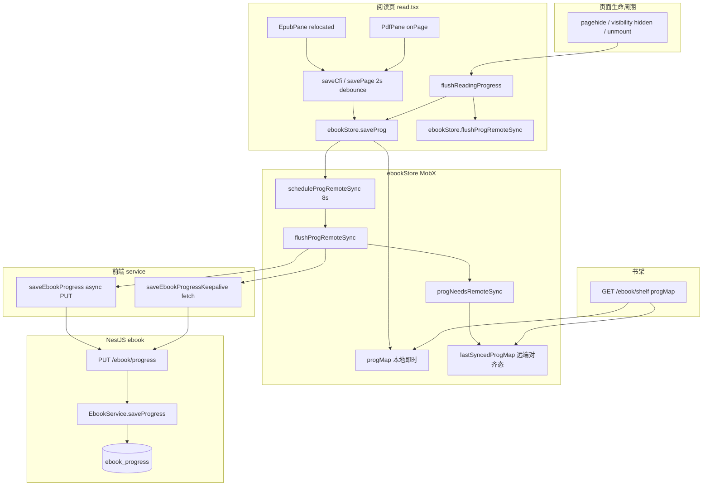
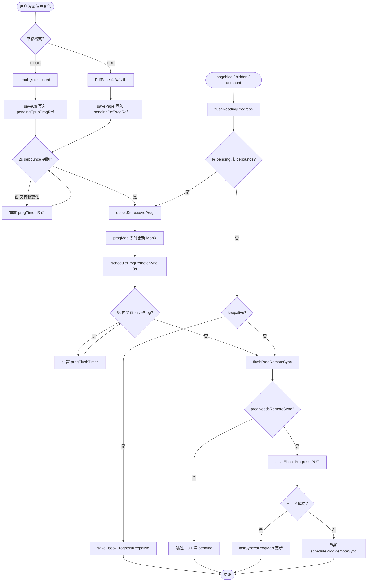
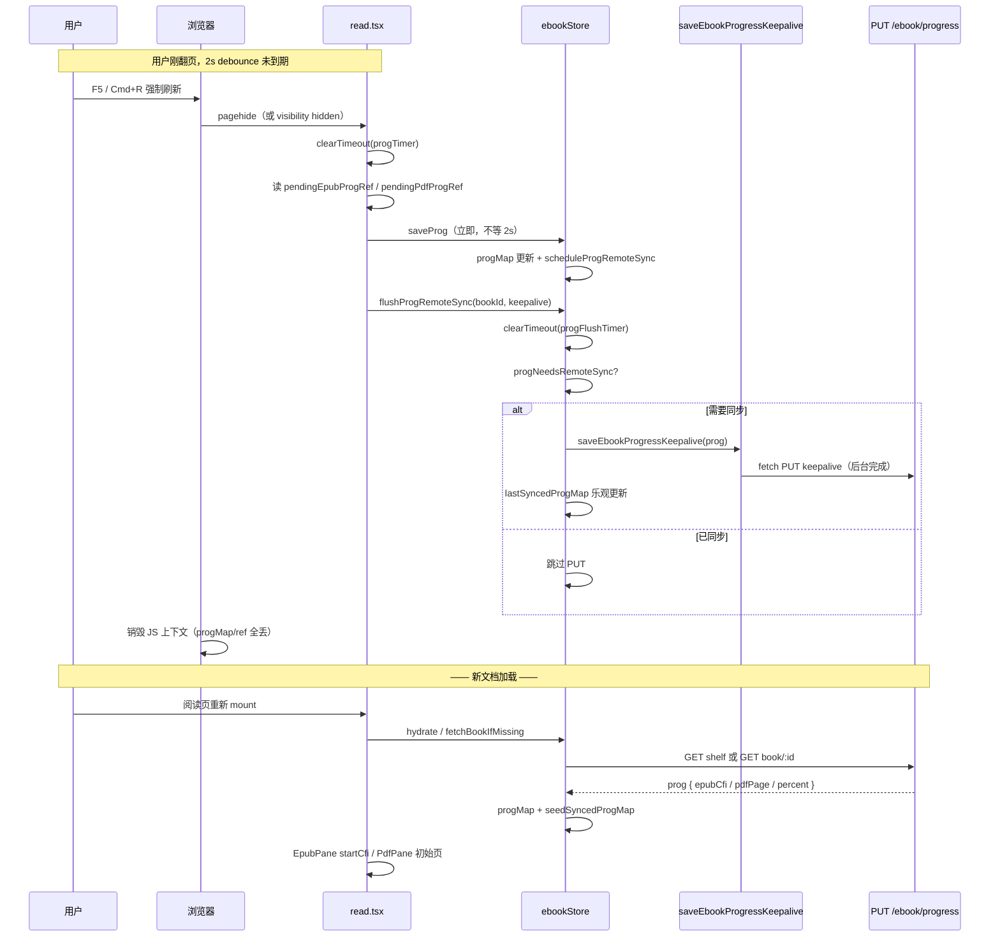
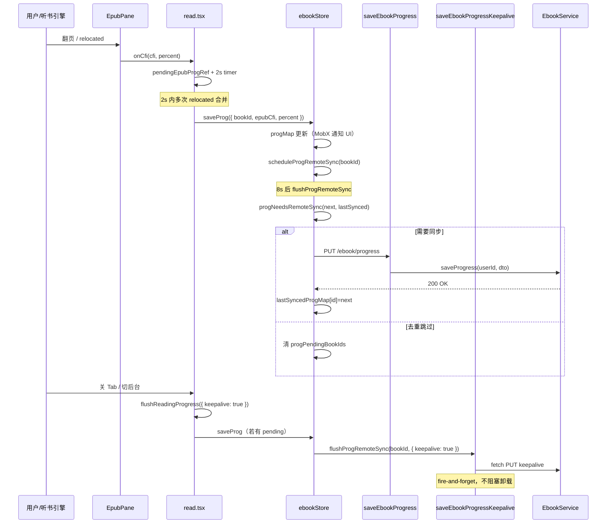
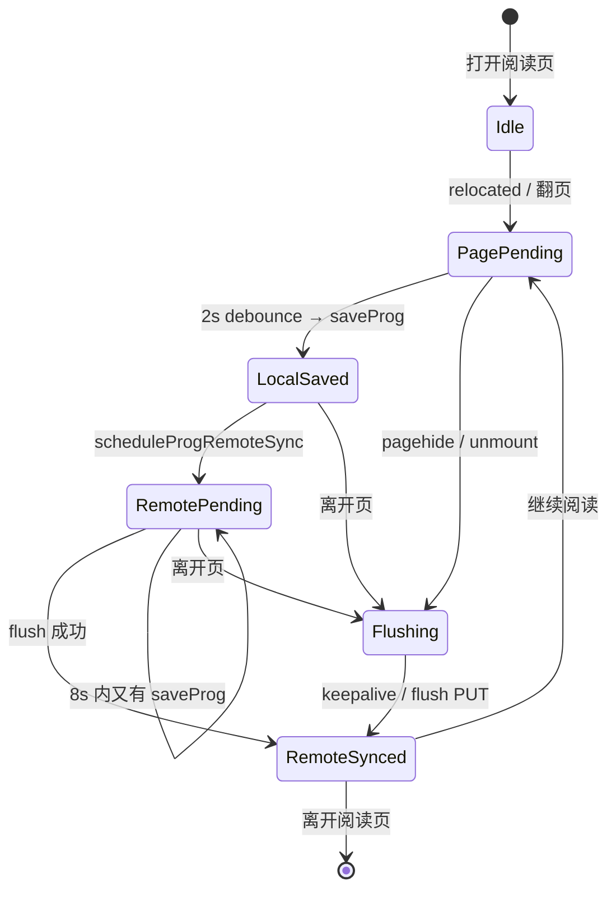

# 电子书阅读进度保存 — 实现思路

> **状态**：已实现（本文梳理 **功能逻辑** 与分层设计，供 onboarding / 复刻 / 扩展参考）  
> **日期**：2026-07-01  
> **需求摘要**：用户在 EPUB/PDF 阅读页翻页、滚动或听书时，**本地即时**记住续读位置，**远端**合并防抖写入 `ebook_progress`，离开页时 keepalive 兜底不丢进度。

## 延伸阅读

- [电子书进度远程防抖影响.md](../../ebook/电子书进度远程防抖影响.md) — 远端 8s 防抖 + keepalive flush 实现归档
- [电子书阅读书架.md](../../ebook/电子书阅读书架.md) — 书架与阅读页全链路
- [../impact/电子书进度远程防抖影响.md](../../impact/电子书进度远程防抖影响.md) — 影响面与回归清单
- [EPUB章节听书.md](../../ebook/EPUB章节听书.md) — 听书 `relocated` 高频触发进度的场景

---

## 0. 读本文你将得到什么

- **问题**：翻页/听书会产生极高频位置变化；若每次立刻 `PUT /ebook/progress` 会刷屏、与 TTS 争主线程，关 Tab 时 async 请求易被中断。
- **一句话方案**：**三层节流**——阅读页 2s debounce → Store 本地 `progMap` 即时更新 → Store 8s 远端 debounce + 去重；**离开页** flush pending 并 `fetch keepalive` 上报。
- **主要改动层**：`read.tsx`（触发与 flush）、`ebookStore`（合并与同步态）、`service/index.ts`（PUT API）、后端 `EbookService.saveProgress` + `ebook_progress` 表。
- **数据模型**：`Prog { bookId, epubCfi?, pdfPage?, percent?, updatedAt }`；EPUB 用 CFI，PDF 用页码，共用 `percent` 供书架展示。
- **最大风险**：keepalive PUT 无响应校验；多 Tab 同时读同一本书时 **最后写入胜出**（当前无冲突合并）。
- **强制刷新**：走 `pagehide` / `visibilitychange` / unmount 三条路径，统一调用 `flushReadingProgress({ keepalive: true })`；详见 [§5.1](#51-用户强制刷新时的保存逻辑f5--cmdr--地址栏回车)。

---

## 1. 需求与边界

### 1.1 用户故事

| 角色 | 场景 | 行为 | 期望结果 |
|------|------|------|----------|
| 读者 | EPUB 翻页/滚动 | 阅读 | 同 Tab 再开续读；书架显示进度百分比 |
| 读者 | PDF 翻页 | 阅读 | 记住页码与百分比 |
| 读者 | 听书 | 自动跳句/章 | 不因 `relocated` 刷屏写库，但进度仍 eventual 一致 |
| 读者 | 关 Tab / 切后台 | 离开阅读页 | 最新位置落库，下次打开从服务端恢复 |
| 读者 | **强制刷新**（F5 / Cmd+R / 地址栏回车） | 仍在阅读页但重载文档 | 未到期 debounce 立即落 `progMap` + keepalive PUT；刷新后从服务端 `prog` 续读 |
| 读者 | 书架 | 浏览 | 卡片展示 `progMap[bookId].percent` |

### 1.2 范围

| 在范围内 | 不在范围内（非目标） |
|----------|----------------------|
| EPUB CFI + PDF 页码 + percent | 跨设备实时同步（WebSocket） |
| 登录用户服务端 `ebook_progress` | 未登录本地-only 进度（当前无 token 则远端跳过） |
| 书架 `progMap` 批量拉取 | 阅读时长、每日统计 |
| pagehide / visibility flush | 离线队列 + Service Worker 同步 |

### 1.3 约束与依赖

- **鉴权**：`PUT /ebook/progress` 走 `JwtGuard`；keepalive 请求手动带 `Authorization`。
- **格式互斥**：同一本书 `fmt` 为 `epub` 或 `pdf`；进度字段按格式写入，合并时保留未传字段（`?? prev`）。
- **EPUB 依赖**：epub.js `relocated` 事件 → CFI；`resolveEpubPercent` 需 locations 就绪后才有准确百分比。
- **听书**：`relocated` 频率远高于手动翻页，是远端防抖的主要动机。

---

## 2. 方案总览（一句话 + 要点）

**一句话方案**：阅读组件只负责 **采样位置** 并 **2s debounce** 调用 `ebookStore.saveProg`；Store **立即**更新 MobX `progMap`（UI 可读），**延迟** 8s 批量 `PUT`，并在 **pagehide** 时用 **keepalive** 刷掉 pending。

| # | 设计要点 | 理由 |
|---|----------|------|
| 1 | 页内 `pending*Ref` + 2s timer | 减少 MobX 写入与 `relocated` 风暴 |
| 2 | `saveProg` 合并 patch 写 `progMap` | 书架/阅读页 `progOf` 即时可读 |
| 3 | `scheduleProgRemoteSync` 8s 全局 timer | 合并多本书 pending；听书场景降 HTTP |
| 4 | `progNeedsRemoteSync` 去重 | CFI/page 不变且 percent 差 <0.5% 跳过 PUT |
| 5 | `lastSyncedProgMap` 与本地分离 | 拉书架 seed 后避免重复 PUT |
| 6 | `saveEbookProgressKeepalive` | pagehide 时 async axios 易被掐断 |
| 7 | `flushReadingProgress` 统一出口 | unmount / hidden / pagehide 共用一个 flush |

---

## 3. 现状与复用

| 能力 | 仓库中已有 | 本功能中的用法 |
|------|------------|----------------|
| EPUB 位置事件 | `EpubPane.tsx` `rend.on('relocated', relocate)` | 回调 `onCfi(cfi, percent, spineIndex)` |
| PDF 页变化 | `PdfPane.tsx` `onPage(page, percent)` | 回调 `read.tsx` `savePage` |
| 阅读页 debounce | `read.tsx` `saveCfi` / `savePage` | 2s + `pendingEpubProgRef` / `pendingPdfProgRef` |
| 本地进度 Store | `ebookStore.progMap` | `saveProg` / `progOf` / `seedSyncedProgMap` |
| 远端同步 | `scheduleProgRemoteSync` / `flushProgRemoteSync` | 8s debounce + 失败重调度 |
| HTTP PUT | `saveEbookProgress` | 常规 async PUT |
| 离开页上报 | `saveEbookProgressKeepalive` | `fetch` + `keepalive: true` |
| 书架加载进度 | `GET /ebook/shelf` 返回 `progMap` | `fetchPage` 写入 Store 并 seed sync 态 |
| 单书详情进度 | `getEbookBook` → `prog` | 深链打开时 `fetchBookIfMissing` |
| 后端 upsert | `EbookService.saveProgress` | `(userId, bookId)` 唯一行 upsert |
| 持久化表 | `ebook_progress.entity.ts` | `epub_cfi` / `pdf_page` / `percent` |

**调研结论**：进度保存是 **端到端已有能力**；核心复杂度在 **前端分层防抖** 与 **离开页可靠性**，而非后端业务规则。扩展新触发源（如自动滚动模式）应接入 `saveCfi`/`savePage`，不要绕过 Store 直接 PUT。

---

## 4. 架构图



**图内方法说明**：

| 方法 / 模块入口 | 功能 |
|-----------------|------|
| `saveCfi(cfi, percent?, spineIndex?)` | EPUB `relocated` 入口：更新 ref、写入 pending，2s 后调 `saveProg` |
| `savePage(page, percent?)` | PDF 翻页入口：pending + 2s debounce，同上 |
| `flushReadingProgress(opts?)` | 清页内 timer、flush pending 到 `saveProg`；可选 `keepalive` 远端 flush |
| `saveProg(patch)` | 合并 `progMap[bookId]`（保留未传字段），`runInAction` 更新本地，触发远端 schedule |
| `scheduleProgRemoteSync(bookId)` | 标记 pending 集合，8s 单次 timer 后调 `flushProgRemoteSync` |
| `flushProgRemoteSync(bookId?, opts?)` | 遍历 pending：去重后 PUT 或 keepalive；成功更新 `lastSyncedProgMap` |
| `progNeedsRemoteSync(next, lastSynced?)` | 比较 CFI/page/percent（0.5% 阈值），决定是否发 HTTP |
| `seedSyncedProgMap(map)` | 拉书架后把服务端进度视为已同步，避免立即重复 PUT |
| `saveEbookProgress(prog)` | axios `PUT /ebook/progress`，常规路径 |
| `saveEbookProgressKeepalive(prog)` | 原生 `fetch` + `keepalive`，pagehide 专用 fire-and-forget |
| `EbookService.saveProgress(userId, dto)` | 校验书籍归属，upsert `ebook_progress` 行 |
| `progOf(bookId)` | 阅读页/书架读本地 `progMap` |

**读图要点**：

- **本地**（`progMap`）与 **远端对齐态**（`lastSyncedProgMap`）分离，是「即时 UI + 合并 PUT」的关键。
- 阅读页只调 Store，**不直接** HTTP；离开页走 `flushReadingProgress` 统一收口。
- 书架 `GET` 是进度 **恢复** 主入口；单书 `getEbookBook` 补深链场景。

---

## 5. 主流程图



**图内方法说明**：

| 方法 | 功能 |
|------|------|
| `saveCfi` / `savePage` | 页内第一层防抖，降低 `saveProg` 调用频率 |
| `saveProg` | 本地真相源更新 + 注册远端 pending |
| `scheduleProgRemoteSync` | 第二层防抖（8s），合并听书高频 relocated |
| `progNeedsRemoteSync` | 第三层去重，避免 CFI 不变时重复 PUT |
| `flushReadingProgress({ keepalive })` | 离开页：先补写 pending，再强制远端 flush |
| `saveEbookProgressKeepalive` | keepalive 路径不 await，专供 pagehide |

**读图要点**：

- 三条 **防抖/去重** 串联：2s（页）→ 8s（Store）→ 语义去重（CFI/page/percent）。
- **失败重试**：远端 PUT catch 后重新 `scheduleProgRemoteSync`，不丢 pending 标记。
- **离开页** 必须走 `flushReadingProgress`，否则 2s 内 pending 会丢。

---

## 5.1 用户强制刷新时的保存逻辑（F5 / Cmd+R / 地址栏回车）

强制刷新会 **销毁当前 JS 上下文**（MobX `progMap`、页内 pending ref、8s 远端 timer 全部丢失），因此必须在 **页面卸载窗口** 内把「尚未写入服务端」的位置推出去。实现上 **不监听 `beforeunload`**（无法可靠发 async 请求），而是依赖三条等价入口，最终都调用 `flushReadingProgress({ keepalive: true })`。

### 5.1.1 触发入口（为何能拦住刷新）

| 入口 | 注册位置 | 触发时机 | 说明 |
|------|----------|----------|------|
| `window.pagehide` | `read.tsx` `useEffect` | 文档即将卸载（含刷新、关 Tab、前进/后退离开） | **刷新主路径**；`event.persisted === true` 时页面进 bfcache，本逻辑仍会跑 |
| `document.visibilitychange` → `hidden` | 同上 | Tab 切后台、部分浏览器刷新前 | 与 `pagehide` 互补；刷新时两者常先后触发，函数幂等 |
| React `useEffect` cleanup | 同上 `return () => …` | 组件 unmount（路由离开或整页刷新卸载） | 兜底；同样带 `keepalive: true` |

三条路径 **共用同一实现**，重复调用安全：`flushReadingProgress` 会先清 timer、消费 pending ref，再远端 flush；Store 侧 `progNeedsRemoteSync` 去重，已同步则跳过 PUT。

### 5.1.2 `flushReadingProgress` 逐步做了什么

刷新瞬间的执行顺序（`read.tsx`）：

```text
1. clearTimeout(progTimer)           // 取消页内 2s debounce，避免卸载后 timer 泄漏
2. 若 pendingEpubProgRef 有值：
     pendingEpubProgRef = null
     ebookStore.saveProg({ epubCfi, percent })   // 立刻写入 MobX progMap
3. 若 pendingPdfProgRef 有值：
     pendingPdfProgRef = null
     ebookStore.saveProg({ pdfPage, percent })
4. ebookStore.flushProgRemoteSync(book.id, { keepalive: true })
```

Store 侧 `flushProgRemoteSync`（keepalive 分支）：

```text
1. clearTimeout(progFlushTimer)      // 取消 8s 远端 debounce
2. 取 progMap[bookId] 与 lastSyncedProgMap[bookId] 比较
3. progNeedsRemoteSync 为 false → 清 pending，不发 HTTP（服务端已有）
4. 需要同步 → saveEbookProgressKeepalive(prog)
     fetch PUT + keepalive: true + Authorization Bearer
     同步更新 lastSyncedProgMap（乐观，不等响应）
     清 progPendingBookIds
```

**为何必须 keepalive**：常规 `saveEbookProgress` 走 axios async PUT，刷新时 in-flight Promise 会被浏览器 **直接掐断**；`fetch(..., { keepalive: true })` 允许在 pagehide 后由浏览器 **后台完成短请求**（fire-and-forget，不 await）。

### 5.1.3 分场景：刷新前用户处于什么状态

| 场景 | 距上次翻页 | 页内 2s | Store 8s | 刷新时行为 | 服务端结果 |
|------|------------|---------|----------|------------|------------|
| **A** 刚翻页 | &lt; 2s | pending 在 ref，**未进** `progMap` | 可能未 schedule | flush **先** `saveProg` 写本地，再 keepalive PUT | ✅ 最新 CFI/页码 |
| **B** 翻页后停读 | ≥ 2s，&lt; 8s | 已在 `progMap` | pending 未 flush | 无页内 pending；keepalive PUT `progMap` 最新值 | ✅ 最新 |
| **C** 长时间阅读 | ≥ 8s 且已 flush | 已在 `progMap` | 已同步 | `progNeedsRemoteSync` → false，**跳过 PUT** | ✅ 已有（无多余请求） |
| **D** 听书连续跳句 | 持续 &lt; 2s 间隔 | ref 始终被覆盖为 **最后** 位置 | 8s timer 不断重置 | flush 写入 **最后一次** pending | ✅ 关页前最后一句 |
| **E** 未登录 | 任意 | 本地可能已更新 | — | keepalive 检测无 token，**跳过远端** | ❌ 云进度不更新 |

场景 **A** 是强制刷新最容易丢进度的窗口（若无 flush）：用户翻页后 2s 内按 F5，改前 pending 只活在 ref 里，整页重载后 ref 消失。当前实现 **显式把 ref 内容同步进 `saveProg`**，再 keepalive 上报。

### 5.1.4 强制刷新专项时序



### 5.1.5 刷新后如何恢复续读

强制刷新后 **内存态全部丢失**，续读完全依赖 **上一轮 keepalive 是否成功写入 DB**：

1. **加载书籍**：`read.tsx` 根据 URL `bookId` 调 `ebookStore.fetchBookIfMissing`（或书架已 hydrate 的 `progMap`）。
2. **拉进度**：`GET /ebook/book/:id` 返回 `prog`；书架全量刷新时 `GET /ebook/shelf` 的 `progMap` 亦可命中。
3. **渲染定位**：
   - EPUB：`EpubPane` 的 `startCfi={prog?.epubCfi}` 打开 rendition；若进度晚到，用 `lateStartCfiAppliedRef` 补跳而不重载整书。
   - PDF：`PdfPane` 用 `prog?.pdfPage` 作为初始页。
4. **seed 同步态**：`fetchBookIfMissing` 写入 `progMap` 同时设置 `lastSyncedProgMap`，避免刚恢复又重复 PUT。

因此 AC1「翻到中间 → 刷新 → 从相近 CFI 打开」的验收，本质是 **keepalive PUT 成功 + GET 恢复** 的组合；不是依赖刷新前内存里的 `progMap`。

### 5.1.6 强制刷新 vs 关 Tab vs 路由离开

| 行为 | pagehide | visibility hidden | unmount cleanup | keepalive | 刷新后 |
|------|----------|-------------------|-----------------|-----------|--------|
| **F5 / Cmd+R** | ✅ | 通常 ✅ | ✅ | ✅ | 同 URL 重载，GET 恢复 |
| **关 Tab** | ✅ | 可能 ✅ | ✅ | ✅ | 用户再开，GET 恢复 |
| **切到其他路由**（不刷新） | ❌ | 视情况 | ✅ | ✅ | `progMap` 仍在内存，书架即时可见 |
| **切 Tab 到后台**（不关闭） | ❌ | ✅ | ❌ | ✅ | 回到 Tab 继续读，内存 progMap 仍在 |

路由 SPA 内离开阅读页 **不会** 触发 `pagehide`，但 **会** 走 unmount cleanup，同样 `flushReadingProgress({ keepalive: true })`。

### 5.1.7 已知边界（强制刷新专项）

| 边界 | 后果 | 用户感知 |
|------|------|----------|
| keepalive PUT 被浏览器丢弃或网络失败 | DB 仍是 **上一次成功 PUT** 的位置 | 刷新后续读偏旧（差最多 ~8s + 2s 阅读距离） |
| 硬杀进程 / 崩溃 | 无 `pagehide`，来不及 flush | 回退到上次成功远端进度 |
| 未登录无 token | 本地 flush 仍写 `progMap`，但 keepalive 直接 return | 刷新后 GET 无个人进度 |
| keepalive 无响应校验 | `lastSyncedProgMap` 乐观更新 | 仅影响同 Tab 内去重，不影响刷新后 GET |
| `pagehide` + cleanup **双调** flush | 第二次 `progNeedsRemoteSync` 为 false | 无重复 PUT，无害 |
| bfcache（前进/后退缓存） | `pagehide` 仍触发；若页面被缓存后恢复，内存 progMap 可能仍在 | 与强制刷新路径不同，但 flush 逻辑相同 |

**设计取舍**：强制刷新场景优先 **尽力上报**（keepalive + 消费 pending），而非阻塞卸载等 PUT 完成——阻塞会导致刷新卡顿，且浏览器仍可能超时掐断。

---

## 6. 核心时序图



**图内方法说明**：

| 方法 | 功能 |
|------|------|
| `relocate(loc)` | EpubPane 内：`loc.start.cfi` + `resolveEpubPercent` → 调 `onCfiRef` |
| `saveCfi` | 阅读页 debounce 边界，唯一应调用 `saveProg` 的 EPUB 入口 |
| `saveProg` | Store 写本地 + 触发远端 schedule |
| `flushProgRemoteSync(bookId, { keepalive })` | 同步路径 await PUT；keepalive 路径同步写 lastSynced 不发 Promise |
| `saveProgress(userId, dto)` | 后端 upsert：校验 `book.userId`，merge 字段后 `progRepo.save` |

**读图要点**：

- Happy path 展示 **两次 debounce** 后才出现 HTTP；听书时 relocated 很多，但 PUT 稀疏。
- **恢复进度**：开书时 `prog?.epubCfi` → `EpubPane startCfi`；晚到进度用 `lateStartCfiAppliedRef` 补跳，不重载整书。
- keepalive 路径 **不等待** 响应，依赖浏览器在 pagehide 窗口内完成短请求。

---

## 7. 状态：进度同步生命周期



**图内方法说明**：

| 方法 | 功能 |
|------|------|
| `flushReadingProgress` | 任意状态离开页时的 **强制迁移** 到已保存/已同步 |
| `progPendingBookIds` | 标记哪些 bookId 仍有未 flush 远端 |

**读图要点**：

- **LocalSaved** 与 **RemoteSynced** 可长期分离（用户连续阅读 8s 内仅本地更新）。
- **Flushing** 必须处理 **PagePending**（2s 未到期的 pending）。

---

## 8. 模块职责与接口草图

### 8.1 模块一览

| 模块 | 职责 | 新增/改动 | 路径 |
|------|------|-----------|------|
| EpubPane | 监听 `relocated`，计算 CFI/percent | 已有 | `views/ebook/components/reader/EpubPane.tsx` |
| PdfPane | 页码变化回调 | 已有 | `views/ebook/components/reader/PdfPane.tsx` |
| read.tsx | 2s debounce、生命周期 flush | 已有 | `views/ebook/read.tsx` |
| ebookStore | progMap、远端 schedule/flush、去重 | 已有 | `store/ebook.ts` |
| service | PUT + keepalive | 已有 | `service/index.ts` |
| EbookService | upsert 进度 | 已有 | `backend/.../ebook.service.ts` |
| EbookProgress 实体 | DB 行 | 已有 | `ebook-progress.entity.ts` |

### 8.2 关键接口（草图）

```typescript
// types.ts
type Prog = {
  bookId: string;
  epubCfi?: string;
  pdfPage?: number;
  percent?: number;
  updatedAt: string;
};

// ebookStore
saveProg(patch: Omit<Prog, 'updatedAt'>): void;
flushProgRemoteSync(bookId?: string, opts?: { keepalive?: boolean }): Promise<void>;
progOf(bookId: string): Prog | undefined;

// read.tsx
saveCfi(cfi: string, percent?: number, spineIndex?: number): void;
savePage(page: number, percent?: number): void;
flushReadingProgress(opts?: { keepalive?: boolean }): void;

// backend DTO
class SaveEbookProgressDto {
  bookId: string;
  epubCfi?: string;
  pdfPage?: number;
  percent?: number; // 0–100
}
```

### 8.3 数据模型

| 字段/实体 | 来源 | 存储 | 说明 |
|-----------|------|------|------|
| `progMap` | `saveProg` / 书架 GET | MobX 内存 | 同 Tab UI 真相源 |
| `lastSyncedProgMap` | PUT 成功 / seed | MobX 内存 | 远端去重基准 |
| `pendingEpubProgRef` | relocated | React ref | 2s debounce 缓冲 |
| `ebook_progress.epub_cfi` | PUT body | PostgreSQL | EPUB 续读定位 |
| `ebook_progress.pdf_page` | PUT body | PostgreSQL | PDF 续读页码 |
| `ebook_progress.percent` | 前端计算 | PostgreSQL | 书架百分比展示 |

---

## 9. 分阶段实现步骤（已实现对照）

| 阶段 | 目标 | 交付物 | 状态 |
|------|------|--------|------|
| M1 | 基础进度 API + Store | `saveProg` + `PUT /ebook/progress` + `progMap` | ✅ |
| M2 | EPUB/PDF 阅读页采样 | `saveCfi` / `savePage` + Pane 回调 | ✅ |
| M3 | 书架展示与恢复 | shelf `progMap`、`startCfi` / PDF 初始页 | ✅ |
| M4 | 听书降噪 + 离开页 | 8s 远端 debounce、keepalive、2s 页内 debounce | ✅ |

### 若扩展新能力（参考任务）

- [ ] 未登录本地 `localStorage` 进度（需定义与登录 merge 策略）
- [ ] 多 Tab 冲突：版本号 / `updatedAt` 乐观锁
- [ ] keepalive 失败 telemetry 或 Beacon 降级
- [ ] 阅读时长字段（需 DB 迁移）

---

## 10. 关键决策与备选方案

| 决策 | 选用 | 备选 | 为何不选备选 |
|------|------|------|--------------|
| EPUB 定位 | CFI | spine index + offset | CFI 为 epub.js 标准，支持精确到字 |
| 本地更新 | 即时 `progMap` | 与远端同时 debounce | 书架/同 Tab 续读需即时读 |
| 远端频率 | 8s + 去重 | 每次 saveProg PUT | 听书 relocated 极高频 |
| 离开页 | fetch keepalive | axios PUT | pagehide 会掐断 in-flight Promise |
| 页内 debounce | 2s 独立 timer | 仅 Store 8s | 减少 MobX 写入与中间态 |
| 进度合并 | patch `?? prev` | 全量覆盖 | EPUB/PDF 字段互斥，避免误清空 |
| 同步态 | `lastSyncedProgMap` | 比对 `updatedAt` | 服务端 DTO 与本地结构一致即可比较 |

---

## 11. 风险、边界与待确认

| 项 | 等级 | 说明 | 缓解 |
|----|------|------|------|
| keepalive 无确认 | 中 | 关 Tab 后不知 PUT 是否成功 | 下次打开从服务端拉；本地 progMap 仍在 |
| 多 Tab 同书 | 中 | 两 Tab 各自 saveProg，最后 PUT 胜出 | 待确认是否需要版本号 |
| 2s pending 崩溃 | 低 | 硬杀进程来不及 flush | 依赖上次已成功 PUT 的位置 |
| percent 精度 | 低 | locations 未就绪时 percent 可能不准 | CFI 仍为续读主依据 |
| Web 无 token | 低 | keepalive/PUT 均跳过 | 产品设计：需登录才云同步 |

**待确认**：

- [ ] 是否需要在 `saveProgress` 返回冲突时做 **LWW vs 客户端合并**（验证：双 Tab 同时阅读同一 EPUB）

---

## 12. 验收清单

| # | 用例 | 步骤 | 期望 |
|---|------|------|------|
| AC1 | EPUB 续读 | 翻到中间位置 → **强制刷新**（F5） | 从相近 CFI 打开（见 [§5.1](#51-用户强制刷新时的保存逻辑f5--cmdr--地址栏回车)） |
| AC1b | EPUB 续读 | 翻到中间位置 → 刷新页面 | 从相近 CFI 打开 |
| AC2 | PDF 续读 | 翻到第 N 页 → 退出再进 | 落在第 N 页 |
| AC3 | 书架进度 | 阅读后回书架 | 卡片显示更新 percent |
| AC4 | 听书不写爆 Network | 听书 1 分钟 | PUT 次数显著少于 relocated 次数 |
| AC5 | 关 Tab | 翻页后 1s 内关 Tab | 再开仍接近关前位置（keepalive） |
| AC5b | **强制刷新** | 翻页后 **1s 内** F5（&lt; 2s 页内 debounce） | 刷新后仍接近关前位置（pending → saveProg → keepalive） |
| AC6 | 去重 | 同一 CFI 重复 saveProg | 无多余 PUT |
| AC7 | 换账号 | 切换用户 | `resetOnUserSwitch` 清空 progMap |

---

## 13. 预估改动面（维护 / 扩展参考）

| 类型 | 路径 |
|------|------|
| 阅读页触发 | `apps/frontend/src/views/ebook/read.tsx` |
| 渲染 Pane | `EpubPane.tsx`, `PdfPane.tsx` |
| Store | `apps/frontend/src/store/ebook.ts` |
| API | `apps/frontend/src/service/index.ts` |
| 类型 | `apps/frontend/src/views/ebook/types.ts` |
| 后端 | `ebook.controller.ts`, `ebook.service.ts`, `ebook-progress.entity.ts`, `save-ebook-progress.dto.ts` |
| 文档归档 | `docs/ebook/电子书进度远程防抖影响.md` |

---

（本文档为 **功能逻辑梳理**；实现细节与 diff 注释见 `docs/ebook/电子书进度远程防抖影响.md`。）
