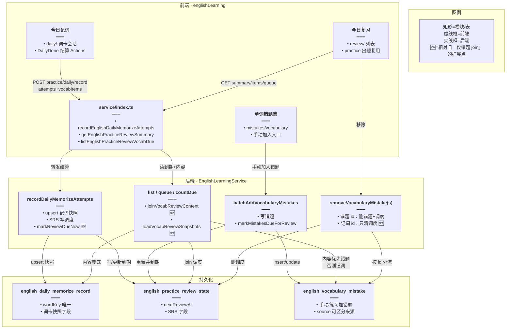
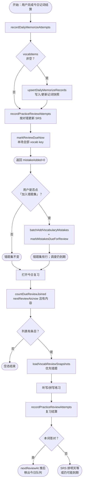
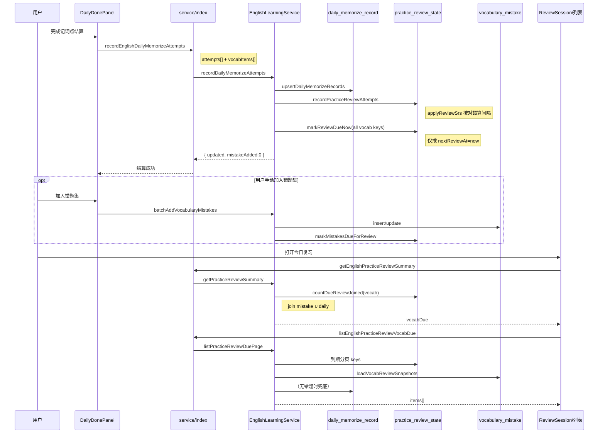
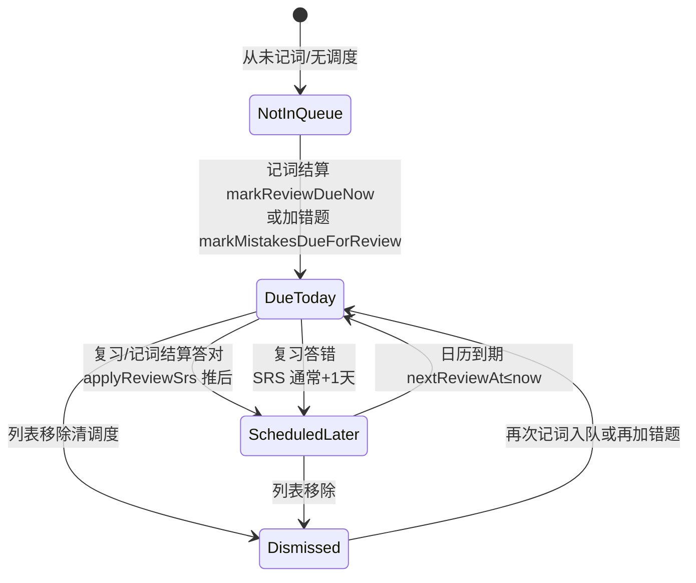

# 今日记词与今日复习 — 实现思路

> **状态**：核心已落地  
> **日期**：2026-09-24  
> **需求摘要**：今日记词从词汇库抽词练习并落记词快照；本场练过的词全部进入「今日复习」调度，但不自动写入错题集；今日复习列表/出题内容优先错题快照、否则记词快照。

## 延伸阅读

- 练习多轮结算与报告续练：[练习多轮结算与报告续练.md](./练习多轮结算与报告续练.md)
- 练习题量上限：`ENGLISH_PRACTICE_SESSION_MAX` ↔ [练习题量上限对齐.md](./练习题量上限对齐.md)
- 复习/错题导出 Word：[英语学习DOCX导出.md](./英语学习DOCX导出.md)
- 前端：`apps/frontend/src/views/englishLearning/daily/`、`review/`、`sidebar/components/DailySession.tsx`、`ReviewSession.tsx`
- 后端：`apps/backend/src/services/english-learning/english-learning.service.ts`（daily / review 段）
- 实体：`english-daily-memorize-record.entity.ts`、`english-practice-review-state.entity.ts`、`english-vocabulary-mistake.entity.ts`
- SRS：`english-practice-review.srs.ts`

---

## 0. 读本文你将得到什么

- **问题**：记词结算曾自动写错题；停自动写错题后又只让答错词进今日复习——与「今日练过的词都应可复习」不符。
- **一句话方案**：结算写记词快照 + SRS；`markReviewDueNow` 把本场全部 vocab key 到期；列表/队列 `review_state ⋈ (mistake ∪ daily_record)`，内容优先错题。
- **改动层**：后端结算与 join；前端仍用结算「加入错题集」手动入库；错题集与复习解耦。
- **阶段**：M1～M3 已落地（见 §9）。
- **最大风险**：改逻辑前已结算场次不会回填；移除记词 id 只清调度不删记录，需与错题移除语义区分。

---

## 1. 需求与边界

### 1.1 用户故事

| 角色 | 场景 | 行为 | 期望结果 |
|------|------|------|----------|
| 学习者 | 今日记词打完一场（有对有错） | 打开侧栏今日复习 | 本场**全部**词进入待复习数量/列表 |
| 学习者 | 同上 | 打开单词错题集 | **不会**仅因结算自动出现本场词 |
| 学习者 | 结算点「加入错题集」 | 确认加入 | 错题集出现；今日复习仍可练同一词（内容用错题快照） |
| 学习者 | 今日复习练对某词并结算 | 刷新列表 | 该词移出「今日」队列（SRS 往后排） |
| 学习者 | 今日复习移除仅记词来源的项 | 点移除 | 调度删除；记词记录仍在；错题集无变化 |

### 1.2 范围

| 在范围内 | 不在范围内（非目标） |
|----------|----------------------|
| 今日记词队列 / 结算 / 记词记录页 | 记词自动写入错题集 |
| 今日复习 summary / 列表 / 出题队列 / 复习结算 | 语句（classic）靠记词表（classic 仍只 join 错题） |
| 复习内容双源：错题 ∪ 记词快照 | 新建「复习专用内容表」 |
| 移除：错题 id 删错题+调度；记词 id 只清调度 | 改 SRS 间隔公式本身 |

### 1.3 约束与依赖

- 须登录；用户级隔离 `userId`。
- 单场硬顶 `ENGLISH_PRACTICE_SESSION_MAX`。
- 复用练习侧 SRS（`applyReviewSrs`）与错题列表 UI 同构字段，便于卡片/移除/导出。
- Ponytail：不新增 poolTotal 专用表；内容复用已有两张快照表。

---

## 2. 方案总览（一句话 + 要点）

**一句话方案**：调度表决定「何时练」；记词结算入队全部本场词；内容表（错题优先，否则记词）决定「练什么」；错题集仅手动加入。

| # | 设计要点 | 理由 |
|---|----------|------|
| 1 | `english_practice_review_state` 管到期 | 与错题/记词内容解耦，答对可推迟 |
| 2 | `recordDailyMemorizeAttempts`：快照 + SRS + `markReviewDueNow(全部 vocab key)` | 对错都进今日复习，且不重置答对进度 |
| 3 | `mistakeAdded` 恒为 0；错题走 `batchAddVocabularyMistakes` | 产品：「要复习，不要自动错题」 |
| 4 | join：`leftJoin` mistake + daily，`OR` 有一侧即可 | 无错题也能展示/出题 |
| 5 | `loadVocabReviewSnapshots`：先 daily 再 mistake 覆盖 | 有错题时 id/释义跟错题集一致 |
| 6 | `markMistakesDueForReview` 仍用于**手动加错题**等路径 | 新错重置间隔；与记词入队的「只拨到期」分离 |

---

## 3. 现状与复用

| 能力 | 仓库中已有 | 本需求中的用法 |
|------|------------|----------------|
| 记词 UI / 多轮结算 | `daily/index.tsx`、`DailyDonePanel`、`components/result` | **直接复用**；结算调 `recordEnglishDailyMemorizeAttempts` |
| 侧栏统计 | `DailySession.tsx`、`ReviewSession.tsx` | **复用** summary API |
| 复习列表页 | `review/index.tsx`（错题列表壳） | **复用**；数据源改为 due items |
| 记词快照表 | `EnglishDailyMemorizeRecord` | **扩展为**复习内容兜底 |
| 错题表 | `EnglishVocabularyMistake` | **可选**内容源；手动入库 |
| 调度 + SRS | `EnglishPracticeReviewState`、`applyReviewSrs` | **复用**；记词后额外 `markReviewDueNow` |
| HTTP | `apps/frontend/src/service/index.ts` | `getEnglishPracticeReviewSummary` / `recordEnglishDailyMemorizeAttempts` 等 |

**调研结论**：队列、列表、导出、移除 API 骨架已存在；缺口仅是「停自动错题后内容与入队语义」。经典句复习仍只绑错题表，本次不改。

---

## 4. 架构图



**图内方法说明**：

| 方法 | 功能 |
|------|------|
| `recordEnglishDailyMemorizeAttempts(payload)` | 前端结算封装：提交 `attempts` + `vocabItems`；期望 `mistakeAdded===0` |
| `recordDailyMemorizeAttempts(userId, dto)` | 编排记词结算：快照 → SRS → 本场全部 key 到期；不写错题表 |
| `upsertDailyMemorizeRecords(...)` | 按 wordKey upsert 记词快照（释义/例句等） |
| `recordPracticeReviewAttempts(...)` | 按对错调用 `applyReviewSrs` 更新调度行 |
| `markReviewDueNow(userId, kind, keys)` | 仅把 `nextReviewAt` 拨到现在，保留 repetitions/interval |
| `markMistakesDueForReview(...)` | 错题入库路径：到期并重置间隔/lastResult=wrong |
| `getEnglishPracticeReviewSummary()` | 拉 `vocabDue`/`classicDue` 供侧栏 |
| `joinVocabReviewContent(qb)` | 调度 leftJoin 错题∪记词，要求至少一侧有行 |
| `loadVocabReviewSnapshots(userId, keys)` | 组装展示快照；mistake 覆盖 daily |
| `listPracticeReviewDuePage` / `getPracticeReviewQueue` / `countDueReviewJoined` | 列表、出题、计数共用 join 语义 |
| `batchAddVocabularyMistakes(...)` | 手动/练习批量写错题并到期 |
| `removeVocabularyMistake` / `removeVocabularyMistakesBatch` | 错题 id 删内容+调度；记词 id 只清调度 |

**读图要点**：

- 前端三入口（记词 / 复习 / 错题）共用一张调度表，内容源分叉。
- 🆕 相对旧实现：记词结算不再写错题；复习 join 增加记词表；移除支持记词 id。
- 错题集与今日复习无强制 1:1：可复习而无错题行。

---

## 5. 主流程图



**图内方法说明**：

| 方法 | 功能 |
|------|------|
| `recordDailyMemorizeAttempts` | 记词结算总入口；保证入复习、不入错题 |
| `upsertDailyMemorizeRecords` | 持久化本场词卡，供复习无错题时取内容 |
| `recordPracticeReviewAttempts` | 记词与复习共用的 SRS 写回 |
| `markReviewDueNow` | 记词后强制本场词出现在「今日」 |
| `batchAddVocabularyMistakes` | 用户显式加错题 |
| `markMistakesDueForReview` | 新错题重置 SRS 并到期 |
| `countDueReviewJoined` | 侧栏/列表 total |
| `loadVocabReviewSnapshots` | 渲染卡片字段与移除用 id |

**读图要点**：

- 入口是记词结算；错题是可选旁路。
- 「今日」可见性 = 调度到期 ∧（错题或记词有快照）。
- 复习答对靠 SRS 离开今日，而不是删记词记录。

---

## 6. 核心时序图



**图内方法说明**：

| 方法 | 功能 |
|------|------|
| `recordEnglishDailyMemorizeAttempts` | 前端 POST `/practice/daily/record` |
| `recordDailyMemorizeAttempts` | 后端结算编排 |
| `upsertDailyMemorizeRecords` | 写记词表 |
| `recordPracticeReviewAttempts` | 写 SRS |
| `applyReviewSrs` | 纯函数：对错 → nextReviewAt/interval/reps |
| `markReviewDueNow` | 记词后入「今日」 |
| `batchAddVocabularyMistakes` | 手动错题 |
| `markMistakesDueForReview` | 错题路径重置并到期 |
| `getEnglishPracticeReviewSummary` / `getPracticeReviewSummary` | 侧栏计数 |
| `countDueReviewJoined` | 带内容 join 的到期计数 |
| `listEnglishPracticeReviewVocabDue` / `listPracticeReviewDuePage` | 列表数据 |
| `loadVocabReviewSnapshots` | 拼卡片；mistake 覆盖 daily |

**读图要点**：

- Happy path 无错题表写入；复习仍可读。
- 手动加错题后，同一 wordKey 展示 id 切到错题行。
- 异步仅为普通 HTTP；无 SSE。

---

## 7. （可选）状态机



**图内方法说明**：

| 方法 | 功能 |
|------|------|
| `markReviewDueNow` | 迁入 DueToday（保留进度） |
| `markMistakesDueForReview` | 迁入 DueToday（重置进度） |
| `applyReviewSrs` | DueToday ↔ ScheduledLater 的间隔计算 |
| `removeVocabularyMistake*` | → Dismissed（删调度） |

---

## 8. 模块职责与接口草图

### 8.1 模块一览

| 模块 | 职责 | 新增/改动 | 预估路径 |
|------|------|-----------|----------|
| 记词结算 | 快照+SRS+整场到期 | 改动 | `english-learning.service.ts` `recordDailyMemorizeAttempts` |
| 复习 join | 双源内容 | 改动 | `joinVocabReviewContent` / `loadVocabReviewSnapshots` |
| 移除 | 记词 id 兜底 | 改动 | `removeVocabularyMistake*` |
| 记词/复习 UI | 交互壳 | 复用 | `daily/`、`review/`、sidebar |
| HTTP | 契约 | 复用 | `service/index.ts`、`controller` |

### 8.2 关键接口（草图）

```typescript
// 记词结算契约：只入复习调度，不入错题集
async function recordDailyMemorizeAttempts(
	// 当前登录用户
	userId: number,
	// attempts=对错；vocabItems=词卡快照正文
	dto: { attempts: Attempt[]; vocabItems?: VocabSnap[] },
): Promise<{
	// SRS 更新条数
	updated: number;
	// 产品约定恒为 0，前端勿依赖自动加错题
	mistakeAdded: number;
	mistakeSkipped: number;
}> {
	// 先持久化快照，保证复习 join 有内容兜底
	await upsertDailyMemorizeRecords(userId, dto.vocabItems ?? [], dto.attempts);
	// 再写 SRS，保留对错带来的间隔信息
	const { updated } = await recordPracticeReviewAttempts(userId, dto.attempts);
	// 本场全部词拨到「今日到期」，不重置答对进度
	await markReviewDueNow(userId, 'vocab', vocabKeysFrom(dto.attempts));
	// 明确不写 vocabulary_mistake
	return { updated, mistakeAdded: 0, mistakeSkipped: 0 };
}
```

```typescript
// 复习内容解析：有错题用错题 id，否则用记词 id（供移除）
async function loadVocabReviewSnapshots(
	userId: number,
	keys: string[],
): Promise<Map<string, Snap>> {
	// 先填记词，再让错题覆盖，保证优先错题语义
	const out = new Map<string, Snap>();
	for (const d of await findDaily(userId, keys)) out.set(d.wordKey, fromDaily(d));
	for (const m of await findMistakes(userId, keys)) out.set(m.wordKey, fromMistake(m));
	return out;
}
```

### 8.3 数据模型

| 字段/实体 | 来源 | 存储 | 说明 |
|-----------|------|------|------|
| `english_daily_memorize_record` | 记词结算 | DB | 用户+wordKey 唯一；复习内容兜底 |
| `english_practice_review_state` | 记词/复习/加错题 | DB | `nextReviewAt` 决定是否在「今日」 |
| `english_vocabulary_mistake` | 手动/练习加错题 | DB | 可选内容源；非记词结算副作用 |
| `attempts[].itemKey` | 前端结算 | 请求体 | 与 wordKey 对齐 |

---

## 9. 分阶段实现步骤

| 阶段 | 目标 | 交付物 | 依赖 |
|------|------|--------|------|
| M1 | 停自动加错题 | 结算不再 batchAdd 错题 | — |
| M2 | 复习可读记词快照 | join ∪ loadVocabReviewSnapshots；移除记词 id | M1 |
| M3 | 整场入今日复习 | `markReviewDueNow(全部 key)` | M1–M2 |

### M1

- [x] `recordDailyMemorizeAttempts` 去掉自动写错题；`mistakeAdded=0`
- [x] 结算页保留「加入错题集」手动路径

### M2

- [x] `joinVocabReviewContent`：mistake ∪ daily
- [x] 列表/队列/计数共用 join
- [x] `removeVocabularyMistake*` 支持记词 id 只清调度

### M3

- [x] 本场全部 vocab key `markReviewDueNow`（非仅错题）
- [x] 与 `markMistakesDueForReview`（重置进度）职责分离
- [x] 侧栏/列表验收（见 §12）

---

## 10. 关键决策与备选方案

| 决策 | 选用 | 备选 | 为何不选备选 |
|------|------|------|--------------|
| 复习内容从哪来 | 错题 ∪ 记词快照 | 只读词汇库原表 | 快照保证离线一致性与「练过的版本」 |
| 入今日复习范围 | 本场全部词 | 仅答错 | 产品明确「今日练过的词」 |
| 到期写法 | `markReviewDueNow` 只拨时间 | 复用 `markMistakesDueForReview` | 后者会把答对进度清零并标 wrong |
| 错题 | 仅手动 | 结算自动 | 用户要复习≠要进错题本 |
| 调度与内容 | 分表 | 复习行内嵌全文 | 已有错题/记词表，避免第三份正文 |

---

## 11. 风险、边界与待确认

| 项 | 等级 | 说明 | 缓解 |
|----|------|------|------|
| 历史场次 | 中 | 改逻辑前结算的词可能未入队 | 再打一场记词；或运维回填脚本（未做） |
| 移除语义 | 中 | 记词 id 移除≠删记录 | 文案/验收区分；文档已写清 |
| classic 复习 | 低 | 仍只 join 语句错题 | 范围外；对称需求另开篇 |
| SRS 答错 +1 天 | 低 | 复习答错可能次日才再到期 | 与既有 `applyReviewSrs` 一致；记词结算后会再 DueToday |

**待确认**：

- [ ] 记词「全部答对」是否也必须当日出现在今日复习（当前：**是**，已实现）— 验证：全对结算后看 `vocabDue`
- [ ] 移除记词来源项的按钮文案是否需改为「移出复习」— 验证：产品确认 UI 文案

---

## 12. 验收清单

| # | 用例 | 步骤 | 期望 |
|---|------|------|------|
| AC1 | 整场入复习 | 记词 3～5 词（含对错）结算 → 今日复习 | 数量 ≈ 本场词数（可叠加旧到期） |
| AC2 | 不自动错题 | 结算后打开单词错题集 | 无本场自动新增；`mistakeAdded===0` |
| AC3 | 手动加错题 | 结算「加入错题集」 | 错题出现；复习仍可练；快照优先错题 |
| AC4 | 复习答对移出 | 今日复习练对并结算 → 刷新 | 该词离开今日队列 |
| AC5 | 移除记词源 | 对无错题项点移除 | 复习消失；记词记录仍在 |
| AC6 | 双源 join | Network `GET …/practice/review/items` | 无错题词仍有条目（id 为记词 uuid） |

---

## 13. 预估改动面（实现阶段参考）

| 类型 | 路径（预估） |
|------|--------------|
| 后端 | `apps/backend/src/services/english-learning/english-learning.service.ts`（daily/review/remove） |
| 后端 DTO/实体 | `dto/*`、`entity/english-daily-memorize-record.entity.ts`、`english-practice-review-state.entity.ts`、`english-vocabulary-mistake.entity.ts` |
| 前端 | `daily/*`、`review/*`、`sidebar/components/{Daily,Review}Session.tsx`、`service/index.ts`、`components/result/Actions.tsx` |
| 文档（本文） | `remote-docs/wiki/ideas/english/今日记词与今日复习.md` |

---

（本文档对齐 2026-09-24 已落地语义：整场入今日复习、不自动错题、内容双源；落地细节以源码为准。）
