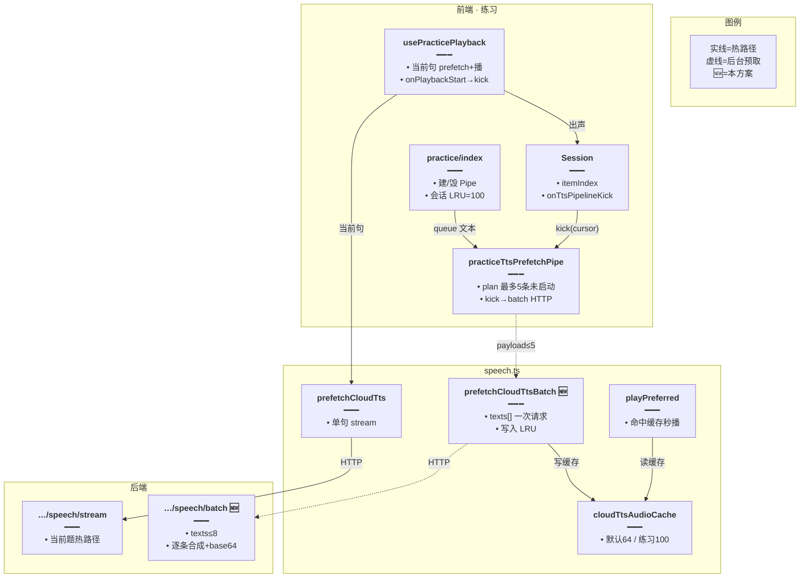
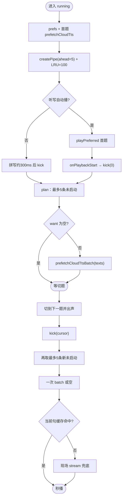
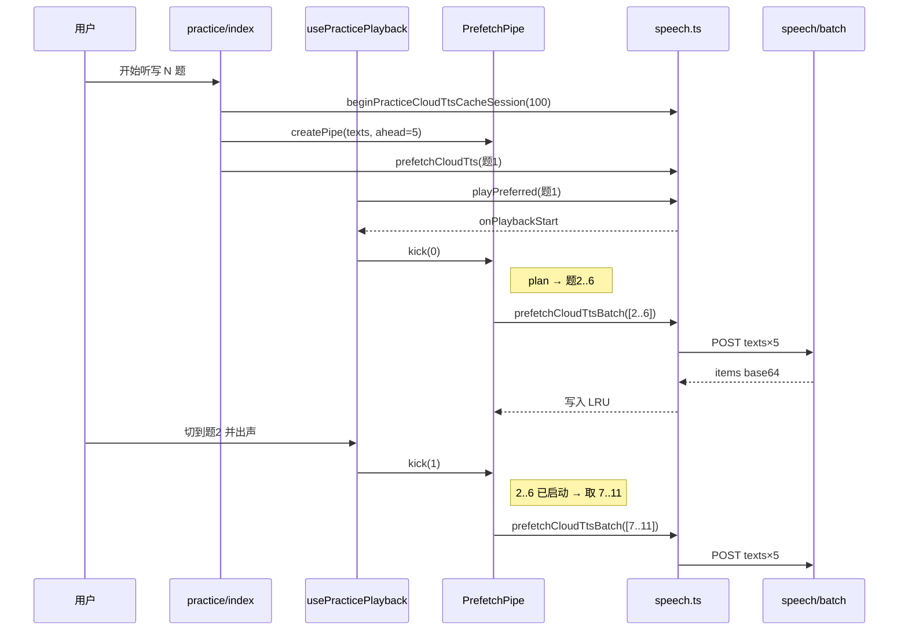
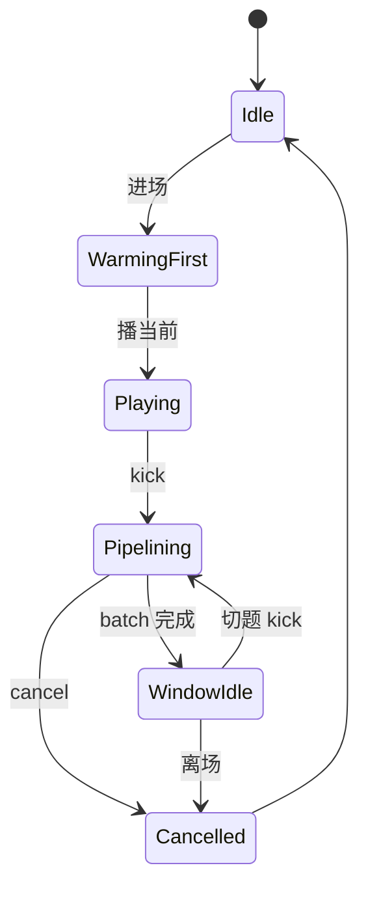

# 听写 TTS 分批预取 — 实现思路

> **状态**：核心已落地  
> **日期**：2026-09-24  
> **需求摘要**：英语听写/拼写首题快出声、切题秒播；用「首题单句 stream + 出声后 texts[] 批量预取（每批 5 条未启动题）」降低接口次数与等待，题量可达 100。

## 延伸阅读

- 云端选路与三源：[`wiki/ideas/tts/讯飞云TTS.md`](../tts/讯飞云TTS.md)
- **服务端合成结果缓存（规划）**：[TTS合成结果缓存.md](../tts/TTS合成结果缓存.md)
- 听书「出声后再预取」：`apps/frontend/src/views/ebook/utils/epub/listen/epubListenPlayUnits.ts`
- 练习播放：`practice/hooks/usePracticePlayback.ts`
- 预取管道：`practice/utils/practiceTtsPrefetchPipe.ts`
- TTS：`utils/speech.ts`（`prefetchCloudTts` / `prefetchCloudTtsBatch` / 会话 LRU）
- 题量硬顶：`PRACTICE_MAX_WORDS = 100` ↔ [练习题量上限对齐.md](./练习题量上限对齐.md)
- 批量端点：`POST …/minimax|xfyun|edge/speech/batch`（`texts[]` → base64 MP3）
- 单句热路径：`POST …/speech/stream`（仅当前题）

---

## 0. 读本文你将得到什么

- **问题**：逐句 `stream` 导致 Network 刷屏、切题仍等合成；整场一次请求伤首播且易超时。
- **一句话方案**：首题独占 stream；`onPlaybackStart` 后 `kick`，每次把最多 **5** 条**尚未预取**的题打进一次 `speech/batch`；会话 LRU 抬到 100。
- **改动层**：前端 Pipe + `prefetchCloudTtsBatch`；后端三源 `speech/batch`；练习 index 建/毁管道。
- **阶段**：M0～M2 已落地；M3 观测可选。
- **最大风险**：把「已预取」也算进窗口会导致切题又变一句一批（已修）；厂商侧仍按句合成，batch 只省 HTTP 往返。

---

## 1. 需求与边界

### 1.1 用户故事

| 角色 | 场景 | 行为 | 期望结果 |
|------|------|------|----------|
| 学习者 | 开一场听写（10～100 题） | 进入第一题 | 尽快出声；不因预取后续抢首包 |
| 学习者 | 首题出声后看 Network | — | 一次 `…/speech/batch`，`texts` 约 5 句 |
| 学习者 | 答完切下一题 | 自动/手动播 | 多已命中缓存；偶发再打下一批 5 句 |
| 学习者 | 中途退出 | 离开 running | Pipe `cancel`；缓存 cap 裁回 |

### 1.2 范围

| 在范围内 | 不在范围内（非目标） |
|----------|----------------------|
| 练习听写/拼写云端预取 | 整场 99 句一次 HTTP |
| `texts[]` batch（≤8，产品用 5） | 厂商真正「一次合成多句」 |
| 首题 stream + 出声后 kick | MiniMax MSE 边下边播 |
| 会话 LRU=100 | 改三连播间隔产品语义 |

### 1.3 约束与依赖

- 单场硬顶 100；batch DTO `TTS_PREFETCH_BATCH_MAX=8`，练习默认 **ahead=5**。
- 后端 batch 内仍逐条 `synthesizeSpeech`（可命中进程内 LRU）。
- 须登录；选路同现有 MiniMax / 讯飞 / Edge。

---

## 2. 方案总览（一句话 + 要点）

**一句话方案**：热路径单句 stream；后台按「未启动题」滑动，每批 5 条一次 `speech/batch` 写入前端 LRU。

| # | 设计要点 | 理由 |
|---|----------|------|
| 1 | 否决整场一次请求 | 伤首播、超时、限流 |
| 2 | **ahead=5**：每次 kick 最多 5 条**未启动** | 产品指定；已启动不计名额 |
| 3 | 出声后再 `kick`（拼写延迟 300ms） | 不与首包抢带宽 |
| 4 | 后端 `speech/batch` + 前端 `prefetchCloudTtsBatch` | Network 一次多句，而非 N 次 stream |
| 5 | 会话 `beginPracticeCloudTtsCacheSession(100)` | 避免默认 LRU=64 挤掉未播项 |
| 6 | 切题再 kick 时取下一批 5 条新题 | 修复「一句一批」回归 |

### 2.1 为何不能「一句一批」

错误窗口算法：已预取也算进 ahead → 切题后窗口只剩 1 条未取 → `texts:["…"]` 单句刷屏。  
正确：`planPrefetchBatch` **跳过** `already`，每次凑满最多 5 条新下标。

### 2.2 墙钟直觉（ahead=5）

| 策略 | 客户端 HTTP 次数（约） | 首播 |
|------|------------------------|------|
| 逐句 stream | ≈N | 易被后续抢 |
| 整场 1 次 99 句 | 1 | 差 |
| **首题 stream + 每批 5 句 batch** | ≈1+⌈(N−1)/5⌉ | 好 |

---

## 3. 现状与复用

| 能力 | 仓库中已有 | 本需求中的用法 |
|------|------------|----------------|
| 当前句预取/播放 | `prefetchCloudTts` / `playPreferred` | **热路径保留** |
| 批量预取 | `prefetchCloudTtsBatch` 🆕 | Pipe 唯一后台入口 |
| 管道 | `createPracticeTtsPrefetchPipe` 🆕 | index 建管，Session kick |
| 会话 LRU | `begin/endPracticeCloudTtsCacheSession` 🆕 | running 抬到 100 |
| batch API | Controller 三源 `speech/batch` 🆕 | texts[] → base64 |
| 听书错开预取 | `epubListenPlayUnits` | 节奏对齐（出声后再预取） |

**调研结论**：厂商无多句一次合成；batch 把 N 次合成收拢到一次 HTTP，调度在前端 Pipe。

---

## 4. 架构图



**图内方法说明**：

| 方法 | 功能 |
|------|------|
| `createPracticeTtsPrefetchPipe(texts,{ahead:5})` | 绑定本场文本；`kick`/`cancel` |
| `planPrefetchBatch` | 从 cursor+1 起跳过已启动，最多取 ahead 条 |
| `prefetchCloudTts` | 单句预取（stream） |
| `prefetchCloudTtsBatch(texts)` | 一次 batch HTTP，结果入 LRU |
| `begin/endPracticeCloudTtsCacheSession` | 练习会话抬/裁 LRU |
| `playPreferred` / `onPlaybackStart` | 出声后触发 kick |
| Controller `*SpeechBatch` | 逐条 synthesize，返回 `{items:[{text,audioBase64}]}` |

**读图要点**：

- 热路径与预取路径分离：stream vs batch。
- Pipe 只发「未启动」题，避免一句一批。
- 后端 batch 不改变厂商按句合成事实。

---

## 5. 主流程图



**图内方法说明**：

| 方法 | 功能 |
|------|------|
| `kick` | 更新 cursor；泵一批未启动题 |
| `planPrefetchBatch` | 选下标 |
| `prefetchCloudTtsBatch` | 发 batch |
| `cancel` | 离场停止 |

**读图要点**：

- 每次 kick **至多一轮**有效 batch（await 中再 kick 会 pending 再补）。
- 切题后仍按「5 条新题」补，而不是补 1 条。

---

## 6. 核心时序图



**图内方法说明**：

| 方法 | 功能 |
|------|------|
| `kick(0)` / `kick(1)` | 滑动补批 |
| `prefetchCloudTtsBatch` | 多句一次 HTTP |
| `POST …/speech/batch` | 服务端逐条合成打包返回 |

**读图要点**：

- 首题不进 batch；后续按 5 条一包。
- 切题 kick 拉的是**下一批新题**，不是重复旧题。

---

## 7. （可选）状态机



**图内方法说明**：

| 方法 | 功能 |
|------|------|
| `kick` | → Pipelining |
| `cancel` | → Cancelled |

---

## 8. 模块职责与接口草图

### 8.1 模块一览

| 模块 | 职责 | 状态 | 路径 |
|------|------|------|------|
| PrefetchPipe | ahead=5、未启动挑选、kick/cancel | 已落地 | `practice/utils/practiceTtsPrefetchPipe.ts` |
| usePracticePlayback | 出声/延迟 kick | 已落地 | `practice/hooks/usePracticePlayback.ts` |
| practice/index | 建管、LRU 会话、传 kick | 已落地 | `practice/index.tsx` |
| prefetchCloudTtsBatch | 三源 batch 客户端 | 已落地 | `utils/speech.ts` |
| speech/batch | 三源批量接口 | 已落地 | `speech-transcription.controller.ts` |

### 8.2 关键接口（草图）

```typescript
// 每次 kick 最多取 ahead 条「未启动」题，避免切题变单句 batch
function planPrefetchBatch(args: {
	cursor: number;
	length: number;
	// 产品默认 5
	ahead: number;
	already: ReadonlySet<number>;
}): number[] {
	// 跳过 already，凑满 ahead 个新下标
	return [];
}

// 一次 HTTP 多句；写入 LRU 供 playPreferred 命中
async function prefetchCloudTtsBatch(texts: readonly string[]): Promise<void> {
	// POST …/speech/batch { texts, ...voiceExtras }
}
```

### 8.3 参数

| 参数 | 值 | 说明 |
|------|-----|------|
| `ahead` | **5** | 每批目标条数 |
| batch DTO max | 8 | 硬顶；练习用 5 |
| 会话 LRU | 100 | 对齐题量硬顶 |

---

## 9. 分阶段实现步骤

| 阶段 | 目标 | 状态 |
|------|------|------|
| M0 | 当前句预取 + 出声 kick | ✅ |
| M1 | Pipe + ahead 未启动语义 | ✅ |
| M2 | `speech/batch` + 会话 LRU=100 | ✅ |
| M3 | 命中率观测 / 慢网降 ahead | 可选 |

### 已完成要点

- [x] `planPrefetchBatch` 跳过 already（修一句一批）
- [x] 默认 ahead=5
- [x] 三源 batch API + `prefetchCloudTtsBatch`
- [x] running 会话缓存扩容与离场 cancel

---

## 10. 关键决策与备选方案

| 决策 | 选用 | 备选 | 为何不选 |
|------|------|------|----------|
| 整场一次 | 否 | texts×99 | 伤首播 |
| 客户端多次 stream | 否（后台） | 并发≤2 stream | Network 仍一句一请求 |
| 窗口批 HTTP | **是，每批 5** | 每批 8 | 产品指定 5 |
| 已启动是否占名额 | **不占** | 占 | 占则切题变单句 |
| 厂商多句合成 | 无 | — | 能力不存在 |

---

## 11. 风险、边界与待确认

| 项 | 等级 | 说明 | 缓解 |
|----|------|------|------|
| 一句一批回归 | 高（已踩） | already 计入 ahead | 已改 plan |
| batch 内串行合成 | 中 | 单次 HTTP 仍可能数秒 | 答题时间掩盖；可后续服务端有限并行 |
| 内存 | 低～中 | 长句×100 | 会话 LRU + 离场裁回 |
| 本机 TTS | 低 | 无 batch | Pipe no-op |

---

## 12. 验收清单

| # | 用例 | 期望 |
|---|------|------|
| AC1 | 首题出声后 Network | 一条 `…/speech/batch`，`texts.length` 约为 5（队尾不足则更少） |
| AC2 | 再切数题 | 偶发下一批 batch（仍约 5 句），非每题 `texts.length===1` |
| AC3 | 切题播放 | 多数命中缓存、几乎无等待 |
| AC4 | 退出练习 | 无新 batch；LRU cap 恢复 |
| AC5 | 断网预取失败 | 播放仍可单句 stream 兜底 |

---

## 13. 预估改动面（已落地路径）

| 类型 | 路径 |
|------|------|
| 前端 | `practiceTtsPrefetchPipe.ts`、`usePracticePlayback.ts`、`practice/index.tsx`、`Session.tsx`、`utils/speech.ts`、`service/api.ts` |
| 后端 | `speech-transcription.controller.ts`、`dto/*-tts-batch.dto.ts`、`dto/tts-batch-texts.dto.ts` |
| 文档 | 本文 |

---

（结论：最优落地 = **首题 stream + 出声后每批 5 条未启动题一次 batch**；切忌把已预取算进窗口。）
