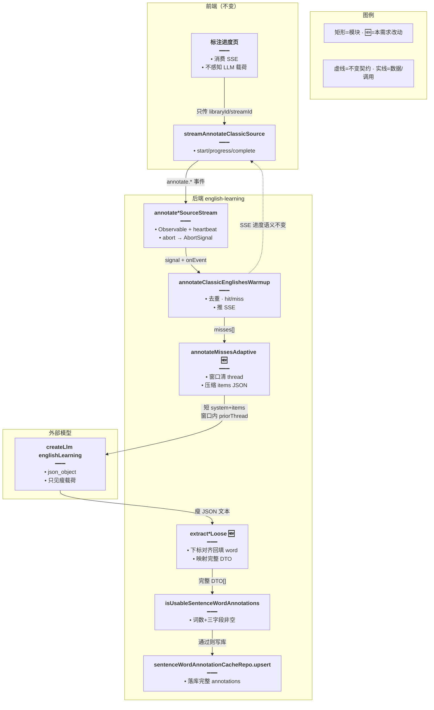
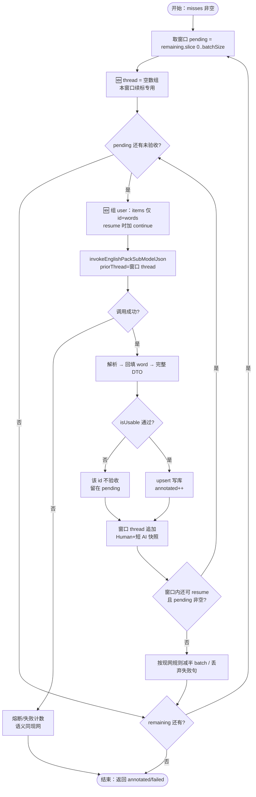
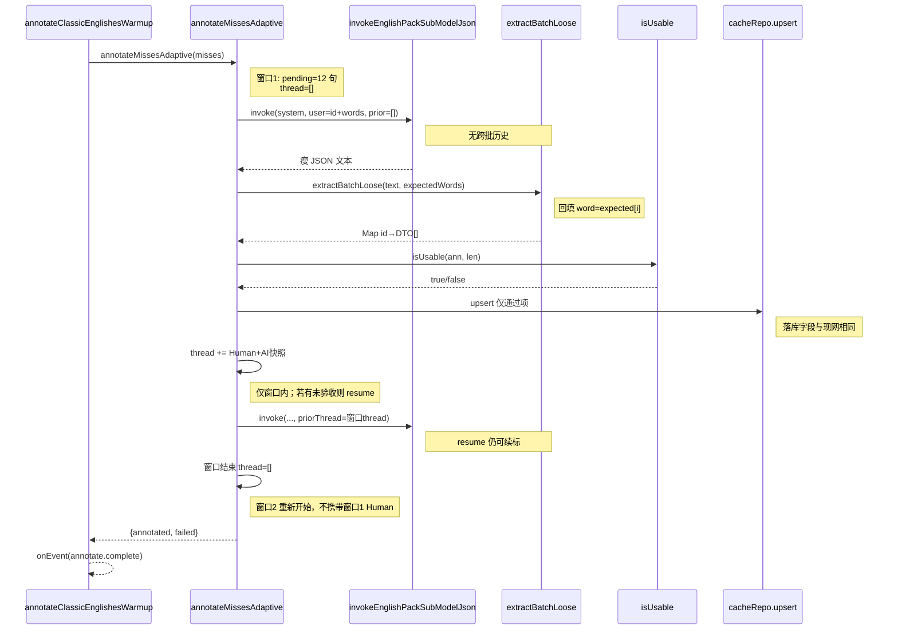
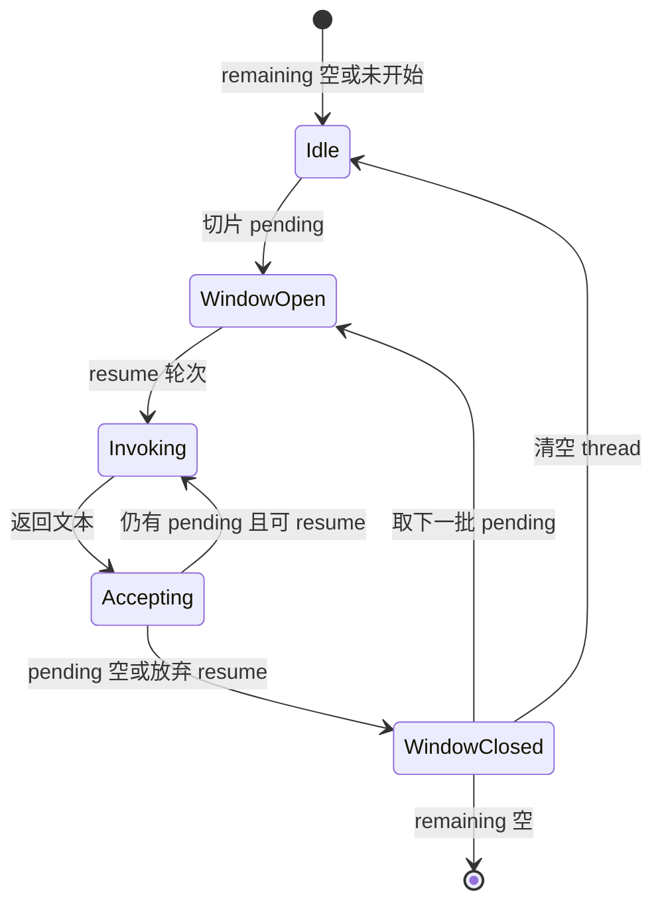

# 整集标注省 Token — 实现思路

> **状态**：规划 → **M1/M2/M3 已落地后端**（FE 零改；验收门槛未放宽）  
> **日期**：2026-09-18  
> **需求摘要**：在**不改变**整集标注业务逻辑（SSE 事件、验收写库、练习命中、可取消）的前提下，压缩 LLM 输入/输出与 `priorThread`，降低每轮与整次预热的 token 消耗。

## 延伸阅读

- 主能力规划：[经典句整集标注预热.md](./经典句整集标注预热.md)（SSE 源级预热已落地）
- 本仓实现入口：`apps/backend/src/services/english-learning/english-learning.service.ts` → `annotateMissesAdaptive`
- Prompt：`apps/backend/src/services/english-learning/prompt.ts` → `SENTENCE_WORDS_ANNOTATE_BATCH_SYSTEM`
- 验收门槛：`apps/backend/src/services/english-learning/sentence-word-annotation-cache.util.ts` → `isUsableSentenceWordAnnotations`

---

## 0. 读本文你将得到什么

- **问题**：413 句级预热时，跨批叠加的 `priorThread` + 双字段入参 + 回显 `word`，把 token 烧在「与验收无关」的重复信息上。
- **方案一句话**：只改 **LLM 线协议与会话窗口**，对外 SSE / 落库 DTO / cache_key / 练习读缓存 **契约不变**。
- **改动层**：几乎全在后端编排与 prompt；前端进度页 **零改**（除非日后观测埋点）。
- **阶段**：M1 跨批清空 thread → M2 入参/出参去冗余 → M3 系统提示词瘦身 → M4（可选）封闭词本地表（须语义等价验收）。
- **最大风险**：压缩协议后模型漏字段导致拒收率上升；用 **同一验收函数** + 对照验收（同批句对比）兜底，**禁止**为省 token 放宽 `isUsable*`。

---

## 1. 需求与边界

### 1.1 用户故事

| 角色 | 场景 | 行为 | 期望结果 |
|------|------|------|----------|
| 学习者 | 语句库/Pack「标注」 | 照常确认并看进度 | 进度、完成、可取消与现在一致；练习仍能读到完整标注 |
| 产品/成本 | 同规模 miss 集合 | 观察模型用量 | 同等验收质量下，整次预热 **input+output token 明显下降** |
| 开发者 | 改线协议 | 合并 PR | FE API / SSE / 缓存表对外字段 **无需跟改** |

### 1.2 范围

| 在范围内 | 不在范围内（非目标） |
|----------|----------------------|
| `annotateMissesAdaptive` 的 thread 生命周期 | 改 SSE 事件类型或进度字段语义 |
| 批量标注 LLM 入参/出参 JSON 形状（服务端再映射） | 放宽验收（禁止空 IPA 垫空再计 annotated） |
| 批量 system prompt 去冗长示例 | 换模型、降 CHUNK「赌一把」当主方案 |
| （可选）封闭词确定性标注 | 改 cache_key 算法、练习分词规则 |
| 对照日志：每轮估 token / 验收率 | 前端 UI 重做；收藏/错题整集入口 |

### 1.3 约束与依赖（硬约束：不影响功能逻辑）

下列 **必须保持不变**：

| 契约 | 说明 |
|------|------|
| SSE | `annotate.start` / `progress` / `complete` / `error`；`heartbeat` 可忽略 |
| 进度语义 | `total/hit/miss/annotated/failed/remaining` 含义不变 |
| 写库 | `english_sentence_word_annotation_cache`；`cache_key` 仍 `version+englishNorm+words` |
| 对外 DTO | 练习/单句 API 仍返回 `posZh` / `ipa` / `meaningZh`（及对齐后的 `word`） |
| 验收 | 继续走 `isUsableSentenceWordAnnotations`；拒收不得改成「垫空也算」 |
| 控制流 | abort、熔断、`MAX_RESUME` / `MAX_TOTAL_ROUNDS`、批大小减半策略语义不变 |
| 分词 | 仍 `segmentEnglishSentenceWords`，与前端同源 |

允许变的只有：**发给模型的 JSON / system 文案 / priorThread 是否跨批保留**。

---

## 2. 方案总览（一句话 + 要点）

**一句话方案**：按窗口隔离续标对话；入参只带 `id+words`、出参按下标对齐且不回显 `word`；服务端映射回现有 DTO 再验收写库——**业务状态机不动，只瘦 LLM 载荷**。

| # | 设计要点 | 理由 |
|---|----------|------|
| 1 | **新批窗口开始时 `thread.length = 0`** | 跨批不需要「已验收句」记忆；当前整次共用 thread 是最大 input 浪费 |
| 2 | 窗口内 resume 仍带短 thread | 截断续标逻辑保留，功能不丢 |
| 3 | 入参去掉 `english`（或仅调试开关保留） | `words` 已足够；english 与 words 重复 |
| 4 | 出参省略 `word`，按下标对齐 | 输出 token 大头之一；服务端用 `expectedWords[i]` 回填 |
| 5 | system 保留硬规则、砍长示例 | 每轮都付 system 成本；规则不丢则功能不丢 |
| 6 | **禁止**为省 token 放宽验收 / 删 resume | 否则「功能逻辑」被破坏（进度虚高、练习空白） |
| 7 | M4 封闭词表须「字段齐全且可测」 | 默认不进主路径，避免释义争议 |

---

## 3. 现状与复用

| 能力 | 仓库中已有 | 本需求中的用法 |
|------|------------|----------------|
| 整集 SSE 编排 | `annotateClassicLibrarySource` / `annotateClassicPackSource` + controller `@Sse` | **不改**事件面；仅内部 miss 标注更省 token |
| 自适应多轮 | `annotateMissesAdaptive` | **扩展**：窗口边界清 thread；压缩 payload |
| Thread trim | `trimPackAgentThread` + `PACK_AGENT_THREAD_MAX_MESSAGES` | 窗口内仍 trim；跨批不再依赖长历史 |
| AI 快照 | `buildAnnotateThreadAssistantSnapshot` | 窗口内 resume 可继续用；跨批无意义可跳过 |
| 批量 prompt | `SENTENCE_WORDS_ANNOTATE_BATCH_SYSTEM` | **改文案**对齐新 JSON 形状 |
| 解析 | `extractSentenceWordAnnotationsBatchLoose` / `Loose` | **扩展**：无 `word` 时用 expected 回填；短字段名可选 |
| 验收 | `isUsableSentenceWordAnnotations` | **直接复用**，不改门槛 |
| 缓存 key / version | `buildSentenceWordAnnotationCacheKey` / `SENTENCE_WORD_ANNOTATION_CACHE_VERSION` | 协议压缩若只影响 LLM 中间态、DTO 仍完整 → **可不升版**；若落库 JSON 形状变了才升版 |
| 练习读缓存 | `annotateSentenceWords` / `Batch` + FE `sentenceWordAnnotationCache.ts` | **不改** |

**调研结论**：token 浪费主要在 `annotateMissesAdaptive` 的 **跨批 priorThread** 与 **english+words / word 回显**；SSE 与 MobX 进度页已能反映真实 `annotated`，省 token 不必动前端。封闭词表与词形 IPA 缓存能再省，但触及「谁生成 meaningZh」，放到可选阶段并加等价验收。

---

## 4. 架构图



**图内方法说明**：

| 方法 | 功能 |
|------|------|
| `streamAnnotateClassicSource(...)` | 前端读 SSE；忽略 heartbeat；把 progress 写入 store（本需求不改） |
| `annotateClassicLibrarySourceStream` / `Pack...` | Controller 建 Observable、keepalive、abort；本需求不改事件载荷形状 |
| `annotateClassicEnglishesWarmup(...)` | 全量去重、查 hit、调 adaptive、推 start/progress/complete |
| `annotateMissesAdaptive(...)` | miss 分批调用模型；**本需求改**：窗口级 thread、压缩 user JSON |
| `invokeEnglishPackSubModelJson(...)` | 拼 system+priorThread+user 调 LLM；入参形状变但返回仍是文本 |
| `extractSentenceWordAnnotationsBatchLoose(...)` | 解析批量 JSON；**本需求改**：允许无 `word`/短键，回填完整 DTO |
| `isUsableSentenceWordAnnotations(...)` | 验收门槛；**禁止放宽** |
| `upsert`（TypeORM） | 按 `cacheKey` 写入完整 annotations |

**读图要点**：

- 省 token 发生在 **Adapt ↔ Model ↔ Parse** 三角；FE/SSE/Gate/Upsert 边界保持。
- 🆕 仅编排与解析；不新增对外 HTTP。
- 完整 DTO 在进 Gate 之前必须恢复，保证落库与练习一致。

---

## 5. 主流程图



**图内方法说明**：

| 方法 | 功能 |
|------|------|
| `annotateMissesAdaptive` | 驱动上图循环；窗口边界清 thread |
| `invokeEnglishPackSubModelJson` | 单次模型调用 |
| `extractSentenceWordAnnotationsBatchLoose` | 文本 → Map&lt;id, DTO[]&gt; |
| `isUsableSentenceWordAnnotations` | 是否允许写库 |
| `upsertAccepted`（内部闭包） | 写库成功才计入 accepted |
| `buildAnnotateThreadAssistantSnapshot` | 窗口内 AI 侧短快照，避免把整段 JSON 塞回 thread |
| `tripCircuit` | 硬失败时丢掉剩余 miss 并记 failed（行为同现网） |

**读图要点**：

- **功能逻辑**：验收、写库、resume、减半、熔断路径与现网同构；只在「组包 / 清 thread」插入 🆕。
- 跨批不再携带历史 Human JSON → 每窗口 input 近似「system + 本批 items」。
- 拒收仍留 pending，由 resume/减半处理，不靠垫空过关。

---

## 6. 核心时序图



**图内方法说明**：

| 方法 | 功能 |
|------|------|
| `annotateClassicEnglishesWarmup` | 汇总 hit/miss，把 misses 交给 adaptive，对外发 SSE |
| `annotateMissesAdaptive` | 窗口循环、清 thread、压缩调用 |
| `invokeEnglishPackSubModelJson` | 实际消耗 token 的调用点 |
| `extractSentenceWordAnnotationsBatchLoose` | 瘦 JSON → 完整 DTO |
| `isUsableSentenceWordAnnotations` | 验收 |
| `cacheRepo.upsert` | 持久化 |

**读图要点**：

- Happy path 与现网相同：调模型 → 解析 → 验收 → 写库 →（可选）resume。
- 差异仅 **priorThread 作用域** 与 **JSON 胖瘦**；SSE complete 仍由 Warm 发出。

---

## 7. （可选）状态：窗口会话



**图内方法说明**：

| 方法 | 功能 |
|------|------|
| （窗口边界）`thread.length = 0` | 离开 `WindowClosed` 时丢弃跨批记忆，保证下窗 input 干净 |
| resume 循环 | 对应 `Invoking ↔ Accepting`，功能同现网 `MAX_RESUME_ROUNDS` |

---

## 8. 模块职责与接口草图

### 8.1 模块一览

| 模块 | 职责 | 新增/改动 | 预估路径 |
|------|------|-----------|----------|
| Adaptive 编排 | 窗口清 thread、组瘦 user | 改动 | `english-learning.service.ts` → `annotateMissesAdaptive` |
| Prompt | 描述新 JSON 契约 | 改动 | `prompt.ts` → `SENTENCE_WORDS_ANNOTATE_BATCH_SYSTEM` |
| 解析 | 无 word / 短键 → 完整 DTO | 改动 | 同 service 内 `extract*Loose` |
| 验收 / 写库 / SSE | 不变 | 复用 | util + controller |
| 前端 | 不变 | 无 | — |
| （可选）封闭词表 | 确定性填部分词 | 新增 | 如 `closed-class-annotate.util.ts` |

### 8.2 关键接口（草图）

```typescript
// 发给模型的单句项：去掉 english，避免与 words 重复占 input
type AnnotateLlmItem = {
	// 窗口内下标；resume 时仍只含未验收 id
	id: number;
	// 已切分词形；模型按下标输出，不再回传 word
	words: string[];
};

// 模型出参单句：仅标注字段；word 由服务端回填
type AnnotateLlmWordOut = {
	// 中文词性；须落在既有枚举
	posZh: string;
	// 英式 IPA；无斜杠
	ipa: string;
	// 本句语境短释义
	meaningZh: string;
};

// 窗口级调用：跨批不得传入上一窗 Human/AI
function buildAnnotateWindowUser(params: {
	// 本窗尚未验收的句子
	pending: { words: string[] }[];
	// >0 表示续标，提示模型勿重复已验收 id
	resume: number;
}): string;
```

```typescript
// 解析后必须得到与现网一致的 DTO，再进验收
function toDtoFromLlmWords(
	// 模型词数组（可无 word）
	rows: AnnotateLlmWordOut[],
	// 分词原形，用于回填与长度校验
	expectedWords: string[],
): { word: string; posZh: string; ipa: string; meaningZh: string }[];
```

### 8.3 数据模型

| 字段/实体 | 来源 | 存储 | 说明 |
|-----------|------|------|------|
| LLM user JSON | 运行时 | 不落库 | 仅 id+words（+continue） |
| LLM 输出 JSON | 模型 | 不落库 | items[].words[] 无 word |
| `annotations` 列 | 验收后 DTO | DB jsonb | **形状与现网一致** |
| `priorThread` | 窗口内 | 内存 | 跨批清空 |
| SSE progress | warmup | 网络 | 语义不变 |

---

## 9. 分阶段实现步骤

| 阶段 | 目标 | 交付物 | 依赖 |
|------|------|--------|------|
| M1 | 跨批清 thread | adaptive 改动 + 日志「window reset」 | 无 |
| M2 | 入参/出参去冗余 | prompt + payload + 解析回填 | M1 |
| M3 | system 瘦身 | 短规则版 prompt（规则不减） | M2 |
| M4 | （可选）封闭词 | 本地表 + 等价自检；默认开关关闭 | M2 |

### M1 — 跨批清空 thread

- [x] 在 `pending = remaining.slice(...)` 之后、`resume` 循环之前执行 `thread.length = 0`
- [x] 确认 **同一窗口内** resume 仍 `thread.push` + `trimPackAgentThread`
- [ ] 日志：`windowSize` / `resume` / `threadMsgs`（仅 debug/log 级）
- [ ] 回归：截断场景仍能靠 resume 收齐；整集 SSE 进度仍递增

### M2 — 线协议压缩（功能对外不变）

- [x] user items 默认去掉 `english`；长句（≥`ANNOTATE_LLM_ATTACH_ENGLISH_MIN_WORDS`）仍附带
- [x] 要求模型勿输出 `word`；解析用 `expectedWords[i]` 回填
- [x] 兼容旧形状：若仍带 `word` / `english`，解析不报错
- [x] **严禁**改 `isUsable*`
- [ ] 自检：同批 fixtures 解析后 DTO 与「胖协议」字段齐全性一致

### M3 — system 文案瘦身

- [x] 删除重复 Constraints / 过长英美对照举例，保留硬规则
- [ ] A/B：同 12 句样本对比验收率；验收率下降则回滚文案，不改代码门槛

### M4 — 可选封闭词（默认关）

- [ ] `the/a/an/of/to/...` 本地 posZh+ipa+固定释义；其余词仍走模型
- [ ] 拼进最终 DTO 后再统一 `isUsable*`
- [ ] 开关默认 `false`；打开须过「练习页抽检」验收

---

## 10. 关键决策与备选方案

| 决策 | 选用 | 备选 | 为何不选备选 |
|------|------|------|--------------|
| 省 token 主杠杆 | 窗口清 thread + 去冗余字段 | 降 CHUNK 到 4 死扛 | 批太小会 **增加轮次**，system 重复费可能更高 |
| 跨批记忆 | 清空 | 只保留 id 列表摘要 | 跨批摘要对标注无增益；实现复杂 |
| 出参 | 无 word、下标对齐 | 短键 `p/i/m` 一并上 | 短键可作 M2.1；先去 word 收益/风险比更好 |
| 封闭词 | M4 可选 | M1 就上 | 易引发「释义是否算逻辑变化」争议；与硬约束冲突风险高 |
| 升 cache version | 默认不升 | 一律 v4 | 落库 DTO 不变则不必清缓存；避免无意义重标 |

---

## 11. 风险、边界与待确认

| 项 | 等级 | 说明 | 缓解 |
|----|------|------|------|
| 去 `english` 后语境不足 | 中 | 个别多义词释义变差 | A/B 抽检；必要时仅长句附 `english`（混合模式） |
| 无 `word` 导致乱序 | 中 | 模型漏行/错位 | 长度不一致整句拒收；resume；不垫空 |
| 清 thread 后 resume 变弱 | 低 | 仅影响跨批，不影响窗内 | 窗内仍保留短 thread |
| 验收率暂时下降 | 中 | 进度变慢但逻辑仍正确 | 调 prompt/批大小；**禁止**放宽 Gate |
| 误改 SSE/FE | 低 | 范围蔓延 | Code review 清单：FE 零 diff |

**待确认**：

- [ ] 是否允许 M2 对「词数 &gt; N 的长句」额外附带 `english`？（验证：抽 20 条长句对比释义质量）
- [ ] M3 瘦身稿以中英哪一侧为准保留枚举列表？（验证：验收率 ≥ 现网基线）

---

## 12. 验收清单

| # | 用例 | 步骤 | 期望 |
|---|------|------|------|
| AC1 | 功能不变：进度 | 同库冷缓存跑整集标注 | SSE `annotated` 递增；进度页百分比上升；最终有 `complete` |
| AC2 | 功能不变：练习 | 预热完成后进看中写 | 已标句有 pos/ipa/释义；cacheHit 为 true（同 key） |
| AC3 | 功能不变：中断 | 中途 abort | 已 upsert 句保留；重跑 hit 增加；无脏空字段入库 |
| AC4 | 窗内续标 | 人为制造截断（或大批） | 同窗 resume 仍能收齐；不依赖跨批 thread |
| AC5 | 拒收不垫空 | 模型少词 | 该句不计 annotated；不写空 IPA 行 |
| AC6 | Token | 同 36 句 miss 对比改前/改后 | 估 input token 明显下降（日志或供应商账单）；验收率不低于约定基线 |
| AC7 | 契约 | 抓包 SSE + 读库一行 | 事件字段名/DTO 字段名与改前一致 |

---

## 13. 预估改动面（实现阶段参考）

| 类型 | 路径（预估） |
|------|--------------|
| 后端 | `apps/backend/src/services/english-learning/english-learning.service.ts` |
| 后端 | `apps/backend/src/services/english-learning/prompt.ts` |
| 后端（可选） | `apps/backend/src/services/english-learning/closed-class-annotate.util.ts` + selfcheck |
| 前端 | **无**（硬约束） |
| 规划文档 | `remote-docs/wiki/ideas/english/整集标注省Token.md`（本文） |
| 实现后归档 | `remote-docs/wiki/english/`（用 `implementation-doc-from-diff`） |

---

## 14. 明确不做（防范围蔓延）

- 不改为「一次 LLM 标完整库」。
- 不放宽 `isUsableSentenceWordAnnotations`。
- 不改练习分词、不改 cache_key 算法（除非独立需求升 version）。
- 不把封闭词/词形缓存当作 M1 必做。
- 不借机重做前端进度 UI。

（本文档为规划态实现思路；落地后以源码与 `implementation-doc-from-diff` 归档为准。）
