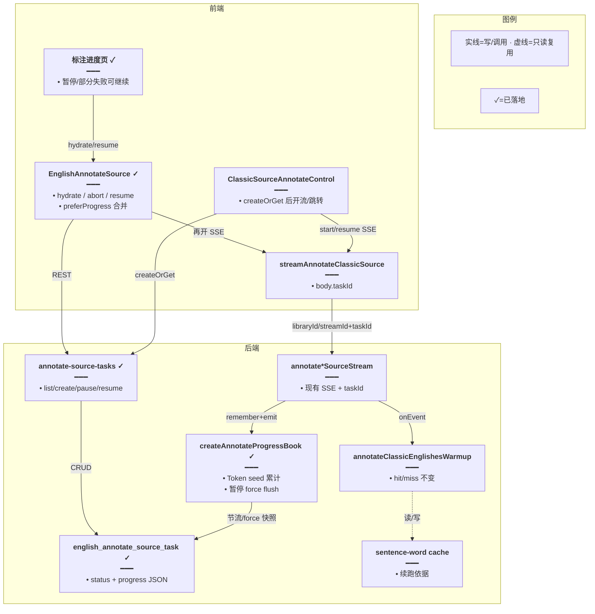
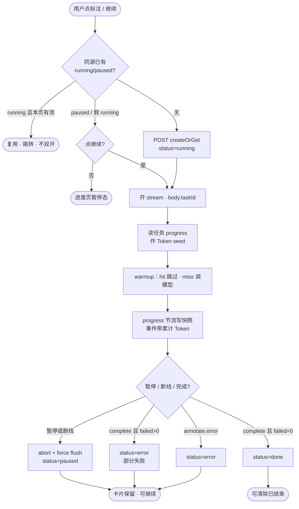
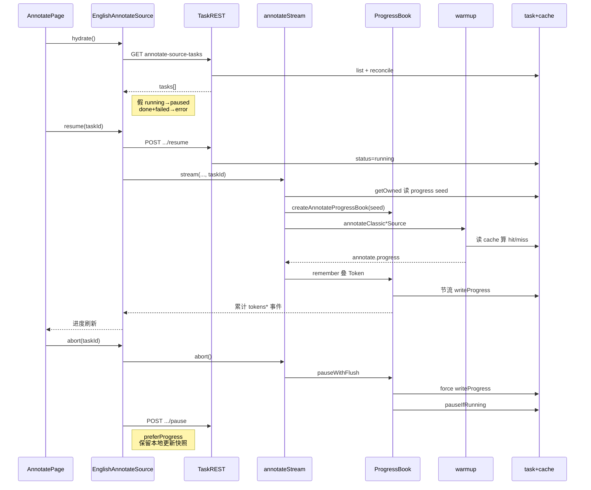
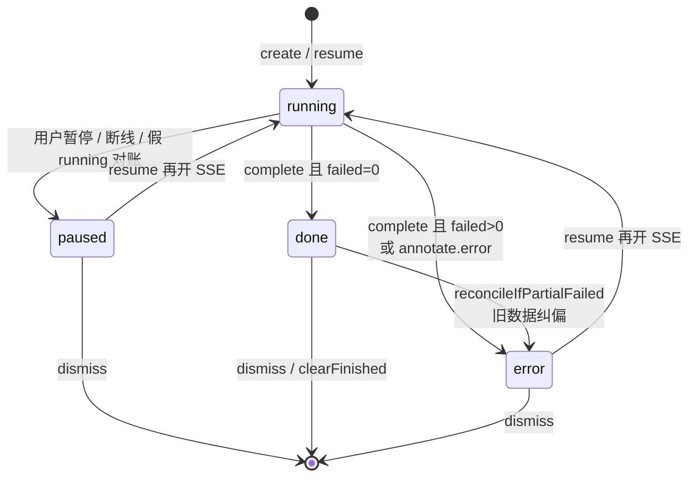

# 标注任务持久化与续跑 — 实现思路

> **状态**：核心已落地（2026-09-18）；文内含落地后纠偏（暂停进度回退 / Token 清零 / 部分失败误标 done）  
> **日期**：2026-09-18  
> **需求摘要**：整集标注任务写入数据库，刷新后仍可见；支持暂停后再继续；**不改** miss 标注/写缓存/SSE 事件语义；进度与 Token 跨暂停累计；有失败句时不可标成绿色「已完成」，须可点「继续」重试。

## 延伸阅读

- 已落地预热：[经典句整集标注预热.md](./经典句整集标注预热.md)
- 省 Token：[整集标注省Token.md](./整集标注省Token.md)
- 任务 Store：`apps/frontend/src/store/englishAnnotateSource.ts`
- SSE 客户端：`apps/frontend/src/utils/annotateClassicSourceSse.ts`
- 任务服务：`apps/backend/src/services/english-learning/annotate-source-task.service.ts`
- SSE 进度簿：`createAnnotateProgressBook`（`english-learning.controller.ts`）
- 句缓存：`english_sentence_word_annotation_cache`
- 任务表：`english_annotate_source_task`

---

## 0. 读本文你将得到什么

- **问题**：任务曾只在 MobX；刷新丢失；停止后无法续跑；落地后又暴露「暂停进度回退 / Token 清零 / 失败仍显示已完成」。
- **一句话方案**：**任务元数据落库**；暂停=abort SSE + **强制刷进度快照**；继续=再开同源 SSE（句缓存 hit 跳过）+ **Token 叠加上一段 seed**；`failed>0` → `error`（部分失败）可 resume。
- **改动层**：任务表 + REST；SSE 带 `taskId`；Store hydrate/pause/resume；进度页状态与按钮。
- **阶段**：M1～M3 主链路已落地；M4 为体验纠偏（快照/Token/部分失败）。
- **最大风险**：把续跑做成存 LLM thread / 离线 Job → 已否决；勿在 warmup 内为任务表改验收门槛。

---

## 1. 需求与边界

### 1.1 用户故事

| 角色 | 场景 | 行为 | 期望结果 |
|------|------|------|----------|
| 学习者 | 标注进行中刷新 | 打开进度页 | 卡片仍在；无本页 SSE 的假 running 对账为 paused，可点继续 |
| 学习者 | 点停止 | 停止 | `paused`；进度百分比/Token **不回退**；句缓存保留 |
| 学习者 | 点继续 | 继续 | 再开 SSE；hit↑；Token **在历史累计上继续加** |
| 学习者 | 同源再点「标注」 | 开始 | 复用 running/paused，跳转进度页，不双开 |
| 学习者 | 仅剩少数句失败 | 看状态 | **非**绿色已完成；展示「部分失败」+「继续」可重试 miss |

### 1.2 范围

| 在范围内 | 不在范围内（非目标） |
|----------|----------------------|
| 任务行持久化 + 进度/Token 快照 | 改句缓存表结构 / 验收门槛 |
| 暂停 / 继续 / hydrate 对账 | 服务端无客户端后台狂跑 LLM |
| 暂停强制 flush；续跑 Token seed | 持久化 `priorThread` / 半截 JSON |
| `failed>0` → 部分失败可 resume | Bull/队列/多 worker |
| 同源互斥（running+paused） | 收藏/错题整集入口 |

### 1.3 约束与依赖

| 约束 | 说明 |
|------|------|
| 内容续跑靠缓存 | 已 upsert 句下次计 `hit`——续跑必须复用 |
| SSE 仍为请求生命周期 | abort / 断线 → 停本轮 LLM |
| 验收门槛不变 | 不改 `isUsableSentenceWordAnnotations` / 分词 / cache_key |
| Token 累计在任务层 | warmup 本趟仍从 0 计；controller 叠 seed 后下发给 FE |
| Ponytail | 无通用 Job；写任务表失败不挡标注主路径 |

---

## 2. 方案总览（一句话 + 要点）

**一句话方案**：任务表存卡片与进度快照；暂停只停 SSE 并 **force 写最新快照**；继续再开现有 stream，靠句缓存跳过已标句，Token 用任务行 seed 跨段累计；完成时若 `failed>0` 记 `error` 而非 `done`。

| # | 设计要点 | 理由 |
|---|----------|------|
| 1 | 两层持久化：句缓存 + 任务行 | 刷新丢的是 UI，不是标注结果 |
| 2 | 继续 = 再开 SSE，不存模型对话 | 避免 thread/双开/半截状态 |
| 3 | 进度节流写库；暂停/完成 **force** | 防暂停瞬间用旧快照盖掉 FE |
| 4 | `createAnnotateProgressBook` + seed | 防续跑 `annotate.start` 把 Token 写成 0 |
| 5 | FE `preferProgress` 合并 | 暂停 API 与 SSE flush 竞态时保新进度 |
| 6 | `failed>0` → error（部分失败） | 可 resume；失败句未入缓存仍是 miss |
| 7 | 假 running 对账 | hydrate / stale / 无本页 stream → paused |

---

## 3. 现状与复用

| 能力 | 仓库中已有 | 本需求中的用法 |
|------|------------|----------------|
| 句级缓存 | `english_sentence_word_annotation_cache` | **续跑真相源** |
| 整集 warmup | `annotateClassicEnglishesWarmup` / `annotateMissesAdaptive` | **不改** hit/miss/验收 |
| Abort | `wireEnglishLearningSseAbort` | 暂停 = abort；断线 pauseIfRunning |
| 任务表 + CRUD | `AnnotateSourceTaskService` + `english_annotate_source_task` | **已落地** list/create/pause/resume/dismiss |
| SSE 进度簿 | `createAnnotateProgressBook` | seed Token；改写事件里累计值；flush |
| 任务 Store | `englishAnnotateSource.ts` | hydrate / abort / resume / preferProgress |
| 进度页 | `annotate/index.tsx` | paused / 部分失败 →「继续」 |
| 入口 | `ClassicSourceAnnotateControl` | createOrGet + alreadyActive |

**调研结论**：标注引擎零改。任务生命周期与「快照/Token/终态」纠偏全部落在任务表 + SSE 包装层 + Store。

---

## 4. 架构图



**图内方法说明**：

| 方法 | 功能 |
|------|------|
| `EnglishAnnotateSource.start` | createOrGet 后开 SSE；复用 paused 不开流 |
| `EnglishAnnotateSource.abort` | abort 流 + pause API；`preferProgress` 保本地新进度 |
| `EnglishAnnotateSource.resume` | resume API 后开 SSE；保留本地 Token/进度种子 |
| `EnglishAnnotateSource.hydrate` | GET 列表；无本页 stream 的 running→paused；done+failed→error |
| `streamAnnotateClassicSource` | 请求体带可选 `taskId` |
| `createAnnotateProgressBook` | 用任务 progress 作 Token seed；改写事件累计值；persist |
| `pauseWithFlush` | force `writeProgress` 再 `pauseIfRunning` |
| `AnnotateSourceTaskService.markDone` / `markError` | failed>0 走 markError（部分失败） |
| `reconcileIfPartialFailed` | 旧数据 done+failed 纠成 error |

**读图要点**：

- Warm→Cache 与任务快照并行；续跑不经过 thread。
- Token 累计在 Book 层，warmup 本趟计数从 0。
- 暂停路径必须经 Book.flush，避免旧快照盖 UI。

---

## 5. 主流程图



**图内方法说明**：

| 方法 | 功能 |
|------|------|
| `createOrGet` | 插入或返回同源 running/paused |
| `createAnnotateProgressBook` | seed + remember + persist |
| `annotateClassicEnglishesWarmup` | 算 hit/miss 并标注 |
| `writeProgress` | 节流；force 时无视 throttle / 允许 paused |
| `pauseIfRunning` | running→paused |
| `markDone` / `markError` | 终态；failed>0 禁止伪 done |

**读图要点**：

- 「继续」与「首次」共用 OpenSse→Warm。
- 暂停不回滚句缓存；失败句未写缓存，续跑仍是 miss。
- 部分失败与硬错误共用 `error`，UI 用 `progress.failed` 区分文案。

---

## 6. 核心时序图



**图内方法说明**：

| 方法 | 功能 |
|------|------|
| `hydrate` | 拉列表并本地/服务端对账 |
| `resume` | 允跑 + 开 SSE；合并 keptProgress |
| `getOwned` | 取任务行作 Token seed |
| `remember` | 改写事件 Token 为累计；更新 last |
| `pauseWithFlush` | 先 force 快照再 paused |
| `preferProgress` | 按 hit+annotated+tokens 取较新一侧 |
| `abort` + `pause` | 停流并持久暂停 |

**读图要点**：

- 暂停路径 **先 flush 再 pause**，解决 28%→22% 回退。
- seed 解决续跑 Token 从 0 起跳。
- 任务表管「做到哪」；cache 管「句内容」。

---

## 7. 状态机



**图内方法说明**：

| 方法 | 功能 |
|------|------|
| `createOrGet` | → running（或复用 paused） |
| `pause` / `pauseIfRunning` / hydrate 对账 | → paused |
| `resume` | paused\|error → running |
| complete 处理 | failed=0→done；failed>0→error |
| `reconcileIfPartialFailed` | 历史 done+failed → error |
| `dismiss` | 删任务行；**不删**句缓存 |

---

## 8. 模块职责与接口草图

### 8.1 模块一览

| 模块 | 职责 | 状态 | 路径 |
|------|------|------|------|
| Entity + migration | 任务表 | ✓ | `entity/english-annotate-source-task.entity.ts`、`migrations/1789671600000-…` |
| Task service | CRUD / 快照 / 对账 | ✓ | `annotate-source-task.service.ts` |
| Controller Book + SSE | seed/累计/flush | ✓ | `english-learning.controller.ts` |
| FE Store | hydrate / pause / resume | ✓ | `englishAnnotateSource.ts` |
| FE SSE | `taskId` | ✓ | `annotateClassicSourceSse.ts` |
| 进度页 + i18n | 继续 / 部分失败 | ✓ | `annotate/index.tsx`、`zh-CN`/`en-US` |

### 8.2 数据模型（任务表）

| 字段 | 说明 |
|------|------|
| `id` | uuid |
| `user_id` / `source` / `library_id` / `stream_id` / `title` | 归属与展示 |
| `status` | `running` \| `paused` \| `done` \| `error` |
| `progress` | total/hit/miss/annotated/failed/remaining/tokens* |
| `error_message` | 部分失败提示等 |
| `started_at` / `updated_at` / `finished_at` | 时间戳 |

应用层互斥：同源仅允许一条 `running|paused`（`findActiveForSource`）。

### 8.3 接口草图（与现网对齐）

```typescript
// REST 前缀：/english-learning/annotate-source-tasks
// 创建或复用同源未结束任务，避免双开 SSE
function createOrGet(input: {
	userId: number;
	source: 'library' | 'pack';
	libraryId?: string;
	streamId?: string;
	title: string;
}): { task: TaskDto; reused: boolean };

// 暂停：客户端 abort 后调用；SSE teardown 内 pauseWithFlush
function pause(userId: number, taskId: string): TaskDto;

// 继续：status→running；真正打模型仍走现有 stream
function resume(userId: number, taskId: string): TaskDto;

// 完成：failed>0 不可 markDone
function finish(userId: number, taskId: string, snap: Progress): void {
	// 有失败句则标 error，保留 progress，允许 resume 重试 miss
	if (snap.failed > 0) return markError(userId, taskId, msg, snap);
	// 全成功才标 done
	return markDone(userId, taskId, snap);
}
```

```typescript
// SSE 包装：本趟 LLM token 从 0，对外事件叠 seed
function createAnnotateProgressBook(opts: {
	// 上次暂停留下的累计 Token / 进度
	seed?: Progress | null;
	// 节流或 force 写任务表
	persist: (snap: Progress, force: boolean) => void;
}): {
	remember: (ev: Record<string, unknown>) => void;
	last: Progress;
	flush: () => void;
};
```

### 8.4 写库策略

| 时机 | 策略 |
|------|------|
| progress（非 heartbeat） | 节流 ≥2s |
| annotate.start | force（保留 seed Token，annotated 置 0） |
| 暂停 / 断线 | **force** 再 `pauseIfRunning` |
| complete / error | 立即终态写 |

写失败只吞掉，不中断 warmup。

---

## 9. 分阶段实现步骤

| 阶段 | 目标 | 状态 |
|------|------|------|
| M1 | 表 + list/create/dismiss + hydrate | ✓ |
| M2 | pause/resume + SSE taskId 快照 | ✓ |
| M3 | 断线/假 running 对账 + 同源互斥 | ✓ |
| M4 | 暂停 flush、Token seed、部分失败 | ✓ |

### M4（落地后纠偏）验收点

- [x] 暂停后百分比不低于暂停前（force flush + preferProgress）
- [x] 继续后 Token 在历史值上累加（ProgressBook seed）
- [x] `failed>0` 显示「部分失败」+「继续」，非绿色已完成
- [x] 旧 done+failed 行 list/hydrate 纠成 error

---

## 10. 关键决策与备选方案

| 决策 | 选用 | 备选 | 为何不选备选 |
|------|------|------|--------------|
| 续跑 | 再开 SSE + cache hit | 服务端 Job | 难 abort、易双跑 |
| 暂停语义 | paused 可继续 | aborted 终态 | 不满足「暂停后继续」 |
| Token 累计 | 任务 seed + 本趟相加 | 改 warmup 全局累加器 | 少动引擎；Book 一层即可 |
| 暂停回退 | force flush + FE prefer | 只信 pause API 返回 | API 与 teardown 竞态 |
| 部分失败 | status=error + failed | 新状态 partial | YAGNI；UI 用 failed 区分 |
| 进度真相 | cache + 任务快照 | 只信 remaining | 快照可旧；续跑以 cache 为准 |

---

## 11. 风险、边界与待确认

| 项 | 等级 | 说明 | 缓解 |
|----|------|------|------|
| 双开 SSE | 高 | 两页同时继续 | 同源互斥；本页 `hasOpenStream` |
| 假 running | 中 | 刷掉页未 pause | 断线钩子 + hydrate + stale 2min |
| 暂停快照旧 | 高（已踩坑） | 节流未写完就 pause | force flush + preferProgress |
| Token 被 start 清零 | 高（已踩坑） | start 写 tokens:0 | seed 保留 + 事件改写累计 |
| 伪 done | 中（已踩坑） | failed 仍 markDone | markError + reconcile |
| 写任务表失败 | 中 | DB 抖动 | 只 warn，不挡标注 |
| 误改 warmup | 高 | 质量回归 | CR：禁止为任务表改验收 |

**待确认**：

- [ ] 列表保留条数/天数（现 take=50）
- [ ] Pack/库删除后任务展示（现仍显示历史 title）

---

## 12. 验收清单

| # | 用例 | 期望 |
|---|------|------|
| AC1 | 刷新恢复 | 卡片仍在；可继续 |
| AC2 | 暂停保留缓存 | 已标句练习仍有 IPA/释义 |
| AC3 | 继续不重标 | start.hit≥暂停前已写句；Token 不从 0 狂跳清空 |
| AC4 | 暂停不回退进度 | 暂停后 % ≥ 暂停前瞬时 % |
| AC5 | 同源不双开 | reused，一路 SSE |
| AC6 | 强刷对账 | 非永久 running |
| AC7 | 部分失败 | 非绿色已完成；可继续重试 miss |
| AC8 | dismiss | 任务行消失；句缓存仍在 |
| AC9 | 权限 | 不能操作他人 taskId |

---

## 13. 预估改动面（已落地对照）

| 类型 | 路径 |
|------|------|
| Entity/migration | `apps/backend/.../entity/english-annotate-source-task.entity.ts`、`migrations/1789671600000-english_annotate_source_task.ts` |
| Task service | `annotate-source-task.service.ts` |
| Controller | `english-learning.controller.ts`（Book + 两路 stream） |
| Module | `english-learning.module.ts` |
| FE | `englishAnnotateSource.ts`、`annotateClassicSourceSse.ts`、`annotate/index.tsx`、`ClassicSourceAnnotateControl.tsx`、`AnnotateTasksLiveLink.tsx` |
| API | `service/api.ts`、`service/index.ts` |
| i18n | `zh-CN.ts` / `en-US.ts` |
| 本文 | `remote-docs/wiki/ideas/english/标注任务持久化续跑.md` |

---

## 14. 明确不做

- 不把 LLM 迁出 HTTP SSE 到常驻 Worker（本阶段）。
- 不持久化 `priorThread`、不续半截 JSON。
- 不因任务表改动 `isUsable*`、分词、cache version。
- 不删除句缓存作为「暂停」手段。
- 无 `taskId` 时不改变现有 stream URL 与事件 `type`。

（核心已落地；若再改 diff，可用 `implementation-doc-from-diff` 写正式专题归档。）
