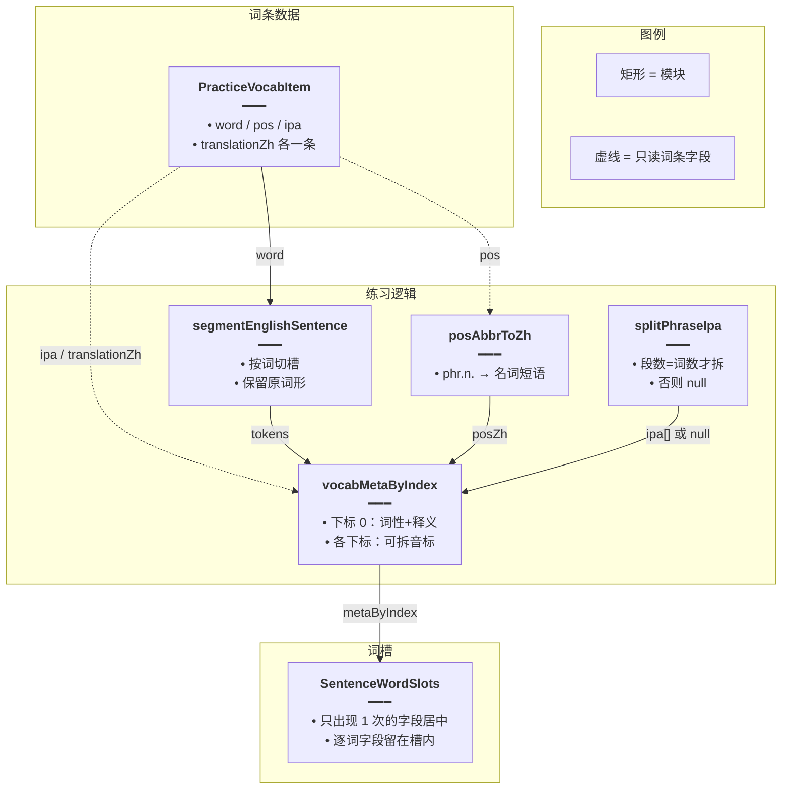
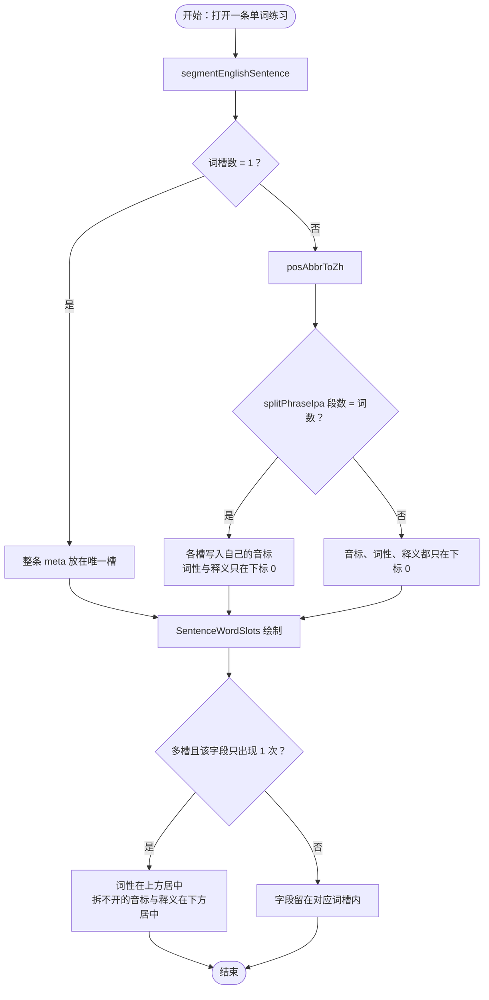
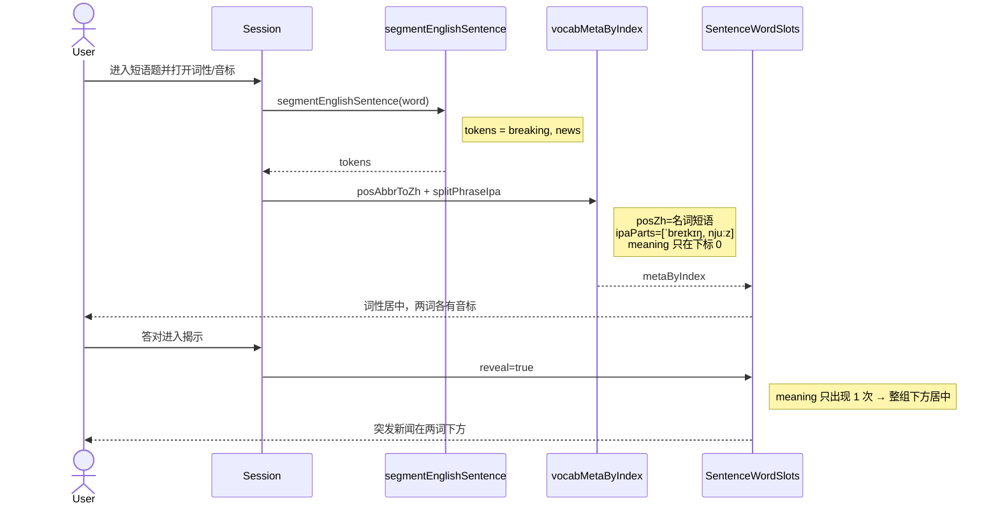

# 短语词槽标注 — 实现思路

> **状态**：核心已落地  
> **日期**：2026-09-21  
> **需求摘要**：单词练习里的多词短语（如 breaking news）按词分槽作答，词性与中文释义居中标在整条短语上，音标能按词切开才分到各槽，避免后词留空。

## 延伸阅读

- 分词：`apps/frontend/src/views/englishLearning/practice/utils/segmentSentence.ts`
- 词性/音标工具：`apps/frontend/src/views/englishLearning/practice/utils/wordMeta.ts`
- 槽位 UI：`apps/frontend/src/views/englishLearning/practice/components/slots/SentenceWordSlots.tsx`
- 经典句逐词标注（本方案不走这条）：[经典句整集标注预热.md](./经典句整集标注预热.md)

---

## 0. 读本文你将得到什么

- **问题**：短语被切成多个词槽后，整条的 `pos` / `ipa` / 释义只贴在第一词，后词词性与释义空着，整段音标挤在第一词下。
- **方案**：分词保持不变；`phr.n.` 转成「名词短语」；音标段数与词数一致才拆开；仅一条的词性/释义/拆不开的音标居中挂在整组上。
- **改动层**：仅前端练习词槽（`wordMeta`、`Session`、`SentenceWordSlots`）。
- **阶段**：M1 词性缩写 → M2 音标拆分与 meta 下标 → M3 槽位居中展示（均已完成）。
- **最大风险**：音标没有空格或段数对不上时不能强拆，只能整段居中。

---

## 1. 需求与边界

### 1.1 用户故事

| 角色 | 场景 | 行为 | 期望结果 |
|------|------|------|----------|
| 学习者 | 听写/拼写多词短语 | 打开词性、音标 | 「名词短语」在两词上方居中；各词下是自己的音标 |
| 学习者 | 答对后揭示 | 看中文释义 | 「突发新闻」在整条短语下方居中，不贴在第一词下 |
| 学习者 | 单词（一词一条） | 同上 | 词性、音标、释义仍在该词槽上 |

### 1.2 范围

| 在范围内 | 不在范围内（非目标） |
|----------|----------------------|
| 词库条目级 `pos` / `ipa` / `translationZh` 如何挂到多词槽 | 改分词规则（`segmentEnglishSentence` 已能切开 breaking / news） |
| `phr.n.`、`n.phr.` 等合成词性转中文并按核心词性上色 | 为短语再打一遍句内标注模型 |
| 音标按空白拆段，段数必须等于词数 | 按音节点或对齐算法强拆音标 |
| 揭示态整条释义居中 | 经典句逐词释义（仍一词一条） |

### 1.3 约束与依赖

- 词库一条短语只有一套词性、一套音标、一条中文释义，没有逐词字段。
- 经典句继续走 `useSentenceWordAnnotations`，每词自带 `posZh` / `ipa` / `meaningZh`。
- 槽位数很少，共享字段用当次渲染里的几次扫描即可，不必 `useMemo`。

---

## 2. 方案总览（一句话 + 要点）

**一句话方案**：多词短语仍按词分槽作答；整条才有的词性与释义居中展示，音标仅在拆段数等于词数时分到各槽。

| # | 设计要点 | 理由 |
|---|----------|------|
| 1 | 空下划线是未填的词槽，不是漏切词 | `segmentEnglishSentence` 对 `breaking news` 得到两槽 |
| 2 | `posAbbrToZh` 认 `phr` + 核心词性 | `phr.n.` 不再原样显示 |
| 3 | `splitPhraseIpa` 段数不符返回 null | 避免把连写音标切错 |
| 4 | 某字段在多槽里只出现 1 次 → 整组居中 | 后词不再留空徽章/空释义 |

---

## 3. 现状与复用

| 能力 | 仓库中已有 | 本需求中的用法 |
|------|------------|----------------|
| 英文分词 | `segmentSentence.ts` → `segmentEnglishSentence` | 直接复用 |
| 词槽 UI | `SentenceWordSlots.tsx` | 扩展：共享字段居中 |
| 词条 meta 组装 | `Session.tsx` 内 `vocabMetaByIndex` | 扩展：首槽挂整条字段，可拆音标写入各下标 |
| 经典句逐词标注 | `useSentenceWordAnnotations` | 不适用（短语不调模型） |
| 词性色板 | `wordMeta.ts` → `posTone` / `posToneStyle` | 扩展：「名词短语」取「名词」色 |
| 音标斜杠 | `utils/index.ts` → `displayIpaWrapped` | 直接复用 |
| 揭示行词性 | `RevealedDetailRows.tsx` | 扩展：展示 `posAbbrToZh` 结果 |

**调研结论**：后词空白来自「整条 meta 只写入下标 0」，分词是对的。词库没有逐词词性，不能把「名词短语」标到每个词上，也不能为了展示再请求标注接口。

---

## 4. 架构图



**图内方法说明**：

| 方法 | 功能 |
|------|------|
| `segmentEnglishSentence(english)` | 把短语切成词槽数组；`breaking news` 得到两槽，空槽表示还没填 |
| `posAbbrToZh(pos)` | 单词性查表；`phr.n.` / `n.phr.` 合成「名词短语」等 |
| `splitPhraseIpa(ipa, wordCount)` | 去掉 `/` 后按空白拆段；段数不等于词数则返回 null |
| `vocabMetaByIndex`（Session 内 useMemo） | 把整条词性、释义放在下标 0；音标拆成功则写入各下标 |
| `posTone(posZh)` | 「名词短语」去掉后缀「短语」后用名词色 |

**读图要点**：

- 数据仍是词条级，不新增逐词存储。
- 拆音标失败时整段音标留在下标 0，由槽位层改成整组居中。
- 经典句标注链路不进入本图。

---

## 5. 主流程图



**图内方法说明**：

| 方法 | 功能 |
|------|------|
| `segmentEnglishSentence` | 决定槽数，区分单词与短语 |
| `posAbbrToZh` | 生成展示用中文词性 |
| `splitPhraseIpa` | 判断音标能否按词对齐 |
| `posTone` / `posToneStyle` | 居中或槽内词性徽章取色 |

**读图要点**：

- 单词与短语共用同一槽组件，用「该字段出现次数是否为 1」区分挂载方式。
- 音标拆开后各槽都有 ipa，次数大于 1，因此留在词下，不会被收成整段。
- 没有失败分支：拆不开只是改为整组展示。

---

## 6. 核心时序图



**图内方法说明**：

| 方法 | 功能 |
|------|------|
| `segmentEnglishSentence` | Session 用词条 `word` 得到词槽 |
| `posAbbrToZh` | 在组装 meta 时把 `phr.n.` 转成中文 |
| `splitPhraseIpa` | 在组装 meta 时尝试按词拆音标 |
| `posTone` | 槽位画词性徽章时上色 |

**读图要点**：

- 一次作答内不请求后端。
- 揭示只改 `reveal`，释义位置由「只出现一次」规则决定，不另存状态。

---

## 7. （可选）状态机

展示只有「槽内 / 整组居中」两种挂载，由字段出现次数决定，无独立模式切换，省略状态图。

---

## 8. 模块职责与接口草图

### 8.1 模块一览

| 模块 | 职责 | 新增/改动 | 预估路径 |
|------|------|-----------|----------|
| 词性与音标拆分 | 缩写转中文、音标按词拆段 | 扩展 | `practice/utils/wordMeta.ts` |
| 词条 meta | 按下标分配字段 | 扩展 | `practice/Session.tsx` |
| 词槽 | 单次字段居中 | 扩展 | `practice/components/slots/SentenceWordSlots.tsx` |
| 揭示详情词性 | 与槽位同一套中文词性 | 扩展 | `practice/components/reveal/RevealedDetailRows.tsx` |

### 8.2 关键接口（草图）

```typescript
// 段数必须等于词数，否则调用方改为整段居中，避免切错音标
function splitPhraseIpa(ipa: string, wordCount: number): string[] | null;

// phr.n. / n.phr. 合成「名词短语」，色调仍走核心词性
function posAbbrToZh(pos: string): string;

// 多槽且该字段只出现一次时返回文案；实现内联在 SentenceWordSlots，不单独导出
function soleShared(
	// 各槽上该字段的非空值
	filled: string[],
	// 单词不居中，避免和槽内展示重复
	tokenCount: number,
): string;
```

### 8.3 数据模型

| 字段/实体 | 来源 | 存储 | 说明 |
|-----------|------|------|------|
| `pos` / `ipa` / `translationZh` | 词库条目 | 服务端已有 | 整条一份，不迁库 |
| `metaByIndex[i]` | Session 组装 | 渲染期内存 | 下标 0 带词性与释义；音标可按词 |
| 无新表 | — | — | 纯展示 |

---

## 9. 分阶段实现步骤

| 阶段 | 目标 | 交付物 | 依赖 |
|------|------|--------|------|
| M1 | 合成词性可读 | `posAbbrToZh`、`posTone` 认「×短语」 | — |
| M2 | 音标按词对齐 | `splitPhraseIpa` + `vocabMetaByIndex` | M1 |
| M3 | 后词不再留空 | 词性/释义/拆不开的音标整组居中 | M2 |

### M1

- [x] `phr.n.`、`phr.v.` 等转成「名词短语」「动词短语」
- [x] 徽章颜色跟核心词性

### M2

- [x] 音标去掉斜杠后按空白拆段
- [x] 段数等于词数才写入各槽，否则整段留在下标 0

### M3

- [x] 多槽且词性只出现一次：徽章在整组上方
- [x] 多槽且释义只出现一次：揭示时在整组下方
- [x] 音标已按词拆开时仍在各词下方

---

## 10. 关键决策与备选方案

| 决策 | 选用 | 备选 | 为何不选备选 |
|------|------|------|--------------|
| 后词空白的原因 | 整条标注误挂在第一词 | 改分词 | 两槽已经存在，空的是未填输入或空标注位 |
| 短语词性 | 整组一条「名词短语」 | 再调句内标注得到逐词词性 | 词库字段是短语词性，多一次模型且和条目不一致 |
| 音标 | 段数一致才拆 | 一律居中或按字符均分 | 均分会切错；拆不开居中是安全退路 |
| 扫描次数 | 渲染时数次 `map` | `useMemo` 或单次 for | 槽位极少，缓存比较更贵 |

---

## 11. 风险、边界与待确认

| 项 | 等级 | 说明 | 缓解 |
|----|------|------|------|
| 音标连写无空格 | 中 | 如两词只有一段音标 | 不拆，整段居中 |
| 音标段数多于/少于词数 | 中 | 含多余空格或漏词 | 同样不拆 |
| 经典句只有一词有释义 | 低 | 会被收成整组居中 | 经典句设计上每词都有释义；若接口缺词再观察 |

**待确认**：

- [ ] 是否要把「段数不一致」的样例记一笔方便以后改拆分规则（验证方式：抽几条多词词库看 `ipa` 是否总按词空格分隔）

---

## 12. 验收清单

| # | 用例 | 步骤 | 期望 |
|---|------|------|------|
| AC1 | `phr.n.` | 打开词性 | 显示「名词短语」，名词色 |
| AC2 | breaking news 音标两段 | 打开音标 | `/ˈbreɪkɪŋ/` 在左词下，`/njuːz/` 在右词下 |
| AC3 | 两词音标连成一段 | 打开音标 | 整段在两词下方居中 |
| AC4 | 揭示释义 | 答对 | 「突发新闻」在两词下方居中 |
| AC5 | 单个单词 | 打开词性与音标并揭示 | 全部留在该词槽，不额外居中一行 |
| AC6 | 经典句 | 逐词标注打开 | 每词自己的词性、音标、释义仍在槽内 |

---

## 13. 预估改动面（实现阶段参考）

| 类型 | 路径（预估） |
|------|--------------|
| 前端工具 | `apps/frontend/src/views/englishLearning/practice/utils/wordMeta.ts` |
| 前端会话 | `apps/frontend/src/views/englishLearning/practice/Session.tsx` |
| 前端词槽 | `apps/frontend/src/views/englishLearning/practice/components/slots/SentenceWordSlots.tsx` |
| 前端揭示 | `apps/frontend/src/views/englishLearning/practice/components/reveal/RevealedDetailRows.tsx` |
| 文档（本文） | `remote-docs/wiki/ideas/english/短语词槽标注.md` |

（本文档为规划态实现思路；挂载规则已落地，以源码为准。）
