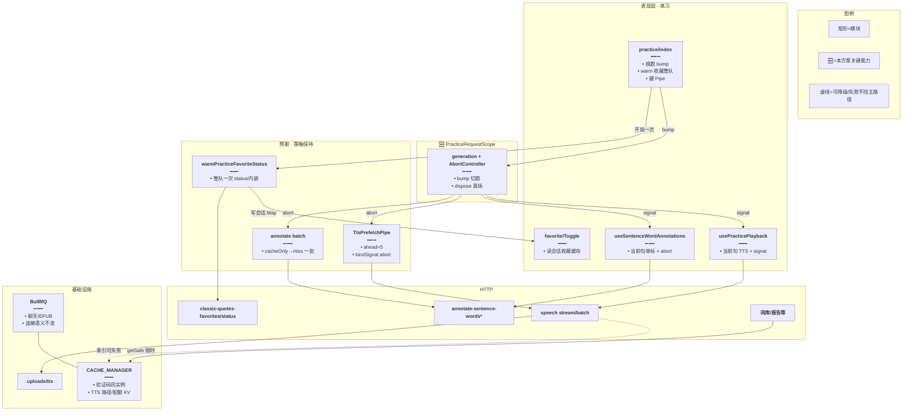
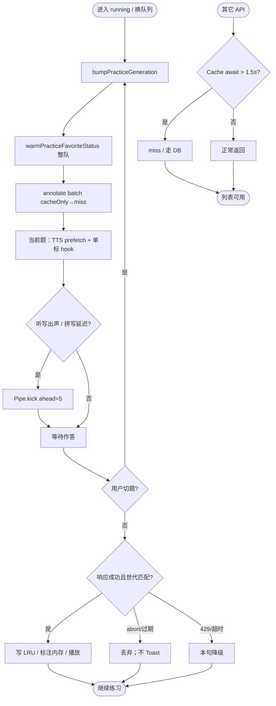
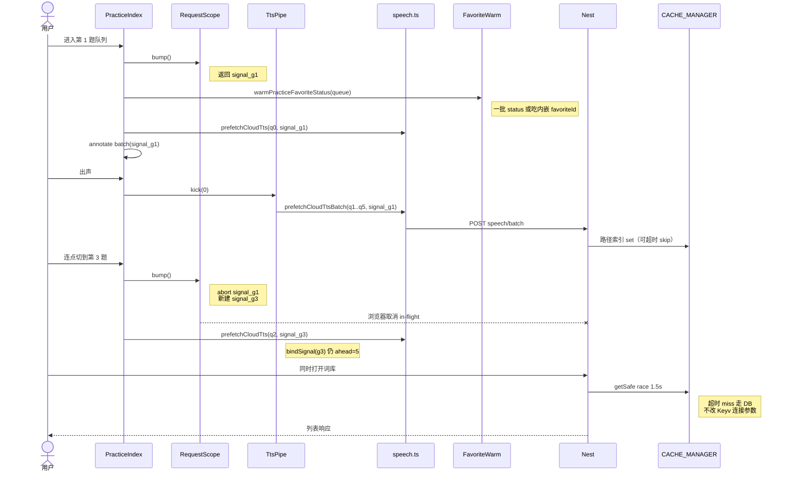
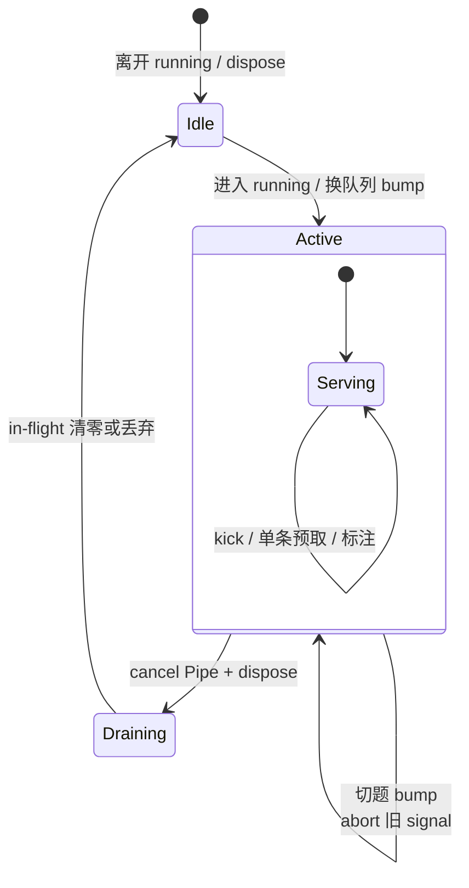
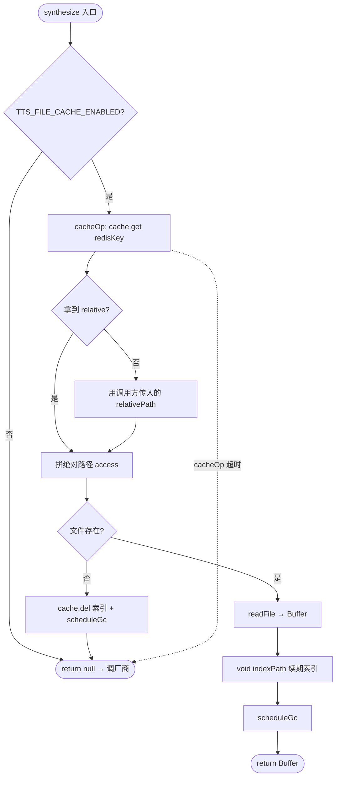
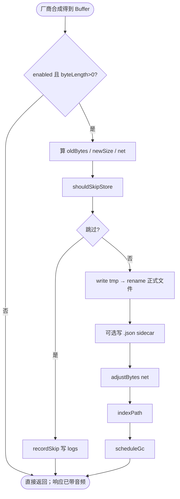
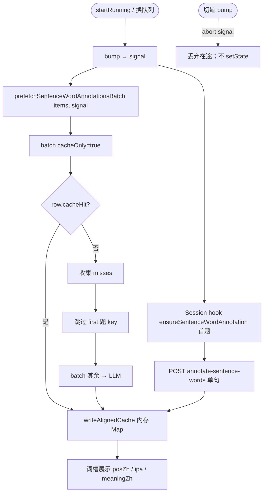

# 练习听写请求防阻塞 — 实现思路

> **状态**：定稿方案（核心能力已按本文落地；全局 Redis 连接语义保持改前）  
> **日期**：2026-09-27（§14 TTL 默认修订：2026-09-29 → **30 天**）  
> **需求摘要**：在**不削弱**听写 TTS（首题 stream + ahead=5 batch）与标注（首题单标 + 其余 miss 一批 LLM）的前提下，用世代 Abort、应用层 Cache 超时、TTS 复用全局 Cache、收藏整队预热，消除连点切题堆积与 Redis 连接雪崩，且**不改动**验证码 / Bull 等其它 Redis 业务逻辑。

## 延伸阅读

- 预取策略（已落地，本文**保持**）：[听写TTS分批预取.md](./听写TTS分批预取.md)
- TTS 落盘：[TTS本地文件缓存.md](../tts/TTS本地文件缓存.md)；**读写/配额/GC 详解见本文 §14**；**已落地归档**：[TTS缓存复用全局Cache.md](../../english/TTS缓存复用全局Cache.md)、[词库Cache超时旁路.md](../../english/词库Cache超时旁路.md)
- 整集标注：[经典句整集标注预热.md](./经典句整集标注预热.md)、[短语词槽标注.md](./短语词槽标注.md)；**开局两步 + Abort 见本文 §15**；**已落地**：[句内词标注断连取消.md](../../english/句内词标注断连取消.md)、[练习请求作用域与预热.md](../../english/练习请求作用域与预热.md)
- 前端：`practice/utils/practiceRequestScope.ts`、`practiceTtsPrefetchPipe.ts`、`sentenceWordAnnotationCache.ts`、`warmFavoriteStatus.ts`、`utils/speech.ts`、`hooks/useSentenceWordAnnotations.ts`、`hooks/usePracticePlayback.ts`、`practice/index.tsx`
- 后端：`tts-file-cache.service.ts`、`english-learning-library.cache.ts`、`annotateSentenceWords*`、`speech-transcription.controller.ts`（batch `req.aborted`）

---

## 0. 读本文你将得到什么

- **问题**：切题不 abort → TTS/标注堆积；TTS 曾单开 Redis → maxclients；每题打收藏 `status` → 多余 HTTP；全局乱改连接参数会伤验证码/Bull。
- **一句话方案**：**策略形状不变**；**PracticeRequestScope 真取消** + **词库/TTS 旁路短超时** + **TTS/配额复用 CACHE_MANAGER** + **开局整队收藏预热**；**全局 Cache/Bull 连接参数保持改前**。
- **改动层**：练习前端取消域；标注/TTS 请求 signal；TTS 文件缓存去专用 Redis；收藏 warm；annotate/TTS batch 感知断开。
- **详解专章**：**§14 TTS·Redis·配额**、**§15 句标注链路**（读实现细节优先看这两节）。
- **最大风险**：改全局 `enableOfflineQueue` / 弱重连 → Bull Worker 刷屏或验证码异常；本文明确禁止。

---

## 1. 需求与边界

### 1.1 用户故事

| 角色 | 场景 | 行为 | 期望结果 |
|------|------|------|----------|
| 学习者 | 经典句听写 20 题 | 进入第一题 | 尽快出声；后台照旧预取 TTS/标注 |
| 学习者 | 标注/TTS 未回就连点下一题 | 快速切题 | 旧请求 cancelled；新题可发；其它 API 不无限 pending |
| 学习者 | 练习中打开词库/收藏 | 并行请求 | 约 2s 内有响应（旁路超时 miss 走 DB） |
| 学习者 | 切换句子看星标 | 切题 | 不每题打一次 `…/favorites/status`（开局整队预热或内嵌 favoriteId） |
| 运维/开发 | Redis Cloud ≈30 连接 | 热重载 + 练习 | TTS 不再多占一条连接；Bull/Cache 行为与改前一致 |

### 1.2 范围

| 在范围内 | 不在范围内（非目标） |
|----------|----------------------|
| 练习 TTS/标注请求生命周期与 Abort | 缩小 ahead、取消「整队 miss 一批标」 |
| TTS 文件缓存去掉专用 ioredis，改用全局 Cache | 重做厂商 TTS 协议 |
| 词库 `getSafe` 应用层 race 超时 | 改验证码 / 会员 Cache 连接参数 |
| 练习开局收藏 status 整队预热 | 拆掉 BullMQ（聊天队列、EPUB 解析仍依赖） |
| annotate / TTS batch 感知 `req` 断开 | 整集 SSE 标注产品改版 |

### 1.3 约束与依赖

- **硬约束**：首题 TTS stream；出声后 Pipe `ahead=5`；开局 `cacheOnly` → 首题 hook + 其余 miss **一批 LLM**。
- **硬约束（Redis）**：`redis-config.factory` / `bull-redis-connection.factory` **连接语义与改前一致**；禁止为「防阻塞」给 Bull 设 `enableOfflineQueue: false`。
- **性能**：预取吞吐不降；切题浪费在途 ≤1 世代；无关 API 不被练习拖死。
- 复用：`practiceTtsPrefetchPipe`、`prefetchCloudTts*`、`prefetchSentenceWordAnnotationsBatch`、`CACHE_MANAGER`、`useIncremental*FavoriteStatus`。

---

## 2. 方案总览（一句话 + 要点）

**一句话方案**：策略满载保持；用 **世代 Abort** 清浏览器/半开请求；用 **调用方短超时** 保护词库旁路；TTS **只吃全局 Cache + 磁盘**；收藏 **开局 warm 一次**；**不动**验证码与 Bull 的 Redis 连接逻辑。

| # | 设计要点 | 理由 |
|---|----------|------|
| 1 | 策略零阉割（ahead=5、整队 miss 一批标） | 问题在生命周期，不在条数 |
| 2 | `PracticeRequestScope` 真 Abort | 释放连接槽；只 ignore 不够 |
| 3 | 词库/TTS：`Promise.race` 1.5s，非改 Keyv 连接 | 防 hang 且不影响验证码连接语义 |
| 4 | TTS 去掉专用 Redis；路径/配额写 `CACHE_MANAGER` | 少占 maxclients；与验证码同实例 |
| 5 | 过期 GC：mtime + 游标分批 | Keyv 无 ZSET；不在热路径 |
| 6 | `warmPracticeFavoriteStatus` + Toggle 带 `favoriteId` | 消灭「每切一句打 status」 |
| 7 | Nest：`req` close → 停 LLM chunk / TTS batch 后续句 | 前端 abort 后少烧模型 |
| 8 | Bull 保持 `enableOfflineQueue: true` | Worker `BZPOPMIN` 断线需排队，否则刷屏 |

---

## 3. 现状与复用

| 能力 | 仓库中已有 | 本需求中的用法 |
|------|------------|----------------|
| TTS Pipe ahead=5 | `practiceTtsPrefetchPipe.ts` | **保持**；`bindSignal` / `cancel` 真 abort |
| 云端预取 | `utils/speech.ts` | 增加 `signal`；abort 不写 LRU |
| 句标注预热 | `sentenceWordAnnotationCache.ts` | signal；未收藏也记会话已查 |
| 世代取消域 | `practiceRequestScope.ts` | **新增**；index 换题 bump |
| 收藏增量查询 | `useIncrementalClassicQuoteFavoriteStatus.ts` | **扩展** `warm*Session`；Toggle 传 favoriteId |
| 练习开局 | `practice/index.tsx` | bump + warm 收藏 + annotate signal |
| TTS 落盘 | `tts-file-cache.service.ts` | **去掉**独立 ioredis；只用 Cache+盘 |
| 词库旁路 | `english-learning-library.cache.ts` | `getSafe`/`setSafe` race 超时 |
| 全局 Cache | `redis-config.factory.ts` | **连接参数保持改前**；仅导出 `CACHE_COMMAND_TIMEOUT_MS` 常量 |
| Bull | `bull-redis-connection.factory.ts` | **保持** offline queue + 原重连；显式 `maxRetriesPerRequest: null` |
| 标注/TTS HTTP | english-learning / speech controllers | `clientDisconnectSignal` / `req.aborted` |

**调研结论**：预取策略已是高性能形态；缺口是取消域、TTS 多连 Redis、收藏逐题 status、以及曾误伤 Bull 的连接参数。定稿：**取消 + 应用层超时 + TTS 复用 Cache + 收藏 warm**，全局连接不动。

---

## 4. 架构图



**图内方法说明**：

| 方法 / 模块入口 | 功能 |
|-----------------|------|
| `bump()` / `dispose()` | 切题递增世代并 abort 旧 signal；离场 abort；保证仅当前世代写 UI/LRU |
| `createPracticeTtsPrefetchPipe` | 保持 ahead=5；`bindSignal`/`cancel` 中止在途 batch |
| `prefetchCloudTts(Batch)` | 带 `AbortSignal` 的单条/批量预取；abort 不写云端 LRU |
| `prefetchSentenceWordAnnotationsBatch` | 开局 cacheOnly→miss 一批；挂会话 signal |
| `warmPracticeFavoriteStatus` | 开局把整队收藏状态写入会话；避免 Toggle 逐题 POST status |
| `ensureSentenceWordAnnotation` | 当前句单标；cleanup abort；过期不 Toast |
| `getSafe` / TTS `cacheOp` | 对 Cache await 做 1.5s race；超时当 miss，不改 Keyv 连接 |
| `TtsFileCacheService.get/set` | 盘读写；路径/配额走全局 Cache；无独立 Redis |

**读图要点**：

- 预取层策略不变；🆕 是 Scope、收藏 warm、TTS 不再旁路新连接。
- Cache 与 Bull 共用云 Redis 实例，但**连接工厂参数保持改前**，防阻塞只做在调用方。

---

## 5. 主流程图



**图内方法说明**：

| 方法 | 功能 |
|------|------|
| `bumpPracticeGeneration` | 切题入口：abort 上一世代全部练习侧请求 |
| `warmPracticeFavoriteStatus` | 内嵌 favoriteId 则只写会话；否则一批 status |
| `Pipe.kick` | 从 cursor 后取最多 5 条未启动题打 batch |
| `丢弃结果` | aborted / 世代不匹配：禁止 setState 与污染缓存语义 |

**读图要点**：

- 左支练习预取满载；右支其它 API 靠应用层超时旁路。
- 切题一律回 bump，形成取消闭环。

---

## 6. 核心时序图



**图内方法说明**：

| 方法 | 功能 |
|------|------|
| `bump()` | 创建新 AbortController；abort 旧代 |
| `warmPracticeFavoriteStatus` | 开局一次写会话收藏态 |
| `kick` / `bindSignal` | 滑动窗口预取绑定当前 signal |
| `getSafe` | 词库限时读缓存，保护非练习 API |

**读图要点**：

- Happy path 仍是「首题 + 出声 batch + 整队标注」。
- 切题 abort 旧批；词库不依赖练习请求完成。

---

## 7. 状态机（请求世代）



**图内方法说明**：

| 方法 | 功能 |
|------|------|
| `cancel()` on Pipe | 会话结束 abort 并拒绝新 kick |
| `bump` | Active 内切题迁移，不离开 Active |

---

## 8. 模块职责与接口草图

### 8.1 模块一览

| 模块 | 职责 | 新增/改动 | 路径 |
|------|------|-----------|------|
| PracticeRequestScope | 世代 + AbortController | 新增 | `practice/utils/practiceRequestScope.ts` |
| TtsPrefetchPipe | ahead=5；真 abort | 扩展 | `practiceTtsPrefetchPipe.ts` |
| speech.ts | signal → fetch | 扩展 | `apps/frontend/src/utils/speech.ts` |
| sentenceWordAnnotationCache | batch/单句 signal | 扩展 | `sentenceWordAnnotationCache.ts` |
| warmFavoriteStatus | 开局整队收藏 | 新增 | `practice/utils/warmFavoriteStatus.ts` |
| Toggle / incremental hooks | 吃会话缓存；传 favoriteId | 扩展 | `components/favorite/Toggle.tsx` 等 |
| index / Session | bump / warm / 传 signal | 扩展 | `practice/index.tsx`、`Session.tsx` |
| TtsFileCacheService | 无专用 Redis；Cache+盘 | 扩展 | `tts-file-cache.service.ts` |
| Library cache | get/set race | 扩展 | `english-learning-library.cache.ts` |
| annotate / TTS batch | req 断开停后续 | 扩展 | english-learning / speech controllers |
| Redis factories | **连接语义保持改前** | 仅常量/显式 null | `redis-config.factory.ts`、`bull-redis-connection.factory.ts` |

### 8.2 关键接口（草图）

```typescript
// 练习侧统一取消域：一切预取/标注挂在当前世代
export type PracticeRequestScope = {
	// UI 写副作用前校验世代
	readonly generation: number;
	// 传给 fetch / http
	readonly signal: AbortSignal;
	// 切题或换队列：abort 旧控制器并换新
	bump: () => AbortSignal;
	// 离开 running：abort
	dispose: () => void;
};

// 与 queue 生命周期绑定
export function createPracticeRequestScope(): PracticeRequestScope;

// Pipe 保持 ahead；cancel/bindSignal 必须 abort 在途 batch
export function createPracticeTtsPrefetchPipe(
	texts: readonly string[],
	options?: { ahead?: number; signal?: AbortSignal },
): { kick: (cursor: number) => void; cancel: () => void; bindSignal: (s: AbortSignal) => void };

// 开局收藏：有内嵌 favoriteId 不打 HTTP；否则一批 status 写入会话
export function warmPracticeFavoriteStatus(items: PracticeItem[]): void;
```

### 8.3 数据模型

| 字段/实体 | 来源 | 存储 | 说明 |
|-----------|------|------|------|
| `generation` / `AbortSignal` | Scope | 内存 | 切题递增 |
| TTS LRU / 标注 Map | speech / annotation | 内存 | 仅未 abort 成功写入 |
| 收藏会话 Map | warm / Toggle | 内存模块级 | 含「已查未收藏」 |
| 路径索引 / 配额 bytes | TtsFileCache | `CACHE_MANAGER` | 与验证码同 Redis 实例 |
| MP3 | TtsFileCache | `uploads/tts` | 策略保持 |
| Bull 任务 | 聊天 / EPUB | Bull Redis 连接 | **连接参数不因本需求改坏** |

---

## 9. 分阶段实现步骤

| 阶段 | 目标 | 交付物 | 依赖 |
|------|------|--------|------|
| M1 | 真取消 | Scope + Pipe/speech/标注 signal | 无 |
| M2 | 旁路不挂死 | 词库/TTS `cacheOp` 超时；TTS 去专用 Redis | 可与 M1 并行 |
| M3 | 服务端少无效功 | req close 停 LLM / batch 后续句 | M1 |
| M4 | 收藏与连接纪律 | warm 收藏；**恢复**全局 Cache/Bull 连接语义 | M2 |

### M1

- [x] `createPracticeRequestScope`；index 进 running / 换题 bump
- [x] `prefetchCloudTts` / Batch / http 支持 signal
- [x] Pipe `cancel`/`bindSignal` abort；过期不写 LRU
- [x] 标注 batch + hook cleanup abort；过期不 Toast
- [x] 验收：连点切题，旧 speech/annotate 多为 cancelled

### M2

- [x] TTS：去掉独立 ioredis；路径/配额走 `CACHE_MANAGER`
- [x] TTS：`cache.set` 超时则跳过索引，音频仍返回
- [x] 词库 `getSafe`/`setSafe` 限时（应用层 race）
- [x] **不**改 Keyv/`disableOfflineQueue` 等全局连接（避免伤验证码）
- [x] 验收：Redis 慢时词库约 2s 内有响应；TTS 可降级

### M3

- [x] Nest：客户端 abort 时取消 annotate LLM chunk / TTS batch 后续句
- [x] 低噪声 abort / 超时日志
- [x] 验收：切题后服务端少长跑无用 LLM（抽样）

### M4

- [x] `warmPracticeFavoriteStatus` + Toggle 传 favoriteId；未收藏也记会话已查
- [x] Bull：`enableOfflineQueue: true`；显式 `maxRetriesPerRequest: null`
- [x] 运维：热重载后完整重启；ai/admin 勿共抢 30 连接
- [x] 验收：切题不再刷 `…/favorites/status`；Bull 不再因 offlineQueue=false 刷屏

---

## 10. 关键决策与备选方案

| 决策 | 选用 | 备选 | 为何不选备选 |
|------|------|------|--------------|
| 预取条数 | 保持 ahead=5 + 整队 miss 一批标 | 减预取 | 伤体验；不治 Redis 传染 |
| 防阻塞主手段 | Abort + 应用层超时 | 改全局 Keyv/Bull 连接 | 会伤验证码 / Worker BZPOPMIN |
| TTS Redis | 复用 `CACHE_MANAGER` | 独立 ioredis / ZSET | 多占连接 → maxclients |
| TTS 过期 | mtime + 游标分批 | 专用 ZSET | 需额外命令与连接风险 |
| 收藏 status | 开局 warm 一次 | 每题 Toggle 查 | Network 刷屏 |
| BullMQ | 保留 | 拆掉 | 聊天队列与 EPUB 解析仍依赖 |

---

## 11. 风险、边界与待确认

| 项 | 等级 | 说明 | 缓解 |
|----|------|------|------|
| 误改 Bull `enableOfflineQueue` | 高 | Worker 刷「Stream isn't writeable…」 | 工厂保持 true；与 Cache fail-open 分离 |
| 热重载僵尸连接 | 高 | 仍易打满 30 | 完整重启；控制台踢 idle |
| LLM 429 | 中 | 标注失败 502 | abort 减并发；产品可提示稍后 |
| CACHE 超时误 miss | 低 | 偶发多打 DB | 1.5s 阈值；fail-open 可接受 |
| mtime GC 目录极大 | 低 | 扫盘变慢 | 游标分批；达十万级再议本地索引 |

**待确认**：

- [ ] Redis Cloud 是否可提 maxclients 或开发改本地（验证：控制台 / `.env`）
- [ ] 多实例部署时配额 bytes 是否需原子 INCR（验证：现单实例 Cache set 是否够用）

---

## 12. 验收清单

| # | 用例 | 步骤 | 期望 |
|---|------|------|------|
| AC1 | 策略·TTS | 听写首题出声看 Network | 当前 stream + 随后 batch≈5 |
| AC2 | 策略·标注 | 开局 miss 多句 | cacheOnly + 其余一批 annotate |
| AC3 | 连点切题 | 快速下一题 10 次 | 旧 speech/annotate 多为 cancelled |
| AC4 | 无关 API | 切题同时开词库 | 约 2s 内有响应 |
| AC5 | 收藏 status | 连续切 10 题 | 不应每题一条 `…/status`（开局已 warm） |
| AC6 | TTS Redis | 练习写盘看日志 | 无「TTS ZSET Redis」「独立 Redis 已连接」 |
| AC7 | Bull | 正常启动后空闲 | 无 offlineQueue=false 刷屏 |
| AC8 | 验证码 | 登录发码/校验 | 与改前行为一致 |
| AC9 | 离场 | 离开 running | Pipe dispose；无新 kick |
| AC10 | 429 | 标注失败 | 不拖死其它路由 |

---

## 13. 预估改动面（实现阶段参考）

| 类型 | 路径 |
|------|------|
| 前端 | `practiceRequestScope.ts`、`practiceTtsPrefetchPipe.ts`、`sentenceWordAnnotationCache.ts`、`warmFavoriteStatus.ts`、`speech.ts`、`fetch.ts`（signal）、hooks、`Toggle.tsx`、`practice/index.tsx` |
| 后端 | `tts-file-cache.service.ts`、`tts-file-cache.keys.ts`、`english-learning-library.cache.ts`、annotate/TTS controllers；factories **仅常量/显式 null，连接语义同改前** |
| 文档 | 本文；落地后可另用 `implementation-doc-from-diff` 归档到 `wiki/english/` |

---

## 14. TTS · Redis · 配额 — 实现逻辑详解

> 对应源码：`tts-file-cache.service.ts`、`tts-file-cache.keys.ts`、各 `*-tts.service.ts` 的 `fileCache.get/set`；练习侧预取见 [听写TTS分批预取.md](./听写TTS分批预取.md)。  
> **默认 TTL（2026-09-29）**：`TTS_FILE_CACHE_TTL_SEC` 未配置时为 **`2592000`（30 天）**（原 7 天）；路径索引 `cache.set(..., ttlMs)` 与盘文件 mtime 过期判据、配额 `bytes` key TTL 均同此量级。详见 [TTS本地文件缓存.md](../tts/TTS本地文件缓存.md) §0.1。

### 14.1 三层存储分别干什么

| 层 | 存什么 | 谁读写 | 失败时 |
|----|--------|--------|--------|
| **磁盘** `uploads/tts/*.mp3`（可选 `.json` 边界） | 音频本体 | `TtsFileCacheService.get/set` | 写失败则本次不落盘；响应里仍可带内存 Buffer |
| **CACHE_MANAGER**（全局 Redis，与验证码同连接） | ① 路径索引 `tts:file:v1:{provider}:{paramHash}:{textHash}` → 相对路径<br/>② 配额计数 `tts:file:v1:bytes` → 已用字节 | `cache.get/set/del`，经 `cacheOp` 限时 | 超时/失败 → 当 miss；**不挡**音频返回 |
| **进程内存** `usedBytesApprox` | 配额镜像，加速 `shouldSkipStore` | 启动 `seedUsedBytes` + 写删时 `adjustBytes` | 与 Cache 不一致时下次启动再校准 |

**禁止**：再 `new Redis()` 做 ZSET/INCR。Keyv 只有 KV，过期用磁盘 mtime GC。

### 14.2 Key 与文件名怎么算

```typescript
// 由厂商 + 音色等参数拼串再哈希，避免不同音色撞文件
const paramHash = sha256Hex(paramParts.join('\u0001'));
// 规范化后的合成文本哈希
const textHash = sha256Hex(normalizedText);
// Cache 索引用完整 hash；文件名用各 12 位短缀防路径过长
const redisKey = `tts:file:v1:${provider}:${paramHash}:${textHash}`;
const relativePath = `tts/${provider}_${paramHash.slice(0, 12)}_${textHash.slice(0, 12)}.mp3`;
```

合成服务（Edge / MiniMax / 讯飞等）先 `buildTtsFileIds` → `fileCache.get` 命中则直接返回；miss 调厂商后 `fileCache.set`。

### 14.3 读路径（get）



**图内方法说明**：

| 方法 | 功能 |
|------|------|
| `cacheOp(run, label)` | 对 Cache await 做 `CACHE_COMMAND_TIMEOUT_MS`（1.5s）race；超时打 warn 并返回 `undefined` |
| `indexPath` | `cache.set(redisKey, relativePath, ttlMs)`；失败则 skip，不抛到合成主路径 |
| `scheduleGc` | 距上次 ≥60s 才异步 `gcExpired`，不阻塞当前请求 |

### 14.4 写路径（set）与配额门闩



**`shouldSkipStore` 三条门闩（任一满足则不落盘）**：

| 条件 | 含义 |
|------|------|
| `newSize > maxBytes`（单文件） | 单文件超过预算上限（`TTS_FILE_CACHE_MAX_MB`，默认 2048MB 总量口径下的单文件保护） |
| `usedBytesApprox + net > maxBytes` | 总量配额将超；`used` 来自内存镜像（权威在 Cache `tts:file:v1:bytes`） |
| `diskFree < newSize + 64MB` | 磁盘余量不足；**不删旧文件腾地方**，只跳过本次写 |

跳过时：音频仍在 HTTP 响应内存中返回；并 `logsService.createSafe` 记 `reason`（`over_budget_*` / `disk_insufficient`）。

### 14.5 配额的生命周期

| 时机 | 行为 |
|------|------|
| 进程启动 `ensureReady` | `seedUsedBytes`：先 `cache.get(TTS_FILE_BYTES_KEY)`；没有则 `readdir`+`stat` 汇总后 `persistUsedBytes` |
| 成功 `set` | `adjustBytes(+net)` → 更新内存 → `cache.set(bytesKey, used, **30d** TTL)` |
| GC 删除 | `adjustBytes(-freed)` 同上 |
| Cache 超时 | `persist`/`get` fail-open；内存镜像仍可用于当次判断；下次启动再校准 |
| bytes key TTL 到期 | 视为无缓存，启动时再扫盘 |

**与验证码 Redis 的关系**：共用 Nest 全局 `CACHE_MANAGER` 背后的那条 Redis；**只多几个 KV key**，不新开客户端。验证码仍是 `cache.set(Captcha_…)`，连接工厂参数与改前一致。

### 14.6 Redis 角色分工（本需求相关）

| 用途 | 连接来源 | 本需求是否改连接语义 |
|------|----------|----------------------|
| 验证码 / 会员旁路 / TTS 路径·配额 | `RedisConfigFactory` → Keyv | **否**（仅业务侧 `cacheOp`/`getSafe` race） |
| Bull 聊天队列 / EPUB 解析 | `createBullRedisConnectionOptions` | **否**（保持 `enableOfflineQueue: true`；显式 `maxRetriesPerRequest: null`） |
| TTS 专用 ioredis（已删除） | — | 已移除，避免 maxclients |

词库列表旁路：`EnglishLearningLibraryCache.getSafe/setSafe` 对 `cache.get/set` 做同样 1.5s race，超时当 miss 走 DB——**只影响英语词库旁路**，不改 Keyv 全局选项。

### 14.7 过期 GC（mtime + 游标）

- **TTL**：默认 `ttlMs = 30 × 24 × 3600 × 1000`（一个月）；可用 env `TTS_FILE_CACHE_TTL_SEC` 覆盖。
- 触发：`get`/`set` 成功路径上 `scheduleGc`（最少间隔 60s）。
- 算法：`readdir` 得 `.mp3` 列表 → 从 `gcCursor` 起轮询 `stat.mtimeMs` → `mtime < now - ttlMs` 则删（含 sidecar `.json`）→ 最多每轮 `GC_BATCH=32`。
- **不在请求热路径同步全量扫盘**；目录极大时再考虑本地索引，而不是复活专用 Redis ZSET。

### 14.8 与练习前端预取的衔接

| 前端 | 后端 |
|------|------|
| `prefetchCloudTts` → `POST …/speech`（stream） | 服务内 `fileCache.get` → miss 则厂商 → `set` |
| `prefetchCloudTtsBatch` → `POST …/speech/batch` | 逐句合成；`req.aborted` 则 break 后续句 |
| 浏览器 LRU（会话 100） | 与盘缓存互补：前端命中可不发请求 |

切题时前端 `AbortSignal` 取消 HTTP；已写入盘/Cache 的文件保留，供后续同文案命中。

---

## 15. 句标注 — 实现逻辑详解

> 对应：前端 `sentenceWordAnnotationCache.ts`、`useSentenceWordAnnotations.ts`；后端 `annotateSentenceWords` / `annotateSentenceWordsBatch`（DB 缓存 + LLM）。

### 15.1 产品策略（保持形状）

开局经典句队列：

1. **整队** `POST …/annotate-sentence-words/batch` 且 `cacheOnly: true` → 只查库，命中灌前端内存。
2. **miss**：队列**首题**交给 Session 的 `useSentenceWordAnnotations` **单句**打模型（用户正在看的那句优先）。
3. **其余 miss** 再 `batch`（非 cacheOnly）**一批**调模型写库，避免 N 次单句。

切题 / 离场：请求挂 `PracticeRequestScope.signal`，abort 后不写内存、不 Toast。

### 15.2 前端数据流



**图内方法说明**：

| 方法 | 功能 |
|------|------|
| `prefetchSentenceWordAnnotationsBatch` | 开局两步预热；`signal.aborted` 则中止第二步 |
| `fillMissesWithLlm` | 去首后批量 LLM；silent；abort 不写缓存 |
| `ensureSentenceWordAnnotation` | 单句；内存/inflight 去重；与开局共享 inflight 防双打 |
| `writeAlignedCache` | 按分词下标对齐 `posZh/ipa/meaningZh` 写入 `Map` |
| `useSentenceWordAnnotations` | cleanup `AbortController.abort`；过期错误不 Toast |

内存 key：`${english.toLowerCase()}::${words.join('\0')}`。

### 15.3 后端 batch / 单句

| API | 行为 |
|-----|------|
| `POST …/annotate-sentence-words` | 查 `sentence_word_annotation` 表 → hit 返回；miss → LLM → upsert；支持 `signal`（`clientDisconnectSignal(req)`） |
| `POST …/annotate-sentence-words/batch` | `cacheOnly`：只查库，miss 占位 `cacheHit:false`；否则 miss 按 chunk 多句一次 LLM；chunk 间检查 `signal.aborted` |
| 进程内 inflight | 同 `cacheKey` 单飞，避免并发双打模型 |

**断开感知**：Controller 把 `req` close/aborted 转成 `AbortSignal` 传入 Service → `invokeEnglishPackSubModelJson({ signal })`；abort 抛 `AbortError`，不污染「空 words 当成功」的缓存语义。

### 15.4 与防阻塞的交叉点

| 场景 | 行为 |
|------|------|
| 连点切题 | 前端 abort 单句/batch；后端少做后续 LLM chunk |
| 智谱 429 | batch/单句失败 → 502/静默；Scope abort 降低叠加请求 |
| 开局 miss 很多 | 仍一批 LLM（策略保持）；生命周期受 signal 约束 |

### 15.5 接口草图（标注）

```typescript
// 开局预热：策略两步不变；可随会话 dispose abort
export function prefetchSentenceWordAnnotationsBatch(
	// 队列每句 english + 分词
	items: { english: string; words: string[] }[],
	// 练习世代 signal；abort 后不写内存
	opts?: { signal?: AbortSignal },
): void;

// 当前句单标：与开局 inflight 去重
export function ensureSentenceWordAnnotation(params: {
	english: string;
	words: string[];
	silent?: boolean;
	signal?: AbortSignal;
}): Promise<SentenceWordMeta[]>;
```

---

（本文档为定稿实现思路；与 [听写TTS分批预取.md](./听写TTS分批预取.md) 关系：**彼文定预取策略，本文定防阻塞 + TTS/Redis/配额 + 标注生命周期**。TTS 落盘产品背景另见 [TTS本地文件缓存.md](../tts/TTS本地文件缓存.md)。）
