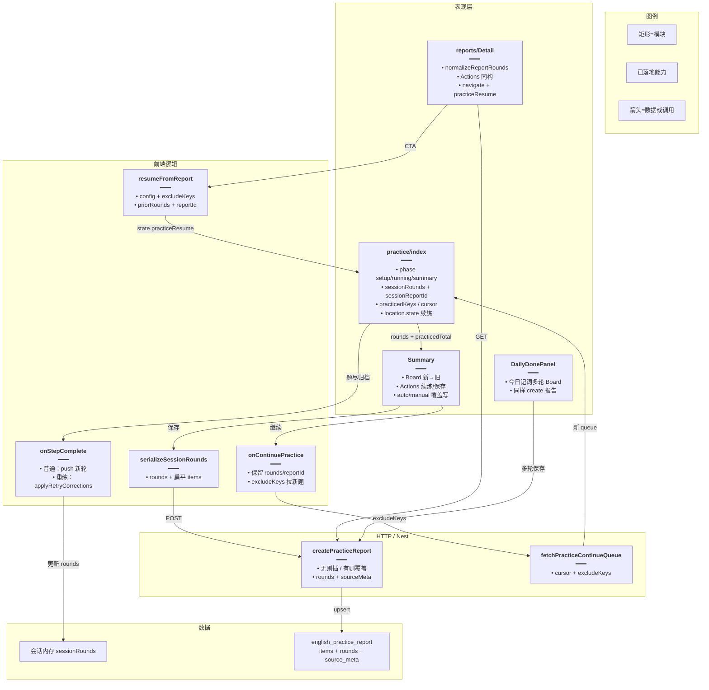
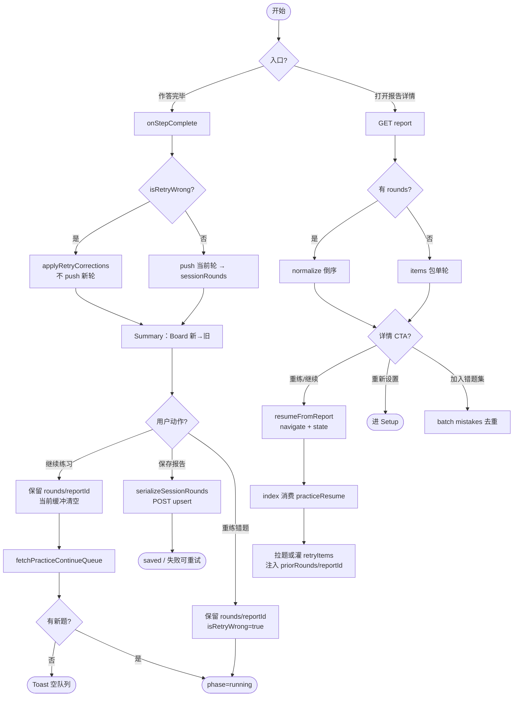
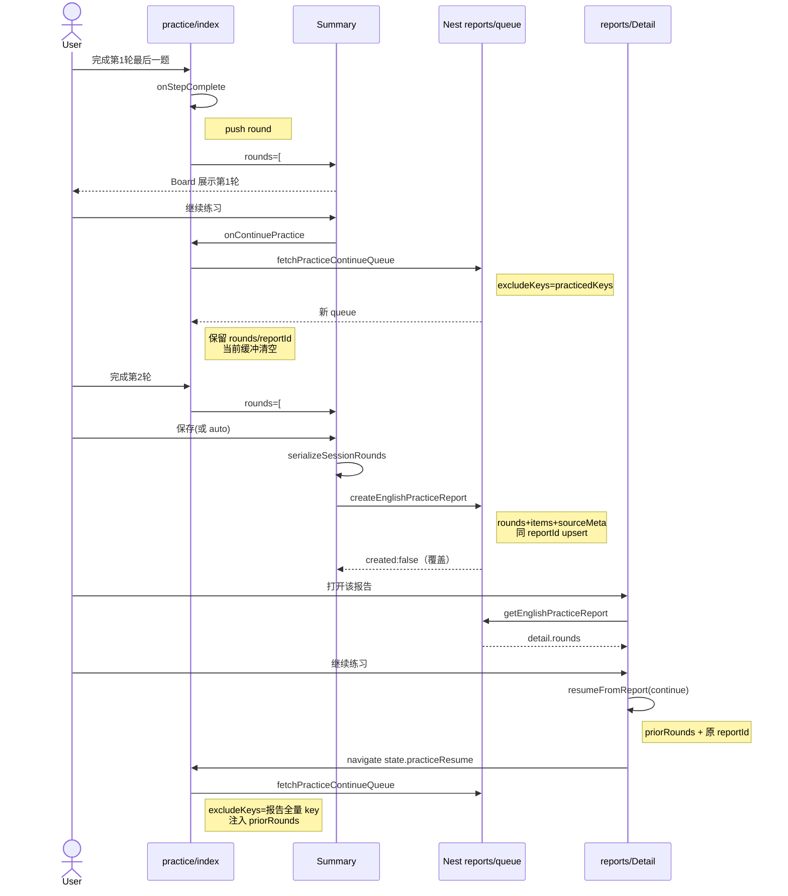
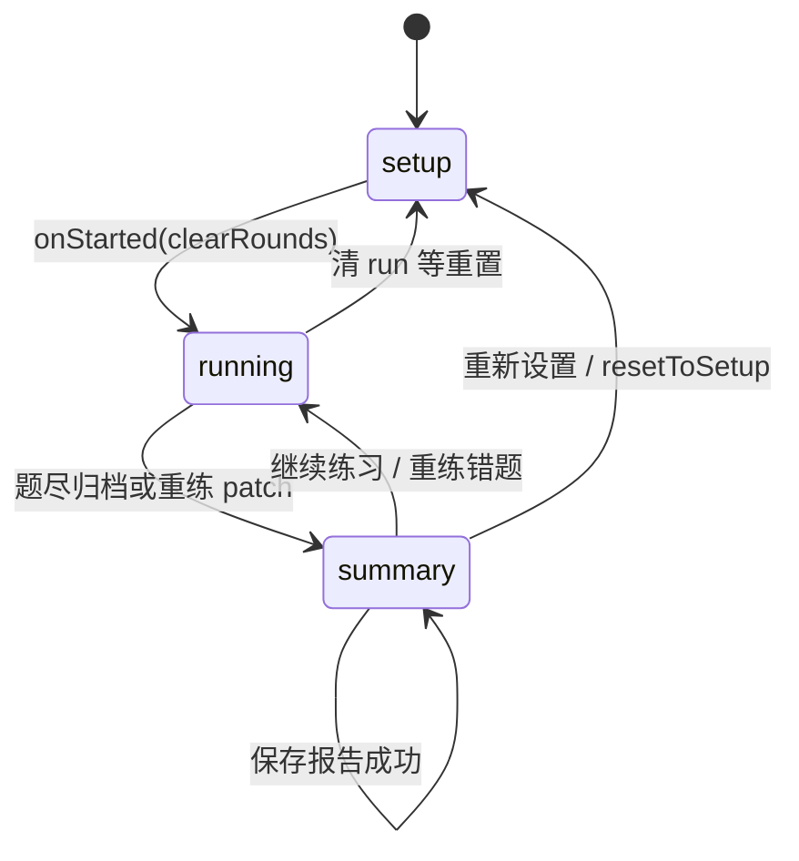

# 练习多轮结算与报告续练 — 实现思路

> **状态**：核心已落地  
> **日期**：2026-09-24  
> **需求摘要**：听写/拼写（及今日记词）「继续练习」后，结算与入库报告保留历轮对错明细并按新→旧分区展示；同一 `reportId` 覆盖写入；报告详情可重练错题 / 继续练习 / 重新设置 / 加入错题集，并带回历轮与原报告 id 就地续写。

## 延伸阅读

- 单场报告存档（手动/自动、列表/详情底座）：[练习报告存档.md](./练习报告存档.md)
- 实现归档（创建/列表/详情端到端）：[`wiki/english/练习报告.md`](../../english/练习报告.md)
- 结算共享 UI：`apps/frontend/src/views/englishLearning/components/result/`（`Board` / `Actions` / `Stats`）
- 路由态：`apps/frontend/src/views/englishLearning/practice/index.tsx`
- 报告详情：`apps/frontend/src/views/englishLearning/practice/reports/Detail.tsx`
- 续练还原：`apps/frontend/src/views/englishLearning/practice/utils/resumeFromReport.ts`
- 实体：`apps/backend/src/services/english-learning/entity/english-practice-report.entity.ts`

---

## 0. 读本文你将得到什么

- **问题**：继续练习曾清空 `results`，结算/报告只剩本轮；详情只能看不能续练；缺 `libraryId`/`streamId` 时无法精确续拉。
- **一句话方案**：会话 `sessionRounds[]` 归档每轮；结算/详情用共享 `Board` 按新→旧分区；报告 JSON 存 `rounds` + 扁平 `items` + `sourceMeta`；同 `reportId` 覆盖；详情 `resumeFromReport` 注入 `location.state`。
- **改动层**：练习/今日记词路由态、Summary/DailyDone、Detail、DTO/实体/migration、`createPracticeReport` upsert。
- **阶段**：M1～M3 均已落地；今日记词多轮+存报告已对齐。
- **最大风险**：旧报告无 `rounds` 须单轮包装；覆盖写入会刷新 `createdAt`（列表按最近保存排序）。

---

## 1. 需求与边界

### 1.1 用户故事

| 角色 | 场景 | 行为 | 期望结果 |
|------|------|------|----------|
| 学习者 | 第 1 轮结算后再「继续练习」完成第 2 轮 | 打开结算 | 上方最新一轮，下方上一轮；「本轮」= 最新轮；「已练习」= 累计去重 key |
| 学习者 | 自动/手动保存 | 保存或回看详情 | 报告含全部已完成轮次；同会话同 `reportId` 覆盖 |
| 学习者 | 结算「重练错题」 | 做对后回结算 | **不追加轮次**；历轮中对应错题就地改对；可再覆盖保存 |
| 学习者 | 报告详情「重练错题 / 继续练习」 | 点 CTA | 带回 `priorRounds` + 原 `reportId`，续写同一行报告 |
| 学习者 | 报告详情「重新设置」 | 点 CTA | 进 Setup（不强制带回历轮） |
| 学习者 | 报告详情「加入错题集」 | 点按钮 | 全轮错题按 key 去重后 batch |

### 1.2 范围

| 在范围内 | 不在范围内（非目标） |
|----------|----------------------|
| 听写/拼写会话多轮结算 + 报告 `rounds` | 跨设备未保存的断点续练 |
| 详情续练 CTA + `sourceMeta` | 报告列表页内联续练 |
| 旧报告仅 `items` 兼容 | 改写 SRS / 错题集语义 |
| 今日记词 `sessionRounds` + 存报告 | 每轮单独一行报告（已否决） |

### 1.3 约束与依赖

- 须登录才能保存/拉报告。
- 单场硬顶 `ENGLISH_PRACTICE_SESSION_MAX = 100`；多轮合计软顶 `100 × 20`；`rounds` 数组 ≤20。
- 复用 `components/result` 的 `Board` / `Actions`；拉词 `fetchPracticeContinueQueue`。
- Ponytail：扩展 JSON，不为轮次新建多表。

---

## 2. 方案总览（一句话 + 要点）

**一句话方案**：`sessionRounds` 为内存真相源；`serializeSessionRounds` 产出 `rounds`+扁平 `items`；后端同 id 覆盖；详情 `resumeFromReport` 还原配置并沿用原报告 id。

| # | 设计要点 | 理由 |
|---|----------|------|
| 1 | 继续练习只清当前轮缓冲，保留 `sessionRounds` / `sessionReportId` | 根因是历史 `setResults([])` 丢归档 |
| 2 | UI：共享 `Board`，新→旧 × 轮内错→对 | 结算与详情同构 |
| 3 | 报告存 `rounds[]`，扁平 `items` 派生 | 列表正确率与旧客户端兼容 |
| 4 | 同会话同 `reportId` **覆盖**（含刷新 `createdAt`） | 避免继续 N 次刷出 N 条列表 |
| 5 | 重练错题：`applyRetryCorrections` 就地改对，不 push 新轮 | 与「继续多轮」语义分离，且详情续练可就地改正后覆盖 |
| 6 | `sourceMeta`：`libraryId` / `streamId` / `poolTotal` | 详情「继续」精确还原词库/Pack |

---

## 3. 现状与复用

| 能力 | 仓库中已有 | 本需求中的用法 |
|------|------------|----------------|
| 练习路由态 | `practice/index.tsx` | **扩展**：`sessionRounds` / `sessionReportId` / resume 注入 |
| 结算保存 | `Summary.tsx` `savePracticeReportOnce` | **扩展**：`serializeSessionRounds` + `sourceMeta`；`roundsSaveSig` 触发再存 |
| 共享结果板 | `components/result/*` | **直接复用**：Summary / Detail / DailyDone |
| 继续拉词 | `fetchPracticeContinueQueue` | **直接复用**：会话继续 + 详情 continue |
| 报告 CRUD | `create/list/get/remove` | **扩展**：upsert、`rounds`/`sourceMeta` 读写 |
| 序列化 | `utils/serializeRounds.ts` | **新增** |
| 续练还原 | `utils/resumeFromReport.ts` | **新增** |
| 今日记词结算 | `daily/index.tsx` + `DailyDonePanel` | **扩展**：对齐多轮 + 存报告 |
| migration | `1790131522028-english_practice_report_rounds.ts` | **新增** `rounds`、`source_meta` 列（空壳 `1790131515957` 可忽略） |

**调研结论**：报告底座（手动/自动、列表/详情）已在先落地；本需求只补「历轮内存 → JSON → 详情续练」闭环。重练采用就地改对而非「新开会话清空轮次」（与早期规划备选不同，以源码为准）。

---

## 4. 架构图



**图内方法说明**：

| 方法 / 模块入口 | 功能 |
|-----------------|------|
| `onStepComplete` | 当前轮缓冲累加；题尽时普通路径 push 新 `PracticeSessionRound`，重练路径调用 `applyRetryCorrections` 后进 summary |
| `applyRetryCorrections` | 用本趟做对的 key 把历轮对应 wrong 改成 correct（不追加轮次） |
| `onContinuePractice` | 保留 `sessionRounds`/`sessionReportId`，按 `practicedKeys` 拉下一页 |
| `serializeSessionRounds` | 会话轮次 → 报告 `rounds[]` + 扁平 `items` |
| `savePracticeReportOnce` | 生成或复用 `sessionReportId`，POST 全量 rounds；`roundsSaveSig` 变化可再存 |
| `resumeFromReport` | 详情 CTA：还原 `PracticeSetupConfig`、excludeKeys、priorRounds、原 reportId |
| `normalizeReportRounds` | 详情展示：有 rounds 则倒序；否则把扁平 items 包成单轮 |
| `createPracticeReport` | 后端：同 `(id,userId)` 覆盖更新；缺 rounds 时用 items 包单轮；刷新 `createdAt` |
| `fetchPracticeContinueQueue` | 顺序/随机下一页并排除已练 key |

**读图要点**：

- 内存真相源在 `index`；Summary 只展示与保存。
- 详情续练不是改历史行的「编辑器」，而是带着原 id 与历轮快照再进练习机，保存时覆盖同一行。
- 今日记词走同一报告 API，UI 共用 `Board`。

---

## 5. 主流程图



**图内方法说明**：

| 方法 | 功能 |
|------|------|
| `onStepComplete` | 分流普通归档 vs 重练就地改对 |
| `applyRetryCorrections` | 历轮错题 patch |
| `onContinuePractice` / `onRetryWrong` | summary → running；均保留 rounds/reportId |
| `fetchPracticeContinueQueue` | 继续拉题；空集 Toast |
| `serializeSessionRounds` + `savePracticeReportOnce` | 多轮落库 |
| `getEnglishPracticeReport` | 详情加载 |
| `resumeFromReport` / `normalizeReportRounds` | 详情展示与续练注入 |
| `peekPracticeResume` | index 启动时读 `location.state` |

**读图要点**：

- 「继续」只重置当前轮缓冲；「重练」改历轮对错而不增轮。
- 详情续练统一回到练习路由，不在详情内嵌 Session。
- 旧报告无 `rounds` 时降级单轮，读写不炸。

---

## 6. 核心时序图



**图内方法说明**：

| 方法 | 功能 |
|------|------|
| `onStepComplete` | 归档第 1/2 轮 |
| `onContinuePractice` | 保留历轮并拉新题 |
| `serializeSessionRounds` | 内存 → 报告 JSON |
| `createEnglishPracticeReport` / `createPracticeReport` | 前端 POST / 后端 upsert |
| `getEnglishPracticeReport` | 详情拉取 |
| `resumeFromReport` | 详情 → 练习页注入态 |

**读图要点**：

- Happy path：两轮继续 → 覆盖存报告 → 详情再继续仍写回同一行。
- 与早期「详情续练必须新 reportId」规划相反：现网 continue/retryWrong **沿用原 id**，便于就地改正后覆盖。

---

## 7. 状态机（会话）



**图内方法说明**：

| 方法 | 功能 |
|------|------|
| `onStarted` / `startRunning({ clearRounds: true })` | 新开局清空 rounds 与 reportId |
| `onContinuePractice` / `onRetryWrong` | summary→running；**不清** rounds/reportId |
| `resetToSetup` | 清空 rounds / practicedKeys / cursor / reportId |

**读图要点**：多轮只活在 `setup↔running↔summary`；离开练习页丢内存（已入库报告除外）。详情续练相当于带着 priorRounds 从外部切入 `running`。

---

## 8. 模块职责与接口草图

### 8.1 模块一览

| 模块 | 职责 | 新增/改动 | 路径 |
|------|------|-----------|------|
| 练习路由态 | rounds 归档、续练、resume | 扩展 | `practice/index.tsx` |
| 类型 | Round / SummaryProps | 扩展 | `practice/types.ts` |
| 序列化 | rounds ↔ 报告 items | 新增 | `practice/utils/serializeRounds.ts` |
| 续练还原 | 报告 → ResumeState | 新增 | `practice/utils/resumeFromReport.ts` |
| Summary | 多轮 Board + 覆盖保存 | 扩展 | `practice/Summary.tsx` |
| 报告详情 | 分区 + Actions + resume navigate | 扩展 | `practice/reports/Detail.tsx` |
| 共享结果 UI | Board / Actions / Stats | 抽取复用 | `components/result/*` |
| 今日记词 | 多轮 + 存报告 | 扩展 | `daily/index.tsx`、`DailyDonePanel.tsx` |
| DTO / Entity | rounds、sourceMeta | 扩展 | dto / entity / migration |
| Service | upsert create + get 回传 | 扩展 | `english-learning.service.ts` |

### 8.2 关键接口（草图）

```typescript
// 会话内已完成一轮；仅「继续练习」追加
type PracticeSessionRound = {
	// 从 1 递增，展示「第 N 轮」
	roundIndex: number;
	// 本轮作答（含 userInput / correct）
	results: PracticeAttemptResult[];
	// 进结算时刻 ISO
	completedAt: string;
};

// 详情续练注入 location.state.practiceResume
type PracticeResumeState = {
	// continue | retryWrong | setup
	intent: PracticeResumeIntent;
	// 还原后的 Setup 配置（含 sourceMeta 字段）
	config: PracticeSetupConfig;
	// 已练 key，供继续拉题排除
	excludeKeys: string[];
	// 重练队列（仅 retryWrong）
	retryItems?: PracticeItem[];
	// 历轮带回，便于覆盖保存
	priorRounds?: PracticeSessionRound[];
	// 沿用原报告 id；setup 意图不带
	reportId?: string;
};

// 把报告还原成可续练配置与队列线索
function resumeFromReport(
	detail: EnglishPracticeReportDetail,
	intent: PracticeResumeIntent,
): PracticeResumeState;
```

### 8.3 数据模型

| 字段/实体 | 来源 | 存储 | 说明 |
|-----------|------|------|------|
| `sessionRounds` | 练习/今日记词页 | 内存 | 已完成轮 |
| `sessionReportId` | 首次保存生成 | 内存 | 同会话覆盖键 |
| `practicedKeys` | 拉题累加 | 内存 | 「已练习」去重 |
| `report.rounds` | 序列化 | DB JSON 可空 | 旧行 null → 读时单轮包装 |
| `report.items` | rounds 扁平 | DB JSON | 列表 `totalCount`/`correctCount` |
| `report.sourceMeta` | config | DB JSON 可空 | libraryId / streamId / poolTotal |

---

## 9. 分阶段实现步骤

| 阶段 | 目标 | 交付物 | 依赖 |
|------|------|--------|------|
| M1 | 会话多轮 + 结算 UI | `sessionRounds`、Board 按轮倒序 | 无 |
| M2 | 报告读写 rounds + upsert | migration、DTO、serialize、覆盖写 | M1 |
| M3 | 详情续练 + sourceMeta | `resumeFromReport`、Detail Actions | M2 |
| M4 | 今日记词对齐 | Daily `sessionRounds` + 存报告 | M2 |

### M1（已完成）

- [x] `index.tsx`：`sessionRounds`；题尽归档；继续不清归档
- [x] Summary：接收 `rounds`；Board 新→旧、轮内错→对
- [x] 统计：本轮=最新轮；已练习=`practicedKeys.length`
- [x] 重练：就地 `applyRetryCorrections`（保留 rounds）

### M2（已完成）

- [x] payload / Detail 类型含 `rounds?`、`sourceMeta?`
- [x] entity + migration；缺 rounds 单轮包装
- [x] `serializeSessionRounds`；扁平 items = concat
- [x] 同 `reportId` 覆盖；刷新 `createdAt`
- [x] 软顶：rounds ≤20，items ≤100×20

### M3（已完成）

- [x] `resumeFromReport` + `location.state.practiceResume`
- [x] Detail 挂载与结算同构 Actions
- [x] 加入错题集：全轮去重 batch
- [x] `sourceMeta` 读写

### M4（已完成）

- [x] Daily 多轮展示与继续
- [x] DailyDone 写入报告（含 rounds）

---

## 10. 关键决策与备选方案

| 决策点 | 选用 | 备选 | 为何选推荐 |
|--------|------|------|------------|
| 多轮存在哪 | 会话数组 + 报告 `rounds` JSON | 每轮一行 + sessionId | 少表、详情一次拉齐 |
| 继续后多次保存 | **同一 reportId 覆盖** | 每轮新建报告 | 列表不刷屏；幂等键复用 |
| 已练习语义 | 去重 `itemKey` | 作答次数 | 与 `practicedKeys` 一致 |
| 重练错题 | **就地改对历轮** | 新开会话清空 rounds | 详情带回历轮后可就地改正再覆盖 |
| 详情续练 reportId | **沿用原 id** | 强制新 id | 与覆盖策略一致 |
| 缺 libraryId | 存 `sourceMeta` | 仅 favorites 可继续 | 覆盖词库/Pack 主路径 |

---

## 11. 风险、边界与待确认

| 项 | 等级 | 说明 | 缓解 |
|----|------|------|------|
| 旧报告无 rounds | 低 | 详情空白 | `normalizeReportRounds` 单轮包装 |
| 覆盖刷新 createdAt | 中 | 「当时快照」时间被改成最近保存 | 产品接受列表按最近活动排序；若要锁定首存时间需另列 `updatedAt`（未做） |
| JSON 随轮次增大 | 低 | 读写变慢 | 软顶 20 轮 |
| 空壳 migration `1790131515957` | 低 | 无 DDL | 以 `1790131522028` 为准 |
| recognition 模式报告 | 低 | 详情续练落听写 | `resumeFromReport` 注释：认读落到 dictation |

**待确认**：

- [ ] 是否需要独立 `updatedAt` 保留首存时间（验证：多轮覆盖后列表时间是否符合预期）

---

## 12. 验收清单

| # | 用例 | 步骤 | 期望 |
|---|------|------|------|
| AC1 | 多轮结算分区 | 继续 ≥2 轮进结算 | 新→旧；轮内错上对下 |
| AC2 | 统计语义 | 看「本轮」「已练习」 | 本轮=最新轮题量；已练习去重不减 |
| AC3 | 覆盖保存 | 同会话多次保存/auto | 列表仍 1 行；详情含全部轮 |
| AC4 | 旧报告兼容 | 打开仅 items 的旧行 | 单轮可看可操作 |
| AC5 | 详情继续 | 点继续练习 | 不抽到报告内已有 key（源未耗尽） |
| AC6 | 详情重练 | 点重练错题并做对保存 | 同 id 覆盖；历轮对应项变对 |
| AC7 | 词库续练 | 从 library 多轮保存后详情继续 | 仍拉同库（sourceMeta） |
| AC8 | 今日记词 | 继续多轮并保存 | Done 分区与报告 rounds 一致 |

---

## 13. 预估改动面（落地对照）

| 类型 | 路径 |
|------|------|
| 前端练习 | `practice/index.tsx`、`Summary.tsx`、`Setup.tsx`、`types.ts` |
| 前端工具 | `utils/serializeRounds.ts`、`utils/resumeFromReport.ts` |
| 前端详情 | `practice/reports/Detail.tsx` |
| 共享 UI | `components/result/*` |
| 今日记词 | `daily/index.tsx`、`DailyDonePanel.tsx`、`daily/types.ts` |
| 前端 API 类型 | `apps/frontend/src/service/index.ts` |
| 后端 | `entity/english-practice-report.entity.ts`、`dto/practice-report.dto.ts`、`english-learning.service.ts` |
| 迁移 | `migrations/1790131522028-english_practice_report_rounds.ts` |
| i18n | `zh-CN.ts` / `en-US.ts`（轮次/续练文案） |

（本文档由规划态更新为**已落地实现思路**；细节归档可与 [`wiki/english/练习报告.md`](../../english/练习报告.md) 互链补全。）
