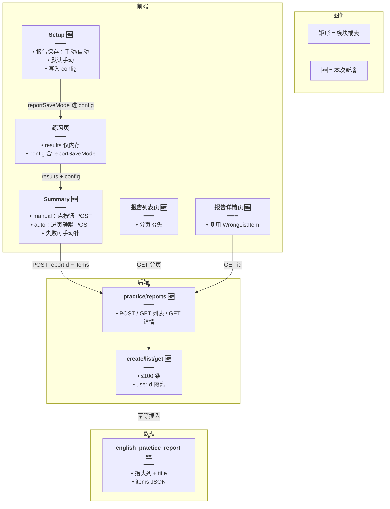
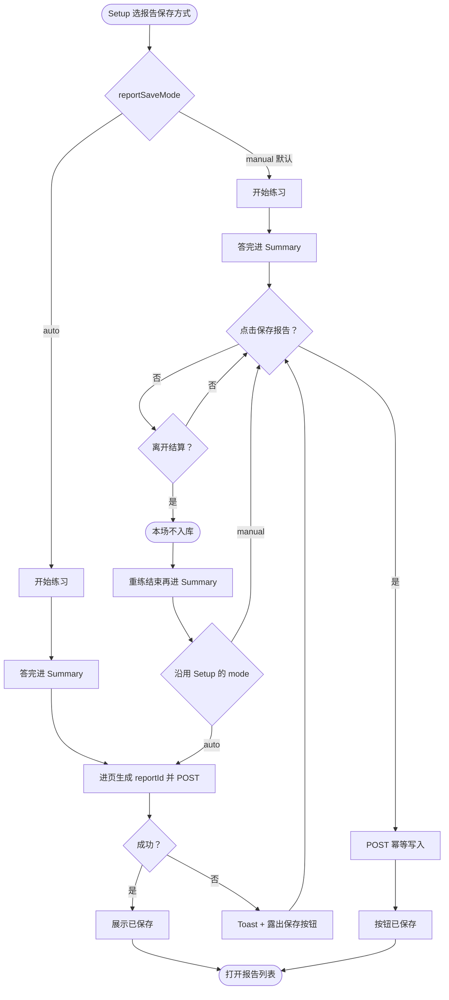
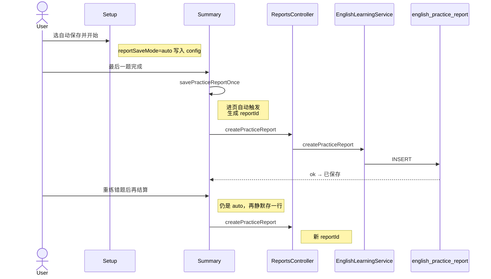

# 练习报告存档 — 实现思路

> **状态**：规划（未实现）  
> **日期**：2026-09-22  
> **需求摘要**：Setup 可选「手动保存」（默认）或「自动保存」；手动时结算页点「保存报告」才入库，自动时进入结算即写入。重练错题结束后同样按该设置处理。另开列表/详情回看，不替代错题集与间隔复习。

## 延伸阅读

- 设置页（增加保存方式选项）：`apps/frontend/src/views/englishLearning/practice/Setup.tsx`
- 结算页：`apps/frontend/src/views/englishLearning/practice/Summary.tsx`
- 作答结构：`apps/frontend/src/views/englishLearning/practice/types.ts` → `PracticeAttemptResult` / `PracticeSetupConfig`
- 已有结算写库（仅 SRS，不存整场报告）：`recordPracticeReviewAttempts`
- 单场题量硬顶：[练习题量上限对齐.md](./练习题量上限对齐.md)（`ENGLISH_PRACTICE_SESSION_MAX = 100`）

---

## 0. 读本文你将得到什么

- **问题**：`results` 只活在练习页内存，离开结算就没了；有人想随手留档，有人不想每场都进历史。
- **方案**：Setup 增加「报告保存」二选一（手动默认 / 自动）；写入仍是一行抬头 + `items` JSON。手动靠按钮，自动靠进结算时静默 POST 一次。
- **改动层**：Setup 选项进 `PracticeSetupConfig`；新表与三个 HTTP；`Summary` 按模式分支；新路由列表/详情。
- **阶段**：M1 落库 → M2 Setup + 手动/自动保存 → M3 列表与详情。
- **最大风险**：手动模式下未点保存就离开，本场不入库；自动模式失败时需露出可点的重试按钮。

---

## 1. 需求与边界

### 1.1 用户故事

| 角色 | 场景 | 行为 | 期望结果 |
|------|------|------|----------|
| 学习者 | Setup 配置 | 看到「报告保存」：手动 / 自动，默认手动 | 选项进入本场 `config` |
| 学习者 | 手动模式 + 结算 | 点击「保存报告」 | 入库；按钮变为已保存 |
| 学习者 | 手动模式 + 不想留档 | 不点保存，直接重练或离开 | 不写库 |
| 学习者 | 自动模式 + 结算 | 进入结算页 | 自动入库；展示「已保存」，无需再点 |
| 学习者 | 自动模式失败 | 网络错误 | Toast；露出「保存报告」可再点 |
| 学习者 | 重练错题后再结算 | 沿用 Setup 时选的保存方式 | 手动则再点；自动则再静默存一行 |
| 学习者 | 之后想回看 | 打开练习报告页 | 按时间看到各场次摘要 |

### 1.2 范围

| 在范围内 | 不在范围内（非目标） |
|----------|----------------------|
| Setup「报告保存」：手动（默认）/ 自动，交互同「怎么练」「出题顺序」卡片 | 作答过程中保存半场 |
| 手动：结算页按钮；自动：进入结算静默写一次 | 离开未保存时强制弹窗（手动模式） |
| 重练结束后的结算继承同一 `reportSaveMode` | 跨会话记住上次选的自动/手动（可后补 localStorage） |
| 抬头 + 每题快照 | 改 SRS、自动加入错题集 |
| 列表 + 详情 | 导出 DOCX、公开报告 |
| 同一 `reportId` 重复提交不插第二行 | 修改或删除历史（可后补） |

### 1.3 约束与依赖

- 须登录；`userId` 来自鉴权。
- 单场最多 `ENGLISH_PRACTICE_SESSION_MAX`（100）。
- `reportSaveMode` 写入 `PracticeSetupConfig`，随 `onStarted` / 重练后的 `config` 传递；首版不必进 URL。
- 复习 SRS 仍自动回写，与报告保存模式无关。
- 详情复用 `WrongListItem`，词性原文不解析。

---

## 2. 方案总览（一句话 + 要点）

**一句话方案**：Setup 选保存方式（默认手动）；手动时点按钮才 POST，自动时进结算静默 POST；共用同一套 `reportId` 幂等与标题规则。

| # | 设计要点 | 理由 |
|---|----------|------|
| 1 | Setup 二选一，默认手动 | 默认不刷历史；需要的人选自动 |
| 2 | 自动 = 进结算触发一次，不是每题写 | 与「一场一行」一致 |
| 3 | 自动成功后示「已保存」；失败露出按钮 | 避免误以为没存；失败可补 |
| 4 | 重练继承 Setup 选项 | 不必在重练中途再问 |
| 5 | 一场一行 + JSON 快照 | 上限 100，列表不必拆表 |
| 6 | `reportId` 幂等 | 自动 effect 重跑 / 手动连点不插两行 |
| 7 | 与 SRS、错题批量分开 | 职责不变 |

---

## 3. 现状与复用

| 能力 | 仓库中已有 | 本需求中的用法 |
|------|------------|----------------|
| Setup 选项卡片 | `Setup.tsx` 的 `SetupPickCard` | 扩展：再加「报告保存」两卡 |
| 本轮作答 | `practice/index.tsx` 的 `results` | 直接复用为提交体 |
| 设置下发 | `PracticeSetupConfig` | 扩展：`reportSaveMode: 'manual' \| 'auto'` |
| 结算页 | `Summary.tsx`、`SummaryActions.tsx` | 扩展：按模式自动 POST 或显示按钮 |
| 重练错题 | `onRetryWrong` | 保留 `config.reportSaveMode`；结束后同一套分支 |
| 复习结算 | `POST practice/review/record` | 直接复用，不并进报告接口 |
| 作答卡片 | `WrongListItem` | 详情复用 |
| 练习壳 | `PracticePageShell` | 列表/详情复用 |

**调研结论**：Setup 已有卡片单选模式，报告保存可同构。结算行为由 `config.reportSaveMode` 分支，不要做两套结算页。

### 3.1 重练错题与保存方式

| 判断 | 结论 |
|------|------|
| 重练后要不要按钮 / 自动存 | 要。继承 Setup 的 `reportSaveMode`：手动则再显示按钮，自动则再静默存一行 |
| 会不会覆盖原报告 | 不会。每次保存新 `reportId` |
| 手动未存就点重练 | 原场丢弃；与「手动」语义一致，不弹确认 |
| 自动存失败 | Toast + 露出可点的「保存报告」，与手动失败同一条路径 |

---

## 4. 架构图



**图内方法说明**：

| 方法 | 功能 |
|------|------|
| `createPracticeReport(userId, dto)` | 按 `reportId` 插入；已存在则返回已有行 |
| `listPracticeReports(userId, query)` | 倒序抬头，不含 `items` |
| `getPracticeReport(userId, id)` | 抬头 + `items`；非本人 404 |
| `savePracticeReportOnce`（前端） | 生成/复用 `reportId`、拼 title、POST；手动点击与自动 effect 共用 |

**读图要点**：

- 保存方式在 Setup 选定，结算只执行，不再二次询问。
- 自动与手动共用同一 POST，差别只在触发时机。

---

## 5. 主流程图



**图内方法说明**：

| 方法 | 功能 |
|------|------|
| `savePracticeReportOnce` | 统一写入入口 |
| `createPracticeReport` | 服务端插入 |
| `listPracticeReports` / `getPracticeReport` | 回看 |

**读图要点**：

- 默认路径是手动；自动只是把「点击」换成「进页触发」。
- 重练不改 mode，只再走一遍对应分支。

---

## 6. 核心时序图



**图内方法说明**：

| 方法 | 功能 |
|------|------|
| `savePracticeReportOnce` | 前端唯一写入编排 |
| `createPracticeReport` | 幂等落库 |
| `listPracticeReports` / `getPracticeReport` | 回看（与保存模式无关） |

**读图要点**：

- 手动模式时序把「进页自动」换成「用户点击」即可，后续相同。
- SRS 不在此图，复习结算仍单独自动回写。

---

## 7. （可选）状态机

结算保存态：`idle` → `saving` → `saved`；失败回 `idle`（可再点）。自动模式进页即进入 `saving`。离开结算丢弃本地态。不单独画图。

---

## 8. 模块职责与接口草图

### 8.1 模块一览

| 模块 | 职责 | 新增/改动 | 预估路径 |
|------|------|-----------|----------|
| Setup 报告保存 | 手动/自动二选一 | 扩展 | `practice/Setup.tsx` |
| 配置类型 | `reportSaveMode` | 扩展 | `practice/types.ts` |
| 实体 / 迁移 / DTO | 一场一行 | 新增 | `entity/`、`migrations/`、`dto/` |
| Service / Controller | 幂等插入、列表、详情 | 扩展 | `english-learning.service.ts` 等 |
| 结算保存 | 按 mode 自动或手动 | 扩展 | `Summary.tsx`、`SummaryActions.tsx` |
| 列表/详情 | 回看 | 新增 | `practice/reports/` |
| 路由 | 注册 | 扩展 | `router/routes.ts` |

### 8.2 关键接口（草图）

```typescript
// Setup 写入本场配置；默认手动，避免无意刷库
type PracticeReportSaveMode = 'manual' | 'auto';

// 与 mode / order 一并带进结算
type PracticeSetupConfig = {
	// …既有字段
	// 报告保存方式；缺省按 manual
	reportSaveMode: PracticeReportSaveMode;
};

// 一场题目快照；词性存原文
type PracticeReportItem = {
	itemKey: string;
	contentKind: 'vocab' | 'classic';
	userInput: string;
	correct: boolean;
	answerText: string;
	translationZh: string;
	ipa?: string;
	pos?: string;
};

// 创建入参；reportId 在首次触发保存时生成（点击或自动进页）
type CreatePracticeReportInput = {
	reportId: string;
	contentKind: 'vocab' | 'classic';
	mode: 'dictation' | 'spelling';
	source: string;
	order: 'random' | 'sequential';
	count: number;
	sourceTitle?: string;
	isRetryWrong?: boolean;
	items: PracticeReportItem[];
};
```

### 8.3 数据模型

| 字段/实体 | 来源 | 存储 | 说明 |
|-----------|------|------|------|
| `id` | 前端 `reportId` | `uuid` 主键 | 幂等 |
| `user_id` | 登录态 | `int` | 隔离 |
| `content_kind` / `mode` / `source` / `order` / `count` | config | 列 | 筛选与摘要 |
| `source_title` | Setup 来源名 | `varchar` | 标题原料 |
| `title` | 保存时拼好 | `varchar` | 见 §8.4 |
| `correct_count` / `total_count` | items 汇总 | `int` | 列表用 |
| `items` | `results` | `jsonb` | 详情快照 |
| `is_retry_wrong` | 是否重练场 | `boolean` | 标题后缀 |
| `save_mode` | 当时的 manual/auto | `varchar` | 可选，便于以后统计 |
| `created_at` | 插入时间 | `timestamp` | 倒序 |

索引：`(user_id, created_at DESC)`；`(user_id, content_kind, created_at DESC)`。

`reportSaveMode` **不必**单独成用户偏好表：首版只活在本场 `config`。若以后要「记住上次选自动」，再加 localStorage，YAGNI。

### 8.4 报告标题怎么命名

**不手填。** 触发保存（点击或自动）时按模板写入 `title`。

```text
{种类}{模式} · {来源名}{重练后缀}
```

| 段 | 取值 | 例 |
|----|------|----|
| 种类 | vocab→词汇；classic→语句 | 词汇 |
| 模式 | dictation→听写；spelling→拼写 | 听写 |
| 来源名 | 优先 `sourceTitle`，否则 Setup 同款兜底 | 托福核心词 |
| 重练后缀 | 重练场加 ` · 重练错题` | · 重练错题 |

例：`词汇听写 · 托福核心词`、`词汇听写 · 托福核心词 · 重练错题`。

列表副行另展示：`18/20 · 90% · 09-22 12:03`。

### 8.5 Setup「报告保存」UI

放在「出题顺序」与「开始练习」之间，两张 `SetupPickCard`（与怎么练 / 出题顺序同构）：

| 选项 | value | 说明文案（示意） |
|------|-------|------------------|
| 手动保存（默认） | `manual` | 练完后在结算页自行点保存；不点则不留档 |
| 自动保存 | `auto` | 进入结算即写入报告，无需再点 |

选中态：软边框 + 右下角勾，与现有卡片一致。

---

## 9. 分阶段实现步骤

| 阶段 | 目标 | 交付物 | 依赖 |
|------|------|--------|------|
| M1 | 能写入并读回 | 实体、迁移、三个接口 | — |
| M2 | Setup + 手动/自动 | 选项卡片；`reportSaveMode`；结算分支 | M1 |
| M3 | 回看页 | 列表 + 详情 + 路由 | M1 |

### M1

- [ ] 建 `english_practice_report`
- [ ] POST/GET，条数 ≤100，归属校验
- [ ] 同 `reportId` 第二次 POST 返回已有行

### M2

- [ ] Setup 增加「报告保存」两卡，默认 `manual`
- [ ] `PracticeSetupConfig.reportSaveMode`
- [ ] `savePracticeReportOnce` 共用
- [ ] `manual`：按钮；`auto`：进页 POST，成功示「已保存」，失败露出按钮
- [ ] 重练结束后继承同一 mode

### M3

- [ ] `/english-learning/practice/reports` 与 `/:id`
- [ ] 结算页可进「查看报告」

---

## 10. 关键决策与备选方案

| 决策 | 选用 | 备选 | 为何不选备选 |
|------|------|------|--------------|
| 默认 | 手动 | 默认自动 | 默认自动易堆无效历史 |
| 自动触发点 | 进入结算一次 | 每题增量 | 半场不在范围 |
| 自动失败 | Toast + 可点保存 | 仅 Toast | 否则只能重练整场才能再存 |
| 记住偏好 | 本场 config 即可 | 首版就持久化到服务端 | YAGNI |
| 标题 | 自动拼 | 手填 | 见 §8.4 |
| 重练 | 继承 Setup 的 mode | 重练强制手动 | 用户已选自动时期望一致 |

---

## 11. 风险、边界与待确认

| 项 | 等级 | 说明 | 缓解 |
|----|------|------|------|
| 手动未存就离开 | 中 | 本场丢失 | 文案说明；不做强制确认 |
| 自动失败 | 中 | 用户以为已存 | 失败露出按钮 + Toast |
| 自动刷库 | 低 | 每场都进历史 | 默认手动；标题带来源可辨 |
| jsonb 难按词筛 | 低 | 列表按种类与时间 | 以后再拆子表 |

**待确认**：

- [ ] 报告列表入口：侧栏还是仅结算「查看报告」（验证：导航密度）
- [ ] 是否允许删除一场（验证：误存纠正需求）

---

## 12. 验收清单

| # | 用例 | 步骤 | 期望 |
|---|------|------|------|
| AC1 | Setup 默认 | 打开设置 | 「手动保存」选中 |
| AC2 | 手动不点 | 结算后不点保存就离开 | 列表无新行 |
| AC3 | 手动点保存 | 点击后打开列表 | 多一行；按钮已保存 |
| AC4 | 自动成功 | Setup 选自动，练完进结算 | 无需点击已入库；示已保存 |
| AC5 | 自动失败 | 断网进结算 | Toast；可点保存补写 |
| AC6 | 自动 + 重练 | 再结算 | 再增一行（重练后缀） |
| AC7 | 手动 + 重练 | 再结算 | 仍要再点才存重练场 |
| AC8 | 连点 / effect 重跑 | 同页触发两次 | 仍一行 |
| AC9 | 他人 id | GET 别人报告 | 404 |
| AC10 | 复习场手动 | 不点保存 | SRS 仍更新；报告无行 |
| AC11 | 标题 | 保存词库听写 | `词汇听写 · {来源名}` |

---

## 13. 预估改动面（实现阶段参考）

| 类型 | 路径（预估） |
|------|--------------|
| 后端 | `english-learning` 实体 / 迁移 / DTO / service / controller / module |
| Setup | `practice/Setup.tsx`、`types.ts`、i18n |
| 结算 | `Summary.tsx`、`SummaryActions.tsx` |
| 回看 | `practice/reports/`、`router/routes.ts` |
| 文档（本文） | `remote-docs/wiki/ideas/english/练习报告存档.md` |

（本文档为规划态；落地前以本节为准，落地后以源码为准。）
