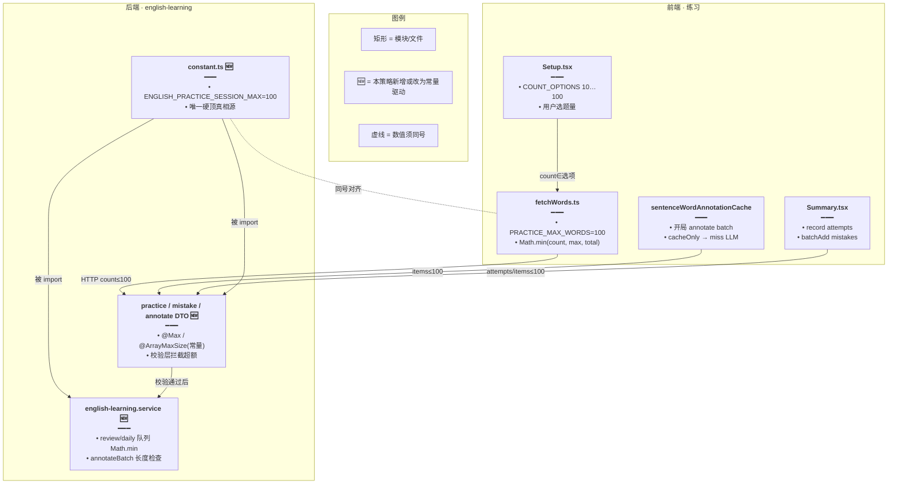
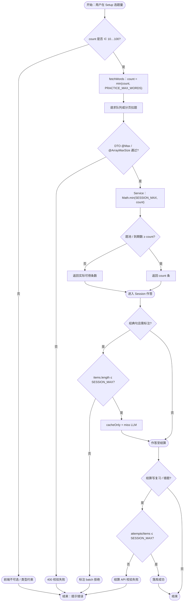
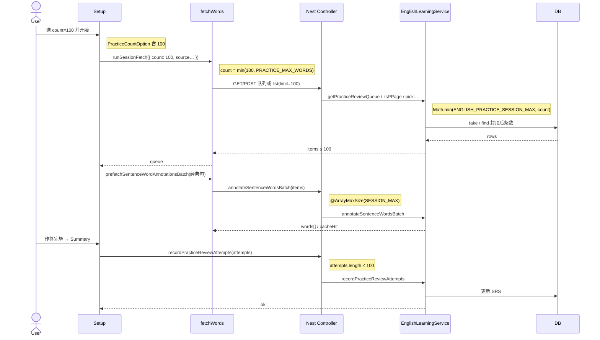

# 练习题量上限对齐 — 实现思路

> **状态**：核心能力已落地（前后端统一 100）  
> **日期**：2026-09-21  
> **需求摘要**：Setup 可选题量扩到 100 后，前后端所有「单场题量 / 结算批量 / 开局标注批量」共用同一硬顶，避免 UI 能选 100、接口仍卡 50。

## 延伸阅读

- 练习 Setup / 拉题：`apps/frontend/src/views/englishLearning/practice/`
- 后端常量：`apps/backend/src/services/english-learning/constant.ts` → `ENGLISH_PRACTICE_SESSION_MAX`
- 经典句开局预热：`apps/frontend/src/views/englishLearning/practice/utils/sentenceWordAnnotationCache.ts`
- 相关规划：[经典句整集标注预热.md](./经典句整集标注预热.md)（整集预热，与本策略「单场 ≤100」正交）

---

## 0. 读本文你将得到什么

- **问题**：前端 `PRACTICE_MAX_WORDS=100`，后端复习队列 / 结算 `attempts` / 错题 batch / 句标注 batch 曾硬编码 50，选 100 会少题或结算失败。
- **方案**：后端引入单一常量 `ENGLISH_PRACTICE_SESSION_MAX=100`，DTO `@Max` / `@ArrayMaxSize` 与 Service `Math.min` 全部引用它；前端继续用 `PRACTICE_MAX_WORDS`，数值对齐。
- **改动层**：后端 constant + DTO + Service；前端题量选项与类型（Setup 已扩到 100）。
- **阶段**：M1 常量与 DTO → M2 Service 封顶 → M3 Setup/类型与验收（均已完成）。
- **最大风险**：经典句 100 题开局一次 `annotate…Batch` 体量大；靠 `cacheOnly` 先灌缓存 + miss 再 LLM，非整集预热。

---

## 1. 需求与边界

### 1.1 用户故事

| 角色 | 场景 | 行为 | 期望结果 |
|------|------|------|----------|
| 学习者 | 练习 Setup | 选题目数量 100 | 本轮最多拉满 100 题（题池不足则按实际） |
| 学习者 | 今日复习 / 间隔复习 | 选 100 开练 | 队列返回 ≤100，不再被服务端砍到 50 |
| 学习者 | 结算页 | 错题很多时点「加入错题集」 | 一次提交 ≤100 条可通过校验 |
| 学习者 | 经典句练习开局 | 队列含最多 100 句 | 批量标注 `items` ≤100 不被拒 |

### 1.2 范围

| 在范围内 | 不在范围内（非目标） |
|----------|----------------------|
| 单场练习题量硬顶统一为 100 | 改间隔复习 SRS 算法本身 |
| 复习/记词队列 `count`、结算 `attempts`、记词 `vocabItems` | 列表分页 `limit`（收藏/错题列表仍可到 1000） |
| 错题批量加入 `items` | DOCX 导出条数上限（另有 3000） |
| 练习开局句标注 batch `items` | 单句内 `words` 长度（仍 80）；整集标注预热 chunk |
| Setup `COUNT_OPTIONS` 10…100 | 把上限抬到 100 以上 |

### 1.3 约束与依赖

- 须登录；练习依赖既有拉题链路（favorites / mistakes / library / review / daily / live）。
- 前后端数值必须同号：前端 `PRACTICE_MAX_WORDS` ↔ 后端 `ENGLISH_PRACTICE_SESSION_MAX`。
- Ponytail：一个常量驱动多处校验，禁止再散落魔法数 `50`。

---

## 2. 方案总览（一句话 + 要点）

**一句话方案**：用后端 `ENGLISH_PRACTICE_SESSION_MAX` 作为单场练习契约硬顶，所有相关 DTO 与 Service 封顶引用它，并与前端 `PRACTICE_MAX_WORDS` 同为 100。

| # | 设计要点 | 理由 |
|---|----------|------|
| 1 | 单一常量 | 改上限只改一处，避免 DTO 与 Service 漂移 |
| 2 | DTO 与 Service 双封顶 | 校验层拦恶意请求；业务层保证队列/今日记词不会多取 |
| 3 | 句标注 batch 同顶 | 开局预热一次最多 100 句，与题量对齐；注释已写「与单次题量上限对齐」 |
| 4 | 题池不足取 `min(count, total)` | 不硬凑题，前端 `sessionPageSize` 已如此 |

---

## 3. 现状与复用

| 能力 | 仓库中已有 | 本需求中的用法 |
|------|------------|----------------|
| Setup 题量选项 | `practice/Setup.tsx` → `COUNT_OPTIONS` 10…100 | 直接复用 |
| 前端题量类型 | `practice/types.ts` → `PracticeCountOption` | 直接复用 |
| 拉题封顶 | `practice/utils/fetchWords.ts` → `PRACTICE_MAX_WORDS` | 直接复用；与后端同值 |
| 复习队列 API | `getPracticeReviewQueue` + `PracticeReviewQueueQueryDto` | 扩展：`@Max` / `Math.min` → 常量 |
| 记词队列 / 摘要 | `getDailyMemorizeQueue`、`getDailyMemorizeSummary` | 扩展：同上 |
| 复习/记词结算 | `PracticeReviewRecordDto`、`PracticeDailyRecordDto` | 扩展：`@ArrayMaxSize` → 常量 |
| 错题批量 | `VocabularyMistakeBatchDto`、`ClassicQuoteMistakeBatchDto` | 扩展：同上 |
| 开局批量标注 | `AnnotateSentenceWordsBatchDto` + `annotateSentenceWordsBatch` | 扩展：items 上限 → 常量 |
| 结算写复习 | `Summary.tsx` → `recordEnglishPracticeReviewAttempts` | 直接复用（条数现可到 100） |
| 结算写错题 | `Summary.tsx` → `batchAddEnglish*Mistakes` | 直接复用 |

**调研结论**：UI 与前端拉题早已按 100 设计；缺口只在后端散落的 `50`。引入 `ENGLISH_PRACTICE_SESSION_MAX` 后，DTO、队列、今日记词 `todayCount`、句标注 batch 长度检查已对齐。单句 `words`、`ArrayMaxSize(80)` 与本策略无关，保持不动。

---

## 4. 架构图



**图内方法说明**：

| 方法 / 模块入口 | 功能 |
|-----------------|------|
| `sessionPageSize(count, total)` | 取 `min(count, PRACTICE_MAX_WORDS, total)`，保证单页拉题不超过前后端硬顶且不超过题池 |
| `runSessionFetch(params)` | 练习开局总入口：先把 `params.count` clamp 到 `PRACTICE_MAX_WORDS`，再按 source 分发 |
| `getPracticeReviewQueue(userId, opts)` | 按到期序取复习条目；`take`/`slice` 用 `ENGLISH_PRACTICE_SESSION_MAX` 封顶 |
| `getDailyMemorizeSummary(userId)` | 今日记词摘要；`todayCount = min(SESSION_MAX, libraryCount)` 驱动 UI 预期题量 |
| `getDailyMemorizeQueue(...)`（记词抽题） | 词汇库随机抽题；`limit = min(SESSION_MAX, count)` |
| `annotateSentenceWordsBatch(params)` | 练习开局批量标注；`items.length > SESSION_MAX` 抛 BadRequest |
| `recordEnglishPracticeReviewAttempts`（前端 API） | 结算把本轮 `attempts` POST 给后端；条数须 ≤ `ArrayMaxSize` |
| `batchAddEnglishVocabularyMistakes` / `batchAddEnglishClassicQuoteMistakes` | 结算批量入错题集；DTO `items` ≤ SESSION_MAX |

**读图要点**：

- 真相源在后端常量；前端常量与之同号，靠约定而非跨包共享。
- 校验（DTO）与业务封顶（Service）双层，防止只改一层导致漂移。
- Prefetch / Summary 与拉题共用同一硬顶，避免「题到了、标注或结算被拒」。

---

## 5. 主流程图



**图内方法说明**：

| 方法 | 功能 |
|------|------|
| `runSessionFetch` / `sessionPageSize` | 前端 clamp 与分页步长，避免请求超过 100 |
| `getPracticeReviewQueue` / 记词抽题 | 服务端再次 clamp，并按题池截断 |
| `prefetchSentenceWordAnnotationsBatch` | 开局对经典句队列调 batch 标注（先只读缓存） |
| `annotateSentenceWordsBatch` | 后端验收 `items` 长度并查库/调模型 |
| `recordEnglishPracticeReviewAttempts` | 复习场次回写 SRS |
| `batchAddEnglish*Mistakes` | 非复习场次把错题写入错题集 |

**读图要点**：

- 失败集中在三类：DTO 校验、标注 batch 超长、结算数组超长——统一硬顶后这三条与 UI 选项一致。
- 题池不足走「部分返回」，不是错误。
- 经典句标注是可选支路，词书模式直接进结算。

---

## 6. 核心时序图



**图内方法说明**：

| 方法 | 功能 |
|------|------|
| `runSessionFetch` | 组装 source/contentKind/order，clamp count 后拉本轮队列 |
| `getPracticeReviewQueue` | 到期复习条目查询与拼装（vocab/classic 分支） |
| `prefetchSentenceWordAnnotationsBatch` | 前端开局预热编排：cacheOnly 再 LLM miss |
| `annotateSentenceWordsBatch` | 批量句内词标注；超 SESSION_MAX 直接 BadRequest |
| `recordPracticeReviewAttempts` | 按 attempts 更新间隔复习状态 |

**读图要点**：

- Happy path 展示复习源 + 经典句标注 + 结算；收藏/错题源仅换「list 分页」调用，clamp 逻辑相同。
- Note 中的数值均指向同一硬顶，便于对照 DTO。

---

## 7. （可选）状态机

本策略无独立 UI 模式切换，省略状态图。练习相位仍是既有 `setup → running → summary`。

---

## 8. 模块职责与接口草图

### 8.1 模块一览

| 模块 | 职责 | 新增/改动 | 预估路径 |
|------|------|-----------|----------|
| 常量 | 单场硬顶真相源 | 新增常量 | `apps/backend/.../constant.ts` |
| 练习/记词/错题/标注 DTO | 校验 count 与数组长度 | 改动 | `apps/backend/.../dto/*.ts` |
| EnglishLearningService | 队列/摘要/标注长度 | 改动 | `apps/backend/.../english-learning.service.ts` |
| Setup + types | 选项与联合类型到 100 | 已有 | `practice/Setup.tsx`、`types.ts` |
| fetchWords | 前端 clamp | 已有 | `practice/utils/fetchWords.ts` |

### 8.2 关键接口（草图）

```typescript
// 后端单场硬顶：与前端 PRACTICE_MAX_WORDS 同号，改上限只改这里
export const ENGLISH_PRACTICE_SESSION_MAX = 100;

// 复习队列查询：count 不得超过硬顶，防止恶意拉超大页
class PracticeReviewQueueQueryDto {
	// 可选；缺省由服务端默认策略处理
	@Max(ENGLISH_PRACTICE_SESSION_MAX)
	count?: number;
}

// 结算 attempts：一轮最多回写硬顶条数，与选题量对齐
class PracticeReviewRecordDto {
	@ArrayMaxSize(ENGLISH_PRACTICE_SESSION_MAX)
	attempts!: PracticeReviewRecordItemDto[];
}

// 业务层二次封顶：即使校验被绕过也不多取
function clampSessionCount(count: number): number {
	// 至少 1 题，至多 SESSION_MAX
	return Math.min(ENGLISH_PRACTICE_SESSION_MAX, Math.max(1, count));
}
```

### 8.3 数据模型

| 字段/实体 | 来源 | 存储 | 说明 |
|-----------|------|------|------|
| `PRACTICE_MAX_WORDS` | 前端常量 | 内存 | 拉题 clamp |
| `ENGLISH_PRACTICE_SESSION_MAX` | 后端常量 | 内存 | DTO + Service 硬顶 |
| `PracticeCountOption` | 类型联合 | — | 10…100 步进 10 |
| 无新表 | — | — | 纯契约对齐，不迁库 |

---

## 9. 分阶段实现步骤

| 阶段 | 目标 | 交付物 | 依赖 |
|------|------|--------|------|
| M1 | 常量 + DTO | `ENGLISH_PRACTICE_SESSION_MAX`；相关 `@Max`/`@ArrayMaxSize` | — |
| M2 | Service 封顶 | review/daily/annotate 长度与 `Math.min` | M1 |
| M3 | 前端已扩选项验收 | Setup 100、类型、拉题与结算联调 | M2 |

### M1

- [x] 在 `constant.ts` 导出 `ENGLISH_PRACTICE_SESSION_MAX = 100`
- [x] `practice-review.dto` / mistake batch / annotate batch 引用常量

### M2

- [x] `getPracticeReviewQueue` take/slice 用常量
- [x] `getDailyMemorizeSummary` / 记词抽题 limit 用常量
- [x] `annotateSentenceWordsBatch` `items.length` 检查用常量

### M3

- [x] Setup `COUNT_OPTIONS` 与 `PracticeCountOption` 含 100
- [x] `PRACTICE_MAX_WORDS = 100` 与后端同号
- [ ] （可选）抽共享包或注释交叉引用，防止再次漂移——YAGNI，当前双常量即可

---

## 10. 关键决策与备选方案

| 决策 | 选用 | 备选 | 为何不选备选 |
|------|------|------|--------------|
| 上限数值 | 100 | 保持 50 或抬到 200 | 与 Setup UI 已定选项一致；200 会放大标注/结算体量 |
| 常量位置 | 后端 `constant.ts` + 前端本地常量 | monorepo 共享 package | 仅一个数字，共享包过重 |
| 标注 batch | 与题量同顶 | 仍 50、前端分片 | 同顶更简单；分片增加前端复杂度 |
| 题池不足 | 返回实际条数 | 报错禁止开练 | 既有行为，体验更友好 |

---

## 11. 风险、边界与待确认

| 项 | 等级 | 说明 | 缓解 |
|----|------|------|------|
| 经典句 100 题开局 LLM miss | 中 | miss 多时开局仍慢 | 依赖整集预热；本策略只保证不被 50 拒 |
| 结算错题接近 100 条 | 低 | 单次 payload 变大 | 已有 `@ArrayMaxSize`；超则失败可再分片（未做） |
| 前后端数字再漂移 | 中 | 两处字面量 | 注释互指；改上限时 grep 两边 |
| 今日记词 `todayCount` 变 100 | 低 | 摘要展示题量预期变大 | 与 Setup 上限一致，属预期 |

**待确认**：

- [ ] 是否需要前端对错题 batch 按 100 分片重试（验证方式：人为构造 >100 wrong 无入口，当前 UI 单场 ≤100，可标 YAGNI）

---

## 12. 验收清单

| # | 用例 | 步骤 | 期望 |
|---|------|------|------|
| AC1 | 收藏/错题选 100 | Setup 选 100 开练 | 队列长度 = min(100, 题池) |
| AC2 | 复习选 100 | 到期 ≥100 时开练 | 返回 100，不再卡在 50 |
| AC3 | 结算写复习 | 做完 100 题进 Summary | `attempts` 提交成功，SRS 更新 |
| AC4 | 结算写错题 | 非复习源，错题 ≤100 点保存 | batch 成功；>100 无入口 |
| AC5 | 经典句开局标注 | 100 句队列 prefetch | batch 不被「items 过多」拒绝 |
| AC6 | 题池不足 | 题池仅 37，选 100 | 开练 37 题，无报错 |

---

## 13. 预估改动面（实现阶段参考）

| 类型 | 路径（预估） |
|------|--------------|
| 后端常量 | `apps/backend/src/services/english-learning/constant.ts` |
| 后端 DTO | `dto/practice-review.dto.ts`、`vocabulary-mistake.dto.ts`、`classic-quote-mistake.dto.ts`、`annotate-sentence-words.dto.ts` |
| 后端 Service | `english-learning.service.ts`（review/daily/annotate 封顶） |
| 前端 | `practice/Setup.tsx`、`types.ts`、`utils/fetchWords.ts`（已到位） |
| 文档（本文） | `remote-docs/wiki/ideas/english/练习题量上限对齐.md` |

（本文档为规划态实现思路；核心常量对齐已落地，以源码为准。）
