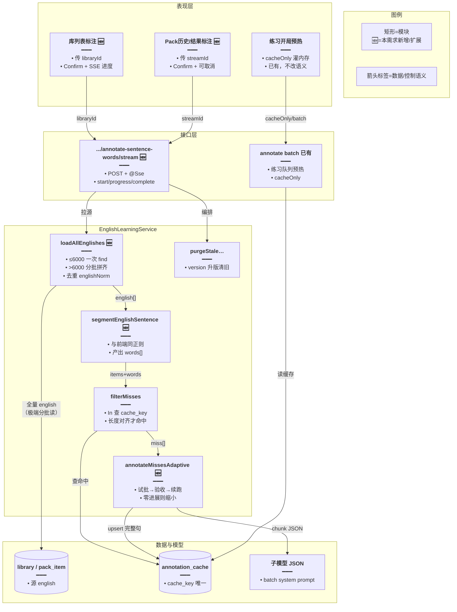
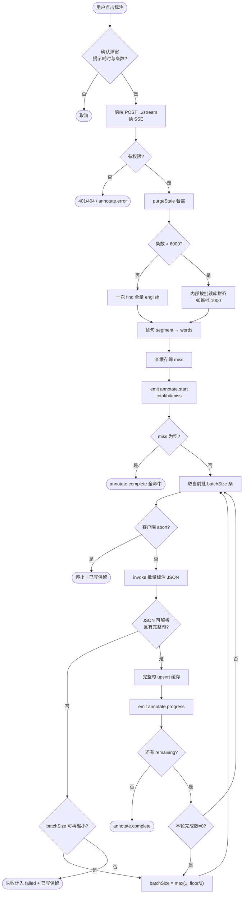
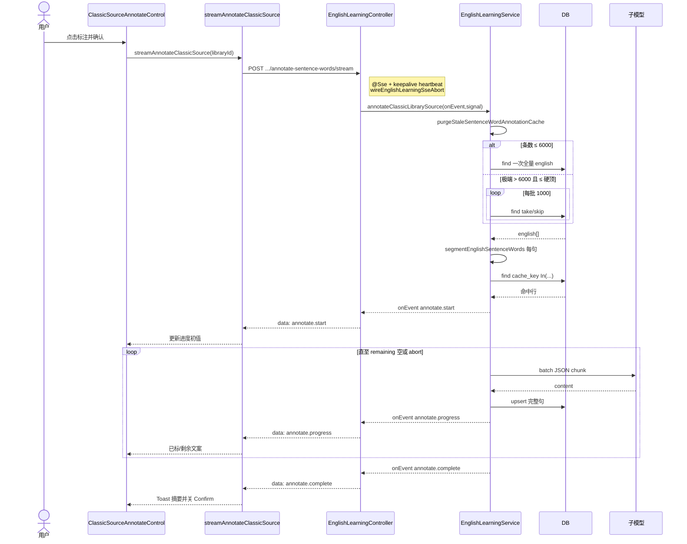
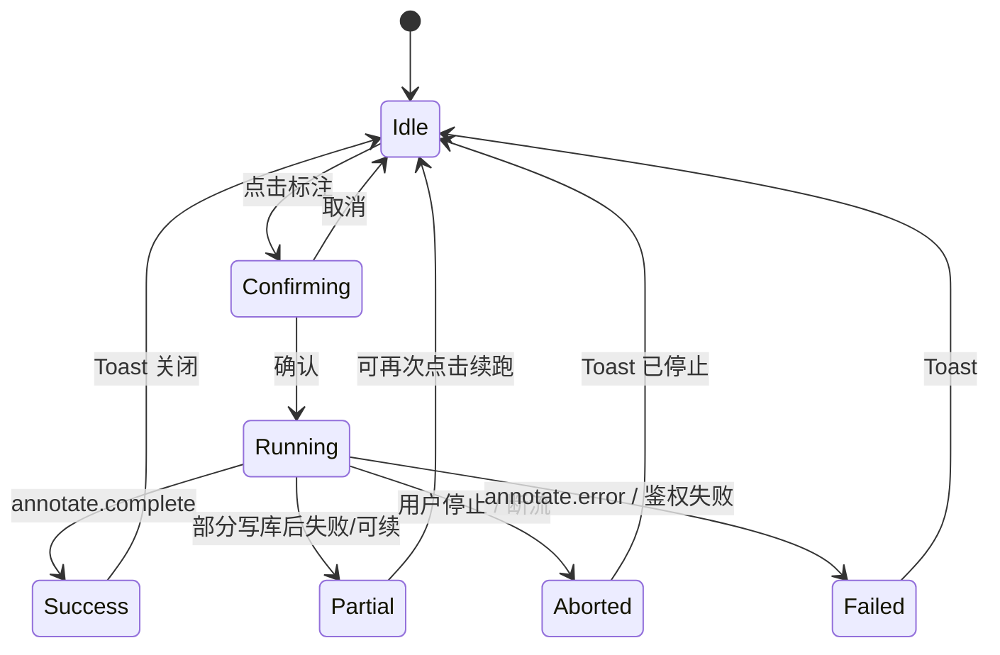

# 经典句整集标注预热 — 实现思路

> **状态**：SSE 进度已落地（M1 源级预热 + M2 SSE；finish_reason 硬化仍可选）  
> **日期**：2026-09-18  
> **需求摘要**：用户在语句库或 Pack 上点「标注」后，前端只传源 id，经 **SSE** 接收 `start/progress/complete`；后端取全量句、跳过缓存、分批调模型写缓存，前端实时展示已标/剩余；断开即 abort。

## 延伸阅读

- 本仓已有能力：`apps/backend/src/services/english-learning/`（标注缓存实体、batch API、`SENTENCE_WORD_ANNOTATION_BATCH_LLM_CHUNK`）
- 练习开局预热：`apps/frontend/src/views/englishLearning/practice/utils/sentenceWordAnnotationCache.ts`
- **省 Token 规划（不改功能契约）**：[整集标注省Token.md](./整集标注省Token.md)
- **任务持久化与暂停继续**：[标注任务持久化续跑.md](./标注任务持久化续跑.md)

---

## 0. 读本文你将得到什么

- **问题**：冷缓存练习要等模型；整集同步 HTTP 无进度，用户以为卡死。
- **方案**：源级预热 + **SSE 推送进度**；后端仍分批调 LLM（不可避免），前端只传源 id 并展示进度。
- **改动层**：后端 SSE 编排；前端 Confirm + 流式客户端 + 进度文案。
- **阶段**：M1 源级预热（已做）→ **M2 SSE 进度（已做）** → M3 finish_reason 硬化（可选）。
- **最大风险**：多轮 LLM 耗时长；靠 SSE 心跳 + 可取消缓解感知与断流。

---

## 1. 需求与边界

### 1.1 用户故事

| 角色 | 场景 | 行为 | 期望结果 |
|------|------|------|----------|
| 学习者 | 资源库某语句库（如 400 条） | 点击「标注」并确认 | 该库全部句写入/补齐标注缓存；已有缓存的不重打模型 |
| 学习者 | Pack 历史某一条 / 结果页 | 同上 | 该 `streamId` 下全部句补齐缓存 |
| 学习者 | 点标注并确认后等待 | 看进度「已标 x / miss y」 | 每批 LLM 完成后进度更新；结束 Toast 摘要 |

### 1.2 范围

| 在范围内 | 不在范围内（非目标） |
|----------|----------------------|
| 语句库 / Pack 整集预热 | 收藏 / 错题单独入口 |
| **SSE**：`annotate.start` / `progress` / `complete` / `error` | 前端循环 `batch`×50 |
| 后端分批 LLM（多次调用保留） | 幻想「一次 LLM 标完 400 句」 |
| Confirm + 进度文案 + 可取消（断开即 abort） | 修半截 JSON 接龙 |

### 1.3 约束与依赖

- 须登录；库读权限复用 `assertClassicQuotesLibraryReadable`；Pack 须 `userId + streamId` 会话存在。
- 缓存表全局共享（不按 user 隔离）；同句同分词只存一行。
- 练习侧分词以 `segmentEnglishSentence` 为准 → **后端必须同规则**，否则 cache_key 对不上。
- Ponytail：不新建收藏/错题预热；SSE 复用 Pack 的 `Observable` + `wireEnglishLearningSseAbort` 模式。
- **交互仅 SSE**；对外无同步长 POST（service 方法可被 SSE controller 内部调用）。
- Web / Tauri 同一 `platformFetch` 读流。

---

## 2. 方案总览（一句话 + 要点）

**一句话方案**：前端只传源 id，经 **SSE** 消费进度；后端一次（或极端分批）取全句 → 筛 miss → **仍分批调 LLM**，每批结束后推 `annotate.progress`，结束推 `complete`。

| # | 设计要点 | 理由 |
|---|----------|------|
| 1 | 前端只传源 id | 分词与写库在服务端 |
| 2 | **SSE 进度**，非一次长 JSON | 解决「无提示」；避免网关对超长同步响应不友好 |
| 3 | 多轮 LLM **保留** | 输出上限决定；流式不消灭批次数 |
| 4 | 事件：`start`→`progress`*→`complete`\|`error` | 与 Pack SSE 同构，易实现 |
| 5 | 断开连接即 abort | 用户关弹窗/取消可停后续 LLM |
| 6 | ≤6000 一次 find；>6000 批读；>2万拒绝 | 同前 |
| 7 | 收藏/错题不加按钮 | 同前 |

---

## 3. 现状与复用

| 能力 | 仓库中已有 | 本需求中的用法 |
|------|------------|----------------|
| 落库缓存表 | `entity/english-sentence-word-annotation-cache.entity.ts` | 直接 upsert；`cache_key` 含 version |
| cache_key 构建 | `sentence-word-annotation-cache.util.ts` | 复用 |
| 单句 / 批量标注 API | `annotateSentenceWords` / `annotateSentenceWordsBatch` | 练习开局继续用；整集走新编排，内部可抽共用 LLM 写库 |
| 多句 LLM + CHUNK=12 | `annotateSentenceWordsMultiViaLlmAndCache` | **扩展**为「自适应批大小 + 续跑」；或抽 `annotateMissesAdaptive` |
| 批量 prompt | `SENTENCE_WORDS_ANNOTATE_BATCH_SYSTEM`（`prompt.ts`） | 复用；已要求按 id 覆盖 |
| version 升版清旧 | `purgeStaleSentenceWordAnnotationCache` | 复用 |
| 库 / Pack 条目表 | `EnglishClassicQuotesLibraryItem` / `EnglishClassicQuotesPackItem` | `loadAllEnglishes*`：≤6000 一次 `find`；>6000 内部 `take/skip`（或 keyset）按 `ANNOTATE_SOURCE_DB_CHUNK`（建议 1000）拼齐；**不**走对外 list |
| 单源生成上限 | `ENGLISH_CLASSIC_QUOTES_GENERATION_MAX = 6000` | 正常写入不应超过；预热仍处理超限，仅切换读库策略 |
| 前端分词 | `practice/utils/segmentSentence.ts` | 后端 `sentence-segment.util.ts` 同源正则 |
| 练习预热 | `prefetchSentenceWordAnnotationsBatch` | 保持；整集预热后 cacheOnly 更热 |
| 库 / Pack UI | LibraryListPanel / HistoryDrawer / pack | 挂载 `ClassicSourceAnnotateControl` |
| Pack SSE 模式 | `vocabulary-pack/stream` 等 | **复用** Observable + abort + keepalive |
| 源级预热编排 | `annotateClassicLibrary/PackSource` | SSE 经 `onEvent` 推进度 |
| 前端流客户端 | `annotateClassicSourceSse.ts` | Confirm 进度 / 停止 |

**调研结论**：源级预热 + 分词 + **SSE 进度 UX** 均已落地。多轮 LLM 保留；前端流展示「已标/剩余」。

---

## 3.1 SSE 事件契约

| type | 字段 | 何时 |
|------|------|------|
| `annotate.start` | `total, hit, miss` | 筛完缓存后 |
| `annotate.progress` | `total, hit, annotated, failed, remaining, miss` | 每批 LLM 后 |
| `annotate.complete` | `total, hit, annotated, failed` | 全部结束 |
| `annotate.error` | `message` | 不可恢复错误 |
| `annotate.progress` + `heartbeat` | — | 保活；前端忽略数值 |

路径：`.../annotate-sentence-words/stream`（库与 Pack 各一条 POST + `@Sse()`）。

---

## 4. 架构图



**图内方法说明**：

| 方法 | 功能 |
|------|------|
| `annotateClassicLibrary/PackSourceStream` | SSE 入口：鉴权、keepalive、abort；`onEvent` 推事件 |
| `annotateClassicLibrary/PackSource` | Service 编排：取源→筛 miss→自适应 LLM；经 `onEvent` 推进度 |
| `streamAnnotateClassicSource` | 前端读 SSE，更新 Confirm 进度文案 |
| `loadAllEnglishesForLibrary(libraryId)` | 先 `count`（或用 `quoteCount`）；≤6000 一次 `find`；否则按 1000/批 `take/skip` 拼成数组后返回 |
| `loadAllEnglishesForPack(streamId)` | 同上，条件为 `userId + streamId`；可用 `session.itemCount` 预判 |
| `segmentEnglishSentence(english)` | 与前端同规则切词，保证 cache_key 与练习一致 |
| `filterMisses(items)` | 构建 cache_key，批量查表，返回未命中或长度不齐的项 |
| `annotateMissesAdaptive(misses)` | 自适应批大小调用模型，按 id 验收写库，未完成续跑 |
| `purgeStaleSentenceWordAnnotationCache()` | version 变更时删除旧 schema_version 行 |
| `prefetchSentenceWordAnnotationsBatch()` | 练习开局前端预热（已有），整集预热后命中率上升 |

**读图要点**：

- 整集预热与练习 batch **共用缓存表**，入口分离。
- 源句：**≤6000 单次查询**；**>6000 仅内部批读拼齐**（仍一次逻辑「取全源」）；模型侧另按批/续跑。
- UI 只认识源 id，不认识 words；进度走 SSE，不是等最终 JSON。

---

## 5. 主流程图



**图内方法说明**：

| 方法 | 功能 |
|------|------|
| `annotateClassicLibrary/PackSource` | 鉴权→拉源→分词→筛 miss→`onEvent(start)`→自适应→`complete` |
| `loadAllEnglishes*` | ≤6000 一次 find；>6000 内部批读拼齐；>2万拒绝 |
| `annotateMissesAdaptive` | remaining + batchSize；每轮后 `onProgress`；支持 signal abort |
| `wireEnglishLearningSseAbort` | 连接断开时 abort，停后续 LLM |
| `streamAnnotateClassicSource` | 前端解析 data: 行；忽略 heartbeat |

**读图要点**：

- **破解截断**：不拼接半截文本；只 upsert「验收通过」的句，剩余 id 整句重送。
- 零进展才缩小批大小，避免正常截断后仍用过大的剩余集反复撞墙。
- 已写入缓存的句下次预热/练习直接命中，失败可重试。

---

## 6. 核心时序图



**图内方法说明**：

| 方法 | 功能 |
|------|------|
| `streamAnnotateClassicSource` | 前端 platformFetch 读 SSE；解析 start/progress/complete/error |
| `annotateClassicLibrarySourceStream` | Controller：Observable 推事件、keepalive、abort |
| `annotateClassicLibrarySource` | Service：取源→筛 miss→自适应；经 `onEvent` 推进度 |
| `annotateMissesAdaptive` | 分批 LLM；每批后 `onProgress`；`signal.aborted` 抛 AbortError |
| `purgeStaleSentenceWordAnnotationCache` | 升版清旧缓存行 |
| `segmentEnglishSentenceWords` | 后端分词，对齐练习 |

**读图要点**：

- 交互路径是 **SSE**，不是等最终 JSON；心跳 `progress+heartbeat` 前端忽略数值。
- 用户关弹窗/点停止 → abort → 后续 LLM 停；已 upsert 保留。
- 练习链路不在本图；预热完成后练习走原 cacheOnly。

---

## 7. （可选）状态机




**图内方法说明**：

| 方法 | 功能 |
|------|------|
| （UI 本地 state） | `running` + `progress`；AbortController.abort；无独立 store |

---

## 8. 模块职责与接口草图

### 8.1 模块一览

| 模块 | 职责 | 新增/改动 | 路径 |
|------|------|-----------|------|
| DTO | libraryId / streamId 入参 | 已有 | `dto/annotate-classic-source.dto.ts` |
| Controller | 两条 POST + `@Sse` | 已有 | `english-learning.controller.ts` |
| Service 编排 | 取源、分词、自适应、`onEvent` | 已有 | `english-learning.service.ts` |
| 后端分词 util | 与前端同正则 | 已有 | `sentence-segment.util.ts` |
| Adaptive LLM | 续跑/缩小 + abort | 已有 | `annotateMissesAdaptive` |
| FE SSE 客户端 | 读流 / abort | 已有 | `utils/annotateClassicSourceSse.ts` |
| FE 控件 | Confirm + 进度 + 停止 | 已有 | `ClassicSourceAnnotateControl.tsx` |
| 库 / Pack UI | 挂载标注按钮 | 已有 | `LibraryListPanel` / HistoryDrawer / `pack` |
| i18n | 进度/停止/成功文案 | 已有 | `en-US.ts` / `zh-CN.ts` |
| finish_reason | 截断硬化 | 可选 M3 | `invokeEnglishPackSubModelJson` |

### 8.2 关键接口（草图）

```typescript
// 库 / Pack 各一条：POST + SSE，body 仅源 id
// POST /english-learning/classic-quotes-libraries/annotate-sentence-words/stream
// POST /english-learning/classic-quotes-history/annotate-sentence-words/stream

// 筛完缓存后立刻推；前端据此画「已有 hit / 待标 miss」
type AnnotateStartEvent = {
	// 事件名；与 Pack SSE 一样包在 data: JSON
	type: 'annotate.start';
	// 去重后总句数
	total: number;
	// 已命中缓存
	hit: number;
	// 待调模型
	miss: number;
};

// 每批 LLM 验收写库后推；heartbeat 时前端忽略数值
type AnnotateProgressEvent = {
	// 进度事件
	type: 'annotate.progress';
	// 同 start 快照，便于断线重连展示
	total: number;
	hit: number;
	miss: number;
	// 本轮累计新写入
	annotated: number;
	// 单句仍失败数
	failed: number;
	// 尚待处理
	remaining: number;
	// 保活标记；无业务含义
	heartbeat?: boolean;
};

// 全部结束；前端 Toast 用
type AnnotateCompleteEvent = {
	// 完成事件
	type: 'annotate.complete';
	total: number;
	hit: number;
	annotated: number;
	failed: number;
};
```

```typescript
// 前端：只传源 id，读 SSE；取消即 abort
export function streamAnnotateClassicSource(options: {
	// 库或 Pack
	source: 'library' | 'pack';
	// 语句库 id
	libraryId?: string;
	// Pack 会话 id
	streamId?: string;
	// start 回调：初始化进度条
	onStart?: (p: { total: number; hit: number; miss: number }) => void;
	// progress 回调：刷新 Confirm 文案
	onProgress?: (p: {
		total: number;
		hit: number;
		miss: number;
		annotated: number;
		failed: number;
		remaining: number;
	}) => void;
}): { abort: () => void; done: Promise<{ total: number; hit: number; annotated: number; failed: number }> } {
	// … 实现见 annotateClassicSourceSse.ts
	return { abort: () => {}, done: Promise.resolve({ total: 0, hit: 0, annotated: 0, failed: 0 }) };
}
```

### 8.3 数据模型

| 字段/实体 | 来源 | 存储 | 说明 |
|-----------|------|------|------|
| `english_classic_quotes_library_item.english` | 库 | DB | 源句 |
| `english_classic_quotes_pack_item.english` | Pack | DB | 源句 |
| `english_sentence_word_annotation_cache` | 标注结果 | DB | `cache_key` 唯一；跨用户共享 |
| `SENTENCE_WORD_ANNOTATION_CACHE_VERSION` | 常量 | 代码 | 升版触发 purge |
| 前端 Map | 练习会话 | 内存 | 整集预热**不要求**写前端 Map；练习开局 cacheOnly 再灌 |

---

## 9. 分阶段实现步骤

| 阶段 | 目标 | 交付物 | 状态 |
|------|------|--------|------|
| M1 | 源级预热闭环 | 分词 util + loadAll + adaptive + 库/Pack 入口 | **已做** |
| M2 | SSE 进度 UX | `/stream` + onEvent + 前端流客户端 + Confirm 进度/停止 | **已做** |
| M3 | 截断续跑硬化 | invoke 透出 finish_reason；显式 length 策略 | 可选 |

### M1（已做）

- [x] 后端 `segmentEnglishSentenceWords` + selfcheck
- [x] `loadAllEnglishes*`：≤6000 一次 find；>6000 批读；>硬顶拒绝
- [x] `annotateClassic*Source` + `annotateMissesAdaptive`（零进展减半）
- [x] DTO + 权限；库列表 / 历史 / Pack 结果按钮 + Confirm
- [x] i18n + Toast 摘要

### M2（已做）

- [x] Controller `.../annotate-sentence-words/stream`（`@Sse` + keepalive + abort）
- [x] Service `onEvent`：`start` / `progress` / `complete`
- [x] `annotateClassicSourceSse.ts` + `ClassicSourceAnnotateControl` 进度文案与停止
- [x] 去掉对外同步长 POST

### M3（可选）

- [ ] `invokeEnglishPackSubModelJson` 返回 `{ text, finishReason }`，length 时明确缩小批
- [ ] （按需）服务端按 libraryId/streamId 单飞防双点

### M4（推荐）：同会话多轮续标 + 硬失败熔断

> **背景**：逐句独立 `createLlm` 在网关/鉴权失败时会把 remaining 烧光；「一次塞 400 句」又受输出 token 上限制约。业界做法是 **同一 priorThread 多轮**：按 id 验收已完整句 → 下一轮只要未完成 id，不重打已验收句。

| 策略 | 做法 | 否决项 |
|------|------|--------|
| 硬失败熔断 | invoke 抛错 → 剩余全部记 failed，**停止**再调模型 | 失败后逐句重试 |
| 同会话续标 | `priorThread` 保留上一轮 Human/AI；user 只带 missing ids | 每句新开无上下文对话 |
| 按 id 验收 | 只 upsert 长度对齐的完整句；截断不修半截 JSON | 拼接残缺 JSON |
| 批大小 | 首轮中等（如 8～12）；截断则续轮要尾部，不盲目加大 maxTokens | 幻想单轮标完整库 |

- [x] 硬失败熔断（`annotateMissesAdaptive` circuit open）
- [x] 标注路径接入 `priorThread` 续标（同会话多轮；按 id 验收；continue 只要 missing）
- [x] 日志打印真实 LLM 错误串（便于区分 429/鉴权/模型名）

---

## 10. 关键决策与备选方案

| 决策 | 选用 | 备选 | 为何不选备选 |
|------|------|------|--------------|
| 谁编排整集 | 后端按源 id | 前端循环 batch×50 | 分词易漂、HTTP 多、与「源在服务端」不符 |
| 源句怎么读 | **≤6000 一次 find；>6000 内部批读拼齐** | 超限直接 400 拒绝 / 只处理前 6000 | 拒绝丢能力；截断丢句；批读只控内存仍标完全部 |
| 截断策略 | 按句 id 验收 + 剩余重送 | 修复半截 JSON 拼接 | 脆、易脏缓存 |
| 收藏/错题入口 | 不做 | 各加按钮 | 非独立源；库/Pack 预热已覆盖句内容 |
| 首版交互 | **SSE + 进度文案** | 同步长 timeout | 无反馈；网关易断 |
| 初始 batchSize | M1 用 12；M2 提到 24～48 再自适应 | 永远一次塞 400 | 必截断，首包浪费 |

---

## 11. 风险、边界与待确认

| 项 | 等级 | 说明 | 缓解 |
|----|------|------|------|
| 长耗时 / 断流感知 | 中 | 多轮 LLM 数分钟 | **SSE + 心跳**；Confirm 提示；可 abort |
| 极端超 6000 | 中 | 历史/异常数据或日后提上限 | 内部批读拼齐；Confirm 用真实 count；LLM 耗时按 miss 线性涨 |
| 模型费用 | 高 | 大库全冷一次成本高 | 只打 miss；Confirm 展示条数；可日后加会员门闸 |
| 前后端分词不一致 | 高 | cache_key 对不上 → 假 miss 或练习读空 | 同源正则 + selfcheck；禁止各写各的 |
| 并发双点 | 中 | 同库两次预热 | 按钮 disabled；服务端可按 libraryId 单飞（可选） |
| 公开库只读用户 | 中 | 是否允许预热写全局缓存 | **待确认**：建议可读即可预热（缓存共享有益）；或仅 owner |
| finish_reason 各厂商字段名 | 中 | LangChain 封装差异 | 可选 M3；当前靠 id/长度验收 + 零进展减半 |

**待确认**：

- [ ] 公开库非 owner 是否允许点「标注」写全局缓存？（验证：用只读账号打接口看 403 还是 200）
- [x] 交互改为 SSE（不再依赖超长同步 body）
- [ ] 超 6000 时 Confirm 是否额外警告「耗时更长」？（验证：产品文案）
- [ ] 是否另设硬顶（如 2 万）超过则 400？（验证：防恶意撑爆；默认建议有）

---

## 12. 验收清单

| # | 用例 | 步骤 | 期望 |
|---|------|------|------|
| AC1 | 库全冷预热 | 空缓存库点标注 | SSE 见 start→progress*→complete；annotated≈total；再点 hit≈total |
| AC2 | Pack 预热 | 对某 streamId 标注 | 同上；练习该 Pack 开局 cacheOnly 命中 |
| AC3 | 练习对齐 | 预热后经典句看中写 | 词性/IPA 与槽位数一致 |
| AC4 | 进度可见 | 中等 miss 库标注 | Confirm 文案随 progress 更新；非一直转圈无数字 |
| AC5 | 可取消 | 标注中点停止 | 后续 LLM 停；已写缓存保留；Toast 已停止 |
| AC6 | 权限 | 无权限 id | annotate.error / 401/404，不写库 |
| AC7 | 极端超 6000 | >6000 且 ≤硬顶 | 全量进筛 miss；不因 6000 截断 |
| AC8 | 截断续跑（可选 M3） | 减小 maxTokens | 多轮 + 无半截脏行 |

---

## 13. 改动面（落地对照）

| 类型 | 路径 |
|------|------|
| 后端 | `dto/annotate-classic-source.dto.ts`、`sentence-segment.util.ts`、`constant.ts` |
| 后端 | `english-learning.service.ts`（`onEvent` / `annotateMissesAdaptive`） |
| 后端 | `english-learning.controller.ts`（`.../stream` ×2） |
| 前端 | `service/api.ts`（STREAM 路径）、`utils/annotateClassicSourceSse.ts` |
| 前端 | `components/ClassicSourceAnnotateControl.tsx` |
| 前端 | `LibraryListPanel.tsx`、`ClassicQuotesHistoryDrawer.tsx`、`pack/index.tsx` |
| 前端 | `i18n/locales/zh-CN.ts`、`en-US.ts` |

---

（SSE 进度已落地；可选 M3 finish_reason 硬化仍可另开）
