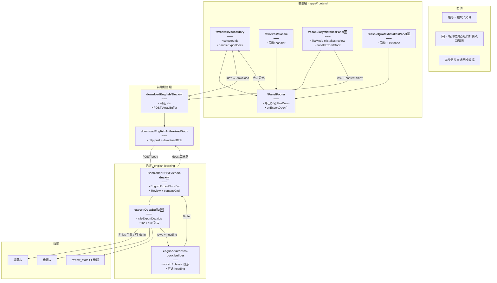
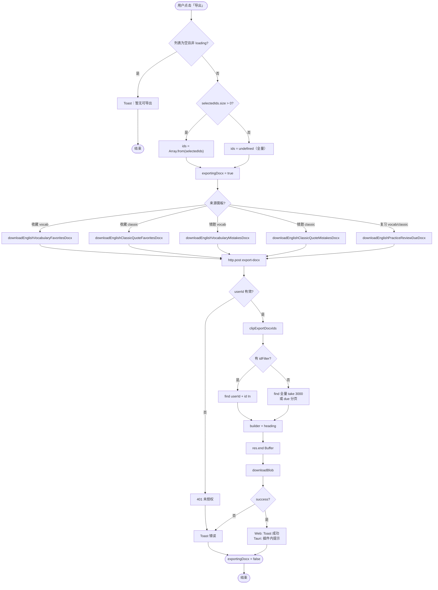
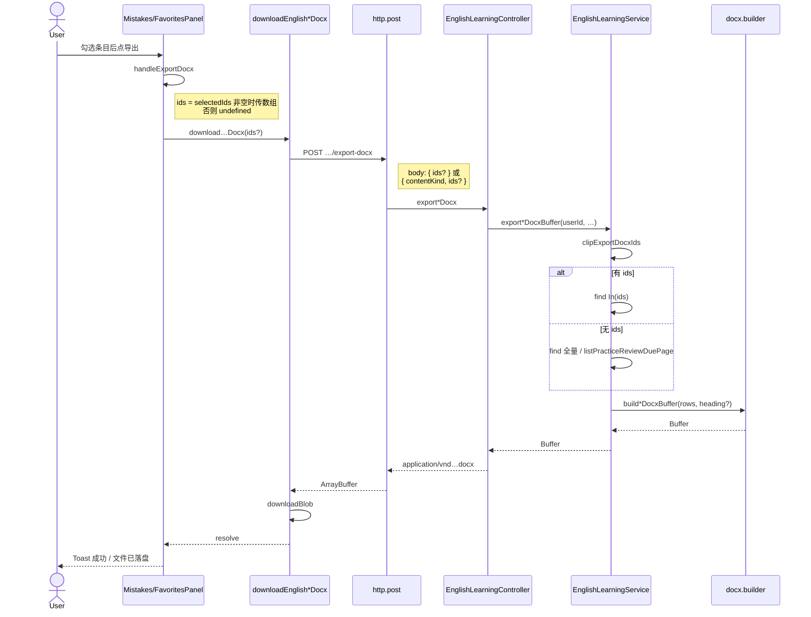
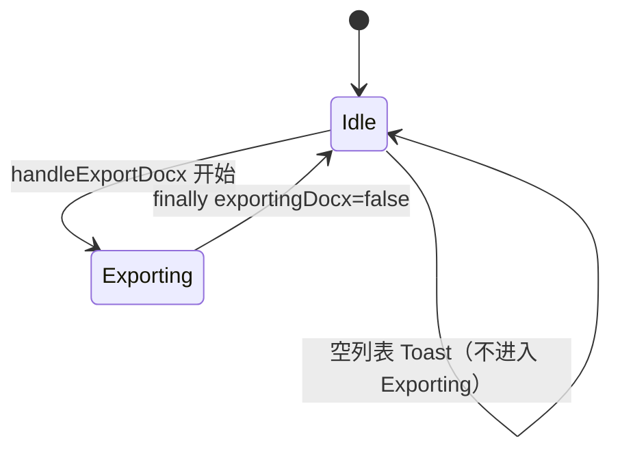

# 英语学习 DOCX 导出 — 实现思路

> **状态**：核心能力已落地（本文作方案复盘与扩展指引）  
> **日期**：2026-09-21  
> **需求摘要**：已登录用户在收藏 / 错题集 / 今日复习列表顶栏点「导出」，服务端合成 Word（DOCX）；若 checkbox 勾选了条目则只导出所选，否则全量（至多 3000 条）。

## 延伸阅读

- 语句库 JSON 导出（前端拉全、本机存 JSON，**不含** Word）：[语句库导出JSON.md](./语句库导出JSON.md)
- 学习笔记 DOCX 管线（另一业务域，可对照 `downloadBlob` / 二进制响应）：[学习笔记DOCX导出手册.md](../notes/学习笔记DOCX导出手册.md)
- 源码：`apps/backend/src/services/english-learning/english-favorites-docx.builder.ts`、`english-learning.service.ts`（`export*DocxBuffer`）、`english-learning.controller.ts`（`POST …/export-docx`）
- 前端：`apps/frontend/src/service/index.ts`（`downloadEnglish*Docx`）、收藏 / 错题 / 复习面板 `handleExportDocx`

---

## 0. 读本文你将得到什么

- **问题**：收藏、错题、今日复习只能在 App 内浏览，无法整份带走离线复习或备份。
- **方案一句话**：顶栏「导出」→ 可选 `ids` 的 `POST …/export-docx` → 服务端用共用 builder 合成 DOCX → 前端鉴权下载。
- **改动层**：前端 Footer + 四面板 handler；后端 5 个 POST + Service 过滤 + 共用 builder（可选标题）。
- **阶段**：M1 收藏全量 → M2 错题/复习全量 → M3 勾选仅导出所选（已完成）。
- **最大风险**：勾选只覆盖**已加载页**；跨页「真正全选」未做——与批量删除语义一致。

---

## 1. 需求与边界

### 1.1 用户故事

| 角色 | 场景 | 行为 | 期望结果 |
|------|------|------|----------|
| 已登录用户 | 单词/语句收藏列表 | 不勾选，点「导出」 | 下载最多 3000 条收藏 Word |
| 已登录用户 | 同上 | 勾选若干条后点「导出」 | Word 仅含勾选条目，副标题含「已选」 |
| 已登录用户 | 错题集（单词/语句） | 导出 | 同上规则，文档标题为「错题」 |
| 已登录用户 | 今日复习（单词/语句） | 导出 | 同上规则；无勾选时按到期升序全量 due |
| 已登录用户 | 列表为空 | 点导出 | Toast 提示无可导出，不发请求 |

### 1.2 范围

| 在范围内 | 不在范围内（非目标） |
|----------|----------------------|
| 收藏 vocab / classic DOCX | 语句库 / Pack 历史 JSON（另文） |
| 错题集 vocab / classic DOCX | 客户端本地用 `docx` 库拼装 |
| 今日复习 vocab / classic DOCX | 按勾选导出「未加载」的跨页条目 |
| 有勾选 → 仅 ids；无勾选 → 全量 | 导出 DOCX 内含 `lastUserInput` / SRS 字段 |
| Web + Tauri 统一 `downloadBlob` | 会员特权、异步 Job 队列 |

### 1.3 约束与依赖

- 须登录；路径挂在 `/english-learning/*`，鉴权与列表 API 相同。
- 复用：`english-favorites-docx.builder.ts`、`downloadBlob`、`FavoritesPanelFooter` / `MistakesPanelFooter` 文本链接样式、`remove-batch` 的 `{ ids }` 模式。
- 单次最多 **3000** 条（`FAVORITES_DOCX_EXPORT_MAX`），避免超大文档占内存。
- Ponytail：不新建第二套 builder；不按勾选走「前端拼 items body」。

---

## 2. 方案总览（一句话 + 要点）

**一句话方案**：五个 `POST …/export-docx` 共用 builder；body 可选 `ids`（复习另带 `contentKind`）；前端有勾选则传 `Array.from(selectedIds)`，否则空 body 触发全量。

| # | 设计要点 | 理由 |
|---|----------|------|
| 1 | DOCX 只在服务端生成 | 与收藏首版一致；字段权威来自 DB，避免客户端篡改 |
| 2 | POST + 可选 `ids`，不用 GET query 塞 UUID 列表 | 对齐 `remove-batch`；列表可长达 3000 |
| 3 | 错题/复习/收藏共用 builder，仅换 `heading` | 内容字段同构，少维护两套排版 |
| 4 | 勾选语义 = 已加载 `selectedIds` | 与删除一致，不假装跨页全选 |
| 5 | 复习有 `ids` 时按错题行 id 查表 | 复习列表 id 本就是 mistake id，可复用 remove 接口心智 |

---

## 3. 现状与复用

| 能力 | 仓库中已有 | 本需求中的用法 |
|------|------------|----------------|
| DOCX builder | `english-favorites-docx.builder.ts` | **扩展** `heading?: { title, subtitle }`；五行导出共用 |
| 收藏导出（历史 GET） | `exportVocabularyFavoritesDocxBuffer` 等 | **扩展** 为 POST + 可选 `ids` |
| 批量删除 DTO | `*RemoveBatchDto` `{ ids: uuid[] }` | **新增** `EnglishExportDocxDto`（ids 可选）、`PracticeReviewExportDocxDto` |
| 列表勾选 | 四面板 `selectedIds: Set<string>` | **直接复用** 传给 download |
| 顶栏操作链 | `FavoritesPanelFooter` / `MistakesPanelFooter` | **扩展** FileDown「导出」按钮 |
| 鉴权下载 | `downloadEnglishAuthorizedDocx` + `downloadBlob` | **扩展** `http.post` + body |
| 复习 due 列表 | `listPracticeReviewDuePage` | 全量导出时复用；有 ids 则走 mistake `In(ids)` |
| 语句 JSON 导出 | `exportClassicQuotesJson` 等 | **不适用**（客户端拼 JSON，非 Word） |

**调研结论**：收藏 DOCX 与 `downloadBlob` 已通；缺的是错题/复习入口，以及「勾选缩小范围」。最小路径是 Service 层 `clipExportDocxIds` + `where: { id: In(...) }`，前端四面板各加一行 `ids` 传递。

---

## 4. 架构图



**图内方法说明**：

| 方法 | 功能 |
|------|------|
| `handleExportDocx()` | 面板内：空列表 Toast；有勾选则 `Array.from(selectedIds)`，否则 `undefined`；调对应 `downloadEnglish*Docx` |
| `downloadEnglishVocabularyFavoritesDocx(ids?)` | 单词收藏导出入口；body 仅在有 ids 时带 `{ ids }` |
| `downloadEnglishClassicQuoteFavoritesDocx(ids?)` | 经典句收藏导出入口 |
| `downloadEnglishVocabularyMistakesDocx(ids?)` | 单词错题导出入口 |
| `downloadEnglishClassicQuoteMistakesDocx(ids?)` | 经典句错题导出入口 |
| `downloadEnglishPracticeReviewDueDocx(contentKind, ids?)` | 今日复习导出；body 必含 `contentKind`，可选 `ids` |
| `downloadEnglishAuthorizedDocx(path, filename, body?)` | 统一 `http.post` 取 `ArrayBuffer` → `Blob` → `downloadBlob`（Web/`<a>`，Tauri 插件） |
| `exportDocxBody(ids?)` | 有 ids 返回 `{ ids }`，否则 `{}`，避免传空数组误伤校验语义 |
| `exportVocabularyFavoritesDocxBuffer(userId, ids?)` | 查收藏表；有 ids 则 `In`；映射后调 vocab builder |
| `exportClassicQuoteFavoritesDocxBuffer(userId, ids?)` | 经典句收藏同构 |
| `exportVocabularyMistakesDocxBuffer(userId, ids?)` | 单词错题表 → builder，标题「英语单词错题」 |
| `exportClassicQuoteMistakesDocxBuffer(userId, ids?)` | 经典句错题同构 |
| `exportPracticeReviewDueDocxBuffer(userId, kind, ids?)` | 有 ids：mistake `In`；无 ids：`listPracticeReviewDuePage` 至多 3000 |
| `clipExportDocxIds(ids?)` | 去重、trim、截断至 3000；空则 `undefined`（全量） |
| `buildVocabularyFavoritesDocxBuffer(rows, heading?)` | 单词 DOCX：词/音标/词性/音节/释义/例句 |
| `buildClassicQuoteFavoritesDocxBuffer(rows, heading?)` | 经典句 DOCX：英文/译文/出处/赏析 |

**读图要点**：

- 四面板共用 Footer 交互，分支只在 download 函数与后端表不同。
- Builder 是唯一排版真相源；Service 只负责取行与标题文案。
- 🆕 相对「仅收藏 GET 全量」：错题/复习面、POST+ids、heading 覆盖。

---

## 5. 主流程图



**图内方法说明**：

| 方法 | 功能 |
|------|------|
| `handleExportDocx()` | 空列表短路；组装 ids；包一层 try/finally 管理 `exportingDocx` |
| `downloadEnglish*Docx(...)` | 选 path/filename，组 body，委托 `downloadEnglishAuthorizedDocx` |
| `downloadEnglishAuthorizedDocx(...)` | POST 二进制；校验 `ArrayBuffer`；调用 `downloadBlob` |
| `clipExportDocxIds(ids?)` | 规范化 ids；决定全量 vs 过滤 |
| `export*DocxBuffer(...)` | 按表取行并调用对应 builder |
| `buildVocabularyFavoritesDocxBuffer` / `buildClassicQuoteFavoritesDocxBuffer` | 生成 Word Buffer |
| `downloadBlob(meta, blob)` | 平台无关落盘；失败时 Web 抛错、Tauri 可能已 Toast |

**读图要点**：

- 关键分支只有两处：是否有勾选、来自哪类面板。
- 失败路径统一 Toast + 复位 loading，不留下半文件（服务端失败则无 Blob）。
- 复习与错题共用面板，用 `listMode` / `isReview` 选 download 函数。

---

## 6. 核心时序图



**图内方法说明**：

| 方法 | 功能 |
|------|------|
| `handleExportDocx` | 用户手势入口；决定是否带 ids |
| `downloadEnglish*Docx` | 选路由与文件名 |
| `http.post` | 鉴权 POST；非 JSON content-type 时解析为 ArrayBuffer |
| `export*Docx`（Controller） | 鉴权、设 Content-Disposition、`res.end(buf)` |
| `export*DocxBuffer` | 取数 + 调 builder |
| `clipExportDocxIds` | ids 归一化 |
| `build*DocxBuffer` | 排版生成 |
| `downloadBlob` | 触发本机下载 |

**读图要点**：

- Happy path 无轮询；一次请求拿完整文件。
- 参与者最少三层：面板 → 前端 download → 后端 Service/builder。
- 勾选与否只改变 body 与 Service 查询分支，不改下载管线。

---

## 7. 导出按钮状态机



**图内方法说明**：

| 方法 | 功能 |
|------|------|
| `handleExportDocx` | 进入 Exporting 前先判空；finally 保证回到 Idle |
| `exportDisabled` 计算 | `exportingDocx \|\| loading \|\| 空列表`，禁用按钮防重复点 |

**读图要点**：无多步向导；Exporting 期间 Footer 显示 Spinner +「下载中」。

---

## 8. 模块职责与接口草图

### 8.1 模块一览

| 模块 | 职责 | 新增/改动 | 预估路径 |
|------|------|-----------|----------|
| Builder | 单词/经典句 Word 排版 | 扩展 heading | `apps/backend/.../english-favorites-docx.builder.ts` |
| Service | 取行、ids 过滤、标题 | 扩展/新增 5 方法 | `english-learning.service.ts` |
| Controller | POST 导出二进制 | 改 GET→POST + Body | `english-learning.controller.ts` |
| DTO | 可选 ids / 复习 contentKind | 新增 | `dto/vocabulary-favorite.dto.ts`、`dto/practice-review.dto.ts` |
| API 常量 | 路径 | 新增 mistakes/review | `apps/frontend/src/service/api.ts` |
| download* | POST + ids | 扩展 | `apps/frontend/src/service/index.ts` |
| Footer | 导出按钮 | 扩展 Mistakes 对齐 Favorites | `*PanelFooter.tsx` |
| 四面板 | handleExportDocx 传 ids | 改动 | `favorites/*`、`mistakes/*` |
| i18n | 空列表/成功/失败文案 | 扩展 | `zh-CN.ts` / `en-US.ts` |

### 8.2 关键接口（草图）

```typescript
// 通用导出 body：省略 ids 或空 → 服务端全量
type EnglishExportDocxBody = {
	// 勾选的行 UUID；与 remove-batch 同形，便于复用校验
	ids?: string[];
};

// 今日复习额外要求 contentKind，才能选 vocab/classic 表
type PracticeReviewExportDocxBody = EnglishExportDocxBody & {
	// 与列表 query 同枚举，决定 join 哪张错题表
	contentKind: 'vocab' | 'classic';
};

// 前端：有勾选才塞 ids，避免 POST 无意义的空数组
function exportDocxBody(ids?: string[]): { ids?: string[] } {
	// 非空才返回 ids 字段，与「全量」语义对齐
	return ids && ids.length > 0 ? { ids } : {};
}

// 服务端：归一化后决定 In 过滤还是全表 take
function clipExportDocxIds(ids?: string[] | null): string[] | undefined {
	// 无有效 id → undefined，走全量分支
	if (!ids?.length) return undefined;
	// 去重并硬顶 3000，与 remove-batch 上限一致
	return [...new Set(ids.map((id) => id.trim()).filter(Boolean))].slice(
		0,
		3000,
	);
}
```

### 8.3 数据模型

| 字段/实体 | 来源 | 存储 | 说明 |
|-----------|------|------|------|
| 收藏/错题 `id` | DB UUID | DB | 勾选与导出过滤键 |
| vocab 内容字段 | 收藏/错题行 | DB | word/ipa/pos/segmentation/translationZh/example |
| classic 内容字段 | 收藏/错题行 | DB | english/translationZh/source/noteZh |
| `nextReviewAt` 等 | review_state | DB | **不进 DOCX**；仅影响 due 全量排序 |
| `lastUserInput` | 错题行 | DB | **不进 DOCX** |
| DOCX Buffer | builder | 响应体 | 不落盘服务端 |

### 8.4 路由一览

| Method | Path | Body |
|--------|------|------|
| POST | `/english-learning/vocabulary-favorites/export-docx` | `{ ids? }` |
| POST | `/english-learning/classic-quotes-favorites/export-docx` | `{ ids? }` |
| POST | `/english-learning/vocabulary-mistakes/export-docx` | `{ ids? }` |
| POST | `/english-learning/classic-quote-mistakes/export-docx` | `{ ids? }` |
| POST | `/english-learning/practice/review/export-docx` | `{ contentKind, ids? }` |

---

## 9. 分阶段实现步骤

| 阶段 | 目标 | 交付物 | 依赖 |
|------|------|--------|------|
| M1 | 收藏 DOCX 全量 | builder + GET/后改 POST + 收藏 Footer | — |
| M2 | 错题 / 复习全量 | 3 端点 + Mistakes Footer 导出 | M1 builder |
| M3 | 勾选仅导出所选 | Service In(ids) + 前端传 selectedIds | M1–M2 |

### M1 — 收藏全量

- [x] `buildVocabularyFavoritesDocxBuffer` / `buildClassicQuoteFavoritesDocxBuffer`
- [x] Service `export*FavoritesDocxBuffer` + Controller
- [x] 前端 `downloadEnglish*FavoritesDocx` + 收藏面板

### M2 — 错题与复习

- [x] `export*MistakesDocxBuffer` + `exportPracticeReviewDueDocxBuffer`
- [x] MistakesPanelFooter 导出按钮
- [x] 两 mistakes 面板按 `listMode` 分流 download

### M3 — 勾选范围

- [x] `EnglishExportDocxDto` / `PracticeReviewExportDocxDto`；GET→POST
- [x] `clipExportDocxIds` + `In(ids)`；heading「已选」
- [x] 四面板 `selectedIds.size > 0` 时传 ids

---

## 10. 关键决策与备选方案

| 决策 | 选用 | 备选 | 为何不选备选 |
|------|------|------|--------------|
| 生成位置 | 服务端 builder | 前端 `docx` 库 | 需新依赖；字段易与 DB 漂移 |
| 缩小范围 | POST `{ ids }` | POST 整条 items | payload 大；绕过服务端权威 |
| 无勾选 | 全量至多 3000 | 禁止导出 / 强制勾选 | 与收藏首版体验一致 |
| 复习有 ids | 直接 mistake `In` | 再 join due 校验 | 选中行来自 due 列表；少一次 join |
| HTTP | POST | GET + query ids | URL 过长；与 remove-batch 不一致 |

---

## 11. 风险、边界与待确认

| 项 | 等级 | 说明 | 缓解 |
|----|------|------|------|
| 勾选非跨页 | 中 | 全选只覆盖已加载 `entries` | 文案/心智与删除一致；大导出靠「不勾选」 |
| 3000 截断 | 中 | 超大收藏静默截断 | 与历史常量一致；DOCX 副标题写条数 |
| 空 ids 数组 | 低 | `{}` vs `{ ids: [] }` | `clipExportDocxIds` 与前端 `exportDocxBody` 均当全量 |
| 复习已移除错题 | 低 | 勾选后错题被删再导出 | `In` 得到空行 → 空文档；可接受 |
| 二进制 POST | 低 | http 客户端须走 arrayBuffer | `parseResponseBody` 已按 content-type 处理 |

**待确认**（若产品要改）：

- [ ] 是否要在导出成功 Toast 中区分「已选 N 条」与「全量 N 条」？（验证：产品确认文案）
- [ ] 是否要做「导出当前筛选结果」以外的异步邮件投递？（验证：YAGNI，暂不做）

---

## 12. 验收清单

| # | 用例 | 步骤 | 期望 |
|---|------|------|------|
| AC1 | 收藏全量 | 单词收藏不勾选 → 导出 | 下载 docx，标题「英语单词收藏」，条数≤3000 |
| AC2 | 收藏已选 | 勾选 2 条 → 导出 | docx 仅 2 条，副标题含「已选」 |
| AC3 | 错题全量 | 错题集不勾选 → 导出 | 标题为错题文案 |
| AC4 | 复习已选 | 今日复习勾选 → 导出 | 仅勾选；`contentKind` 对应 vocab/classic |
| AC5 | 空列表 | 空收藏点导出 | Toast 空提示，无网络成功下载 |
| AC6 | 导出中防重 | 导出进行中再点 | 按钮 disabled / Spinner |
| AC7 | Tauri | 桌面端导出 | 走 `downloadBlob` 插件落盘 |
| AC8 | 未登录 | 无 token POST | 401，前端错误提示 |

---

## 13. 预估改动面（实现阶段参考）

| 类型 | 路径（预估） |
|------|--------------|
| 后端 builder | `apps/backend/src/services/english-learning/english-favorites-docx.builder.ts` |
| 后端 service/controller/dto | `english-learning.service.ts`、`english-learning.controller.ts`、`dto/vocabulary-favorite.dto.ts`、`dto/practice-review.dto.ts` |
| 前端 API/service | `apps/frontend/src/service/api.ts`、`service/index.ts` |
| 前端 UI | `favorites/components/FavoritesPanelFooter.tsx`、`mistakes/components/MistakesPanelFooter.tsx`、`favorites/vocabulary|classic/index.tsx`、`mistakes/vocabulary|classic/*Panel.tsx` |
| i18n | `apps/frontend/src/i18n/locales/zh-CN.ts`、`en-US.ts` |
| 文档（本文） | `remote-docs/wiki/ideas/english/英语学习DOCX导出.md` |
| 文档（落地后归档，可选） | `remote-docs/wiki/english/`（用 `implementation-doc-from-diff`） |

---

（本文档为规划/复盘态实现思路；落地细节以主仓库源码为准。与语句库 JSON 导出正交，勿混用链路。）
