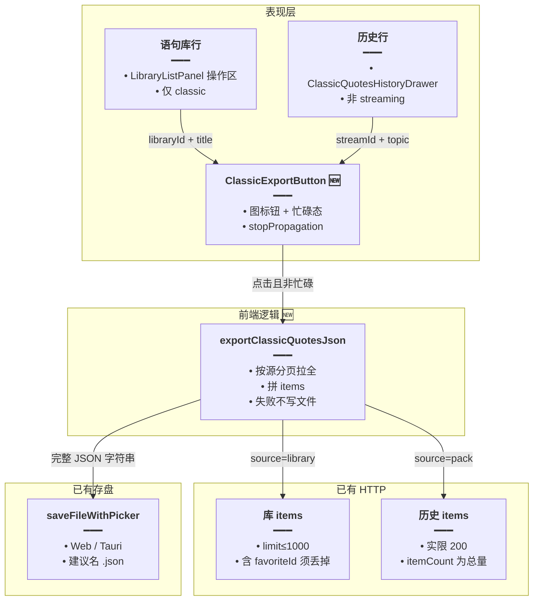
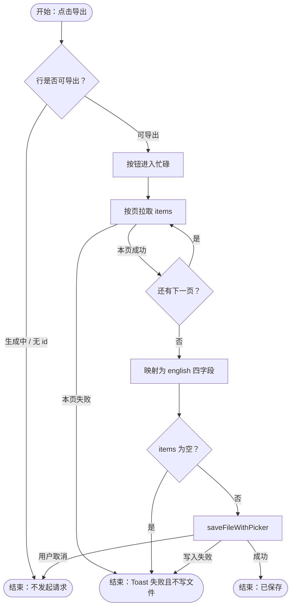
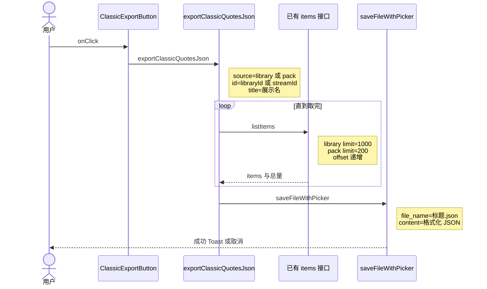

# 语句库导出 JSON — 实现思路

> **状态**：规划（未实现；列表分页与保存文件已有）  
> **日期**：2026-09-19  
> **需求摘要**：用户在语句库列表或语句拉取历史的一行上点「导出」，把该集合全部语句存成本机 JSON，字段与生成/导入用的原句格式一致。

## 延伸阅读

- 语句生成输出约定：`apps/backend/src/services/english-learning/prompt.ts`（`items[].english/translationZh/source/noteZh`）
- 整集标注（本导出不包含词性/IPA）：[经典句整集标注预热.md](./经典句整集标注预热.md)
- 收藏 / 错题 / 今日复习 **Word（DOCX）** 导出（另一条链路）：[英语学习DOCX导出.md](./英语学习DOCX导出.md)

---

## 0. 读本文你将得到什么

- **问题**：语句只在库/历史里，无法整份带走给外部模型或备份。
- **方案**：行内按钮 → 前端按已有分页接口拉全量 → 拼成 `{ items }` → 复用 `saveFileWithPicker` 存 `.json`。
- **改动层**：只改前端（按钮 + 一个导出函数 + i18n）。不新增后端接口、不改表。
- **阶段**：M1 库与历史都能导出；M2 空库、进行中、公开库只读等边界。
- **最大风险**：大库要多次分页（库每页最多 1000，历史每页最多 200），中途失败会得到不完整文件——失败则不写文件。

---

## 1. 需求与边界

### 1.1 用户故事

| 角色 | 场景 | 行为 | 期望结果 |
|------|------|------|----------|
| 已登录用户 | 语句库列表一行（含公共库） | 点导出 | 下载该库全部语句 JSON |
| 已登录用户 | 经典语句历史抽屉一行 | 点导出 | 下载该次拉取的全部语句 JSON |
| 已登录用户 | 历史行仍在生成 | 看操作区 | 不提供导出（与练习/删除同，生成中只显示转圈） |

### 1.2 范围

| 在范围内 | 不在范围内（非目标） |
|----------|----------------------|
| 语句库列表 item 操作区加导出 | 单词库导出 |
| 语句拉取历史 item 操作区加导出 | 收藏 / 错题 / 练习队列导出 |
| 文件含全部 `english/translationZh/source/noteZh` | 词性、IPA、逐词释义（标注是另一条链路） |
| Web 与 Tauri 都走现有保存 | 新后端 export 路由、ZIP、DOCX |

### 1.3 约束与依赖

- 须登录；公共库只要现有 `listClassicQuotesLibraryItems` 能读就能导（`assertClassicQuotesLibraryReadable` 已放行可读库）。
- 复用 `saveFileWithPicker`（Web：文件选择器，失败则 `<a download>`；Tauri：`save_file_with_picker`）。
- 单库上限与现有生成上限同一量级（常见几百～一两千，极端约 6000）。分页拉完即可，不必一次 SQL。
- 点击不得冒泡到行本身（行点击是打开库/载入历史）。

---

## 2. 方案总览

**一句话方案**：在语句库行与历史行操作区加导出按钮；前端循环现有 items 分页直到取完，丢掉收藏 id 等运行时字段，写成与生成格式同构的 JSON，交给 `saveFileWithPicker`。

| # | 设计要点 | 理由 |
|---|----------|------|
| 1 | 不新增 API | 库 `GET .../libraries/:id/items` 上限 1000；历史 `GET .../history/:streamId/items` 服务端上限 200，循环即可 |
| 2 | 导出体只有 `title` + `items` | 与豆包/再导入需要的原句字段对齐；不要 `favoriteId`、`sortOrder`、`id` |
| 3 | 拉全成功才写文件 | 中途失败不落半截 JSON |
| 4 | 按钮与标注/练习同一操作条 | 用户已在红框位置找操作；生成中的历史行不挂按钮 |

---

## 3. 现状与复用

| 能力 | 仓库中已有 | 本需求中的用法 |
|------|------------|----------------|
| 语句库行操作 | `apps/frontend/src/views/englishLearning/library/components/LibraryListPanel.tsx` | `kind==='classic'` 时在标注/练习旁加导出 |
| 历史行操作 | `apps/frontend/src/views/englishLearning/sections/classic/ClassicQuotesHistoryDrawer.tsx` | 非 streaming 时在练习与删除之间加导出 |
| 库内分页 | `listEnglishClassicQuotesLibraryItems`（controller limit ≤1000） | 以 1000 步进直到 `items.length < limit` 或 offset ≥ `quoteCount` |
| 历史明细分页 | `listEnglishClassicQuotesPackItems`（service `PACK_HISTORY_ITEMS_PAGE_MAX = 200`） | 以 200 步进；用返回的 `itemCount` 判结束 |
| 存盘 | `saveFileWithPicker`（`apps/frontend/src/utils/index.ts`） | `content` 为 `JSON.stringify(..., null, 2)`，文件名用标题 |
| 生成 JSON 形状 | `prompt.ts` 的 `{"items":[{english,translationZh,source,noteZh}]}` | 导出 `items` 与此相同，便于外部标注或对照 |

**调研结论**：数据已经能分页读出，缺的只是「拉全 + 落盘」和两个入口按钮。单词库共用 `LibraryListPanel`，导出必须按 `kind==='classic'` 分支，避免误导到单词行。

---

## 4. 架构图



**图内方法说明**：

| 方法 / 模块入口 | 功能 |
|-----------------|------|
| `ClassicExportButton` | 行内图标；点击调用导出并在请求期间禁用，避免连点打出多份文件 |
| `exportClassicQuotesJson` | 按 `library` 或 `pack` 循环分页、映射字段、成功后保存 |
| `listEnglishClassicQuotesLibraryItems` | 已有：按库 id 分页返回语句行（含收藏 id，导出时丢弃） |
| `listEnglishClassicQuotesPackItems` | 已有：按 streamId 分页返回该次拉取的语句与 `itemCount` |
| `saveFileWithPicker` | 已有：把字符串存成用户选定路径；取消选择视为用户中止，不当成失败 Toast 风暴 |

**读图要点**：

- 新增只在表现层按钮和一段纯函数；HTTP 与存盘都不新造。
- 库与历史共用导出函数，用 `source` 区分分页上限和结束条件。
- 公共库不走写接口，只读 items，与「能打开就能导出」一致。

---

## 5. 主流程图



**图内方法说明**：

| 方法 | 功能 |
|------|------|
| `exportClassicQuotesJson` | 串起分页、映射、空集判断和存盘；任一页失败则整次失败 |
| `saveFileWithPicker` | 仅在内存中已拼好完整 JSON 后调用 |

**读图要点**：

- 入口在行按钮，不在库详情页。
- 空集合与网络失败都不到存盘。
- 用户在系统保存框点取消：不报「导出失败」。

---

## 6. 核心时序图



**图内方法说明**：

| 方法 | 功能 |
|------|------|
| `onClick` | 阻止冒泡，避免点导出时打开库或载入历史 |
| `exportClassicQuotesJson` | 拉全、映射、调用存盘 |
| `listItems` | 库或历史的已有 GET；返回本页语句 |
| `saveFileWithPicker` | 把最终字符串交给系统保存对话框或下载 |

**读图要点**：

- 只有用户、按钮、导出函数、已有接口、已有存盘五方；没有新服务端参与者。
- 循环在导出函数内部，按钮只等一个 Promise。
- 保存发生在循环结束之后，所以磁盘上不会出现缺页文件。

---

## 8. 模块职责与接口草图

### 8.1 模块一览

| 模块 | 职责 | 新增/改动 | 预估路径 |
|------|------|-----------|----------|
| 导出函数 | 分页拉全、映射、存盘 | 新增 | `apps/frontend/src/views/englishLearning/utils/exportClassicQuotes.ts` |
| 图标按钮 | 忙碌、aria、stopPropagation | 新增 | `apps/frontend/src/views/englishLearning/components/ClassicExportButton.tsx` |
| 语句库行 | classic 分支挂按钮 | 扩展 | `library/components/LibraryListPanel.tsx` |
| 历史行 | 非 streaming 挂按钮 | 扩展 | `sections/classic/ClassicQuotesHistoryDrawer.tsx` |
| 文案 | 按钮名、空库、失败 | 扩展 | `apps/frontend/src/i18n/locales/zh-CN.ts`、`en-US.ts` |

### 8.2 关键接口

```typescript
// 导出来源：库与历史分页上限不同，必须分开
type ClassicExportSource =
	// 语句库：走 libraries/:id/items，页大小 1000
	| { source: 'library'; libraryId: string; title: string; quoteCount?: number }
	// 拉取历史：走 history/:streamId/items，页大小 200
	| { source: 'pack'; streamId: string; title: string; quoteCount?: number };

// 落盘形状与生成 JSON 的 items 对齐，方便外部标注
type ClassicExportFile = {
	// 文件内标题，避免只看文件名才知道是哪一套
	title: string;
	// 只要原句四字段，不带收藏 id
	items: { english: string; translationZh: string; source: string; noteZh: string }[];
};

// 拉全再保存；抛错表示未写文件
async function exportClassicQuotesJson(input: ClassicExportSource): Promise<void> {
	// 与现有接口实际上限一致，避免一次请求被截断还以为取完
	const pageSize = input.source === 'library' ? 1000 : 200;
	// 内存攒齐再 stringify，中途失败不会落半截文件
	const items: ClassicExportFile['items'] = [];
	// 分页起点
	let offset = 0;
	// 直到本页不足一页或 offset 达到总量
	for (;;) {
		// 复用已有 GET，不新开 export 路由
		const page = await fetchPage(input, pageSize, offset);
		// 逐行映射，避免把 favoriteId 写进文件
		for (const row of page.rows) {
			items.push({
				// 原句，外部标注的唯一对齐键
				english: row.english,
				// 中文可空，外部模型只作语境
				translationZh: row.translationZh ?? '',
				// 出处可空
				source: row.source ?? '',
				// 赏析可空
				noteZh: row.noteZh ?? '',
			});
		}
		// 本页条数推进偏移
		offset += page.rows.length;
		// 本页不满或已达总量即停，防止死循环
		if (page.rows.length < pageSize || offset >= page.total) break;
	}
	// 空集合不打开保存框
	if (items.length === 0) throw new Error('empty');
	await saveFileWithPicker({
		// 缩进 2 格，方便人工打开核对
		content: JSON.stringify({ title: input.title, items }, null, 2),
		// 标题里的路径符已替换，避免保存失败
		file_name: `${safeFileName(input.title)}.json`,
	});
}
```

### 8.3 数据模型

| 字段 | 来源 | 存储 | 说明 |
|------|------|------|------|
| `english` / `translationZh` / `source` / `noteZh` | 库行或历史行 | 仅导出文件 | 与 `EnglishClassicQuoteItem` 一致 |
| `favoriteId` / `id` / `sortOrder` | 库 items 响应 | 不导出 | 换机器无意义，且会干扰外部标注 |
| `title` | 库标题或历史 topic | 文件内 + 文件名 | 空标题用「语句」兜底 |

文件示例：

```json
{
  "title": "日常交流",
  "items": [
    {
      "english": "Don't worry about it.",
      "translationZh": "别担心。",
      "source": "",
      "noteZh": ""
    }
  ]
}
```

---

## 9. 分阶段实现步骤

| 阶段 | 目标 | 交付物 | 依赖 |
|------|------|--------|------|
| M1 | 两处都能导出非空集合 | 函数 + 按钮 + 中英文案 | 无 |
| M2 | 边界不误伤 | 空库 Toast、生成中不显示、取消不报失败 | M1 |

- [ ] M1：`exportClassicQuotesJson` 覆盖 library / pack，页大小分别为 1000 / 200
- [ ] M1：`LibraryListPanel` 仅 `kind==='classic'` 显示按钮，`onClick` stopPropagation
- [ ] M1：历史抽屉在 `!isStreaming` 的操作区显示同一按钮
- [ ] M1：`zh-CN` / `en-US` 增加按钮 aria 与失败文案
- [ ] M2：0 条时 Toast，不打开保存框
- [ ] M2：保存框取消不弹失败（对照 `saveFileWithPicker` 现有取消分支，必要时让导出函数识别取消）

---

## 10. 关键决策与备选方案

| 决策 | 选用 | 备选 | 为何不选备选 |
|------|------|------|--------------|
| 谁组装文件 | 前端分页 | 新 `GET .../export` 一次返回 | 数据已有分页读接口；新路由要再做权限与大响应，收益不大 |
| 文件内容 | 原句四字段 | 带词性/IPA 的标注 JSON | 标注缓存按句 hash，不挂在库行上；导出标注会变成第二次产品 |
| 入口 | 列表/历史行 | 只在打开库之后的详情顶栏 | 用户明确要在 item 操作区，与练习/标注并列 |

---

## 11. 风险、边界与待确认

| 项 | 等级 | 说明 | 缓解 |
|----|------|------|------|
| 大库多次请求 | 中 | 6000 条库约 6 次；历史 200 一页，1445 条约 8 次 | 按钮忙碌；失败不写文件 |
| 历史 controller 未先截断 limit | 低 | service 仍会 cap 到 200；前端必须按 200 翻页，不能只请求一次 10000 | 导出函数写死 200 |
| 公共库 | 低 | 只读导出，不写对方库 | 沿用可读校验 |
| 文件名非法字符 | 低 | 标题可能含 `/` | `safeFileName` 替换路径符 |

**待确认**：无。取消保存时是否已有「静默」取决于 `saveFileWithPicker` 的 catch：实现时读该函数，用户取消不要再套一层 error Toast。

---

## 12. 验收清单

| # | 用例 | 步骤 | 期望 |
|---|------|------|------|
| AC1 | 语句库导出 | 库列表对「日常交流」点导出并保存 | 文件 `items.length` 等于该库条数；含 english 与中文 |
| AC2 | 历史导出 | 历史抽屉对一条已完成记录导出 | 条数等于该行「N 条」；进行中的行没有导出钮 |
| AC3 | 不冒泡 | 点导出 | 不打开库、不载入该历史 |
| AC4 | 单词行 | 切到单词库列表 | 行上没有此导出钮 |
| AC5 | 空与失败 | 0 条或断网 | 有提示，磁盘无新文件 |
| AC6 | 字段 | 打开 JSON | 无 `favoriteId`；有 `title` 与 `items` |

---

## 13. 预估改动面

| 类型 | 路径（预估） |
|------|----------------|
| 前端 | `views/englishLearning/utils/exportClassicQuotes.ts`、`components/ClassicExportButton.tsx`、`library/components/LibraryListPanel.tsx`、`sections/classic/ClassicQuotesHistoryDrawer.tsx`、`i18n/locales/zh-CN.ts`、`en-US.ts` |
| 后端 | 无 |
| 文档（实现后） | 若需归档，用 implementation-doc-from-diff 写入 `wiki/english/`，不要把实现细节堆回本规划文 |
