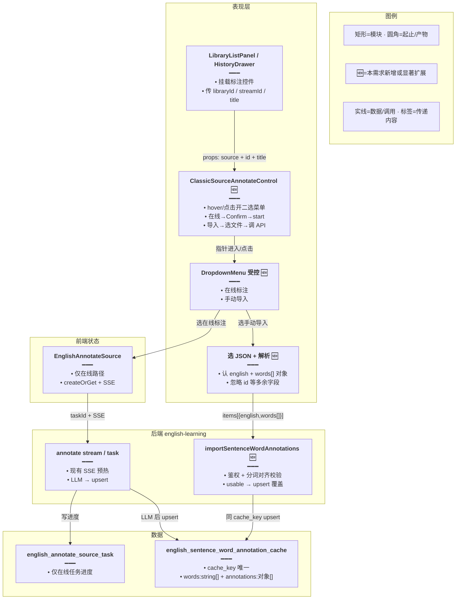
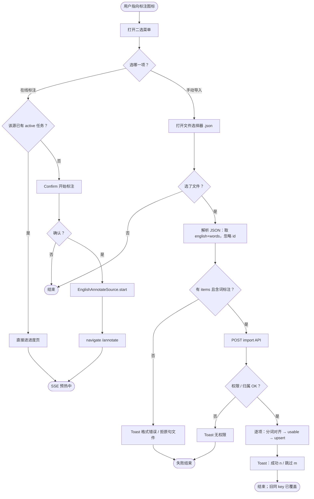
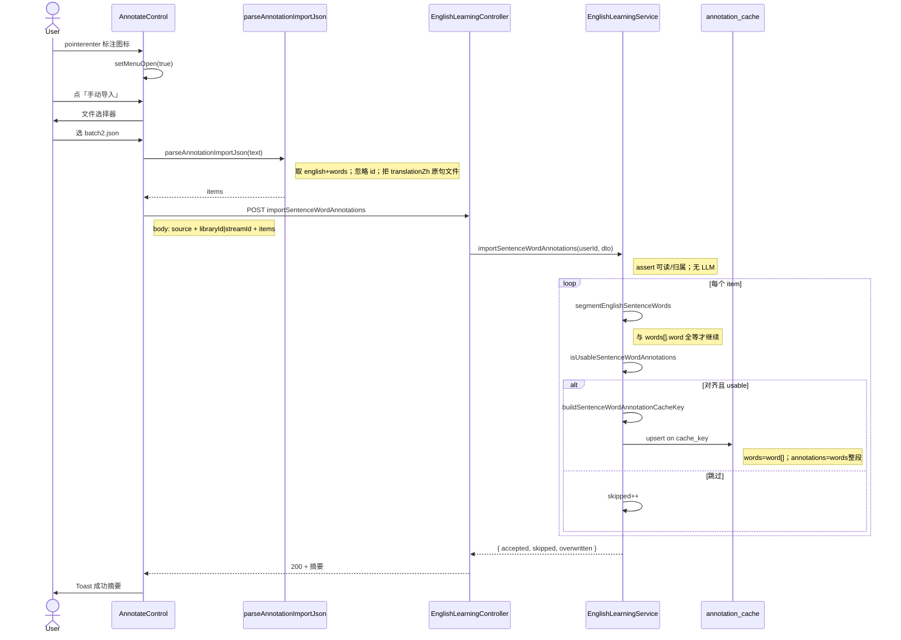
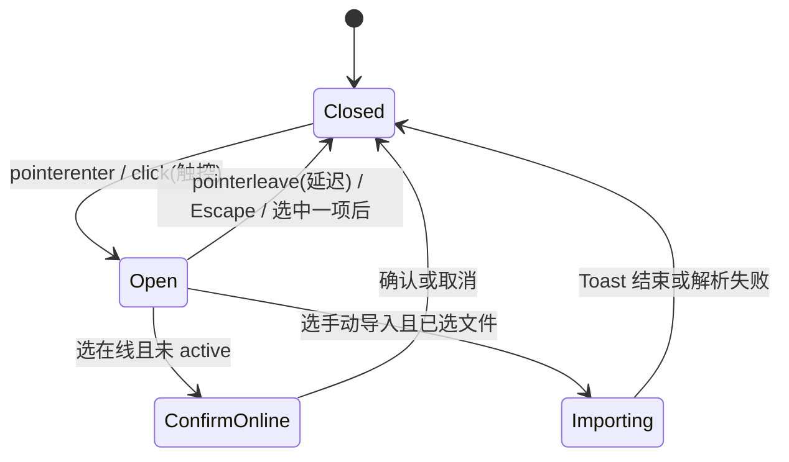

# 语句库标注手动导入 — 实现思路

> **状态**：核心已落地（菜单 + 导入 API）；**部分句导入**为一等能力  
> **日期**：2026-09-19  
> **需求摘要**：用户 hover「标注」图标时弹出二选菜单——「在线标注」走现有 SSE 预热；「手动导入」选 JSON（可只含当前 library/pack 的**一部分**句子）upsert 进全局缓存表，同句同分词已有行以导入为准覆盖；多余字段（如 `id`）忽略；不要求文件覆盖全集。

## 延伸阅读

- 在线整集预热（SSE）：[经典句整集标注预热.md](./经典句整集标注预热.md)
- 任务持久化续跑：[标注任务持久化续跑.md](./标注任务持久化续跑.md)
- 原句导出（**不含**词标注）：[语句库导出JSON.md](./语句库导出JSON.md)
- 省 Token（不改落库契约）：[整集标注省Token.md](./整集标注省Token.md)

---

## 0. 读本文你将得到什么

- **问题**：只能 LLM 在线预热；外部已标好的 JSON（常为分批/子集）无法灌进练习用缓存。
- **方案**：标注按钮改为 hover 二选菜单；在线路径不动；导入按文件 `items[].words` 拆成 DB 的 `words` + `annotations`，按 `cache_key` upsert；**允许只导入全集中的一部分**。
- **改动层**：前端控件 + 解析/选文件 + 一个后端导入接口 + i18n；**不改**缓存表结构。
- **阶段**：M1 菜单 + 导入契约（含部分导入）；M2 校验/统计；M3 练习侧缓存失效。
- **最大风险**：标注缓存**全局共享**；原句导出 JSON **不能**当标注导入用；误以为必须整库一份文件才是错的。

---

## 1. 需求与边界

### 1.1 用户故事

| 角色 | 场景 | 行为 | 期望结果 |
|------|------|------|----------|
| 已登录用户 | 语句库列表行「标注」图标 | 鼠标悬停 | 出现菜单：「在线标注」「手动导入」 |
| 已登录用户 | 菜单点「在线标注」 | 确认后 | 与现网一致：建/复用任务 → 跳转进度页 → SSE |
| 已登录用户 | 菜单点「手动导入」 | 选本地标注 JSON（可含 `id`） | 合法项 upsert；同 key 覆盖；`id` 忽略 |
| 已登录用户 | Pack 历史 / 结果页同类按钮 | 同上 | 同一控件行为（library / pack 入口一致） |
| 已登录用户 | 库/Pack 共 N 句，JSON 只有其中 K 句（K≪N） | 手动导入该子集文件 | **成功写入这 K 句**；不因未覆盖全集而失败；其余句缓存不动 |
| 已登录用户 | 库里已有部分标注 | 再导入另一批重叠/新句 | 重叠句以文件为准；未出现在文件中的旧缓存**保留** |

### 1.2 范围

| 在范围内 | 不在范围内（非目标） |
|----------|----------------------|
| hover（指针）/ 点击（触控）打开二选菜单 | 新建 HoverCard 组件；改缓存表 schema |
| 在线标注 = 现有 Confirm + `EnglishAnnotateSource.start` | 改 SSE / 任务表字段 |
| 手动导入标注 JSON → upsert 缓存 | 用「原句导出 JSON」当标注导入；导入改 quote 行 |
| library / pack 共用 `ClassicSourceAnnotateControl` | 收藏 / 错题单独入口 |
| 覆盖语义：同 `cache_key` upsert；**允许部分句文件** | 先 DELETE 该库全部缓存再导入；要求文件条数 = 库/Pack 总句数 |
| 忽略文件中 `id` / 未知字段 | 强制用户删掉 `id` 才能导入 |
| Web + Tauri 同一选文件 + API | 标注结果「整库导出」按钮（可后续另开需求） |

### 1.3 约束与依赖

- 须登录；库读权限复用现有 `assertClassicQuotesLibraryReadable`；Pack 须会话归属校验（与在线预热同）。
- 落库目标**只有**全局表 `english_sentence_word_annotation_cache`（不写 classic quote / library item）。
- 分词必须与练习一致：`segmentEnglishSentenceWords`（后端）↔ `segmentSentence.ts`（前端）；`words[].word` 须与分词结果**逐项全等**，否则该句 skip（避免写进练习永远 miss 的 key）。
- 可用行判定复用 `isUsableSentenceWordAnnotations`（词数对齐 + `posZh`/`ipa`/`meaningZh` 均非空）。
- Ponytail：不新建任务卡给导入；不复用经典句 `parseClassicImport`；菜单用已有 `@ui/dropdown-menu`（受控 hover），不要新依赖。
- 列表行点击打开库：菜单触发须 `stopPropagation`（与导出按钮同）。
- **部分导入**：`items.length` 可远小于库/Pack 句数；**禁止**用 `quoteCount` / 源总句数作为导入成败条件；source id 只做鉴权，不要求文件覆盖该源全部 `english`。

---

## 2. 方案总览（一句话 + 要点）

**一句话方案**：把 `ClassicSourceAnnotateControl` 改成 hover/点击二选菜单；在线项复用现链路；导入项接受 `{ items: [{ english, words: [{ word, posZh, ipa, meaningZh }] }] }`（可带 `id`，可为源句集的**子集**），校验分词对齐后 `upsert`（同 `cache_key` 覆盖，文件外旧缓存保留）。

| # | 设计要点 | 理由 |
|---|----------|------|
| 1 | 只改控件内部，挂载点不动 | `LibraryListPanel` / `ClassicQuotesHistoryDrawer` / `pack` 已共用控件 |
| 2 | 文件形态对齐真实样本（如 `batch2.json`） | `words` **即**标注行，无单独 `annotations` 数组；勿与原句导出混用 |
| 3 | 多余字段（`id` 等）忽略 | 外部模型常带序号；硬拒会无谓折腾用户 |
| 4 | upsert on `cache_key` = 覆盖 | 与在线 LLM 落库同一路径；无需整表 wipe |
| 5 | **显式支持部分导入** | 外部常按 batch 标一部分；条数 < 源总句数仍成功 |
| 6 | 文件外旧缓存保留 | 「以导入为准」= 重叠句覆盖，非整库清空 |
| 7 | 导入不建 annotate task | 无 LLM、无进度 SSE；Toast 摘要即可 |
| 8 | 指针 hover 开菜单；触控点按开 | 满足产品「hover」；移动端仍可用 |

---

## 3. 现状与复用

| 能力 | 仓库中已有 | 本需求中的用法 |
|------|------------|----------------|
| 标注入口控件 | `apps/frontend/src/views/englishLearning/components/ClassicSourceAnnotateControl.tsx` | **扩展**：Tooltip 单按钮 → 二选菜单；在线逻辑直接复用 |
| 在线任务 + SSE | `store/englishAnnotateSource.ts`；`utils/annotateClassicSourceSse.ts`；`annotate-source-task.service.ts` | **直接复用**「在线标注」项 |
| 缓存表 / upsert | `entity/english-sentence-word-annotation-cache.entity.ts`；service 内 `upsert(..., ['cacheKey'])` | **直接复用**写库；导入只跳过 LLM |
| cache_key / usable | `sentence-word-annotation-cache.util.ts` | **直接复用** |
| 分词 | `sentence-segment.util.ts`（BE）；`practice/utils/segmentSentence.ts`（FE） | **直接复用**；与文件 `words[].word` 做全等校验 |
| 经典句 JSON 导入 | `views/englishLearning/import/index.tsx` → `parseClassicImport` | **不适用**落标注；仅可参考选文件 UX |
| 原句导出 | `utils/exportClassicQuotes.ts` | **不适用**；字段是 `translationZh`，不是词标注 |
| 下拉菜单 | `@/components/ui/dropdown-menu` | **扩展**为受控 `open` + pointer enter/leave |
| Confirm / Toast / i18n | `@design/Confirm`；`@ui/sonner`；`annotateSource.*` | **直接复用**；新增 `annotateSource.import*` |
| HoverCard | 仓库无 | **不适用** |

**调研结论**：写库管线已齐；缺口是菜单 + **与 `batch2.json` 同构的契约** + 无 LLM 批量 upsert。样本核验：70 句 `words[].word` 与本仓分词 100% 对齐，可直接作为验收样例。

---

## 4. 架构图



**图内方法说明**：

| 方法 / 模块入口 | 功能 |
|-----------------|------|
| `ClassicSourceAnnotateControl` | 列表行标注入口；本需求扩展为菜单宿主，挂载点不变 |
| `EnglishAnnotateSource.start(...)` | 创建或复用标注任务并开 SSE；仅「在线标注」调用 |
| `importSentenceWordAnnotations(...)` 🆕 | 接收标注 items；分词对齐 + usable 后批量 upsert；无 LLM、无 task |
| `buildSentenceWordAnnotationCacheKey(...)` | 用 version + 规范化句 + words 生成 sha256；导入与在线共用 |
| `isUsableSentenceWordAnnotations(...)` | 判断词标注是否可入库；导入失败项据此 skip |
| `segmentEnglishSentenceWords(...)` | 服务端分词；与文件 `words[].word` 做全等比对 |

**读图要点**：

- 两条路径在菜单处分叉，**汇合点只有缓存表**。
- 导入不碰 task 表；文件 `words` 对象数组拆成表内两列后再写。
- 🆕 集中在控件、选文件解析、一个导入入口。

---

## 5. 主流程图



**图内方法说明**：

| 方法 | 功能 |
|------|------|
| `EnglishAnnotateSource.start(...)` | 在线分支：建任务并跳转；与现网一致 |
| `parseAnnotationImportJson(...)` 🆕 | 前端初检：`items[]` 每项有 `english` + `words[{word,posZh,ipa,meaningZh}]`；忽略 `id`；原句形态整文件拒绝 |
| `importSentenceWordAnnotations(...)` 🆕 | 后端主路径：鉴权、分词对齐、usable、upsert；返回 accepted/skipped |
| `buildSentenceWordAnnotationCacheKey(...)` | 为每条合法项算 key，驱动覆盖写 |
| `isUsableSentenceWordAnnotations(...)` | 决定该项写入或计入 skipped |

**读图要点**：

- 在线与导入在菜单后完全分叉。
- 导入是局部覆盖：文件外旧缓存不删；**文件条数可远小于源总句数**。
- 分词不对齐或字段不全 → skip，不写半残行。

---

## 6. 核心时序图



**图内方法说明**：

| 方法 | 功能 |
|------|------|
| `setMenuOpen(true)` | 受控打开下拉；指针离开延迟关闭 |
| `parseAnnotationImportJson(text)` | 文件 → DTO；忽略多余字段；挡原句导出形态 |
| `POST importSentenceWordAnnotations` | 控制器入口；统一错误码 |
| `importSentenceWordAnnotations(userId, dto)` | 鉴权、分词对齐、校验、upsert；返回计数 |
| `segmentEnglishSentenceWords(english)` | 得到练习同源词序列，与文件比对 |
| `isUsableSentenceWordAnnotations(ann, n)` | 写入前硬门禁 |
| `buildSentenceWordAnnotationCacheKey(norm, words)` | 生成覆盖键 |
| `upsert(..., ['cacheKey'])` | 同 key 插入或更新，实现「导入为准」 |

**读图要点**：

- Happy path 无 SSE、无 task。
- 覆盖在 DB upsert；练习页内存 Map 需 M3 失效或提示刷新。

---

## 7. 状态机（菜单开合）



**图内方法说明**：

| 方法 | 功能 |
|------|------|
| `setMenuOpen` | 菜单开合唯一入口；与 Tooltip 互斥 |
| `startAndGo` | 在线确认后启动并导航 |
| `runAnnotationImport` 🆕 | 读文件→解析→POST→Toast→复位 |

---

## 8. 模块职责与接口草图

### 8.1 模块一览

| 模块 | 职责 | 新增/改动 | 预估路径 |
|------|------|-----------|----------|
| 标注控件 | hover 菜单 + 两路径入口 | 改动 | `apps/frontend/.../ClassicSourceAnnotateControl.tsx` |
| 标注导入解析 | 认 `words[]` 对象形态；忽略 `id`；拒原句文件 | 新增 | `apps/frontend/.../utils/parseAnnotationImport.ts` |
| 前端 API | 封装 POST | 扩展 | `apps/frontend/src/service/api.ts` / `service/index.ts` |
| i18n | 菜单项 / 错误 / 摘要 | 扩展 | `i18n/locales/zh-CN.ts`、`en-US.ts` |
| DTO | 导入 body + 响应计数 | 新增 | `apps/backend/.../dto/import-sentence-word-annotations.dto.ts` |
| Controller / Service | 鉴权 + 批量 upsert | 扩展 | `english-learning.controller.ts` / `.service.ts` |
| 缓存 util / entity | 不变 | 直接复用 | `sentence-word-annotation-cache.util.ts` 等 |

### 8.2 文件 JSON 契约（已定，对齐真实样本）

外部模型 / 用户文件推荐形态（与 `batch2.json` 同构）。**允许 `items` 仅为当前 library/pack 句集的子集**（1 条也合法）；不要求与源 `quoteCount` 相等。

```json
{
  "schemaVersion": "v3",
  "items": [
    {
      "id": 70,
      "english": "Give a man a fish and you feed him for a day; teach a man to fish and you feed him for a lifetime.",
      "words": [
        {
          "word": "Give",
          "posZh": "动词",
          "ipa": "ɡɪv",
          "meaningZh": "给予"
        },
        {
          "word": "a",
          "posZh": "冠词",
          "ipa": "ə",
          "meaningZh": "一(条)"
        }
      ]
    }
  ]
}
```

| 字段 | 必填 | 处理 |
|------|------|------|
| `items` | 是（≥1） | 句子数组；**可为源全集的子集** |
| `items[].english` | 是 | trim；入库 `english` = lower |
| `items[].words` | 是 | **词对象数组**（不是 `string[]`，也不是旁路 `annotations`） |
| `words[].word` | 是 | 须 = `segmentEnglishSentenceWords(english)[i]` |
| `words[].posZh` / `ipa` / `meaningZh` | 是 | 非空 trim；三者齐全才 usable |
| `items[].id` | 否 | **忽略**；多了没关系 |
| `schemaVersion` | 否 | 可忽略；入库强制当前常量 `v3` |
| 其它未知字段 | 否 | **忽略** |

**禁止**：用 `quoteCount` / 源总句数拒绝「条数偏少」的文件；**禁止**当作标注导入原句导出 `{ title, items: [{ english, translationZh, … }] }`。

### 8.3 入库拆分（文件 → 表列）

对每一合法项：

```text
tokenWords   = item.words.map(w => w.word)   → 列 words
annotations  = item.words（整段对象）         → 列 annotations
englishNorm  = item.english.trim().toLowerCase()
cacheKey     = sha256(`v3\0${englishNorm}\0${tokenWords.join('\0')}`)
schemaVersion = 'v3'
```

然后复用现网：

```text
sentenceWordAnnotationCacheRepo.upsert({ cacheKey, schemaVersion, english: englishNorm, words: tokenWords, annotations }, ['cacheKey'])
```

### 8.4 接口草图

```typescript
// 文件/请求里单句：与外部模型产出对齐；id 可有可无
type AnnotationImportItem = {
	// 完整英文原句；与练习分词同源
	english: string;
	// 词标注行；word 须与分词结果逐项全等
	words: Array<{
		word: string;
		posZh: string;
		ipa: string;
		meaningZh: string;
	}>;
	// 外部序号等；解析与入库一律忽略
	id?: number | string;
};

// POST body：source+id 只鉴权，不写入 cache 行
type ImportSentenceWordAnnotationsDto = {
	source: 'library' | 'pack';
	libraryId?: string;
	streamId?: string;
	items: AnnotationImportItem[];
};

// Toast 摘要；overwritten 可选（导入前同 key 已存在条数）
type ImportSentenceWordAnnotationsResult = {
	accepted: number;
	skipped: number;
	overwritten?: number;
};

// 无 LLM；同 cache_key 覆盖即「导入为准」
function importSentenceWordAnnotations(
	userId: string,
	dto: ImportSentenceWordAnnotationsDto,
): Promise<ImportSentenceWordAnnotationsResult>;
```

### 8.5 数据模型

| 字段/实体 | 来源 | 存储 | 说明 |
|-----------|------|------|------|
| `cache_key` | version+句+tokenWords | DB unique | 覆盖键 |
| `schema_version` | 常量 `v3` | DB | 与在线一致 |
| `english` | 规范化句 | DB | 排查用 |
| `words` | `words[].word` | DB `string[]` | 与练习对齐 |
| `annotations` | `words` 整段对象 | DB JSON | 含 posZh/ipa/meaningZh |
| 文件 `id` | 外部 | — | **不落库** |
| 菜单 `open` | 控件 state | 内存 | 不持久化 |
| annotate task | — | — | **导入不写** |

---

## 9. 分阶段实现步骤

| 阶段 | 目标 | 交付物 | 依赖 |
|------|------|--------|------|
| M1 | 菜单 + 导入主路径可用 | 控件二选一；POST upsert；Toast 摘要 | — |
| M2 | 校验与防混用 | 原句 JSON 拒识；skip 统计；权限对齐在线 | M1 |
| M3 | 体验 polish | 练习内存缓存失效或提示刷新；大文件上限 | M2 |

### M1

- [ ] `ClassicSourceAnnotateControl`：受控 DropdownMenu；项「在线标注」「手动导入」
- [ ] 在线项：保留 Confirm + `startAndGo`；active 时仍直接进进度页
- [ ] 后端 `importSentenceWordAnnotations`：按 §8.3 拆分后 upsert
- [ ] 前端选文件 → `parseAnnotationImportJson`（忽略 `id`）→ POST → Toast
- [ ] 用真实 `batch2.json` 样例冒烟：accepted = 句数
- [ ] **部分导入冒烟**：只取 batch 前 N 条（N≪库句数）导入，accepted=N 且不报错

### M2

- [ ] 识别并拒绝「原句导出」形态（有 `translationZh`、无词标注 `words[].posZh`）
- [ ] 分词不对齐 / 缺字段 → skipped；空文件 / 全 skip 明确提示
- [ ] library / pack / 无权限用例与在线预热一致
- [ ] i18n 中英齐全；Tooltip 与菜单不叠层

### M3

- [ ] 导入成功后：清前端 `sentenceWordAnnotationCache` 内存 Map，或 Toast「请刷新练习页」
- [ ] 单文件 items 上限（建议 ≤6000）与请求体大小兜底
- [ ] （可选）导入前 Confirm「将覆盖同句已有标注」

---

## 10. 关键决策与备选方案

| 决策 | 选用 | 备选 | 为何不选备选 |
|------|------|------|--------------|
| 文件 schema | `words: [{word,posZh,ipa,meaningZh}]` | 另拆 `annotations` + `words: string[]` | 与外部模型/`batch2` 一致，少一次转换约定 |
| 多余字段 | **忽略**（含 `id`） | 出现未知字段即失败 | 无害；硬拒降低可用性 |
| 分词 | 文件 `word` **必须**与服务端分词全等 | 信任文件分词 / 强行按文件 words 写 key | 后者练习 miss；前者丢对齐信息 |
| 覆盖范围 | 仅文件内同 `cache_key` upsert；**允许子集** | 先删该库相关全部缓存 / 要求 items 覆盖源全部句 | 库与缓存无外键；外部常分批标注 |
| 源 membership | source id **只鉴权**；不要求每条 english ∈ 该库/Pack | 仅 upsert 属于该源的句 | 部分导入 + 跨源同句缓存更简单；练习按句内容命中 |
| 坏行策略 | skip + 计数（默认） | 任一坏行整包失败 | 大文件更易部分成功 |
| 导入与 task | 不建 task | 假进度条任务卡 | 无 LLM，进度无意义 |
| 与在线并发 | **running 时禁用导入**；paused/done 可导 | 允许并发 + 分布式锁 | 同表 upsert 无行级协调；LLM 回写会盖导入 |

---

## 11. 风险、边界与待确认

| 项 | 等级 | 说明 | 缓解 |
|----|------|------|------|
| 在线与导入并发 | 高 | 同 `cache_key` 后写覆盖先写；LLM 回写可能盖掉刚导入的标注 | **running 时禁用手动导入**；暂停/结束后再导 |
| 全局缓存覆盖 | 高 | 导入写跨用户共享行 | 文案标明；权限与在线标注同级 |
| 格式混用 | 高 | 原句导出被当标注导入 | 解析硬拒 + 明确 Toast |
| 分词不一致 | 中 | 别家分词对不上本仓 | 全等校验 → skip |
| 练习内存缓存 | 中 | 导入后当前页仍用旧 Map | M3 清 Map 或提示刷新 |
| hover 误触 | 低 | 扫过列表误开菜单 | 短 delay；触控不 hover |
| 大 JSON | 中 | 上千句 body 过大 | 上限；必要时再分片 |

**已确认**：

- [x] 文件可带 `id` 等多余字段，解析/入库忽略即可
- [x] 无单独 `annotations` 数组；`words` 对象数组既是词序列也是标注内容
- [x] 覆盖 = 同 `cache_key` upsert，非整库 wipe
- [x] **部分导入**：文件可为当前 library/pack 句集的子集；不以源总句数判定成败
- [x] source id 只做鉴权，不强制每条 english 属于该源（写入全局缓存）
- [x] `overwritten` 精确统计（导入前 `find` 已有 keys）

**待确认**：

- [ ] 是否需要「导出标注 JSON」对称能力？

---

## 12. 验收清单

| # | 用例 | 步骤 | 期望 |
|---|------|------|------|
| AC1 | hover 出菜单 | 指针移上语句库行标注图标 | 出现「在线标注」「手动导入」；移出后关闭 |
| AC2 | 在线路径回归 | 选在线标注并确认 | 进入 `/english-learning/annotate`，SSE 正常 |
| AC3 | 导入覆盖 | 已有缓存 → 导入同句不同释义 | 查库/练习见新释义；同 `cache_key` 更新 |
| AC4 | **部分导入** | 库有 N 句，导入仅含 K≪N 的合法标注 JSON | Toast 成功且 `accepted≈K`；不因未覆盖全集失败；其余句旧缓存保留 |
| AC5 | 局部覆盖后再导 | 先导 batch A，再导重叠 batch B | B 中句更新；仅在 A 中的句仍保留 A 的标注 |
| AC6 | 拒原句文件 | 选 `exportClassicQuotes` 产出的 JSON | Toast 格式不对，DB 无写入 |
| AC7 | 带 `id` 的真实样本 | 导入含 `id` 的 `batch2` 形态文件 | 成功写入；不因 `id` 失败 |
| AC8 | 非法项 | 缺 `ipa` 或分词不对齐 | skipped；不写半残行 |
| AC9 | Pack 入口 | 历史抽屉同一控件 | 行为与库一致；同样支持部分导入 |
| AC10 | 取消选文件 | 选择器取消 | 无成功 Toast、无请求 |
| AC11 | 不冒泡 | 点菜单项 | 不打开语句库详情 |

---

## 13. 预估改动面（实现阶段参考）

| 类型 | 路径（预估） |
|------|--------------|
| 前端控件 | `apps/frontend/src/views/englishLearning/components/ClassicSourceAnnotateControl.tsx` |
| 前端解析 util | `apps/frontend/src/views/englishLearning/utils/parseAnnotationImport.ts` |
| 前端 API | `apps/frontend/src/service/api.ts`、`service/index.ts` |
| i18n | `apps/frontend/src/i18n/locales/zh-CN.ts`、`en-US.ts` |
| 后端 DTO | `apps/backend/src/services/english-learning/dto/import-sentence-word-annotations.dto.ts` |
| 后端入口 | `english-learning.controller.ts`、`english-learning.service.ts` |
| 文档（实现后） | `remote-docs/wiki/english/` 归档或 Influence-point（另开） |

---

（本文档为规划态实现思路；落地后以源码与 `implementation-doc-from-diff` 归档为准）
