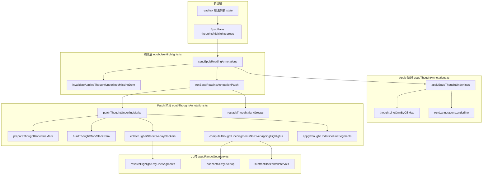
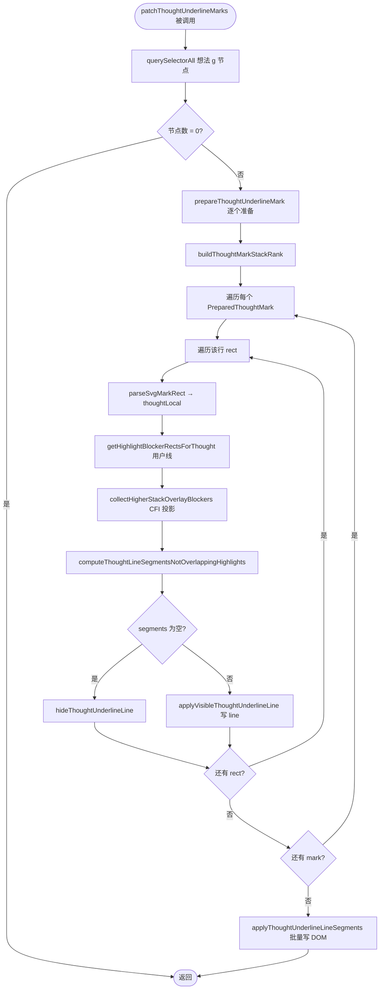
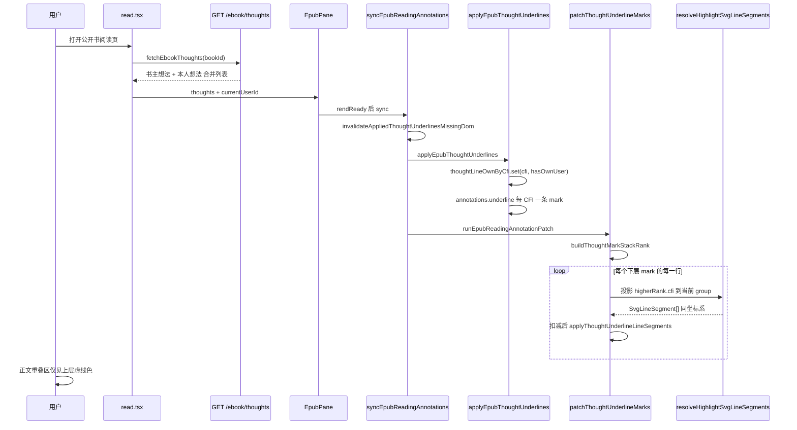

# 公开书多人想法虚线叠层 Bug — 实现思路与修复过程

> **状态**：已落地（2026-07-02）  
> **需求摘要**：公开书合并书主/读者想法后，正文想法虚线出现「断续橙点」「灰橙双线叠加」「本人交叉想法仍叠加」；须按 spec 叠层规则只显示上层虚线。  
> **关联需求**：[ebook-分享.md](../../ebook/EPUB引用分享.md) §5.3 叠层与命中

## 延伸阅读

- [EPUB公开想法下划线覆盖.md](../../ebook/EPUB公开想法下划线覆盖.md) — **实现归档**：改动前后代码对比与逐段注释
- [EPUB标注分层.md](../epub/EPUB标注分层.md) — 用户线 / 想法线 / 播放层三层编排总览
- [EPUB标注epubjs基础.md](../epub/EPUB标注epubjs基础.md) — CFI、annotations.underline、marks-pane 原语
- [ebook-分享.md](../../ebook/EPUB引用分享.md) — 公开书 MVP 与 `#d97706` / `#797673` 色规范
- 源码主文件：`apps/frontend/src/views/ebook/utils/epub/mark/epubThoughtAnnotations.ts`

---

## 0. 读本文你将得到什么

- **三个递进现象** 各自根因：虚线被扣光、他人线盖不住、坐标系不一致导致 blocker 失效
- **一句话方案**：在 `patchThoughtUnderlineMarks` 中按 **叠层 rank** 决定谁在上；下层虚线用 **CFI→DOM→投影到当前 group** 的几何做水平区间扣减，而非直接比对各 mark 的 rect 属性
- **改哪些层**：仅前端 EPUB mark 工具（`epubThoughtAnnotations.ts` 为主，`epubUserHighlights.ts` sync 入口补 invalidation）
- **排查顺序**：数据是否到 → apply 是否建 mark → patch 是否扣错 → 坐标是否同系
- **最大风险**：`relocated` 后只 patch 不 apply 时 `thoughtLineOwnByCfi` 与 DOM 失步；用户划线仍按原规则盖住想法虚线

---

## 1. 需求与边界

### 1.1 用户故事

| 角色 | 场景 | 行为 | 期望结果 |
|------|------|------|----------|
| 读者 | 阅读公开书，段落有书主灰色想法虚线 | 在同段选中写本人想法并保存 | 重叠处 **仅琥珀色** `#d97706` 虚线，灰色 `#797673` 被盖住 |
| 读者 | 同段已有本人较短想法 | 再写较长/部分重叠的本人想法 | 重叠区 **一条** 虚线（短选区在上层优先可见/可点） |
| 书主 | 读自己公开源书，可见读者公开想法 | 浏览含多人想法的段落 | 虚线完整、不呈「断续点状」；非重叠区仍可见他人线 |
| 任意读者 | 同段有用户划线（高亮/直线下划线） | 查看想法虚线 | 与用户线重叠处想法虚线被盖住（**既有设计，非本 bug**） |

### 1.2 范围

| 在范围内 | 不在范围内（非目标） |
|----------|----------------------|
| 公开书合并 `listThoughts` 后 **多人 CFI 略不同** 的同段渲染 | 后端想法去重、CFI 归一化存储 |
| `patchThoughtUnderlineMarks` 叠层扣减与 `restackThoughtMarkGroups` | 改 `stroke-dasharray` 视觉样式 |
| `appliedRef` DOM 失步时强制重 apply | M1/M2 想法增量同步（另篇） |
| `currentUserId` 驱动的本人/他人色与 own 判定 | PDF 想法划线 |

### 1.3 约束与依赖

- **叠层 spec**（ebook-share §5.3）：正文 → 他人想法虚线 → **本人想法虚线** → 本人用户划线；命中优先级同序
- **epub.js**：每条想法一条 `annotations.underline` mark（`g.moke-epub-thought-ul`），多用户同段 = **多个独立 g**
- **几何管道**：`epubRangeGeometry.resolveHighlightSvgLineSegments` 将 CFI 投影到 **指定 group** 的 marks-pane 坐标
- **Ponytail**：不新增依赖；复用既有 `horizontalSvgOverlap` + `subtractHorizontalIntervals` 与用户线 blocker 同构

---

## 2. 方案总览（一句话 + 要点）

**一句话方案**：`apply` 阶段为每条 CFI 写入 `thoughtLineOwnByCfi`；`patch` 阶段先算 **叠层 rank**，对每个 mark 的每一行 rect，收集 **rank 更高** mark 的 CFI 几何（投影到当前 group），与用户线 blocker 一并做水平区间减法，再写 SVG `<line>` 虚线段。

| # | 设计要点 | 理由 |
|---|----------|------|
| 1 | **叠层 rank**：他人 < 本人；同 tier 内长选区 < 短选区（短在上） | 与 spec 与 `restackThoughtMarkGroups` 一致 |
| 2 | **blocker 用 CFI 投影**，不用他组 rect 原始 x/y | 不同 `g` 的 rect 属性不在同一坐标系，直接比会漏扣 |
| 3 | **仅下层被扣**；上层画满 | 「覆盖」= 下层不画重叠段，不是 z-index  alone |
| 4 | **同作者嵌套**不再单独走 `thoughtLineBlockerSources` 严格嵌套链 | 统一由 rank + 投影覆盖，避免跨用户误扣 |
| 5 | `isThoughtUnderlineMarkPresent` + invalidate | 防 `appliedRef` 有记录但 DOM 无 mark 时跳过 apply |

---

## 3. 现状与复用

| 能力 | 仓库中已有 | 本修复中的用法 |
|------|------------|----------------|
| 想法 apply | `applyEpubThoughtUnderlines` | 扩展 `thoughtLineOwnByCfi`；apply 前 DOM 校验 |
| 想法 patch | `patchThoughtUnderlineMarks` | **重写** blocker 来源为 `collectHigherStackOverlayBlockers` |
| 用户线扣想法 | `userHighlightBlockerSources` + `getHighlightBlockerRectsForThought` | 保持不变，仍在 patch 注入 |
| CFI→SVG 行几何 | `resolveHighlightSvgLineSegments(rend, group, cfi)` | **核心复用**：跨 mark 投影 |
| 水平扣减 | `computeThoughtLineSegmentsNotOverlappingHighlights` | 不变，合并 `userBlockers` + `stackBlockers` |
| 联合 sync | `syncEpubReadingAnnotations` | 增加 `invalidateAppliedThoughtUnderlinesMissingDom` |
| 翻页 patch | `installEpubUserHighlightPatchListeners` → `runEpubReadingAnnotationPatch` | 依赖 map + dataset 双源 own 判定 |
| 公开书想法合并 | `ebook.service listThoughts` | 数据侧无改动；bug 纯渲染 |

**调研结论**：私有书仅单人想法时，旧版「同作者严格嵌套 thoughtBlocker」足够；公开书引入 **多用户、同段不同 CFI** 后，(a) 跨用户误用嵌套判定会扣光虚线，(b) 仅 z-order 或同组 rect 互扣无法盖住异色线。不必改 epub.js  annotation 类型，在 patch 层用投影即可。

---

## 4. 故障现象与根因链（修复过程详述）

本节按 **实际排查时间线** 梳理，便于复现同类问题。

### 4.1 现象 A：虚线变成「断续橙点」或几乎看不见

**用户描述**：选中段落写想法后，侧栏有想法列表，正文只有稀疏橙色点线，而非完整虚线。例句：「黄局没回答这个问题，反而转过身……」

**表面猜测（已排除）**：

| 猜测 | 验证 | 结论 |
|------|------|------|
| 翻页后 DOM 失效，`appliedRef` 跳过 apply | 用户否认仅翻页问题 | 可作防御，非主因 |
| `stroke-dasharray: 1 6` 样式本身太稀 | 私有书同样式正常 | 非根因 |

**真实根因**：`patchThoughtUnderlineMarks` 内 `thoughtLineBlockerSources` 对 **所有严格嵌套** 的已画想法做水平扣减。公开书多人同段时，书主与读者 CFI 边界常差 1～2 个字符，`isCfiRangeStrictlyContained` 判为嵌套 → **后画 mark 每行被先画 mark 整行扣光**，只剩 `MIN_THOUGHT_LINE_SEGMENT_PX` 以上残段，视觉上像断续点。

**中间修复（部分有效）**：仅 **同 `userId`** 的严格嵌套才互挡 → 跨用户不再互扣，虚线恢复可见。但未解决「本人应盖住他人」。

### 4.2 现象 B：灰线橙线双线叠加（他人 + 本人）

**用户描述**：第二行同时可见灰色与橙色点线，像两条虚线叠在一起。

**中间修复尝试（失效）**：`collectOwnThoughtOverlayBlockers` — 收集本人 mark 的 `rect` 属性，在画他人线时作 blocker。

**失效原因**：每个 `annotations.underline` 是独立 `g`，其下 `rect` 的 `x/y` 处于 **各自 group 局部坐标**（或 epub.js 写入的相对值）。用 A 组 rect 的 `x=10` 与 B 组 rect 的 `x=10` 做 `horizontalSvgOverlap` **不代表屏幕同一位置**，重叠判断失败 → 他人线不被扣 → 双线叠加。

### 4.3 现象 C：本人两条交叉想法仍叠加

**用户描述**：自己的想法与自己的想法交叉，也出现双线。

**根因**：同 4.2 坐标问题 + 旧逻辑对 **同作者非嵌套 peer** 不互扣。仅调 z-index（`restackThoughtMarkGroups`）无法隐藏下层虚线（dash 半透明仍会透出）。

**最终修复**：见 §5～§6 — `collectHigherStackOverlayBlockers` + CFI 投影。

---

## 5. 架构图



**图内方法说明**：

| 方法 / 模块入口 | 功能 |
|-----------------|------|
| `syncEpubReadingAnnotations(...)` | 联合 sync 唯一入口：invalidate → apply 用户线/想法线 → 收集用户线 blocker → `runEpubReadingAnnotationPatch` |
| `invalidateAppliedThoughtUnderlinesMissingDom(rend, appliedRef)` | 若 `appliedRef` 有 CFI 但 marks-pane 无对应 `g`，删 ref 与 `thoughtLineOwnByCfi`，迫使下次 apply 重绘 |
| `applyEpubThoughtUnderlines(rend, thoughts, appliedRef, currentUserId)` | 按 CFI 分组；`annotations.underline` 创建/更新 mark；写入 `thoughtLineOwnByCfi`；签名未变且 DOM 在则 skip |
| `isThoughtUnderlineMarkPresent(rend, cfiRange)` | 遍历 rendition 各 iframe document 查 `dataset.epubcfi` 是否匹配 |
| `patchThoughtUnderlineMarks(root, rend)` | 单文档内遍历想法 `g`：prepare → 算 rank → 逐行扣减 → 写 line |
| `prepareThoughtUnderlineMark(groupEl, rend)` | 同步 rect/line；`resolveMarkSvgLineSegments` 校正多行几何 |
| `buildThoughtMarkStackRank(prepared)` | 按他人<本人、长<短排序，返回 `groupEl → rankIndex`（越大越在上层） |
| `collectHigherStackOverlayBlockers(item, thoughtLocal, prepared, rankByGroup, rend)` | 对 rank 更高的其他 mark，用 **other.cfi** 投影到 **item.groupEl** 坐标，收集与当前行 rect 相交的 blocker |
| `computeThoughtLineSegmentsNotOverlappingHighlights(thoughtRect, blockers)` | 将 blocker 转为水平区间，从 `[x, x+width]` 减去，得到可画虚线的线段数组 |
| `applyThoughtUnderlineLineSegments(item, perRectSegments)` | 创建/更新 SVG `<line>`，`applyVisibleThoughtUnderlineLine` 设颜色与 dash |
| `restackThoughtMarkGroups(rend)` | marks-pane 内 `appendChild` 重排 DOM，使上层 mark 后挂载、接收点击 |
| `resolveHighlightSvgLineSegments(rend, group, cfiRange)` | CFI→DOM Range→逐行 clientRect→转换到 **该 group 所属** marks-pane SVG 局部坐标 |

**读图要点**：

- **Apply 与 Patch 分离**：epub.js 只负责挂 `g`+`rect`；可见虚线全在 Patch 用 `<line>` 重画。
- **几何内核与编排解耦**：`epubRangeGeometry` 不知道本人/他人，只负责投影；叠层策略在 `epubThoughtAnnotations`。
- 用户线 blocker 在 Patch 前由 `setUserHighlightBlockerSourcesForThoughtPatch` 注入，与本修复正交。

---

## 6. 主流程图（Patch 扣减）



**图内方法说明**：

| 方法 | 功能 |
|------|------|
| `patchThoughtUnderlineMarks(root, rend)` | Patch 总控；对每个 iframe `document` 各跑一遍 |
| `prepareThoughtUnderlineMark(groupEl, rend)` | 清理旧 seg line；同步 rect；返回 `PreparedThoughtMark` |
| `buildThoughtMarkStackRank(prepared)` | 生成叠层序号；**序号大者覆盖序号小者** |
| `getHighlightBlockerRectsForThought(thoughtRect, sources)` | 从用户线 blocker 源筛出与当前行 y/x 相交的 rect |
| `collectHigherStackOverlayBlockers(...)` | 仅处理 `otherRank > itemRank`；`resolveHighlightSvgLineSegments(rend, item.groupEl, other.cfi)` |
| `computeThoughtLineSegmentsNotOverlappingHighlights(...)` | 合并 blockers → `subtractHorizontalIntervals` → `ThoughtLineSegment[]` |
| `hideThoughtUnderlineLine(line)` | 加 suppressed class，stroke 透明 |
| `applyVisibleThoughtUnderlineLine(line, segment, groupEl, cfi)` | 按 `isThoughtMarkLineOwn` 设 `#d97706` 或 `#797673` |

**读图要点**：

- **双重 blocker**：用户线 + 更高叠层想法；二者并集后一次扣减。
- segments 为空时仍保留透明 rect 热区（prepare 阶段），仅隐藏 line，点击命中仍可用。
- 流程对 `relocated` 触发的轻量 patch 与全量 sync 后 patch **同代码路径**。

---

## 7. 核心时序图（进入阅读页 → 合并想法 → 渲染）



**图内方法说明**：

| 方法 | 功能 |
|------|------|
| `fetchEbookThoughts(bookId)` | 前端 service；读书记录场景后端已 merge 书主+读者 |
| `syncEpubReadingAnnotations(...)` | EpubPane `useEffect` 在 thoughts/highlights/`currentUserId` 变化时调用 |
| `invalidateAppliedThoughtUnderlinesMissingDom` | sync 开头；防止 DOM 被 epub 重建后虚线丢失 |
| `applyEpubThoughtUnderlines` | 写 `thoughtLineOwnByCfi`；`lineOwn` 写入 mark data；创建 epub.js underline |
| `runEpubReadingAnnotationPatch` | patch 用户线 + 注入 userHighlightBlockers + patch 想法线 + restack |
| `buildThoughtMarkStackRank` | 决定投影方向：只从 **更高** rank 向 **更低** rank 扣减 |
| `resolveHighlightSvgLineSegments(rend, item.groupEl, other.cfi)` | **关键**：用当前 group 为坐标基准解析 **他人/上层** CFI 的行盒 |

**读图要点**：

- 数据合并发生在 **API**；渲染不区分想法来自哪条 `bookId`，只认 `userId` 与 `cfiRange`。
- Patch 在 apply **之后**同步执行；翻页时 `relocated` 常只触发 patch，依赖已填充的 `thoughtLineOwnByCfi` + `dataset.thought-line-own`。
- 用户新建想法后 `setThoughts` → Pane effect → 全链路再跑一遍，新 CFI mark 参与 rank 计算。

---

## 8. 叠层 rank 与投影算法（实现细节）

### 8.1 叠层序号 `compareThoughtMarksForStacking`

排序键（升序 = 下层先画、上层后画）：

1. **他人** (`lineOwn=false`) 在前，**本人** (`lineOwn=true`) 在后  
2. 同 tier 内 **跨度大**（`thoughtMarkSpanLength` 大）在前，**跨度小** 在后 → **短选区 rank 更高**  
3. CFI 字符串长度 tie-break

与 `restackThoughtMarkGroups` 使用相同 own 判定：`isThoughtMarkLineOwn(cfi, groupEl)` — 优先 `thoughtLineOwnByCfi`，fallback `dataset.thought-line-own`。

### 8.2 投影扣减 `collectHigherStackOverlayBlockers`

对每个当前行 `thoughtLocal`：

```
blockers = []
for other in prepared:
  if other.rank <= item.rank: continue
  segs = resolveHighlightSvgLineSegments(rend, item.groupEl, other.cfi)
  for seg in segs:
    if horizontalSvgOverlap(thoughtLocal, seg):
      blockers.push(seg)
return blockers
```

**为何必须用 `item.groupEl` 作为投影目标**：

- `resolveHighlightSvgLineSegments` 内部：`resolveCfiDomRange` → `resolveDomRangeSvgLineSegments(group, range)` → `clientRectToSvgLocalSegment(rect, svg, container)`，其中 `svg = findMarksPaneSvgFromGroup(group)`。
- 同一 CFI 投影到 **不同 group** 会得到 **同一 marks-pane 绝对坐标系** 下的行盒（与 group 无关，与 pane 的 svg/container 有关）。
- 旧方案读 `other.groupEl` 内 rect 的 attribute，未走 clientRect 管道，跨 group 不可比。

### 8.3 水平扣减（与用户线一致）

```typescript
// 伪代码，≤30 行
function computeSegments(thoughtRect, blockers) {
  const yLine = thoughtRect.y + thoughtRect.height + OFFSET;
  const intervals = blockers
    .map(b => horizontalSvgOverlap(thoughtRect, b))
    .filter(Boolean);
  return subtractHorizontalIntervals(thoughtRect.x, thoughtRect.x + thoughtRect.width, intervals)
    .map(([x1,x2]) => ({ x1, x2, y: yLine }));
}
```

### 8.4 `isThoughtMarkLineOwn` 双源

| 来源 | 何时有效 |
|------|----------|
| `thoughtLineOwnByCfi` | apply 后、同会话内 patch |
| `dataset[thought-line-own]` | relocated 仅 patch、map 缺项时 fallback |

避免 `?? true` 把他人线误判为本人（旧代码默认值会导致不扣他人 overlay）。

### 8.5 Apply 阶段防御

```typescript
if (appliedRef.get(cfi) === nextSig && isThoughtUnderlineMarkPresent(rend, cfi)) {
  continue; // 签名相同且 DOM 在，跳过
}
// 否则 remove + underline 重建
```

---

## 9. 模块职责与改动清单

| 模块 | 职责 | 改动 |
|------|------|------|
| `epubThoughtAnnotations.ts` | 想法 apply/patch/叠层 | **主改**：rank、投影 blocker、own 双源、DOM invalidate |
| `epubUserHighlights.ts` | 联合 sync | 调用 `invalidateAppliedThoughtUnderlinesMissingDom` |
| `epubRangeGeometry.ts` | CFI/Range/SVG 几何 | **无改**（复用 `resolveHighlightSvgLineSegments`） |
| `EpubPane.tsx` | 传 `thoughts`/`currentUserId` | **无改** |
| `ebook.service.ts` | 合并 listThoughts | **无改** |

---

## 10. 分阶段修复步骤（实际落地顺序）

| 阶段 | 目标 | 任务 |
|------|------|------|
| M1 | 恢复跨用户可见 | - [x] `thoughtBlockers` 仅同作者严格嵌套（中间态） |
| M2 | 本人盖住他人 | - [x] 引入 `ownThoughtOverlayBlockers`（后因坐标 bug 废弃） |
| M3 | 坐标正确 | - [x] `collectHigherStackOverlayBlockers` + CFI 投影 |
| M4 | 本人交叉不叠 | - [x] 统一 rank；移除独立 `thoughtLineBlockerSources` 链 |
| M5 | DOM 失步 | - [x] `isThoughtUnderlineMarkPresent` + invalidate |
| M6 | 回归 | - [ ] 公开书双人同段、本人嵌套、翻页 relocated、用户线共存 |

---

## 11. 关键决策与备选方案

| 决策 | 选用 | 备选 | 为何不选备选 |
|------|------|------|--------------|
| 跨 mark 几何 | CFI 投影到当前 group | 直接读各 group rect 属性 | 坐标系不一致，已证实双线叠加 |
| 覆盖语义 | 下层不画重叠段 | 仅 `restack` z-index | dash 半透明，下层仍可见 |
| 同作者 peer | rank 统一扣减 | 仅严格嵌套 CFI | peer 交叉仍双线 |
| 跨用户嵌套 | 不按嵌套扣；按 rank（本人>他人） | 继续 `isCfiRangeStrictlyContained` | 会扣光整行虚线 |
| 存储层 CFI 归一化 | 不改 | 保存时 merge 同段 CFI | 范围大、影响协作编辑语义 |

---

## 12. 风险、边界与待确认

| 项 | 等级 | 说明 | 缓解 |
|----|------|------|------|
| CFI 解析失败 | 中 | 投影返回 `[]`，下层不被扣 | fallback `readMarkSvgLineSegmentsFromRects(other.groupEl)` 仅同 group 可靠 |
| 性能 | 低 | O(n²) mark 两两投影 | 单页 mark 数通常 <50；可缓存 cfi→segs |
| 用户线盖住想法 | 低 | 设计如此 | 文档与验收区分 |
| map 与 DOM 不同步 | 中 | 仅 patch 时 apply skip | invalidate + dataset fallback |

**待确认**：

- [ ] 书主读 **源书**（非读书记录）时，读者想法是否也 merge 进 `listThoughts` 并走同一 patch（当前后端支持，需 E2E 点验）

---

## 13. 验收清单

| # | 用例 | 步骤 | 期望 |
|---|------|------|------|
| AC1 | 他人灰线 + 本人橙线同段 | 读者在书主已标注段落写本人公开发送想法 | 重叠行 **仅橙色** 虚线；非重叠段灰线仍在 |
| AC2 | 本人两条交叉想法 | 同段先写短句想法再写长段想法 | 交叉区 **一条** 虚线；短选区优先点击打开对应 cluster |
| AC3 | 虚线完整 | 仅他人想法、无本人 | 每行 **完整** 灰色虚线，非断续点 |
| AC4 | 翻页回来 | 标注后翻章再返回 | 虚线仍正确；无双线 |
| AC5 | 用户线共存 | 同段有用户高亮/下划线 | 高亮压住想法虚线；不与 AC1 冲突 |

---

## 14. 预估改动面（已实现）

| 类型 | 路径 |
|------|------|
| 前端主改 | `apps/frontend/src/views/ebook/utils/epub/mark/epubThoughtAnnotations.ts` |
| 前端次改 | `apps/frontend/src/views/ebook/utils/epub/mark/epubUserHighlights.ts` |
| 实现后归档（可选） | `docs/ebook/EPUB公开想法下划线覆盖.md`（`implementation-doc-from-diff`） |
| 影响面（可选） | `docs/impact/epub-public-thought-underline.md` |

---

## 15. 调试手册（复现同类 bug 时怎么用）

1. **侧栏有想法，正文无线** → DevTools 搜 `moke-epub-thought-ul`；无则 apply 失败或 `appliedRef` 误 skip → 查 `isThoughtUnderlineMarkPresent`。  
2. **有线但像点状** → 看 patch 是否过度扣减 → 临时注释 `stackBlockers` 与 `userBlockers` 二分。  
3. **双色叠加** → 查 `collectHigherStackOverlayBlockers` 是否被调用；断点看 `resolveHighlightSvgLineSegments(rend, **当前group**, other.cfi)` 与 `thoughtLocal` 的 x 区间是否相交。  
4. **色错（该灰却橙）** → 查 `thoughtLineOwnByCfi.get(cfi)` 与 `currentUserId` 传入 `applyEpubThoughtUnderlines`。  
5. **翻页才坏** → 仅 patch 路径；确认 `dataset.thought-line-own` 是否随 epub 重建丢失。

---

（本文档基于 2026-07 公开书想法划线 bug 修复会话整理；落地后以 `epubThoughtAnnotations.ts` 源码为准。）
