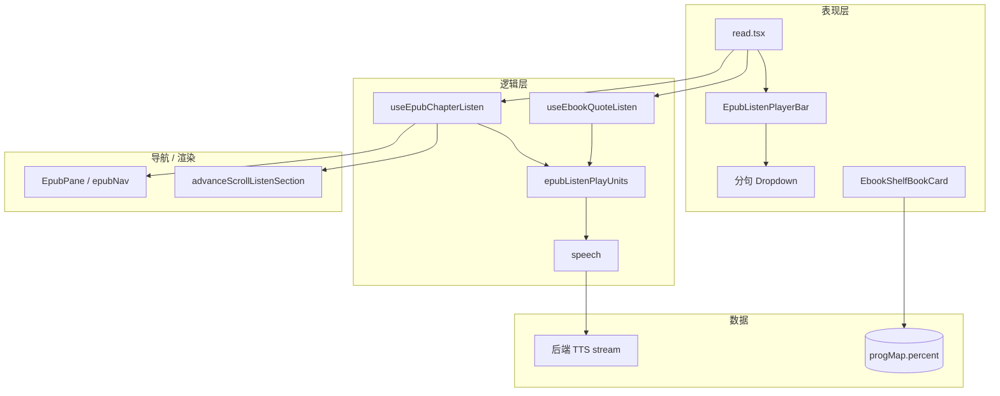
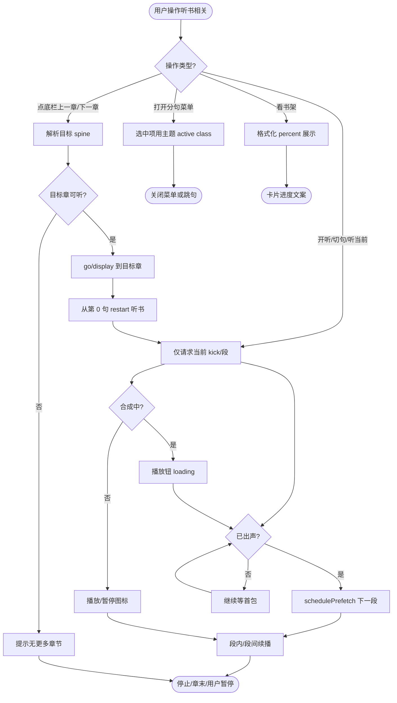
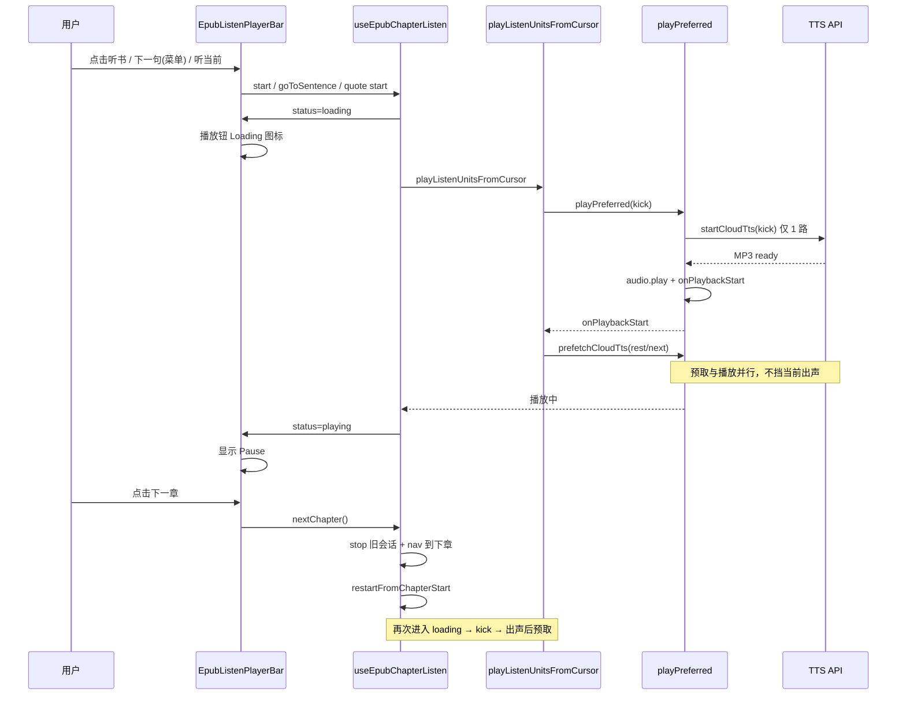
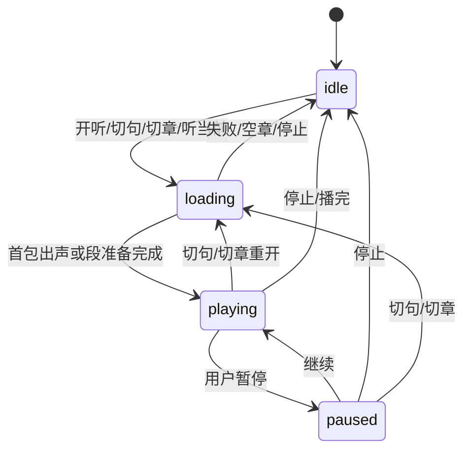

# 听书播放优化 — 实现思路

> **状态**：需求主项已落地（**预取错开**、**播放钮 loading**、**底栏切章**、**软暂停/系统媒体**、**分句选中跟阅读字色**、**书架进度取整**）；装饰符不读等仍见 demand  
> **日期**：2026-07-15  
> **需求摘要**：优化 Web/桌面 EPUB **听书 / 听当前** 体验——预取错开带宽、请求中播放钮 loading、底栏改切章、分句菜单跟主题色、书架进度百分比去冗长小数。

## 延伸阅读

- **本轮已落地播放修复总索引**：[EPUB听书播放修复2026-07.md](../../ebook/EPUB听书播放修复2026-07.md)
- [EPUB听书栏章节导航.md](../../ebook/EPUB听书栏章节导航.md) — **已落地**：底栏上一章/下一章（对应本文 M2）
- [EPUB听书软暂停.md](../../ebook/EPUB听书软暂停.md) — **已落地**：软暂停续播 + Media Session
- [EPUB听书播放加载.md](../../ebook/EPUB听书播放加载.md) — **已落地**：当前 TTS pending → 播放钮 Spinner
- [EPUB Chrome列表激活主题.md](../../ebook/EPUB Chrome列表激活主题.md) — **已落地**：分句/目录选中态跟阅读字色
- [电子书书架进度百分比.md](../../ebook/电子书书架进度百分比.md) — **已落地**：书架进度百分比取整
- [EPUB听书段落朗读.md](../epub/EPUB听书段落朗读.md) — 按段 TTS 规划（实现见 ebook 同名专题）
- [EPUB听书启动后预取.md](../../ebook/EPUB听书启动后预取.md) — 出声后预取（对应本文 M1 预取部分）
- [EPUB 听书句间云端预取](../../ebook/EPUB听书云端预取影响.md) — `prefetchCloudTts` 基线
- [阅读进度保存](../ebook/电子书阅读进度保存.md) — `percent` 写入与书架展示
- 开发者手册：[EPUB听书开发.md](../../ebook/developer/EPUB听书开发.md)

---

## 0. 读本文你将得到什么

- **问题**：听书首包与预取抢带宽；合成 pending 时播放钮无 loading；底栏切句不符合「听章」心智；分句菜单选中项不跟阅读主题；书架进度小数过长。
- **一句话方案**：在现有双 Hook + 播放条 + 云端 TTS 链路上，做 **预取时机 / UI 反馈 / 切章导航 / 主题色 / 进度展示** 五处最小扩展，不改后端 TTS、不改小程序。
- **改动层**：几乎全在 `apps/frontend` 听书 UI/Hook/Util + 书架进度展示一行格式化。
- **阶段**：M1 预取与 loading → M2 切章 → M3 分句菜单主题 → M4 进度百分比（可并行）。
- **最大风险**：切章与「句菜单 / 自动续播」语义冲突；loading 边界要覆盖 kick/rest 全段请求，避免闪烁。

---

## 1. 需求与边界

### 1.1 用户故事

| 角色 | 场景 | 行为 | 期望结果 |
|------|------|------|----------|
| 读者 | 首次点听书 / 切句 / 听当前 | 开始合成 | Network 先 1 路当前段，出声后再预取；首包更快 |
| 读者 | TTS 还在请求、尚未出声 | 看底栏 | 播放钮呈 **loading**，可感知等待 |
| 读者 | 听书连播 | 点底栏 ◀ ▶ | **上一章 / 下一章** 并从该章第 0 句开听（非上下句） |
| 读者 | 换阅读背景色 | 打开分句菜单 | 当前句 item 的背景/字色 **跟随主题** |
| 读者 | 书架看进度 | 浏览卡片 | 已读百分比为整数或至多 1 位小数，无冗长尾巴 |

### 1.2 范围

| 在范围内 | 不在范围内（非目标） |
|----------|----------------------|
| Web + Tauri：`useEpubChapterListen` / `useEbookQuoteListen` / `EpubListenPlayerBar` / `epubListenPlayUnits` / `speech` 预取钩子 | 微信小程序听书 |
| 播放钮 loading（`status === 'loading'` 或更细粒度 pending） | 后端新增 TTS API；改三源选路策略 |
| 底栏 ◀▶ 改为切章；句级跳转仍保留在分句菜单 | 重新设计整条播放条布局 |
| 分句菜单选中态跟 `epub` chrome / bgTheme | 全局主题系统重构 |
| 书架 `percent` 展示格式化 | 进度计算算法大改（除非确认是写入端浮点问题） |

### 1.3 约束与依赖

- 听书 ↔ 听当前 **互斥** 不变。
- 预取不得拉长「首包出声」等待；优先保证 **单路 HTTP 完成后再并行预取**。
- Ponytail：无新依赖；切章复用现有 `display` / `advanceScrollListenSection` / TOC 跳转经验。
- i18n：切章文案需 zh/en key（`prevChapter` / `nextChapter`）。

---

## 2. 方案总览（一句话 + 要点）

**一句话方案**：以 `onPlaybackStart` 错开预取；loading 绑合同步 `status`；底栏导航升维到章并用分句菜单承接句跳转；菜单选中态吃 chrome token；书架 `percent` 显示层 `round`。

| # | 设计要点 | 理由 |
|---|----------|------|
| 1 | 预取挂在 **出声后**（已有 `onPlaybackStart` 方向） | 首包独占带宽 |
| 2 | loading = 合成未出声 / 会话 `loading` | 用户可见等待，勿与暂停混淆 |
| 3 | ◀▶ = `prevChapter` / `nextChapter` | 需求明确；句跳转仍在列表 |
| 4 | 选中 item 用主题 class / CSS 变量 | 与阅读背景一致 |
| 5 | 展示层格式化 percent | 改动面最小；先修 UI 再查写入 |

---

## 3. 现状与复用

| 能力 | 仓库中已有 | 本需求中的用法 |
|------|------------|----------------|
| 听书 Hook | `apps/frontend/src/views/ebook/hooks/useEpubChapterListen.ts` | 扩展切章 API；保持 `status: loading\|playing\|paused` |
| 听当前 Hook | `apps/frontend/src/views/ebook/hooks/useEbookQuoteListen.ts` | 共用播放条 loading；切章是否适用听当前 **待确认**（听当前多为选区，默认不切章） |
| 段循环 + 预取 | `.../listen/epubListenPlayUnits.ts` | 调整 `schedulePrefetch` 时机（出声后） |
| 云端 TTS / 预取 | `apps/frontend/src/utils/speech.ts`（`prefetchCloudTts`、`onPlaybackStart`） | 复用；保证回调在 `audio.play()` 成功后 |
| 播放条 | `.../listen/EpubListenPlayerBar.tsx` | loading UI；◀▶ 文案与回调改切章 |
| 章续播 | `advanceScrollListenSection` / `waitForNextSection` | 切「下一章」可对齐自动续播逻辑 |
| 目录跳转 | `epubNav.go` + `restartFromChapterStart` | 切章可参考 TOC 听书重开 |
| 菜单选中样式 | `epubReaderChromeListItemActiveClass`（`.../reader/epubReaderSettings.ts`） | 检查是否随 bgTheme / `menuChromeStyle` 变化；不足则补 token |
| 进度 percent | `ebookStore.progMap` + `EbookShelfBookCard` | 展示 `Math.round(pct)` 或 `toFixed(0)` |
| 阅读页进度写入 | `read.tsx` `onCfi` / `EpubPane` percentage | 若写入已是 0–100 浮点，优先展示层处理 |

**调研结论**：五条需求都能落在现有听书与书架模块上，**无需新后端**。预取错开与 `onPlaybackStart` 已在近期实现方向上对齐，文档按「巩固 + 验收」+ 其余四条规划。听当前是否暴露切章需产品确认（建议：**仅听书底栏切章**）。

---

## 4. 架构图



**图内方法说明**：

| 方法 / 模块入口 | 功能 |
|-----------------|------|
| `useEpubChapterListen` | 听书会话：start/stop/pause、句游标、倍速、`status`；本需求新增 `prevChapter` / `nextChapter` |
| `useEbookQuoteListen` | 听当前会话；与听书互斥；本需求主要吃共用播放条 loading |
| `playListenUnitsFromCursor` | kick + 段循环；在 `onPlaybackStart` 后 `schedulePrefetch` |
| `prefetchCloudTts` | 发起/复用云端 TTS inflight，不直接播放 |
| `playPreferred` | 选路云端/本机；成功出声后触发 `onPlaybackStart` |
| `advanceScrollListenSection` | 连续滚动下挂载下一节 document，供自动续播与切下一章复用 |
| `EpubListenPlayerBar` | 底栏：播放/停止/进度文案/分句菜单/倍速/◀▶ |
| `EbookShelfBookCard` | 书架卡片展示 `prog.percent` |

**读图要点**：

- 预取与 loading 在 **Logic ↔ TTS**；切章在 **Hook ↔ Nav**；主题在 **Bar/Menu**；进度小数在 **Shelf**，与听书链路解耦。
- 无新后端服务；TTS 仍走现有 stream。

---

## 5. 主流程图



**图内方法说明**：

| 方法 | 功能 |
|------|------|
| `playListenUnitsFromCursor` | 驱动 kick → 出声 → 预取 → rest/下一段 |
| `schedulePrefetch` / `prefetchCloudTts` | 在出声后预取，写入 `prefetchedByText` |
| `playPreferred(..., onPlaybackStart)` | 首包独占网络；play 成功回调预取 |
| `prevChapter` / `nextChapter` 🆕 | 计算邻章 → 导航 → `restartFromChapterStart` 类开听 |
| `restartFromChapterStart` | 目录/切章后从当前可见章第 0 句开听（已有，可复用） |
| `epubReaderChromeListItemActiveClass` | 分句菜单选中态样式入口 |
| 书架 `formatProgressPercent(pct)` 🆕 | 将浮点 percent 格式化为展示字符串 |

**读图要点**：

- 预取与 loading 同一条「开听」路径上的两个观测点：**请求中** vs **已出声**。
- 切章是独立分支，成功后汇入同一开听路径。
- 主题与书架进度不进入 TTS 循环。

---

## 6. 核心时序图



**图内方法说明**：

| 方法 | 功能 |
|------|------|
| `startFromCurrentPosition` / `goToSentence` | 听书开听或切句重开循环 |
| `playListenUnitsFromCursor` | 编排 kick 与预取时机 |
| `playPreferred` | 合成并播放；触发 `onPlaybackStart` |
| `prefetchCloudTts` | 预取 rest/下一单元，命中 inflight/缓存则复用 |
| `nextChapter` 🆕 | 底栏切章入口 |
| `restartFromChapterStart` | 跳转落地后从章首第 0 句开听 |

**读图要点**：

- Happy path 强调 **先 1 路 kick，出声后再预取**。
- 切章复用 restart，不新开一套 TTS 协议。
- loading → playing 与首包就绪对齐，避免「有声仍 loading」或「无声已可点暂停」过久。

---

## 7. 状态机（听书会话 UI）



**图内方法说明**：

| 方法 | 功能 |
|------|------|
| `syncState({ status })` | Hook 内合并听书 UI 状态 |
| `stopInternal` | 置 idle 并停播 |
| `pause` / `resume` | playing ↔ paused |
| `togglePlay` | 播放钮：pause 或 resume（loading 时禁用或忽略） |

**读图要点**：loading 是「请求/准备」态，播放钮应显示 spinner 且不宜当成暂停。

---

## 8. 模块职责与接口草图

### 8.1 模块一览

| 模块 | 职责 | 新增/改动 | 预估路径 |
|------|------|-----------|----------|
| `epubListenPlayUnits` | 预取时机 | 扩展 | `apps/frontend/src/views/ebook/utils/epub/listen/epubListenPlayUnits.ts` |
| `speech` | `onPlaybackStart` | 扩展（多已具备） | `apps/frontend/src/utils/speech.ts` |
| `useEpubChapterListen` | 切章 API | 扩展 | `.../hooks/useEpubChapterListen.ts` |
| `EpubListenPlayerBar` | loading + 切章按钮 | 扩展 | `.../components/listen/EpubListenPlayerBar.tsx` |
| `read.tsx` | 接线切章回调 | 扩展 | `.../views/ebook/read.tsx` |
| i18n | 切章文案 | 扩展 | zh/en ebook 词条 |
| `EbookShelfBookCard` | percent 格式化 | 扩展 | `.../shelf/EbookShelfBookCard.tsx` |
| 分句菜单样式 | 主题选中态 | 扩展 | PlayerBar + `epubReaderChrome*` |

### 8.2 关键接口（草图）

```typescript
// 听书 Hook 对外（增量）
type ChapterListenApi = {
  // 已有
  status: 'idle' | 'loading' | 'playing' | 'paused';
  prevSentence: () => void;
  nextSentence: () => void;
  goToSentence: (i: number) => void;
  // 新增
  prevChapter: () => void;
  nextChapter: () => void;
};

// 播放条：loading 时按钮
// disabled={loading} + 子节点为 Loader2 旋转图标（而非 Play）

// 进度展示
function formatShelfPercent(pct: number): string {
  const n = Math.min(100, Math.max(0, pct));
  return String(Math.round(n)); // 或保留 1 位：n.toFixed(1)
}
```

### 8.3 数据模型

| 字段/实体 | 来源 | 存储 | 说明 |
|-----------|------|------|------|
| `status` | Hook | 内存 | 驱动底栏 loading/播放图标 |
| `spineIndex` | Hook / rendition | 内存 | 切章与进度文案「第 N 章」 |
| `sentenceIndex` | Hook | 内存 | 分句菜单与文案；切章后归 0 |
| `prog.percent` | 阅读进度 | Store / 远端 | 书架展示；本需求优先格式化显示 |

---

## 9. 分阶段实现步骤

| 阶段 | 目标 | 交付物 | 依赖 |
|------|------|--------|------|
| M1 | 预取错开 + 播放钮 loading | 首包单路；loading 可见 | — |
| M2 | 底栏切章 | ◀▶ 换章并开听 | M1 的 restart/loading 稳定 |
| M3 | 分句菜单主题色 | 换背景后选中态正确 | —（可与 M2 并行） |
| M4 | 书架百分比 | 无冗长小数 | —（可并行） |

### M1

- [ ] 确认 `playListenUnitsFromCursor` 仅在 `onPlaybackStart`（及 await 兜底）后 `schedulePrefetch`
- [ ] Network：开听/切句/听当前首包阶段仅 1 条 TTS stream
- [ ] `status=loading` 时播放钮显示 Loading 图标（非灰态 Play）
- [ ] 出声后切 `playing`；暂停/停止行为不变

### M2

- [ ] Hook 实现 `prevChapter` / `nextChapter`（边界 Toast）
- [ ] 播放条 ◀▶ 改绑切章 + i18n
- [ ] 分句菜单仍可 `goToSentence`
- [ ] 听当前：确认不展示切章或 disabled（待确认）

### M3

- [ ] 复现：换阅读背景后打开分句菜单看选中项
- [ ] 选中态改用随 `menuChromeStyle` / bgTheme 的 token
- [ ] 深/浅/纸色等预设各验一次

### M4

- [ ] 书架进度文案 `round`（或统一 `formatShelfPercent`）
- [ ] 抽查写入值：若已是整数仍异常，再查 `onCfi` 写入路径（待确认）

---

## 10. 关键决策与备选方案

| 决策 | 选用 | 备选 | 为何不选备选 |
|------|------|------|--------------|
| 预取时机 | 出声后预取 | 固定 delay 并行 | delay 仍与首包抢带宽；出声后更贴网络空闲 |
| 底栏 ◀▶ | 切章 | 切句保留在底栏、切章放别处 | 需求明确改底栏；句跳转已有菜单 |
| loading | 复用 `status=loading` | 另加 `pendingTts` | 状态机已有 loading；避免双状态 |
| 百分比 | 展示层 round | 改后端存整数 | 展示层即可；存库精度可保留 |
| 听当前切章 | 默认不做 | 强制切章 | 听当前基于选区，切章语义弱 |

---

## 11. 风险、边界与待确认

| 项 | 等级 | 说明 | 缓解 |
|----|------|------|------|
| 切章丢倍速/句菜单状态 | 中 | restart 曾踩过 rate 重置 | 保留 `rateRef`；测倍速 |
| 连续滚动 trim 后切章失败 | 中 | 与 TOC 听书同类问题 | 复用 `restartFromChapterStart` + display |
| loading 闪烁 | 低 | 段间极短 loading | 仅 kick/seek/切章置 loading；段内续播保持 playing |
| 预取过晚导致段间空隙 | 中 | 出声后才预取 | kick 播放时长通常覆盖 rest 合成；验收听感 |
| percent 根因在写入 | 低 | 展示修了仍可能不准 | M4 待确认写入是否 0–1 与 0–100 混用 |

**待确认**：

- [ ] 听当前底栏是否隐藏切章按钮？（验证：产品一句确认；默认隐藏）
- [ ] 百分比展示要整数还是一位小数？（验证：看书架设计稿 / 现网样例）
- [ ] 「上一章」无内容时：Toast 还是 disabled？（验证：与自动续播到顶行为对齐）

---

## 12. 验收清单

| # | 用例 | 步骤 | 期望 |
|---|------|------|------|
| AC1 | 首包单路 | 开听后立刻看 Network | 出声前仅 1 条 TTS；之后才出现预取 |
| AC2 | 切句/听当前 | 上下句菜单、听当前 | 同 AC1，无双路抢首包 |
| AC3 | Loading | 弱网开听 | 播放钮为 loading，出声后变暂停 |
| AC4 | 切章 | 听书中点 ▶ | 进入下一章并从第 1 句（索引 0）播；倍速保持 |
| AC5 | 切章边界 | 首章点 ◀ / 末章点 ▶ | Toast 或 disabled，不崩 |
| AC6 | 分句菜单主题 | 换背景色后打开菜单 | 当前句背景/字色与主题一致 |
| AC7 | 书架进度 | 看多本书进度文案 | 无 `12.345678%` 类超长小数 |
| AC8 | 回归 | 暂停/停止/目录听书切章/回到播放 | 行为与改前一致或按既有修复 |

---

## 13. 预估改动面（实现阶段参考）

| 类型 | 路径（预估） |
|------|--------------|
| 前端 | `epubListenPlayUnits.ts`、`speech.ts`、`useEpubChapterListen.ts`、`EpubListenPlayerBar.tsx`、`read.tsx`、i18n、`EbookShelfBookCard.tsx`、可选 chrome class |
| 后端 | 无 |
| 文档（实现后） | `docs/ebook/` 听书播放优化归档；可链本篇 |

---

（本文档为规划态实现思路；落地后以源码与 `docs/ebook/` 专题为准）
